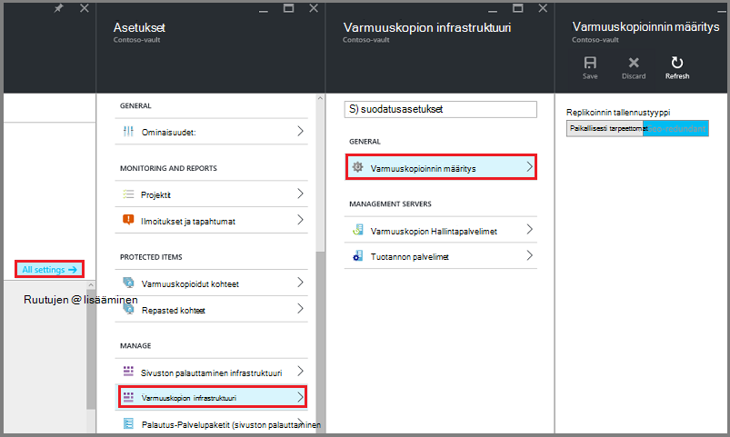
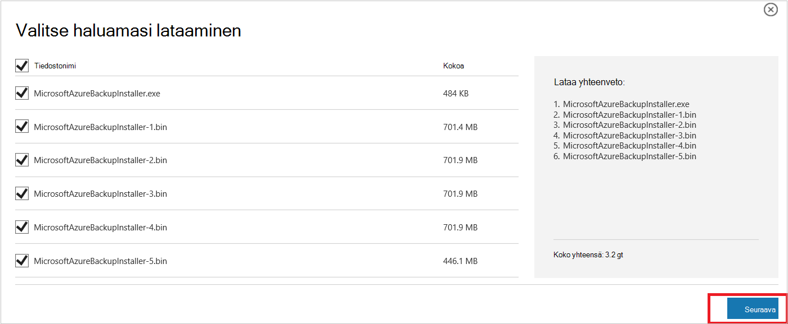
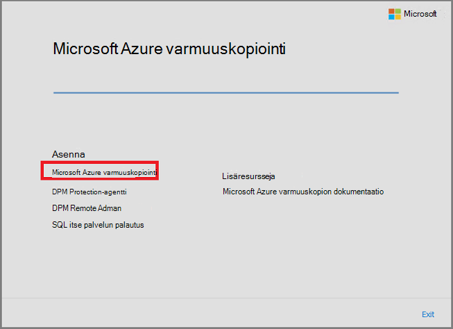
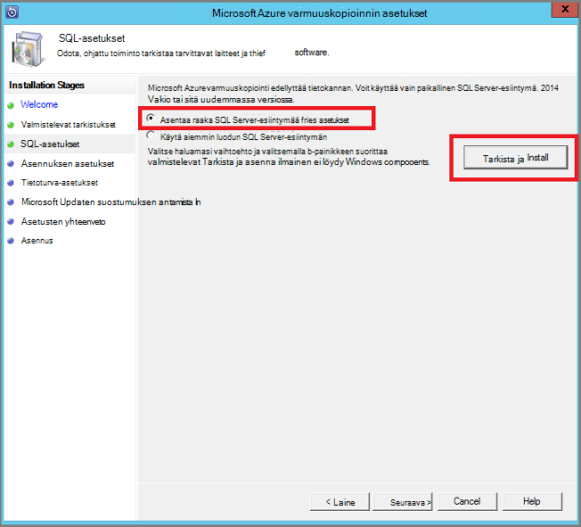
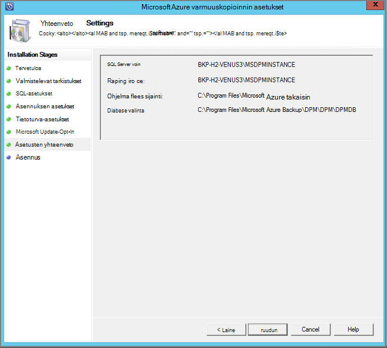
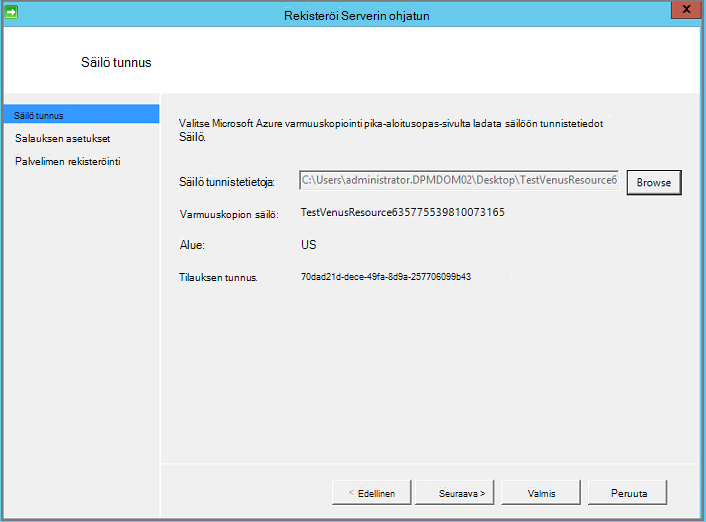

<properties
  pageTitle="Azure varmuuskopiointi Serverissä työmääriä varmuuskopioida ympäristön valmisteleminen | Microsoft Azure"
  description="Paikallinen ympäristö valmistellaan suojaa tai varmuuskopioida työmääriä Azure palvelimen avulla."
  services="backup"
  documentationCenter=""
  authors="PVRK"
  manager="shivamg"
  editor=""
  keywords="Azure varmuuskopio-palvelimeen. suojaa työmääriä; työmääriä varmuuskopiointi"/>

<tags
  ms.service="backup"
  ms.workload="storage-backup-recovery"
  ms.tgt_pltfrm="na"
  ms.devlang="na"
  ms.topic="article"
  ms.date="09/27/2016"
  ms.author="jimpark;trinadhk;pullabhk;markgal"/>

# <a name="preparing-to-back-up-workloads-using-azure-backup-server"></a>Valmistellaan varmuuskopioida työmääriä Azure varmuuskopiointi palvelimen käyttäminen

> [AZURE.SELECTOR]
- [Azure varmuuskopion Server](backup-azure-microsoft-azure-backup.md)
- [SCDPM](backup-azure-dpm-introduction.md)
- [Azure varmuuskopion Server (perinteinen)](backup-azure-microsoft-azure-backup-classic.md)
- [SCDPM (perinteinen)](backup-azure-dpm-introduction-classic.md)

Tässä artikkelissa kerrotaan, miten voit varmuuskopioida työmääriä Azure varmuuskopiointi Serverissä lisätietoja ympäristön valmistelemisesta. Azure varmuuskopiointi-palvelimeen voit suojata sovelluksen toiminnoista, kuten Hyper-V VMs, Microsoft SQL Server, SharePoint Server, Microsoft Exchange ja Windows-asiakkaiden yksittäisen konsolin. Voit myös suojata server (IaaS)-toiminnoista, kuten VMs Azure-tietoihin.

> [AZURE.NOTE] Azure on kaksi käyttöönoton mallien luominen ja käyttäminen resurssit: [Resurssienhallinta ja perinteinen](../resource-manager-deployment-model.md). Tässä artikkelissa on tietoja ja menetelmiä VMs käyttöön Resurssienhallinta mallin palauttamista varten.

Azure varmuuskopion palvelimen perii suuren kuormituksen varmuuskopion toiminnot-tietojen suojauksen Manager (DPM). Tässä artikkelissa on linkkejä DPM ohjeissa kerrotaan joistakin jaetun toimintoja. Vaikka Azure palvelimen jakaa paljon samalla tavalla kuin DPM. Azure varmuuskopiointi-palvelin ei ole nauha varmuuskopioida eikä sen integroida System Center.

## <a name="1-choose-an-installation-platform"></a>1. Valitse asennuksen-ympäristössä

Ensimmäinen askel saaminen Azure varmuuskopiointi-palvelimen ja käytössä on Windows Server määrittäminen. Azure tai paikalliseen voi olla palvelimellesi.

### <a name="using-a-server-in-azure"></a>Azure palvelimen avulla

Valittaessa server Azure palvelimen suorittamista varten on suositeltavaa valikoima Windows Server 2012 R2-palvelinkeskuksen aloitetaan. [Luo ensimmäinen Windows virtuaalikoneen Azure-portaalissa](..\virtual-machines\virtual-machines-windows-hero-tutorial.md), artikkelissa opetusohjelma käytön aloittamista käsittelevät suositellut virtuaalikoneen Azure-tietokannassa, vaikka et ole aiemmin käyttänyt Azure ennen. Suositeltu vähimmäisvaatimukset palvelimen virtuaalikoneen (AM) on oltava: A2 vakio 2 Sydämiä ja 3,5 Gigatavua RAM-Muistia.

Monta nuances on suojaaminen työmääriä Azure varmuuskopiointi-palvelimen kanssa. [Asenna DPM Azure virtuaalikoneen muodossa](https://technet.microsoft.com/library/jj852163.aspx), on artikkelissa auttaa kerrotaan nämä nuances. Lue tämän artikkelin kokonaan ennen kuin otat koneen.

### <a name="using-an-on-premises-server"></a>Paikallisen palvelimen käyttäminen

Jos et halua suorittaa perus server Azure-tietokannassa, voit suorittaa palvelimen Hyper-V AM, VMware AM tai fyysinen host. Palvelimen laitteiston suositellut vähimmäisvaatimukset on 2 Sydämiä ja 4 gt RAM-Muistia. Seuraavassa taulukossa on lueteltu tuetut käyttöjärjestelmät.

| Käyttöjärjestelmä        | Käyttöympäristö           | TUOTE  |
| :------------- |-------------| :-----|
|Windows Server 2012 R2 ja uusimmat SPs| 64-bittinen| Vakio-Palvelinkeskukseen, Foundation|
|Windows Server 2012 ja uusimmat SPs|    64-bittinen| Palvelinkeskukseen, Foundation-standardin|
|Windows Storage Server 2012 R2 ja uusimmat SPs  |64-bittinen|    Vakio-työryhmä|
|Windows Storage Server 2012 ja uusimmat SPs |64-bittinen |Vakio-työryhmä|


Voit deduplicate käyttämällä Windows Server kopioinnin peruuttaminen DPM-tallennustilan. Lisätietoja [DPM ja kopioinnin peruuttaminen](https://technet.microsoft.com/library/dn891438.aspx) yhteistoiminta kun Hyper-V VMs käyttöön.

> [AZURE.NOTE]  Et voi asentaa Azure palvelimen toimialueen ohjauskoneen käynnissä tietokoneessa.

Azure varmuuskopiointi palvelin on liitettävä toimialueeseen. Jos aiot siirtää palvelimen toinen toimialue, on suositeltavaa liittyä palvelimeen uuden toimialueen ennen asennusta Azure palvelimen. Siirtäminen aiemmin Azure varmuuskopiointi Server-koneen verkkotunnuksen käyttöönoton jälkeen *ei tueta*.

## <a name="2-recovery-services-vault"></a>2. palautus Services säilöön

Tietojen lähettäminen Azure tai säilyttää sen paikallisesti, ohjelmiston on oltava yhdistettynä Azure. Enemmän tietyn, Azure palvelimen koneen on rekisteröitävä palautus-palveluiden säilö.

Voit luoda palautus-palveluiden säilö seuraavasti:

1. Kirjautuminen [Azure portal](https://portal.azure.com/).

2. Valitse toiminto-valikosta valitsemalla **Selaa** ja kirjoita resurssien luetteloa, **Palautus-palvelut**. Kun alat kirjoittaa, luettelo suodattaa syötettäsi perusteella. Valitse **palautus-palveluiden säilö**.

     <br/>

    Palautus Services vaults luettelo tulee näkyviin.

3. **Palautus Services vaults** -valikosta **Lisää**.

    

    Palautus Services säilö-sivu avautuu, kannattaa antaa **nimi**, **tilauksen**, **resurssiryhmä**ja **sijainti**.

    

4. Kirjoita kutsumanimi tunnistavan säilö **nimi**. Nimen on oltava yksilöllinen Azure-tilausta. Kirjoita nimi, joka sisältää 2 – 50 merkkiä. Se on alettava kirjaimella, ja voivat sisältää vain kirjaimia, numeroita ja väliviivoja.

5. Valitse **tilaus** tilaukset käytettävissä luettelossa. Jos et ole varma, mikä tilaus käyttämään, käytä oletusarvoa (tai ehdotetut) tilaukseen. On useita vaihtoehtoja vain, jos organisaation tilillä on liitetty useita Azure-tilauksia.

6. **Resurssiryhmä** käytettävissä luettelo resurssin ryhmien tai valitse **Uusi** ja luo uusi resurssiryhmä. Resurssiryhmät Lisätietoja on artikkelissa [Azure resurssien hallinnan yleiskatsaus](../azure-resource-manager/resource-group-overview.md)

7. Valitse **sijainti** Valitse säilö maantieteellinen alue.

8. Valitse **Luo**. Se voi viedä aikaa palautus Services säilö luodaan. Seurata tilailmoitukset portaalin oikeassa yläkulmassa-alueella.
Kun oman säilö on luotu, se avautuu portaalissa.

### <a name="set-storage-replication"></a>Tallennustilan replikoinnin määrittäminen

Tallennustilan replikoinnin-asetuksen avulla voit valita geo ylimääräinen ja paikallisesti tarpeettomat välillä. Oman säilö on oletusarvoisesti geo ylimääräinen. Jätä arvoksi geo ylimääräinen, jos kyseessä on ensisijainen varmuuskopiointi-vaihtoehto. Jos haluat halvempaa vaihtoehto, joka ei ole aivan kestävät, valitse paikallisesti ylimääräinen. Lue lisätietoja [geo tarpeettomat](../storage/storage-redundancy.md#geo-redundant-storage) ja [paikallisesti tarpeettomat](../storage/storage-redundancy.md#locally-redundant-storage) tallennusasetukset [Azuren tallennustilaan replikoinnin yleiskatsaus](../storage/storage-redundancy.md).

Voit muokata tallennustilan replikoinnin asetusta seuraavasti:

1. Valitse oman säilö Avaa säilö Raporttinäkymät-ikkunan ja asetukset-sivu. Jos **asetukset** -sivu ei avaudu, valitse **kaikki asetukset** säilö Raporttinäkymät-ikkunan.

2. Valitse **asetukset** -sivu **Varmuuskopiointi infrastruktuurin** > **Varmuuskopioinnin määrittäminen** Avaa **Varmuuskopio-määritys** -sivu. Valitse **Varmuuskopiointi määritys** -sivu lisääminen säilöön replikoinnin tallennuspaikka.

    

    Sen jälkeen, että säilö tallennustilan-vaihtoehdon valitseminen olet valmis AM liitettävä säilö. Aloita suhteen olisi löydä ja rekisteröi Azure-virtuaalikoneissa.

## <a name="3-software-package"></a>3 ohjelmistopakettia

### <a name="downloading-the-software-package"></a>Ohjelmiston lataaminen
1. Kirjautuminen [Azure portal](https://portal.azure.com/).

2. Jos sinulla on jo palautus Services säilö on avoinna, siirry vaiheeseen 3. Jos ei ole palautus-palveluiden Avaa säilöön, mutta Azure-portaalissa on toiminto-valikosta valitsemalla **Selaa**.

    - Kirjoita resurssit-luettelosta **Palautus-palvelut**.
    - Kun alat kirjoittaa, luettelo suodattaa syötettäsi perusteella. Kun näet **palautus Services vaults**, napsauttamalla sitä.

    

    Palautus Services vaults luettelo tulee näkyviin.

    - Palautus Services vaults luettelosta säilöön.

    Valitun säilö raporttinäkymät-ikkuna avautuu.

    

3. Asetukset-sivu avautuu oletusarvoisesti. Jos se on suljettu, valitse **asetukset** , Avaa asetukset-sivu.

    

4. Valitse **varmuuskopion** ja Avaa ohjattu aloittaminen **Käytön aloittaminen** .

    

5. Aloittaminen, joka avautuu varmuuskopiointi tavoitteet näytön on automaattisesti valittuna.
    

    Valitse **Varmuuskopiointi tavoitteet** -osiossa *paikallisen* *jossa havainnollistamiseen on käynnissä*.

    

6. Valitse työmääriä suojaa Azure palvelimen käyttäminen *tietoja toiminnoista, jotka haluat suojata* ja valitse **OK**.

    > [AZURE.NOTE] Jos aiot suojaaminen vain tiedostot ja kansiot, sitten käyttäminen on suositeltavaa Azure Backup agentti. Jos aiot suojaa enemmän kuin vain tiedostojen ja kansioiden työmääriä tai tulevaisuudessa Jos aiot Laajenna suojaus tarpeiden mukaan, valitse näistä toiminnoista.

    Tämä muuttaa aloittaminen ohjattu suojaaminen työmääriä paikallisen from Azure infrastruktuurin valmistautuminen.

    

7. Valitse **Valmistele infrastruktuuri** -sivu, joka avautuu, **Lataa** linkit asentaa Azure palvelimen ja lataa säilö tunnistetiedot. Voit käyttää säilö tunnistetietojen rekisteröinti Azure varmuuskopiointi palvelimen palautus services säilö aikana. Linkeistä pääset missä ohjelmistopaketti voi ladata Download Centeristä.

    

8. Valitse kaikki tiedostot ja valitse **Seuraava**. Kaikki tiedostot, jotka tulevat lataussivulle Microsoft Azure varmuuskopiointi ja Vie kaikki tiedostot samassa kansiossa.

    

    Lataa kaikki tiedostot ladattavan tiedoston koko on yhdessä > 3G, voi kestää jopa 60 minuutin suorittamiseen ladattavaksi linkki 10 Mbps.


### <a name="extracting-the-software-package"></a>Poimii ohjelmistopaketti

Kun olet ladannut kaikki tiedostot, valitse **MicrosoftAzureBackupInstaller.exe**. **Microsoft Azure varmuuskopiointi ohjatun** Pura asennustiedostot sijaintiin, voit määrittää käynnistyy. Etene ohjatun toiminnon, ja valitse sitten Aloita poiminnan **Pura** -painiketta.

> [AZURE.WARNING] Pura asennustiedostot edellyttää vähintään 4 gt vapaata tilaa.


Kun purkaminen käsitellä valmis, Käynnistä juuri poimitun *setup.exe* napsauttamalla **Valmis** -painiketta ja aloita asennus Microsoft Azure palvelimen valintaruutu.

### <a name="installing-the-software-package"></a>Ohjelmistopaketin asentaminen

1. Valitse **Microsoft Azure varmuuskopiointi** käynnistää ohjatun määritystoiminnon.

    

2. Valitse Tervetuloa-ikkunassa **Seuraava** -painiketta. Tämä avaa *Valmistelevat tarkistaa* -osassa. Tässä näytössä valitsemalla **Tarkista** -painikkeen voit selvittää, jos Azure palvelimen laitteiston ja ohjelmiston edellytykset täyttyvät. Jos kaikki edellytykset eivät ole täyty onnistuneesti, näyttöön tulee sanoma, joka ilmaisee, että tietokone vastaa. Napsauta **Seuraava** -painiketta.

    

3. Microsoft Azure varmuuskopiointi-palvelin vaatii SQL Server Standard- ja Azure palvelimen asennuspaketin sisältää yhdistettyjä tarvittavat SQL Server-binaaritiedostoja tarvitaan. Azure varmuuskopiointi Server-asennuksessa käynnistettäessä tulee Valitse vaihtoehto **Asenna uusi SQL Server-esiintymää tämän määritykset** ja valitse **Tarkista ja asenna** -painike. Kun edellytykset on asennettu onnistuneesti, valitse **Seuraava**.

    

    Jos virhe ilmenee suositus Käynnistä tietokone uudelleen, kiellä ja sitten **Tarkista uudelleen**.

    > [AZURE.NOTE] Azure varmuuskopiointi-palvelin ei toimi remote SQL Server-esiintymän. Azure palvelimen käyttämän esiintymää on oltava paikallinen.

4. Microsoft Azure varmuuskopiointi tiedostojen asennuksen sijainti ja valitse **Seuraava**.

    

    Taittopöydällä sijainti on takaisin Azure ylöspäin. Varmista taittopöydällä sijainti on vähintään 5 prosenttia suunniteltu pilveen varmuuskopioitavien tietojen. Levyn suojaus-erillisten levyjen on määritettävä, kun asennus on valmis. Saat lisätietoja tallennustilan jakavat, [Määritä tallennustilan jakavat ja levytilasta](https://technet.microsoft.com/library/hh758075.aspx).

5. Rajoitettu paikallisten käyttäjätilien vahva salasana ja valitse **Seuraava**.

    

6. Valitse, haluatko *Microsoft Updaten* avulla voit tarkistaa päivitykset ja valitse **Seuraava**.

    >[AZURE.NOTE] On suositeltavaa ottaa Windows Update-sivuston uudelleenohjaus Microsoft Update, joka tarjoaa suojaus ja tärkeät päivitykset Windows ja muihin ohjelmiin, kuten Microsoft Azure varmuuskopiointi Server.

    

7. Tarkista *Yhteenveto asetukset* ja valitse **Asenna**.

    

8. Asennus tapahtuu vaiheet. Ensimmäisessä vaiheessa Microsoft Azure palautus palvelut-agentti asennettu palvelimeen. Ohjatun toiminnon tarkistaa myös Internet-yhteys. Jos Internet-yhteys on käytettävissä voit jatkaa asennusta, jos et, anna välityspalvelimen tiedot, joista Internet-yhteys.

    Seuraavaksi voit määrittää Microsoft Azure palautus palvelut-agentti. Osana kokoonpano on säilö tunnistetietoja rekisteröidä palautus services säilö tietokone. Voit antaa myös salasana ja salaus/salauksen purkaminen Azure ja asiakkaan tilojen välillä lähetettävät tiedot. Voit automaattisesti Luo salasana tai anna oman vähintään 16-merkkisen salasana. Jatka ohjatun toiminnon, kunnes agentti on määritetty.

    

9. Microsoft Azure varmuuskopiointi palvelimen rekisteröinti onnistuu, kun yleinen ohjattu asennus etenee asennuksesta ja määrityksestä ja SQL Server Azure palvelimen osat. SQL Server-osan asennus on valmis, kun Azure palvelimen osat on asennettu.

    


Kun asennus vaihe on valmis, tuotteen työpöydän kuvakkeet luotu sekä. Kaksoisnapsauta juuri käynnistää tuotteen-kuvaketta.

### <a name="add-backup-storage"></a>Lisää tallennustilaa varmuuskopiointi

Ensimmäinen varmuuskopio on käytettävissä säilössä kiinnitetty varmuuskopion Server Azure-koneeseen. Saat lisätietoja lisäämisestä levyjen [määrittäminen tallennustilan jakavat ja levytilasta](https://technet.microsoft.com/library/hh758075.aspx).

> [AZURE.NOTE] Haluat lisätä varmuuskopion tallennustilaa, vaikka tietojen lähettäminen Azure. Azure varmuuskopion palvelimen nykyisen arkkitehtuuri Azure varmuuskopion säilö pitää tiedot *toisen* kopion, kun paikallinen tallennus pitää varmuuskopio ensimmäisen (ja pakollinen).

## <a name="4-network-connectivity"></a>4 verkkoyhteyden

Azure palvelimen vaativat tuotteen onnistuisi Azure varmuuskopiointi-palveluun. Tarkista, onko koneessa on yhteys Azure, käytä ```Get-DPMCloudConnection``` cmdlet-komento, varmuuskopiointi palvelimen PowerShellin Azure-konsolissa. Jos yhteys on luotu, cmdlet-komento, tulos on tosi muulla ei ole yhteys.

Yhtä aikaa Azure tilaus on oltava kunnossa-tilaan. Saat lisätietoja tilauksen tilan ja hallita sitä, kirjaudu sisään [tilauksen portal]( https://account.windowsazure.com/Subscriptions).

Kun tiedät tilan Azure yhteydet ja Azure-tilauksen, voit selvittää, varmuuskopiointi ja palauttaminen-toiminto tarjoaa vaikutus alla olevassa taulukossa.

| Yhteyden tila | Azure-tilaus | Azure varmuuskopiointi| Varmuuskopiointi-levylle | Azure palauttaminen | Palauttaa levyltä |
| -------- | ------- | --------------------- | ------------------- | --------------------------- | ----------------------- |
| Yhdistetty | Aktiivinen | Sallittuja | Sallittuja | Sallittuja | Sallittuja |
| Yhdistetty | Vanhentunut | Pysäytetty | Pysäytetty | Sallittuja | Sallittuja |
| Yhdistetty | Käyttömahdollisuus purettu | Pysäytetty | Pysäytetty | Poistaa pysäytetty ja Azure palauttamisen pisteet | Pysäytetty |
| Kadonneiden connectivity > 15 päivää | Aktiivinen | Pysäytetty | Pysäytetty | Sallittuja | Sallittuja |
| Kadonneiden connectivity > 15 päivää | Vanhentunut | Pysäytetty | Pysäytetty | Sallittuja | Sallittuja |
| Kadonneiden connectivity > 15 päivää | Käyttömahdollisuus purettu | Pysäytetty | Pysäytetty |  Poistaa pysäytetty ja Azure palauttamisen pisteet | Pysäytetty |

### <a name="recovering-from-loss-of-connectivity"></a>Valitse menettäminen palauttaminen
Jos sinulla on palomuuri tai välityspalvelin, joka on estää käytön Azure, on whitelist palomuurin tai välityspalvelimen profiilin seuraavat toimialueen osoitteet:

- WWW.msftncsi.com
- \*. Microsoft.com-sivustosta
- \*. WindowsAzure.com
- \*. microsoftonline.com
- \*. windows.net

Kun yhteys Azure on palautettu Azure varmuuskopiointi Server-tietokoneessa, toiminnoista, joita voidaan suorittaa määräytyvät Azure tilauksen osavaltion mukaan. Edellä olevassa taulukossa on tietoja kun tietokone on "yhdistetty" sallitut toiminnot.

### <a name="handling-subscription-states"></a>Tilauksen osavaltioiden käsittely

On mahdollista tehdä Azure tilauksen *vanhentunut* tai *käyttömahdollisuus purettu* tilasta *aktiivista* tilaa. Kuitenkin tässä on joitakin vaikutukset tuotteen toiminnan samalla, kun tila ei ole *käytössä*:

- Tilauksen *käyttömahdollisuus purettu* menettää toimintoja ajaksi, joka on käyttömahdollisuus purettu. Valitse ottaminen *aktiivinen*, varmuuskopiointi ja palauttaminen tuotteen toimintoja on uudelleen käyttöön. Paikallisen levyn varmuuskopiotiedot voi hakea myös jos se on riittävän suuri säilytysaika kanssa uudelleen. Varmuuskopiotiedot Azure-tietokannassa on kuitenkin toimi menetetään, kun tilaus siirtyy *käyttömahdollisuus purettu* -tilaan.
- *Vanhentunut* -tilauksen menettää toiminnot vain, kunnes se on tehty *aktiivinen* uudelleen. Tilaus on *vanhentunut* aikajaksolle ajoitettu varmuuskopiot ei suoriteta.


## <a name="troubleshooting"></a>Vianmääritys

Jos Microsoft Azure varmuuskopion palvelimen epäonnistuu virheellisten aikana asennuksen vaiheessa (tai varmuuskopiointi ja palauttaminen), tutustu tämän [virheen koodit asiakirjan](https://support.microsoft.com/kb/3041338) .
Voit myös katsoa [Azure varmuuskopiointi liittyvät kysymykset ja vastaukset](backup-azure-backup-faq.md)


## <a name="next-steps"></a>Seuraavat vaiheet

Saat yksityiskohtaiset tiedot [DPM lisätietoja ympäristön](https://technet.microsoft.com/library/hh758176.aspx) valmistelemisesta Microsoft TechNet-sivustossa. Se sisältää myös tuetut määritykset, joina Azure palvelimen voidaan ottaa käyttöön ja käyttää tietoja.

Nämä artikkelit avulla voit saada tarkempaa tietoa työmäärää suojauksen Microsoft Azure varmuuskopiointi Serverin avulla.

- [SQL Server varmuuskopiointi](backup-azure-backup-sql.md)
- [SharePoint server varmuuskopiointi](backup-azure-backup-sharepoint.md)
- [Vaihtoehtoinen palvelin varmuuskopiointi](backup-azure-alternate-dpm-server.md)
