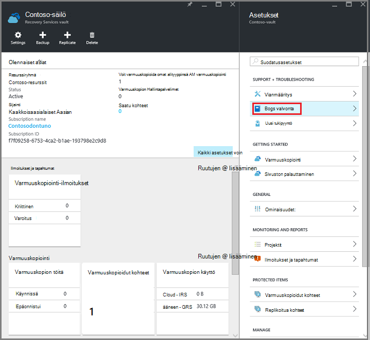
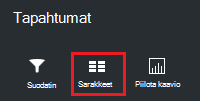

<properties
   pageTitle="Näytön Resurssienhallinta käyttöön virtual machine-varmuuskopiot | Microsoft Azure"
   description="Seurata tapahtumien ja ilmoitukset Resurssienhallinta käyttöön virtual machine-varmuuskopiot. Lähetä sähköpostia ilmoitusten perusteella."
   services="backup"
   documentationCenter="dev-center-name"
   authors="markgalioto"
   manager="cfreeman"
   editor=""/>

<tags
ms.service="backup"
ms.workload="storage-backup-recovery"
ms.tgt_pltfrm="na"
ms.devlang="na"
ms.topic="article"
ms.date="08/25/2016"
ms.author="trinadhk; giridham;"/>

# <a name="monitor-alerts-for-azure-virtual-machine-backups"></a>Azure virtual machine-varmuuskopiot ilmoitusten näyttö

Ilmoitukset ovat vastaukset, että tapahtuman kynnysarvo täyttyessä tai keskittimien-palvelusta. Tietää, kun ongelmia alku voi olla ehdottoman tärkeää pitäminen liiketoiminnan kustannuksia. Ilmoitusten yleensä ilmene aikataulun ja siten on hyvä tietää mahdollisimman pian jälkeen ilmoitukset. Esimerkiksi kun varmuuskopiointi ja palauttaminen työ epäonnistuu, ilmoituksen ilmenee virhe viiden minuutin kuluessa. Säilö Raporttinäkymät-ikkunan varmuuskopiointi ilmoitukset-ruutu näyttää kriittinen ja varoitustason tapahtumat. Varmuuskopiointi ilmoitusasetusten näet kaikki tapahtumat. Mutta Mitä teen, jos ilmoituksen ilmenee, kun käytät eri ongelma? Jos et tiedä, kun ilmoituksen tapahtuu, se voi olla vähäisiä määrittämällä tai se heikentää tiedot. Varmista, että oikeat henkilöt ovat tietoisia ilmoituksen -, kun se esiintyy, Lähetä sähköpostitse ilmoitukset-palvelun määrittäminen. Lisätietoja sähköposti-ilmoitusten määrittämisestä on artikkelissa [Määritä ilmoitukset](backup-azure-monitor-vms.md#configure-notifications).

## <a name="how-do-i-find-information-about-the-alerts"></a>Mistä löydän lisätietoja ilmoituksia?

Voit tarkastella tietoja tapahtuma, jonka palautti ilmoituksen, sinun on avattava varmuuskopiointi ilmoitukset-sivu. Avaa varmuuskopio ilmoitukset-sivu kahdella tavalla: joko varmuuskopiointi-ilmoitukset-ruutu säilö koontinäytön tai ilmoitukset ja tapahtumat-sivu.

Voit avata varmuuskopiointi ilmoitukset-ruutu varmuuskopiointi ilmoitukset-sivu:

- Valitse säilö Raporttinäkymät-ikkunan **Varmuuskopiointi ilmoitukset** -ruudun **Kriittinen** tai **Varoitus** , voit tarkastella kyseisiä vakavuus toiminnallisia tapahtumat.

    


Voit avata varmuuskopiointi ilmoitukset-sivu ilmoitukset ja tapahtumat-sivu:

1. Valitse **Kaikki asetukset**säilö Raporttinäkymät-ikkunan. 

2. Valitse **asetukset** -sivu **ilmoitukset ja tapahtumat**. 

3. Valitse **Varmuuskopiointi ilmoitukset** **ilmoitukset ja tapahtumat** -sivu. 

    **Varmuuskopiointi-ilmoitukset** -sivu aukeaa ja näyttää suodatetut ilmoituksia.

    

4. Voit tarkastella tietyn merkillä, tapahtumat-luettelosta yksityiskohtaisia tietoja napsauttamalla ilmoitusta voit avata sen **tiedot** -sivu.

    

    Luettelossa näkyvät määritteet mukauttamiseen nähdä [Näytä Lisää tapahtuman määritteet](backup-azure-monitor-vms.md#view-additional-event-attributes)

## <a name="configure-notifications"></a>Ilmoitusten määrittäminen

 Voit määrittää ilmoituksia, jotka on tapahtunut edellisen tunnin tai tietyntyyppisten tapahtumien toteutuessa sähköposti-ilmoitukset lähetetään palvelu.

Sähköposti-ilmoitusten ilmoitusten määrittäminen

1. Varmuuskopiointi-ilmoitukset-valikosta **ilmoitusten määrittäminen**

    

    Määritä ilmoitukset-sivu avautuu.

    

2. **Valitse sähköposti-ilmoituksissa, määritä-ilmoitukset-sivu.**

    Vastaanottajat ja vakavuus valintaikkunat on tähti vieressä, koska nämä tiedot tarvitaan. Anna vähintään yksi sähköpostiosoite ja valitse vähintään yksi vakavuus.

3. Kirjoita **vastaanottajien (sähköposti)** -valintaikkunassa, joka vastaanottaa ilmoituksia sähköpostiosoitteet. Käytä muotoa: username@domainname.com. Useita sähköpostiosoitteita erotetaan toisistaan puolipisteellä (;).

4. Valitse **Ilmoita** -alueella **Kohti ilmoitus** Lähetä ilmoitus, kun määritetyn ilmoituksen ilmenee tai lähettää yhteenveto edellisen tunnin **Tunnin välein käsittely** .

5. Valitse vähintään yksi tasoja, jonka haluat käynnistävän sähköposti-ilmoituksen **vakavuus** -valintaikkunasta.

6. Valitse **Tallenna**.
### <a name="what-alert-types-are-available-for-azure-iaas-vm-backup"></a>Ilmoitusten tyypeistä Azure IaaS AM varmuuskopion?
| Ilmoitusten taso  | Ilmoitusten vastaanottaminen |
| ------------- | ------------- |
| Kriittinen | Varmuuskopioinnin palautus-virhe  |
| Varoitus  | Ei mitään |
| Tiedoksi  | Ei mitään  |

### <a name="are-there-situations-where-email-isnt-sent-even-if-notifications-are-configured"></a>Missä tilanteissa, joissa sähköpostin ei ole lähetetty vaikka ilmoitukset on määritetty?

Tilanteita, joissa ilmoituksen ei lähetetä, vaikka ilmoitukset on määritetty oikein. Seuraavat tilanteet uusien sähköpostien ilmoitukset ei lähetetä välttämiseksi ilmoitusten vähentämiseksi:

- Jos ilmoitukset on määritetty tunnin välein käsittely ja ilmoituksen käynnistyy ja ratkaista tunnin kuluessa.
- Työ on peruutettu.
- Varmuuskopiointityön käynnistyy ja sitten epäonnistuu, ja toisen varmuuskopiointityön on käynnissä.
- Resurssienhallinta käyttävä AM varmuuskopiointi käynnistyy, mutta AM ei enää ole.

## <a name="customize-your-view-of-events"></a>Tapahtumien näkymän mukauttaminen

**Valvontalokien** asetus sisältyy ennalta määritetyt tietyt suodattimet ja sarakkeiden näyttäminen toiminnallisia tapahtumatiedot. Voit mukauttaa näkymää niin, että kun **tapahtumat** -sivu avautuu, se näyttää haluamasi tiedot.

1. [Säilö Raporttinäkymät-ikkunan](./backup-azure-manage-vms.md#open-a-recovery-services-vault-in-the-dashboard)Etsi ja valitse **Valvontalokien** Avaa **tapahtumat** -sivu.

    

    **Tapahtumat** -sivu avautuu suodatettu vain nykyisen säilö toiminnallisia tapahtumat.

    

    Sivu näyttää luettelon kriittinen, virhe, varoitus ja tiedoksi tapahtumia edellisen viikon on tapahtunut. Loppupäivät on oletusarvo, Määritä **Suodatin**. **Tapahtumat** -sivu näkyy myös seuranta tapahtumat sattuessa palkkikaavio. Jos et halua nähdä palkkikaaviota, valitse **tapahtumat** -valikossa Poista käytöstä kaavion **Piilota kaavio** . Tapahtumien oletusnäkymässä näkyvät aukioloajat, taso, tilan, resurssien ja aika. Saat lisätietoja paljastaa tapahtuman määritteitä, osan [laajentaminen tapahtumatietojen](backup-azure-monitor-vms.md#view-additional-event-attributes).

2. Saat lisätietoja toiminnallisia tapahtuman **toiminto** -sarakkeessa Napsauta toiminnallisia tapahtumaa voit avata sen sivu. Sivu sisältää yksityiskohtaiset tiedot siitä, mitä. Tapahtumien on ryhmitelty niiden Korrelaatiotunnus ja loppupäivät on tapahtunut tapahtumaluettelon.

    

3. Voit tarkastella tietyn tapahtumat-luettelosta tarkkoja tietoja valitsemalla tapahtuman, voit avata sen **tiedot** -sivu.

    

    Tapahtuman tason tiedot tiedot saa yksityiskohtaiset. Jos mieluummin näe tässä mitä tietoja kuhunkin tapahtumaan ja haluat lisätä tässä paljon tietoja **tapahtumat** -sivu, katso osan [laajentaminen tapahtumatiedot](backup-azure-monitor-vms.md#view-additional-event-attributes).


## <a name="customize-the-event-filter"></a>Mukauta tapahtumasuodatin
**Suodattimen** avulla voit säätää tai valitse tietty sivu näkyviä tietoja. Jos haluat suodattaa tapahtumatiedot:

1. [Säilö Raporttinäkymät-ikkunan](./backup-azure-manage-vms.md#open-a-recovery-services-vault-in-the-dashboard)Etsi ja valitse **Valvontalokien** Avaa **tapahtumat** -sivu.

    

    **Tapahtumat** -sivu avautuu suodatettu vain nykyisen säilö toiminnallisia tapahtumat.

    

2. Valitse **tapahtumat** **Suodatin** , jota haluat, että sivu.

    

3. Säädä **taso**, **kellonaika kattavat**ja **soittajan** suodattimet **Suodatin** -sivu. Muut suodattimet eivät ole käytettävissä, koska ne on määritetty palautus Services säilö nykyinen tietoa.

    

    Voit määrittää tapahtuman **taso** : kriittinen-virhe, varoitus tai tiedottavat. Voit valita yhdistelmän tapahtuman tasoja, mutta sinulla on oltava vähintään yhden tason valittuna. Vaihda tason käyttöön tai poistaminen käytöstä. **Aika kattavat** suodattimen avulla voit määrittää tallentamiskäytäntöjen tapahtumien pituutta. Jos käytät mukautettua loppupäivät, voit määrittää alkamis- ja päättymisajat.

4. Kun olet valmis käyttämällä suodattimen toimintojen lokitiedot kyselyn, valitse **Päivitä**. Tulokset näkyvät **tapahtumat** -sivu.

    


### <a name="view-additional-event-attributes"></a>Näytä Lisää tapahtuman määritteet
**Sarakkeet** -painikkeen avulla voit ottaa muita tapahtuman määritteet näkyvät **tapahtumat** -sivu-luettelossa. Tapahtumien oletusarvo-luettelo näyttää toiminnon, taso, tilan, resurssien ja aika. Jos haluat ottaa käyttöön määritteitä:

1. Valitse **tapahtumat** -sivu- **sarakkeet**.

    

    **Valitse sarakkeet** -sivu avautuu.

    

2. Valitse määrite, valitse ensin-valintaruutu. Määritteen-valintaruutu ottaa käyttöön tai poistaa sen käytöstä.

3. Valitse **Palauta** vaihtamaan määritteiden **tapahtumat** -sivu-luetteloon. Lisäämällä tai poistamalla määritteet-luettelosta, kun avulla voit tarkastella tapahtuman määritteet uusi luettelo **Palauta** .

4. Valitse **Päivitä** tapahtuman määritteiden tiedot päivitetään. Seuraavassa taulukossa on tietoja kunkin määritteen.

| Sarakkeen nimi      |Kuvaus|
| -----------------|-----------|
| Toiminto|Toiminnon nimi|
| Taso|Toiminnon taso arvot voivat olla: tiedoksi, varoitus, virhe tai kriittinen|
|Tila|Toiminnon kuvaava tila|
|Resurssi|URL-Osoitetta, joka määrittää resurssin; tunnetaan myös nimellä Resurssitunnus|
|Aika|Aika-mitattuna nykyisen kellonajan, jolloin tapahtuma tapahtui|
|Soittajan|Kuka tai mitä kutsutaan tai käynnistää tapahtuman; voi olla järjestelmän tai käyttäjän|
|Aikaleima|Aika, jolloin tapahtuma on käynnistetty|
|Resurssiryhmä|Liitetty resurssiryhmä|
|Resurssilaji|Sisäinen resurssi työnkulkutyyppi resurssien hallinnan avulla|
|Tilauksen tunnus|Liitetty tilauksen tunnus|
|Luokka|Tapahtuman luokka|
|Korrelaatiotunnus|Aiheeseen liittyvät tapahtumat yleisiä tunnus|


## <a name="use-powershell-to-customize-alerts"></a>Mukauta ilmoitukset PowerShellin avulla
Saat mukautettu ilmoitus ilmoitukset työt-portaalissa. Saat nämä työt-määrittää PowerShell ilmoitusten sääntöjen toiminnallisia lokit-tapahtumat. Käytä *PowerShell versio 1.3.0 tai uudempi*.

Voit määrittää mukautetun ilmoituksen ilmoitus varmuuskopioinnin virheet, käytä seuraavaa komentosarjaa kuten-komentoa:

```
PS C:\> $actionEmail = New-AzureRmAlertRuleEmail -CustomEmail contoso@microsoft.com
PS C:\> Add-AzureRmLogAlertRule -Name backupFailedAlert -Location "East US" -ResourceGroup RecoveryServices-DP2RCXUGWS3MLJF4LKPI3A3OMJ2DI4SRJK6HIJH22HFIHZVVELRQ-East-US -OperationName Microsoft.Backup/RecoveryServicesVault/Backup -Status Failed -TargetResourceId /subscriptions/86eeac34-eth9a-4de3-84db-7a27d121967e/resourceGroups/RecoveryServices-DP2RCXUGWS3MLJF4LKPI3A3OMJ2DI4SRJK6HIJH22HFIHZVVELRQ-East-US/providers/microsoft.backupbvtd2/RecoveryServicesVault/trinadhVault -Actions $actionEmail
```

**ResourceId** : Saat ResourceId valvontalokien. ResourceId on toimintojen lokit resurssin sarakkeen URL-Osoitteen.

**OperationName** : OperationName on muodossa "Microsoft.RecoveryServices/recoveryServicesVault/*EventName*" joissa *EventName* voi olla:<br/>
- Rekisteröidy <br/>
- Unregister <br/>
- ConfigureProtection <br/>
- Varmuuskopiointi <br/>
- Palauttaminen <br/>
- StopProtection <br/>
- DeleteBackupData <br/>
- CreateProtectionPolicy <br/>
- DeleteProtectionPolicy <br/>
- UpdateProtectionPolicy <br/>

**Tila** : tuetut arvot ovat aloittaminen, onnistui tai epäonnistui.

**ResourceGroup** : Tämä on resurssiryhmä, johon resurssi kuuluu. Voit lisätä resurssiryhmä-sarakkeen luotu lokitiedot. Resurssiryhmä on käytettävissä tyyppisiä tapahtumatietoja.

**Nimi** : ilmoitusten säännön nimi.

**CustomEmail** : Määritä mukautettu sähköpostiosoite, johon haluat lähettää ilmoitusviesti

**SendToServiceOwners** : Tämä vaihtoehto lähettää ilmoitukset kaikki järjestelmänvalvojat ja apuyhteyshenkilöiden Tilauksen. Sen avulla voidaan **Uusi AzureRmAlertRuleEmail** cmdlet-komento

### <a name="limitations-on-alerts"></a>Ilmoitusten rajoitukset
Tapahtuman Hakupohjaisten ilmoitusten käsitellään seuraavat rajoitukset:

1. Valitse kaikki näennäiskoneiden palautus Services säilöön Hälytykset käynnistetään. Voit mukauttaa alijoukkoa näennäiskoneiden palautus Services säilöön ilmoitusta.
2. Tämä ominaisuus on esikatselussa. [Opi lisää](../monitoring-and-diagnostics/insights-powershell-samples.md#create-alert-rules)
3. Ilmoitukset lähetetään "alerts-noreply@mail.windowsazure.com". Tällä hetkellä ei voi muokata sähköpostin lähettäjä.


## <a name="next-steps"></a>Seuraavat vaiheet

Tapahtumalokien käyttöön hyvien jälkiselvittely ja valvonta backup toimille tuki. Kirjautunut seuraavat toimenpiteet:

- Rekisteröidy
- Unregister
- Määritä suojaus
- Varmuuskopiointi (molemmat ajoitettu sekä tarvittaessa varmuuskopiointi)
- Palauttaminen
- Lopeta suojaus
- Tietojen poistaminen
- Lisää käytäntö
- Poista käytäntö
- Päivitä käytäntö
- Työn peruuttaminen

Laaja selitys tapahtumat toiminnot ja valvontalokien yli Azure palveluja, on artikkelissa, [tapahtumien tarkasteleminen ja valvontalokien](../monitoring-and-diagnostics/insights-debugging-with-events.md).

Lisätietoja luomisesta uudelleen virtual koneen palautus pisteestä Tutustu [Palauttaa Azure VMs](backup-azure-restore-vms.md). Jos haluat lisätietoja siitä, että näennäiskoneiden suojaaminen, katso [ensin kohde: Varmuuskopioi VMs palautus Services säilö](backup-azure-vms-first-look-arm.md). Lisätietoja on artikkelissa [Hallitse Azure virtual machine-varmuuskopiot](backup-azure-manage-vms.md)AM varmuuskopioiden hallintatehtäviin.
