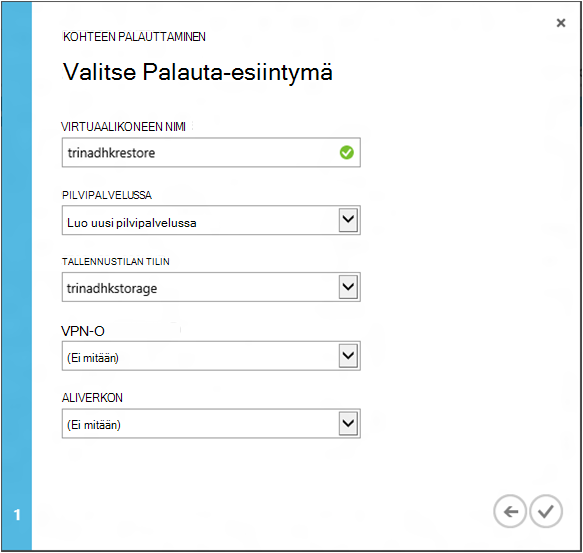

<properties
    pageTitle="Näennäiskoneiden palauttaminen varmuuskopiosta | Microsoft Azure"
    description="Lue, miten voit palauttaa Azure virtuaalikoneen palautuspiste"
    services="backup"
    documentationCenter=""
    authors="trinadhk"
    manager="shreeshd"
    editor=""
    keywords="Palauta varmuuskopio; palauttaminen; palautuspiste;"/>

<tags
    ms.service="backup"
    ms.workload="storage-backup-recovery"
    ms.tgt_pltfrm="na"
    ms.devlang="na"
    ms.topic="article"
    ms.date="08/02/2016"
    ms.author="trinadhk; jimpark;"/>

# Palauttaa näennäiskoneiden Azure-tietokannassa

> [AZURE.SELECTOR]
- [Palauttaa VMs Azure-portaalissa](backup-azure-arm-restore-vms.md)
- [Palauttaa VMs Classic-portaalissa](backup-azure-restore-vms.md)

Palauta virtual machine uusi AM varmuuskopioista, jotka on tallennettu Azure varmuuskopion säilöön seuraaviin vaiheisiin.

## Palauta työnkulku

### 1. Valitse vaihtoehto, jos haluat palauttaa

1. Siirry **Suojattu kohteet** -välilehti ja valitse uusi AM palautettavan virtuaalikoneen.

    

    **Suojattu kohteet** -sivulla **Palautus piste** -sarakkeen kertoo virtual tietokoneelle palautus pisteiden lukumäärä. **Uusimmasta palautus piste** -sarakkeen ilmoittaa, kun uusin varmuuskopio, josta virtual machine voi palauttaa.

2. Valitse ja Avaa ohjattu **palauttaa kohteen** **palauttaminen** .

    

### 2. Valitse palautuspiste

1. **Valitse palautus-piste** -ikkunassa voit palauttaa uusin palautuspiste tai edellisen kohdan samanaikaisesti. Valittuna, kun ohjattu toiminto avautuu oletusasetus on *Uusimmasta palautus piste*.

    

2. Jos haluat valita aikaisempaan samanaikaisesti, valitse avattavasta **Valitse päivämäärä** -vaihtoehto ja valitse päivämäärän kalenteriohjausobjekti napsauttamalla **Kalenteri-kuvakkeen**. Ohjausobjektin kaikki päivämäärät, joiden niissä on palautus on täytetty vaalea, harmaat varjostus ja käyttäjän valittavissa.

    

    Kun napsautat kalenteriohjausobjekti päivämäärä, palautus asioista käytettävissä päivämäärä näytetään palautus pisteiden taulukossa. **Aika** -sarake sisältää kellonajan, jolloin tilannevedoksen on otettu. **Tyyppi** -sarakkeessa näkyy [yhdenmukaisuuden](https://azure.microsoft.com/documentation/articles/backup-azure-vms/#consistency-of-recovery-points) palautus-kohdan. Taulukon otsikon näkyy sulkeissa kyseistä päivää käytettävissä palautus pisteiden lukumäärä.

    

3. Valitse palautus-kohdan **Palautus pisteet** -taulukosta ja valitse Seuraava-nuoli, siirry seuraavaan näyttöön.

### 3. Valitse kohdesijainti

1. **Valitse Palauta esiintymän** näytön Määritä palautetaan virtuaalikoneen kohteeseen tiedot.

  - Määritä virtuaalikoneen nimi: annetun pilvipalvelussa virtuaalikoneen nimen on oltava yksilöivä otsikko. Kirjoittaminen perusteettomasti aiemmin AM ei tueta. 
  - Valitse AM pilvipalveluun: Tämä on pakollinen AM luomiseen. Voit käyttää aiemmin luotuja pilvipalvelussa tai luoda uuden pilvipalvelussa.

        Whatever cloud service name is picked should be globally unique. Typically, the cloud service name gets associated with a public-facing URL in the form of [cloudservice].cloudapp.net. Azure will not allow you to create a new cloud service if the name has already been used. If you choose to create select create a new cloud service, it will be given the same name as the virtual machine – in which case the VM name picked should be unique enough to be applied to the associated cloud service.

        We only display cloud services and virtual networks that are not associated with any affinity groups in the restore instance details. [Learn More](../virtual-network/virtual-networks-migrate-to-regional-vnet.md).

2. Valitse tallennustilan tilin AM: Tämä on pakollinen AM luomiseen. Voit valita olemassa olevan tallennustilan tileistä Azure varmuuskopiointi säilö kanssa samalla alueella. Tallennustilan tilit, jotka ovat vyöhykkeen tarpeettomat tai Premium tallennustyyppi ei tueta.

    Jos määritettynä on ei ole tuettu kokoonpano tallennustilan käyttäjätileille, Luo tuettu kokoonpano ennen aloittamista palautustoiminto tallennustilan huomioon.

    

3. Valitse Virtual Network: virtuaalikoneen virtual verkosta (VNET) pitäisi olla valittuna luomisesta AM aikaan. Palauta Käyttöliittymä näyttää kaikki tämän tilauksen, joita voidaan käyttää sisällä VNETs. Ei ole välttämätöntä VNET valitseminen palautettu AM – osaat muodostaa yhteyden palautettu virtuaalikoneen Internetin välityksellä, vaikka VNET ei ole käytetty.

    Jos virtual verkon liittyy valitun pilvipalvelussa, et voi muuttaa virtual verkon.

    

4. Valitse aliverkon: niin, VNET on aliverkosta, oletusarvoisesti ensimmäisen aliverkon valitaan. Valitse valittua aliverkon avattava luettelo-asetuksista. Lisätietoja aliverkon Siirry verkot-laajennus- [portaalin aloitussivulla](https://manage.windowsazure.com/), siirry **Virtual verkkojen** ja valitse virtual verkon määrittäminen näkevän aliverkon tietoja siirtyminen.

    

5. Valitse Lähetä tiedot ja palauttaa työn luominen ohjatun toiminnon **Lähetä** -kuvake.

## Seurata palautus
Kun olet lähettänyt sen ja Lisää ohjatun palautuksen tiedot Azure varmuuskopiointi yrittää luoda palautustoiminto seuraamaan työn.

Jos työpaikkojen onnistuu, näet saapuvan ilmoitus, joka ilmaisee työn luodaan. Saat lisätietoja valitsemalla **Näytä työ** -painiketta, joka siirtää sinut **työt** -välilehti.

Kun palautus on valmis, se merkitään valmiiksi **työt** -välilehdessä.

Virtuaalikoneen palautuksen jälkeen joudut ehkä asennettava uudelleen olevien alkuperäinen AM ja [muokata päätepisteet](../virtual-machines/virtual-machines-windows-classic-setup-endpoints.md) virtuaalikoneen Azure-portaalissa tunnisteet.

## Palauttaa jälkeiset toimet
Jos käytössäsi on cloud alusta mukaan Linux jakauman Ubuntu, kuten tietoturvasyistä salasanan estetään kirjaa palauttaminen. Käytä [salasanan](../virtual-machines/virtual-machines-linux-classic-reset-access.md)palauttaminen AM VMAccess tunniste. On suositeltavaa SSH näppäimet käyttäminen nämä jaot välttämiseksi palauttamisesta salasanan kirjaa palauttaminen. 

## Palautetun VMs varmuuskopiointi
Jos olet palauttanut AM saman pilvipalveluun saman niminen seurantakentät varmuuskopioida AM, varmuuskopiointi jatketaan AM kirjaa palauttaminen. Jos käytössäsi on palautettu AM eri pilvipalveluun tai määritetty palautettu AM eri nimen, tämä käsitellään uuden AM eikä sinun tarvitse asennuksen varmuuskopiointi palautettu AM varten.

## Palauttaminen AM Azure palvelinkeskuksen tietojen aikana
Azure varmuuskopioinnin avulla palauttaminen varmuuskopioida VMs pisteparin tietokeskuksen siltä varalta, että ensisijaiseksi center kohtaa, johon VMs käynnissä olevat kokemukset tietojen ja olet määrittänyt varmuuskopion säilö on geo ylimääräinen. Tällaiset skenaariot aikana sinun on valittava tallennustilan tili, jolla on pisteparin tietokeskuksen ja loput palautus pysyy samassa. Azure varmuuskopiointi käyttää Laske pisteparin geo palvelu palautettu virtuaalikoneen luomiseen. 

## Toimialueen ohjauskoneen VMs palauttaminen
Varmuuskopion toimialueen ohjauskoneen (Ohjauskoneen) näennäiskoneiden on tuettu skenaario Azure varmuuskopioimalla. Kuitenkin joitakin tarkkaan on otettava palauttaminen aikana. Palauta-toiminto on toimialueen ohjauskoneen VMs suojausta erilainen ja VMs yhden Ohjauskoneen määrityksessä usean Ohjauskoneen määrityksessä.

### Yksittäisen Ohjauskoneen
AM palauttaa Azure (kuten muut AM) portal tai PowerShellin avulla.

### Useita ohjauskoneita
Kun sinulla on useita Ohjauskoneen-ympäristössä, toimialueen ohjaimet on omia tapa tietojen pitäminen synkronoituina. Kun vanhoja varmuuskopion piste on palautettu *ilman ERISNIMI varotoimenpiteet*, USN Peruuta prosessi voi wreak havoc usean Ohjauskoneen ympäristössä. Palauttaa esimerkiksi AM oikein on käynnistyksen DSRM-tilassa.

Haasteellista syntyy, koska DSRM tila ei ole Azure-tietokannassa. Niin palauttamaan tällaisten AM ei voi käyttää Azure portaalin. Ainoa tuettu palautus on levylle palauttaminen PowerShellin avulla.

>[AZURE.WARNING] Toimialueen ohjauskoneen VMs usean Ohjauskoneen ympäristössä, älä käytä Azure portaalin palauttaminen! Tuetaan vain PowerShell mukaan palauttaminen

Lisätietoja [USN palauttaminen ongelman](https://technet.microsoft.com/library/dd363553) ja ehdottaa korjaustoiminto strategioita.

## Erityiset verkon määritysten VMs palauttaminen
Azure varmuuskopiointi tukee varmuuskopiointi näennäiskoneiden on erityisen verkon määritysten jälkeen.

- VMs kuormituksen (sisäisten ja ulkoisten)-kohdassa
- VMs kanssa useita varattu IP-osoitteet
- VMs useita NIC kanssa

Määritysten määrittää seuraavat seikat, kun palauttamisesta.

>[AZURE.TIP] Luo VMs kirjaa palauttaminen määräten verkko-määritysten mukaan PowerShell Palauta työnkulku avulla.

### Palauttaminen käyttöliittymässä:
Kun Käyttöliittymä, **Valitse aina uuden pilvipalvelussa**palauttaminen. Huomaa, että koska portal kestää vain pakollinen parametrit aikana Palauta työnkulku VMs palauttaa käyttämällä Käyttöliittymän menetetään määräten verkon määritysten, ne on käytössään. Toisin sanoen palauttaminen VMs tulee tavallinen VMs ilman kuormituksen tai usean määritystä NIC tai useita varattu IP.

### Palauttaminen PowerShell:
PowerShellin on voi palauttaa vain varmuuskopiosta AM-levyille ja luo virtuaalikoneen. Tästä on hyötyä, kun palauttaminen näennäiskoneiden, jotka vaativat erityistä verkon määrityksiä mentined yläpuolella.

Jotta voit luoda täysin virtuaalikoneen kirjaa palauttaminen levyjä, toimi seuraavasti:

1. Palauttaa levyjen varmuuskopion säilöstä [Azure varmuuskopion PowerShellin](../backup-azure-vms-classic-automation.md#restore-an-azure-vm) avulla

2. Luo tarvittavat kuormituksen AM config / useita NIC/useita varattu IP, käyttämällä PowerShell cmdlet-komentoja ja käytä AM, Luo haluttu määritys.
    - Luo AM pilvipalvelussa [sisäinen kuormituksen](https://azure.microsoft.com/documentation/articles/load-balancer-internal-getstarted/) kanssa
    - Luo AM muodostaa [Internet vastakkaisten kuormituksen] (https://azure.microsoft.com/en-us/documentation/articles/load-balancer-internet-getstarted/)
    - Luo AM [useita NIC](https://azure.microsoft.com/documentation/articles/virtual-networks-multiple-nics/)
    - Luo AM [useita varattu IP-osoitteet](https://azure.microsoft.com/documentation/articles/virtual-networks-reserved-public-ip/)

## Seuraavat vaiheet
- [Vianmääritys](backup-azure-vms-troubleshoot.md#restore)
- [Näennäiskoneiden hallinta](backup-azure-manage-vms.md)
