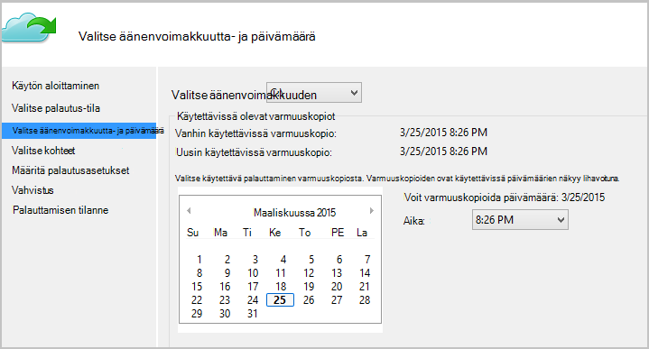

<properties
   pageTitle="Palauttaa tiedot Windows Server- tai Windows-asiakasohjelman perinteinen käyttöönoton mallin azuren | Microsoft Azure"
   description="Opi palauttamaan Windows Server- tai Windows-asiakasohjelmaa."
   services="backup"
   documentationCenter=""
   authors="saurabhsensharma"
   manager="shivamg"
   editor=""/>

<tags
   ms.service="backup"
   ms.workload="storage-backup-recovery"
     ms.tgt_pltfrm="na"
     ms.devlang="na"
     ms.topic="article"
     ms.date="08/02/2016"
     ms.author="trinadhk; jimpark; markgal;"/>

# Tiedostojen palauttaminen Windows server tai Windows asiakaskoneeseen perinteinen käyttöönotto-malli

> [AZURE.SELECTOR]
- [Perinteinen portal](backup-azure-restore-windows-server-classic.md)
- [Azure portal](backup-azure-restore-windows-server.md)

Tässä artikkelissa kerrotaan, kahdentyyppisiä palauttaminen toimintojen suorittamiseen:

- Palauttaa tiedot, joista varmuuskopioista otettiin samaan tietokoneeseen.
- Palauttaa tiedot toiseen koneeseen.

Kummassakin tapauksessa tiedot on noudettu Azure varmuuskopiointi säilöstä.

[AZURE.INCLUDE [learn-about-deployment-models](../../includes/learn-about-deployment-models-classic-include.md)]

## Palauttaa tietoja samaan tietokoneeseen.
Jos tiedosto on poistettu vahingossa ja haluat palauttaa poistetun (josta varmuuskopio on otettu) samaan tietokoneeseen, seuraavat vaiheet avulla voit palauttaa tiedot.

1. Avaa **Microsoft Azure varmuuskopiointi** kohdistuksen.
2. Valitse **Palauta tiedot** aloittaa työnkulun.

    

3. Valitse * *tähän palvelimeen (*yourmachinename*) ** vaihtoehto, jos haluat palauttaa varmuuskopioidut tiedostoa samaan tietokoneeseen.

    

4. Valitse **Etsi tiedostoja** tai **tiedostojen etsiminen**.

    Jätä oletusasetus, jos haluat palauttaa vähintään yksi tiedosto, jonka polku on tiedossa. Jos eivät ole varma, kansiorakenne, mutta haluat etsiä tiedostoa, valitse **Etsi tiedostoja** . Tässä kohdassa olemme jatkuu oletusarvo-vaihtoehto.

    

5. Valitse asema, josta haluat palauttaa tiedoston.

    Voit palauttaa tahansa samanaikaisesti. Päivämäärät, joiden **Lihavoitu** kalenterissa osoittavat palautettava käytettävyyttä. Kun päivämäärä on valittu, aikataulun (ja varmuuskopioinnin onnistuu) perusteella voit valita kohtaa aika **aika** avattavasta alaspäin.

    

6. Valitse palautettavat kohteet. Voit valittavia kansiot ja tiedostot haluat palauttaa.

    

7. Määritä palautus parametrit.

    

  - Voit halutessasi palauttaa (jossa tiedosto tai kansio korvata) alkuperäiseen sijaintiin tai toiseen paikkaan samaan tietokoneeseen.
  - Jos tiedosto tai kansio, jonka haluat palauttaa olemassa olevaan kohteeseen, voit luoda kopioita (saman tiedoston kahden version), korvaa kohteen sijainnin tiedostot tai ohita tiedostoja, jotka ole kohteen palautus.
  - On suositeltavaa, että jätät palauttaminen tiedostoja, jotka ovat palautetaan käyttöoikeusluettelot oletusasetus.

8. Kun nämä syötteiden annetaan, valitse **Seuraava**. Palautus-työnkulun, joka palauttaa tiedostot tähän tietokoneeseen, alkaa.

## Vaihtoehtoinen tietokoneen palauttaminen
Jos koko palvelimellesi katoaa, voit silti palauttaa tiedot Azure varmuuskopiosta toiseen tietokoneeseen. Seuraavat vaiheet osoittavat työnkulun.  

Sisältää termien seuraavasti:

- *Lähde-koneen* – alkuperäisestä tietokoneesta, josta varmuuskopio on tehty ja joka on tällä hetkellä käytettävissä.
- *Kohde tietokoneeseen* – tietokone, johon tiedot palautetaan.
- *Esimerkki säilö* – varmuuskopiointi säilö, johon *lähde-koneen* ja *kohde tietokoneeseen* rekisteröidyt.  

> [AZURE.NOTE] Koneen otetaan varmuuskopioita ei voi palauttaa tietokoneeseen, jossa on käynnissä käyttöjärjestelmän aiemmassa versiossa. Esimerkiksi jos varmuuskopiot on Windows 7-tietokoneesta, voi palauttaa Windows 8: ssa tai tietokoneen yläpuolella. Kuitenkin päin vastoin ei pidä tosi.

1. Avaa *kohde tietokoneeseen*-laajennuksen **Microsoft Azure varmuuskopiointi** .
2. Varmista, että *kohde machine* ja *lähde-koneen* rekisteröidään saman varmuuskopion säilö.
3. Valitse **Palauta tiedot** aloittaa työnkulun.

    

4. Valitse **toinen palvelin**

    

5. Tarjota säilö tunnistetiedon-tiedosto, joka vastaa *otoksen säilö*. Jos säilö tunnistetiedon tiedosto on virheellinen (tai vanhentunut) Lataa uusi säilö tunnistetiedon tiedosto *otoksen säilö* Azure perinteinen-portaalissa. Kun säilö tunnistetiedon tiedosto on annettu, varmuuskopion säilö säilö tunnistetiedon tiedoston vastaan tulee näkyviin.

6. Valitse *tietolähteen tietokoneen* näytössä koneet luettelo.

    

7. Valitse **Etsi tiedostoja** tai **Etsi tiedostoja** . Tässä kohdassa Käytämme **tiedostojen etsiminen** -vaihtoehto.

    

8. Valitse seuraavassa näytössä äänenvoimakkuutta- ja päivämäärä. Etsi kansion tai tiedoston nimi, jonka haluat palauttaa.

    

9. Valitse sijainti, johon tiedostot on voi palauttaa.

    

10. Anna salauksen salasana, joka on annettu *lähdetietokoneen* rekisteröinnin yhteydessä *otoksen säilö*.

    

11. Kun syöte on käytettävissä, valitse **Palauta**, joka käynnistää Palauta varmuuskopioidut tiedostot annettu kohteeseen.

## Seuraavat vaiheet
- [Azure varmuuskopion usein kysytyt kysymykset](backup-azure-backup-faq.md)
- Käy [Azure varmuuskopion keskustelupalstalle](http://go.microsoft.com/fwlink/p/?LinkId=290933).

## Opi lisää
- [Yleistä Azure varmuuskopioinnista](http://go.microsoft.com/fwlink/p/?LinkId=222425)
- [Varmuuskopion Azure-virtuaalikoneissa](backup-azure-vms-introduction.md)
- [Varmuuskopioinnin määrittäminen Microsoft toiminnoista](backup-azure-dpm-introduction.md)
