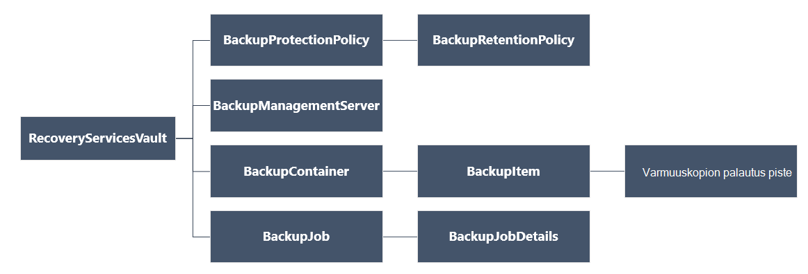

<properties
   pageTitle="Käyttöönotto ja hallita varmuuskopioiden Resurssienhallinta käyttöön VMs PowerShellin avulla | Microsoft Azure"
   description="Käyttöönotto ja Resurssienhallinta käyttöön VMs Azure varmuuskopioiden hallinta PowerShellin avulla"
   services="backup"
   documentationCenter=""
   authors="markgalioto"
   manager="cfreeman"
   editor=""/>

<tags
   ms.service="backup"
   ms.devlang="na"
   ms.topic="article"
   ms.tgt_pltfrm="na"
   ms.workload="storage-backup-recovery"
   ms.date="08/03/2016"
   ms.author="markgal; trinadhk"/>

# <a name="deploy-and-manage-backups-for-resource-manager-deployed-vms-using-powershell"></a>Käyttöönotto ja hallita varmuuskopioiden Resurssienhallinta käyttöön VMs PowerShellin avulla

> [AZURE.SELECTOR]
- [Resurssien hallinta](backup-azure-vms-automation.md)
- [Perinteinen](backup-azure-vms-classic-automation.md)

Tässä artikkelissa kerrotaan Azure PowerShell cmdlet-komentojen käyttämisestä varmuuskopioiminen ja palauttaminen Azure virtuaalikoneen (AM) palauttaminen Services säilöstä. Palautus palvelut-säilö on Azure Resurssienhallinta resurssi ja voidaan suojata tietoja ja Azure varmuuskopiointi-ja Azure palauttaminen kohteita. Voit suojata Azure-palvelun hallinta käyttöön VMs sekä Azure Resurssienhallinta käyttöön VMs palautus palvelut-säilö.

>[AZURE.NOTE] Azure on kaksi käyttöönoton mallien luominen ja käyttäminen resurssit: [Resurssienhallinta ja perinteinen](../resource-manager-deployment-model.md). Tämä artikkeli koskee käytön VMs luotu Resurssienhallinta-malli.

Tässä artikkelissa käydään läpi PowerShellin avulla AM suojaaminen ja tietojen palauttaminen palautuspiste.

## <a name="concepts"></a>Käsitteitä

Jos et ole tottunut Azure varmuuskopiointi-palvelussa yleisiä tietoja on palvelu, tutustu artikkeliin [Azure varmuuskopiointi ominaisuudet?](backup-introduction-to-azure-backup.md) Ennen kuin aloitat, varmista tärkeimmät essentials käsittelemiseen Azure varmuuskopiointia ja nykyisen AM varmuuskopion ratkaisu rajoituksista edellytykset tietoja.

PowerShellin käyttäminen tehokkaasti, jotta on ymmärtää, objektien ja mistä aloittaisi hierarkian.



AzureRmRecoveryServicesBackup PowerShell-cmdlet-viittaus on artikkelissa [Azure varmuuskopiointi - palautus Services cmdlet-komennot](https://msdn.microsoft.com/library/mt723320.aspx) Azure-kirjastossa.
AzureRmRecoveryServicesVault PowerShell-cmdlet-viittaus on artikkelissa [Azure palautus palvelun cmdlet-komennot](https://msdn.microsoft.com/library/mt643905.aspx).


## <a name="setup-and-registration"></a>Asennus- ja rekisteröintitietojen

Aloittaminen:

1. [Lataa uusin PowerShell](https://github.com/Azure/azure-powershell/releases) (edellyttää vähintään versio: 1.4.0)

2. Etsi Azure varmuuskopiointi PowerShell cmdlet-komentoja käytettävissä kirjoittamalla seuraava komento:

```
PS C:\> Get-Command *azurermrecoveryservices*

CommandType     Name                                               Version    Source
-----------     ----                                               -------    ------
Cmdlet          Backup-AzureRmRecoveryServicesBackupItem           1.4.0      AzureRM.RecoveryServices.Backup
Cmdlet          Disable-AzureRmRecoveryServicesBackupProtection    1.4.0      AzureRM.RecoveryServices.Backup
Cmdlet          Enable-AzureRmRecoveryServicesBackupProtection     1.4.0      AzureRM.RecoveryServices.Backup
Cmdlet          Get-AzureRmRecoveryServicesBackupContainer         1.4.0      AzureRM.RecoveryServices.Backup
Cmdlet          Get-AzureRmRecoveryServicesBackupItem              1.4.0      AzureRM.RecoveryServices.Backup
Cmdlet          Get-AzureRmRecoveryServicesBackupJob               1.4.0      AzureRM.RecoveryServices.Backup
Cmdlet          Get-AzureRmRecoveryServicesBackupJobDetails        1.4.0      AzureRM.RecoveryServices.Backup
Cmdlet          Get-AzureRmRecoveryServicesBackupManagementServer  1.4.0      AzureRM.RecoveryServices.Backup
Cmdlet          Get-AzureRmRecoveryServicesBackupProperties        1.4.0      AzureRM.RecoveryServices
Cmdlet          Get-AzureRmRecoveryServicesBackupProtectionPolicy  1.4.0      AzureRM.RecoveryServices.Backup
Cmdlet          Get-AzureRMRecoveryServicesBackupRecoveryPoint     1.4.0      AzureRM.RecoveryServices.Backup
Cmdlet          Get-AzureRmRecoveryServicesBackupRetentionPolic... 1.4.0      AzureRM.RecoveryServices.Backup
Cmdlet          Get-AzureRmRecoveryServicesBackupSchedulePolicy... 1.4.0      AzureRM.RecoveryServices.Backup
Cmdlet          Get-AzureRmRecoveryServicesVault                   1.4.0      AzureRM.RecoveryServices
Cmdlet          Get-AzureRmRecoveryServicesVaultSettingsFile       1.4.0      AzureRM.RecoveryServices
Cmdlet          New-AzureRmRecoveryServicesBackupProtectionPolicy  1.4.0      AzureRM.RecoveryServices.Backup
Cmdlet          New-AzureRmRecoveryServicesVault                   1.4.0      AzureRM.RecoveryServices
Cmdlet          Remove-AzureRmRecoveryServicesProtectionPolicy     1.4.0      AzureRM.RecoveryServices.Backup
Cmdlet          Remove-AzureRmRecoveryServicesVault                1.4.0      AzureRM.RecoveryServices
Cmdlet          Restore-AzureRMRecoveryServicesBackupItem          1.4.0      AzureRM.RecoveryServices.Backup
Cmdlet          Set-AzureRmRecoveryServicesBackupProperties        1.4.0      AzureRM.RecoveryServices
Cmdlet          Set-AzureRmRecoveryServicesBackupProtectionPolicy  1.4.0      AzureRM.RecoveryServices.Backup
Cmdlet          Set-AzureRmRecoveryServicesVaultContext            1.4.0      AzureRM.RecoveryServices
Cmdlet          Stop-AzureRmRecoveryServicesBackupJob              1.4.0      AzureRM.RecoveryServices.Backup
Cmdlet          Unregister-AzureRmRecoveryServicesBackupContainer  1.4.0      AzureRM.RecoveryServices.Backup
Cmdlet          Unregister-AzureRmRecoveryServicesBackupManagem... 1.4.0      AzureRM.RecoveryServices.Backup
Cmdlet          Wait-AzureRmRecoveryServicesBackupJob              1.4.0      AzureRM.RecoveryServices.Backup
```


PowerShellin avulla voidaan automatisoida seuraavat toimet:

- Luo palautus palvelut-säilö
- Voit varmuuskopioida tai suojata Azure VMs
- Käynnistimen varmuuskopiointityön
- Näytön varmuuskopiointityön
- Palauttaa Azure AM

## <a name="create-a-recovery-services-vault"></a>Luo palautus palvelut-säilö

Seuraavat vaiheet johtaa luomista palautus palvelut-säilö. Palautus palvelut-säilö on erilainen kuin varmuuskopiointi-säilö.

1. Jos käytät Azure varmuuskopiointi ensimmäistä kertaa, sinun on käytettävä **[Rekisteröi AzureRMResourceProvider](https://msdn.microsoft.com/library/mt679020.aspx)** cmdlet-komento rekisteröidä Azure palautus-palveluntarjoajan tilaus.

    ```
    PS C:\> Register-AzureRmResourceProvider -ProviderNamespace "Microsoft.RecoveryServices"
    ```

2. Palautus Services säilö ei yritysresurssi Resurssienhallinta, joten voit sijoittaa sen resurssin ryhmän. Voit käyttää aiemmin resurssiryhmä tai luoda uusi resurssiryhmä **[Uusi AzureRmResourceGroup](https://msdn.microsoft.com/library/mt678985.aspx)** cmdlet-komennon avulla. Kun luot uusi resurssiryhmä, määrittää nimen ja sijainnin resurssiryhmän.  

    ```
    PS C:\> New-AzureRmResourceGroup –Name "test-rg" –Location "West US"
    ```

3. **[Uusi AzureRmRecoveryServicesVault](https://msdn.microsoft.com/library/mt643910.aspx)** cmdlet-komennon avulla voit luoda uuden säilö. Muista samaan sijaintiin säilö, Määritä käytettiin resurssiryhmän.

    ```
    PS C:\> New-AzureRmRecoveryServicesVault -Name "testvault" -ResourceGroupName " test-rg" -Location "West US"
    ```

4. Määritä tallennustila-arvojen käyttäminen; Voit käyttää [Paikallisesti (LRS tarpeettomat tallennustilan)](../storage/storage-redundancy.md#locally-redundant-storage) tai [Geo tarpeettomat Storage (GRS)](../storage/storage-redundancy.md#geo-redundant-storage). Seuraavassa esimerkissä testVault - BackupStorageRedundancy asetus on määritetty GeoRedundant.

    ```
    PS C:\> $vault1 = Get-AzureRmRecoveryServicesVault –Name "testVault"
    PS C:\> Set-AzureRmRecoveryServicesBackupProperties  -Vault $vault1 -BackupStorageRedundancy GeoRedundant
    ```

    > [AZURE.TIP] Monta Azure varmuuskopiointi cmdlet-komennot edellyttävät palautus Services säilö objektin syötteeksi. Tästä syystä on helppo Tallenna varmuuskopio palautus Services säilö objektin muuttujaan.

## <a name="view-the-vaults-in-a-subscription"></a>Tilauksen vaults tarkasteleminen
**[Hae AzureRmRecoveryServicesVault](https://msdn.microsoft.com/library/mt643907.aspx)** avulla voit tarkastella kaikkia vaults luettelo voimassa oleva tilaus. Voit käyttää tätä komentoa, voit tarkistaa, että uusi säilö on luotu tai nähdäksesi, mitkä vaults ovat käytettävissä tilaus.

Suorita Get-AzureRmRecoveryServicesVault-komento ja valitse tilauksen kaikki vaults näkyvät.

```
PS C:\> Get-AzureRmRecoveryServicesVault
Name              : Contoso-vault
ID                : /subscriptions/1234
Type              : Microsoft.RecoveryServices/vaults
Location          : WestUS
ResourceGroupName : Contoso-docs-rg
SubscriptionId    : 1234-567f-8910-abc
Properties        : Microsoft.Azure.Commands.RecoveryServices.ARSVaultProperties
```


## <a name="backup-azure-vms"></a>Varmuuskopion Azure VMs
Nyt kun olet luonut palautus-palveluiden säilöön, voit käyttää virtual tietokoneen suojaamiseen. Kuitenkin ennen kuin otat käyttöön suojauksen, sinun on määritettävä säilö yhteydessä ja haluat tarkistaa suojauskäytäntö. Säilö konteksti määrittää tietotyypin, joka on suojattu säilö. Suojauskäytäntö on varmuuskopiointityön suoritettaessa ja kuinka kauan kunkin varmuuskopion tilannevedoksen säilyttää aikatauluun.

Ennen kuin otat käyttöön AM suojauksen, sinun on määritettävä säilö yhteydessä. Kaikki seuraavat cmdlet-komennot kontekstin otetaan käyttöön.

```
PS C:\> Get-AzureRmRecoveryServicesVault -Name testvault | Set-AzureRmRecoveryServicesVaultContext
```

### <a name="create-a-protection-policy"></a>Suojaus-käytännön luominen

Kun luot uuden säilöön, on oletusarvoinen käytännön kanssa. Tämän käytännön käynnistää varmuuskopiointityön päivittäin määritettynä ajankohtana. Oletuskäytäntö-kohden varmuuskopion tilannevedoksen säilyttää 30 päivää. Voit suojata nopeasti yhteyttä AM ja muokata myöhemmin eri yksityiskohdilla käytäntöön oletuskäytäntö.

**[Get-AzureRmRecoveryServicesBackupProtectionPolicy](https://msdn.microsoft.com/library/mt723300.aspx)** avulla voit tarkastella käytäntöjen käytettävissä luettelon säilö:

```
PS C:\> Get-AzureRmRecoveryServicesBackupProtectionPolicy -WorkloadType AzureVM
Name                 WorkloadType       BackupManagementType BackupTime                DaysOfWeek
----                 ------------       -------------------- ----------                ----------
DefaultPolicy        AzureVM            AzureVM              4/14/2016 5:00:00 PM
```

> [AZURE.NOTE] PowerShellin BackupTime kentän aikavyöhyke on UTC-aika. Kun varmuuskopioinnin aika näkyy Azure-portaalissa, aikaa muutetaan, paikallinen aikavyöhyke.

Varmuuskopion suojauskäytäntö on liitetty vähintään yksi säilytyskäytäntö.  Säilytyskäytännön määrittää, kuinka kauan palautus-kohta on käytettävissä Azure varmuuskopioimalla. **Hae AzureRmRecoveryServicesBackupRetentionPolicyObject** avulla voit tarkastella oletusarvon säilytyskäytäntö.  Voit vastaavasti hankkia aikataulun oletuskäytäntö **Get-AzureRmRecoveryServicesBackupSchedulePolicyObject** . Aikataulun ja säilytyskäytäntöjä käytännön objekteja käytetään syötteiden **Uusi AzureRmRecoveryServicesBackupProtectionPolicy** cmdlet-komento.

Varmuuskopion suojaus-käytännöllä määritetään, kuinka usein kohteen varmuuskopioinnin on valmis. Uusi AzureRmRecoveryServicesBackupProtectionPolicy cmdlet-komento luo PowerShell-objekti, joka sisältää varmuuskopioidut tiedot. Varmuuskopion käytännön käytetään syötteeksi Enable AzureRmRecoveryServicesBackupProtection cmdlet-komento.

```
PS C:\> $schPol = Get-AzureRmRecoveryServicesBackupSchedulePolicyObject -WorkloadType "AzureVM"
PS C:\>  $retPol = Get-AzureRmRecoveryServicesBackupRetentionPolicyObject -WorkloadType "AzureVM"
PS C:\>  New-AzureRmRecoveryServicesBackupProtectionPolicy -Name "NewPolicy" -WorkloadType AzureVM -RetentionPolicy $retPol -SchedulePolicy $schPol
Name                 WorkloadType       BackupManagementType BackupTime                DaysOfWeek
----                 ------------       -------------------- ----------                ----------
NewPolicy           AzureVM            AzureVM              4/24/2016 1:30:00 AM
```

### <a name="enable-protection"></a>Ota suojaus käyttöön

Suojauksen ottaminen käyttöön kuuluu kaksi objektia - kohteeseen ja käytännön. Molemmat objektit tarvitaan suojaus käytössä säilö. Kun käytäntö on liitetty säilö, varmuuskopion työnkulku käynnistyy määritetty käytännön aikataulussa aikaan.

Voit ottaa käyttöön-salattu KÄDESSÄ VMs-suojaus

```
PS C:\> $pol=Get-AzureRmRecoveryServicesBackupProtectionPolicy -Name "NewPolicy"
PS C:\> Enable-AzureRmRecoveryServicesBackupProtection -Policy $pol -Name "V2VM" -ResourceGroupName "RGName1"
```

Salatun VMs [salattu BEK ja KEK]-suojauksen käyttöön haluat antaa oikeudet Azure varmuuskopiointi-palveluun, jotta voit lukea näppäimet ja tietoja avaimen säilöstä. 

```
PS C:\> Set-AzureRmKeyVaultAccessPolicy -VaultName 'KeyVaultName' -ResourceGroupName 'RGNameOfKeyVault' -PermissionsToKeys backup,get,list -PermissionsToSecrets get,list -ServicePrincipalName 262044b1-e2ce-469f-a196-69ab7ada62d3
PS C:\> $pol=Get-AzureRmRecoveryServicesBackupProtectionPolicy -Name "NewPolicy"
PS C:\> Enable-AzureRmRecoveryServicesBackupProtection -Policy $pol -Name "V2VM" -ResourceGroupName "RGName1"
```

N ASM VMs

```
PS C:\>  $pol=Get-AzureRmRecoveryServicesBackupProtectionPolicy -Name "NewPolicy"
PS C:\>  Enable-AzureRmRecoveryServicesBackupProtection -Policy $pol -Name "V1VM" -ServiceName "ServiceName1"
```

### <a name="modify-a-protection-policy"></a>Muokkaa suojaus-käytännön luominen

Jotta voit muokata käytäntöä, muokata BackupSchedulePolicyObject tai BackupRetentionPolicy objektia ja muokata käytännön määrittäminen AzureRmRecoveryServicesBackupProtectionPolicy käyttäminen

Seuraavassa esimerkissä muuttuu säilytys Laske 365.

```
PS C:\> $retPol = Get-AzureRmRecoveryServicesBackupRetentionPolicyObject -WorkloadType "AzureVM"
PS C:\> $retPol.DailySchedule.DurationCountInDays = 365
PS C:\> $pol= Get-AzureRmRecoveryServicesBackupProtectionPolicy -Name NewPolicy
PS C:\> Set-AzureRmRecoveryServicesBackupProtectionPolicy -Policy $pol  -RetentionPolicy  $RetPol
```

## <a name="run-an-initial-backup"></a>Suorita alkuperäinen varmuuskopiointi

Varmuuskopioinnin aikataulu käynnistää täydellinen varmuuskopiointi takaisin sinua käyttäjäksi kohteen alku. Valitse myöhemmin takaisin ups, varmuuskopioi on varmasti kopio. Jos haluat aloittaa ensimmäisen varmuuskopioinnin tapahtuvan tietyn ajan tai jopa välittömästi Käytä **[Varmuuskopiointi AzureRmRecoveryServicesBackupItem](https://msdn.microsoft.com/library/mt723312.aspx)** cmdlet-komennon:

```
PS C:\> $namedContainer = Get-AzureRmRecoveryServicesBackupContainer -ContainerType "AzureVM" -Status "Registered" -Name "V2VM"
PS C:\> $item = Get-AzureRmRecoveryServicesBackupItem -Container $namedContainer -WorkloadType "AzureVM"
PS C:\> $job = Backup-AzureRmRecoveryServicesBackupItem -Item $item
WorkloadName     Operation            Status               StartTime                 EndTime                   JobID
------------     ---------            ------               ---------                 -------                   ----------
V2VM              Backup               InProgress            4/23/2016 5:00:30 PM                       cf4b3ef5-2fac-4c8e-a215-d2eba4124f27
```

> [AZURE. Huomautus: Aikavyöhyke PowerShell aloitusajan ja Lopetusaika kentät on UTC-aika. Kun aika näkyy Azure-portaalissa, aikaa muutetaan, paikallinen aikavyöhyke.

## <a name="monitoring-a-backup-job"></a>Varmuuskopiointityön seuranta

Useimmat Azure varmuuskopion pitkään suoritettavien toiminnot ovat kuljettajilla projektin nimellä. Tämä on helppo edistymisen seurantaan eikä sinun tarvitse säilyttää Azure portaalin Avaa aina.

Saat uusimmat meneillään olevan työn tila-Käytä komentosovelmaa Get-AzureRmRecoveryservicesBackupJob.

```
PS C:\ > $joblist = Get-AzureRmRecoveryservicesBackupJob –Status InProgress
PS C:\ > $joblist[0]
WorkloadName     Operation            Status               StartTime                 EndTime                   JobID
------------     ---------            ------               ---------                 -------                   ----------
V2VM             Backup               InProgress            4/23/2016 5:00:30 PM           cf4b3ef5-2fac-4c8e-a215-d2eba4124f27
```

Nämä työt käyttöönotto - eli tarpeettomat muita tunnus - näppäimen sijaan kysely **[Odota AzureRmRecoveryServicesBackupJob](https://msdn.microsoft.com/library/mt723321.aspx)** cmdlet-komento. Cmdlet keskeyttää suorittamisen, kunnes työ on valmis tai määritetyn aikakatkaisuarvo on saavutettu.

```
PS C:\> Wait-AzureRmRecoveryServicesBackupJob -Job $joblist[0] -Timeout 43200
```

## <a name="restore-an-azure-vm"></a>Palauttaa Azure AM

Tällä palauttaminen AM, Azure-portaalissa ja palauttaminen AM, PowerShellin avaimen erotuksen. PowerShellin palautus on valmis, kun levyjen ja määritystietoja palautus pisteestä luotu. Palautustoiminto ei luoda virtual machine. Luomisen virtuaalikoneen levyjen ohjeet toimitetaan. Kuitenkin haluat palauttaa AM, käydä läpi seuraavasti:

- Valitse AM
- Valitse palautuspiste
- Palauttaa levyjen
- Tallennetun levyjä AM luominen

Alla olevassa kuvassa näkyy objektin hierarkian RecoveryServicesVault BackupRecoveryPoint alaspäin.


Jos haluat palauttaa varmuuskopiotiedot, tunnistaa varmuuskopioidut kohteen ja palautuspiste, jossa on ajankohta tiedot. Tietojen palauttaminen säilö asiakkaan tilin **[Palautus-AzureRmRecoveryServicesBackupItem](https://msdn.microsoft.com/library/mt723316.aspx)** cmdlet-komennon avulla.

### <a name="select-the-vm"></a>Valitse AM

Saat PowerShell-objekti, joka määrittää oikealle Varmuuskopioi kohde-säilö säilö käynnistäminen ja siirtyä alaspäin objektin hierarkian. Voit valita säilö, joka edustaa AM, käytä komentosovelmaa **[Get-AzureRmRecoveryServicesBackupContainer](https://msdn.microsoft.com/library/mt723319.aspx)** ja pipe, **[Hae AzureRmRecoveryServicesBackupItem](https://msdn.microsoft.com/library/mt723305.aspx)** cmdlet-komento.

```
PS C:\> $namedContainer = Get-AzureRmRecoveryServicesBackupContainer  -ContainerType AzureVM –Status Registered -Name 'V2VM'
PS C:\> $backupitem = Get-AzureRmRecoveryServicesBackupItem –Container $namedContainer  –WorkloadType "AzureVM"
```

### <a name="choose-a-recovery-point"></a>Valitse palautuspiste

Luettele kaikki varmuuskopion kohteen palautus pisteet **[Get-AzureRmRecoveryServicesBackupRecoveryPoint](https://msdn.microsoft.com/library/mt723308.aspx)** -cmdlet-komennolla. Valitse Palauta palautus-kohta. Jos et tiedä, mitä palautuspiste käyttämään, kannattaa valita viimeisimmän RecoveryPointType = AppConsistent-kohdan luettelosta.

Seuraavaa komentosarjaa muuttuja, **$rp**on palautus asioista valitun kohteen varmuuskopioinnin matriisi. Matriisi on lajiteltu käänteisessä järjestyksessä aika, jossa uusimmat palautuspiste, indeksissä 0. Valitse palautus-kohdan käyttämällä vakio PowerShell-matriisin indeksointi. Esimerkki: $rp [0] valitsee uusimman palautuspiste.

```
PS C:\> $startDate = (Get-Date).AddDays(-7)
PS C:\> $endDate = Get-Date
PS C:\> $rp = Get-AzureRmRecoveryServicesBackupRecoveryPoint -Item $backupitem -StartDate $startdate.ToUniversalTime() -EndDate $enddate.ToUniversalTime()
PS C:\> $rp[0]
RecoveryPointAdditionalInfo :
SourceVMStorageType         : NormalStorage
Name                        : 15260861925810
ItemName                    : VM;iaasvmcontainer;RGName1;V2VM
RecoveryPointId             : /subscriptions/XX/resourceGroups/ RGName1/providers/Microsoft.RecoveryServices/vaults/testvault/backupFabrics/Azure/protectionContainers/IaasVMContainer;iaasvmcontainer;RGName1;V2VM/protectedItems/VM;iaasvmcontainer; RGName1;V2VM
                              /recoveryPoints/15260861925810
RecoveryPointType           : AppConsistent
RecoveryPointTime           : 4/23/2016 5:02:04 PM
WorkloadType                : AzureVM
ContainerName               : IaasVMContainer;iaasvmcontainer; RGName1;V2VM
ContainerType               : AzureVM
BackupManagementType        : AzureVM
```


### <a name="restore-the-disks"></a>Palauttaa levyjen

**[Palauta AzureRmRecoveryServicesBackupItem](https://msdn.microsoft.com/library/mt723316.aspx)** cmdlet-komennon avulla voit palauttaa tiedot ja määritykset varmuuskopiointi-kohteen palautus pisteeseen. Kun olet määrittänyt palautus-kohdan Määritä se **- RecoveryPoint** parametrin arvon. Edellisen esimerkin koodissa **$rp [0]** valittiin palautus-kohdan käytettävä. Esimerkki alla koodin **$rp [0]** on määritetty käyttämään palauttaminen levylle palautus-kohdan.

Palauta levyille ja määritystietoja

```
PS C:\> $restorejob = Restore-AzureRmRecoveryServicesBackupItem -RecoveryPoint $rp[0] -StorageAccountName DestAccount -StorageAccountResourceGroupName DestRG
PS C:\> $restorejob
WorkloadName     Operation          Status               StartTime                 EndTime            JobID
------------     ---------          ------               ---------                 -------          ----------
V2VM              Restore           InProgress           4/23/2016 5:00:30 PM                        cf4b3ef5-2fac-4c8e-a215-d2eba4124f27
```

Kun palautustyön on suoritettu, palautustoiminto näyttäminen **[Get-AzureRmRecoveryServicesBackupJobDetails](https://msdn.microsoft.com/library/mt723310.aspx)** cmdlet-komennon avulla. JobDetails-ominaisuudella on rakennettava AM tarvittavat tiedot.

```
PS C:\> $restorejob = Get-AzureRmRecoveryServicesBackupJob -Job $restorejob
PS C:\> $details = Get-AzureRmRecoveryServicesBackupJobDetails
```

Kun palautat levyjä, siirry seuraavaan osaan tietoja luomisesta AM.

### <a name="create-a-vm-from-restored-disks"></a>Palautetun levyjä AM luominen

Kun on palautettu levyjä, voit luominen ja määrittäminen levyltä virtuaalikoneen seuraavasti.

1. Kyselyn palautettu levyn ominaisuuksien projektin tiedot.

    ```
    PS C:\> $properties = $details.properties
    PS C:\> $storageAccountName = $properties["Target Storage Account Name"]
    PS C:\> $containerName = $properties["Config Blob Container Name"]
    PS C:\> $blobName = $properties["Config Blob Name"]
    ```

2. Määritä Azure tallennustilan yhteydessä ja palauttaa JSON-kokoonpanotiedosto.

    ```
    PS C:\> Set-AzureRmCurrentStorageAccount -Name $storageaccountname -ResourceGroupName testvault
    PS C:\> $destination_path = "C:\vmconfig.json"
    PS C:\> Get-AzureStorageBlobContent -Container $containerName -Blob $blobName -Destination $destination_path
    PS C:\> $obj = ((Get-Content -Path $destination_path -Encoding Unicode)).TrimEnd([char]0x00) | ConvertFrom-Json
    ```

3. JSON-kokoonpanotiedosto avulla voit luoda AM-määritys.

    ```
  PS C:\> $vm = New-AzureRmVMConfig -VMSize $obj.HardwareProfile.VirtualMachineSize -VMName "testrestore"
    ```

4. Liitä OS levyn ja tietojen levyjä.

      Muut kuin salatut VMs varten

       ```
       PS C:\> Set-AzureRmVMOSDisk -VM $vm -Name "osdisk" -VhdUri $obj.StorageProfile.OSDisk.VirtualHardDisk.Uri -CreateOption “Attach”
       PS C:\> $vm.StorageProfile.OsDisk.OsType = $obj.StorageProfile.OSDisk.OperatingSystemType foreach($dd in $obj.StorageProfile.DataDisks)
       {
       $vm = Add-AzureRmVMDataDisk -VM $vm -Name "datadisk1" -VhdUri $dd.VirtualHardDisk.Uri -DiskSizeInGB 127 -Lun $dd.Lun -CreateOption Attach
       }
       ```
      Salatun VMs sinun on Määritä [avain säilö tiedot](https://msdn.microsoft.com/library/dn868052.aspx) , ennen kuin liität levyjä.
      
      ```
      PS C:\> Set-AzureRmVMOSDisk -VM $vm -Name "osdisk" -VhdUri $obj.StorageProfile.OSDisk.VirtualHardDisk.Uri -DiskEncryptionKeyUrl "https://ContosoKeyVault.vault.azure.net:443/secrets/ContosoSecret007" -DiskEncryptionKeyVaultId "/subscriptions/abcdedf007-4xyz-1a2b-0000-12a2b345675c/resourceGroups/ContosoRG108/providers/Microsoft.KeyVault/vaults/ContosoKeyVault" -KeyEncryptionKeyUrl "https://ContosoKeyVault.vault.azure.net:443/keys/ContosoKey007" -KeyEncryptionKeyVaultId "subscriptions/abcdedf007-4xyz-1a2b-0000-12a2b345675c/resourceGroups/ContosoRG108/providers/Microsoft.KeyVault/vaults/ContosoKeyVault" -CreateOption "Attach" -Windows
      PS C:\> $vm.StorageProfile.OsDisk.OsType = $obj.StorageProfile.OSDisk.OperatingSystemType foreach($dd in $obj.StorageProfile.DataDisks)
       {
       $vm = Add-AzureRmVMDataDisk -VM $vm -Name "datadisk1" -VhdUri $dd.VirtualHardDisk.Uri -DiskSizeInGB 127 -Lun $dd.Lun -CreateOption Attach
       }
      ```
      
5. Verkoston asetusten määrittäminen.

    ```
    PS C:\> $nicName="p1234"
    PS C:\> $pip = New-AzureRmPublicIpAddress -Name $nicName -ResourceGroupName "test" -Location "WestUS" -AllocationMethod Dynamic
    PS C:\> $vnet = Get-AzureRmVirtualNetwork -Name "testvNET" -ResourceGroupName "test"
    PS C:\> $nic = New-AzureRmNetworkInterface -Name $nicName -ResourceGroupName "test" -Location "WestUS" -SubnetId $vnet.Subnets[$subnetindex].Id -PublicIpAddressId $pip.Id
    PS C:\> $vm=Add-AzureRmVMNetworkInterface -VM $vm -Id $nic.Id
    ```

6. Luo virtuaalikoneen.

    ```
    PS C:\> $vm.StorageProfile.OsDisk.OsType = $obj.StorageProfile.OSDisk.OperatingSystemType
    PS C:\> New-AzureRmVM -ResourceGroupName "test" -Location "WestUS" -VM $vm
    ```

## <a name="next-steps"></a>Seuraavat vaiheet

Jos käytät mieluummin PowerShellin Azure resurssien kanssa, tutustu Windows Server- [käyttöönotto- ja hallita varmuuskopiointi Windows Serverin](./backup-client-automation.md)suojaamisessa käytettävät PowerShell-artikkelissa. On myös PowerShell-artikkelissa varmuuskopiointia, [Ota käyttöön ja hallita varmuuskopiointi DPM](./backup-dpm-automation.md)DPM hallintaan. Molemmat on seuraavissa artikkeleissa on resurssien hallinnan käyttöönotto sekä perinteinen ominaisuuksissa versio.  
