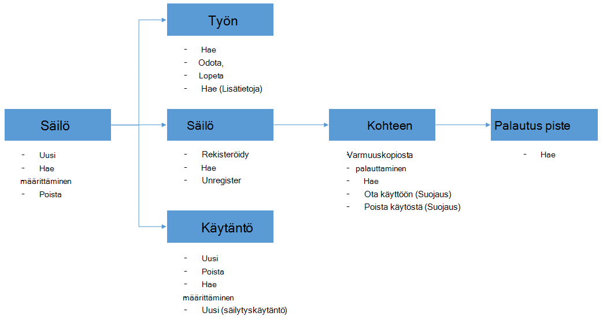

<properties
    pageTitle="Käyttöönotto ja hallita varmuuskopiointi Azure VMs PowerShellin avulla | Microsoft Azure"
    description="Opettele käyttöönotto ja hallinta PowerShellin Azure varmuuskopiointi"
    services="backup"
    documentationCenter=""
    authors="markgalioto"
    manager="cfreeman"
    editor=""/>

<tags
    ms.service="backup"
    ms.workload="storage-backup-recovery"
    ms.tgt_pltfrm="na"
    ms.devlang="na"
    ms.topic="article"
    ms.date="08/08/2016"
    ms.author="markgal;trinadhk;jimpark" />


# <a name="deploy-and-manage-backup-for-azure-vms-using-powershell"></a>Käyttöönotto ja hallinta PowerShellin Azure VMs varmuuskopiointi

> [AZURE.SELECTOR]
- [Resurssien hallinta](backup-azure-vms-automation.md)
- [Perinteinen](backup-azure-vms-classic-automation.md)

Tässä artikkelissa näytetään, miten voit käyttää PowerShellin Azure varmuuskopiointia ja palauttamista Azure VMs. Azure on kaksi eri käyttöönoton mallien luominen ja käyttäminen resurssit: toimialuenimien hallinta ja perinteinen. Tässä artikkelissa käsitellään perinteinen käyttöönotto-mallin avulla. Microsoft suosittelee, että useimmat uudet käyttöönoton käyttävät Resurssienhallinta-malli.

## <a name="concepts"></a>Käsitteitä


Tässä artikkelissa on tietoja käytetään näennäiskoneiden varmuuskopioida PowerShell cmdlet-komentoja. Johdanto tietoja suojaaminen Azure VMs artikkelissa [suunnitteleminen Azure AM varmuuskopio-infrastruktuuria](backup-azure-vms-introduction.md).

> [AZURE.NOTE] Ennen kuin aloitat, lue [edellytykset](backup-azure-vms-prepare.md) pakollinen Azure varmuuskopion ja nykyisen AM varmuuskopion ratkaisu [rajoitukset](backup-azure-vms-prepare.md#limitations) .

PowerShellin käyttäminen tehokkaasti selvittääksesi, objektien ja mistä aloittaisi hierarkian hetki.



Kaksi tärkeimmät työnkulut AM suojauksen ottaminen käyttöön ja tietojen palauttaminen palautus pisteestä. Tässä artikkelissa keskitytään on avulla voit tehostaa adept osoitteessa PowerShell-cmdlet-komennot käyttöön kaksi tilanteista käsitteleminen.


## <a name="setup-and-registration"></a>Asennus- ja rekisteröintitietojen
Aloittaminen:

1. [Lataa uusimmat PowerShell](https://github.com/Azure/azure-powershell/releases) (edellyttää vähintään versio: 1.0.0)

2. Etsi Azure varmuuskopiointi PowerShell cmdlet-komentoja käytettävissä kirjoittamalla seuraava komento:

```
PS C:\> Get-Command *azurermbackup*

CommandType     Name                                               Version    Source
-----------     ----                                               -------    ------
Cmdlet          Backup-AzureRmBackupItem                           1.0.1      AzureRM.Backup
Cmdlet          Disable-AzureRmBackupProtection                    1.0.1      AzureRM.Backup
Cmdlet          Enable-AzureRmBackupContainerReregistration        1.0.1      AzureRM.Backup
Cmdlet          Enable-AzureRmBackupProtection                     1.0.1      AzureRM.Backup
Cmdlet          Get-AzureRmBackupContainer                         1.0.1      AzureRM.Backup
Cmdlet          Get-AzureRmBackupItem                              1.0.1      AzureRM.Backup
Cmdlet          Get-AzureRmBackupJob                               1.0.1      AzureRM.Backup
Cmdlet          Get-AzureRmBackupJobDetails                        1.0.1      AzureRM.Backup
Cmdlet          Get-AzureRmBackupProtectionPolicy                  1.0.1      AzureRM.Backup
Cmdlet          Get-AzureRmBackupRecoveryPoint                     1.0.1      AzureRM.Backup
Cmdlet          Get-AzureRmBackupVault                             1.0.1      AzureRM.Backup
Cmdlet          Get-AzureRmBackupVaultCredentials                  1.0.1      AzureRM.Backup
Cmdlet          New-AzureRmBackupProtectionPolicy                  1.0.1      AzureRM.Backup
Cmdlet          New-AzureRmBackupRetentionPolicyObject             1.0.1      AzureRM.Backup
Cmdlet          New-AzureRmBackupVault                             1.0.1      AzureRM.Backup
Cmdlet          Register-AzureRmBackupContainer                    1.0.1      AzureRM.Backup
Cmdlet          Remove-AzureRmBackupProtectionPolicy               1.0.1      AzureRM.Backup
Cmdlet          Remove-AzureRmBackupVault                          1.0.1      AzureRM.Backup
Cmdlet          Restore-AzureRmBackupItem                          1.0.1      AzureRM.Backup
Cmdlet          Set-AzureRmBackupProtectionPolicy                  1.0.1      AzureRM.Backup
Cmdlet          Set-AzureRmBackupVault                             1.0.1      AzureRM.Backup
Cmdlet          Stop-AzureRmBackupJob                              1.0.1      AzureRM.Backup
Cmdlet          Unregister-AzureRmBackupContainer                  1.0.1      AzureRM.Backup
Cmdlet          Wait-AzureRmBackupJob                              1.0.1      AzureRM.Backup
```

PowerShellin avulla voidaan automatisoida asennus- ja rekisteröintitietojen seuraavat toimet:

- Luo varmuuskopio säilöön
- Rekisteröiminen VMs Azure varmuuskopiointi-palvelussa

### <a name="create-a-backup-vault"></a>Luo varmuuskopio säilöön

> [AZURE.WARNING] Asiakkaiden Azure varmuuskopioinnista ensimmäistä kertaa, sinun täytyy rekisteröidä Azure varmuuskopiointi-palvelu, jota käytetään tilaus. Voit tehdä tämän suorittamalla seuraavan komennon: Rekisteröi AzureRmResourceProvider - ProviderNamespace "Microsoft.Backup"

Voit luoda uuden varmuuskopion säilö **Uusi AzureRmBackupVault** cmdlet-komennolla. Varmuuskopion säilö ei yritysresurssi ARM, joten voit sijoittaa sen resurssin ryhmän. Laajennettuja PowerShellin Azure-konsolissa Suorita seuraavat komennot:

```
PS C:\> New-AzureRmResourceGroup –Name “test-rg” –Location “West US”
PS C:\> $backupvault = New-AzureRmBackupVault –ResourceGroupName “test-rg” –Name “test-vault” –Region “West US” –Storage GeoRedundant
```

Saat varmuuskopion vaults luettelo tietyn tilauksen **Get-AzureRmBackupVault** cmdlet-komennolla.

> [AZURE.NOTE] On kätevä muuttujaksi varmuuskopion säilöön-objektien tallentamiseen. Säilö objektin tarvitaan syötteeksi monta Azure varmuuskopiointi Cmdlet-komentoja varten.


### <a name="registering-the-vms"></a>VMs rekisteröiminen
Ensimmäinen askel määrittäminen varmuuskopiointi Azure varmuuskopio on tietokoneen tai AM rekisteröitymään Azure varmuuskopion säilö. **Rekisteröi AzureRmBackupContainer** cmdlet-komento tulee Azure IaaS-virtuaalikoneen syötetietoja ja rekisteröi sen määritetyn säilö. Register-toimintoa liittää Azure virtuaalikoneen varmuuskopion säilö, ja seuraa AM varmuuskopion elinkaari kautta.

Oman AM rekisteröiminen Azure varmuuskopiointi-palvelussa Luo ylimmän tason säilö objektin. Säilön sisältää yleensä useita kohteita, jotka voidaan varmuuskopioida, mutta VMs kyseessä ole vain yksi säilö varmuuskopioinnin kohde.

```
PS C:\> $registerjob = Register-AzureRmBackupContainer -Vault $backupvault -Name "testvm" -ServiceName "testvm"
```

## <a name="backup-azure-vms"></a>Varmuuskopion Azure VMs

### <a name="create-a-protection-policy"></a>Suojaus-käytännön luominen
Ei ole välttämätöntä suojaus uuden käytännön käynnistämiseen varmuuskopio oman VMs luominen. Säilö sisältyy "Oletus käytännön", joka voidaan käyttää nopeasti käyttöön suojaus ja muokata sitten oikea tiedot myöhemmin. Voit hankkia käytettävissä säilö käytännöt luettelo **Get-AzureRmBackupProtectionPolicy** cmdlet-komennolla:

```
PS C:\> Get-AzureRmBackupProtectionPolicy -Vault $backupvault

Name                      Type               ScheduleType       BackupTime
----                      ----               ------------       ----------
DefaultPolicy             AzureVM            Daily              26-Aug-15 12:30:00 AM
```

> [AZURE.NOTE] PowerShellin BackupTime kentän aikavyöhyke on UTC-aika. Kun varmuuskopioinnin aika näkyy Azure-portaalissa, aikavyöhyke tasataan UTC-poikkeama sekä paikalliseen järjestelmään.

Varmuuskopion käytäntö on liitetty vähintään yksi säilytyskäytäntö. Säilytys-käytännöllä määritetään, kuinka kauan palautus-kohta on käytettävissä Azure varmuuskopioimalla. **Uusi AzureRmBackupRetentionPolicy** cmdlet-komento luo PowerShell-objekteja, pidä säilytyskäytännön tiedot. Säilytys käytännön objektit käytetään syötteiden *Uusi AzureRmBackupProtectionPolicy* cmdlet-komennon tai suoraan *Ota AzureRmBackupProtection* cmdlet-komento.

Varmuuskopiointi-käytännöllä määritetään, kuinka usein kohteen varmuuskopioinnin on valmis. **Uusi AzureRmBackupProtectionPolicy** cmdlet-komento luo PowerShell-objekti, joka sisältää varmuuskopioidut tiedot. Varmuuskopion käytännön käytetään syötteeksi *Enable-AzureRmBackupProtection* cmdlet-komento.

```
PS C:\> $Daily = New-AzureRmBackupRetentionPolicyObject -DailyRetention -Retention 30
PS C:\> $newpolicy = New-AzureRmBackupProtectionPolicy -Name DailyBackup01 -Type AzureVM -Daily -BackupTime ([datetime]"3:30 PM") -RetentionPolicy $Daily -Vault $backupvault

Name                      Type               ScheduleType       BackupTime
----                      ----               ------------       ----------
DailyBackup01             AzureVM            Daily              01-Sep-15 3:30:00 PM
```

### <a name="enable-protection"></a>Ota suojaus käyttöön
Suojauksen ottaminen käyttöön kuuluu kaksi objektia - kohteeseen ja käytännön, ja molemmat on sama säilö kuuluu. Kun käytäntö on liitetty kohde, varmuuskopion työnkulun projektin palvelussa määritetyt aikatauluun.

```
PS C:\> Get-AzureRmBackupContainer -Type AzureVM -Status Registered -Vault $backupvault | Get-AzureRmBackupItem | Enable-AzureRmBackupProtection -Policy $newpolicy
```

### <a name="initial-backup"></a>Alkuperäinen varmuuskopiointi
Varmuuskopioinnin aikataulu huolehtia tekevät alustava kopioi kohteen ja lisäävät kopioi myöhemmät varmuuskopioiden hakeminen. Jos haluat aloittaa ensimmäisen varmuuskopioinnin tapahtuvan tietyn ajan tai jopa välittömästi sitten käyttää **Varmuuskopiointi AzureRmBackupItem** cmdlet-komento:

```
PS C:\> $container = Get-AzureRmBackupContainer -Vault $backupvault -Type AzureVM -Name "testvm"
PS C:\> $backupjob = Get-AzureRmBackupItem -Container $container | Backup-AzureRmBackupItem
PS C:\> $backupjob

WorkloadName    Operation       Status          StartTime              EndTime
------------    ---------       ------          ---------              -------
testvm          Backup          InProgress      01-Sep-15 12:24:01 PM  01-Jan-01 12:00:00 AM
```

> [AZURE.NOTE] PowerShellin aloitusajan ja Lopetusaika kentät aikavyöhyke on UTC-aika. Kun samanlaisia tietoja näkyy Azure-portaalissa, aikavyöhyke tasataan paikallisen järjestelmän kelloa avulla.

### <a name="monitoring-a-backup-job"></a>Varmuuskopiointityön seuranta
Useimmat Azure varmuuskopion pitkään suoritettavien toiminnot ovat kuljettajilla projektin nimellä. Tämä on helppo edistymisen seurantaan eikä sinun tarvitse säilyttää Azure portaalin Avaa aina.

Saat uusimmat meneillään olevan työn tila-Käytä komentosovelmaa **Get-AzureRmBackupJob** .

```
PS C:\> $joblist = Get-AzureRmBackupJob -Vault $backupvault -Status InProgress
PS C:\> $joblist[0]

WorkloadName    Operation       Status          StartTime              EndTime
------------    ---------       ------          ---------              -------
testvm          Backup          InProgress      01-Sep-15 12:24:01 PM  01-Jan-01 12:00:00 AM
```

Sen sijaan, että nämä työt käyttöönotto - eli tarpeetonta, Lisää tunnus - kysely on helpompaa, **Odota AzureRmBackupJob** cmdlet-komennon. Kun sitä käytetään komentosarjan, cmdlet pidä suorittamisen, kunnes työ on valmis tai määritetyn aikakatkaisuarvo on saavutettu.

```
PS C:\> Wait-AzureRmBackupJob -Job $joblist[0] -Timeout 43200
```


## <a name="restore-an-azure-vm"></a>Palauttaa Azure AM

Jos haluat palauttaa varmuuskopiotiedot, haluat tunnistaa varmuuskopioidut kohteen ja palautus piste, jossa on ajankohta tiedot. Nämä tiedot on annettu palauttaminen AzureRmBackupItem cmdlet-komento aloittaa palauttaminen säilö tiedot asiakkaan tiliin.

### <a name="select-the-vm"></a>Valitse AM

Saat PowerShell-objekti, joka määrittää oikealle Varmuuskopioi kohde-tarvitset säilö säilöön, ja siirtyä alaspäin objektin hierarkian. Voit valita säilö, joka edustaa AM, käytä komentosovelmaa **Get-AzureRmBackupContainer** ja pipe, **Hae AzureRmBackupItem** cmdlet-komento.

```
PS C:\> $backupitem = Get-AzureRmBackupContainer -Vault $backupvault -Type AzureVM -name "testvm" | Get-AzureRmBackupItem
```

### <a name="choose-a-recovery-point"></a>Valitse palautuspiste

Voit nyt Luettele kaikki **Get-AzureRmBackupRecoveryPoint** cmdlet-komennolla varmuuskopion kohteen palautus pisteet ja valita Palauta palautus-kohta. Yleensä käyttäjien valitseminen viimeisin *AppConsistent* -kohdan luettelosta.

```
PS C:\> $rp =  Get-AzureRmBackupRecoveryPoint -Item $backupitem
PS C:\> $rp

RecoveryPointId    RecoveryPointType  RecoveryPointTime      ContainerName
---------------    -----------------  -----------------      -------------
15273496567119     AppConsistent      01-Sep-15 12:27:38 PM  iaasvmcontainer;testvm;testv...
```

Muuttujan ```$rp``` matriisin palautus asioista on valittu varmuuskopio, lajiteltu käänteisessä järjestyksessä aika - uusimman palautus-kohta on indeksissä 0. Valitse palautus-kohdan käyttämällä vakio PowerShell-matriisin indeksointi. Esimerkki: ```$rp[0]``` valitsee uusimman palautuspiste.

### <a name="restoring-disks"></a>Levyjen palauttaminen

On tehty Azure portaalin ja PowerShellin Azure palauttaminen toimintojen avaimen ero. PowerShellin palautustoiminto pysähtyy levyille ja config tietojen palauttaminen palautus-kohta. Se luo virtual machine.

> [AZURE.WARNING] Palauta-AzureRmBackupItem ei luoda AM. Se palauttaa vain levyjen määritetyn tallennustilan-tilille. Tämä ei ole sama ongelma ilmenee Azure-portaalissa.

```
PS C:\> $restorejob = Restore-AzureRmBackupItem -StorageAccountName "DestAccount" -RecoveryPoint $rp[0]
PS C:\> $restorejob

WorkloadName    Operation       Status          StartTime              EndTime
------------    ---------       ------          ---------              -------
testvm          Restore         InProgress      01-Sep-15 1:14:01 PM   01-Jan-01 12:00:00 AM
```

Saat tietoja palautustoiminto käyttämällä **Hae AzureRmBackupJobDetails** cmdlet-komento, kun palautustyön on suoritettu. *ErrorDetails* -ominaisuus on rakennettava AM tarvittavat tiedot.

```
PS C:\> $restorejob = Get-AzureRmBackupJob -Job $restorejob
PS C:\> $details = Get-AzureRmBackupJobDetails -Job $restorejob
```

### <a name="build-the-vm"></a>Muodosta AM

Muodostamisen pois palautetun levyjen AM voi tehdä vanhempia Azure Service Management PowerShellin cmdlet-komennot, uusi Azure Resurssienhallinta-mallit- tai jopa käyttämisen Azure portaalin. Lyhyt Esimerkki olemme näkyy saavuttaminen Azure hallinnan Cmdlet-komentoja käyttämällä.

```
 $properties  = $details.Properties

 $storageAccountName = $properties["Target Storage Account Name"]
 $containerName = $properties["Config Blob Container Name"]
 $blobName = $properties["Config Blob Name"]

 $keys = Get-AzureStorageKey -StorageAccountName $storageAccountName
 $storageAccountKey = $keys.Primary
 $storageContext = New-AzureStorageContext -StorageAccountName $storageAccountName -StorageAccountKey $storageAccountKey


 $destination_path = "C:\Users\admin\Desktop\vmconfig.xml"
 Get-AzureStorageBlobContent -Container $containerName -Blob $blobName -Destination $destination_path -Context $storageContext


$obj = [xml](((Get-Content -Path $destination_path -Encoding UniCode)).TrimEnd([char]0x00))
 $pvr = $obj.PersistentVMRole
 $os = $pvr.OSVirtualHardDisk
 $dds = $pvr.DataVirtualHardDisks
 $osDisk = Add-AzureDisk -MediaLocation $os.MediaLink -OS $os.OS -DiskName "panbhaosdisk"
 $vm = New-AzureVMConfig -Name $pvr.RoleName -InstanceSize $pvr.RoleSize -DiskName $osDisk.DiskName

 if (!($dds -eq $null))
 {
     foreach($d in $dds.DataVirtualHardDisk)
     {
         $lun = 0
         if(!($d.Lun -eq $null))
         {
             $lun = $d.Lun
         }
         $name = "panbhadataDisk" + $lun
     Add-AzureDisk -DiskName $name -MediaLocation $d.MediaLink
     $vm | Add-AzureDataDisk -Import -DiskName $name -LUN $lun
    }
}

New-AzureVM -ServiceName "panbhasample" -Location "SouthEast Asia" -VM $vm
```

Lue lisätietoja siitä, miten voit luoda AM palautettu levyjen-seuraavat cmdlet-komennot:

- [Lisää AzureDisk](https://msdn.microsoft.com/library/azure/dn495252.aspx)
- [Uusi AzureVMConfig](https://msdn.microsoft.com/library/azure/dn495159.aspx)
- [Uusi AzureVM](https://msdn.microsoft.com/library/azure/dn495254.aspx)

## <a name="code-samples"></a>MALLIKOODEJA

### <a name="1-get-the-completion-status-of-job-sub-tasks"></a>1. Hae aliraportti projektitehtävien tilan

Voit seurata yksittäisten aliraportti tehtävien tilan, voit käyttää **Get-AzureRmBackupJobDetails** cmdlet-komento:

```
PS C:\> $details = Get-AzureRmBackupJobDetails -JobId $backupjob.InstanceId -Vault $backupvault
PS C:\> $details.SubTasks

Name                                                        Status
----                                                        ------
Take Snapshot                                               Completed
Transfer data to Backup vault                               InProgress
```

### <a name="2-create-a-dailyweekly-report-of-backup-jobs"></a>2. varmuuskopiointityön päivittäin tai viikoittain raportin luominen

Yleensä järjestelmänvalvojat haluat tietää, varmuuskopiointityön suoritettiin viimeisen 24 tunnin aikana, kyseiset varmuuskopion töiden tilan. Lisäksi siirrettyjen tietojen määrän antaa järjestelmänvalvojien tapa arvioida niiden kuukausittain tietoliikenteestä. Alla olevaa komentosarjaa noutaa Azure varmuuskopiointi-palvelusta raaka tiedot ja näyttää tiedot PowerShell console.

```
param(  [Parameter(Mandatory=$True,Position=1)]
        [string]$backupvaultname,

        [Parameter(Mandatory=$False,Position=2)]
        [int]$numberofdays = 7)


#Initialize variables
$DAILYBACKUPSTATS = @()
$backupvault = Get-AzureRmBackupVault -Name $backupvaultname
$enddate = ([datetime]::Today).AddDays(1)
$startdate = ([datetime]::Today)

for( $i = 1; $i -le $numberofdays; $i++ )
{
    # We query one day at a time because pulling 7 days of data might be too much
    $dailyjoblist = Get-AzureRmBackupJob -Vault $backupvault -From $startdate -To $enddate -Type AzureVM -Operation Backup
    Write-Progress -Activity "Getting job information for the last $numberofdays days" -Status "Day -$i" -PercentComplete ([int]([decimal]$i*100/$numberofdays))

    foreach( $job in $dailyjoblist )
    {
        #Extract the information for the reports
        $newstatsobj = New-Object System.Object
        $newstatsobj | Add-Member -Type NoteProperty -Name Date -Value $startdate
        $newstatsobj | Add-Member -Type NoteProperty -Name VMName -Value $job.WorkloadName
        $newstatsobj | Add-Member -Type NoteProperty -Name Duration -Value $job.Duration
        $newstatsobj | Add-Member -Type NoteProperty -Name Status -Value $job.Status

        $details = Get-AzureRmBackupJobDetails -Job $job
        $newstatsobj | Add-Member -Type NoteProperty -Name BackupSize -Value $details.Properties["Backup Size"]
        $DAILYBACKUPSTATS += $newstatsobj
    }

    $enddate = $enddate.AddDays(-1)
    $startdate = $startdate.AddDays(-1)
}

$DAILYBACKUPSTATS | Out-GridView
```

Jos haluat lisätä kaaviotoimintoja tämän raportin tiedot, Opi TechNet blogimerkinnän [kaavio PowerShellin avulla](http://blogs.technet.com/b/richard_macdonald/archive/2009/04/28/3231887.aspx)

## <a name="next-steps"></a>Seuraavat vaiheet

Jos käytät mieluummin PowerShellin Azure resurssien kanssa, tutustu Windows Server- [käyttöönotto- ja hallita varmuuskopiointi Windows Serverin](./backup-client-automation-classic.md)suojaamisessa käytettävät PowerShell-artikkelissa. On myös PowerShell-artikkelissa varmuuskopiointia, [Ota käyttöön ja hallita varmuuskopiointi DPM](./backup-dpm-automation-classic.md)DPM hallintaan. Molemmat on seuraavissa artikkeleissa on resurssien hallinnan käyttöönotto sekä perinteinen ominaisuuksissa versio.
