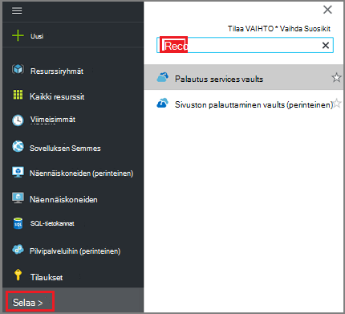
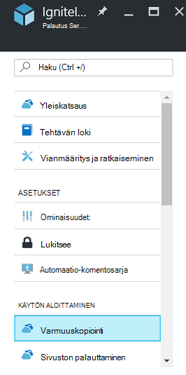
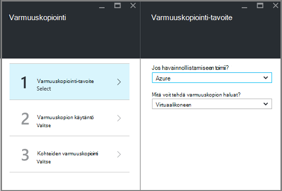
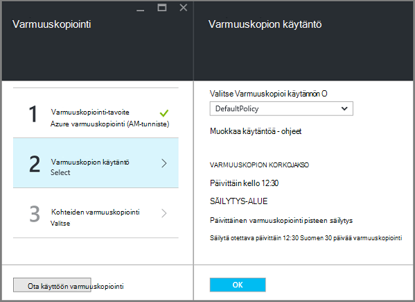
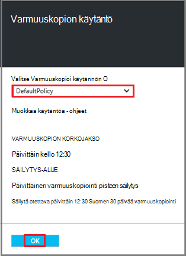
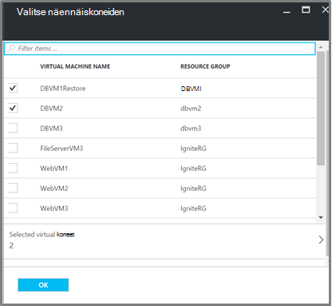
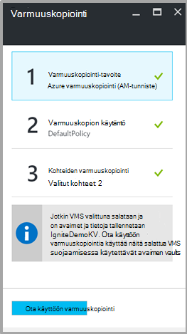

<properties
   pageTitle="Varmuuskopiointi ja palauttaminen salattu VMs Azure varmuuskopioinnista"
   description="Tässä artikkelissa on lyhyt varmuuskopiointi ja palauttaminen käyttökokemusta VMs salataan Azure salauksen avulla."
   services="backup"
   documentationCenter=""
   authors="JPallavi"
   manager="vijayts"
   editor=""/>
<tags
   ms.service="backup"
   ms.devlang="na"
   ms.topic="article"
   ms.tgt_pltfrm="na"
   ms.workload="storage-backup-recovery"
   ms.date="10/25/2016"
   ms.author="markgal; jimpark; trinadhk"/>

# Varmuuskopiointi ja palauttaminen salattu VMs Azure varmuuskopioinnista

Tässä artikkelissa on lyhyt varmuuskopioiminen ja palauttaminen käyttämällä Azure varmuuskopion näennäiskoneiden vaiheet. Se sisältää myös tietoja tuetut tilanteet, vaatimat ja vianmääritysohjeita virhe tapauksissa.

## Tuetut tilanteet

> [AZURE.NOTE]
1.  Salatun VMs palauttaminen ja varmuuskopiointi tuetaan vain Resurssienhallinta käyttöön näennäiskoneiden. Se ei tue perinteinen näennäiskoneiden.  
2.  Se on tuettu vain näennäiskoneiden salattu BitLocker salausavaimen ja avain salausavain. Se ei tue näennäiskoneiden salattu BitLocker salausavaimen vain.  

## Vaatimukset

1.  Käyttämällä [Azure salauksen](../security/azure-security-disk-encryption.md)virtuaalikoneen on salattu. Olisi salattu BitLocker salausavaimen ja avaimen salauksen avaimen avulla.
2.  Palautus services säilö on luotu ja tallennustilaa replikoinnin Määritä artikkelissa [Varmuuskopiointi ympäristön valmisteleminen](backup-azure-arm-vms-prepare.md)mainittujen ohjeiden mukaisesti.

## Varmuuskopiointi salattu AM
Seuraavien vaiheiden avulla voit määrittää varmuuskopioinnin tavoite, määrittää käytännön, kohteet ja käynnistimen varmuuskopioinnin määrittäminen.

### Määritä varmuuskopiointi

1. Jos sinulla on jo Avaa palautus palvelut-säilö, jatka seuraavaan vaiheeseen. Jos ei ole palautus-palveluiden Avaa säilöön, mutta Azure-portaalissa on toiminto-valikosta valitsemalla **Selaa**.

  - Kirjoita resurssit-luettelosta **Palautus-palvelut**.
  - Kun alat kirjoittaa, luettelon suodattimet kirjoittamiesi tietojen perusteella. Kun näet **palautus Services vaults**, napsauttamalla sitä.
  
        

    Palautus Services vaults luettelo tulee näkyviin. Palautus Services vaults luettelosta säilöön.

    Valitun säilö raporttinäkymät-ikkuna avautuu.

2. Valitse kohteiden luettelo, joka näkyy alla säilöön, **Varmuuskopiointi** Avaa varmuuskopio-sivu.

       
    
3. Valitse Varmuuskopiointi-sivu **Varmuuskopiointi tavoitteen** Avaa varmuuskopio-tavoite-sivu.

       
    
4.   Varmuuskopion tavoite-sivu Määritä **jossa havainnollistamiseen on käynnissä** Azure ja **mitä voit tehdä varmuuskopion haluat** Virtual tietokoneeseen, valitse **OK**.

    Varmuuskopiointi-tavoite-sivu sulkeutuu ja varmuuskopiointi käytäntö-sivu avautuu.

       

5. Valitse Varmuuskopiointi käytäntö-sivu varmuuskopion käytännön koske säilö ja valitse **OK**.

       

    Oletuskäytäntö tiedot näkyvät tiedot. Jos haluat luoda käytännön, valitse **Luo uusi** avattavasta valikosta. Kun valitset **OK**, varmuuskopion käytäntö on liitetty säilö.

    Valitse seuraavaksi VMs liitettävä säilö.
    
6. Valitse salattu näennäiskoneiden määritettyä käytäntöä liittäminen ja valitse sitten **OK**.

      
   
7. Tällä sivulla näkyvät valittuna salatun VMs liittyvät avaimen säilö sanoma. Varmuuskopiointi-palvelu edellyttää näppäimet ja avaimen säilö tietoja vain luku-tilassa. Se käyttää näiden oikeuksien varmuuskopioiden näppäimen ja salainen, sekä liittyvät VMs. 

      

      Nyt kun olet määrittänyt kaikki säilö varmuuskopiointi-sivu-asetukset Valitse käyttöön varmuuskopio sivun alareunassa. Ota käyttöön varmuuskopiointi ottaa käyttöön käytännön säilö ja VMs.

8. Seuraava vaihe valmistelussa asentaa AM-agentti tai varmistetaan, että AM-agentti asennettu. Käytä artikkelissa [Varmuuskopiointi ympäristön valmisteleminen](backup-azure-arm-vms-prepare.md)mainitut vaiheet samat. 

### Käynnistävän varmuuskopiointi
Ohjeiden on artikkelissa [Varmuuskopiosta palauttaminen services säilöön, Azure VMs](backup-azure-arm-vms.md) käynnistimen varmuuskopiointityön mainituista.

## Palauttaa salatun AM
Palauttaa n salatun ja salattu näennäiskoneiden on sama. [Palauttaa Azure-portaalissa näennäiskoneiden](backup-azure-arm-restore-vms.md) mainittujen vaiheiden avulla voit palauttaa salattuja AM. Siltä varalta, että haluat palauttaa näppäimet ja tietoja, sinun on varmistettava, että tärkeimmät säilö palauttamisesta on jo olemassa.

## Vianmääritys

| Toiminto | Virheen yksityiskohtaiset tiedot | Tarkkuus |
| -------- | -------- | -------|
| Varmuuskopiointi | Vahvistus epäonnistui, koska virtuaalikoneen on salattu BEK yksinään. Varmuuskopioiden voi ottaa käyttöön vain näennäiskoneiden salattu BEK ja KEK. | Virtuaalikoneen salattu BEK ja KEK avulla. Tämän jälkeen varmuuskopiointi tulisi olla käytössä. |
| Palauttaminen | Et voi palauttaa tämän salattuja AM, koska tämä AM liittyvän avaimen säilö ei ole. | Luo avaimen avulla [Aloittaminen Azure avaimen säilö](../key-vault/key-vault-get-started.md)säilö. Lisätietoja on artikkelissa palauttaa avain ja salainen, jos niitä ei ole [palauttaa avaimen säilöön-näppäintä ja Azure varmuuskopioinnista salaisuus](backup-azure-restore-key-secret.md) . |
| Palauttaminen | Et voi palauttaa tämän salattuja AM, koska avain ja liittyvän tähän AM salaisuus ei ole. | Lisätietoja on artikkelissa palauttaa avain ja salainen, jos niitä ei ole [palauttaa avaimen säilöön-näppäintä ja Azure varmuuskopioinnista salaisuus](backup-azure-restore-key-secret.md) . |
