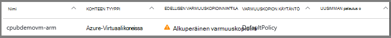
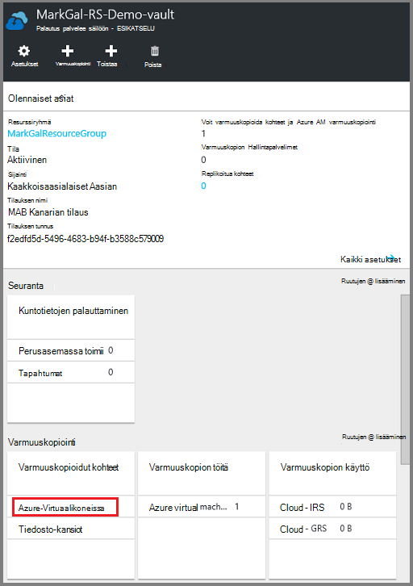
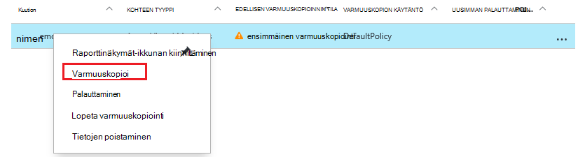
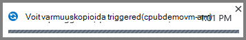

<properties
    pageTitle="Etsi ensin: Azure VMs suojaaminen palautus-palveluiden säilö | Microsoft Azure"
    description="Suojaa Azure VMs palautus-palveluiden säilö. Varmuuskopioiden Resurssienhallinta käyttöön VMs, klassinen käyttöön VMs ja Premium tallennustilan VMs avulla voit suojata tiedot. Luo ja rekisteröi palautus-palveluiden säilö. Rekisteröi VMs-käytännön luominen ja suojata VMs Azure-tietokannassa."
    services="backup"
    documentationCenter=""
    authors="markgalioto"
    manager="cfreeman"
    editor=""
    keyword="backups; vm backup"/>

<tags
    ms.service="backup"
    ms.workload="storage-backup-recovery"
    ms.tgt_pltfrm="na"
    ms.devlang="na"
    ms.topic="hero-article"
    ms.date="10/13/2016"
    ms.author="markgal; jimpark"/>

# Etsi ensin: Azure VMs suojaaminen palautus palvelut-säilö

> [AZURE.SELECTOR]
- [Suojaa VMs palautus palvelut-säilö](backup-azure-vms-first-look-arm.md)
- [Suojaa VMs varmuuskopion säilöön](backup-azure-vms-first-look.md)

Tässä opetusohjelmassa kerrotaan luominen palautus-palveluiden säilö ja varmuuskopioiminen Azure virtuaalikoneen (AM). Palautus services vaults suojaa:

- Azure Resurssienhallinta käyttöön VMs
- Perinteinen VMs
- Vakio-tallennustilan VMs
- Tallennustilan Premium VMs
- Salattu Azure salauksen, BEK ja KEK VMs

Saat lisätietoja tallennustilan Premium VMs suojaaminen [varmuuskopioiminen ja palauttaminen Premium tallennustilan VMs](backup-introduction-to-azure-backup.md#back-up-and-restore-premium-storage-vms)

>[AZURE.NOTE] Tässä opetusohjelmassa oletetaan, että sinulla AM Azure-tilaukseesi ja ovat tulleet toimenpiteet varmuuskopion palvelu voi käyttää AM.

[AZURE.INCLUDE [learn-about-Azure-Backup-deployment-models](../../includes/backup-deployment-models.md)]

Korkean tason seuraavien ohjeiden mukaisesti, jotka suoritettava.  

1. Voit luoda palautus-palveluiden säilöön AM.
2. Valitse skenaario, määrittää käytännön, ja tunnistaa kohteet suojaaminen Azure portaalin avulla.
3. Alkuperäinen varmuuskopiointi suoritetaan.

## Luo AM palautus palvelut-säilö

Palautus palvelut-säilö on yritys, joka sisältää kaikki varmuuskopiointi ja palauttaminen pistettä, jotka on luotu ajan kuluessa. Palautus services säilö sisältää myös suojatun VMs varmuuskopion käytäntöä.

>[AZURE.NOTE] VMs varmuuskopioiminen on paikallinen prosessi. Ei voi varmuuskopioida VMs sijainnista, palautus-palveluiden säilö toiseen sijaintiin. Siis jokaisen Azure sijainnin, jossa on VMs varmuuskopioitavien, ainakin palautus services säilö on oltava kyseiseen sijaintiin.

Voit luoda palautus-palveluiden säilö seuraavasti:

1. Kirjautuminen [Azure portal](https://portal.azure.com/).

2. Valitse toiminto-valikosta valitsemalla **Selaa** ja kirjoita resurssien luetteloa, **Palautus-palvelut**. Kun alat kirjoittaa, luettelon suodattimet kirjoittamiesi tietojen perusteella. Valitse **palautus-palveluiden säilö**.

      

    Palautus services vaults luettelo näytetään.

3. **Palautus Services vaults** -valikosta **Lisää**.

    

    Palautus Services säilö-sivu avautuu, kannattaa antaa **nimi**, **tilauksen**, **resurssiryhmä**ja **sijainti**.

    

4. Kirjoita kutsumanimi tunnistavan säilö **nimi**. Nimen on oltava yksilöllinen Azure-tilausta. Kirjoita nimi, joka sisältää 2 – 50 merkkiä. Se on alettava kirjaimella, ja voivat sisältää vain kirjaimia, numeroita ja väliviivoja.

5. Valitse **tilaus** tilaukset käytettävissä luettelossa. Jos et ole varma, mikä tilaus käyttämään, käytä oletusarvoa (tai ehdotetut) tilaukseen. On useita vaihtoehtoja vain, jos organisaation tilillä on liitetty useita Azure-tilauksia.

6. **Resurssiryhmä** resurssin ryhmien käytettävissä luettelo tai luo valitsemalla **Uusi** resurssiryhmä. Resurssiryhmät Lisätietoja on artikkelissa [Azure resurssien hallinnan yleiskatsaus](../azure-resource-manager/resource-group-overview.md)

7. Valitse **sijainti** Valitse säilö maantieteellinen alue. Säilö **on** oltava sama alue kuin näennäiskoneiden, jonka haluat suojata.

    >[AZURE.IMPORTANT] Jos ole varma, onko sijainnista, jossa oman AM sijaitsee, sulje ulos säilö luominen-valintaikkuna ja siirry näennäiskoneiden luettelo-portaalissa. Jos näennäiskoneiden on useita alueita, Luo palautus-palveluiden säilö kunkin alueen. Luo säilö ensimmäiseen kohtaan ennen kuin siirryt seuraavaan sijaintiin. Ei tarvita, jos haluat määrittää tallennustilan tilit varmuuskopiotiedot--palautus services säilö tallentamiseen ja Azure varmuuskopion palvelun käsitellä tämä automaattisesti.

8. Valitse **Luo**. Se voi viedä aikaa palautus services säilö luodaan. Seurata tilailmoitukset portaalin oikeassa yläkulmassa-alueella. Kun oman säilö on luotu, se näkyy palautus services vaults luettelo.

    

Nyt kun olet luonut lisääminen säilöön, lisätietoja tallennustilan replikoinnin määrittämisestä.

### Tallennustilan replikoinnin määrittäminen

Tallennustilan replikoinnin-asetuksen avulla voit valita geo ylimääräinen ja paikallisesti tarpeettomat välillä. Oman säilö on oletusarvoisesti geo ylimääräinen. Jätä arvoksi geo ylimääräinen, jos kyseessä on ensisijainen varmuuskopiointi-vaihtoehto. Jos haluat halvempaa vaihtoehto, joka ei ole yhtä kestävät, valitse paikallisesti ylimääräinen. Lue lisätietoja [geo tarpeettomat](../storage/storage-redundancy.md#geo-redundant-storage) ja [paikallisesti tarpeettomat](../storage/storage-redundancy.md#locally-redundant-storage) tallennusasetukset [Azuren tallennustilaan replikoinnin yleiskatsaus](../storage/storage-redundancy.md).

Voit muokata tallennustilan replikoinnin asetusta seuraavasti:

1. Valitse oman säilö Avaa säilö Raporttinäkymät-ikkunan ja asetukset-sivu. Jos **asetukset** -sivu ei avaudu, valitse **kaikki asetukset** säilö Raporttinäkymät-ikkunan.

2. Valitse **asetukset** -sivu **Varmuuskopiointi infrastruktuurin** > **Varmuuskopioinnin määrittäminen** Avaa **Varmuuskopio-määritys** -sivu. Valitse **Varmuuskopiointi määritys** -sivu lisääminen säilöön replikoinnin tallennuspaikka.

    

    Sen jälkeen, että säilö tallennustilan-vaihtoehdon valitseminen olet valmis AM liitettävä säilö. Aloita suhteen olisi löydä ja rekisteröi Azure-virtuaalikoneissa.

## Valitse Varmuuskopioi tavoite, määrittää käytännön, ja suojata kohteiden määrittäminen

Ennen rekisteröitymistä AM säilöön, jonka Suorita etsiminen prosessi varmistaa, että uusi näennäiskoneiden, jotka on lisätty tilaukseen tunnistetaan. Prosessin kyselyt Azure näennäiskoneiden tilauksen, lisätietoja sekä luettelo, kuten cloud palvelun nimen ja haluamasi alue. Azure-portaalissa skenaarion viittaa mitä aiot laittaa palautus services säilö. Käytäntö on kun ja aikavälin palautuksen pisteiden otetaan aikataulua. Käytännön myös säilytys alueen palautus kohdeosoite.

1. Jos sinulla on jo säilö Avaa palautus-palveluja, siirry vaiheeseen 2. Jos sinulla ei ole palautuksen services Avaa säilöön, mutta eivät Azure-portaalissa toiminto-valikosta valitsemalla **Selaa**.

  - Kirjoita resurssit-luettelosta **Palautus-palvelut**.
  - Kun alat kirjoittaa, luettelon suodattimet kirjoittamiesi tietojen perusteella. Kun näet **palautus Services vaults**, napsauttamalla sitä.

      

    Palautus services vaults luettelo tulee näkyviin.
  - Palautus services vaults luettelosta säilöön.

    Valitun säilö raporttinäkymät-ikkuna avautuu.

    

2. Valitse säilö raporttinäkymät-valikko **Varmuuskopiointi** Avaa varmuuskopio-sivu.

    

    Kun sivu avautuu, varmuuskopiointi-palvelun etsii kaikki uudet VMs-tilaus.

    

3. Valitse Varmuuskopiointi-sivu **Varmuuskopiointi tavoitteen** Avaa varmuuskopio-tavoite-sivu.

    

4. Varmuuskopion tavoite-sivu Määritä **jossa havainnollistamiseen on käynnissä** Azure ja **mitä voit tehdä varmuuskopion haluat** Virtual tietokoneeseen, valitse **OK**.

    Varmuuskopiointi-tavoite-sivu sulkeutuu ja varmuuskopiointi käytäntö-sivu avautuu.

    

5. Valitse Varmuuskopiointi käytäntö-sivu varmuuskopion käytäntö käyttää säilö ja valitse **OK**.

    

    Oletuskäytäntö tiedot näkyvät tiedot. Jos haluat luoda käytännön, valitse **Luo uusi** avattavasta valikosta. Avattava valikko on myös vaihtoehdon voit siirtyä aika, kun tilannevedos on tehty, 7 PM. Ohjeita varmuuskopion käytännön määrittämisestä on artikkelissa [varmuuskopion käytännön määrittäminen](backup-azure-vms-first-look-arm.md#defining-a-backup-policy). Kun valitset **OK**, varmuuskopion käytäntö on liitetty säilö.

    Valitse seuraavaksi VMs liitettävä säilö.

6. Valitse näennäiskoneiden määritettyä käytäntöä liittäminen ja valitse sitten **Valitse**.

    

    Jos et näe haluamaasi AM, tarkista, että se on palautus Services säilö Azure samaan sijaintiin.

7. Nyt kun olet määrittänyt kaikki säilö varmuuskopiointi-sivu-asetukset valitse **Käyttöön varmuuskopiointi** sivun alareunassa. Tämä ottaa käyttöön käytännön säilö ja VMs.

    

## Alkuperäinen varmuuskopiointi

Kun varmuuskopioinnin käytäntö on otettu käyttöön virtuaalikoneen, joka ei tarkoita tiedot on luotu varmuuskopio. Oletusarvon mukaan ajoitettu varmuuskopiointi (varmuuskopion käytännön määritelty) on alkuperäinen varmuuskopion. Ennen kuin ensimmäinen varmuuskopioinnin ilmenee, viimeisen varmuuskopioinnin tilan **Varmuuskopiointityöt** -sivu näyttää **Varoitus (alkuperäinen varmuuskopio odottaa)**.

Ellei Aloita pian määräaikana ensimmäisen varmuuskopion, on suositeltavaa, että suoritat **Varmuuskopioi**.

**Varmuuskopioi**suorittaminen

1. Valitse **Azuren näennäiskoneiden** säilö koontinäytössä **Varmuuskopiointi** -ruutu  
    

    **Varmuuskopiointi-kohteita** -sivu avautuu.

2. Valitse **Varmuuskopiointi kohteet** -sivu säilöön, jonka haluat varmuuskopioida hiiren kakkospainikkeella ja valitse **Varmuuskopioi**.

    

    Työ käynnistyy.  

    

3. Voit tarkastella, että ensimmäinen varmuuskopiointi on valmis, säilö koontinäytössä **Varmuuskopiointityöt** -ruutu valitsemalla **Azure-virtuaalikoneissa**.

    

    Varmuuskopiointi työt-sivu avautuu.

4. Varmuuskopiointi työt-sivu näet kaikki töiden tilan.

    

    >[AZURE.NOTE] Varmuuskopiointi osana Azure varmuuskopion palvelun ongelmien vianmääritys kunkin AM Tyhjennä kaikki kirjoituksia ja ota johdonmukaisia tilannevedos varmuuskopion laajennuksen komennon.

    Kun varmuuskopiointityön on valmis, tila on *Valmis*.

[AZURE.INCLUDE [backup-create-backup-policy-for-vm](../../includes/backup-create-backup-policy-for-vm.md)]

## Asenna virtuaalikoneen AM-agentti

Nämä tiedot annetaan siltä varalta, että se tarvita. Azure AM agentti on oltava asennettuna Azure virtuaalikoneen toimimaan varmuuskopiointi-tunnisteeseen. Jos oman AM luotiin Azure-valikoimasta, valitse AM-agentti on jo virtuaalikoneen. VMs, jotka siirretään-paikallisen palvelinkeskusten ei AM-agentti asennettu. Tässä tapauksessa AM-agentti on asennettava. Jos sinulla on ongelmia Azure AM varmuuskopioiminen, tarkista, että Azure AM agentti on asennettu oikein virtuaalikoneen (Katso alla olevaa taulukkoa). Jos luot mukautetun AM, ennen kuin virtuaalikoneen [Varmista **Asenna AM Agent** -valintaruutu on valittuna](../virtual-machines/virtual-machines-windows-classic-agents-and-extensions.md) on valmisteltu.

Lisätietoja [AM agentti](https://go.microsoft.com/fwLink/?LinkID=390493&clcid=0x409) ja [asennusohjeet](../virtual-machines/virtual-machines-windows-classic-manage-extensions.md).

Seuraavassa taulukossa on lisätietoja AM Agent for Windowsista tai Linux VMs.

| **Toiminto** | **Windows** | **Linux** |
| --- | --- | --- |
| Asentaminen AM-agentti | <li>Lataa ja asenna [MSI-agentti](http://go.microsoft.com/fwlink/?LinkID=394789&clcid=0x409). Sinun on järjestelmänvalvojan oikeudet ja viimeistele asennus. <li>[AM-ominaisuuden päivittäminen](http://blogs.msdn.com/b/mast/archive/2014/04/08/install-the-vm-agent-on-an-existing-azure-vm.aspx) osoittamaan, että agentti on asennettu. | <li> Asenna uusimmat [Linux agentti](https://github.com/Azure/WALinuxAgent) GitHub. Sinun on järjestelmänvalvojan oikeudet ja viimeistele asennus. <li> [AM-ominaisuuden päivittäminen](http://blogs.msdn.com/b/mast/archive/2014/04/08/install-the-vm-agent-on-an-existing-azure-vm.aspx) osoittamaan, että agentti on asennettu. |
| Päivittäminen AM-agentti | Päivittäminen AM-agentti sujuu yhtä helposti kuin uudelleenasentaminen [AM agentti binaaritiedostot](http://go.microsoft.com/fwlink/?LinkID=394789&clcid=0x409).  Varmista, että mitään varmuuskopioinnin ei käytössä, kun AM-agentti päivitetä. | Päivityksiä [Linux AM agentti ](../virtual-machines-linux-update-agent.md)ohjeiden mukaisesti.  Varmista, että mitään varmuuskopioinnin ei käytössä, kun AM-agentti päivitetä. |
| AM Agent-asennuksen tarkistaminen | <li>Siirry Azure AM *C:\WindowsAzure\Packages* -kansioon. <li>Löydät tulisi esitä WaAppAgent.exe tiedoston.<li> Tiedostoa hiiren kakkospainikkeella, valitse **Ominaisuudet**ja valitse **tiedot** -välilehti. Tuoteversio-kentässä on oltava 2.6.1198.718 tai uudempi versio. | PUUTTUU |

### Varmuuskopion tunniste

Kun AM-agentti asennettu virtuaalikoneen, Azure varmuuskopion palvelu asentaa varmuuskopion tunniste AM-agentti. Azure varmuuskopion palvelun päivittää saumattomasti ja korjaa muita viittauksista varmuuskopion tunniste.

Varmuuskopion tunniste on asennettu varmuuskopiointi-palvelu, onko AM. Käynnissä olevat AM on eniten mahdollisuutta käytön sovelluksen yhdenmukaisia palautus-kohta. Azure varmuuskopiointi-palvelun säilyy kuitenkin varmuuskopiointi AM, vaikka se on poistettu käytöstä ja laajennus ei voitu asentaa. Tätä kutsutaan offline-tilassa AM. Tässä tapauksessa palautus-kohta on *yhtenäinen kaatumisen*.

## Vianmääritystiedot
Jos sinulla on ongelmia, joiden joitakin tehtäviä, tämän artikkelin avulla voit suorittaa, ota yhteyttä [vianmääritys ohjeita](backup-azure-vms-troubleshoot.md).

## Hinnat
Azure AM varmuuskopiointi veloitetaan suojattu esiintymät mallin pohjalta. Lue lisätietoja [Hinnoittelu varmuuskopiointi](https://azure.microsoft.com/pricing/details/backup/)

## Kysymyksiä?
Jos sinulla on kysymyksiä tai jos mikä tahansa ominaisuus, jonka haluat nähdä sisältää, [Lähetä meille palautetta](http://aka.ms/azurebackup_feedback).
