<properties
    pageTitle="Ensimmäiset: Suojaaminen Azure VMs varmuuskopion säilö | Microsoft Azure"
    description="Azure VMs suojaaminen varmuuskopioimalla säilö. Opetusohjelma kerrotaan luoda säilöön, rekisteröidä VMs, käytännön ja suojaa VMs Azure-tietokannassa."
    services="backup"
    documentationCenter=""
    authors="markgalioto"
    manager="cfreeman"
    editor=""/>

<tags
    ms.service="backup"
    ms.workload="storage-backup-recovery"
    ms.tgt_pltfrm="na"
    ms.devlang="na"
    ms.topic="hero-article"
    ms.date="09/15/2016"
    ms.author="markgal; jimpark"/>

# Etsi ensin: Azuren näennäiskoneiden varmuuskopiointi

> [AZURE.SELECTOR]
- [Suojaa VMs palautus palvelut-säilö](backup-azure-vms-first-look-arm.md)
- [Azure VMs suojaaminen varmuuskopion säilöön](backup-azure-vms-first-look.md)

Tässä opetusohjelmassa siirryt Azure virtuaalikoneen (AM) varmuuskopioiminen opastuksen varmuuskopion säilö Azure-tietokannassa. Tässä artikkelissa kuvataan perinteinen-mallin tai palvelun hallinta käyttöönoton mallin VMs varmuuskopiointia varten. Jos olet kiinnostunut varmuuskopioinnista AM palautus palvelut-säilö, joka kuuluu resurssiryhmä, katso [ensin kohde: suojaa VMs kanssa palautus-palveluiden säilö](backup-azure-vms-first-look-arm.md). Tässä opetusohjelmassa suorittaminen, on oltava nämä edellytykset:

- Olet luonut AM Azure-tilaukseesi.
- AM on yhteys Azure julkiseen IP-osoitteisiin. Lisätietoja on artikkelissa [verkkoyhteyden](./backup-azure-vms-prepare.md#network-connectivity).

Voit varmuuskopioida AM on viisi päävaihetta:  

 Luo varmuuskopio säilöön tai tunnistaa olemassa varmuuskopio säilö.  
 Azure perinteinen portaalin avulla voit tutkia ja rekisteröi näennäiskoneiden.  
 asentaa AM-agentti.  
 näennäiskoneiden suojaamisessa käytettävät käytännön.  
 varmuuskopiointi suoritetaan.

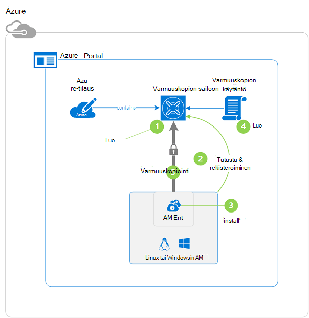

>[AZURE.NOTE] Azure on kaksi käyttöönoton mallien luominen ja käyttäminen resurssit: [Resurssienhallinta ja perinteinen](../resource-manager-deployment-model.md). Tässä opetusohjelmassa on tarkoitettu käytettäväksi VMs voidaan luoda Azure perinteinen-portaalissa. Azure varmuuskopiointi-palvelu tukee Resurssienhallinta-pohjainen VMs. Lisätietoja varmuuskopioinnista VMs palautus-palveluiden säilö on artikkelissa [ensimmäinen kohde: suojaa VMs kanssa palautus-palveluiden säilö](backup-azure-vms-first-look-arm.md).

## Vaihe 1 – Luo varmuuskopio säilöön AM

Varmuuskopion säilö on yritys, joka sisältää kaikki varmuuskopiointi ja palauttaminen pistettä, jotka on luotu ajan kuluessa. Varmuuskopion säilö sisältää myös varmuuskopion käytäntöjä, joita käytetään varmuuskopioidaan näennäiskoneiden.

1. Kirjautuminen [Azure perinteinen portal](http://manage.windowsazure.com/).

2. Valitse **Uusi** Azure portaalin vasemmassa alakulmassa

    

3. Nopea luominen ohjatun toiminnon Valitse **Tietopalvelujen** > **Palautus Services** > **Varmuuskopiointi säilö** > **Nopea luominen**.

    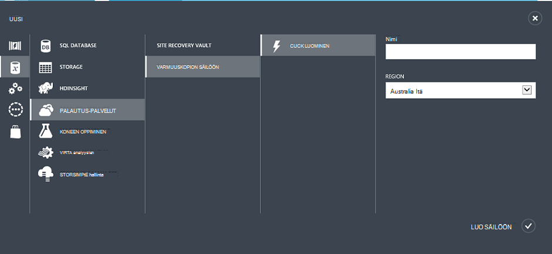

    Ohjattu toiminto kehottaa sinua **nimi** -ja **alueasetukset**. Jos vastuullasi useita tilauksia, näyttöön tulee valintaikkuna, voi valita tilaus.

4. Kirjoita kutsumanimi tunnistavan säilö **nimi**. Nimen on oltava yksilöllinen Azure-tilausta.

5. Valitse **alue**-säilö maantieteellinen alue. Säilö **on** oltava sama kuin se suojaa näennäiskoneiden alue.

    Jos et tiedä alue, jossa oman AM sijaitsee, sulje ohjattu toiminto ja valitse **näennäiskoneiden** Azure palveluluetteloon. Sijainti-sarakkeessa on alueen nimi. Jos näennäiskoneiden on useita alueita, luo varmuuskopion säilö kunkin alueen.

6. Jos ei ole **tilaus** -valintaikkunan ohjatun toiminnon, siirry seuraavaan vaiheeseen. Jos käytössäsi on useita tilauksia, valitse uusi varmuuskopion säilö liitettävä tilaus.

    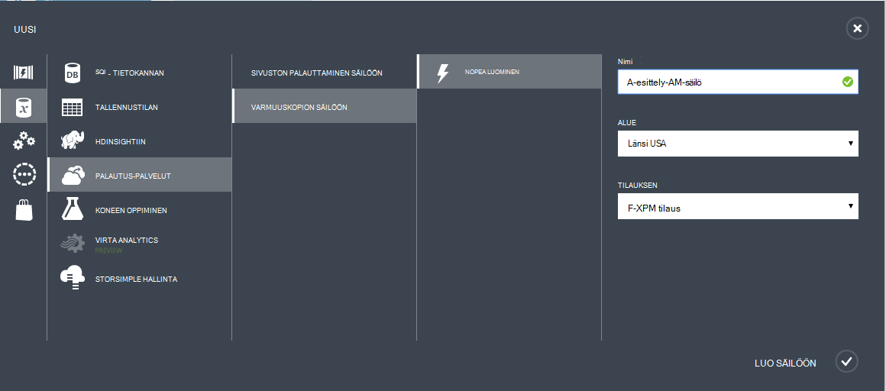

7. Valitse **Luo säilö**. Voi kestää hetken, luoda varmuuskopion säilö. Seurata tilailmoitukset portaalin alareunassa.

    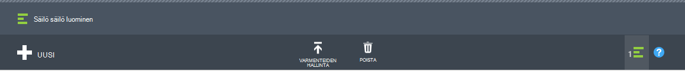

    Sanoma vahvistaa säilö on luotu. Se näy **palautus palveluita** -sivulle **aktiiviseksi**.

    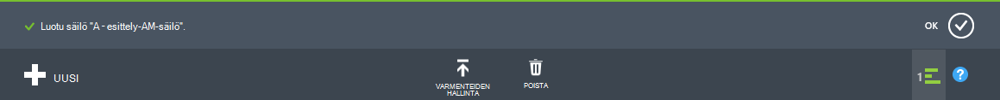

8. Valitse luomasi **Pika-aloitus** -aloitussivulla säilö vaults **Palautus palvelut** -sivulla luettelo.

    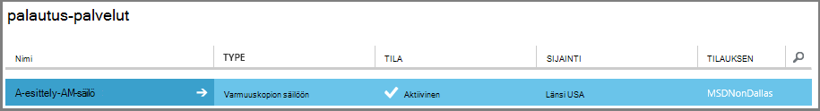

9. Napsauta **Pika-aloitus** -sivulla **Määritä** Avaa replikoinnin tallennuspaikka.
    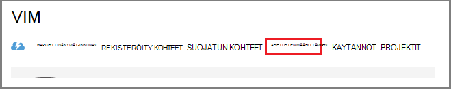

10. **Tallennustilan replikoinnin** -asetus, että säilö vaihtoehto replikoinnin.

    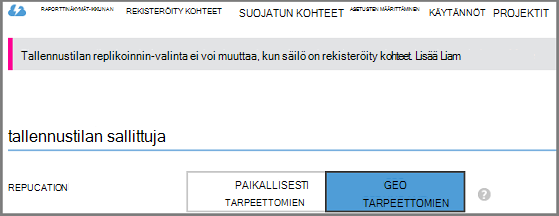

    Oman säilö on oletusarvoisesti geo ylimääräinen. Valitse geo ylimääräinen, jos kyseessä on ensisijainen varmuuskopion. Jos haluat halvempaa vaihtoehto, joka ei ole aivan kestävät, valitse paikallisesti ylimääräinen. Lisätietoja on artikkelissa [Azure-tallennustilan replikoinnin yleiskatsaus](../storage/storage-redundancy.md)geo tarpeettomat ja paikallisesti tarpeettomat tallennusasetukset.

Sen jälkeen, että säilö tallennustilan-vaihtoehdon valitseminen olet valmis AM liitettävä säilö. Voit aloittaa suhteen, tutustu ja rekisteröi Azure-virtuaalikoneissa.

## Vaihe 2 – Tutustu ja rekisteröi Azuren näennäiskoneiden
Ennen rekisteröimistä AM säilöön, suorita tunnistaa kaikki uudet VMs etsintä-prosessi. Tämä palauttaa näennäiskoneiden luettelo tilauksen sekä muita tietoja, kuten cloud palvelun nimen ja haluamasi alue.

1. Kirjautuminen [Azure perinteinen portal](http://manage.windowsazure.com/)

2. Azure perinteinen-portaalissa Valitse Avaa palautus Services vaults luettelo **Palautus-palvelut** .
    

3. Valitse säilö AM varmuuskopioida vaults-luettelosta.

    Kun valitset lisääminen säilöön, se avautuu **Pika-aloitus** -sivulla

4. Valitse säilöön-valikossa **Rekisteröity kohteet**.

    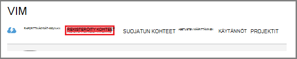

5. Valitse **tyyppi** -valikosta **Azure virtuaalikoneen**.

    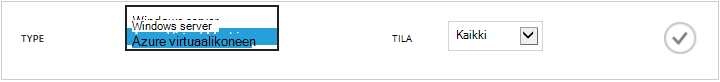

6. Valitse sivun alareunassa **LÖYTÄMINEN** .
    

    Etsintä-prosessi voi kestää muutaman minuutin aikana näennäiskoneiden on parhaillaan taulukkomuotoinen. Ei ilmoituksessa, joka ilmoittaa, että prosessi on käynnissä näytön alareunassa.

    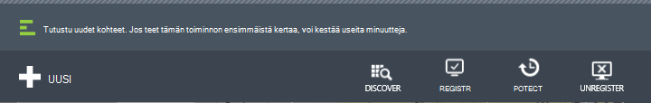

    Ilmoitus muuttuu, kun prosessi on suoritettava.

    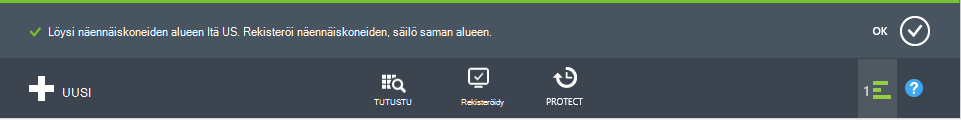

7. Valitse sivun alareunassa **Rekisteröi** .
    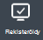

8. **Rekisteröi kohteita** hiiren kakkospainikkeella ja valitse näennäiskoneiden, jonka haluat rekisteröidä.

    >[AZURE.TIP] Useita näennäiskoneiden voidaan rekisteröidä samalla kertaa.

    Työn luodaan kunkin virtual machine, jotka olet valinnut.

9. Valitse **Näytä projektin** **työt** -sivun ilmoituksen.

    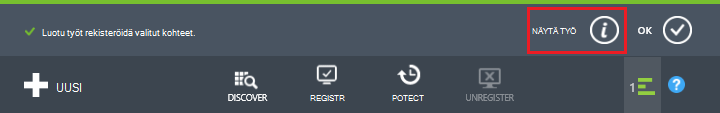

    Virtuaalikoneen näkyy myös rekisteröity kohteita sekä rekisteröinnin toiminnon tilan luettelo.

    

    Kun toiminto on valmis, tila muuttuu vastaamaan *rekisteröity* -tilaan.

    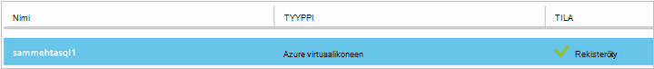

## Vaihe 3: Asenna virtuaalikoneen AM-agentti

Azure AM agentti on oltava asennettuna Azure virtuaalikoneen toimimaan varmuuskopiointi-tunnisteeseen. Jos yhteyttä AM luotiin Azure-valikoimasta, AM-agentti on jo olemassa AM. Voit siirtyä [suojaaminen oman VMs](backup-azure-vms-first-look.md#step-4-protect-azure-virtual-machines).

Jos yhteyttä AM siirtänyt tiedot paikallisen palvelinkeskukseen, AM todennäköisesti AM agentti ole asennettu. Asenna ennen jatkamista AM suojaaminen virtuaalikoneen AM-agentti. Lisätietoja kohdasta asentamisesta AM-agentti on [Varmuuskopiointi VMs artikkelin AM Agent-osassa](backup-azure-vms-prepare.md#vm-agent).

## Vaihe 4 – varmuuskopio-käytännön luominen
Ennen kuin voit käynnistää alkuperäinen varmuuskopiointityön, Määritä ajoitus varmuuskopion tilannevedoksia otettaessa. Aikataulu, kun varmuuskopioinnin tilannevedoksia otetaan ja pituutta näiden tilannevedoksia säilyvät, on varmuuskopion käytäntö. Säilytys-tiedot perustuu NO@LOC isä-poika varmuuskopion kierto värimallin.

1. Siirry Azure perinteinen portaalissa varmuuskopion säilö **Palautus** -palvelut ja sitten **Rekisteröity kohteet**.
2. Valitse avattavasta valikosta **Azure virtuaalikoneen** .

    

3. Valitse **Suojaa** sivun alareunassa.
    

    **Suojaa ohjatun** tulee näkyviin ja näyttää *vain* näennäiskoneiden, joka on rekisteröity ja ei ole suojattu.

    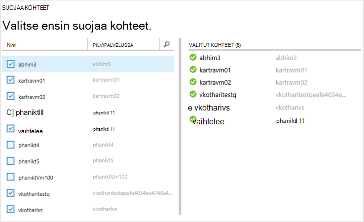

4. Valitse näennäiskoneiden, jonka haluat suojata.

    Jos määritettynä on vähintään kaksi saman niminen näennäiskoneiden, erottaa näennäiskoneiden Cloud-palvelun avulla.

5. **Määritä suojaus** -valikon Valitse olemassa olevaa käytäntöä tai luoda uuden käytännön suojaaminen näennäiskoneiden, jotka voit tunnistaa.

    Uusi varmuuskopio vaults on oletuskäytäntö, liittyvät säilö. Käytäntö tulee tilannevedoksen kunkin illalla päivän, ja päivittäisen tilannevedoksen säilytetään 30 päivää. Kunkin varmuuskopion käytännön voi olla useita näennäiskoneiden liittyy. Kuitenkin virtuaalikoneen voi olla vain yksi käytäntö liitetty kerrallaan.

    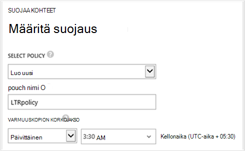

    >[AZURE.NOTE] Varmuuskopion käytäntö sisältää ajoitettujen varmuuskopioiden säilytys malli. Jos valitset aiemmin varmuuskopion käytännön, et voi muokata seuraavassa vaiheessa säilytys-asetukset.

6. **Säilytys** -alueen Määritä päivittäin, viikoittain, kuukausittain ja vuosittaisen tietyn varmuuskopion kohdeosoite.

    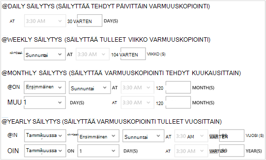

    Säilytyskäytännön määrittää projektiin varmuuskopion pituutta. Voit määrittää eri säilytyskäytännöt varmuuskopioinnin otettaessa perusteella.

7. Valitse tarkastelemisesta **Määrittäminen suojaus** töiden **työt** .

    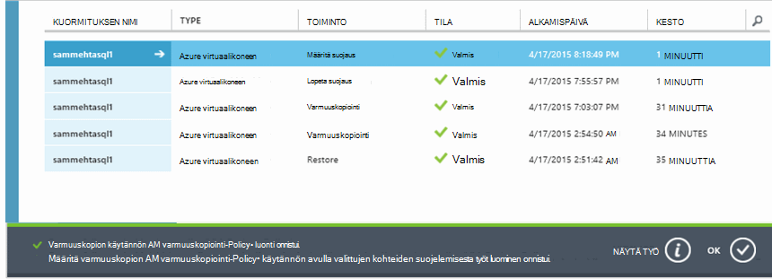

    Nyt kun olet muodostanut käytäntö, siirry seuraavaan vaiheeseen ja suorita alkuperäinen varmuuskopion.

## Vaihe 5 – ensimmäinen varmuuskopiointi

Kun virtual machine on suojattu käytännön kanssa, voit tarkastella yhteys **Suojattu kohteet** -välilehti. Ennen kuin ensimmäinen varmuuskopioinnin ilmenee, **Suojaus-tila** näkyy **suojatun - (odottaa alkuperäinen varmuuskopiointi)**. Oletusarvon mukaan ensimmäisen ajoitettu varmuuskopiointi on *Alkuperäinen varmuuskopion*.

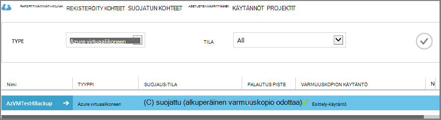

Aloita alkuperäisen varmuuskopioimalla nyt:

1. Valitse **Suojattu kohteet** -sivulla **Varmuuskopioi** sivun alareunassa.
    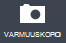

    Azure varmuuskopio-palvelu luo varmuuskopiointityön alkuperäinen varmuuskopiointia varten.

2. Valitse tarkastelemisesta töiden **työt** -välilehti.

    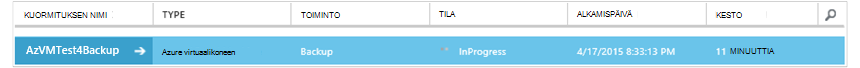

    Kun ensimmäisen varmuuskopiointi on valmis, **Suojattu kohteet** -välilehdessä virtuaalikoneen tila on *suojattu*.

    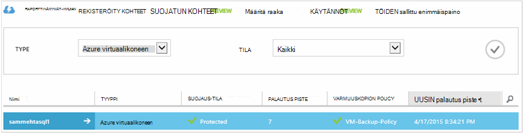

    >[AZURE.NOTE] Varmuuskopiointi näennäiskoneiden on paikallinen prosessi. Sinun ei voi varmuuskopioida näennäiskoneiden alueelta toisen alueen varmuuskopion säilö. Niin joka Azure alue, jossa on VMs, jotka haluat varmuuskopioida, vähintään yksi varmuuskopion säilö on luotava alueen.

## Seuraavat vaiheet
Nyt kun olet varmuuskopioinut onnistuneesti AM, on seuraavat vaiheet, joka voi olla merkitystä. Useimmat looginen vaihe on tutustuminen tietojen palauttaminen AM. On kuitenkin hallintatehtäviä, joka auttaa sinua, kuinka voit säilyttää tiedot turvallisten ja minimoida kustannukset.

- [Hallinta ja että näennäiskoneiden valvonta](backup-azure-manage-vms.md)
- [Palauttaa näennäiskoneiden](backup-azure-restore-vms.md)
- [Ohjeet vianmääritys](backup-azure-vms-troubleshoot.md)

## Kysymyksiä?
Jos sinulla on kysymyksiä tai jos mikä tahansa ominaisuus, jonka haluat nähdä sisältää, [Lähetä meille palautetta](http://aka.ms/azurebackup_feedback).
