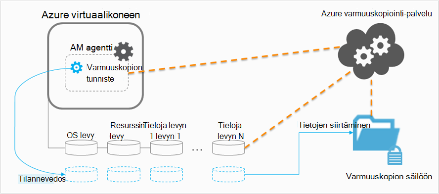

<properties
    pageTitle="Suunnittelun Azure AM varmuuskopio-infrastruktuuria | Microsoft Azure"
    description="Tärkeitä, kun suunnittelet varmuuskopioida näennäiskoneiden Azure-tietokannassa"
    services="backup"
    documentationCenter=""
    authors="markgalioto"
    manager="cfreeman"
    editor=""
    keywords="Voit varmuuskopioida vms, näennäiskoneiden varmuuskopiointi"/>

<tags
    ms.service="backup"
    ms.workload="storage-backup-recovery"
    ms.tgt_pltfrm="na"
    ms.devlang="na"
    ms.topic="article"
    ms.date="10/19/2016"
    ms.author="trinadhk; jimpark; markgal;"/>

# <a name="plan-your-vm-backup-infrastructure-in-azure"></a>Azure AM varmuuskopiointi-infrastruktuuria suunnitteleminen
Tässä artikkelissa on suorituskyky ja resurssien ehdotukset, miten voit suunnitella AM varmuuskopion infrastruktuurin. Se määrittää keskeisiä ominaisuuksia varmuuskopiointi-palvelun; seuraavia ominaisuuksia voi olla tärkeää, että arkkitehtuuri määrittämiseen kapasiteetin suunnittelu ja järjestäminen. Jos olet [valmistellut ympäristön](backup-azure-vms-prepare.md), tämä on seuraavassa vaiheessa, ennen kuin aloitat [, varmuuskopioi VMs](backup-azure-vms.md). Jos tarvitset lisätietoja Azure-virtuaalikoneissa, on [näennäiskoneiden ohjeissa](https://azure.microsoft.com/documentation/services/virtual-machines/).

## <a name="how-does-azure-back-up-virtual-machines"></a>Mistä Azure Varmuuskopioi näennäiskoneiden?
Kun Azure varmuuskopion palvelun käynnistää varmuuskopiointityön määritettynä ajankohtana, käynnistää tulevat ajankohta tilannevedoksen varmuuskopion tunniste. Tämä tilannevedos otetaan yhteensovittamisesta kanssa-asema varjostus kopioi Service (VSS) noutamiseen levyjen yhdenmukaisia tilannevedoksen virtuaalikoneen ilman, että se suljetaan.

Kun tilannevedoksen on tehty, tiedot siirretään Azure varmuuskopio-palvelun varmuuskopion säilö. Voit tehostaa varmuuskopiointi-palvelu tunnistaa ja siirtää tiedot, jotka ovat muuttuneet edellisen varmuuskopioinnin tekstialueet.



Kun tietojen siirto on valmis, tilannevedoksen poistetaan ja palautus-kohta on luotu.

### <a name="data-consistency"></a>Tietojen yhdenmukaisuuden
Käynnissä olevat varmuuskopiointia ja palauttamista business tärkeitä tietoja on monimutkaiselta, se, että business tärkeitä tietoja on varmuuskopioitavien aikana sovellukset, jotka tuottavat tiedot. Osoitteen tämä Azure varmuuskopiointi on sovelluksen yhdenmukaisia varmuuskopiot Microsoft työmääriä VSS avulla voit varmistaa, että tiedot on kirjoitettu oikein tallennustilan.

>[AZURE.NOTE] Linux näennäiskoneiden vain tiedoston yhdenmukaisia varmuuskopiot ovat mahdollista, koska Linux ei ole projektinimi vastaavat ympäristössä

Azure varmuuskopiointi kestää VSS koko varmuuskopioiden Windows VMs (Lue lisätietoja [VSS varmuuskopiointi](http://blogs.technet.com/b/filecab/archive/2008/05/21/what-is-the-difference-between-vss-full-backup-and-vss-copy-backup-in-windows-server-2008.aspx)). VSS kopioi varmuuskopioinnin käyttöön alla rekisterin käyttäjäavainten varten voi määrittää AM.

```
[HKEY_LOCAL_MACHINE\SOFTWARE\MICROSOFT\BCDRAGENT]
"USEVSSCOPYBACKUP"="TRUE"
```


Tässä taulukossa esitellään tiedostotyypit, yhdenmukaisuuden ja Azure AM aikana ilmenee-kohdassa haluamasi ehtojen varmuuskopioiminen ja palauttaminen ohjeita.

| Yhdenmukaisuuden | VSS perusteella | SELITYS ja lisätiedoista |
|-------------|-----------|---------|
| Sovelluksen yhdenmukaisuuden | Kyllä | Tämä on sen avulla varmistetaan, että Microsoft työmääriä ihanteellinen yhdenmukaisuuden tyyppi:<ol><li> AM *määrittäminen käynnistyy*. <li>Ei *ole vioittumisen*. <li>Ei *ole tietojen menettämisen*.<li> Tiedot ovat yhdenmukaisia, joka käyttää tietoja, että aikaa soveltaminen varmuuskopiointi--käyttämällä VSS-sovellukseen</ol> Useimmat Microsoft toiminnoista on VSS kirjoittajat, jota kuormituksen kielikohtaiset toiminnot, jotka liittyvät tietojen yhdenmukaisuuden. Microsoft SQL Server on esimerkiksi VSS writer, joka takaa, että tapahtuman lokitiedosto ja tietokannan kirjoituksia tehdään oikein.<br><br> Azure AM varmuuskopioiden hakeminen sovelluksen yhdenmukaisia palautus-kohdan tarkoitetaan varmuuskopion tunniste on VSS työnkulun käynnistäminen ja valmiiksi *oikein* ennen AM tilannevedoksen on tehty. Tietenkin Tämä tarkoittaa, että kaikki Azure AM sovellukset VSS-kirjoittajat on käytetty sekä.<br><br>( [VSS perusteet](http://blogs.technet.com/b/josebda/archive/2007/10/10/the-basics-of-the-volume-shadow-copy-service-vss.aspx) ja käsittelevät kattavaa tietoja [sen toiminnasta](https://technet.microsoft.com/library/cc785914%28v=ws.10%29.aspx)). |
| Tiedostojärjestelmän yhdenmukaisuuden | Kyllä - Windows-tietokoneissa | On kaksi tilanteissa, joissa palautuspiste voi olla *tiedostojärjestelmää yhdenmukainen*:<ul><li>Azure-tietokannassa, koska Linux ei ole vastaavat ympäristössä projektinimi VMs Linux varmuuskopiointi<li>Windows Azure-tietokannassa VMs varmuuskopioinnin aikana VSS virhe.</li></ul> Molemmat tällaisissa tapauksissa, joita voit tehdä parhaiten on varmistaa, että: <ol><li> AM *määrittäminen käynnistyy*. <li>Ei *ole vioittumisen*.<li>Ei *ole tietojen menettämisen*.</ol> Sovellukset on pantava täytäntöön oman "korjaaminen" järjestelmä palautetut tiedot.|
| Kaatumisen yhdenmukaisuuden | Ei | Tässä tilanteessa vastaa virtual koneen ilmenee "kaatumisen" (kautta joko Pehmeät tai kiintolevyn palauttaminen). Tämä tapahtuu yleensä, kun Azure virtuaalikoneen suljetaan varmuuskopioinnin aikana. Azure virtuaalikoneen varmuuskopioiden hakeminen käytön kaatumisen yhdenmukaisia palautus-kohdan tarkoittaa, että Azure varmuuskopiointi antaa ei takuita ympärille tiedot ovat yhdenmukaisia tallennusväline – käyttöjärjestelmän näkökulmasta tai sovelluksen näkökulmasta. Vain tiedot, joka on jo levyn varmuuskopiointi aikaa on mitä sivustomalliin tallennetaan ja varmuuskopioida. <br/> <br/> Internetissä on myös ei takuita useimmissa tapauksissa käyttöjärjestelmän käynnistyy. Tämä yleensä perässä levyn tarkistaminen menettely, kuten chkdsk, voit korjata vioittumisen virheitä. Ladatun tietoja tai kirjoituksia, joka ei ole täysin tyhjennetty levylle, menetetään. Sovelluksen seuraa yleensä oma vahvistus-järjestelmä kanssa siltä varalta, että tietojen palauttaminen on tehtävä. <br><br>Esimerkiksi jos tapahtumaloki on arvoja, jotka eivät ole olemassa tietokannassa, sitten database-ohjelmisto ei peruutus, kunnes tiedot ovat yhdenmukaisia. Kun tiedot on jaettu useille virtual levyille (kuten Kootut asemat), kaatumisen yhdenmukaisia palautus-kohta on ole tietojen oikeellisuuden.|


## <a name="performance-and-resource-utilization"></a>Suorituskyky ja resurssien käyttö
Varmuuskopio-ohjelmiston, joka on otettu käyttöön paikallisen, kuten Suunnittele kapasiteetin ja resurssien käytön tarpeiden kun varmuuskopioiminen VMs Azure-tietokannassa. [Azure-tallennustilan rajoitusten](azure-subscription-service-limits.md#storage-limits) määrittäminen rakennetta AM ominaisuuksissa saat parhaan mahdollisen suorituskyvyn pienin vaikuttavaa käynnissä toiminnoista.

Kiinnitä huomiota Azure tallennustilarajojen, kun suunnittelet varmuuskopioinnin suorituskyky:

- Maks juniin tallennustilan tiliä kohti
- Tallennustilan tilin yhteensä pyynnön korvauksen

### <a name="storage-account-limits"></a>Tallennustilarajojen tili
Aina, kun palautettavat tiedot kopioidaan tallennustilan tilin, se laskee kohti kohti toisen (IOPS) ja juniin (tai siirtonopeuden) i ja-toimintojen arvot-tallennustilan tilin. Yhtä aikaa näennäiskoneiden on käynnissä ja muissa IOPS ja siirtonopeuden. Tavoitteena on varmistaa yhteensä - varmuuskopiointia ja virtual machine - liikenne ei ole suurempi kuin tilin tallennustilarajojen.

### <a name="number-of-disks"></a>Levyjen määrä
Varmuuskopiointi yrittää suorittaa varmuuskopiointityön mahdollisimman pian. Tällöin käyttämän niin paljon resursseja kuin mahdollista. Kaikki i/o-toiminnot ovat kuitenkin rajoitettu mukaan *Kohde siirtonopeuden yksittäisen Blob,*jossa 60 Mt sekunnissa enimmäismäärä on. Yritettiin suurentaa sen nopeutta varmuuskopiointi yrittää varmuuskopioida kunkin AM levyjen *rinnakkain*. Jos AM on neljä levyjä, sitten Azure varmuuskopiointi yrittää varmuuskopioida kaikki neljä levyjen rinnakkain. Tästä syystä määritettäessä varmuuskopion liikenne tallennustilan asiakastilin lopetetaan Tärkein tekijä **levyjen määrä** varmuuskopioidaan tallennustilan-tililtä.

### <a name="backup-schedule"></a>Varmuuskopioinnin aikataulu
Lisää tekijä, joka vaikuttaa suorituskykyyn on **varmuuskopioinnin aikataulu**. Jos määrität käytännöt, jotta kaikki VMs varmuuskopioidaan samaan aikaan, liikenne hillot on varattu. Varmuuskopiointi yrittää varmuuskopioida kaikki levyjen rinnakkain. Voit vähentää varmuuskopiointi liikenne tallennustilan tililtä - varmistaa eri VMs varmuuskopioidaan eri aikoina päivän ole päällekkäin.

## <a name="capacity-planning"></a>Kapasiteetin suunnittelu
Laajennettujen kaikki seikoista yhdessä tarkoittaa, että tallennustilan tilin käyttö on suunniteltu oikein. Lataa Nähdäksesi levyn ja aikataulun valinnat vaikutus [AM varmuuskopion kapasiteetin suunnittelun Excel-laskentataulukko](https://gallery.technet.microsoft.com/Azure-Backup-Storage-a46d7e33) .

### <a name="backup-throughput"></a>Varmuuskopion siirtonopeuden
Jokaisen varmuuskopioidaan levyn Azure varmuuskopion lukee lohkot levyn ja tallentaa vain muutetut tiedot (vaiheittainen varmuuskopio). Tässä taulukossa esitetään keskimääräinen nopeus-arvoja, joita arvelet Azure varmuuskopiosta. Käytä tätä, voit arvioida ajan, joka kestää varmuuskopioida DVD-levyllä, populaation koko.

| Varmuuskopiointi | Parasta siirtonopeuden |
| ---------------- | ---------- |
| Alkuperäinen varmuuskopiointi | 160 Mbps |
| Lisäävän varmuuskopioinnin (DR) | 640 Mbps <br><br> Tämä siirtonopeuden voit huomattavasti onko vahingollisesta churn levyn varmuuskopioitavien on paljon. |

## <a name="total-vm-backup-time"></a>AM varmuuskopiointi kokonaisaika
Useimpia varmuuskopiointi aika jakautuu lukeminen ja tietojen kopioiminen, liittyy muita toimintoja, jotka vaikuttavat tarvitsee varmuuskopiointi AM kokonaisaika:

- Voit [asentaa tai päivittää varmuuskopion tunniste](backup-azure-vms.md#offline-vms)tarvittavan ajan.
- Tilannevedoksen aika, joka on käynnistettävän tilannevedoksen aika. Tilannevedoksia käynnistetään lähellä varmuuskopioinnin ajankohtaa.
- Jonon odotusaika. Varmuuskopiointi-palvelu käsittelee varmuuskopioiden useiden asiakkaiden, koska palautettavat tiedot kopioidaan tilannevedoksen varmuuskopiointi-ja palautus Services säilö ei ehkä käynnisty heti. Lataa kertaa piikin, tämän voit venyttää enintään kahdeksan tuntia käsitellään varmuuskopioiden määrän vuoksi. AM varmuuskopiointi kokonaisaika on kuitenkin alle 24 tunnin päivittäinen varmuuskopiointi koskevat.

## <a name="best-practices"></a>Parhaat käytännöt
Suosittelemme määritettäessä varmuuskopioiden näennäiskoneiden nämä mukaisesti:

- Enintään neljä perinteinen VMs samaa pilvipalvelu samanaikaisesti varmuuskopioida ei järjestäminen. Suosittelemme porrastusta varmuuskopion alkamis tunnin mukaan, jos haluat varmuuskopioida useita VMs saman pilvipalvelu.
- Yli 40 Resurssienhallinta käyttöön VMs samanaikaisesti varmuuskopioida ajoittaminen epäonnistui.
- Varmuuskopioinnin AM hiljaisena aikana niin, että varmuuskopiointi-palvelu käyttää IOPS tietojen siirtämiseen tallennustilan asiakastilin varmuuskopiointi tai palautus Services säilö.
- Varmista, että käytännön osoitteet VMs levitä tallennustilan eri tilien välillä. Suosittelemme enintään 20 yhteensä levyjen yksittäisen tallennustilaa tililtä suojattava yksi käytäntö. Jos sinulla on suurempi kuin 20 levyjen tallennustilan tilillä, kerro näiden VMs yli useita käytäntöjä saat tarvittavat IOPS varmuuskopiointia siirtovaiheen aikana.
- Palauta AM, käytössä Premium tallennustilan samaan tallennustilan-tiliin. Jos toiminnon palautus merkittävintä varmuuskopiointia, vähentää käytettävissä IOPS varmuuskopion.
- Suosittelemme, että kunkin Premium AM käytössä eri premium-tallennustilan tilin varmuuskopion optimaalisen toiminnan varmistamiseksi.

## <a name="data-encryption"></a>Tietojen salaus

Azure varmuuskopiointi salaa tietojen varmuuskopiointi osana. Voit kuitenkin salata AM tietojen ja varmuuskopioi suojatut tiedot saumattomasti (Lue lisää tietoja [salattujen tietojen varmuuskopiointi](backup-azure-vms-encryption.md)).


## <a name="how-are-protected-instances-calculated"></a>Miten suojatun esiintymät lasketaan?
Azuren näennäiskoneiden, varmuuskopioidaan kautta Azure varmuuskopiointi käsitellään [Azure varmuuskopiointi hinnat](https://azure.microsoft.com/pricing/details/backup/). Suojattu esiintymät laskenta perustuu virtuaalikoneen, joka saadaan laskemalla yhteen kaikki virtuaalikoneen--lukuun ottamatta "resurssin levyn" tiedot *Todellinen* koko.

Olet *ei ole* laskutettu, joka tukee virtuaalikoneen liitetyt tiedot jokaisen levyn sähköpostien enimmäiskokoa, mutta tallennettuja tietoja levyn todellisten tietojen perusteella. Vastaavasti varmuuskopion tallennustilan laskussa perustuu tallennettuja tietoja ja Azure varmuuskopion, joka saadaan laskemalla yhteen kunkin palautus-kohdan todellisten tietojen määrää.

Esimerkiksi kestää A2 standardin kokoisen virtual tietokoneeseen, jossa on kaksi lisätiedot-levyä, joiden koko on enintään 1 TT /. Alla olevassa taulukossa avulla tallennettuja kunkin näiden levyjen todellisia tietoja:

|Levyn tyyppi|Enimmäiskoko|Todellisten tietojen esittäminen|
|---------|--------|------|
| Käyttöjärjestelmän levy | 1023 GT | 17 GT |
| Paikalliseen levyasemaan / resurssin levy | 135 GIGATAVUA | 5 gt (sisälly varmuuskopiointiin) |
| Tietoja levyn 1 | 1023 GT | 30 GT |
| Tietoja levyn 2 | 1023 GT | 0 GT |

Virtuaalikoneen *Todellinen* koko on tässä tapauksessa 17 gt + 30 gt + 0 gt = 47 Gigatavua. Tämä on suojattu esiintymän koon, joka perustuu kuukausittain laskussa. Kun virtuaalikoneen tietojen määrä kasvaa, suojattu esiintymä-koon, jota käytetään laskutuksen myös muuttuvat myös.

Laskutus ei käynnisty, ennen kuin ensimmäinen onnistuneen varmuuskopiointi on valmis. Tässä vaiheessa tallennus-ja suojattu esiintymät Laskutus alkaa. Laskutus säilyy, kunhan ei *mitään varmuuskopiotiedot Azure varmuuskopion tallennettujen* virtuaalikoneen. Lopeta suojaus-toiminto ei lopeta Laskutus Jos varmuuskopiotiedot säilytetään.

Määritetyn virtual machine Laskutus poistetaan myöhemmästä vain, jos suojauksen on pysäytetty- *ja* minkä tahansa varmuuskopiotiedot poistetaan. Kun ei ole aktiivinen varmuuskopion töitä (kun suojaus on pysäytetty), edellisen onnistuneen varmuuskopioinnin aikana virtuaalikoneen koon tulee kuukausittain laskun perustuu suojattu esiintymän haluamasi kokoinen.

## <a name="questions"></a>Kysymyksiä?
Jos sinulla on kysymyksiä tai jos mikä tahansa ominaisuus, jonka haluat nähdä sisältää, [Lähetä meille palautetta](http://aka.ms/azurebackup_feedback).

## <a name="next-steps"></a>Seuraavat vaiheet

- [Näennäiskoneiden varmuuskopiointi](backup-azure-vms.md)
- [Hallitse virtuaalikoneen varmuuskopiointi](backup-azure-manage-vms.md)
- [Palauttaa näennäiskoneiden](backup-azure-restore-vms.md)
- [AM varmuuskopion ongelmien vianmääritys](backup-azure-vms-troubleshoot.md)
