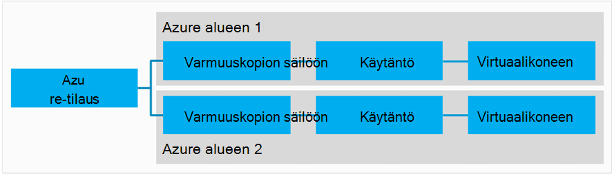
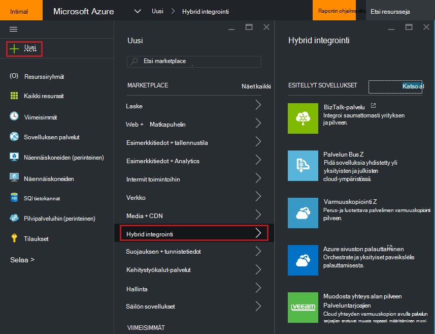
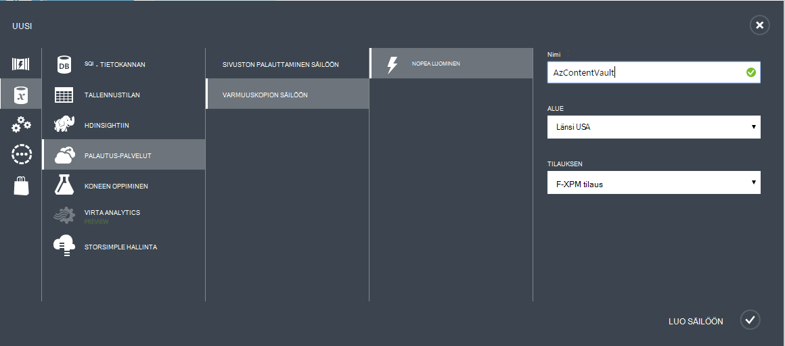
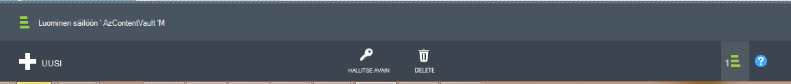
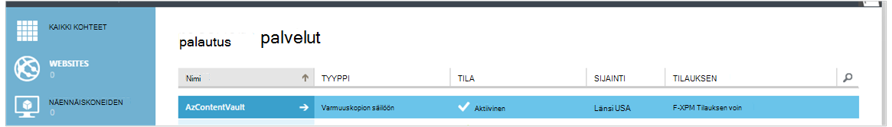
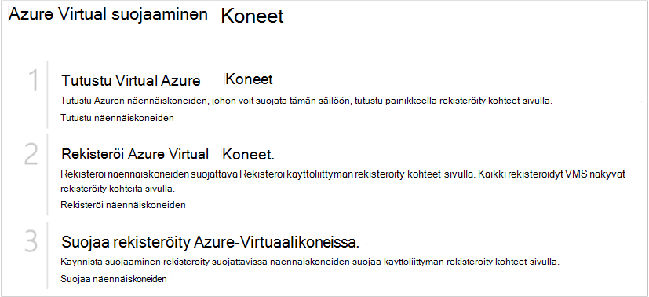
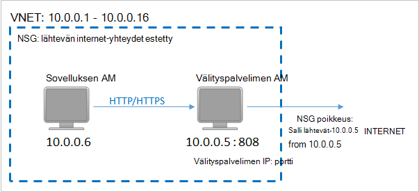
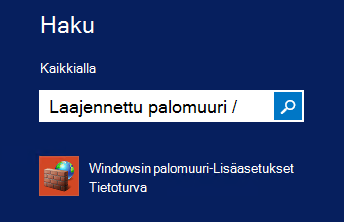
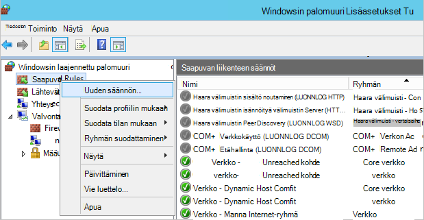
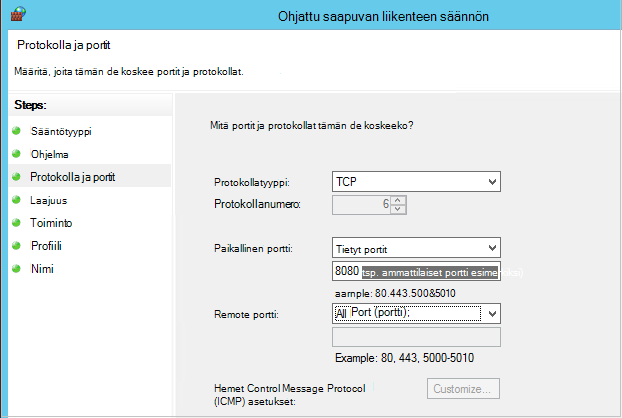

<properties
    pageTitle="Azuren näennäiskoneiden varmuuskopioida ympäristön valmisteleminen | Microsoft Azure"
    description="Varmista, että ympäristösi on valmistettu varmuuskopioiminen näennäiskoneiden Azure-tietokannassa"
    services="backup"
    documentationCenter=""
    authors="markgalioto"
    manager="cfreeman"
    editor=""
    keywords="varmuuskopioiden; Varmuuskopiointi;"/>

<tags
    ms.service="backup"
    ms.workload="storage-backup-recovery"
    ms.tgt_pltfrm="na"
    ms.devlang="na"
    ms.topic="article"
    ms.date="08/26/2016"
    ms.author="trinadhk; jimpark; markgal;"/>


# <a name="prepare-your-environment-to-back-up-azure-virtual-machines"></a>Paikallinen ympäristö valmistellaan varmuuskopioida Azure-virtuaalikoneissa

> [AZURE.SELECTOR]
- [Resurssien hallinnan malli](backup-azure-arm-vms-prepare.md)
- [Perinteinen malli](backup-azure-vms-prepare.md)

Ennen kuin voit varmuuskopioida Azure virtuaalikoneen (AM), on kolme tilanteita, joissa on olemassa.

- Sinun täytyy luoda varmuuskopion säilöön tai selvitä aiemmin varmuuskopion säilö *oman AM kanssa samalla alueella*.
- Muodostaa verkkoyhteys Azure julkinen Internet-osoitteet ja Azure tallennustilan päätepisteet välillä.
- Asenna AM agent AM.

Jos tiedät, että nämä ehdot jo ympäristössäsi jatketaan [varmuuskopioida VMs-artikkelissa](backup-azure-vms.md). Muussa tapauksessa luettu, tämän artikkelin johtaa voit varmuuskopioida Azure-AM lisätietoja ympäristön valmistelemisesta vaiheet.


## <a name="limitations-when-backing-up-and-restoring-a-vm"></a>Kun varmuuskopiointia ja palauttamista AM rajoitukset

>[AZURE.NOTE] Azure on kaksi käyttöönoton mallien luominen ja käyttäminen resurssit: [Resurssienhallinta ja perinteinen](../resource-manager-deployment-model.md). Seuraavassa luettelossa on rajoitukset, kun otetaan käyttöön perinteinen mallin.

- Varmuuskopiointi näennäiskoneiden on yli 16 tietojen levyjen kanssa ei tueta.
- Varmuuskopiointi näennäiskoneiden on varattu IP-osoite ja määritetty päätepistettä ei tueta.
- Varmuuskopiotiedot ei ole otettu käyttöön verkkoasemat liitetty AM. 
- Korvaa aiemmin luotu virtuaalikoneen palauttamisen aikana ei tueta. Poista ensin aiemmin virtuaalikoneen ja kaikki liittyvät levyjen ja valitse Palauta tiedot varmuuskopiosta.
- Rajat-alueen varmuuskopiointi ja palauttaminen ei tueta.
- Varmuuskopiointi näennäiskoneiden Azure varmuuskopiointi-palvelun avulla tuetaan Azure julkisen alueissa (Katso tuettujen alueiden [tarkistusluettelon](https://azure.microsoft.com/regions/#services) ). Jos etsit valitun alueen ei tueta tänään, se ei tule avattavassa luettelossa säilö luonnin aikana.
- Varmuuskopiointi näennäiskoneiden Azure varmuuskopiointi-palvelun avulla tuetaan vain select käyttöjärjestelmässä versioita:
  - **Linux**: Azure varmuuskopiointi tukee [luettelo, joka on vahvistettava Azure jaot](../virtual-machines/virtual-machines-linux-endorsed-distros.md) Core OS Linux lukuun ottamatta. Tuo-Your-omistaja-Linux muiden jaot myös ehkä toimi, kunhan AM-agentti ei ole käytettävissä virtuaalikoneen ja tuki Python olemassa.
  - **Windows Server**: Windows Server 2008 R2 vanhemmat versiot eivät ole tuettuja.
- Toimialueen ohjauskoneen palauttaminen (Ohjauskoneen), joka on osa usean Ohjauskoneen määrityksen AM tuetaan vain PowerShellin kautta. Lisätietoja [palauttaminen usean Ohjauskoneen toimialueen ohjauskoneen](backup-azure-restore-vms.md#restoring-domain-controller-vms).
- Palauttaminen näennäiskoneiden, joka on erityisen verkon seuraavat määritykset tuetaan vain PowerShellin kautta. VMs, jonka luot palautus-työnkulun avulla käyttöliittymässä ei ole verkon määritysten, kun palautus on valmis. Lisätietoja on artikkelissa [Palauttaminen VMs määräten verkon määritysten kanssa](backup-azure-restore-vms.md#restoring-vms-with-special-netwrok-configurations).
    - Valitse kuormituksen tasauspalvelun kokoonpano (sisäisten ja ulkoisten) näennäiskoneiden
    - Näennäiskoneiden useita varattu IP-osoitteet
    - Näennäiskoneiden useita verkkosovittimien kanssa

## <a name="create-a-backup-vault-for-a-vm"></a>Luo varmuuskopio säilöön AM

Varmuuskopion säilö on yritys, joka sisältää kaikki varmuuskopiointi ja palauttaminen pistettä, jotka on luotu ajan kuluessa. Varmuuskopion säilö sisältää myös varmuuskopion käytäntöjä, jotka käytetään varmuuskopioidaan näennäiskoneiden.

Tässä kuvassa näkyy eri Azure varmuuskopiointi kohteiden välisiä suhteita:     

Luo varmuuskopio säilö seuraavasti:

1. Kirjautuminen [Azure portal](http://manage.windowsazure.com/).

2. Azure-portaalissa valitsemalla **Uusi** > **Hybrid integrointi** > **varmuuskopion**. Kun napsautat **varmuuskopion**, voit vaihtuu automaattisesti perinteinen-portaaliin (kuten muistiinpanon jälkeen).

    

    >[AZURE.NOTE] Jos tilauksesi on viimeksi käytetty perinteinen-portaalissa, tilauksen voi avata perinteinen-portaalissa. Tässä tapauksessa voit luoda varmuuskopion säilö valitsemalla **Uusi** > **Tietopalvelujen** > **Palautus Services** > **Varmuuskopion säilö** > **Nopea luominen** (Katso alla olevassa kuvassa).

    

3. Kirjoita kutsumanimi tunnistavan säilö **nimi**. Nimen on oltava yksilöllinen Azure-tilausta. Kirjoita nimi, joka sisältää 2 – 50 merkkiä. Se on alettava kirjaimella, ja voivat sisältää vain kirjaimia, numeroita ja väliviivoja.

4. Valitse **alue**-säilö maantieteellinen alue. Säilö on oltava sama alue kuin näennäiskoneiden, jonka haluat suojata. Jos sinulla on useita alueilla näennäiskoneiden, sinun on luotava varmuuskopion säilö kunkin alueen. Ei ole tarpeen, jos haluat määrittää tallennustilan tilit tallentamiseen varmuuskopiotiedot--varmuuskopioinnin säilö ja Azure varmuuskopion palvelukahvaa tämä automaattisesti.

5. Valitse **tilauksen** haluat yhdistää varmuuskopion säilö tilaus. On useita vaihtoehtoja vain, jos organisaation tilillä on liitetty useita Azure-tilauksia.

6. Valitse **Luo säilö**. Voi kestää hetken, luoda varmuuskopion säilö. Seurata tilailmoitukset portaalin alareunassa.

    

7. Viestin Varmista, että säilö on luotu onnistuneesti. Se merkitään **palautus palvelut** -sivulla **aktiiviseksi**. Varmista, että voit valita haluamasi tallennustilan redundancy vaihtoehto oikealle, kun säilö on luotu. Lisätietoja [määrittämisestä varmuuskopion säilöön redundancy tallennuspaikka](backup-configure-vault.md#azure-backup---storage-redundancy-options).

    

8. Valitse Varmuuskopioi säilö Siirry **Pika-aloitus** -sivulla, jossa Azuren näennäiskoneiden varmuuskopiointi ohjeet ovat näkyvissä.

    


## <a name="network-connectivity"></a>Verkkoyhteyden

Jotta voit hallita AM tilannevedoksia, varmuuskopion tunniste on yhteys Azure julkiseen IP-osoitteisiin. Oikea Internet-yhteys ilman virtual machine HTTP-pyyntöjen aikakatkaisu ja varmuuskopiointi epäonnistuu. Jos käyttöönoton on käyttörajoitukset paikassa (kautta verkon käyttöoikeusryhmän (NSG), esimerkiksi), valitse jokin seuraavista vaihtoehdoista tarjoamiseksi Tyhjennä polku varmuuskopion tietoliikenteen:

- [Whitelist Azure palvelinkeskuksen IP-alueita](http://www.microsoft.com/en-us/download/details.aspx?id=41653) – katso ohjeet artikkelista siitä, miten voit whitelist IP-osoitteet.
- Ota käyttöön HTTP-välityspalvelin reitittää liikenteen.

Asetus, kun valitsemisessa valinnat ovat hallittavuuden, hajautetun ohjausobjekti ja kustannukset.

|Vaihtoehto|Hyvät puolet|Huonot puolet|
|------|----------|-------------|
|Whitelist IP-alueita| Et lisäkustannuksia.<br><br>Avaamiseen access NSG, käytä <i>Määrittäminen AzureNetworkSecurityRule</i> cmdlet-komento. | KOMPLEKSI sellaisiin hallita IP-alueita muuttuvat ajan kuluessa.<br><br>Tarjoaa Azure ja eikä vain tallennustilan kokonaisuuteen.|
|HTTP-välityspalvelin| Hajautetun ohjausobjekti-välityspalvelimen kautta sallittu tallennustilan URL-osoitteet.<br>VMs yhden pisteen, Internet-yhteyttä.<br>Ei veloittaa Azure IP-osoite muuttuu.| Lisää kustannuksiin käynnissä AM välityspalvelimen-ohjelmistolla.|

### <a name="whitelist-the-azure-datacenter-ip-ranges"></a>Whitelist Azure palvelinkeskuksen IP-alueita

Voit whitelist Azure palvelinkeskuksen IP-alueita, katso lisätietoja [Azure sivuston](http://www.microsoft.com/en-us/download/details.aspx?id=41653) IP-alueita ja ohjeita.

### <a name="using-an-http-proxy-for-vm-backups"></a>HTTP-välityspalvelin käyttämällä AM varmuuskopioiden hakeminen
Kun varmuuskopiointi AM tunniste on varmuuskopioinnin käyttöön AM lähettää tilannevedoksen hallinta-komennot Azuren tallennustilaan HTTPS-Ohjelmointirajapinnan käyttäminen. Reitittää HTTP-välityspalvelin varmuuskopion tunniste liikenne, koska se on määritetty Julkinen Internet-yhteyden vain osan.

>[AZURE.NOTE] Ei ole toiminnon, jota käytetään välityspalvelimen ohjelmiston. Varmista, että olet valinnut välityspalvelin, joka on yhteensopiva määritysten ohjeita.

Alla olevassa esimerkissä kuvassa näkyy kolme määritysvaiheet tarvitse käyttää HTTP-välityspalvelin:

- Sovelluksen AM reitittää sidottu julkisen Internetin kautta välityspalvelimen AM kaikki HTTP-liikenne.
- Välityspalvelimen AM sallii saapuvan liikenteen VMs virtual verkossa.
- Verkon suojauksen ryhmän (NSG) nimeltä NSF lukitus on suojauksen säännön salliminen Internet liikenteen välityspalvelimen AM kohteesta.



Voit käyttää HTTP-välityspalvelin, julkinen Internet-yhteyden, toimimalla seuraavasti:

#### <a name="step-1-configure-outgoing-network-connections"></a>Vaihe 1. Lähtevän postin verkkoyhteyksien määrittäminen
###### <a name="for-windows-machines"></a>Windows-tietokoneissa
Tämä asennuksen paikallisen järjestelmän tilin välityspalvelimen asetukset.

1. Lataa [PsExec](https://technet.microsoft.com/sysinternals/bb897553)
2. Suorita seuraava komento laajennettuja kehote

     ```
     psexec -i -s "c:\Program Files\Internet Explorer\iexplore.exe"
     ```
     Se avautuu internet explorer-ikkunassa.
3. -Valitsemalla Työkalut > Internet-asetukset -> yhteydet -> Lähiverkon asetukset.
4. Tarkista järjestelmätilin välityspalvelimen. Määritä välityspalvelimen IP-osoite ja portin.
5. Sulje Internet Explorer.

Tämä määrittää tietokoneen välityspalvelimen määritysten ja käytetään lähtevän HTTP/HTTPS-tietoliikenteen.

Jos sinulla välityspalvelimen asetukset Nykyinen käyttäjätilin (ei paikallisen järjestelmätilin), käytä seuraavaa komentosarjaa koskee SYSTEMACCOUNT:

```
   $obj = Get-ItemProperty -Path Registry::”HKEY_CURRENT_USER\Software\Microsoft\Windows\CurrentVersion\Internet Settings\Connections"
   Set-ItemProperty -Path Registry::”HKEY_USERS\S-1-5-18\Software\Microsoft\Windows\CurrentVersion\Internet Settings\Connections" -Name DefaultConnectionSettings -Value $obj.DefaultConnectionSettings
   Set-ItemProperty -Path Registry::”HKEY_USERS\S-1-5-18\Software\Microsoft\Windows\CurrentVersion\Internet Settings\Connections" -Name SavedLegacySettings -Value $obj.SavedLegacySettings
   $obj = Get-ItemProperty -Path Registry::”HKEY_CURRENT_USER\Software\Microsoft\Windows\CurrentVersion\Internet Settings"
   Set-ItemProperty -Path Registry::”HKEY_USERS\S-1-5-18\Software\Microsoft\Windows\CurrentVersion\Internet Settings" -Name ProxyEnable -Value $obj.ProxyEnable
   Set-ItemProperty -Path Registry::”HKEY_USERS\S-1-5-18\Software\Microsoft\Windows\CurrentVersion\Internet Settings" -Name Proxyserver -Value $obj.Proxyserver
```

>[AZURE.NOTE] Jos huomaat "(407) välityspalvelimen todennus vaaditaan" välityspalvelimen palvelimen lokista, tarkista, että authrntication on määritetty oikein.

######<a name="for-linux-machines"></a>Linux tietokoneissa

Lisää seuraava rivi, ```/etc/environment``` tiedosto:

```
http_proxy=http://<proxy IP>:<proxy port>
```

Lisää seuraavat rivit ```/etc/waagent.conf``` tiedosto:

```
HttpProxy.Host=<proxy IP>
HttpProxy.Port=<proxy port>
```

#### <a name="step-2-allow-incoming-connections-on-the-proxy-server"></a>Vaihe 2. Salli yhteyksiä välityspalvelimen:

1. Avaa välityspalvelinta, Windowsin palomuuri. Helpoin tapa käyttää palomuurin on etsiä Windowsin laajennettu palomuuri.

    

2. Valitse Windowsin palomuuri-valintaikkunasta **Saapuvan liikenteen säännöt** hiiren kakkospainikkeella ja valitse **Uusi sääntö...**.

    

3. Valitse **Ohjattu saapuvan liikenteen säännön** **Sääntötyyppi** **Mukautettu** -vaihtoehto ja valitse **Seuraava**.

4. **Ohjelma**, valitse **Kaikki ohjelmat** ja valitse **seuraavalla**sivulla.

5. Valitse **protokolla ja portit** -sivulla seuraavat tiedot ja valitse **Seuraava**:

    

    - *Protokollatyyppi* : Valitse *TCP*
    - *paikallisen* portin valita *Tietyt portit*, Määritä alla olevaan kenttään ```<Proxy Port>``` , joka on määritetty.
    - Valitse *Kaikki portit* *Remote portti*

    Ohjatun toiminnon muiden aivan loppuun ja kirjoita tämän säännön nimi.

#### <a name="step-3-add-an-exception-rule-to-the-nsg"></a>Vaihe 3. Lisää poikkeussäännön NSG:

Kirjoita PowerShellin Azure komentokehote seuraava komento:

Seuraava komento lisää poikkeus NSG. Tätä poikkeusta sallii TCP-tietoliikenteen mihin tahansa porttiin 10.0.0.5 porttiin 80 (HTTP) tai 443 (HTTPS) minkä tahansa Internet-osoite. Jos asetat tiettyyn porttiin julkinen Internet, muista lisätä kyseisen portin ```-DestinationPortRange``` paikan päällä.

```
Get-AzureNetworkSecurityGroup -Name "NSG-lockdown" |
Set-AzureNetworkSecurityRule -Name "allow-proxy " -Action Allow -Protocol TCP -Type Outbound -Priority 200 -SourceAddressPrefix "10.0.0.5/32" -SourcePortRange "*" -DestinationAddressPrefix Internet -DestinationPortRange "80-443"
```

*Varmista esimerkissä nimien korvaaminen käyttöönoton tarvittavat tiedot.*


## <a name="vm-agent"></a>AM agentti

Ennen kuin voit varmuuskopioida Azure virtuaalikoneen, varmista, että Azure AM-agentti on asennettu virtuaalikoneen oikein. AM-agentti on valinnainen osa suunnitellut aloittamispäivämäärät, jotka on luotu virtuaalikoneen, varmista, että AM-agentti valintaruutu on valittuna ennen virtuaalikoneen on valmisteltu.

### <a name="manual-installation-and-update"></a>Manuaalinen asennus- ja päivitys

AM-agentti on jo olemassa VMs, jotka on luotu Azure-valikoimasta. Kuitenkin näennäiskoneiden, jotka siirretään-paikallisen palvelinkeskusten ei ole asennettu AM agentti. Näiden VMs AM-agentti on asennettu erikseen. Lisätietoja [asentaminen aiemmin AM AM-agentti](http://blogs.msdn.com/b/mast/archive/2014/04/08/install-the-vm-agent-on-an-existing-azure-vm.aspx).

| **Toiminto** | **Windows** | **Linux** |
| --- | --- | --- |
| Asentaminen AM-agentti | <li>Lataa ja asenna [MSI-agentti](http://go.microsoft.com/fwlink/?LinkID=394789&clcid=0x409). Sinun on järjestelmänvalvojan oikeudet ja viimeistele asennus. <li>[AM-ominaisuuden päivittäminen](http://blogs.msdn.com/b/mast/archive/2014/04/08/install-the-vm-agent-on-an-existing-azure-vm.aspx) osoittamaan, että agentti on asennettu. | <li> Asenna uusimmat [Linux agentti](https://github.com/Azure/WALinuxAgent) GitHub. Sinun on järjestelmänvalvojan oikeudet ja viimeistele asennus. <li> [AM-ominaisuuden päivittäminen](http://blogs.msdn.com/b/mast/archive/2014/04/08/install-the-vm-agent-on-an-existing-azure-vm.aspx) osoittamaan, että agentti on asennettu. |
| Päivittäminen AM-agentti | AM-agentti päivittämisestä on pelkästään uudelleenasentaminen [AM agentti binaaritiedostot](http://go.microsoft.com/fwlink/?LinkID=394789&clcid=0x409). <br><br>Varmista, että mitään varmuuskopioinnin ei käytössä, kun AM-agentti päivitetä. | Päivityksiä [Linux AM-agentti ](../virtual-machines-linux-update-agent.md)ohjeiden mukaisesti. <br><br>Varmista, että mitään varmuuskopioinnin ei käytössä, kun AM-agentti päivitetä. |
| AM agentti asennuksen tarkistaminen | <li>Siirry Azure AM *C:\WindowsAzure\Packages* -kansioon. <li>Löydät tulisi esitä WaAppAgent.exe tiedoston.<li> Tiedostoa hiiren kakkospainikkeella, valitse **Ominaisuudet**ja valitse **tiedot** -välilehti. Tuoteversio-kentässä on oltava 2.6.1198.718 tai uudempi versio. | PUUTTUU |


Lisätietoja [AM agentti](https://go.microsoft.com/fwLink/?LinkID=390493&clcid=0x409) ja [asennusohjeet](https://azure.microsoft.com/blog/2014/04/15/vm-agent-and-extensions-part-2/).

### <a name="backup-extension"></a>Varmuuskopion tunniste

Voit varmuuskopioida virtuaalikoneen Azure varmuuskopiointi-palvelun asentaa tiedostotunnistetta AM-agentti. Azure varmuuskopion palvelun päivittää saumattomasti ja korjaa muita viittauksista varmuuskopion tunniste.

Varmuuskopion laajennus on asennettu, jos AM on käynnissä. Käynnissä olevat AM sisältää myös mahdollisimman sovelluksen yhdenmukaisia palautus-kohdan käytön mahdollisuutta. Kuitenkin Azure varmuuskopioinnin palvelu jatkaa varmuuskopioida AM--, vaikka se on poistettu käytöstä ja laajennus ei voitu asentaa (eli offline-tilassa AM). Tässä tapauksessa palautuspiste otetaan *kaatumisen yhdenmukaisia* , kuten edellä mainittujen.


## <a name="questions"></a>Kysymyksiä?
Jos sinulla on kysymyksiä tai jos mikä tahansa ominaisuus, jonka haluat nähdä sisältää, [Lähetä meille palautetta](http://aka.ms/azurebackup_feedback).

## <a name="next-steps"></a>Seuraavat vaiheet
Nyt kun olet valmistellut ympäristön oman AM varmuuskopiointia, että loogisia seuraavaksi varmuuskopion luominen. Suunnitteluoppaan artikkelissa VMs varmuuskopioiminen tarkempia tietoja.

- [Näennäiskoneiden varmuuskopiointi](backup-azure-vms.md)
- [AM-varmuuskopion infrastruktuurin suunnitteleminen](backup-azure-vms-introduction.md)
- [Virtual machine-varmuuskopiot hallinta](backup-azure-manage-vms.md)
