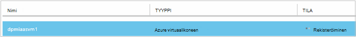
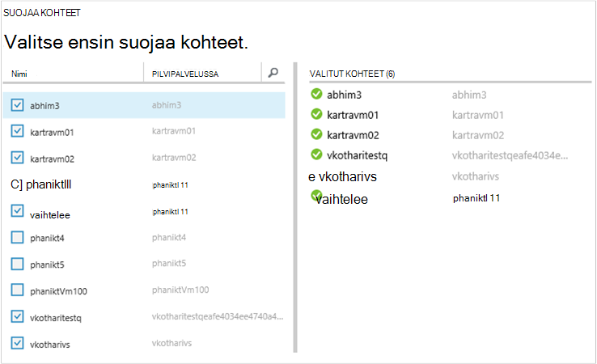
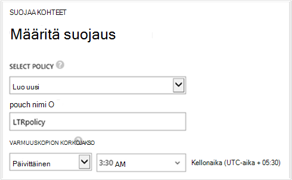
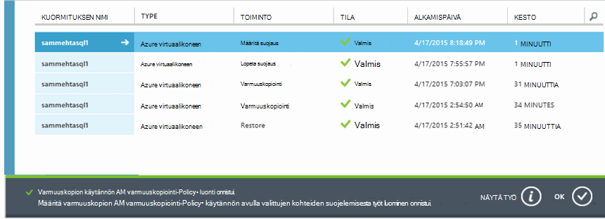
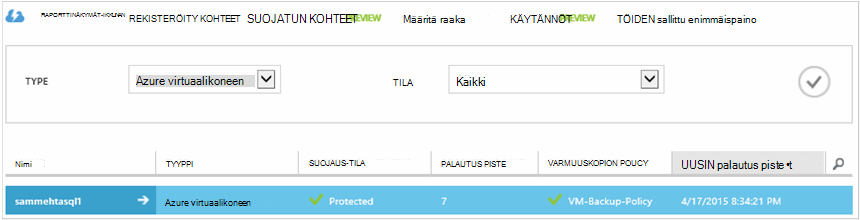

<properties
    pageTitle="Varmuuskopioi Azuren näennäiskoneiden | Microsoft Azure"
    description="Tutustu Rekisteröi ja oman näennäiskoneiden näitä toimintosarjoja Azure virtuaalikoneen varmuuskopion ja varmuuskopioi."
    services="backup"
    documentationCenter=""
    authors="markgalioto"
    manager="jwhit"
    editor=""
    keywords="virtuaalikoneen varmuuskopiointi; virtual machine; varmuuskopiointi Varmuuskopiointi- ja tietojen palauttaminen; AM varmuuskopiointi"/>

<tags
    ms.service="backup"
    ms.workload="storage-backup-recovery"
    ms.tgt_pltfrm="na"
    ms.devlang="na"
    ms.topic="article"
    ms.date="09/28/2016"
    ms.author="trinadhk; jimpark; markgal;"/>

# Azuren näennäiskoneiden varmuuskopiointi

> [AZURE.SELECTOR]
- [Varmuuskopioi VMs palautus palvelut-säilö](backup-azure-arm-vms.md)
- [Varmuuskopioi VMs varmuuskopiointi-säilö](backup-azure-vms.md)

Tässä artikkelissa kerrotaan, varmuuskopioimalla perinteinen käyttöön Azure virtual koneen (AM) varmuuskopiointi-säilö. Sinun tarvitse huolehtia ennen kuin voit varmuuskopioida Azure virtuaalikoneen joitakin tehtäviä. Jos et ole vielä tehnyt niin, suorita [edellytykset](backup-azure-vms-prepare.md) oman VMs varmuuskopioiminen lisätietoja ympäristön valmistelemisesta.

Lisätietoja on artikkeleissa [Azure AM varmuuskopio-infrastruktuuria suunnittelu](backup-azure-vms-introduction.md) ja [Azure-virtuaalikoneissa](https://azure.microsoft.com/documentation/services/virtual-machines/).

>[AZURE.NOTE] Azure on kaksi käyttöönoton mallien luominen ja käyttäminen resurssit: [Resurssienhallinta ja perinteinen](../resource-manager-deployment-model.md). Varmuuskopiointi-säilö vain suojata perinteinen käyttöön VMs. Ei voi suojata Resurssienhallinta käyttöön VMs varmuuskopiointi säilö kanssa. Lisätietoja [VMs palautus Services säilö varmuuskopioida](backup-azure-arm-vms.md) palautus Services vaults käyttämiseen.

Varmuuskopiointi Azuren näennäiskoneiden on kolme avaimen vaihetta:

>[AZURE.NOTE] Varmuuskopiointi näennäiskoneiden on paikallinen prosessi. Ei voi varmuuskopioida näennäiskoneiden jonkin alueen toisen alueen varmuuskopion säilö. Jotta sinun on luotava varmuuskopio säilö Azure alueittain välissä ei VMs, varmuuskopioidaan.

## Vaihe 1 – Tutustu Azure-virtuaalikoneissa
Jotta kaikki uusien näennäiskoneiden (VMs) tilaukseen lisätty tunnistetaan ennen rekisteröitymistä, suorita etsiminen prosessi. Prosessin kyselyt Azure näennäiskoneiden tilauksen, lisätietoja sekä luettelo, kuten cloud palvelun nimen ja haluamasi alue.

1. Kirjautuminen [Classic-portaalissa](http://manage.windowsazure.com/)

2. Valitse palveluluettelosta Azure- **Palautus Services** Avaa Varmuuskopiointi ja palauttaminen vaults luettelo.
    

3. Valitse Varmuuskopiointi vaults luettelo AM varmuuskopioida säilö.

    Jos kyseessä on uusi säilö portaalin tulee **Pika-aloitus** -sivulle.

    

    Jos säilö on aiemmin määritetty, portaalin Avaa viimeisimmät-valikkoon.

4. Napsauta **Rekisteröity kohteet**(sivun yläreunassa) säilöön-valikossa.

    

5. Valitse **tyyppi** -valikosta **Azure virtuaalikoneen**.

    

6. Valitse sivun alareunassa **LÖYTÄMINEN** .
    

    Etsintä-prosessi voi kestää muutaman minuutin aikana näennäiskoneiden on parhaillaan taulukkomuotoinen. Ei ilmoituksessa, joka ilmoittaa, että prosessi on käynnissä näytön alareunassa.

    

    Ilmoitus muuttuu, kun prosessi on suoritettava. Jos etsiminen prosessin ei löytynyt näennäiskoneiden, varmista ensin, VMs olemassa. Jos VMs olemassa, varmista VMs ovat samalla alueella kuin varmuuskopion säilö. Jos VMs olemassa, ja ne ovat samassa alueella, varmista VMs ei ole jo rekisteröity varmuuskopion säilö. Jos AM määritetään varmuuskopion säilöön, se ei ole käytettävissä liitetään muihin varmuuskopion vaults.

    

    Kun olet havaitsi uudet kohteet, siirry vaiheeseen 2 ja rekisteröi oman VMs.

##  Vaihe 2 – Rekisteröi Azure-virtuaalikoneissa
Voit rekisteröidä Azure virtual-koneen liitettävä Azure varmuuskopiointi-palvelun. Tämä on yleensä erikseen tehtävän.

1. Siirry Azure-portaalissa varmuuskopion säilö **Palautus** palvelut ja valitse sitten **Rekisteröity kohteet**.

2. Valitse avattavasta valikosta **Azure virtuaalikoneen** .

    

3. Valitse sivun alareunassa **Rekisteröi** .
    

4. **Rekisteröi kohteita** hiiren kakkospainikkeella ja valitse näennäiskoneiden, jonka haluat rekisteröidä. Jos määritettynä on vähintään kaksi saman niminen näennäiskoneiden, ne toisistaan cloud-palvelun avulla.

    >[AZURE.TIP] Useita näennäiskoneiden voidaan rekisteröidä samalla kertaa.

    Työn luodaan kunkin virtual machine, jotka olet valinnut.

5. Valitse **Näytä projektin** **työt** -sivun ilmoituksen.

    

    Virtuaalikoneen näkyy myös rekisteröity kohteita sekä rekisteröinnin toiminnon tilan luettelo.

    

    Kun toiminto on valmis, tila muuttuu vastaamaan *rekisteröity* -tilaan.

    

## Vaihe 3 – suojaa Azure-virtuaalikoneissa
Voit nyt määrittää virtuaalikoneen varmuuskopiointi- ja säilytys käytäntöä. Useita näennäiskoneiden voidaan suojata yksittäisen käyttämällä suojaa toiminto.

Azure varmuuskopiointi vaults, kun toukokuu 2015 mukana oletuskäytäntö valmiina säilö. Tämä oletuskäytäntö sisältyy oletusarvoisesti säilyttäminen 30 päivää ja kerran päivittäisen varmuuskopioinnin aikataulu.

1. Siirry Azure-portaalissa varmuuskopion säilö **Palautus** palvelut ja valitse sitten **Rekisteröity kohteet**.
2. Valitse avattavasta valikosta **Azure virtuaalikoneen** .

    

3. Valitse **Suojaa** sivun alareunassa.

    **Suojaa ohjatun** tulee näkyviin. Ohjattu toiminto näyttää vain näennäiskoneiden, joka on rekisteröity ja ei ole suojattu. Valitse näennäiskoneiden, jonka haluat suojata.

    Jos määritettynä on vähintään kaksi saman niminen näennäiskoneiden, erottaa näennäiskoneiden cloud-palvelun avulla.

    >[AZURE.TIP] Voit suojata useita näennäiskoneiden samalla kertaa.

    

4. Valitse **varmuuskopioinnin aikataulu** , jotka olet valinnut näennäiskoneiden varmuuskopioida. Voit valita käytännöt aiemmin määritetyt tai määritä uusi.

    Kunkin varmuuskopion käytännön voi olla useita näennäiskoneiden liittyy. Kuitenkin virtuaalikoneen voi olla vain yksi käytäntö vaiheissa liitetty samanaikaisesti.

    

    >[AZURE.NOTE] Varmuuskopion käytäntö sisältää ajoitettujen varmuuskopioiden säilytys malli. Jos valitset aiemmin varmuuskopion käytännön, et voi muokata seuraavassa vaiheessa säilytys-asetukset.

5. Valitse liitettävä varmuuskopioista **säilytys alue** .

    

    Säilytyskäytännön määrittää projektiin varmuuskopion pituutta. Voit määrittää eri säilytyskäytännöt varmuuskopioinnin otettaessa perusteella. Esimerkiksi varmuuskopioinnin pisteen tehdyt päivittäin (joka on toiminnassa palautus-piste) voidaan säilyttää 90 päivää. Vertailu (valvontalokin tarkoituksiin) kunkin vuosineljänneksen lopussa ottaa varmuuskopion kohtaa ehkä säilytettävä monta kuukautta tai vuotta.

    

    Tässä esimerkissä kuvassa:

    - **Päivittäinen säilytyskäytäntö**: varmuuskopiot päivittäin otettava tallennetaan 30 päivää.
    - **Viikoittainen säilytyskäytäntö**: ottaa viikko sunnuntaina varmuuskopioiden säilytetään 104 viikkoa.
    - **Kuukausittainen säilytyskäytäntö**: kuukauden viimeinen sunnuntai otettuja varmuuskopioita säilytetään 120 kuukautta.
    - **Vuosittainen säilytyskäytäntö**: jokaisen tammikuussa ensimmäinen sunnuntai otettuja varmuuskopioita säilytetään 99 vuotta.

    Työn luodaan suojaus-käytännön määrittäminen ja liittää näennäiskoneiden kunkin virtual tietokoneeseen, jotka olet valinnut käytännön avulla.

6. Voit tarkastella **Määrittäminen suojaus** töiden vaults-valikosta Valitse **Projektit** ja valitse **Määritä suojaus** **toiminnon** suodattimen.

    

## Alkuperäinen varmuuskopiointi
Kun käytäntö on suojattu virtuaalikoneen, se näkyy **Suojatut osat** -välilehden *suojatun - (odottaa alkuperäinen varmuuskopio)*-tilassa. Oletusarvon mukaan ensimmäisen ajoitettu varmuuskopiointi on *Alkuperäinen varmuuskopion*.

Käynnistettävän alkuperäinen varmuuskopioinnin heti, kun suojauksen määrittäminen:

1. Valitse **Varmuuskopioi** **Suojatut osat** -sivun alareunassa.

    Azure varmuuskopio-palvelu luo varmuuskopiointityön alkuperäinen varmuuskopiointia varten.

2. Valitse tarkastelemisesta töiden **työt** -välilehti.

    

>[AZURE.NOTE] Varmuuskopioinnin aikana Azure varmuuskopion palvelun ongelmien vianmääritys kunkin virtual machine Tyhjennä kaikki kirjoittaminen työt sekä yhdenmukaisia kuvata varmuuskopion laajennuksen komennon.

Alkuperäinen varmuuskopioinnin päätyttyä virtuaalikoneen **Suojattu kohteet** -välilehdessä tila on *suojattu*.

## Varmuuskopioinnin tilan ja tietojen tarkasteleminen
Kun suojattu, virtuaalikoneen määrä kasvaa myös yhteenveto **Dashboard** -sivu. **Dashboard** -sivu näyttää myös viimeisen 24 tuntia, joka ei *onnistunut*, on *epäonnistui*ja *käynnissä*työt määrän. Valitse **Projektit** -sivulla suodattaa töitä **tila**, **toimintoa**tai ** **- ja** ** valikkojen avulla.

Koontinäytön arvot päivitetään 24 tunnin välein.

## Vianmääritys
Jos käytössä ilmenee ongelmia, kun varmuuskopioiminen virtuaalikoneen ylös, tarkista [AM vianmääritysartikkeliin](backup-azure-vms-troubleshoot.md) ohjeita.

## Seuraavat vaiheet

- [Hallinta ja että näennäiskoneiden valvonta](backup-azure-manage-vms.md)
- [Palauttaa näennäiskoneiden](backup-azure-restore-vms.md)
