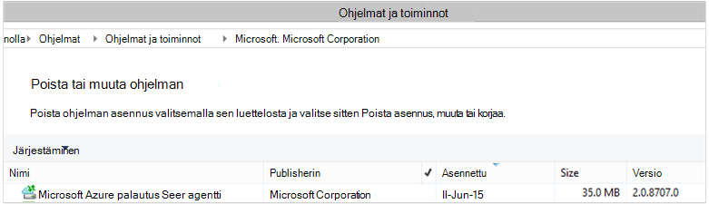

<properties
    pageTitle="Ottaa käyttöön ja hallita varmuuskopiointi for Windows Server/Client PowerShellin avulla | Microsoft Azure"
    description="Opettele käyttöönotto ja hallinta PowerShellin Azure varmuuskopiointi"
    services="backup"
    documentationCenter=""
    authors="saurabhsensharma"
    manager="shivamg"
    editor=""/>

<tags
    ms.service="backup"
    ms.workload="storage-backup-recovery"
    ms.tgt_pltfrm="na"
    ms.devlang="na"
    ms.topic="article"
    ms.date="09/01/2016"
    ms.author="saurabhsensharma;markgal;jimpark;nkolli;trinadhk"/>


# <a name="deploy-and-manage-backup-to-azure-for-windows-serverwindows-client-using-powershell"></a>Ottaa käyttöön ja hallita varmuuskopio Azure for Windows Server/Windows Client PowerShellin avulla

> [AZURE.SELECTOR]
- [ARM](backup-client-automation.md)
- [Perinteinen](backup-client-automation-classic.md)

Tässä artikkelissa kerrotaan, miten voit käyttää PowerShellin Azure varmuuskopioinnin Windows Server-tai Windows-asiakasohjelman määrittämisestä ja hallinnasta varmuuskopiointi ja palauttaminen.

## <a name="install-azure-powershell"></a>Azure PowerShellin asentaminen

[AZURE.INCLUDE [learn-about-deployment-models](../../includes/learn-about-deployment-models-include.md)]

Tässä artikkelissa kerrotaan, joiden avulla voit käyttää palautus Services säilö resurssiryhmä Azure resurssien hallinta (ARM) PowerShellin cmdlet-komennot.

Lokakuussa 2015 julkaistiin Azure PowerShell 1.0. Tässä versiossa onnistui 0.9.8 Vapauta ja koskevia merkittäviä muutoksia, etenkin Cmdlet-komentoja nimeämismuoto. 1.0 cmdlet-komennot noudattamalla nimeämismuoto {verbin} – {substantiivin}; AzureRm Tämän vuoksi 0.9.8 nimet eivät sisällä **Rm** (esimerkiksi uusi-AzureRmResourceGroup sen sijaan, että uusi AzureResourceGroup). PowerShellin Azure 0.9.8 käytettäessä sinun on ensin otettava Resurssienhallinta-tilaan suorittamalla **Valitsin AzureMode AzureResourceManager** -komennon. Tämä komento ei ole välttämätöntä 1.0 tai uudempi.

Jos haluat käyttää 0.9.8 kirjoitettu komentosarjat ympäristössä 1.0 tai uudempi-ympäristössä, huolellisesti Testaa komentosarjat vanhat tuotantoympäristössä ennen kuin voit käyttää niitä tuotannon voit välttää odottamattomat vaikutus.

[Lataa uusin PowerShell-versio](https://github.com/Azure/azure-powershell/releases) (edellyttää vähintään versio: 1.0.0)


[AZURE.INCLUDE [arm-getting-setup-powershell](../../includes/arm-getting-setup-powershell.md)]

## <a name="create-a-recovery-services-vault"></a>Luo palautus palvelut-säilö

Seuraavat vaiheet johtaa luomista palautus palvelut-säilö. Palautus palvelut-säilö on erilainen kuin varmuuskopiointi-säilö.

1. Jos käytät Azure varmuuskopiointi ensimmäistä kertaa, sinun on käytettävä **Rekisteröi AzureRMResourceProvider** cmdlet-komento rekisteröidä Azure palautus-palveluntarjoajan tilaus.

    ```
    PS C:\> Register-AzureRmResourceProvider -ProviderNamespace "Microsoft.RecoveryServices"
    ```

2. Palautus Services säilö ei ARM-resurssi, joten voit sijoittaa sen resurssin ryhmän. Voit käyttää aiemmin luotuja resurssiryhmä tai luoda uuden. Kun luot uusi resurssiryhmä, määrittää nimen ja sijainnin resurssiryhmän.  

    ```
    PS C:\> New-AzureRmResourceGroup –Name "test-rg" –Location "West US"
    ```

3. **Uusi AzureRmRecoveryServicesVault** cmdlet-komennon avulla voit luoda uuden säilö. Muista samaan sijaintiin säilö, Määritä käytettiin resurssiryhmän.

    ```
    PS C:\> New-AzureRmRecoveryServicesVault -Name "testvault" -ResourceGroupName " test-rg" -Location "West US"
    ```

4. Määritä tallennustila-arvojen käyttäminen; Voit käyttää [Paikallisesti (LRS tarpeettomat tallennustilan)](../storage/storage-redundancy.md#locally-redundant-storage) tai [Geo tarpeettomat Storage (GRS)](../storage/storage-redundancy.md#geo-redundant-storage). Seuraavassa esimerkissä testVault - BackupStorageRedundancy asetus on määritetty GeoRedundant.

    > [AZURE.TIP] Monta Azure varmuuskopiointi cmdlet-komennot edellyttävät palautus Services säilö objektin syötteeksi. Tästä syystä on helppo Tallenna varmuuskopio palautus Services säilö objektin muuttujaan.

    ```
    PS C:\> $vault1 = Get-AzureRmRecoveryServicesVault –Name "testVault"
    PS C:\> Set-AzureRmRecoveryServicesBackupProperties  -vault $vault1 -BackupStorageRedundancy GeoRedundant
    ```

## <a name="view-the-vaults-in-a-subscription"></a>Tilauksen vaults tarkasteleminen
**Hae AzureRmRecoveryServicesVault** avulla voit tarkastella kaikkia vaults luettelo voimassa oleva tilaus. Voit käyttää tätä komentoa, voit tarkistaa, että uusi säilö on luotu tai nähdäksesi, mitkä vaults ovat käytettävissä tilaus.

Suorita Get-AzureRmRecoveryServicesVault-komento ja valitse tilauksen kaikki vaults näkyvät.

```
PS C:\> Get-AzureRmRecoveryServicesVault
Name              : Contoso-vault
ID                : /subscriptions/1234
Type              : Microsoft.RecoveryServices/vaults
Location          : WestUS
ResourceGroupName : Contoso-docs-rg
SubscriptionId    : 1234-567f-8910-abc
Properties        : Microsoft.Azure.Commands.RecoveryServices.ARSVaultProperties
```


## <a name="installing-the-azure-backup-agent"></a>Azure Backup agent asentaminen
Ennen kuin asennat Azure Backup agent, joudut ei ole ladattu ja esitä installer Windows-palvelimessa. Saat uusimman version asennuksen [Microsoft Download Centeristä](http://aka.ms/azurebackup_agent) tai palautus Services säilö raporttinäkymäsivu. Tallenna asennusohjelma helposti käytettävissä sijainnissa, kuten * C:\Downloads\*.

Asenna agentti, suorita seuraava komento laajennettuja PowerShell-konsolissa:

```
PS C:\> MARSAgentInstaller.exe /q
```

Agentti mukana kaikkia oletusasetuksia. Asennus kestää muutaman minuutin kuluttua taustalla. Jos et määritä */nu* -vaihtoehto **Windows Update** -ikkuna avautuu tarkistavan päivitykset asennuksen lopussa. Kun asennettu, agentti näkyy asennettujen ohjelmien luettelosta.

Jos haluat nähdä asennettujen ohjelmien luettelosta, siirry **Ohjauspaneeliin** > **ohjelmien** > **Ohjelmat ja toiminnot**.



### <a name="installation-options"></a>Asennuksen asetukset

Jos haluat nähdä kaikki kautta komentorivillä asetukset, käytä seuraavaa komentoa:

```
PS C:\> MARSAgentInstaller.exe /?
```

Käytettävissä olevat vaihtoehdot ovat:

| Vaihtoehto | Tiedot | Oletusarvo |
| ---- | ----- | ----- |
| / q | Hiljainen asennus | - |
| / p: "sijainti" | Azure Backup agent asennuskansion polku. | C:\Program Files\Microsoft Azure palautus Services agentti |
| / s: "sijainti" | Azure Backup agent välimuistikansion polku. | C:\Program Files\Microsoft Azure palautus Services Agent\Scratch |
| /m | Sisältyy Microsoft Update-sivustoon | - |
| /Nu | Älä tarkista päivitykset, kun asennus on valmis | - |
| / d | Poistaa Microsoft Azure palautus palvelut-agentti | - |
| /pH | Välityspalvelimen isännän osoite | - |
| /Po | Välityspalvelimen Host porttinumero | - |
| /Pu | Välityspalvelimen Host käyttäjänimi | - |
| /pw | Välityspalvelimen salasana | - |


## <a name="registering-windows-server-or-windows-client-machine-to-a-recovery-services-vault"></a>Windows Server- tai Windows asiakaskoneeseen palautus-palveluiden säilöön, rekisteröiminen

Kun olet luonut palautus Services säilö, lataa uusin agentti ja säilöön tunnistetiedot ja tallenna se paikassa, kuten C:\Downloads.

```
PS C:\> $credspath = "C:\downloads"
PS C:\> $credsfilename = Get-AzureRmRecoveryServicesVaultSettingsFile -Backup -Vault $vault1 -Path  $credspath
PS C:\> $credsfilename C:\downloads\testvault\_Sun Apr 10 2016.VaultCredentials
```

Windows Server-tai Windows-asiakaskoneeseen koneen rekisteröitymään säilö [Käynnistä OBRegistration](https://technet.microsoft.com/library/hh770398%28v=wps.630%29.aspx) cmdlet-komennon suorittaminen

```
PS C:\> $cred = $credspath + $credsfilename
PS C:\> Start-OBRegistration-VaultCredentials $cred -Confirm:$false
CertThumbprint      :7a2ef2caa2e74b6ed1222a5e89288ddad438df2
SubscriptionID      : ef4ab577-c2c0-43e4-af80-af49f485f3d1
ServiceResourceName: testvault
Region              :West US
Machine registration succeeded.
```

> [AZURE.IMPORTANT] Älä käytä suhteellisten polkujen ja määritä säilö tunnistetiedot-tiedosto. Sinun on määritettävä absoluuttinen polku cmdlet syötteenä.

## <a name="networking-settings"></a>Verkkoasetukset
Kun Windows-tietokoneen Internet-yhteys on välityspalvelimen kautta, välityspalvelimen asetuksia myös toimitetaan agentti. Tässä esimerkissä ei ole välityspalvelinta, niin että erikseen poistamalla välityspalvelimeen liittyviä tietoja.

Kaistanleveyden käytön voidaan ohjata myös olevista asetuksista ```work hour bandwidth``` ja ```non-work hour bandwidth``` viikonpäivien annetun joukolle.

Välityspalvelimen ja kaistanleveyden tiedot määrittäminen on valmis [Joukko OBMachineSetting](https://technet.microsoft.com/library/hh770409%28v=wps.630%29.aspx) cmdlet-komennolla:

```
PS C:\> Set-OBMachineSetting -NoProxy
Server properties updated successfully.

PS C:\> Set-OBMachineSetting -NoThrottle
Server properties updated successfully.
```

## <a name="encryption-settings"></a>Salausasetukset
Azure varmuuskopion lähetetään palautettavat tiedot salataan luottamuksellisuuden tiedot. Salauksen salasana on "salasana" purkaa tietojen palauttaminen aikaan.

```
PS C:\> ConvertTo-SecureString -String "Complex!123_STRING" -AsPlainText -Force | Set-OBMachineSetting
Server properties updated successfully
```

> [AZURE.IMPORTANT] Säilytä salasana tiedot turvallinen, kun se on määritetty. Sinulla voi palauttaa tietoja Azure ilman tämän salasana.

## <a name="back-up-files-and-folders"></a>Tiedostojen ja kansioiden varmuuskopiointi
Kaikki varmuuskopiot Windows-palvelimien ja asiakkaiden Azure varmuuskopiointi on noudatettava käytännön. Käytännön koostuu kolmesta osasta:

1. **Aikataulun** , joka määrittää, milloin varmuuskopioiden on otettava ja synkronoida-palvelussa.
2. **Säilytys aikataulun** , joka määrittää, kuinka kauan säilyttää Azure palautus pisteitä.
3. **Tiedoston sisällyttämistä tai pois jätettyjen määrityksen** , joka määrittää, mikä kannattaa varmuuskopioida.

Tässä asiakirjassa, koska emme ole automatisointi varmuuskopiointi-oletetaan mitään ei ole määritetty. Olemme Aloita luomalla uuden varmuuskopion käytännön [Uusi OBPolicy](https://technet.microsoft.com/library/hh770416.aspx) cmdlet-komennolla.

```
PS C:\> $newpolicy = New-OBPolicy
```

Tällä hetkellä käytäntö on tyhjä ja muiden cmdlet-komennot ovat tarvitaan voit määrittää kohteet ovat mukana tai pois, kun varmuuskopioiden suoritetaan, ja jos varmuuskopiot tallennetaan.

### <a name="configuring-the-backup-schedule"></a>Varmuuskopioinnin ajoituksen määrittäminen
Käytännön 3 osat ensimmäinen on varmuuskopioinnin aikataulu, joka luodaan [Uusi OBSchedule](https://technet.microsoft.com/library/hh770401) cmdlet-komennolla. Varmuuskopioinnin aikataulu määrittää, milloin varmuuskopioiden on otettava. Kun luot aikataulu, sinun on määritettävä 2 syöteparametrit:

- **Viikonpäivät** , varmuuskopioinnin pitäisi toimia. Voit suorittaa vain yhden päivän varmuuskopiointityön tai joka päivä viikon tai yhdistelmän välissä.
- Varmuuskopion suoritettaessa **päivän kertaa** . Voit määrittää 3 eri aikoina päivämäärän, kun varmuuskopiointi käynnistyy.

Voit esimerkiksi määrittää varmuuskopion käytännön, joka suoritetaan 4 PM kaikissa lauantai ja sunnuntai.

```
PS C:\> $sched = New-OBSchedule -DaysofWeek Saturday, Sunday -TimesofDay 16:00
```

Varmuuskopioinnin aikataulu on oltava yhdistettynä käytännön ja tämä onnistuu [Määrittäminen OBSchedule](https://technet.microsoft.com/library/hh770407) cmdlet-komennolla.

```
PS C:> Set-OBSchedule -Policy $newpolicy -Schedule $sched
BackupSchedule : 4:00 PM Saturday, Sunday, Every 1 week(s) DsList : PolicyName : RetentionPolicy : State : New PolicyState : Valid
```
### <a name="configuring-a-retention-policy"></a>Säilytyskäytännön määrittäminen
Säilytys-käytännöllä määritetään, kuinka kauan palautus pisteiden luotu varmuuskopiointityön säilyvät. Kun luot uuden säilytyskäytännön [Uusi OBRetentionPolicy](https://technet.microsoft.com/library/hh770425) cmdlet-komennolla voit määrittää varmuuskopiosta palauttaminen pisteet tarvitse säilyttää kanssa Azure varmuuskopion päivien määrä. Alla olevassa esimerkissä asettaa säilytyskäytännön 7 päivää.

```
PS C:\> $retentionpolicy = New-OBRetentionPolicy -RetentionDays 7
```

Säilytyskäytännön on liitettävä cmdlet-komennolla [Määrittäminen OBRetentionPolicy](https://technet.microsoft.com/library/hh770405)tärkeimmät käytäntö:

```
PS C:\> Set-OBRetentionPolicy -Policy $newpolicy -RetentionPolicy $retentionpolicy

BackupSchedule  : 4:00 PM
                  Saturday, Sunday,
                  Every 1 week(s)
DsList          :
PolicyName      :
RetentionPolicy : Retention Days : 7

                  WeeklyLTRSchedule :
                  Weekly schedule is not set

                  MonthlyLTRSchedule :
                  Monthly schedule is not set

                  YearlyLTRSchedule :
                  Yearly schedule is not set

State           : New
PolicyState     : Valid
```
### <a name="including-and-excluding-files-to-be-backed-up"></a>Mukaan lukien ja varmuuskopioitavien tiedostojen jättäminen pois
```OBFileSpec``` Objektin määrittää tiedostot ohjelmistopakettia ja pois varmuuskopion. Tämä on joukko sääntöjä, jotka laajuus suojattuja tiedostoja ja kansioita koneeseen. Voit määrittää useita tiedoston sisällyttämistä tai pois jätettyjen säännön halutulla tavalla ja toisiinsa käytännön. Kun luot uuden OBFileSpec objektin, voit:

- Määritä tiedostojen ja kansioiden sisällytettävät
- Määritä tiedostoja ja kansioita, joita ei kannata tuoda
- Määritä tietojen kansion (tai) onko vain ylimmän tason tiedostot määritettyyn kansioon palautettua rekursiivinen varmuuskopio ylöspäin.

Jälkimmäinen saavutetaan käyttämällä - NonRecursive merkinnän uusi OBFileSpec-komennolla.

Seuraavassa esimerkissä on varmuuskopioida aseman C: ja D: ja jätä pois OS binaaritiedostoja Windows-kansioon ja väliaikaiset kansiot. Luodaan voit tehdä kaksi tiedoston määritykset [Uusi OBFileSpec](https://technet.microsoft.com/library/hh770408) cmdlet-komennolla - yksi sisällyttäminen ja pois jätettyjen. Kun tiedostomääritykset on luotu, ne ovat liittyvän käytäntö [Lisää OBFileSpec](https://technet.microsoft.com/library/hh770424) cmdlet-komennolla.

```
PS C:\> $inclusions = New-OBFileSpec -FileSpec @("C:\", "D:\")

PS C:\> $exclusions = New-OBFileSpec -FileSpec @("C:\windows", "C:\temp") -Exclude

PS C:\> Add-OBFileSpec -Policy $newpolicy -FileSpec $inclusions

BackupSchedule  : 4:00 PM
                  Saturday, Sunday,
                  Every 1 week(s)
DsList          : {DataSource
                  DatasourceId:0
                  Name:C:\
                  FileSpec:FileSpec
                  FileSpec:C:\
                  IsExclude:False
                  IsRecursive:True

                  , DataSource
                  DatasourceId:0
                  Name:D:\
                  FileSpec:FileSpec
                  FileSpec:D:\
                  IsExclude:False
                  IsRecursive:True

                  }
PolicyName      :
RetentionPolicy : Retention Days : 7

                  WeeklyLTRSchedule :
                  Weekly schedule is not set

                  MonthlyLTRSchedule :
                  Monthly schedule is not set

                  YearlyLTRSchedule :
                  Yearly schedule is not set

State           : New
PolicyState     : Valid


PS C:\> Add-OBFileSpec -Policy $newpolicy -FileSpec $exclusions

BackupSchedule  : 4:00 PM
                  Saturday, Sunday,
                  Every 1 week(s)
DsList          : {DataSource
                  DatasourceId:0
                  Name:C:\
                  FileSpec:FileSpec
                  FileSpec:C:\
                  IsExclude:False
                  IsRecursive:True
                  ,FileSpec
                  FileSpec:C:\windows
                  IsExclude:True
                  IsRecursive:True
                  ,FileSpec
                  FileSpec:C:\temp
                  IsExclude:True
                  IsRecursive:True

                  , DataSource
                  DatasourceId:0
                  Name:D:\
                  FileSpec:FileSpec
                  FileSpec:D:\
                  IsExclude:False
                  IsRecursive:True

                  }
PolicyName      :
RetentionPolicy : Retention Days : 7

                  WeeklyLTRSchedule :
                  Weekly schedule is not set

                  MonthlyLTRSchedule :
                  Monthly schedule is not set

                  YearlyLTRSchedule :
                  Yearly schedule is not set

State           : New
PolicyState     : Valid
```

### <a name="applying-the-policy"></a>Käytäntöä
Nyt käytännön objekti on valmis, ja on liitetty varmuuskopioinnin aikataulu, säilytyskäytäntö ja sisällyttämistä tai pois jätettyjen tiedostoluettelon. Tämän käytännön nyt voi olla Azure varmuuskopioinnin käyttää vahvistettu. Ennen kuin otat uuden käytännön varmistaa, että ei ole olemassa varmuuskopio käytäntöjä liittyvän palvelimen [Poista OBPolicy](https://technet.microsoft.com/library/hh770415) cmdlet-komennolla. Käytännön poistaminen pyytää vahvistamaan. Voit ohittaa vahvistus-käyttö ```-Confirm:$false``` merkinnän-cmdlet-komennolla.

```
PS C:> Get-OBPolicy | Remove-OBPolicy
Microsoft Azure Backup Are you sure you want to remove this backup policy? This will delete all the backed up data. [Y] Yes [A] Yes to All [N] No [L] No to All [S] Suspend [?] Help (default is "Y"):
```

Vahvistavat käytännön objekti on valmis [Joukko OBPolicy](https://technet.microsoft.com/library/hh770421) cmdlet-komennolla. Tämä pyytää vahvistamaan. Voit ohittaa vahvistus-käyttö ```-Confirm:$false``` merkinnän-cmdlet-komennolla.

```
PS C:> Set-OBPolicy -Policy $newpolicy
Microsoft Azure Backup Do you want to save this backup policy ? [Y] Yes [A] Yes to All [N] No [L] No to All [S] Suspend [?] Help (default is "Y"):
BackupSchedule : 4:00 PM Saturday, Sunday, Every 1 week(s)
DsList : {DataSource
         DatasourceId:4508156004108672185
         Name:C:\
         FileSpec:FileSpec
         FileSpec:C:\
         IsExclude:False
         IsRecursive:True,

         FileSpec
         FileSpec:C:\windows
         IsExclude:True
         IsRecursive:True,

         FileSpec
         FileSpec:C:\temp
         IsExclude:True
         IsRecursive:True,

         DataSource
         DatasourceId:4508156005178868542
         Name:D:\
         FileSpec:FileSpec
         FileSpec:D:\
         IsExclude:False
         IsRecursive:True
    }
PolicyName : c2eb6568-8a06-49f4-a20e-3019ae411bac
RetentionPolicy : Retention Days : 7
              WeeklyLTRSchedule :
              Weekly schedule is not set

              MonthlyLTRSchedule :
              Monthly schedule is not set

              YearlyLTRSchedule :
              Yearly schedule is not set
State : Existing PolicyState : Valid
```

Voit tarkastella tietoja aiemmin varmuuskopion käytännön [Get-OBPolicy](https://technet.microsoft.com/library/hh770406) cmdlet-komennolla. Voit voidaan siirtyä alaspäin edelleen [Get-OBSchedule](https://technet.microsoft.com/library/hh770423) cmdlet-komennon käyttäminen varmuuskopioinnin aikataulu ja säilytyskäytäntöjä koskevat [Get-OBRetentionPolicy](https://technet.microsoft.com/library/hh770427) cmdlet-komento

```
PS C:> Get-OBPolicy | Get-OBSchedule
SchedulePolicyName : 71944081-9950-4f7e-841d-32f0a0a1359a
ScheduleRunDays : {Saturday, Sunday}
ScheduleRunTimes : {16:00:00}
State : Existing

PS C:> Get-OBPolicy | Get-OBRetentionPolicy
RetentionDays : 7
RetentionPolicyName : ca3574ec-8331-46fd-a605-c01743a5265e
State : Existing

PS C:> Get-OBPolicy | Get-OBFileSpec
FileName : *
FilePath : \?\Volume{b835d359-a1dd-11e2-be72-2016d8d89f0f}\
FileSpec : D:\
IsExclude : False
IsRecursive : True

FileName : *
FilePath : \?\Volume{cdd41007-a22f-11e2-be6c-806e6f6e6963}\
FileSpec : C:\
IsExclude : False
IsRecursive : True

FileName : *
FilePath : \?\Volume{cdd41007-a22f-11e2-be6c-806e6f6e6963}\windows
FileSpec : C:\windows
IsExclude : True
IsRecursive : True

FileName : *
FilePath : \?\Volume{cdd41007-a22f-11e2-be6c-806e6f6e6963}\temp
FileSpec : C:\temp
IsExclude : True
IsRecursive : True
```

### <a name="performing-an-ad-hoc-backup"></a>Itsenäisen varmuuskopion tekemistä
Kun varmuuskopioinnin käytäntö on määritetty varmuuskopioista ilmenee aikatauluun kohden. Käynnistävä itsenäisen varmuuskopiointi on myös mahdollista [Käynnistä OBBackup](https://technet.microsoft.com/library/hh770426) -cmdlet-komennolla:

```
PS C:> Get-OBPolicy | Start-OBBackup
Taking snapshot of volumes...
Preparing storage...
Estimating size of backup items...
Estimating size of backup items...
Transferring data...
Verifying backup...
Job completed.
The backup operation completed successfully.
```

## <a name="restore-data-from-azure-backup"></a>Tietojen palauttaminen Azure varmuuskopiointi
Tässä osassa opastaa sinua automatisointi tietojen palauttaminen varmuuskopiosta Azure vaiheet. Tällöin etenee vaiheittain seuraavasti:

1. Valitse lähdeasema
2. Valitse Palauta varmuuskopio piste
3. Valitse palautettava kohde
4. Käynnistimen palautus

### <a name="picking-the-source-volume"></a>Valitsemalla lähdeasema
Jos haluat palauttaa kohteen Azure varmuuskopiosta, sinun on kohteen lähde. Koska olemme olet suoritetaan komentoja Windows Server- tai Windows-asiakasohjelmaa kontekstissa, tietokoneessa on jo määritetty. Seuraava vaihe tunnistamisessa lähde on tunnistaa asema, joka sisältää sen. Luettelon asemista tai lähteistä varmuuskopioidaan tämän tietokoneen voi hakea suorittamalla [Get-OBRecoverableSource](https://technet.microsoft.com/library/hh770410) cmdlet-komento. Tämä komento palauttaa kaikki tämän palvelimen/asiakkaan varmuuskopioinut lähteet.

```
PS C:> $source = Get-OBRecoverableSource
PS C:> $source
FriendlyName : C:\
RecoverySourceName : C:\
ServerName : myserver.microsoft.com

FriendlyName : D:\
RecoverySourceName : D:\
ServerName : myserver.microsoft.com
```

### <a name="choosing-a-backup-point-to-restore"></a>Palauta varmuuskopio pisteen valitseminen
Varmuuskopion luettelo voi hakea suorittamalla [Get-OBRecoverableItem](https://technet.microsoft.com/library/hh770399.aspx) cmdlet-komento ja parametrit. Tässä esimerkissä on Valitse lähteen äänenvoimakkuuden *D:* uusimman varmuuskopion piste ja käyttää sitä palauttamaan tiettyyn tiedostoon.

```
PS C:> $rps = Get-OBRecoverableItem -Source $source[1]
IsDir : False
ItemNameFriendly : D:\
ItemNameGuid : \?\Volume{b835d359-a1dd-11e2-be72-2016d8d89f0f}\
LocalMountPoint : D:\
MountPointName : D:\
Name : D:\
PointInTime : 18-Jun-15 6:41:52 AM
ServerName : myserver.microsoft.com
ItemSize :
ItemLastModifiedTime :

IsDir : False
ItemNameFriendly : D:\
ItemNameGuid : \?\Volume{b835d359-a1dd-11e2-be72-2016d8d89f0f}\
LocalMountPoint : D:\
MountPointName : D:\
Name : D:\
PointInTime : 17-Jun-15 6:31:31 AM
ServerName : myserver.microsoft.com
ItemSize :
ItemLastModifiedTime :
```
Objektin ```$rps``` on matriisikaava varmuuskopion asioista. Ensimmäinen elementti on uusin ja n: nnen elementti on vanhin kohtaan. Käytämme valitsemalla uusimmat kohta, ```$rps[0]```.

### <a name="choosing-an-item-to-restore"></a>Voit palauttaa kohteen valitseminen
Tarkka tiedoston tai kansion palauttaminen tunnistavan rekursiivisesti käyttää [Get-OBRecoverableItem](https://technet.microsoft.com/library/hh770399.aspx) cmdlet-komento. Sen mukaan, kansiohierarkia voi selata ainoastaan avulla ```Get-OBRecoverableItem```.

Tässä esimerkissä Jos haluat palauttaa tiedoston *finances.xls* emme voi viitata, joka käyttää objektia ```$filesFolders[1]```.

```
PS C:> $filesFolders = Get-OBRecoverableItem $rps[0]
PS C:> $filesFolders
IsDir : True
ItemNameFriendly : D:\MyData\
ItemNameGuid : \?\Volume{b835d359-a1dd-11e2-be72-2016d8d89f0f}\MyData\
LocalMountPoint : D:\
MountPointName : D:\
Name : MyData
PointInTime : 18-Jun-15 6:41:52 AM
ServerName : myserver.microsoft.com
ItemSize :
ItemLastModifiedTime : 15-Jun-15 8:49:29 AM

PS C:> $filesFolders = Get-OBRecoverableItem $filesFolders[0]
PS C:> $filesFolders
IsDir : False
ItemNameFriendly : D:\MyData\screenshot.oxps
ItemNameGuid : \?\Volume{b835d359-a1dd-11e2-be72-2016d8d89f0f}\MyData\screenshot.oxps
LocalMountPoint : D:\
MountPointName : D:\
Name : screenshot.oxps
PointInTime : 18-Jun-15 6:41:52 AM
ServerName : myserver.microsoft.com
ItemSize : 228313
ItemLastModifiedTime : 21-Jun-14 6:45:09 AM

IsDir : False
ItemNameFriendly : D:\MyData\finances.xls
ItemNameGuid : \?\Volume{b835d359-a1dd-11e2-be72-2016d8d89f0f}\MyData\finances.xls
LocalMountPoint : D:\
MountPointName : D:\
Name : finances.xls
PointInTime : 18-Jun-15 6:41:52 AM
ServerName : myserver.microsoft.com
ItemSize : 96256
ItemLastModifiedTime : 21-Jun-14 6:43:02 AM
```

Voit myös hakea käyttämällä palautettavat kohteet ```Get-OBRecoverableItem``` cmdlet-komento. Tässä esimerkissä Hae *finances.xls* on voitu opit hoitamaan tiedoston suorittamalla tämä komento:

```
PS C:\> $item = Get-OBRecoverableItem -RecoveryPoint $rps[0] -Location "D:\MyData" -SearchString "finance*"
```

### <a name="triggering-the-restore-process"></a>Käynnistävä palautus
Käynnistettävän palautus on ensin määritettävä palautusasetukset. Tämä voidaan tehdä [Uusi OBRecoveryOption](https://technet.microsoft.com/library/hh770417.aspx) cmdlet-komennolla. Tässä esimerkissä oletetaan, että haluamme tiedostojen palauttaminen *C:\temp*. Myös oletetaan, että haluamme Ohita tiedostot, jotka ovat jo kohdekansioon *C:\temp*. Voit luoda palautusasetus, käytä seuraavaa komentoa:

```
PS C:\> $recovery_option = New-OBRecoveryOption -DestinationPath "C:\temp" -OverwriteType Skip
```

Käynnistää nyt palauttaminen käyttämällä [Käynnistä OBRecovery](https://technet.microsoft.com/library/hh770402.aspx) -komentoa valitun ```$item``` tulosteesta ```Get-OBRecoverableItem``` cmdlet-komennon:

```
PS C:\> Start-OBRecovery -RecoverableItem $item -RecoveryOption $recover_option
Estimating size of backup items...
Estimating size of backup items...
Estimating size of backup items...
Estimating size of backup items...
Job completed.
The recovery operation completed successfully.
```


## <a name="uninstalling-the-azure-backup-agent"></a>Azure Backup agent asennuksen poistaminen
Asennuksen poistaminen Azure Backup agent voidaan toteuttaa käyttämällä seuraava komento:

```
PS C:\> .\MARSAgentInstaller.exe /d /q
```

Agentti binaaritiedostoja poistaminen tietokoneesta on joitakin vaikutukset ottaa huomioon:

- Tiedosto-suodatin poistetaan tietokoneesta ja muutosten seuranta on pysähtynyt.
- Kaikki tiedot poistetaan tietokoneesta, mutta käytäntöjä koskevaan materiaaliin säilyy tallennettuna sijainnissa,-palvelussa.
- Kaikki varmuuskopion aikataulut poistetaan ja otetaan varmuuskopioita ei edelleen.

Kuitenkin tiedot tallennetaan Azure pysyy ja säilytys käytännön määritys mukaan säilyttää tiedot voit. Vanhat pisteet ovat automaattisesti tilanne.

## <a name="remote-management"></a>Etähallinta
Kaikki ympärille Azure varmuuskopiointi-agentti, käytännöt ja tietolähteiden hallinta voidaan toteuttaa etäyhteyden PowerShellin kautta. Koneeseen, jota hallitaan etäyhteyden on valmisteltu oikein.

Oletusarvon mukaan WinRM-palvelu on määritetty manuaalinen käynnistys. Käynnistystapa-asetukseksi *Automaattinen* ja palvelun käynnistäminen. Jos haluat varmistaa, että WinRM-palvelu on käynnissä, tila-ominaisuuden arvon on oltava *käynnissä*.

```
PS C:\> Get-Service WinRM

Status   Name               DisplayName
------   ----               -----------
Running  winrm              Windows Remote Management (WS-Manag...
```

PowerShellin on määritetty Etäpalvelujen.

```
PS C:\> Enable-PSRemoting -force
WinRM is already set up to receive requests on this computer.
WinRM has been updated for remote management.
WinRM firewall exception enabled.

PS C:\> Set-ExecutionPolicy unrestricted -force
```

Koneen nyt voidaan hallita etäyhteyden - agentti asennettuun lähtien. Esimerkiksi seuraava komentosarja kopioi agentti etätietokone ja asentaa sen.

```
PS C:\> $dloc = "\\REMOTESERVER01\c$\Windows\Temp"
PS C:\> $agent = "\\REMOTESERVER01\c$\Windows\Temp\MARSAgentInstaller.exe"
PS C:\> $args = "/q"
PS C:\> Copy-Item "C:\Downloads\MARSAgentInstaller.exe" -Destination $dloc - force

PS C:\> $s = New-PSSession -ComputerName REMOTESERVER01
PS C:\> Invoke-Command -Session $s -Script { param($d, $a) Start-Process -FilePath $d $a -Wait } -ArgumentList $agent $args
```

## <a name="next-steps"></a>Seuraavat vaiheet
Lisätietoja on artikkelissa Azure varmuuskopiointi for Windows Server/Client

- [Johdanto Azure varmuuskopiointi](backup-introduction-to-azure-backup.md)
- [Windows-palvelimien varmuuskopiointi](backup-configure-vault.md)
