<properties
    pageTitle="Varmuuskopioi Windows server- tai classic käyttöönoton mallin Azure asiakkaan | Microsoft Azure"
    description="Varmuuskopion Windows-palvelimien tai asiakkaiden Azure luominen varmuuskopion säilöön, tunnistetietojen lataamisesta, asentamalla backup-agentti ja olet suorittanut ensimmäisen varmuuskopion tiedostot ja kansiot."
    services="backup"
    documentationCenter=""
    authors="markgalioto"
    manager="cfreeman"
    editor=""
    keywords="varmuuskopion säilö; Windows server; varmuuskopiointi varmuuskopion ikkunat."/>

<tags
    ms.service="backup"
    ms.workload="storage-backup-recovery"
    ms.tgt_pltfrm="na"
    ms.devlang="na"
    ms.topic="article"
    ms.date="08/08/2016"
    ms.author="jimpark; trinadhk; markgal"/>

# Varmuuskopioi asiakas- tai Windows server Azure perinteinen käyttöönotto-malli

> [AZURE.SELECTOR]
- [Perinteinen portal](backup-configure-vault-classic.md)
- [Azure portal](backup-configure-vault.md)

Tässä artikkelissa käsitellään toimenpiteitä, joita sinun on suoritettava lisätietoja ympäristön valmistelemisesta ja Windows server (tai asiakkaan) takaisin Azure avulla. Se kattaa myös Huomioitavaa varmuuskopio-ratkaisun käyttöönotto. Jos olet kiinnostunut Azure varmuuskopiointi yrität ensimmäistä kertaa, tässä artikkelissa käydään voit nopeasti vaiheet.

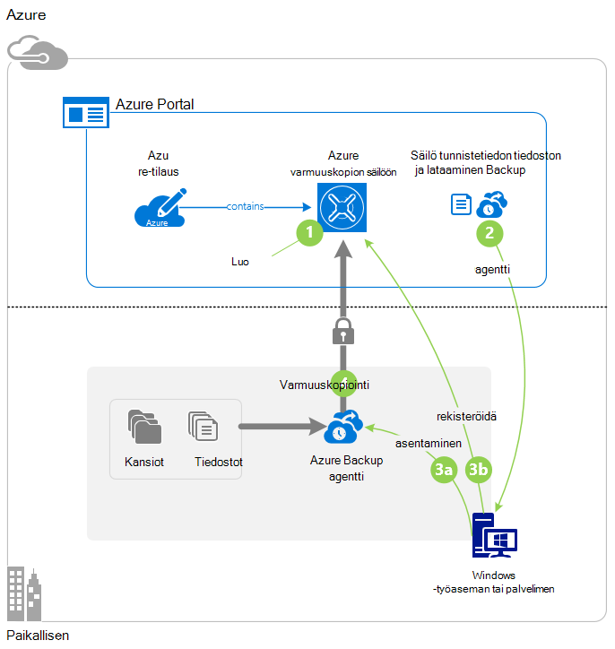

>[AZURE.IMPORTANT] Azure on kaksi eri käyttöönoton mallien luominen ja käyttäminen resurssit: Resurssienhallinta ja perinteinen. Tässä artikkelissa käsitellään perinteinen käyttöönotto-mallin. Microsoft suosittelee, että useimmat uudet käyttöönoton käyttävät Resurssienhallinta-malli.

## Ennen aloittamista
Voit varmuuskopioida palvelimeen tai asiakkaan Azure, sinun on Azure-tili. Jos sinulla ei ole, voit luoda [ilmaisen tilin](https://azure.microsoft.com/free/) muutamaan minuuttiin.

## Vaihe 1: Luo varmuuskopio säilöön
Haluat varmuuskopioida tiedostot ja kansiot-palvelimesta tai asiakkaan, Luo varmuuskopio säilö maantieteellisen alueen, johon haluat tallentaa tiedot.

### Luo varmuuskopio säilöön

1. Kirjaudu [perinteinen-portaaliin](https://manage.windowsazure.com/).

2. **Uusi** > **Tietopalvelujen** > **Palautus Services** > **Varmuuskopiointi säilöön**, ja valitse sitten **Nopea luominen**.

3. Kirjoita **nimi** -parametrin varmuuskopion säilö kutsumanimi. Kirjoita nimi, joka sisältää 2 – 50 merkkiä. Se on alettava kirjaimella, ja voivat sisältää vain kirjaimia, numeroita ja väliviivoja. Tämä nimi on oltava yksilöllinen jokaisen tilauksen.

4. Valitse **alue** -parametrin maantieteellisen alueen for backup säilö. Tämä asetus määrittää maantieteellisen alueen, jossa varmuuskopioidut tiedot lähetetään. Valitsemalla maantieteellisen alueen, joka on lähellä sijaintisi voit pienentää verkon latenssin kun Azure varmuuskopioimalla.

5. Valitse **Luo säilö**.

    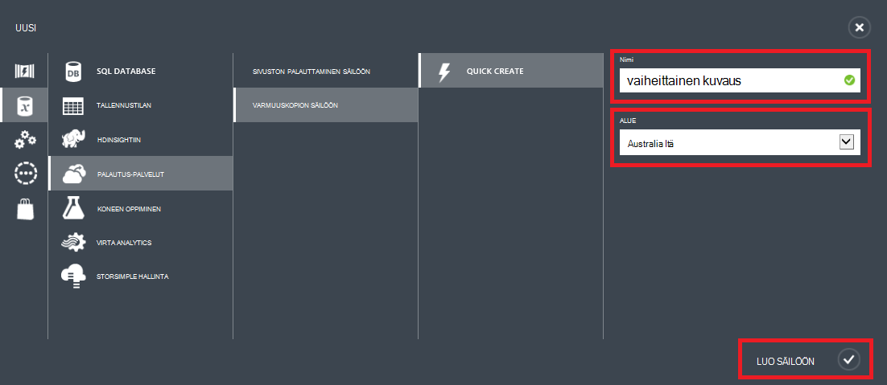

    Voi kestää hetken, luoda varmuuskopion säilö. Tarkista tila, seurata perinteinen portaalin alareunassa ilmoitukset.

    Kun varmuuskopioinnin säilö on luotu, näyttöön tulee sanoma, jossa ilmoitetaan, että säilö on luotu onnistuneesti. Se näkyy myös **aktiiviseksi** resurssien **Palautuksen** palveluluetteloon.

    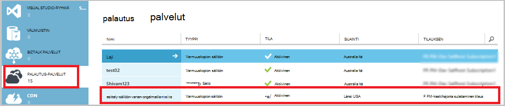

4. Valitse tallennustilan redundancy seuraamalla tässä kuvatut vaiheet.

    >[AZURE.IMPORTANT] Löydät parhaan mahdollisen ajan tunnistavan redundancy tallennuspaikka on oikealle säilö luonnin jälkeen ja ennen missään rekisteröity säilö. Kun kohde on rekisteröity säilö, redundancy tallennuspaikka on lukittu, eikä sitä voi muokata.

    Jos käytät Azure ensisijainen varmuuskopion tallennustilan päätepisteen (esimerkiksi varmuuskopioidaan, Azure Windows-palvelimesta), harkitse valitsemalla (oletusasetus) [geo tarpeettomat](../storage/storage-redundancy.md#geo-redundant-storage) tallennuspaikka.

    Jos käytät Azure ensisijaisen varmuuskopion tallennustilan päätepisteen (esimerkiksi käytät System Center tietojen suojauksen hallinta kannattaa tallentaa paikallisen varmuuskopion paikallisen ja Azure käytön pitkään säilytys on), harkitse [paikallisesti ylimääräinen](../storage/storage-redundancy.md#locally-redundant-storage). Tämä lisää alaspäin kustannusten tiedot tallennetaan Azure-käyttämisessä alemmalle tasolle viimeinen myyntipäivä tiedoillesi mahdollisesti ensisijaisen kopiot hyväksyttäväksi.

    **Valitse redundancy tallennuspaikka seuraavasti:**

    a. Valitse juuri luomasi säilö.

    b. Valitse Pika-aloitus-sivulla **Määritä**.

    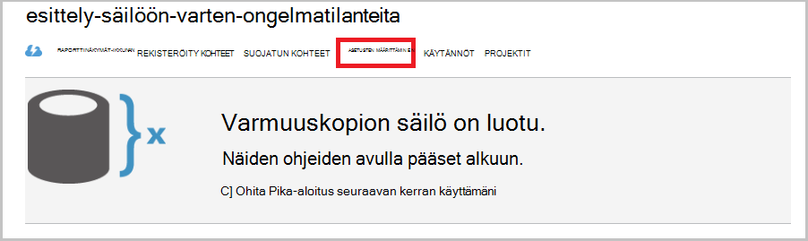

    c-näppäinyhdistelmää. Valitse haluamasi redundancy tallennuspaikka.

    Jos valitset **Paikallisesti tarpeettomat**, joudut valitsemalla **Tallenna** (koska **Geo Redundant** on oletusasetus).

    d. Valitse vasemmassa siirtymisruudussa palaa resurssien luetteloa palautus-palveluiden **Palautus-palvelut** .

## Vaihe 2: Lataa tiedosto säilöön tunnistetiedon
Paikallisen tietokoneen on voi todentaa varmuuskopion säilöön, ennen kuin se voit varmuuskopioida tiedot Azure. Todennus saavutetaan *säilö tunnistetietojen*avulla. Säilö tunnistetiedon tiedosto ladataan perinteinen-portaalista suojatun kanavan kautta. Varmenteen yksityinen avain ei säily portaalin tai palvelu.

Lisätietoja [käyttämällä säilö tunnistetietojen tarkistamiseen varmuuskopiointi-palvelussa](backup-introduction-to-azure-backup.md#what-is-the-vault-credential-file).

### Lataa tiedosto säilöön credential paikallisessa tietokoneessa

1. Valitse vasemmassa siirtymisruudussa **Palautus palveluja**ja valitse sitten varmuuskopion säilö, jonka loit.

    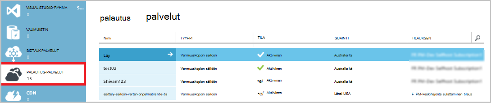

2.  Napsauta Pika-aloitus-sivulla **Lataa säilö tunnistetiedot**.

    Perinteinen portaalin Luo säilö tunnistetietojen avulla yhdistelmä säilö nimi ja nykyisen päivämäärän. Säilö tunnistetietojen tiedoston käytetään vain rekisteröinti työnkulun aikana ja vanhentuu 48 tuntia.

    Säilö tunnistetiedon tiedostoa voi ladata portaalin.

3. Valitse **Tallenna** ladattava tiedosto säilöön tunnistetiedon paikallisen tilin tiedostot-kansiossa. Voit myös valita **Tallenna nimellä** **tallentaa** -valikossa Valitse säilöön tunnistetiedon-tiedoston sijainti.

    >[AZURE.NOTE] Varmista, että säilö tunnistetiedon tiedosto tallennetaan sijaintiin, jossa niitä voi käyttää tietokoneesta. Jos se on tallennettu tiedosto Jaa tai palvelimen viestin eston, varmista, että sinulla on oikeus käyttää sitä.

## Vaihe 3: Lataaminen, asentaminen ja rekisteröi Backup-agentti
Kun olet luonut varmuuskopion säilö ja lataa tiedosto säilöön tunnistetiedon-agentti on oltava asennettuna kunkin Windows-tietokoneissa.

### Jos haluat ladata, asentaa ja rekisteröi agentti

1. Valitse **Palautus palvelut**ja valitse sitten varmuuskopion säilö, jonka haluat rekisteröidä palvelimen kanssa.

2. Napsauta Pika-aloitus-sivulla agentti **Anonyymi, Windows Server- tai System Center tietojen suojauksen hallinta- tai Windows-asiakasohjelman**. Valitse **Tallenna**.

    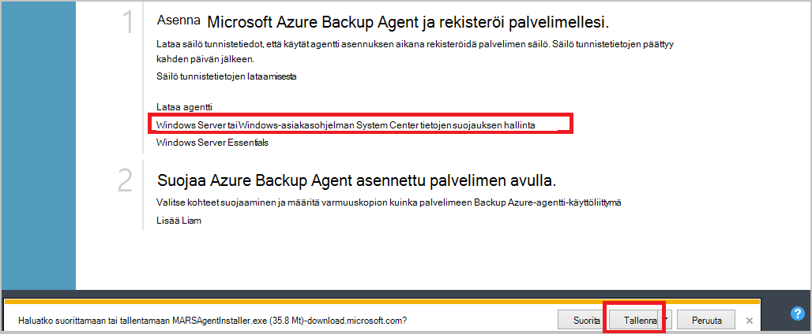

3. Kun MARSagentinstaller.exe-tiedosto on ladattu, valitse **Suorita** (tai kaksoisnapsauta **MARSAgentInstaller.exe** tallennuspaikasta).

4. Valitse asennuksen kansio ja välimuistikansio, joita tarvitaan agentti ja valitse sitten **Seuraava**. Määrittämääsi välimuistin on oltava varmuuskopiotiedot on sama kuin 5 prosenttia tilaa.

5. Voit edelleen välityspalvelimen oletusasetuksia – Internet-yhteys.          Jos käytät välityspalvelinta muodostaa yhteyden Internetiin, välityspalvelimen määritys-sivulla Valitse **mukautettu välityspalvelimen asetusten avulla** -valintaruutu ja kirjoita sitten välityspalvelimen palvelimen tiedot. Jos käytät edellyttävän välityspalvelimen kautta, kirjoita käyttäjän nimi ja salasana tiedot ja valitse sitten **Seuraava**.

7. Valitse Aloita agentti asennus **asentaminen** . Varmuuskopiointi-agentti asentaa .NET Framework 4.5 ja Windows PowerShellin (jos se ei ole jo asennettu) ja viimeistele asennus.

8. Kun agentti on asennettu, valitse **Jatka rekisteröintiä** työnkulun Jatka.

9. Säilö tunnistetiedot-sivulla Selaa ja valitse aiemmin lataamaasi säilö credential-tiedostoa.

    Säilö tunnistetiedon tiedosto on voimassa vain 48 tuntia, kun se ladataan-portaalista. Jos saat virheilmoituksen tällä sivulla (esimerkiksi "säilö tunnistetiedot annettua tiedostoa on päättynyt")-portaaliin sisäänkirjautuminen ja lataa tiedosto säilöön tunnistetiedon uudelleen.

    Varmista, että säilö tunnistetiedon tiedosto on käytettävissä sijainnissa, jota voit käyttää sovelluksen. Jos käytössä ilmenee access liittyvät virheet, kopioi säilö tunnistetiedon tiedosto tilapäinen sijaintiin samaan tietokoneeseen ja yritä uudelleen.

    Jos käytössä ilmenee säilö tunnistetiedon-virhe, kuten "Virheellinen säilö tunnistetietojen annettu", että tiedosto on vahingoittunut tai ei ole on uusin tunnistetiedot palautus-palveluun liitetyn. Yritä jälkeen uusi säilö credential tiedoston lataamisen-portaalista. Tämä virhe voi ilmetä myös, jos käyttäjä valitsee useita kertoja peräkkäin nopeasti **Lataa säilö tunnistetiedot** -vaihtoehto. Tässä tapauksessa vain viimeinen säilö credential tiedosto on voimassa.

9. Salauksen asetukset-sivulla Luo salasana tai antaa salasana (vähintään 16 merkkiä). Muista tallentaa salasana turvalliseen paikkaan.

10. Valitse **Valmis**. Ohjattu palvelimen rekisteröidä Rekisteröi palvelimen varmuuskopioimalla.

    >[AZURE.WARNING] Jos kadotat tai unohdat salasana, Microsoft voi auttaa sinua Palauta varmuuskopioidut tiedot. Omistat salauksen salasana ja Microsoft ei ole näkyvyys salasana, jota käytetään. Tallenna tiedosto turvalliseen paikkaan, koska se on pakollinen palautumistoiminnon aikana.

11. Kun salausavain on määritetty, **Käynnistä Microsoft Azure palautus Services Agent** -valintaruutu ja valitse sitten **Sulje**.

## Vaihe 4: Suorita alkuperäinen varmuuskopiointi

Alkuperäinen varmuuskopioinnin sisältää tärkeimmät tehtävät:

- Varmuuskopion aikataulun luominen
- Tiedostojen ja kansioiden varmuuskopioinnista ensimmäistä kertaa

Varmuuskopion käytännön päätyttyä alkuperäinen varmuuskopiointi luo varmuuskopio pistettä, joita voit käyttää, jos haluat palauttaa tiedot. Varmuuskopion käytännön täyttää määrittämäsi aikataulun mukaan.

### Ajoita varmuuskopiointi

1. Avaa Microsoft Azure varmuuskopiointi-agentti. (Se avautuu automaattisesti, jos se jäi, **Käynnistä Microsoft Azure palautus Services Agent** -valintaruutu on valittuna ohjatun palvelimen rekisteröidä suljettaessa.) Löydät sen koneen hakemalla **Microsoft Azure varmuuskopiointi**.

    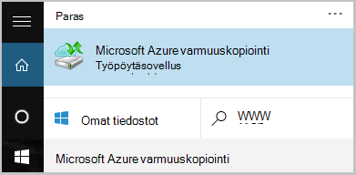

2. Valitse **Ajoita varmuuskopiointi**Backup-agentti.

    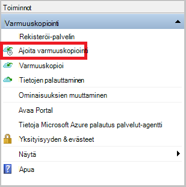

3. Valitse ohjattu aikataulun Varmuuskopiointi-sovelluksen käytön aloittaminen-sivulla **Seuraava**.

4. Valitse kohteiden varmuuskopiointi-sivulle valitsemalla **Lisää kohteita**.

5. Valitse tiedostot ja kansiot, jotka haluat varmuuskopioida ja valitse sitten **OK**.

6. Valitse **Seuraava**.

7. **Määritä varmuuskopion ajoitus** -sivulla Määritä **aikataulun** ja valitse **Seuraava**.

    Voit ajoittaa (ja enimmäisnopeus kolme kertaa päivässä) päivittäin tai viikoittain varmuuskopiot.

    

    >[AZURE.NOTE] Lisätietoja siitä, miten varmuuskopioinnin aikataulu on artikkelissa [Käytä Azure varmuuskopion korvaa nauha-infrastruktuuria](backup-azure-backup-cloud-as-tape.md).

8. Valitse **Valitse säilytyskäytäntö** -sivulla **Säilytyskäytäntö** varmuuskopion.

    Säilytyskäytännön määrittää keston, jonka varmuuskopioinnin tallennetaan. Sen sijaan, että vain määrittäminen "tasainen käytäntöä" pisteiden varmuuskopion, voit määrittää eri säilytyskäytäntöjä perusteella varmuuskopioinnin yhteydessä. Voit muokata päivittäin, viikoittain, kuukausittain ja vuosittaisen säilytyskäytännöt vastaamaan omia tarpeita.

9. Valitse ensimmäinen varmuuskopion tyyppi-sivulla Valitse alkuperäinen varmuuskopion tyyppi. Jätä **automaattisesti verkossa** valittuna-vaihtoehto ja valitse sitten **Seuraava**.

    Voit varmuuskopioida automaattisesti verkossa tai voit varmuuskopioida offline-tilassa. Jäljempänä tässä artikkelissa käsitellään varmuuskopioiminen automaattisesti. Jos haluat tehdä offline-tilassa varmuuskopion, tarkista artikkelin [offline-tilassa olevan Azure varmuuskopion varmuuskopion työnkulun](backup-azure-backup-import-export.md) lisätietoja.

10. Valitse vahvistussivullavalmis Tarkista tiedot ja valitse sitten **Valmis**.

11. Kun ohjattu toiminto on luonut varmuuskopioinnin aikataulu, valitse **Sulje**.

### Ota käyttöön verkon rajoitin (valinnainen)

Varmuuskopiointi-agentti on verkon rajoitusta. Rajoitus määrittää, miten kaistanleveys käytetään tiedonsiirrossa. Ohjausobjektin voi olla hyödyllinen, jos haluat varmuuskopioida tiedot aikana työaika, mutta et halua varmuuskopiointia voi häiritä muiden Internet-liikenne. Rajoitus koskee varmuuskopioiminen ja palauttaminen toimintoja.

**Jos haluat ottaa käyttöön verkon rajoittaminen**

1. Valitse Varmuuskopiointi-agentti **Ominaisuuksien muuttaminen**.

    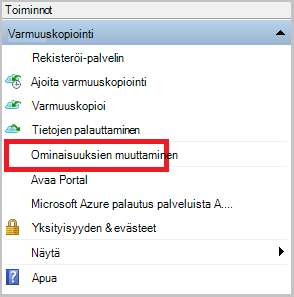

2. Valitse **Throttling** -välilehden **Internetin kaistanleveyden käytön rajoittaminen backup toimille Ota käyttöön** -valintaruutu.

    

3. Sen jälkeen, kun käytössä on rajoitin, määritä sallitut kaistanleveyden varmuuskopiotiedot siirron **työtuntien** ja **Muut työtuntien**aikana.

    Kaistanleveyden arvot alkaa 512 kilobittiä sekunnissa (Kbps), ja voit siirtyä 1,023 megatavua sekunnissa (MBps). Voit myös nimetä alku ja lopetuksen **työtuntien**ja mitkä viikonpäivien ovat pidetään työpäivät. Tuntia ulkopuolella nimetyn työn tuntia pidetään vapaa-aika tuntia.

4. Valitse **OK**.

### Tiedostojen määrittäminen

1. Valitse Varmuuskopiointi-agentti **Varmuuskopioi** suorittamiseen alkuperäinen valuuttamuunnosten verkon kautta.

    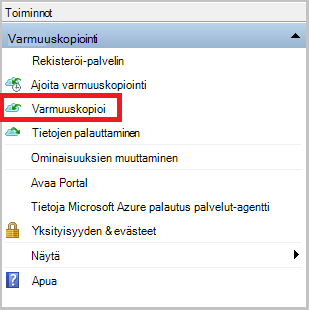

2. Tarkista Vahvista-sivulla asetukset, jotka takaisin ylös nyt ohjattu toiminto käyttää tietokoneen varmuuskopioida. Valitse **Varmuuskopioi**.

3. Valitsemalla **Sulje** ohjattu toiminto. Jos Tee tämä ennen varmuuskopiointia on valmis, ohjattu toiminto säilyy käynnissä taustalla.

Alkuperäinen varmuuskopioinnin jälkeen **työ valmis** -tila näkyy varmuuskopiointi-konsolissa.

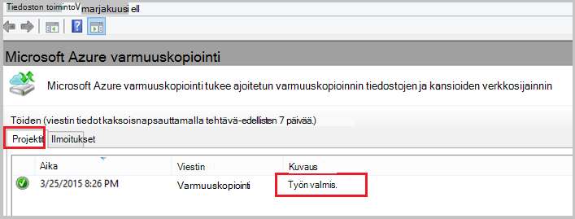

## Seuraavat vaiheet
- Rekisteröityä [maksuttoman Azure-tili](https://azure.microsoft.com/free/).

Saat lisätietoja varmuuskopioinnista VMs tai muita toiminnoista:

- [IaaS VMs varmuuskopiointi](backup-azure-vms-prepare.md)
- [Varmuuskopioi työmääriä Azure Microsoft Azure varmuuskopiointi-palvelimen kanssa](backup-azure-microsoft-azure-backup.md)
- [Varmuuskopioi työmääriä Azure DPM kanssa](backup-azure-dpm-introduction.md)
