<properties
    pageTitle="Varmuuskopioi Windows Server- tai asiakkaan Azure Azure varmuuskopioimalla Resurssienhallinta käyttöönoton mallin | Microsoft Azure"
    description="Varmuuskopion Windows-palvelimien tai asiakkaiden Azure luominen varmuuskopion säilöön, tunnistetietojen lataamisesta, asentamalla backup-agentti ja olet suorittanut ensimmäisen varmuuskopion tiedostot ja kansiot."
    services="backup"
    documentationCenter=""
    authors="markgalioto"
    manager="cfreeman"
    editor=""
    keywords="varmuuskopion säilö; Windows server; varmuuskopiointi varmuuskopion ikkunat."/>

<tags
    ms.service="backup"
    ms.workload="storage-backup-recovery"
    ms.tgt_pltfrm="na"
    ms.devlang="na"
    ms.topic="article"
    ms.date="08/10/2016"
    ms.author="jimpark; trinadhk; markgal"/>

# Varmuuskopioi asiakas- tai Windows Server Azure käyttämällä resurssien hallinnan käyttöönottomalli

> [AZURE.SELECTOR]
- [Azure portal](backup-configure-vault.md)
- [Perinteinen portal](backup-configure-vault-classic.md)

Tässä artikkelissa kerrotaan, miten voit varmuuskopioida Windows Server (tai Windows-asiakasohjelman) tiedostojen ja kansioiden Azure Azure varmuuskopioimalla käyttämällä resurssien hallinnan käyttöönottomalli.

[AZURE.INCLUDE [learn-about-deployment-models](../../includes/backup-deployment-models.md)]

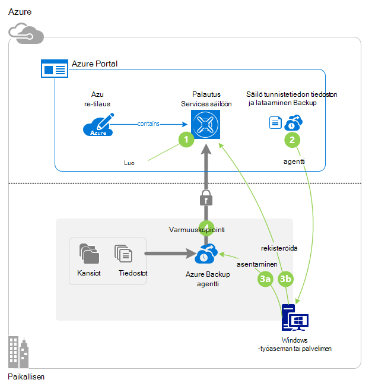

## Ennen aloittamista
Voit varmuuskopioida palvelimeen tai asiakkaan Azure, sinun on Azure-tili. Jos sinulla ei ole, voit luoda [ilmaisen tilin](https://azure.microsoft.com/free/) muutamaan minuuttiin.

## Vaihe 1: Luo palautus palvelut-säilö

Palautus palvelut-säilö on kokonaisuus, joka tallentaa varmuuskopiointi ja palauttaminen pisteiden luot ajan kuluessa. Palautus Services säilö sisältää myös varmuuskopion käytäntö suojattuja tiedostoja ja kansioita. Kun luot palautus Services säilöön, sinun on valittava myös sopiva tallennuspaikka redundancy.

### Voit luoda palautus palvelut-säilö

1. Jos sinulla ei ole vielä kirjautunut, kirjaudu sisään käyttämällä Azure tilauksen [Azure-portaalissa](https://portal.azure.com/) .

2. Valitse toiminto-valikosta valitsemalla **Selaa** ja kirjoita resurssien luetteloa, **Palautus-palvelut**. Kun alat kirjoittaa, luettelo suodattaa syötettäsi perusteella. Valitse **palautus-palveluiden vaults**.

    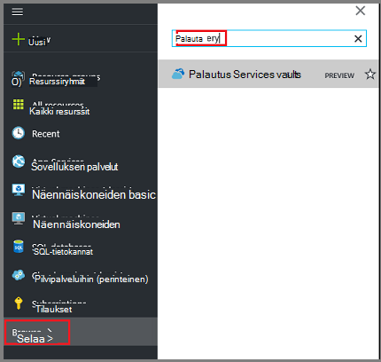  

    Palautus Services vaults luettelo tulee näkyviin.

3. **Palautus Services vaults** -valikosta **Lisää**.

    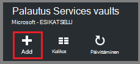

    Palautus Services säilö-sivu avautuu, kannattaa antaa **nimi**, **tilauksen**, **resurssiryhmä**ja **sijainti**.

    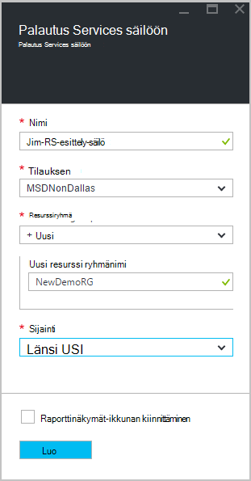

4. Kirjoita kutsumanimi tunnistavan säilö **nimi**. Nimen on oltava yksilöllinen Azure-tilausta. Kirjoita nimi, joka sisältää 2 – 50 merkkiä. Se on alettava kirjaimella, ja voivat sisältää vain kirjaimia, numeroita ja väliviivoja.

5. Valitse **tilaus** tilaukset käytettävissä luettelossa. Jos et ole varma, mikä tilaus käyttämään, käytä oletusarvoa (tai ehdotetut) tilaukseen. On useita vaihtoehtoja vain, jos organisaation tilillä on liitetty useita Azure-tilauksia.

6. **Resurssiryhmä** käytettävissä luettelo resurssin ryhmien tai valitse **Uusi** ja luo uusi resurssiryhmä. Resurssiryhmät Lisätietoja on artikkelissa [Azure resurssien hallinnan yleiskatsaus](../azure-resource-manager/resource-group-overview.md)

7. Valitse **sijainti** Valitse säilö maantieteellinen alue. Tämä asetus määrittää maantieteellisen alueen, jossa varmuuskopioidut tiedot lähetetään. Valitsemalla maantieteellisen alueen, joka on lähellä sijaintisi voit pienentää verkon latenssin kun Azure varmuuskopioimalla.

8. Valitse **Luo**. Se voi viedä aikaa palautus Services säilö luodaan. Seurata tilailmoitukset portaalin oikeassa yläkulmassa-alueella. Kun oman säilö on luotu, se kannattaa avata portaalissa. Jos et näe lisääminen säilöön luettelossa, kun se on valmis, valitse **Päivitä**. Kun luettelo on päivitetty, valitse säilö nimi.

### Voit selvittää tallennustilan redundancy
Kun luot palautus Services säilö voit määrittää, miten tallennustilan replikoida.

1. Valitse **asetukset** -sivu, joka avautuu automaattisesti säilö Raporttinäkymät-ikkunan kanssa, **Varmuuskopiointi-infrastruktuuria**.

2. Valitse Näytä **replikoinnin tallennustyyppi** **Varmuuskopioinnin määrittäminen** varmuuskopiointi infrastruktuuri-sivu.

    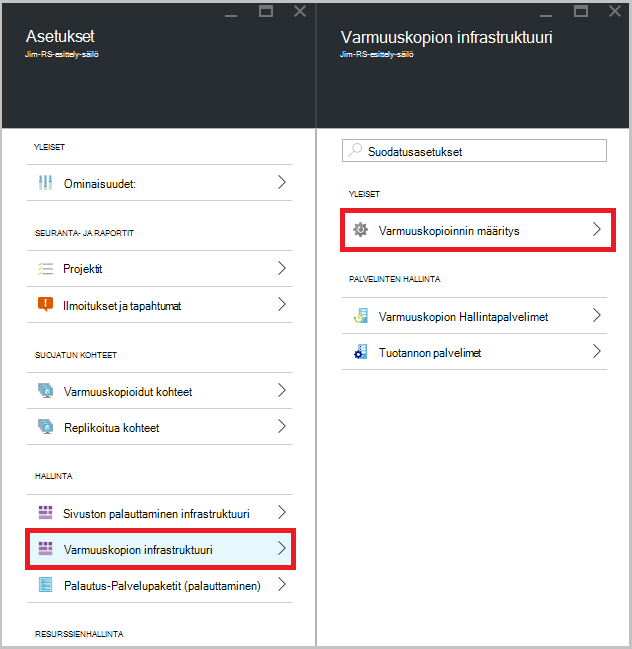

3. Valitse oman säilö replikoinnin tallennuspaikka.

    

    Oman säilö on oletusarvoisesti geo ylimääräinen. Jos käytät Azure ensisijainen varmuuskopion tallennustilan päätepisteen, käytä geo ylimääräinen edelleen. Jos käytät Azure muun ensisijaisen varmuuskopion tallennustilan päätepisteen, valitse paikallisesti tarpeettomat tallennustilaa, joka vähentää kustannusten tietojen tallentaminen Azure-tietokannassa. Lue lisätietoja [geo tarpeettomat](../storage/storage-redundancy.md#geo-redundant-storage) ja [paikallisesti tarpeettomat](../storage/storage-redundancy.md#locally-redundant-storage) tallennusasetukset tässä [Yleiskatsaus](../storage/storage-redundancy.md).

    Sen jälkeen, että säilö tallennustilan-vaihtoehdon valitseminen olet valmis, tiedostoja ja kansioita liitettävä säilö.

Nyt kun olet luonut säilöön, voit valmistella infrastruktuurin varmuuskopioida tiedostot ja kansiot lataamalla ja asentamalla Microsoft Azure palautus Services-agentti, säilö tunnistetietojen lataamisesta ja rekisteröidä agentti säilö tunnistetiedot avulla.

## Vaihe 2 – lataa tiedostot

>[AZURE.NOTE] Ottaminen käyttöön varmuuskopiointi palvelun Azure-portaalissa on tulossa. Tällä hetkellä käyttämällä Microsoft Azure palautus Services Agent paikallisen voit varmuuskopioida tiedostot ja kansiot.

1. Valitse **asetukset** palautus Services säilö koontinäytössä.

    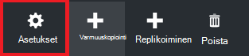

2. Valitse **Aloitus > varmuuskopiointi** -asetukset-sivu.

    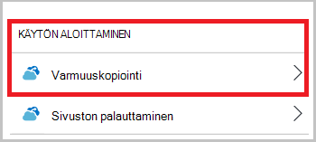

3. Valitse **Varmuuskopiointi tavoitteen** varmuuskopiointi-sivu.

    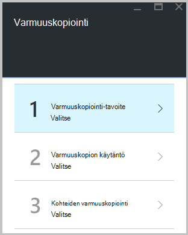

4. Valitse **paikallisen** josta on käynnissä havainnollistamiseen? valikko.

5. Valitse **tiedostot ja kansiot** mitä voit tehdä varmuuskopion haluat? valikko, ja valitse **OK**.

#### Lataa palautus palvelut-agentti

1. Valitse **Lataa anonyymi, Windows Server- tai Windows-asiakasohjelmaa** **valmisteleminen infrastruktuuri** -sivu.

    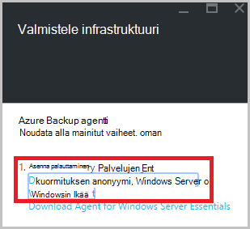

2. Lataa-ponnahdusikkunassa valitsemalla **Tallenna** . **MARSagentinstaller.exe** -tiedosto tallennetaan oletusarvoisesti tiedostot-kansiossa.

#### Säilö tunnistetietojen lataamisesta

1. Valitse **Lataa > Tallenna** valitse Valmistele infrastruktuuri-sivu.

    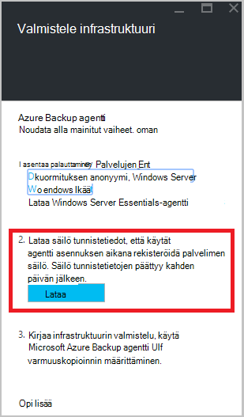

## Vaihe 3 – Asenna ja rekisteröi agentti

1. Etsi ja kaksoisnapsauta **MARSagentinstaller.exe** tiedostot-kansiossa (tai muita tallennussijainnin).

2. Suorita Microsoft Azure palautus palvelut-agentti ohjatun. Suorita ohjattu on:

    - Valitse asennus- ja välimuistikansion sijainti.
    - Anna välityspalvelimen palvelimen tiedot, jos käytät välityspalvelinta internet-yhteys.
    - Lisätiedot käyttäjän käyttäjänimi ja salasana, jos käytät edellyttävän välityspalvelimen kautta.
    - Ladatun säilö tunnistetiedoilla
    - Tallenna salasana salaus turvalliseen paikkaan.

    >[AZURE.NOTE] Jos kadotat tai unohdat salasana, Microsoft voi auttaa Palauta varmuuskopioidut tiedot. Tallenna tiedosto turvalliseen paikkaan. Se tarvitaan palauttaminen varmuuskopiosta.

Agentti on asennettu ja tietokone on rekisteröity säilö. Olet valmis ja ajoittaa varmuuskopion.

### Vahvista asennuksen

Varmista, että agentti asennettu ja rekisteröity oikein, voit tarkistaa kohteiden hallinta-portaalin **Palvelin** -osassa varmuuskopioida. Toiminto:

1. Kirjautuminen [Azure Portal](https://portal.azure.com/) Azure-tilauksen käyttäminen.

2. Valitse toiminto-valikosta valitsemalla **Selaa** ja kirjoita resurssien luetteloa, **Palautus-palvelut**. Kun alat kirjoittaa, luettelo suodattaa syötettäsi perusteella. Valitse **palautus-palveluiden vaults**.

      

    Palautus Services vaults luettelo tulee näkyviin.

2. Valitse luomasi säilö nimi.

    Palautus Services säilö dashboard-sivu avautuu.

    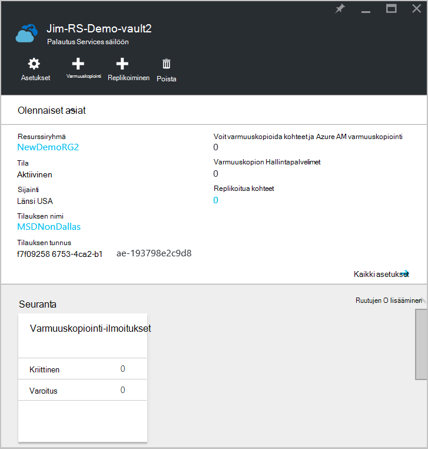  

3. Valitse sivun ylälaidassa **asetukset** -painiketta.

4. Valitse **infrastruktuuri Varmuuskopioi > tuotannon palvelinten**.

    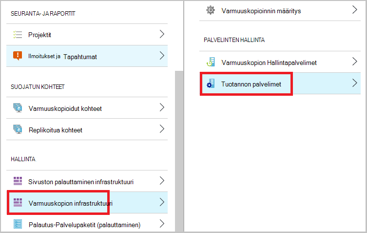

Jos näet luettelon palvelimeen, sinun on Vahvista, että agentti on asennettu ja rekisteröity oikein.

## Vaihe 4: Suorita alkuperäinen varmuuskopiointi

Alkuperäinen varmuuskopioinnin sisältää tärkeimmät tehtävät:

- Ajoita varmuuskopiointi
- Varmuuskopioida tiedostot ja kansiot ensimmäistä kertaa

Alkuperäinen varmuuskopioinnin suorittamiseen voit käyttää Microsoft Azure backup-agentti.

### Ajoita varmuuskopiointi

1. Avaa Microsoft Azure varmuuskopiointi-agentti. Löydät sen koneen hakemalla **Microsoft Azure varmuuskopiointi**.

    

2. Valitse **Ajoita varmuuskopiointi**Backup-agentti.

    

3. Valitse ohjattu aikataulun Varmuuskopiointi-sovelluksen käytön aloittaminen-sivulla **Seuraava**.

4. Valitse kohteiden varmuuskopiointi-sivulle valitsemalla **Lisää kohteita**.

5. Valitse tiedostot ja kansiot, jotka haluat varmuuskopioida ja valitse sitten **OK**.

6. Valitse **Seuraava**.

7. **Määritä varmuuskopion ajoitus** -sivulla Määritä **aikataulun** ja valitse **Seuraava**.

    Voit ajoittaa (ja enimmäisnopeus kolme kertaa päivässä) päivittäin tai viikoittain varmuuskopiot.

    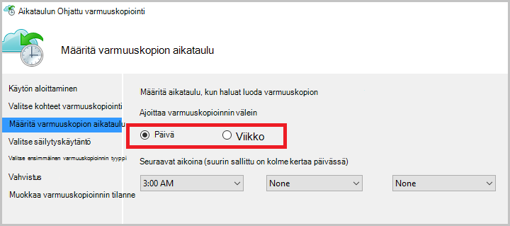

    >[AZURE.NOTE] Lisätietoja siitä, miten varmuuskopioinnin aikataulu on artikkelissa [Käytä Azure varmuuskopion korvaa nauha-infrastruktuuria](backup-azure-backup-cloud-as-tape.md).

8. Valitse **Valitse säilytyskäytäntö** -sivulla **Säilytyskäytäntö** varmuuskopion.

    Säilytyskäytännön määrittää keston, jonka varmuuskopioinnin tallennetaan. Sen sijaan, että vain määrittäminen "tasainen käytäntöä" pisteiden varmuuskopion, voit määrittää eri säilytyskäytäntöjä perusteella varmuuskopioinnin yhteydessä. Voit muokata päivittäin, viikoittain, kuukausittain ja vuosittaisen säilytyskäytännöt vastaamaan omia tarpeita.

9. Valitse ensimmäinen varmuuskopion tyyppi-sivulla Valitse alkuperäinen varmuuskopion tyyppi. Jätä **automaattisesti verkossa** valittuna-vaihtoehto ja valitse sitten **Seuraava**.

    Voit varmuuskopioida automaattisesti verkossa tai voit varmuuskopioida offline-tilassa. Jäljempänä tässä artikkelissa käsitellään varmuuskopioiminen automaattisesti. Jos haluat tehdä offline-tilassa varmuuskopion, tarkista artikkelin [offline-tilassa olevan Azure varmuuskopion varmuuskopion työnkulun](backup-azure-backup-import-export.md) lisätietoja.

10. Valitse vahvistussivullavalmis Tarkista tiedot ja valitse sitten **Valmis**.

11. Kun ohjattu toiminto on luonut varmuuskopioinnin aikataulu, valitse **Sulje**.

### Ota käyttöön verkon rajoitin (valinnainen)

Backup-agentti on verkon rajoitusta. Rajoitus määrittää, miten kaistanleveys käytetään tiedonsiirrossa. Ohjausobjektin voi olla hyödyllinen, jos haluat varmuuskopioida tiedot aikana työaika, mutta et halua varmuuskopiointia voi häiritä muiden Internet-liikenne. Rajoitus koskee varmuuskopioiminen ja palauttaminen toimintoja.

>[AZURE.NOTE] Verkon rajoittaminen ei ole käytettävissä Windows Server 2008 R2 SP1, Windows Server 2008 SP2 tai Windows 7 (jossa on service Pack-paketit). Azure varmuuskopiointi verkon rajoittimen ominaisuus käyttää palvelun laatua (QoS) paikallisen käyttöjärjestelmä. Vaikka Azure varmuuskopiointi suojata käyttöjärjestelmistä, QoS käytettävissä näissä ympäristöissä versio ei toimi Azure varmuuskopiointi verkon rajoitusta. Verkon rajoittimen voidaan käyttää kaikkia muita [Tuetut käyttöjärjestelmät](backup-azure-backup-faq.md#installation-amp-configuration).

**Jos haluat ottaa käyttöön verkon rajoittaminen**

1. Valitse backup-agentti **Ominaisuuksien muuttaminen**.

    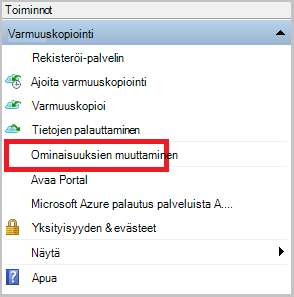

2. Valitse **Throttling** -välilehden **Internetin kaistanleveyden käytön rajoittaminen backup toimille Ota käyttöön** -valintaruutu.

    

3. Sen jälkeen, kun käytössä on rajoitin, määritä sallitut kaistanleveyden varmuuskopiotiedot siirron **työtuntien** ja **Muut työtuntien**aikana.

    Kaistanleveyden arvot alkaa 512 kilobittiä sekunnissa (Kbps), ja voit siirtyä 1,023 megatavua sekunnissa (MBps). Voit myös nimetä alku ja lopetuksen **työtuntien**ja mitkä viikonpäivien ovat pidetään työpäivät. Tuntia ulkopuolella nimetyn työn tuntia pidetään vapaa-aika tuntia.

4. Valitse **OK**.

### Voit varmuuskopioida tiedostot ja kansiot ensimmäistä kertaa

1. Valitse backup-agentti **Varmuuskopioi** suorittamiseen alkuperäinen valuuttamuunnosten verkon kautta.

    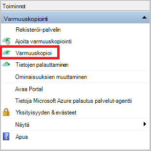

2. Tarkista Vahvista-sivulla asetukset, jotka takaisin ylös nyt ohjattu toiminto käyttää tietokoneen varmuuskopioida. Valitse **Varmuuskopioi**.

3. Valitsemalla **Sulje** ohjattu toiminto. Jos Tee tämä ennen varmuuskopiointia on valmis, ohjattu toiminto säilyy käynnissä taustalla.

Alkuperäinen varmuuskopioinnin jälkeen **työ valmis** -tila näkyy varmuuskopiointi-konsolissa.

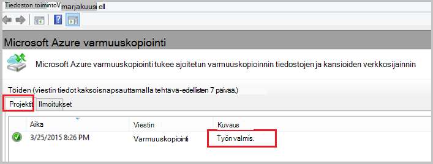

## Kysymyksiä?
Jos sinulla on kysymyksiä tai jos mikä tahansa ominaisuus, jonka haluat nähdä sisältää, [Lähetä meille palautetta](http://aka.ms/azurebackup_feedback).

## Seuraavat vaiheet
Saat lisätietoja varmuuskopioinnista VMs tai muita toiminnoista:

- Nyt kun olet varmuuskopioinut tiedostoja ja kansioita, voit [hallita vaults ja palvelimiin](backup-azure-manage-windows-server.md).
- Jos haluat palauttaa varmuuskopion, lue Lisää artikkelista palauttamaan [tiedostoja Windows-tietokoneeseen](backup-azure-restore-windows-server.md).
