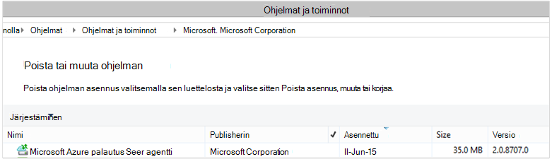

<properties
    pageTitle="Azure varmuuskopiointi - käyttöönotto ja hallinta takaisin sinua käyttäjäksi DPM PowerShellin avulla | Microsoft Azure"
    description="Lue, miten voit ottaa käyttöön ja hallita Azure varmuuskopiointi for Data Protection Manager (DPM) PowerShellin avulla"
    services="backup"
    documentationCenter=""
    authors="Nkolli1"
    manager="shreeshd"
    editor=""/>

<tags
    ms.service="backup"
    ms.workload="storage-backup-recovery"
    ms.tgt_pltfrm="na"
    ms.devlang="na"
    ms.topic="article"
    ms.date="09/27/2016"
    ms.author="jimpark; trinadhk; anuragm; markgal"/>


# <a name="deploy-and-manage-backup-to-azure-for-data-protection-manager-dpm-servers-using-powershell"></a>Käyttöönotto ja hallinta tietojen suojauksen Manager (DPM)-palvelinten PowerShellin Azure varmuuskopiointi

> [AZURE.SELECTOR]
- [ARM](backup-dpm-automation.md)
- [Perinteinen](backup-dpm-automation-classic.md)

Tässä artikkelissa kerrotaan, miten PowerShellin käyttäminen DPM palvelimessa Azure varmuuskopioinnin määrittäminen ja hallinta varmuuskopiointi ja palauttaminen.

## <a name="setting-up-the-powershell-environment"></a>PowerShell-ympäristön määrittäminen

[AZURE.INCLUDE [learn-about-deployment-models](../../includes/learn-about-deployment-models-include.md)]

Ennen kuin PowerShellin avulla voit hallita varmuuskopioiden hallinnan suojaus Azure, on pystyttävä muodostamaan oikean ympäristön powershellissä. PowerShell-istunnon alussa varmistaa, että suoritat seuraavan komennon oikealle moduulit ja voit viitata oikein DPM cmdlet-komennot:

```
PS C:> & "C:\Program Files\Microsoft System Center 2012 R2\DPM\DPM\bin\DpmCliInitScript.ps1"

Welcome to the DPM Management Shell!

Full list of cmdlets: Get-Command
Only DPM cmdlets: Get-DPMCommand
Get general help: help
Get help for a cmdlet: help <cmdlet-name> or <cmdlet-name> -?
Get definition of a cmdlet: Get-Command <cmdlet-name> -Syntax
Sample DPM scripts: Get-DPMSampleScript
```

## <a name="setup-and-registration"></a>Asennus- ja rekisteröintitietojen
Aloittaminen:

1. [Lataa uusimmat PowerShell](https://github.com/Azure/azure-powershell/releases) (edellyttää vähintään versio: 1.0.0)
2. Ota käyttöön Azure varmuuskopiointi komentosovelmat vaihtamalla *AzureResourceManager* tilaan **Valitsin AzureMode** komentosovelmalla avulla:

```
PS C:\> Switch-AzureMode AzureResourceManager
```

PowerShellin avulla voidaan automatisoida asennus- ja rekisteröintitietojen seuraavat toimet:

- Luo varmuuskopio säilöön
- Azure Backup agent asentaminen
- Azure varmuuskopiointi-palvelussa rekisteröiminen
- Verkkoasetukset
- Salausasetukset

### <a name="create-a-backup-vault"></a>Luo varmuuskopio säilöön

> [AZURE.WARNING] Asiakkaiden Azure varmuuskopioinnista ensimmäistä kertaa, sinun täytyy rekisteröidä Azure varmuuskopiointi-palvelu, jota käytetään tilaus. Voit tehdä tämän suorittamalla seuraavan komennon: Rekisteröi AzureProvider - ProviderNamespace "Microsoft.Backup"

Voit luoda uuden varmuuskopion säilö käyttämällä **Uutta AzureRMBackupVault** komentosovelmalla. Varmuuskopion säilö ei yritysresurssi ARM, joten voit sijoittaa sen resurssin ryhmän. Laajennettuja PowerShellin Azure-konsolissa Suorita seuraavat komennot:

```
PS C:\> New-AzureResourceGroup –Name “test-rg” -Region “West US”
PS C:\> $backupvault = New-AzureRMBackupVault –ResourceGroupName “test-rg” –Name “test-vault” –Region “West US” –Storage GRS
```

Saat varmuuskopion vaults luettelo käyttämällä **Hae AzureRMBackupVault** komentosovelmalla tietyn tilauksen.


### <a name="installing-the-azure-backup-agent-on-a-dpm-server"></a>Asentaminen Azure Backup agent DPM palvelimessa
Ennen kuin asennat Azure Backup agent, joudut ei ole ladattu ja esitä installer Windows-palvelimessa. Saat uusimman version asennuksen [Microsoft Download Centeristä](http://aka.ms/azurebackup_agent) tai varmuuskopion säilö Dashboard-sivulla. Tallenna asennusohjelma helposti käytettävissä sijainnissa, kuten * C:\Downloads\*.

Asenna agentti suorittamalla seuraavan komennon laajennettuja PowerShell console **DPM-palvelimeen**:

```
PS C:\> MARSAgentInstaller.exe /q
```

Agentti mukana kaikkia oletusasetuksia. Asennus kestää muutaman minuutin kuluttua taustalla. Jos et määritä */nu* -vaihtoehto **Windows Update** -ikkuna avautuu tarkistavan päivitykset asennuksen lopussa.

Agentti näkyy asennettujen ohjelmien luettelosta. Jos haluat nähdä asennettujen ohjelmien luettelosta, siirry **Ohjauspaneeliin** > **ohjelmien** > **Ohjelmat ja toiminnot**.



#### <a name="installation-options"></a>Asennuksen asetukset
Jos haluat nähdä kaikki kautta komentorivillä asetukset, käytä seuraavaa komentoa:

```
PS C:\> MARSAgentInstaller.exe /?
```

Käytettävissä olevat vaihtoehdot ovat:

| Vaihtoehto | Tiedot | Oletusarvo |
| ---- | ----- | ----- |
| / q | Hiljainen asennus | - |
| / p: "sijainti" | Azure Backup agent asennuskansion polku. | C:\Program Files\Microsoft Azure palautus Services agentti |
| / s: "sijainti" | Azure Backup agent välimuistikansion polku. | C:\Program Files\Microsoft Azure palautus Services Agent\Scratch |
| /m | Sisältyy Microsoft Update-sivustoon | - |
| /Nu | Älä tarkista päivitykset, kun asennus on valmis | - |
| / d | Poistaa Microsoft Azure palautus palvelut-agentti | - |
| /pH | Välityspalvelimen isännän osoite | - |
| /Po | Välityspalvelimen Host porttinumero | - |
| /Pu | Välityspalvelimen Host käyttäjänimi | - |
| /pw | Välityspalvelimen salasana | - |

### <a name="registering-with-the-azure-backup-service"></a>Azure varmuuskopiointi-palvelussa rekisteröiminen
Ennen kuin voit rekisteröidä Azure varmuuskopiointi-palvelun kanssa, sinun täytyy varmistaa, että [edellytykset](backup-azure-dpm-introduction.md) täyttyvät. Toimi seuraavasti:

- Ole kelvollinen Azure-tilausta
- On varmuuskopion säilöön

Säilö tunnistetietojen lataamisesta, suorittamalla **Get-AzureBackupVaultCredentials** komentosovelmalla PowerShellin Azure-konsolissa ja tallentaa sen paikassa, * C:\Downloads\*.

```
PS C:\> $credspath = "C:\"
PS C:\> $credsfilename = Get-AzureRMBackupVaultCredentials -Vault $backupvault -TargetLocation $credspath
PS C:\> $credsfilename
f5303a0b-fae4-4cdb-b44d-0e4c032dde26_backuprg_backuprn_2015-08-11--06-22-35.VaultCredentials
```

Koneen rekisteröimistä säilö on valmis [Käynnistä DPMCloudRegistration](https://technet.microsoft.com/library/jj612787) -cmdlet-komennolla:

```
PS C:\> $cred = $credspath + $credsfilename
PS C:\> Start-DPMCloudRegistration -DPMServerName "TestingServer" -VaultCredentialsFilePath $cred
```

Tämä Rekisteröi DPM-palvelin nimeltä "TestingServer" kanssa Microsoft Azure säilö määritetyn säilöön-tunnistetiedoilla.

> [AZURE.IMPORTANT] Älä käytä suhteellisten polkujen ja määritä säilö tunnistetiedot-tiedosto. Sinun on määritettävä absoluuttinen polku cmdlet syötteenä.

### <a name="initial-configuration-settings"></a>Alkuperäinen asetukset
DPM palvelin on rekisteröity Azure varmuuskopiointi säilö, kun se käynnistyy tilauksen oletusasetuksilla. Tilauksen nämä asetukset ovat verkko, salaus ja väliaikainen alue. Aloita tilausasetusten muuttaminen sinun on ensin opit hoitamaan aiemmin [Get-DPMCloudSubscriptionSetting](https://technet.microsoft.com/library/jj612793) cmdlet-komennolla (oletus)-asetukset:

```
$setting = Get-DPMCloudSubscriptionSetting -DPMServerName "TestingServer"
```

Kaikki muutokset tehdään tämän paikallisen PowerShell-objektin ```$setting``` ja sitten objektin koko on sitoutunut DPM ja Azure varmuuskopion, tallenna ne [Määrittäminen DPMCloudSubscriptionSetting](https://technet.microsoft.com/library/jj612791) cmdlet-komennolla. Sinun on käytettävä ```–Commit``` merkinnän varmistaa, että muutokset säilyvät. Asetuksia ei ole käytetty ja käyttämä Azure varmuuskopiointi, ellei vahvistettu.

```
PS C:\> Set-DPMCloudSubscriptionSetting -DPMServerName "TestingServer" -SubscriptionSetting $setting -Commit
```

### <a name="networking"></a>Verkko
Jos DPM koneen Azure varmuuskopiointi-palveluun internet-yhteys on välityspalvelimen kautta, välityspalvelimen asetukset esitettävä varmuuskopioiden onnistuu. Tämä on valmis käyttämällä ```-ProxyServer```, ```-ProxyPort```, ```-ProxyUsername``` ja ```ProxyPassword``` parametrien [Määrittäminen DPMCloudSubscriptionSetting](https://technet.microsoft.com/library/jj612791) cmdlet-komento. Tässä esimerkissä ei ole välityspalvelimen niin, että erikseen poistamalla välityspalvelimeen liittyviä tietoja.

```
PS C:\> Set-DPMCloudSubscriptionSetting -DPMServerName "TestingServer" -SubscriptionSetting $setting -NoProxy
```

Kaistanleveyden käytön voidaan ohjata myös asetukset ```-WorkHourBandwidth``` ja ```-NonWorkHourBandwidth``` viikonpäivien annetun joukolle. Tässä esimerkissä on määrittämässä ei, kaikki rajoitusta.

```
PS C:\> Set-DPMCloudSubscriptionSetting -DPMServerName "TestingServer" -SubscriptionSetting $setting -NoThrottle
```

### <a name="configuring-the-staging-area"></a>Väliaikaisen alueen määrittäminen
Azure Backup-agentti DPM palvelimessa on väliaikaisten tietojen palauttaminen pilvestä (väliaikainen-alue). Määritä väliaikaisen alueen [Määrittäminen DPMCloudSubscriptionSetting](https://technet.microsoft.com/library/jj612791) cmdlet-komennolla ja ```-StagingAreaPath``` parametria.

```
PS C:\> Set-DPMCloudSubscriptionSetting -DPMServerName "TestingServer" -SubscriptionSetting $setting -StagingAreaPath "C:\StagingArea"
```

Yllä olevassa esimerkissä väliaikaisen alueen asetetaan *C:\StagingArea* PowerShell-objektin ```$setting```. Varmista, että määrittämäsi kansio on jo olemassa, tai muuten tilausasetusten lopullinen vahvistus epäonnistuu.


### <a name="encryption-settings"></a>Salausasetukset
Azure varmuuskopion lähetetään palautettavat tiedot salataan luottamuksellisuuden tiedot. Salauksen salasana on "salasana" purkaa tietojen palauttaminen aikaan. On tärkeää säilyttää nämä tiedot turvallinen, kun se on määritetty.

Seuraavassa esimerkissä ensimmäisen komennon muuntaa merkkijonon ```passphrase123456789``` suojatun merkkijonon ja määrittää suojatun merkkijono, muuttujan nimi ```$Passphrase```. toinen komento määrittää suojatun merkkijonon ```$Passphrase``` kuin salasana salataan varmuuskopiot.

```
PS C:\> $Passphrase = ConvertTo-SecureString -string "passphrase123456789" -AsPlainText -Force

PS C:\> Set-DPMCloudSubscriptionSetting -DPMServerName "TestingServer" -SubscriptionSetting $setting -EncryptionPassphrase $Passphrase
```

> [AZURE.IMPORTANT] Säilytä salasana tiedot turvallinen, kun se on määritetty. Sinulla voi palauttaa tietoja Azure ilman tämän salasana.

Tässä vaiheessa olisi tekemäsi kaikki tarvittavat muutokset ```$setting``` objekti. Vahvista muutokset muista.

```
PS C:\> Set-DPMCloudSubscriptionSetting -DPMServerName "TestingServer" -SubscriptionSetting $setting -Commit
```

## <a name="protect-data-to-azure-backup"></a>Tietojen Azure varmuuskopiointi
Tässä osassa lisätä tuotannon palvelimen DPM ja suojaa paikalliseen DPM tallennussijaintiin ja Azure varmuuskopiointi tiedot. Esimerkissä on esitetty, miten voit varmuuskopioida tiedostot ja kansiot. Logiikan helposti laajennettavissa varmuuskopiointiin DPM tuettu tietolähde. Kaikki DPM varmuuskopiot löytyvät mukaan suojauksen ryhmän (PG) kanssa neljä osaa:

1. **Ryhmän jäsenten** on luettelo kaikkien suojattavissa objektien (tunnetaan myös nimellä *tietolähteet* -DPM), jonka haluat suojata saman suojaus-ryhmä. Jos esimerkiksi haluat suojaa tuotannon VMs yhden suojaus-ryhmä ja SQL Server-tietokannat toiseen suojaus-ryhmä, kuten ne voi olla erilaiset varmuuskopion vaatimukset. Ennen kuin voit varmuuskopioida kaikki tietolähteen haluat Varmista, että tuotannon palvelimessa DPM-agentti on asennettu palvelimeen ja hallitsee DPM. Noudata [DPM-agentti](https://technet.microsoft.com/library/bb870935.aspx) ja linkittäminen haluamasi DPM-palvelin.
2. **Tietoja suojaustapa** määrittää kohteen varmuuskopioinnin sijainnit - nauha, levyn ja pilvi. Tässä esimerkissä suojataan tietojen paikalliseen levyasemaan ja pilveen.
3. **Aikataulun** , joka määrittää, milloin varmuuskopioiden on otettava ja kuinka usein tiedot synkronoidaan DPM palvelimen ja tuotannon.
4. **Säilytys aikataulun** , joka määrittää, kuinka kauan säilyttää Azure palautus pisteitä.

### <a name="creating-a-protection-group"></a>Suojaus-ryhmän luominen
Aloita luomalla [Uusi DPMProtectionGroup](https://technet.microsoft.com/library/hh881722) cmdlet-komennolla uusia suojaus-ryhmä.

```
PS C:\> $PG = New-DPMProtectionGroup -DPMServerName " TestingServer " -Name "ProtectGroup01"
```

Yllä cmdlet-komento luo nimetty *ProtectGroup01*suojaus-ryhmä. Olemassa olevan suojaus-ryhmä voi muokata myös myöhemmin varmuuskopiointi lisääminen Azure pilveen. Tee muutokset suojaus-ryhmä - uuteen tai aiemmin luotuun - tarvitsemme kuitenkin avulla opit hoitamaan *muokattavissa* aluetta [Get-DPMModifiableProtectionGroup](https://technet.microsoft.com/library/hh881713) cmdlet-komennolla.

```
PS C:\> $MPG = Get-ModifiableProtectionGroup $PG
```

### <a name="adding-group-members-to-the-protection-group"></a>Ryhmän jäsenten lisääminen suojaus-ryhmä
Kunkin DPM agentti tietää palvelimeen, se on asennettu tietolähteiden luettelo. Voit lisätä tietolähde suojaus-ryhmä, DPM-agentti on lähettää ensin DPM palvelimeen tietolähteiden luettelo. Yhden tai useamman tietolähteet ovat sitten valittuna ja lisätään suojaus-ryhmä. PowerShell-ohjeita tarvitsee halutun saavuttamiseksi tämä on:

1. Hae palvelimilta hallitsee DPM DPM-agentti – luettelo.
2. Valitse tiettyyn palvelimeen.
3. Hae kaikki tietolähteet luettelo palvelimessa.
4. Valitse vähintään yksi tietolähteet ja lisätä ne suojaus-ryhmä

[Get-DPMProductionServer](https://technet.microsoft.com/library/hh881600) cmdlet-komento on hankittu palvelinten joina DPM-agentti on asennettu ja hallitsee DPM palvelimen luettelon. Tässä esimerkissä on suodattaminen ja määritä vain PS varmuuskopion nimi *productionserver01* .

```
PS C:\> $server = Get-ProductionServer -DPMServerName "TestingServer" | where {($_.servername) –contains “productionserver01”
```

Hae nyt tietolähteiden luettelo ```$server``` [Get-DPMDatasource](https://technet.microsoft.com/library/hh881605) cmdlet-komennolla. Tässä esimerkissä on ovat suodatuksen äänenvoimakkuuden *D:\* jotka haluamme varmuuskopiointi määrittämiseksi. Tämä tietolähde lisätään sitten Suojaus-ryhmä, [Lisää DPMChildDatasource](https://technet.microsoft.com/library/hh881732) cmdlet-komennolla. Muista käyttää *modifable * suojaus ryhmän objektin ```$MPG``` tehdä lisäykset.

```
PS C:\> $DS = Get-Datasource -ProductionServer $server -Inquire | where { $_.Name -contains “D:\” }

PS C:\> Add-DPMChildDatasource -ProtectionGroup $MPG -ChildDatasource $DS
```

Toista tämä vaihe niin monta kertaa tarvittaessa, kunnes olet lisännyt kaikki valitun tietolähteet suojaus-ryhmä. Voit myös yhden tietolähteen aloittaminen ja työnkulku luomisen suojaus-ryhmä ja myöhemmin lisätä useita tietolähteitä suojaus-ryhmä.

### <a name="selecting-the-data-protection-method"></a>Tietojen suojauksen menetelmän valitseminen
Kun tietolähteet on lisätty suojaus-ryhmä, seuraava vaihe on suojauksen laskentatavan [Määrittäminen DPMProtectionType](https://technet.microsoft.com/library/hh881725) cmdlet-komennolla. Tässä esimerkissä suojaus-ryhmä on asetukset paikalliseen levyasemaan ja cloud varmuuskopion. Voit myös määritettävä tietolähde, jonka haluat suojata käyttäminen [Lisää DPMChildDatasource](https://technet.microsoft.com/library/hh881732.aspx) -cmdlet - online-tilaan Merkitse pilveen.

```
PS C:\> Set-DPMProtectionType -ProtectionGroup $MPG -ShortTerm Disk –LongTerm Online
PS C:\> Add-DPMChildDatasource -ProtectionGroup $MPG -ChildDatasource $DS –Online
```

### <a name="setting-the-retention-range"></a>Säilytys-alueen määrittämistä
Määritä säilytys varmuuskopion kohdeosoite [Määrittäminen DPMPolicyObjective](https://technet.microsoft.com/library/hh881762) cmdlet-komennolla. Vaikka se näyttää pariton määritettävä säilyttäminen, ennen kuin varmuuskopioinnin aikataulu on määritetty, käyttämällä ```Set-DPMPolicyObjective``` cmdlet-komento asettaa automaattisesti oletusarvon varmuuskopioinnin aikataulun, joka voi muokata. Ei aina varmuuskopioinnin ajoittaminen ensin ja säilytyskäytäntö jälkeen.

Seuraavassa esimerkissä cmdlet määrittää säilytys parametrit levyn varmuuskopiot. Tämä säilyttää varmuuskopiot 10 päivää ja synkronoi tiedot tuotannon palvelimen ja DPM 6 tuntia. ```SynchronizationFrequencyMinutes``` Ei määritä, kuinka usein varmuuskopioinnin kohtaa luodaan, mutta kuinka usein tiedot kopioidaan DPM-palvelimeen. Tämä estää varmuuskopioiden tulossa liian suuri.

```
PS C:\> Set-DPMPolicyObjective –ProtectionGroup $MPG -RetentionRangeInDays 10 -SynchronizationFrequencyMinutes 360
```

Azure siirtymällä varmuuskopioiden hakeminen (DPM viittaa ne Online varmuuskopiot) [pitkällä aikavälillä säilytys NO@LOC isä-poika-malli (GFS) avulla](backup-azure-backup-cloud-as-tape.md)voidaan määrittää säilytys-alueita. Toisin sanoen voit määrittää yhdistetyn säilytyskäytännön päivittäin, viikoittain, kuukausittain ja vuosittain säilytyskäytäntöjä. Tässä esimerkissä on edustava monimutkaisia säilytys-malli, jota haluamme matriisin luominen ja määrittäminen säilytys alueen [Määrittäminen DPMPolicyObjective](https://technet.microsoft.com/library/hh881762) cmdlet-komennolla.

```
PS C:\> $RRlist = @()
PS C:\> $RRList += (New-Object -TypeName Microsoft.Internal.EnterpriseStorage.Dls.UI.ObjectModel.OMCommon.RetentionRange -ArgumentList 180, Days)
PS C:\> $RRList += (New-Object -TypeName Microsoft.Internal.EnterpriseStorage.Dls.UI.ObjectModel.OMCommon.RetentionRange -ArgumentList 104, Weeks)
PS C:\> $RRList += (New-Object -TypeName Microsoft.Internal.EnterpriseStorage.Dls.UI.ObjectModel.OMCommon.RetentionRange -ArgumentList 60, Month)
PS C:\> $RRList += (New-Object -TypeName Microsoft.Internal.EnterpriseStorage.Dls.UI.ObjectModel.OMCommon.RetentionRange -ArgumentList 10, Years)
PS C:\> Set-DPMPolicyObjective –ProtectionGroup $MPG -OnlineRetentionRangeList $RRlist
```

### <a name="set-the-backup-schedule"></a>Määritä varmuuskopion ajoitus
DPM määrittää oletusarvon mukaisen varmuuskopioinnin aikataulun automaattisesti Jos määrität suojaus objektiivisten avulla ```Set-DPMPolicyObjective``` cmdlet-komento. Voit muuttaa oletusarvon aikataulujen avulla [Määrittäminen DPMPolicySchedule](https://technet.microsoft.com/library/hh881723) cmdlet-komennon perään [Get-DPMPolicySchedule](https://technet.microsoft.com/library/hh881749) cmdlet-komento.

```
PS C:\> $onlineSch = Get-DPMPolicySchedule -ProtectionGroup $mpg -LongTerm Online
PS C:\> Set-DPMPolicySchedule -ProtectionGroup $MPG -Schedule $onlineSch[0] -TimesOfDay 02:00
PS C:\> Set-DPMPolicySchedule -ProtectionGroup $MPG -Schedule $onlineSch[1] -TimesOfDay 02:00 -DaysOfWeek Sa,Su –Interval 1
PS C:\> Set-DPMPolicySchedule -ProtectionGroup $MPG -Schedule $onlineSch[2] -TimesOfDay 02:00 -RelativeIntervals First,Third –DaysOfWeek Sa
PS C:\> Set-DPMPolicySchedule -ProtectionGroup $MPG -Schedule $onlineSch[3] -TimesOfDay 02:00 -DaysOfMonth 2,5,8,9 -Months Jan,Jul
PS C:\> Set-DPMProtectionGroup -ProtectionGroup $MPG
```

Yllä olevassa esimerkissä ```$onlineSch``` on matriisikaava neljä elementtien kanssa, joka sisältää GFS värimallin suojaus-ryhmä aikataulua online protection:

1. ```$onlineSch[0]```sisältää päivän tapahtumista
2. ```$onlineSch[1]```sisältää Viikkoaikataulu
3. ```$onlineSch[2]```sisältää kuukauden aikataulu
4. ```$onlineSch[3]```sisältää vuosittain aikatauluun

Jos haluat muokata viikoittain, sinun tarvitse viitata ```$onlineSch[1]```.

### <a name="initial-backup"></a>Alkuperäinen varmuuskopiointi
Kun varmuuskopioiminen tietolähde ensimmäistä kertaa, DPM on luotava alkuperäisen replikan, joka luo tietolähde suojattava kopio DPM replikan asemassa. Tämä toiminto voidaan ajoittaa joko tietyn ajan tai voidaan käynnistää manuaalisesti, [Määritä DPMReplicaCreationMethod](https://technet.microsoft.com/library/hh881715) cmdlet-komennon käyttäminen parametrin ```-NOW```.

```
PS C:\> Set-DPMReplicaCreationMethod -ProtectionGroup $MPG -NOW
```
### <a name="changing-the-size-of-dpm-replica--recovery-point-volume"></a>DPM replikan & palautus pisteen äänenvoimakkuus koon muuttaminen
Voit myös muuttaa DPM replikan aseman sekä tilannevedoksen aseman [Määrittäminen DPMDatasourceDiskAllocation](https://technet.microsoft.com/library/hh881618.aspx) cmdlet-komento, kuten koon seuraavassa esimerkissä: Get-DatasourceDiskAllocation - tietolähteen $DS Set-DatasourceDiskAllocation - tietolähteen $DS - ProtectionGroup $MPG-manuaalinen - ReplicaArea (2 gt) - ShadowCopyArea (2 gt)

### <a name="committing-the-changes-to-the-protection-group"></a>Muutosten tekemistä suojaus-ryhmä
Lopuksi muutokset on, ennen kuin DPM tehdä varmuuskopion kohti uudet määritykset suojaus-ryhmä. Tämä on valmis [Joukko DPMProtectionGroup](https://technet.microsoft.com/library/hh881758) cmdlet-komennolla.

```
PS C:\> Set-DPMProtectionGroup -ProtectionGroup $MPG
```
## <a name="view-the-backup-points"></a>Tarkastele varmuuskopion pisteet
[Get-DPMRecoveryPoint](https://technet.microsoft.com/library/hh881746) cmdlet-komennon avulla voit hankkia palautus pisteiden luettelo tietolähde. Tässä esimerkissä on on:
- Hae kaikki PGs joka tallennetaan matriisin DPM-palvelimessa```$PG```
- Hae vastaavat tietolähteet```$PG[0]```
- Saat kaikki palautus pistettä tietolähde.

```
PS C:\> $PG = Get-DPMProtectionGroup –DPMServerName "TestingServer"
PS C:\> $DS = Get-DPMDatasource -ProtectionGroup $PG[0]
PS C:\> $RecoveryPoints = Get-DPMRecoverypoint -Datasource $DS[0] -Online
```

## <a name="restore-data-protected-on-azure"></a>Palauttaa Azure-suojatut tiedot
Tietojen palauttaminen on yhdistelmä ```RecoverableItem``` objekti ja ```RecoveryOption``` objekti. Edellisessä osassa on käytössä varmuuskopion asioista luettelon tietolähde varten.

Seuraavassa esimerkissä on näytetään, miten palauttaa Hyper-V virtual koneen Azure varmuuskopion yhdistämällä varmuuskopion pisteiden kohde palauttamista varten. Tämä vaihtoehto sisältää:

- Luodaan [Uusi DPMRecoveryOption](https://technet.microsoft.com/library/hh881592) cmdlet-komennolla palautusasetus.
- Haetaan matriisin käyttämällä varmuuskopion asioista ```Get-DPMRecoveryPoint``` cmdlet-komento.
- Valitseminen palauttaminen varmuuskopiosta kohtaa.

```
PS C:\> $RecoveryOption = New-DPMRecoveryOption -HyperVDatasource -TargetServer "HVDCenter02" -RecoveryLocation AlternateHyperVServer -RecoveryType Recover -TargetLocation “C:\VMRecovery”

PS C:\> $PG = Get-DPMProtectionGroup –DPMServerName "TestingServer"
PS C:\> $DS = Get-DPMDatasource -ProtectionGroup $PG[0]
PS C:\> $RecoveryPoints = Get-DPMRecoverypoint -Datasource $DS[0] -Online

PS C:\> Restore-DPMRecoverableItem -RecoverableItem $RecoveryPoints[0] -RecoveryOption $RecoveryOption
```

Komentoja voi laajentaa helposti tietolähde kaikille.

## <a name="next-steps"></a>Seuraavat vaiheet

- Jos haluat lisätietoja Azure varmuuskopiointi DPM artikkelissa [Johdatus DPM varmuuskopiointi](backup-azure-dpm-introduction.md)
