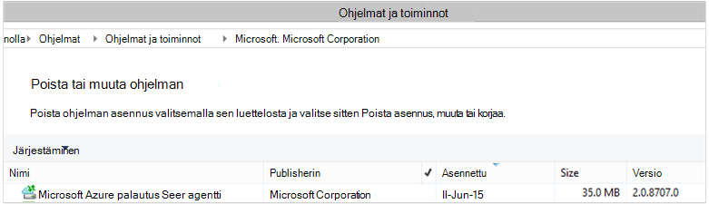

<properties
    pageTitle="Azure varmuuskopiointi - käyttöönotto ja hallinta takaisin sinua käyttäjäksi DPM PowerShellin avulla | Microsoft Azure"
    description="Lue, miten voit ottaa käyttöön ja hallita Azure varmuuskopiointi for Data Protection Manager (DPM) PowerShellin avulla"
    services="backup"
    documentationCenter=""
    authors="NKolli1"
    manager="shreeshd"
    editor=""/>

<tags
    ms.service="backup"
    ms.workload="storage-backup-recovery"
    ms.tgt_pltfrm="na"
    ms.devlang="na"
    ms.topic="article"
    ms.date="09/01/2016"
    ms.author="jimpark; anuragm;trinadhk;markgal"/>


# <a name="deploy-and-manage-backup-to-azure-for-data-protection-manager-dpm-servers-using-powershell"></a>Käyttöönotto ja hallinta tietojen suojauksen Manager (DPM)-palvelinten PowerShellin Azure varmuuskopiointi

> [AZURE.SELECTOR]
- [ARM](backup-dpm-automation.md)
- [Perinteinen](backup-dpm-automation-classic.md)

Tässä artikkelissa kerrotaan, miten PowerShellin käyttäminen DPM palvelimessa Azure varmuuskopioinnin määrittäminen ja hallinta varmuuskopiointi ja palauttaminen.

## <a name="setting-up-the-powershell-environment"></a>PowerShell-ympäristön määrittäminen

[AZURE.INCLUDE [learn-about-deployment-models](../../includes/learn-about-deployment-models-include.md)]

Ennen kuin PowerShellin avulla voit hallita varmuuskopioiden hallinnan suojaus Azure, tarvitset oikean ympäristön powershellissä. PowerShell-istunnon alussa varmistaa, että suoritat seuraavan komennon oikealle moduulit ja voit viitata oikein DPM cmdlet-komennot:

```
PS C:> & "C:\Program Files\Microsoft System Center 2012 R2\DPM\DPM\bin\DpmCliInitScript.ps1"

Welcome to the DPM Management Shell!

Full list of cmdlets: Get-Command
Only DPM cmdlets: Get-DPMCommand
Get general help: help
Get help for a cmdlet: help <cmdlet-name> or <cmdlet-name> -?
Get definition of a cmdlet: Get-Command <cmdlet-name> -Syntax
Sample DPM scripts: Get-DPMSampleScript
```

## <a name="setup-and-registration"></a>Asennus- ja rekisteröintitietojen
Aloittaminen:

1. [Lataa uusimmat PowerShell](https://github.com/Azure/azure-powershell/releases) (edellyttää vähintään versio: 1.0.0)
2. Ota käyttöön Azure varmuuskopiointi komentosovelmat vaihtamalla *AzureResourceManager* tilaan **Valitsin AzureMode** komentosovelmalla avulla:

```
PS C:\> Switch-AzureMode AzureResourceManager
```

PowerShellin avulla voidaan automatisoida asennus- ja rekisteröintitietojen seuraavat toimet:

- Luo palautus palvelut-säilö
- Azure Backup agent asentaminen
- Azure varmuuskopiointi-palvelussa rekisteröiminen
- Verkkoasetukset
- Salausasetukset

## <a name="create-a-recovery-services-vault"></a>Luo palautus palvelut-säilö

Seuraavat vaiheet johtaa luomista palautus palvelut-säilö. Palautus palvelut-säilö on erilainen kuin varmuuskopiointi-säilö.

1. Jos käytät Azure varmuuskopiointi ensimmäistä kertaa, sinun on käytettävä **Rekisteröi AzureRMResourceProvider** cmdlet-komento rekisteröidä Azure palautus-palveluntarjoajan tilaus.

    ```
    PS C:\> Register-AzureRmResourceProvider -ProviderNamespace "Microsoft.RecoveryServices"
    ```

2. Palautus Services säilö ei ARM-resurssi, joten voit sijoittaa sen resurssin ryhmän. Voit käyttää aiemmin luotuja resurssiryhmä tai luoda uuden. Kun luot uusi resurssiryhmä, määrittää nimen ja sijainnin resurssiryhmän.  

    ```
    PS C:\> New-AzureRmResourceGroup –Name "test-rg" –Location "West US"
    ```

3. **Uusi AzureRmRecoveryServicesVault** cmdlet-komennon avulla voit luoda uuden säilö. Muista samaan sijaintiin säilö, Määritä käytettiin resurssiryhmän.

    ```
    PS C:\> New-AzureRmRecoveryServicesVault -Name "testvault" -ResourceGroupName " test-rg" -Location "West US"
    ```

4. Määritä tallennustila-arvojen käyttäminen; Voit käyttää [Paikallisesti (LRS tarpeettomat tallennustilan)](../storage/storage-redundancy.md#locally-redundant-storage) tai [Geo tarpeettomat Storage (GRS)](../storage/storage-redundancy.md#geo-redundant-storage). Seuraavassa esimerkissä testVault - BackupStorageRedundancy asetus on määritetty GeoRedundant.

    > [AZURE.TIP] Monta Azure varmuuskopiointi cmdlet-komennot edellyttävät palautus Services säilö objektin syötteeksi. Tästä syystä on helppo Tallenna varmuuskopio palautus Services säilö objektin muuttujaan.

    ```
    PS C:\> $vault1 = Get-AzureRmRecoveryServicesVault –Name "testVault"
    PS C:\> Set-AzureRmRecoveryServicesBackupProperties  -vault $vault1 -BackupStorageRedundancy GeoRedundant
    ```


## <a name="view-the-vaults-in-a-subscription"></a>Tilauksen vaults tarkasteleminen
**Hae AzureRmRecoveryServicesVault** avulla voit tarkastella kaikkia vaults luettelo voimassa oleva tilaus. Voit käyttää tätä komentoa, voit tarkistaa, että uusi säilö on luotu tai nähdäksesi, mitkä vaults ovat käytettävissä tilaus.

Suorita Get-AzureRmRecoveryServicesVault-komento ja valitse tilauksen kaikki vaults näkyvät.

```
PS C:\> Get-AzureRmRecoveryServicesVault
Name              : Contoso-vault
ID                : /subscriptions/1234
Type              : Microsoft.RecoveryServices/vaults
Location          : WestUS
ResourceGroupName : Contoso-docs-rg
SubscriptionId    : 1234-567f-8910-abc
Properties        : Microsoft.Azure.Commands.RecoveryServices.ARSVaultProperties
```


## <a name="installing-the-azure-backup-agent-on-a-dpm-server"></a>Asentaminen Azure Backup agent DPM palvelimessa
Ennen kuin asennat Azure Backup agent, joudut ei ole ladattu ja esitä installer Windows-palvelimessa. Saat uusimman version asennuksen [Microsoft Download Centeristä](http://aka.ms/azurebackup_agent) tai palautus Services säilö raporttinäkymäsivu. Tallenna asennusohjelma helposti käytettävissä sijainnissa, kuten * C:\Downloads\*.

Asenna agentti suorittamalla seuraavan komennon laajennettuja PowerShell console **DPM-palvelimeen**:

```
PS C:\> MARSAgentInstaller.exe /q
```

Agentti mukana kaikkia oletusasetuksia. Asennus kestää muutaman minuutin kuluttua taustalla. Jos et määritä */nu* -vaihtoehto **Windows Update** -ikkuna avautuu tarkistavan päivitykset asennuksen lopussa.

Valitse asennettujen ohjelmien luettelosta näkyy agentti. Jos haluat nähdä asennettujen ohjelmien luettelosta, siirry **Ohjauspaneeliin** > **ohjelmien** > **Ohjelmat ja toiminnot**.



### <a name="installation-options"></a>Asennuksen asetukset
Jos haluat nähdä kaikki kautta komentorivillä asetukset, käytä seuraavaa komentoa:

```
PS C:\> MARSAgentInstaller.exe /?
```

Käytettävissä olevat vaihtoehdot ovat:

| Vaihtoehto | Tiedot | Oletusarvo |
| ---- | ----- | ----- |
| / q | Hiljainen asennus | - |
| / p: "sijainti" | Azure Backup agent asennuskansion polku. | C:\Program Files\Microsoft Azure palautus Services agentti |
| / s: "sijainti" | Azure Backup agent välimuistikansion polku. | C:\Program Files\Microsoft Azure palautus Services Agent\Scratch |
| /m | Sisältyy Microsoft Update-sivustoon | - |
| /Nu | Älä tarkista päivitykset, kun asennus on valmis | - |
| / d | Poistaa Microsoft Azure palautus palvelut-agentti | - |
| /pH | Välityspalvelimen isännän osoite | - |
| /Po | Välityspalvelimen Host porttinumero | - |
| /Pu | Välityspalvelimen Host käyttäjänimi | - |
| /pw | Välityspalvelimen salasana | - |

## <a name="registering-dpm-to-a-recovery-services-vault"></a>Voit palautuksen rekisteröinyt DPM Services säilöön

Kun olet luonut palautus Services säilö, lataa uusin agentti ja säilöön tunnistetiedot ja tallenna se paikassa, kuten C:\Downloads.

```
PS C:\> $credspath = "C:\downloads"
PS C:\> $credsfilename = Get-AzureRmRecoveryServicesVaultSettingsFile -Backup -Vault $vault1 -Path  $credspath
PS C:\> $credsfilename
C:\downloads\testvault\_Sun Apr 10 2016.VaultCredentials
```

DPM palvelimessa tietokoneen rekisteröitymään säilö [Käynnistä OBRegistration](https://technet.microsoft.com/library/hh770398%28v=wps.630%29.aspx) cmdlet-komennon suorittaminen

```
PS C:\> $cred = $credspath + $credsfilename
PS C:\> Start-OBRegistration-VaultCredentials $cred -Confirm:$false
CertThumbprint      :7a2ef2caa2e74b6ed1222a5e89288ddad438df2
SubscriptionID      : ef4ab577-c2c0-43e4-af80-af49f485f3d1
ServiceResourceName: testvault
Region              :West US
Machine registration succeeded.
```

### <a name="initial-configuration-settings"></a>Alkuperäinen asetukset
Kun palautus Services säilö yhteydessä rekisteröity DPM-palvelimeen, se alkaa tilauksen oletusasetukset. Tilauksen nämä asetukset ovat verkko, salaus ja väliaikainen alue. Voit muuttaa Tilausasetukset, sinun on ensin opit hoitamaan aiemmin [Get-DPMCloudSubscriptionSetting](https://technet.microsoft.com/library/jj612793) cmdlet-komennolla (oletus)-asetuksia seuraavasti:

```
$setting = Get-DPMCloudSubscriptionSetting -DPMServerName "TestingServer"
```

Kaikki muutokset tehdään tämän paikallisen PowerShell-objektin ```$setting``` ja sitten objektin koko on sitoutunut DPM ja Azure varmuuskopion, tallenna ne [Määrittäminen DPMCloudSubscriptionSetting](https://technet.microsoft.com/library/jj612791) cmdlet-komennolla. Sinun on käytettävä ```–Commit``` merkinnän varmistaa, että muutokset säilyvät. Asetuksia ei ole käytetty ja käyttämä Azure varmuuskopiointi, ellei vahvistettu.

```
PS C:\> Set-DPMCloudSubscriptionSetting -DPMServerName "TestingServer" -SubscriptionSetting $setting -Commit
```

## <a name="networking"></a>Verkko
Jos DPM koneen Azure varmuuskopiointi-palveluun internet-yhteys on välityspalvelimen kautta, onnistuneen varmuuskopioiden hakeminen esitettävä välityspalvelimen asetukset. Tämä on valmis käyttämällä ```-ProxyServer```ja ```-ProxyPort```, ```-ProxyUsername``` ja ```ProxyPassword``` parametrien [Määrittäminen DPMCloudSubscriptionSetting](https://technet.microsoft.com/library/jj612791) cmdlet-komento. Tässä esimerkissä ei ole välityspalvelimen niin, että erikseen poistamalla välityspalvelimeen liittyviä tietoja.

```
PS C:\> Set-DPMCloudSubscriptionSetting -DPMServerName "TestingServer" -SubscriptionSetting $setting -NoProxy
```

Kaistanleveyden käytön voidaan ohjata myös asetukset ```-WorkHourBandwidth``` ja ```-NonWorkHourBandwidth``` viikonpäivien annetun joukolle. Tässä esimerkissä on määrittämässä ei, kaikki rajoitusta.

```
PS C:\> Set-DPMCloudSubscriptionSetting -DPMServerName "TestingServer" -SubscriptionSetting $setting -NoThrottle
```

## <a name="configuring-the-staging-area"></a>Väliaikaisen alueen määrittäminen
Azure Backup-agentti DPM palvelimessa on väliaikaisten tietojen palauttaminen pilvestä (väliaikainen-alue). Määritä väliaikaisen alueen [Määrittäminen DPMCloudSubscriptionSetting](https://technet.microsoft.com/library/jj612791) cmdlet-komennolla ja ```-StagingAreaPath``` parametria.

```
PS C:\> Set-DPMCloudSubscriptionSetting -DPMServerName "TestingServer" -SubscriptionSetting $setting -StagingAreaPath "C:\StagingArea"
```

Yllä olevassa esimerkissä väliaikaisen alueen asetetaan *C:\StagingArea* PowerShell-objektin ```$setting```. Varmista, että määrittämäsi kansio on jo olemassa, tai muuten tilausasetusten lopullinen vahvistus epäonnistuu.


### <a name="encryption-settings"></a>Salausasetukset
Azure varmuuskopion lähetetään palautettavat tiedot salataan luottamuksellisuuden tiedot. Salauksen salasana on "salasana" purkaa tietojen palauttaminen aikaan. On tärkeää säilyttää nämä tiedot turvallinen, kun se on määritetty.

Seuraavassa esimerkissä ensimmäisen komennon muuntaa merkkijonon ```passphrase123456789``` suojatun merkkijonon ja määrittää suojatun merkkijono, muuttujan nimi ```$Passphrase```. toinen komento määrittää suojatun merkkijonon ```$Passphrase``` kuin salasana salataan varmuuskopiot.

```
PS C:\> $Passphrase = ConvertTo-SecureString -string "passphrase123456789" -AsPlainText -Force

PS C:\> Set-DPMCloudSubscriptionSetting -DPMServerName "TestingServer" -SubscriptionSetting $setting -EncryptionPassphrase $Passphrase
```

> [AZURE.IMPORTANT] Säilytä salasana tiedot turvallinen, kun se on määritetty. Sinulla voi palauttaa tietoja Azure ilman tämän salasana.

Tässä vaiheessa olisi tekemäsi kaikki tarvittavat muutokset ```$setting``` objekti. Vahvista muutokset muista.

```
PS C:\> Set-DPMCloudSubscriptionSetting -DPMServerName "TestingServer" -SubscriptionSetting $setting -Commit
```

## <a name="protect-data-to-azure-backup"></a>Tietojen Azure varmuuskopiointi
Tässä osassa lisätä tuotannon palvelimen DPM ja suojaa paikalliseen DPM tallennussijaintiin ja Azure varmuuskopiointi tiedot. Olevassa esimerkissä on esitetty, miten voit varmuuskopioida tiedostot ja kansiot. Logiikan helposti laajennettavissa varmuuskopiointiin DPM tuettu tietolähde. Kaikki DPM varmuuskopiot löytyvät mukaan suojauksen ryhmän (PG) kanssa neljä osaa:

1. **Ryhmän jäsenten** on luettelo kaikkien suojattavissa objektien (tunnetaan myös nimellä *tietolähteet* -DPM), jonka haluat suojata saman suojaus-ryhmä. Jos esimerkiksi haluat suojaa tuotannon VMs yhden suojaus-ryhmä ja SQL Server-tietokannat toiseen suojaus-ryhmä, kuten ne voi olla erilaiset varmuuskopion vaatimukset. Ennen kuin voit varmuuskopioida kaikki tietolähteen haluat Varmista, että tuotannon palvelimessa DPM-agentti on asennettu palvelimeen ja hallitsee DPM. Noudata [DPM-agentti](https://technet.microsoft.com/library/bb870935.aspx) ja linkittäminen haluamasi DPM-palvelin.
2. **Tietoja suojaustapa** määrittää kohteen varmuuskopioinnin sijainnit - nauha, levyn ja pilvi. Tässä esimerkissä suojataan tietojen paikalliseen levyasemaan ja pilveen.
3. **Aikataulun** , joka määrittää, milloin varmuuskopioiden on otettava ja kuinka usein tiedot synkronoidaan DPM palvelimen ja tuotannon.
4. **Säilytys aikataulun** , joka määrittää, kuinka kauan säilyttää Azure palautus pisteitä.

### <a name="creating-a-protection-group"></a>Suojaus-ryhmän luominen
Aloita luomalla [Uusi DPMProtectionGroup](https://technet.microsoft.com/library/hh881722) cmdlet-komennolla uusia suojaus-ryhmä.

```
PS C:\> $PG = New-DPMProtectionGroup -DPMServerName " TestingServer " -Name "ProtectGroup01"
```

Yllä cmdlet-komento luo nimetty *ProtectGroup01*suojaus-ryhmä. Olemassa olevan suojaus-ryhmä voi muokata myös myöhemmin varmuuskopiointi lisääminen Azure pilveen. Tee muutokset suojaus-ryhmä - uuteen tai aiemmin luotuun - tarvitsemme kuitenkin avulla opit hoitamaan *muokattavissa* aluetta [Get-DPMModifiableProtectionGroup](https://technet.microsoft.com/library/hh881713) cmdlet-komennolla.

```
PS C:\> $MPG = Get-ModifiableProtectionGroup $PG
```

### <a name="adding-group-members-to-the-protection-group"></a>Ryhmän jäsenten lisääminen suojaus-ryhmä
Kunkin DPM agentti tietää palvelimeen, se on asennettu tietolähteiden luettelo. Voit lisätä tietolähde suojaus-ryhmä, DPM-agentti on lähettää ensin DPM palvelimeen tietolähteiden luettelo. Yhden tai useamman tietolähteet ovat sitten valittuna ja lisätään suojaus-ryhmä. Tätä PowerShell vaiheet ovat seuraavat:

1. Hae palvelimilta hallitsee DPM DPM-agentti – luettelo.
2. Valitse tiettyyn palvelimeen.
3. Hae kaikki tietolähteet luettelo palvelimessa.
4. Valitse vähintään yksi tietolähteet ja lisätä ne suojaus-ryhmä

[Get-DPMProductionServer](https://technet.microsoft.com/library/hh881600) cmdlet-komento on hankittu palvelinten joina DPM-agentti on asennettu ja hallitsee DPM palvelimen luettelon. Tässä esimerkissä on suodattaminen ja määritä vain PS varmuuskopion nimi *productionserver01* .

```
PS C:\> $server = Get-ProductionServer -DPMServerName "TestingServer" | where {($_.servername) –contains “productionserver01”
```

Hae nyt tietolähteiden luettelo ```$server``` [Get-DPMDatasource](https://technet.microsoft.com/library/hh881605) cmdlet-komennolla. Tässä esimerkissä on ovat suodatuksen äänenvoimakkuuden *D:\* , jotka haluamme varmuuskopiointi määrittämiseksi. Tämä tietolähde lisätään sitten Suojaus-ryhmä, [Lisää DPMChildDatasource](https://technet.microsoft.com/library/hh881732) cmdlet-komennolla. Muista käyttää *muokattavissa * suojaus ryhmän objektin ```$MPG``` tehdä lisäykset.

```
PS C:\> $DS = Get-Datasource -ProductionServer $server -Inquire | where { $_.Name -contains “D:\” }

PS C:\> Add-DPMChildDatasource -ProtectionGroup $MPG -ChildDatasource $DS
```

Toista tämä vaihe niin monta kertaa tarvittaessa, kunnes olet lisännyt kaikki valitun tietolähteet suojaus-ryhmä. Voit myös yhden tietolähteen aloittaminen ja työnkulku luomisen suojaus-ryhmä ja myöhemmin lisätä useita tietolähteitä suojaus-ryhmä.

### <a name="selecting-the-data-protection-method"></a>Tietojen suojauksen menetelmän valitseminen
Kun tietolähteet on lisätty suojaus-ryhmä, seuraava vaihe on suojauksen laskentatavan [Määrittäminen DPMProtectionType](https://technet.microsoft.com/library/hh881725) cmdlet-komennolla. Tässä esimerkissä suojaus-ryhmä on asetukset paikalliseen levyasemaan ja cloud varmuuskopion. Voit myös määritettävä tietolähde, jonka haluat suojata käyttäminen [Lisää DPMChildDatasource](https://technet.microsoft.com/library/hh881732.aspx) -cmdlet - online-tilaan Merkitse pilveen.

```
PS C:\> Set-DPMProtectionType -ProtectionGroup $MPG -ShortTerm Disk –LongTerm Online
PS C:\> Add-DPMChildDatasource -ProtectionGroup $MPG -ChildDatasource $DS –Online
```

### <a name="setting-the-retention-range"></a>Säilytys-alueen määrittämistä
Määritä säilytys varmuuskopion kohdeosoite [Määrittäminen DPMPolicyObjective](https://technet.microsoft.com/library/hh881762) cmdlet-komennolla. Vaikka se näyttää pariton määritettävä säilyttäminen, ennen kuin varmuuskopioinnin aikataulu on määritetty, käyttämällä ```Set-DPMPolicyObjective``` cmdlet-komento asettaa automaattisesti oletusarvon varmuuskopioinnin aikataulun, joka voi muokata. Ei aina varmuuskopioinnin ajoittaminen ensin ja säilytyskäytäntö jälkeen.

Seuraavassa esimerkissä cmdlet määrittää säilytys parametrit levyn varmuuskopiot. Tämä säilyttää varmuuskopiot 10 päivää ja synkronoi tiedot tuotannon palvelimen ja DPM 6 tuntia. ```SynchronizationFrequencyMinutes``` Ei määritä, kuinka usein varmuuskopioinnin kohtaa luodaan, mutta kuinka usein tiedot kopioidaan DPM palvelimeen.  Tämän asetuksen voit estää varmuuskopioiden tulossa liian suuri.

```
PS C:\> Set-DPMPolicyObjective –ProtectionGroup $MPG -RetentionRangeInDays 10 -SynchronizationFrequencyMinutes 360
```

Azure siirtymällä varmuuskopioiden hakeminen (DPM viittaa ne kuin Online varmuuskopiot) [pitkällä aikavälillä säilytys NO@LOC isä-poika-malli (GFS) avulla](backup-azure-backup-cloud-as-tape.md)voidaan määrittää säilytys-alueita. Toisin sanoen voit määrittää yhdistetyn säilytyskäytännön päivittäin, viikoittain, kuukausittain ja vuosittain säilytyskäytäntöjä. Tässä esimerkissä on edustava monimutkaisia säilytys-malli, jota haluamme matriisin luominen ja määrittäminen säilytys alueen [Määrittäminen DPMPolicyObjective](https://technet.microsoft.com/library/hh881762) cmdlet-komennolla.

```
PS C:\> $RRlist = @()
PS C:\> $RRList += (New-Object -TypeName Microsoft.Internal.EnterpriseStorage.Dls.UI.ObjectModel.OMCommon.RetentionRange -ArgumentList 180, Days)
PS C:\> $RRList += (New-Object -TypeName Microsoft.Internal.EnterpriseStorage.Dls.UI.ObjectModel.OMCommon.RetentionRange -ArgumentList 104, Weeks)
PS C:\> $RRList += (New-Object -TypeName Microsoft.Internal.EnterpriseStorage.Dls.UI.ObjectModel.OMCommon.RetentionRange -ArgumentList 60, Month)
PS C:\> $RRList += (New-Object -TypeName Microsoft.Internal.EnterpriseStorage.Dls.UI.ObjectModel.OMCommon.RetentionRange -ArgumentList 10, Years)
PS C:\> Set-DPMPolicyObjective –ProtectionGroup $MPG -OnlineRetentionRangeList $RRlist
```

### <a name="set-the-backup-schedule"></a>Määritä varmuuskopion ajoitus
DPM määrittää oletusarvon mukaisen varmuuskopioinnin aikataulun automaattisesti Jos määrität suojaus objektiivisten avulla ```Set-DPMPolicyObjective``` cmdlet-komento. Voit muuttaa oletusarvon aikataulujen avulla [Määrittäminen DPMPolicySchedule](https://technet.microsoft.com/library/hh881723) cmdlet-komennon perään [Get-DPMPolicySchedule](https://technet.microsoft.com/library/hh881749) cmdlet-komento.

```
PS C:\> $onlineSch = Get-DPMPolicySchedule -ProtectionGroup $mpg -LongTerm Online
PS C:\> Set-DPMPolicySchedule -ProtectionGroup $MPG -Schedule $onlineSch[0] -TimesOfDay 02:00
PS C:\> Set-DPMPolicySchedule -ProtectionGroup $MPG -Schedule $onlineSch[1] -TimesOfDay 02:00 -DaysOfWeek Sa,Su –Interval 1
PS C:\> Set-DPMPolicySchedule -ProtectionGroup $MPG -Schedule $onlineSch[2] -TimesOfDay 02:00 -RelativeIntervals First,Third –DaysOfWeek Sa
PS C:\> Set-DPMPolicySchedule -ProtectionGroup $MPG -Schedule $onlineSch[3] -TimesOfDay 02:00 -DaysOfMonth 2,5,8,9 -Months Jan,Jul
PS C:\> Set-DPMProtectionGroup -ProtectionGroup $MPG
```

Edellä olevassa esimerkissä ```$onlineSch``` on matriisikaava neljä elementtien kanssa, joka sisältää GFS värimallin suojaus-ryhmä aikataulua online protection:

1. ```$onlineSch[0]```sisältää päivän tapahtumista
2. ```$onlineSch[1]```sisältää Viikkoaikataulu
3. ```$onlineSch[2]```sisältää kuukauden aikataulu
4. ```$onlineSch[3]```sisältää vuosittain aikataulun

Jos haluat muokata viikoittain, sinun tarvitse viitata ```$onlineSch[1]```.

### <a name="initial-backup"></a>Alkuperäinen varmuuskopiointi
Kun tietolähde ensimmäistä kertaa, DPM tarpeiden varmuuskopioinnista Luo ensimmäisen replikan, joka luo kopio tietolähteen suojattava DPM replikan asemassa. Tämä toiminto voidaan ajoittaa joko tietyn ajan tai voidaan käynnistää manuaalisesti, [Määritä DPMReplicaCreationMethod](https://technet.microsoft.com/library/hh881715) cmdlet-komennon käyttäminen parametrin ```-NOW```.

```
PS C:\> Set-DPMReplicaCreationMethod -ProtectionGroup $MPG -NOW
```
### <a name="changing-the-size-of-dpm-replica--recovery-point-volume"></a>DPM replikan & palautus pisteen äänenvoimakkuus koon muuttaminen
Voit myös muuttaa kokoa ja DPM replikan aseman tilannevedoksen aseman [Määrittäminen DPMDatasourceDiskAllocation](https://technet.microsoft.com/library/hh881618.aspx) cmdlet-komento, kuten seuraavassa esimerkissä: Get-DatasourceDiskAllocation - tietolähteen $DS Set-DatasourceDiskAllocation - tietolähteen $DS - ProtectionGroup $MPG-manuaalinen - ReplicaArea (2 gt) - ShadowCopyArea (2 gt)

### <a name="committing-the-changes-to-the-protection-group"></a>Muutosten tekemistä suojaus-ryhmä
Lopuksi muutokset on, ennen kuin DPM tehdä varmuuskopion kohti uudet määritykset suojaus-ryhmä. Tämä onnistuu [Määrittäminen DPMProtectionGroup](https://technet.microsoft.com/library/hh881758) cmdlet-komennolla.

```
PS C:\> Set-DPMProtectionGroup -ProtectionGroup $MPG
```
## <a name="view-the-backup-points"></a>Tarkastele varmuuskopion pisteet
[Get-DPMRecoveryPoint](https://technet.microsoft.com/library/hh881746) cmdlet-komennon avulla voit hankkia palautus pisteiden luettelo tietolähde. Tässä esimerkissä on on:
- Hae kaikki PGs DPM palvelimessa ja käänteismatriisin```$PG```
- Hae vastaavat tietolähteet```$PG[0]```
- Saat kaikki palautus pistettä tietolähde.

```
PS C:\> $PG = Get-DPMProtectionGroup –DPMServerName "TestingServer"
PS C:\> $DS = Get-DPMDatasource -ProtectionGroup $PG[0]
PS C:\> $RecoveryPoints = Get-DPMRecoverypoint -Datasource $DS[0] -Online
```

## <a name="restore-data-protected-on-azure"></a>Palauttaa Azure-suojatut tiedot
Tietojen palauttaminen on yhdistelmä ```RecoverableItem``` objekti ja ```RecoveryOption``` objekti. Edellisessä osassa on käytössä varmuuskopion asioista luettelon tietolähde varten.

Seuraavassa esimerkissä on näytetään, miten palauttaa Hyper-V virtual koneen Azure varmuuskopion yhdistämällä varmuuskopion pisteiden kohde palauttamista varten. Tässä esimerkissä sisältää:

- Luodaan [Uusi DPMRecoveryOption](https://technet.microsoft.com/library/hh881592) cmdlet-komennolla palautusasetus.
- Haetaan matriisin käyttämällä varmuuskopion asioista ```Get-DPMRecoveryPoint``` cmdlet-komento.
- Valitseminen palauttaminen varmuuskopiosta kohtaa.

```
PS C:\> $RecoveryOption = New-DPMRecoveryOption -HyperVDatasource -TargetServer "HVDCenter02" -RecoveryLocation AlternateHyperVServer -RecoveryType Recover -TargetLocation “C:\VMRecovery”

PS C:\> $PG = Get-DPMProtectionGroup –DPMServerName "TestingServer"
PS C:\> $DS = Get-DPMDatasource -ProtectionGroup $PG[0]
PS C:\> $RecoveryPoints = Get-DPMRecoverypoint -Datasource $DS[0] -Online

PS C:\> Restore-DPMRecoverableItem -RecoverableItem $RecoveryPoints[0] -RecoveryOption $RecoveryOption
```

Komentoja voi laajentaa helposti tietolähde kaikille.

## <a name="next-steps"></a>Seuraavat vaiheet

- Lisätietoja DPM Azure varmuuskopiointi artikkelissa [Johdatus DPM varmuuskopiointi](backup-azure-dpm-introduction.md)
