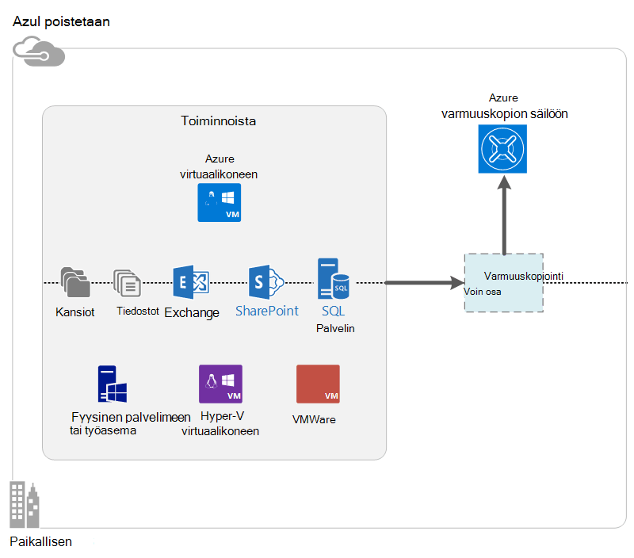

<properties
    pageTitle="Azure varmuuskopioinnin-ominaisuudet | Microsoft Azure"
    description="Azure varmuuskopiointi ja palauttaminen-palvelujen avulla voit varmuuskopioida ja palauttaa tietoja ja sovelluksia Windows asiakaskoneiden, System Center DPM palvelimia ja Azure-virtuaalikoneissa Windows-palvelimiin."
    services="backup"
    documentationCenter=""
    authors="markgalioto"
    manager="cfreeman"
    editor="tysonn"
    keywords="Varmuuskopiointi ja palauttaminen; palautus-palveluja. varmuuskopion ratkaisut"/>

<tags
    ms.service="backup"
    ms.workload="storage-backup-recovery"
    ms.tgt_pltfrm="na"
    ms.devlang="na"
    ms.topic="get-started-article"
    ms.date="10/19/2016"
    ms.author="jimpark; trinadhk"/>

# Azure varmuuskopioinnin-ominaisuudet
Azure varmuuskopio on palvelu, jota käytät varmuuskopioiminen ja palauttaminen tietojen Microsoft-pilvipalvelussa. Se korvaa aiemmin paikalliseen tai sähköntuotannosta varmuuskopion ratkaisun pilvipohjainen ratkaisu, joka on luotettava, suojattu ja kustannukset kilpailukyvyn. Se myös auttaa suojaamaan kalusteet, joiden suorittaminen pilveen. Azure varmuuskopiointi tarjoaa palautus rakennettu tehokas infrastruktuurin, joka on skaalattava, kestävät ja käytettävissä.

[Katso video yleiskatsaus Azure varmuuskopiointi](https://azure.microsoft.com/documentation/videos/what-is-azure-backup/)

## Azure varmuuskopiointi käyttötarkoitus
Perinteinen varmuuskopion ratkaisuja on kehittynyt Käsittele pilveen päätepisteen levyjen tai nauha kaltainen. Kun tämä vaihtoehto on yksinkertainen, on myös rajoitettu. Se ei ole hyödyntää pohjana cloud-ympäristössä ja kääntää tehotonta ja kallista-ratkaisuun.
Sen sijaan Azure varmuuskopion toimittaa tehokas ja edullinen cloud varmuuskopion ratkaista etuja. Seuraavassa on joitakin keskeisiä toimintoja, joka sisältää Azure varmuuskopion.

| Toiminto | Etu |
| ------- | ------- |
| Automaattinen tallennusvälineiden hallinta | Ei ole pääoman menot ei tarvita paikallisen tallennuslaitteet. Azure varmuuskopiointi automaattisesti varaa ja hallitsee varmuuskopion tallennustilan, ja maksu-muodossa-voit-käyttö kulutus mallia käytetään. |
| Rajoittamaton skaalaus | Voit hyödyntää suuren käytettävyyden oikeudet ilman yhteen ylläpitoa ja seurantaa. Azure varmuuskopiointi käyttää pohjana power ja Azure cloud asteikon nonintrusive automaattisen skaalauksen poistaminen sen ominaisuuksia. |
| Useita tallennusasetukset | Valitse Varmuuskopioi tallennustilan tarpeen mukaan:<li>Paikallisesti ylimääräinen estä Blob-objektien sopii hinta tietoisia asiakkaat ja edelleen auttaa suojaamaan tiedot mallin paikallisen laitteen virheet. <li>Geo replikoinnin tallennustilan estä Blob-objektien on kolme pisteparin joten useita kopioita. Näiden ylimääräisten kopioiden auttaa varmistamaan, varmuuskopioi tiedot ovat käytettävissä vaikka Azure sivustotason-tietojen tapahtuu. |
| Rajoittamaton tiedonsiirto | Varmuuskopiointi-säilöstä palautustyön on maksutonta minkä tahansa juniin (lähtevät) tietojen siirto. Tietoja saapuva Azure on myös ilmaista. Toimii tuonti-palvelu, johon se on käytettävissä. |
| Tietojen salaus | Salauksen mahdollistaa tiedonsiirto ja tallennustilan asiakastietoja julkisen pilveen. Salauksen salasana on tallennettu aikaisessa vaiheessa, ja se on aina lähetettyjen tai tallennettu Azureen. Salausavaimen tarvitaan palauttamaan tietoja ja vain asiakas on täydet oikeudet tiedot-palvelussa. |  
| Sovelluksen yhdenmukaisia varmuuskopiointi | Sovelluksen yhdenmukaisia varmuuskopioiden Windows auttaa varmistamaan, että korjaukset ei tarvita palauttaminen, mikä vähentää palautus aika tavoitteen aikaa. Näin asiakkaat palaa käynnissä nopeammin. |
| Pitkään säilytys | Sen sijaan sähköntuotannosta nauha varmuuskopion ratkaisuja, asiakkaat voivat takaisin ylös Azure, joka sisältää näyttävien nauha kaltaisessa-ratkaisun pienen kustannus-palvelussa maksaa. |

## Azure varmuuskopio-osat
Koska varmuuskopio on hybrid varmuuskopion ratkaisun, se koostuu useita osia, jotka toimivat yhdessä käyttöön lopusta loppuun varmuuskopiointi ja palauttaminen työnkulkuja.

### Käyttöönottoskenaariot

| Osa | Voidaan ottaa käyttöön Azure? | Käyttöön paikallisen voi olla? | Tuetut kohde-tallennustilan|
| --- | --- | --- | --- |
| Azure Backup-agentti | 
**Kyllä**
 
Azure Backup agent voit ottaa käyttöön Windows Server-AM, joka suoritetaan Azure-tietokannassa.
 | 
**Kyllä**
 
Varmuuskopiointi-agentti voidaan ottaa käyttöön Windows Server AM tai fyysinen tietokoneeseen.
 | 
Azure varmuuskopiointi-säilö
 |
| System Center Data Protection Manager (DPM) | 
**Kyllä**

Lisätietoja [suojaaminen Azure käyttämällä System Center DPM toiminnoista](http://blogs.technet.com/b/dpm/archive/2014/09/02/azure-iaas-workload-protection-using-data-protection-manager.aspx).
 | 
**Kyllä**
 
Lisätietoja [toiminnoista ja että palvelinkeskuksen VMs suojaaminen](https://technet.microsoft.com/library/hh758173.aspx).
 | 
Paikallisesti liitetty levy
 
Azure varmuuskopiointi säilöön
 
Nauha (paikallisen vain)
 |
| Azure varmuuskopion Server | 
**Kyllä**

Lisätietoja [suojaaminen työmääriä Azure-tietokannassa Azure varmuuskopiointi Serverin avulla](backup-azure-microsoft-azure-backup.md).
 | 
**Kyllä**
 
Lisätietoja [suojaaminen työmääriä Azure-tietokannassa Azure varmuuskopiointi Serverin avulla](backup-azure-microsoft-azure-backup.md).
 | 
Paikallisesti liitetty levy
 
Azure varmuuskopiointi-säilö
 |
| Azure varmuuskopiointi (AM-tunniste) | 
**Kyllä**

Azure kangasta osa

Erilaisia [varmuuskopio nimellä service (IaaS) näennäiskoneiden Azure-infrastruktuuria](backup-azure-vms-introduction.md)varten.
 | 
**Ei**
 
System Center DPM avulla voit varmuuskopioida näennäiskoneiden oman joten.
 | 
Azure varmuuskopiointi-säilö
 |

### Osan tason edut ja rajoitukset

| Osa | Edut | Rajoitukset | Palautus rakeisuuden |
| --- | --- | --- | --- |
| Azure varmuuskopiointi (MARS)-agentti | <li>Voit varmuuskopioida tiedostot ja kansiot Windows-Käyttöjärjestelmää tietokoneessa, se voidaan fyysinen tai näennäinen (VMs voi olla mitä tahansa paikallisen tai Azure)<li>Erillinen varmuuskopion palvelinta ei ole pakollinen<li>Käyttää Azure varmuuskopion säilöön | <li>Kolme kertaa päivän varmuuskopiotiedosto/tason palauttaminen<li>Tiedoston tai kansion/äänenvoimakkuuden tason Palauta vain, sovellus ei ota huomioon<li>Ei tukea Linux | tiedostot ja kansiot ja asemat |
| System Center tietojen suojauksen hallinta | <li>Sovelluksen huomioon tilannevedoksia (VSS)<li>Koko joustavuutta tehdä varmuuskopiointi<li>Palautus rakeisuuden (kaikki)<li>Voit käyttää Azure varmuuskopiointi-säilö<li>Linux-tuki (Jos isännöidä Hyper-V) | <li>Puuttuminen erilaisten tuki (VMware AM takaisin-Oracle työmäärää varmuuskopiointi).  | tiedostot ja kansiot ja asemat / VMs/sovellukset |
| Microsoft Azure varmuuskopion Server | <li>Sovelluksen huomioon tilannevedoksia (VSS)<li>Koko joustavuutta tehdä varmuuskopiointi<li>Palautus rakeisuuden (kaikki)<li>Voit käyttää Azure varmuuskopiointi-säilö<li>Linux-tuki (Jos isännöidä Hyper-V)<li>System Center käyttöoikeuden ei tarvita | <li>Puuttuminen erilaisten tuki (VMware AM takaisin-Oracle työmäärää varmuuskopiointi).<li>Vaatii aina live Azure tilaus<li>Ei tukea nauha varmuuskopiointi | tiedostot ja kansiot ja asemat / VMs/sovellukset |
| Azure IaaS AM varmuuskopiointi | <li>Alkuperäisen varmuuskopioiden for Windows tai Linux<li>Pakollinen tietyn agentti ei ole asennettu<li>Kangasta varmuuskopiointia ei tarvita varmuuskopion infrastruktuuriin | <li>Kerran päivässä takaisin ylös tai levy tason palauttaminen<li>Ei voi varmuuskopioida paikallisen | VMs Kaikkien levyjen (PowerShellillä) |

## Mitkä sovellukset ja työmääriä voidaan varmuuskopioida?

| Kuormituksen | Lähde-tietokone | Azure varmuuskopiointi-ratkaisu |
| --- | --- |---|
| Tiedostot ja kansiot | Windows Server | 
[Azure Backup agentti](backup-configure-vault.md)
 
[System Center DPM](backup-azure-dpm-introduction.md) (+ Azure Backup agent)
 
[Azure varmuuskopion Server](backup-azure-microsoft-azure-backup.md) (mukaan lukien Azure Backup agent)
  |
| Tiedostot ja kansiot | Windows-asiakas | 
[Azure Backup agentti](backup-configure-vault.md)
 
[System Center DPM](backup-azure-dpm-introduction.md) (+ Azure Backup agent)
 
[Azure varmuuskopion Server](backup-azure-microsoft-azure-backup.md) (mukaan lukien Azure Backup agent)
  |
| Hyper-V virtuaalikoneen (Windows) | Windows Server | 
[System Center DPM](backup-azure-backup-sql.md) (+ Azure Backup agent)
 
[Azure varmuuskopion Server](backup-azure-microsoft-azure-backup.md) (mukaan lukien Azure Backup agent)
 |
| Hyper-V virtuaalikoneen (Linux) | Windows Server | 
[System Center DPM](backup-azure-backup-sql.md) (+ Azure Backup agent)
 
[Azure varmuuskopion Server](backup-azure-microsoft-azure-backup.md) (mukaan lukien Azure Backup agent)
  |
| Microsoft SQL Server | Windows Server | 
[System Center DPM](backup-azure-backup-sql.md) (+ Azure Backup agent)
 
[Azure varmuuskopion Server](backup-azure-microsoft-azure-backup.md) (mukaan lukien Azure Backup agent)
  |
| Microsoft SharePoint | Windows Server | 
[System Center DPM](backup-azure-backup-sql.md) (+ Azure Backup agent)
 
[Azure varmuuskopion Server](backup-azure-microsoft-azure-backup.md) (mukaan lukien Azure Backup agent)
   |
| Microsoft Exchange |  Windows Server | 
[System Center DPM](backup-azure-backup-sql.md) (+ Azure Backup agent)
 
[Azure varmuuskopion Server](backup-azure-microsoft-azure-backup.md) (mukaan lukien Azure Backup agent)
   |
| Azure IaaS VMs (Windows) | - | [Azure varmuuskopiointi (AM-tunniste)](backup-azure-vms-introduction.md) |
| Azure IaaS VMs (Linux) | - | [Azure varmuuskopiointi (AM-tunniste)](backup-azure-vms-introduction.md) |

## ARM- ja Linux-tuki

| Osa | ARM-tuki | Linux (Azure vahvistettava) tuki |
| --- | --- | --- |
| Azure varmuuskopiointi (MARS)-agentti | Kyllä | Ei (vain Windows-pohjaisesta agentti) |
| System Center tietojen suojauksen hallinta | Kyllä (agentti Vieras) | Vain Hyper-V (ei Azure AM) vain tiedoston-yhdenmukaisia varmuuskopio on mahdollista |
| Azure varmuuskopion Server (MAB) | Kyllä (agentti Vieras) | Vain Hyper-V (ei Azure AM) vain tiedoston-johdonmukaisia varmuuskopio on mahdollista (sama kuin DPM) |
| Azure IaaS AM varmuuskopiointi | Kyllä | Kyllä |

[AZURE.INCLUDE [learn-about-deployment-models](../../includes/learn-about-deployment-models-include.md)]

## Varmuuskopiointi ja palauttaminen Premium tallennustilan VMs

Azure varmuuskopiointi-palvelu suojaa nyt Premium tallennustilan VMs.

### Premium tallennustilan VMs varmuuskopiointi

Kun varmuuskopioiminen Premium tallennustilan VMs varmuuskopiointi-palvelun luo tilapäinen väliaikaisen sijainti Premium-tallennustilan tilin. Väliaikaisen sijainti-nimeltä "AzureBackup-", on yhdistetty AM premium-levyjä tietojen laskeminen yhteen kokoa.

>[AZURE.NOTE] Muokkaa tai Muokkaa väliaikaisen sijaintia.

Kun varmuuskopiointityön on valmis, väliaikaisen sijainti poistetaan. Väliaikaisen sijainnin tallennustilaa hinnan vastaa kaikkia [Premium tallennustilan hinnat](../storage/storage-premium-storage.md#pricing-and-billing).

### Palauttaa Premium tallennustilan VMs

Premium tallennustilan AM voi palauttaa joko Premium tallennustilan tai Normaali tallennustilan. Palauttaminen Premium tallennustilan AM palautus-kohdan Premium tallennustila on palauttaminen tyypillinen prosessi. Voi kuitenkin olla edullinen Palauta Premium tallennustilan AM palautus-kohdassa vakio tallennustilan. Tällaista palauttaminen voidaan, jos tarvitset alijoukkoa AM-tiedostoja.

## Toiminto
Näiden viiden taulukoissa on yhteenveto siitä, miten varmuuskopioinnin toimintoja käsitellään jokaisen osan.

### Tallennustilan

| Toiminto | Azure Backup-agentti | System Center DPM | Azure varmuuskopion Server | Azure varmuuskopiointi (AM-tunniste) |
| ------- | --- | --- | --- | ---- |
| Azure varmuuskopiointi-säilö | ![Kyllä][green] | ![Kyllä][green] | ![Kyllä][green] | ![Kyllä][green] |
| Levytilasta | | ![Kyllä][green] | ![Kyllä][green] |  |
| Nauha-tallennustilan | | ![Kyllä][green] |  | |
| Pakkaamisen (Valitse varmuuskopioinnin säilö) | ![Kyllä][green] | ![Kyllä][green]| ![Kyllä][green] | |
| Vaiheittainen varmuuskopiointi | ![Kyllä][green] | ![Kyllä][green] | ![Kyllä][green] | ![Kyllä][green] |
| Levyn kopioinnin peruuttaminen | | ![Osittain][yellow] | ![Osittain][yellow]| | |

Varmuuskopiointi-säilö on ensisijainen tallennustilan kohde kaikkien osien välillä. System Center DPM ja palvelimen myös avulla voit määrittää paikalliseen levyasemaan kopio. Vain System Center DPM on kuitenkin voit kirjoittaa tietoa nauha tallennusväline.

#### Vaiheittainen varmuuskopiointi
Jokaisen osan tukee lisäävän varmuuskopioinnin kohde storage (levyn, nauha varmuuskopion säilö) riippumatta. Lisäävän varmuuskopioinnin varmistaa, että varmuuskopiot ovat levytilaa ja aikaa tehokasta, siirtämällä vain edellisen varmuuskopioinnin jälkeen tehdyt muutokset.

#### Pakkaus
Pienennä tarvittavat tallennustilan pakataan varmuuskopiot. Vain osa, joka ei käytä pakkaus on AM-laajennus. AM tunniste kaikki palautettavat tiedot kopioidaan tallennustilan asiakastilin varmuuskopion säilö poikkeavaa ilman pakkaaminen sitä. Kun siirtymällä hieman pakkausta ilman inflates tallennustilaa, pakkaus ilman tietojen tallentaminen sallii palauttaminen nopeammin.

#### Kopioinnin peruuttaminen
Kopioinnin peruuttaminen tuetaan System Center DPM ja palvelimen, kun se on [otettu käyttöön Hyper-V virtual koneen](http://blogs.technet.com/b/dpm/archive/2015/01/06/deduplication-of-dpm-storage-reduce-dpm-storage-consumption.aspx). Kopioinnin peruuttaminen suoritetaan käyttämällä Windows Server kopioinnin peruuttaminen virtual kiintolevyillä (näennäiskiintolevyjen), jotka on liitetty virtuaalikoneen kuin varmuuskopion tallennustilan host tasolla.

>[AZURE.WARNING] Kopioinnin peruuttaminen ei ole käytettävissä Azure varmuuskopiointi-osia varten. Kun System Center DPM ja palvelimen käyttöön Azure-tallennustilan levyjä AM liitetty ei deduplicated.

### Tietoturva

| Toiminto | Azure Backup-agentti | System Center DPM | Azure varmuuskopion Server | Azure varmuuskopiointi (AM-tunniste) |
| ------- | --- | --- | --- | ---- |
| Verkkosuojauksen (Azure) | ![Kyllä][green] |![Kyllä][green] | ![Kyllä][green] | ![Osittain][yellow]|
| Tietojen suojauksen (Azure) | ![Kyllä][green] |![Kyllä][green] | ![Kyllä][green] | ![Osittain][yellow]|

Kaikki varmuuskopion tietoliikenteen palvelinten varmuuskopiointi säilö, salataan Advanced salaus vakio 256. Tiedot lähetetään suojatun HTTPS-linkin kautta. Palautettavat tiedot tallennetaan myös salattujen lomakkeessa varmuuskopiointi-säilö. Vain asiakas pitää lukituksen tiedoista salasana. Microsoft ei voi poistaa varmuuskopiotiedot milloin tahansa.

>[AZURE.WARNING] Vain asiakkaan kanssa ei salaamiseen varmuuskopiotiedot avainta. Microsoft ei enää Azure kopio ja ei ole mitään käyttää avainta. Jos avain on hukannut, Microsoft ei voi palauttaa palautettavat tiedot.

Azure VMs varmuuskopioiminen edellyttää määrittäminen salaus *sisällä* virtuaalikoneen. Käytä BitLocker Windows näennäiskoneiden ja valitse Linux näennäiskoneiden **dm crypt** . Azure varmuuskopiointi salaa varmuuskopiotiedot joka – Tämä polku tulee automaattisesti.

### Tuetut toiminnoista

| Toiminto | Azure Backup-agentti | System Center DPM | Azure varmuuskopion Server | Azure varmuuskopiointi (AM-tunniste) |
| ------- | --- | --- | --- | ---- |
| Windows Server-koneeseen--tiedostot ja kansiot | ![Kyllä][green] | ![Kyllä][green] | ![Kyllä][green] | |
| Windows-asiakaskoneeseen--tiedostot ja kansiot | ![Kyllä][green] | ![Kyllä][green] | ![Kyllä][green] | |
| Hyper-V virtuaalikoneen (Windows) | | ![Kyllä][green] | ![Kyllä][green] | |
| Hyper-V virtuaalikoneen (Linux) | | ![Kyllä][green] | ![Kyllä][green] | |
| Microsoft SQL Server | | ![Kyllä][green] | ![Kyllä][green] | |
| Microsoft SharePoint | | ![Kyllä][green] | ![Kyllä][green] | |
| Microsoft Exchange  | | ![Kyllä][green] | ![Kyllä][green] | |
| Azure virtuaalikoneen (Windows) | | | | ![Kyllä][green] |
| Azure virtuaalikoneen (Linux) | | | | ![Kyllä][green] |

### Verkon

| Toiminto | Azure Backup-agentti | System Center DPM | Azure varmuuskopion Server | Azure varmuuskopiointi (AM-tunniste) |
| ------- | --- | --- | --- | ---- |
| Verkon pakkaus (varmuuskopion palvelin) | | ![Kyllä][green] | ![Kyllä][green] | |
| Verkon pakkaus (varmuuskopion säilö) | ![Kyllä][green] | ![Kyllä][green] | ![Kyllä][green] | |
| Verkkoprotokollaa (voit varmuuskopion palvelin) | | TCP | TCP | |
| Verkkoprotokollaa (voit varmuuskopion säilö) | HTTPS | HTTPS | HTTPS | HTTPS |

Koska AM-tunniste lukee tiedot suoraan Azure-tallennustilan tilin tallennustilan verkossa, se ei tarvitse optimoida tämän liikenne. Liikenne ei paikallinen tallennus Azure, joten verkossa julkaisuvaihetta ole pakkaamisen vähän tarvetta vuoksi kaistanleveys huomioon otettavia seikkoja.

Jos tiedot ovat varmuuskopiointi varmuuskopion palvelimeen (DPM tai varmuuskopion palvelin), liikenne ensisijainen palvelimesta varmuuskopion palvelimeen voi pakata kaistanleveyden Tallenna.

#### Verkon rajoittaminen
Azure Backup agent on rajoittava ominaisuus, jonka avulla voit hallita kaistanleveys käyttötavan tiedonsiirrossa. Rajoittaminen voi olla hyödyllinen, jos haluat varmuuskopioida tiedot aikana työaika, mutta et halua varmuuskopiointia voi häiritä muiden internet-liikenne. Tietojen rajoittaminen siirto koskee varmuuskopioiminen ja palauttaminen toimintoja.

### Varmuuskopiointi- ja säilytys

|  | Azure Backup-agentti | System Center DPM | Azure varmuuskopion Server | Azure varmuuskopiointi (AM-tunniste) |
| --- | --- | --- | --- | --- |
| Varmuuskopion taajuus (voit varmuuskopion säilö) | Kolme varmuuskopioiden päivässä | Kaksi varmuuskopioiden päivässä |Kaksi varmuuskopioiden päivässä | Yksi päivässä varmuuskopiointi |
| Varmuuskopion taajuus (levylle) | Ei käytettävissä | 
SQL Server 15 minuutin välein
 
Muut työmääriä, tunnissa
 | 
SQL Server 15 minuutin välein
 
Muut työmääriä, tunnissa
 |Ei käytettävissä |
| Säilytysasetusten määrittäminen | Päivittäin, viikoittain, kuukausittain, vuosittain | Päivittäin, viikoittain, kuukausittain, vuosittain | Päivittäin, viikoittain, kuukausittain, vuosittain |Päivittäin, viikoittain, kuukausittain, vuosittain |
| Säilytysaika | Enintään 99 vuotta | Enintään 99 vuotta | Enintään 99 vuotta | Enintään 99 vuotta |
| Varmuuskopiointi-säilö asioista palauttaminen | Rajoittamaton tallennus | Rajoittamaton tallennus | Rajoittamaton tallennus | Rajoittamaton tallennus |
| Palautus pisteiden paikalliseen levyasemaan | Ei käytettävissä | tiedostopalvelimet-64  Sovelluksen palvelinten 448 | tiedostopalvelimet-64  Sovelluksen palvelinten 448 |Ei käytettävissä |
| Nauha pisteiden palauttaminen | Ei käytettävissä | Rajoittamaton tallennus | Ei käytettävissä | Ei käytettävissä |

## Mikä on säilö tunnistetiedon-tiedosto?

Säilö tunnistetiedot-tiedosto on kunkin varmuuskopion säilö portaalin luoma varmenne. Portaalin lataa sitten julkisella avaimella, Access ohjausobjektin Service (ACS). Yksityinen avain on annettu käyttäjälle ladattaessa tunnistetietojen ja syötetään machine-rekisteröinnin yhteydessä. Yksityinen avain todentaa koneen varmuuskopiotiedot lähettäminen tunnistettujen säilöön, Azure varmuuskopio-palvelussa.

Säilö tunnistetieto käytetään vain rekisteröinti työnkulun aikana. Se on varmistaa, että säilö tunnistetiedot-tiedostoa ei käsiin. Jos se osuu päivittämättömien kuka tahansa käyttäjä kädet, tiedosto säilöön tunnistetiedot voidaan rekisteröidä muiden laitteiden vastaan samaan säilö. Kuitenkin varmuuskopiotiedot on salattu salasana, kuuluvat vain asiakasta, koska ei käsiin aiemmin palautettavat tiedot. Tämä huolta pienentämään säilö tunnistetiedot on määritetty päättyy 48 tuntia. Samalla, kun olet ladannut varmuuskopion säilö tunnistetiedot vault kuinka monta kertaa tahansa, vain uusimmat tiedosto on käytettävissä rekisteröinti työnkulun aikana.

## Miten Azure varmuuskopiointi eroaa Azure palauttaminen?
Monet asiakkaat sekoita palauttaminen Varmuuskopiointi ja palauttaminen. Molemmat kerätä tietoja ja antaa palauttaminen semantiikkaan liittyvien, mutta niiden core arvo propositioita pysyisi erot.

Azure varmuuskopiointi muuttuneet tiedot paikallisen ylös- ja pilveen. Azure palauttaminen koordinoi virtual machine ja fyysisiä palvelimen replikoinnin ja tuntisesta automaattisesti. Molemmat palvelut ovat tärkeitä, sillä tietojen palauttaminen ratkaisu on lukemaan tiedot ja palautettavissa (varmuuskopio)- *ja* säilyttää käytettävissä oman työmääriä (palauttaminen) katkokset toteutuessa.

Seuraavia käsitteitä helpottaa tärkeiden päätösten varmuuskopiointi- ja tietojen palauttaminen ympärille.

| Käsite | Tiedot | Varmuuskopiointi | Tietojen palauttaminen (DR) |
| ------- | ------- | ------ | ----------------- |
| Palautus piste tavoitteen (RPO) | Hyväksyttävä tietojen menettämisen Jos tehtävä on palautuksen määrä. | Varmuuskopion ratkaisuja on leveä vaihtelevuudesta niiden hyväksyttävät RPO. Virtual machine-varmuuskopiot on yleensä RPO yhden päivän, kun tietokannan varmuuskopioita RPOs mahdollisimman alhainen 15 minuuttia. | Tietojen palauttaminen ratkaisuja on pieni RPOs. DR kopion voi olla takana joitakin sekunteja tai muutaman minuutin kuluttua. |
| Palautus aika tavoitteen (RTO) | Viimeistele palautuksen tai palauta kuluvaa aikaa määrä. | Suurempi RPO vuoksi varmuuskopion ratkaisu on käyttänyt tietojen määrää on yleensä paljon suurempi, joka johtaa pidempi RTOs. Esimerkiksi kestää päivän tietojen palauttaminen nauha mukaan transport sähköntuotannosta sijainnista nauha kuluvaa aikaa. | Tietojen palauttaminen ratkaisuja on pienempi RTOs, koska ne ovat Lisää synkronoinnissa tietolähteeseen. Vähemmän muutoksia on käsiteltävä. |
| Säilytys | Kuinka kauan tiedot on tallennettava | Tilanteessa, jotka edellyttävät toiminnallisia palauttaminen (tietovirheitä, tahattoman tiedoston poistaminen OS virhe) tietojen yleensä säilyttää 30 päivän tai vähemmän. -Yhteensopivuus-kannalta tietojen ehkä säilytetään kuukausien tai jopa vuotta. Varmuuskopiotiedot sopii Ihannetapauksessa tällaisissa tapauksissa arkistointia varten. | Tietojen palauttaminen on vain toiminnallisia palautus-tietoja, jotka yleensä kestää muutaman tuntia tai päivän ylöspäin. Koska tarkasti rajattuja tietojen sieppaaminen, käyttää DR ratkaisuja, DR tietojen käytön pitkään säilytys ei ole suositeltavaa. |

## Seuraavat vaiheet

Kokeile yksinkertainen Azure varmuuskopion. Katso ohjeet jokin näissä Opetusohjelmissa:

- [Kokeile Azure varmuuskopiointi](backup-try-azure-backup-in-10-mins.md)
- [Kokeile Azure AM varmuuskopiointi](backup-azure-vms-first-look.md)

Näiden opetusohjelmat avulla voit palata edelliselle nopeasti, koska ne voit vain suorin polun näyttäminen tietojen varmuuskopiointi. Saat lisätietoja varmuuskopioiminen voit tyypin haluat-kohdassa:

- [Windows-tietokoneen varmuuskopiointi](backup-configure-vault.md)
- [Sovelluksen työmääriä varmuuskopiointi](backup-azure-microsoft-azure-backup.md)
- [Varmuuskopion Azure IaaS VMs](backup-azure-vms-prepare.md)

[green]: ./media/backup-introduction-to-azure-backup/green.png
[yellow]: ./media/backup-introduction-to-azure-backup/yellow.png
[red]: ./media/backup-introduction-to-azure-backup/red.png
