<properties
   pageTitle="Opi varmuuskopioida tiedostot ja kansiot Windows Azure Azure varmuuskopioimalla Resurssienhallinta käyttöönoton mallin | Microsoft Azure"
   description="Lue, miten voit varmuuskopioida luominen säilöön, asentamalla palautus palvelut-agentti ja varmuuskopioimalla tiedostoja ja kansioita Azure Windows Server-tiedot."
   services="backup"
   documentationCenter=""
   authors="markgalioto"
   manager="cfreeman"
   editor=""
   keywords="miten varmuuskopiointi; varmuuskopioiminen"/>

<tags
   ms.service="backup"
   ms.workload="storage-backup-recovery"
   ms.tgt_pltfrm="na"
   ms.devlang="na"
   ms.topic="hero-article"
   ms.date="09/27/2016"
   ms.author="markgal;"/>

# Etsi ensin: varmuuskopioida tiedostot ja kansiot Azure varmuuskopioimalla käyttämällä resurssien hallinnan käyttöönottomalli

Tässä artikkelissa kerrotaan, miten voit varmuuskopioida Windows Server (tai Windows-asiakasohjelman) tiedostojen ja kansioiden Azure Azure varmuuskopioimalla resurssien hallinnan avulla. Se on tarkoitettu opastusta perusteet opetusohjelman. Jos haluat käyttäminen Azure varmuuskopion, olet ohjeisiin.

Jos haluat lisätietoja Azure varmuuskopion, lue tämä [Yleiskatsaus](backup-introduction-to-azure-backup.md).

Varmuuskopioimalla tiedostot ja kansiot Azure edellyttää seuraavia toimintoja:

 saaminen Azure tilaus (Jos ei ole vielä). 
 luominen palautus palvelut-säilö. 
 lataa tarvittavat tiedostot. 
 Asenna ja rekisteröi palautus palvelut-agentti. 
 varmuuskopioida tiedostot ja kansiot.

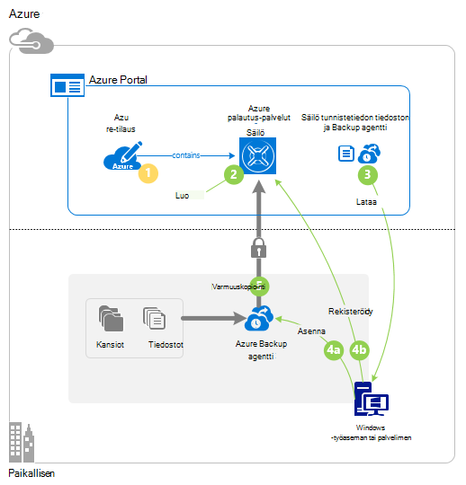

## Vaihe 1: Hanki Azure tilauksen

Jos sinulla ei ole Azure tilauksen, luo [ilmainen tili](https://azure.microsoft.com/free/) , jolla voit käyttää Azure-palvelua.

## Vaihe 2: Luo palautus palvelut-säilö

Jos haluat varmuuskopioida tiedostot ja kansiot, haluat luoda palautus palvelut-säilö alue, johon haluat tallentaa tiedot. Haluat myös määrittää, miten replikoida-tallennustilan.

### Voit luoda palautus palvelut-säilö

1. Jos sinulla ei ole vielä kirjautunut, kirjaudu sisään käyttämällä Azure tilauksen [Azure-portaalissa](https://portal.azure.com/) .

2. Toiminto-valikosta valitsemalla **Selaa** ja kirjoita resurssit-luetteloon **Palautus palvelut** ja valitse **palautus-palveluiden vaults**.

    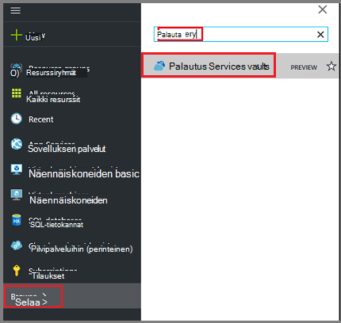  

3. **Palautus Services vaults** -valikosta **Lisää**.

    

    Palautus Services säilö-sivu avautuu, kannattaa antaa **nimi**, **tilauksen**, **resurssiryhmä**ja **sijainti**.

    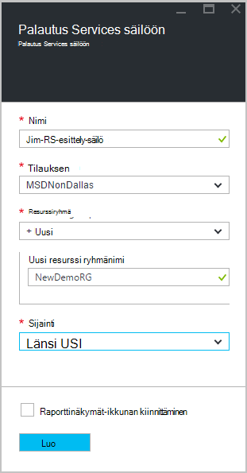

4. Kirjoita kutsumanimi tunnistavan säilö **nimi**.

5. Valitse **tilaus** tilaukset käytettävissä luettelossa.

6. **Resurssiryhmä** käytettävissä luettelo resurssin ryhmien tai valitse **Uusi** ja luo uusi resurssiryhmä.

7. Valitse **sijainti** Valitse säilö maantieteellinen alue. Tämä asetus määrittää maantieteellisen alueen, jossa varmuuskopioidut tiedot lähetetään.

8. Valitse **Luo**.

    Jos et näe lisääminen säilöön luettelossa, kun se on valmis, valitse **Päivitä**. Kun luettelo on päivitetty, valitse säilö nimi.

### Voit selvittää tallennustilan redundancy
Kun luot palautus Services säilö voit määrittää, miten tallennustilan replikoida.

1. Valitse uusi säilö avaa koontinäyttö.

2. Valitse **asetukset** -sivu, joka avautuu automaattisesti säilö Raporttinäkymät-ikkunan kanssa, **Varmuuskopiointi-infrastruktuuria**.

3. Valitse Näytä **replikoinnin tallennustyyppi** **Varmuuskopioinnin määrittäminen** varmuuskopiointi infrastruktuuri-sivu.

    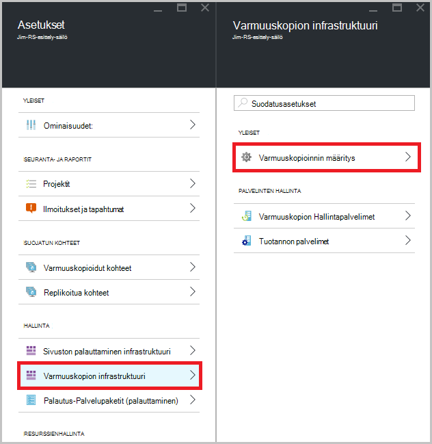

4. Valitse tarvittavat tallennustilan replikoinnin vaihtoehtoa, että säilö.

    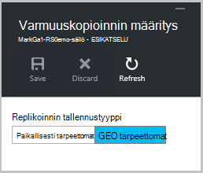

    Oman säilö on oletusarvoisesti geo ylimääräinen. Jos käytät Azure ensisijainen varmuuskopion tallennustilan päätepisteen, käytä geo ylimääräinen edelleen. Jos käytät Azure muun ensisijaisen varmuuskopion tallennustilan päätepisteen, valitse paikallisesti tarpeettomat tallennustilaa, joka vähentää kustannusten tietojen tallentaminen Azure-tietokannassa. Lue lisätietoja [geo tarpeettomat](../storage/storage-redundancy.md#geo-redundant-storage) ja [paikallisesti tarpeettomat](../storage/storage-redundancy.md#locally-redundant-storage) tallennusasetukset tässä [Yleiskatsaus](../storage/storage-redundancy.md).

Nyt kun olet luonut säilöön, voit valmistella infrastruktuurin varmuuskopioida tiedostot ja kansiot lataamalla Microsoft Azure palautus Services agentti ja säilöön tunnistetiedot.

## Vaihe 3: lataa tiedostot

1. Valitse **asetukset** palautus Services säilö koontinäytössä.

    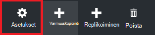

2. Valitse **Aloitus > varmuuskopiointi** -asetukset-sivu.

    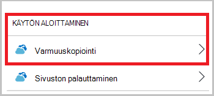

3. Valitse **Varmuuskopiointi tavoitteen** varmuuskopiointi-sivu.

    

4. Valitse **paikallisen** josta on käynnissä havainnollistamiseen? valikko.

5. Valitse **tiedostot ja kansiot** mitä voit tehdä varmuuskopion haluat? valikko, ja valitse **OK**.

### Lataa palautus palvelut-agentti

1. Valitse **Lataa anonyymi, Windows Server- tai Windows-asiakasohjelmaa** **valmisteleminen infrastruktuuri** -sivu.

    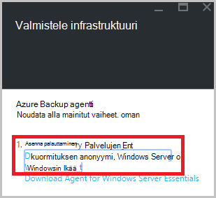

2. Lataa-ponnahdusikkunassa valitsemalla **Tallenna** . **MARSagentinstaller.exe** -tiedosto tallennetaan oletusarvoisesti tiedostot-kansiossa.

### Säilö tunnistetietojen lataamisesta

1. Valitse **Lataa > Tallenna** valitse Valmistele infrastruktuuri-sivu.

    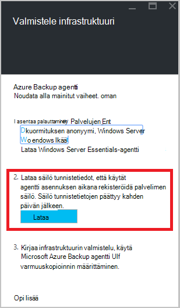

## Vaihe 4 – Asenna ja rekisteröi agentti

>[AZURE.NOTE] Ottaminen käyttöön varmuuskopiointi palvelun Azure-portaalissa on tulossa. Tällä hetkellä käyttämällä Microsoft Azure palautus Services Agent paikallisen voit varmuuskopioida tiedostot ja kansiot.

1. Etsi ja kaksoisnapsauta **MARSagentinstaller.exe** tiedostot-kansiossa (tai muita tallennussijainnin).

2. Suorita Microsoft Azure palautus palvelut-agentti ohjatun. Suorita ohjattu on:

    - Valitse asennus- ja välimuistikansion sijainti.
    - Anna välityspalvelimen palvelimen tiedot, jos käytät välityspalvelinta internet-yhteys.
    - Lisätiedot käyttäjän käyttäjänimi ja salasana, jos käytät edellyttävän välityspalvelimen kautta.
    - Ladatun säilö tunnistetiedoilla
    - Tallenna salasana salaus turvalliseen paikkaan.

    >[AZURE.NOTE] Jos kadotat tai unohdat salasana, Microsoft voi auttaa Palauta varmuuskopioidut tiedot. Tallenna tiedosto turvalliseen paikkaan. Se tarvitaan palauttaminen varmuuskopiosta.

Agentti on asennettu ja tietokone on rekisteröity säilö. Olet valmis ja ajoittaa varmuuskopion.

## Vaihe 5: Varmuuskopioida tiedostot ja kansiot

Alkuperäinen varmuuskopioinnin sisältää tärkeimmät tehtävät:

- Ajoita varmuuskopiointi
- Varmuuskopioida tiedostot ja kansiot ensimmäistä kertaa

Alkuperäinen varmuuskopioinnin suorittamiseen voit käyttää Microsoft Azure palautus Services-agentti.

### Ajoita varmuuskopiointi

1. Avaa Microsoft Azure palautus Services-agentti. Löydät sen koneen hakemalla **Microsoft Azure varmuuskopiointi**.

    

2. Valitse **Ajoita varmuuskopiointi**palautus palvelut-agentti.

    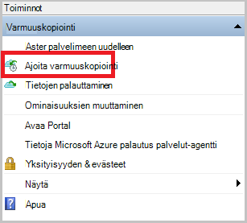

3. Valitse ohjattu aikataulun Varmuuskopiointi-sovelluksen käytön aloittaminen-sivulla **Seuraava**.

4. Valitse kohteiden varmuuskopiointi-sivulle valitsemalla **Lisää kohteita**.

5. Valitse tiedostot ja kansiot, jotka haluat varmuuskopioida ja valitse sitten **OK**.

6. Valitse **Seuraava**.

7. **Määritä varmuuskopion ajoitus** -sivulla Määritä **aikataulun** ja valitse **Seuraava**.

    Voit ajoittaa (ja enimmäisnopeus kolme kertaa päivässä) päivittäin tai viikoittain varmuuskopiot.

    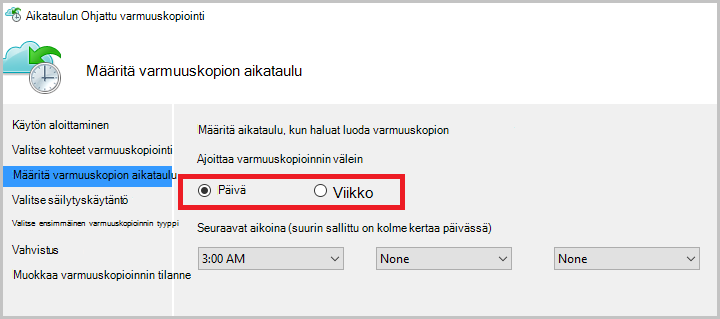

    >[AZURE.NOTE] Lisätietoja siitä, miten varmuuskopioinnin aikataulu on artikkelissa [Käytä Azure varmuuskopion korvaa nauha-infrastruktuuria](backup-azure-backup-cloud-as-tape.md).

8. Valitse **Valitse säilytyskäytäntö** -sivulla **Säilytyskäytäntö** varmuuskopion.

    Säilytyskäytännön määrittää keston, jonka varmuuskopioinnin tallennetaan. Sen sijaan, että vain määrittäminen "tasainen käytäntöä" pisteiden varmuuskopion, voit määrittää eri säilytyskäytäntöjä perusteella varmuuskopioinnin yhteydessä. Voit muokata päivittäin, viikoittain, kuukausittain ja vuosittaisen säilytyskäytännöt vastaamaan omia tarpeita.

9. Valitse ensimmäinen varmuuskopion tyyppi-sivulla Valitse alkuperäinen varmuuskopion tyyppi. Jätä **automaattisesti verkossa** valittuna-vaihtoehto ja valitse sitten **Seuraava**.

    Voit varmuuskopioida automaattisesti verkossa tai voit varmuuskopioida offline-tilassa. Jäljempänä tässä artikkelissa käsitellään varmuuskopioiminen automaattisesti. Jos haluat tehdä offline-tilassa varmuuskopion, tarkista artikkelin [offline-tilassa olevan Azure varmuuskopion varmuuskopion työnkulun](backup-azure-backup-import-export.md) lisätietoja.

10. Valitse vahvistussivullavalmis Tarkista tiedot ja valitse sitten **Valmis**.

11. Kun ohjattu toiminto on luonut varmuuskopioinnin aikataulu, valitse **Sulje**.

### Voit varmuuskopioida tiedostot ja kansiot ensimmäistä kertaa

1. Valitse palautus palvelut-agentti **Varmuuskopioi** suorittamiseen alkuperäinen valuuttamuunnosten verkon kautta.

    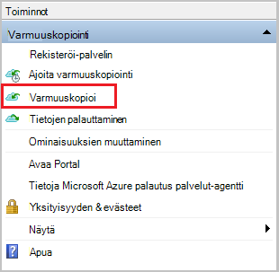

2. Tarkista Vahvista-sivulla asetukset, jotka takaisin ylös nyt ohjattu toiminto käyttää tietokoneen varmuuskopioida. Valitse **Varmuuskopioi**.

3. Valitsemalla **Sulje** ohjattu toiminto. Jos Tee tämä ennen varmuuskopiointia on valmis, ohjattu toiminto säilyy käynnissä taustalla.

Alkuperäinen varmuuskopioinnin jälkeen **työ valmis** -tila näkyy varmuuskopiointi-konsolissa.

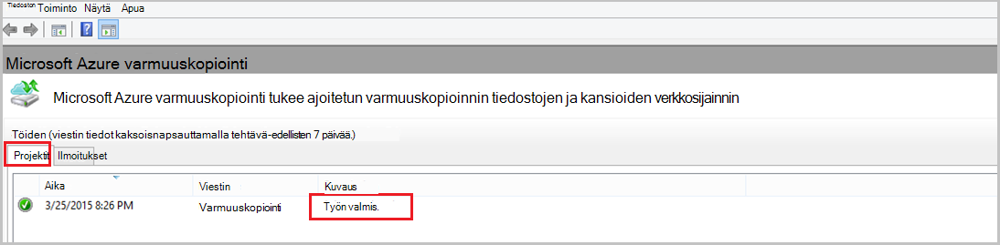

## Kysymyksiä?
Jos sinulla on kysymyksiä tai jos mikä tahansa ominaisuus, jonka haluat nähdä sisältää, [Lähetä meille palautetta](http://aka.ms/azurebackup_feedback).

## Seuraavat vaiheet
- Tarkempia tietoja [varmuuskopioinnista Windows-tietokoneissa](backup-configure-vault.md).
- Nyt kun olet varmuuskopioinut tiedostoja ja kansioita, voit [hallita vaults ja palvelimiin](backup-azure-manage-windows-server.md).
- Jos haluat palauttaa varmuuskopion, lue Lisää artikkelista palauttamaan [tiedostoja Windows-tietokoneeseen](backup-azure-restore-windows-server.md).
