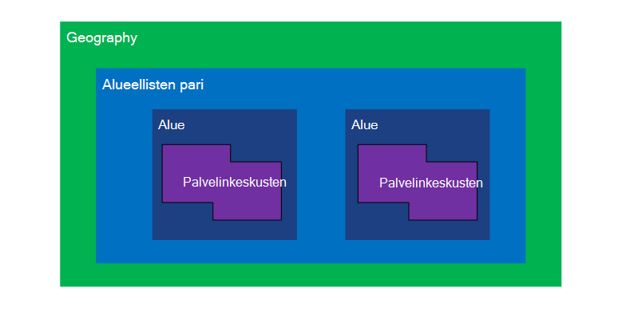
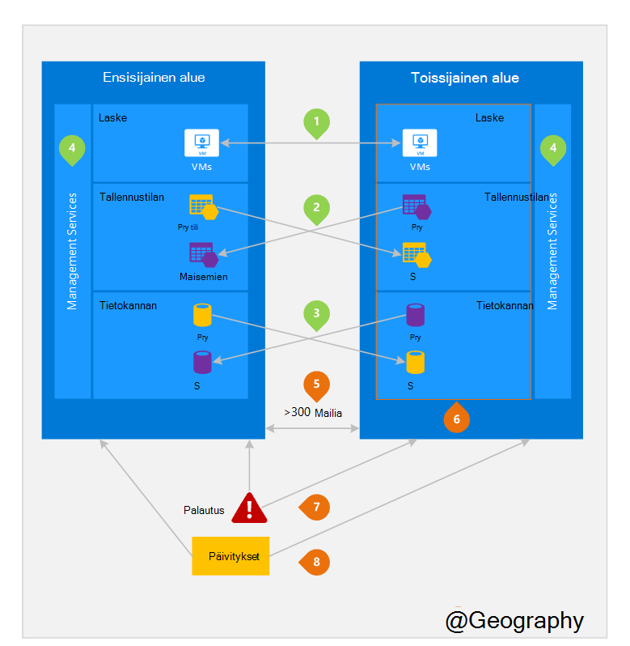

<properties
    pageTitle="Liiketoiminnan jatkuvuus ja tietojen palauttaminen (BCDR): Azure Parittainen alueiden | Microsoft Azure"
    description="Azure alueellisen paria varmistetaan, että sovellukset ovat joustavat aikana data Centerissä virheet."
    services="site-recovery"
    documentationCenter=""
    authors="rayne-wiselman"
    manager="jwhit"
    editor=""/>

<tags
    ms.service="site-recovery"
    ms.workload="storage-backup-recovery"
    ms.tgt_pltfrm="na"
    ms.devlang="na"
    ms.topic="article"
    ms.date="08/23/2016"
    ms.author="raynew"/>

# Liiketoiminnan jatkuvuus ja tietojen palauttaminen (BCDR): Azure Parittainen alueet

## Mitä ovat Parittainen alueiden?

Azure toimii useita paikkojen eri puolilla maailmaa. Azure geography on maailman, joka sisältää vähintään yhden Azure-alueen määritetyllä alueella. Azure alue on alue geography, joka sisältää vähintään yhden palvelinkeskusten.

Azure alueittain on yhdistetty toiseen saman geography-tekeminen yhdessä alueellisen pari alueella. Poikkeus on Brasilia Etelä, johon on yhdistetty ulkopuolella sen maantieteellisen alueen.

Kuva 1 – Azure alueellisen pari kaavio

| Geography     |  Pisteparin alueet  |                     |
| :-------------| :-------------   | :-------------      |
| Pohjois-Amerikka | Pohjois-keskitetyn USA | Etelä keskitetyn USA    |
| Pohjois-Amerikka | Yhdysvaltojen Itä          | Länsi USA             |
| Pohjois-Amerikka | Yhdysvaltojen Itä 2        | Yhdysvaltojen Keski          |
| Pohjois-Amerikka | Länsi US 2        | Länsi keskitetyn USA     |
| Europe        | Pohjois-Eurooppa     | Länsi Europe         |
| Aasian          | Etelä Itä-Aasian  | Itä-Aasian           |
| Kiina         | Itä kiina       | Pohjois-kiina         |
| Japani         | Japani Itä       | Japani Länsi          |
| Brasilia        | Brasilia Etelä (1) | Etelä keskitetyn USA    |
| Australia     | Australia Itä   | Australia varaaja |
| US Government | Yhdysvaltain gov – Iowa      | Yhdysvaltain gov – Virginia     |
| Intia         | Keskitetyn Intia    | Etelä Intia         |
| Kanada        | Kanada Keski   | Kanada Itä         |
| ISO-BRITANNIA            | Iso-Britannia Länsi          | Iso-Britannia Etelä            |

Taulukko 1 - azure alueellisen paria yhdistäminen

> (1) Etelä Brasilia on yksilöllinen, koska se on yhdistetty alueen ulkopuolella omassa geography. Brasilia Etelä toissijainen alue on Etelä keskitetyn US mutta Etelä keskitetyn US on toissijainen alue ei ole Brasilia Etelä.

On suositeltavaa replikoida työmääriä alueellisen paria Azure's eristystaso ja käytettävyyden käytännöt hyötyvät yli. Esimerkiksi suunnitellun Azure Järjestelmäpäivitykset otetaan käyttöön peräkkäin (ei ole yhtä aikaa) pisteparin alueiden välillä. Tämä tarkoittaa, että myös viallinen päivityksen harvinaisissa tapahtuma-molemmat alueet ei vaikuta samanaikaisesti. Lisäksi laaja käyttökatkosta epätodennäköistä tapauksessa kerätään palautus vähintään yhden alueen jokainen ulos.

## Esimerkki pisteparin alueet
Kuva 2 alla näkyy hypoteettista sovellus, joka käyttää alueellisen pari palauttaminen. Vihreä numerot Korosta kolme Azure palveluiden (Azure Laske, varasto ja tietokannan) ja miten ne määritetään eri alueilla replikointia rajat-alue-toimintoja. Yksilöivä edut käyttöönotto eri pisteparin alueilla on korostettu oranssi luvut.

Kuva 2 – hypoteettista Azure alueellisen pari

## Toimintojen välinen alue
Tarkoitettujen kuva 2.

 **Azure Laske (PaaS)** – on valmisteltava muita Laske resurssien etukäteen, että resurssit ovat käytettävissä toisen alueen huono aikana. Lisätietoja on artikkelissa [Azure vikasietoisuudelle teknisiä ohjeita](./resiliency/resiliency-technical-guidance.md).

 **Azuren tallennustilaan** - Geo tarpeettomat storage (GRS) on määritetty oletusarvoisesti Azure-tallennustilan tilin luomisen yhteydessä. GRS, jossa tiedot on replikoida automaattisesti kolme kertaa ensisijainen alueella ja kolme kertaa pisteparin alueen. Lisätietoja on artikkelissa [Azure Redundancy tallennusasetukset](storage/storage-redundancy.md).

 **Azure SQL-tietokantoja** – Azure SQL vakio Geo-toistot, voit määrittää asynkroninen replikoinnin tapahtumien pisteparin alue. Toistot sallittuja-Premium Geo voit määrittää minkä tahansa alueen replikoinnin maailmanlaajuisesti; Suosittelemme kuitenkin asennat nämä resurssit pisteparin alueen useimmissa tietojen palauttaminen skenaarioissa. Lisätietoja on artikkelissa [Geo-replikoinnin Azure SQL-tietokantaan](./sql-database/sql-database-geo-replication-overview.md).

 **Azure resurssien hallinta (ARM)** - ARM on looginen eristystaso hallinta osien salliminen eri alueilla. Tämä tarkoittaa jonkin alueen looginen virheitä on epätodennäköistä vaikuttaa toiseen.

## Pisteparin alueiden edut
Tarkoitettujen kuva 2.  

**Fyysinen eristystaso** – kun mahdollista Azure haluaa vähintään 300 Mailia erottaminen toisistaan alueellisen pari palvelinkeskusten, vaikka tämä ei kaikki paikkojen käytännön tai mahdollista. Fyysinen palvelinkeskuksen erottaminen vähentää luonnonmullistusten, siviili unrest, sähkökatkokset tai fyysinen verkko katkokset vaikuttavia molemmat alueet kerralla todennäköisyys. Eristystaso peritään rajoitusten sisällä geography (geography koon, power/verkon infrastruktuurin käytettävyys, asetusten jne.).  

**antamalla ympäristö replikoinnin** - joidenkin palvelujen esimerkiksi Geo tarpeettomat lisätallennustilaa antaa automaattinen replikoinnin pisteparin alueen.

**alueen palautus tilauksen** – Jos laajan käyttökatkosta yhden alueen palautus on ensin ulos jokainen. Sovellukset, jotka on otettu käyttöön pisteparin alueilla on varmasti yksi palautettu prioriteetin alueet. Jos jokin sovellus otetaan käyttöön eri alueilla, joka ei ole yhdistetty, palautus saattaa viivästyä – valittujen alueiden voidaan palauttaa viimeisen kahden Huonoin tapaus.

**peräkkäin päivitykset** – suunniteltu Azure järjestelmän päivitykset tulevat esiin pisteparin alueiden peräkkäin (ei ole yhtä aikaa) Pienennä käyttökatkot, virheet ja looginen virheiden harvinaisissa tapahtuman virheelliset päivityksen vaikutus.

**tietojen pisimpään** – alueen sijaitsee saman geography kuin sen pair (lukuun ottamatta Brasilia Etelä) vaatimusten tietojen pisimpään vero ja lain käyttäminen piiriin varten.

