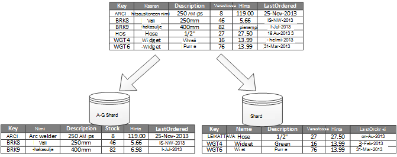
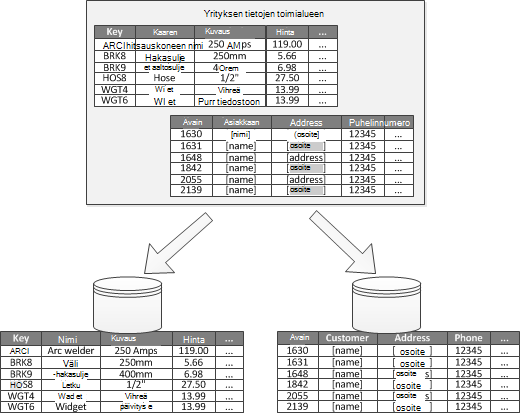
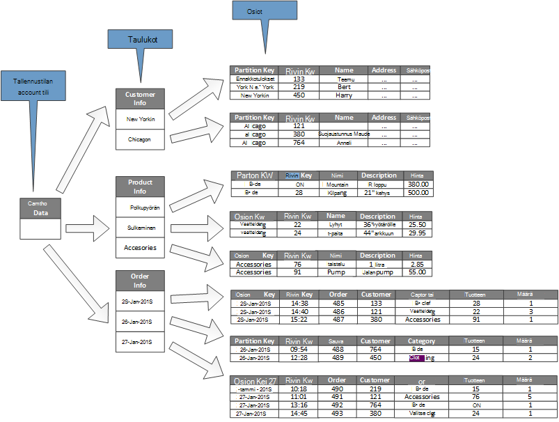

<properties
   pageTitle="Tietojen jakaminen ohjeet | Microsoft Azure"
   description="Ohjeita siitä, miten haluat erottaa osioita, voit hallita ja käyttää erikseen."
   services=""
   documentationCenter="na"
   authors="dragon119"
   manager="christb"
   editor=""
   tags=""/>

<tags
   ms.service="best-practice"
   ms.devlang="na"
   ms.topic="article"
   ms.tgt_pltfrm="na"
   ms.workload="na"
   ms.date="07/14/2016"
   ms.author="masashin"/>

# Tietoja osioinnin ohjeet

[AZURE.INCLUDE [pnp-header](../includes/guidance-pnp-header-include.md)]

## Yleiskatsaus

Monet suurissa ratkaisut tiedot jaetaan erillistä osioita, jotka voi hallita ja käyttää erikseen. Osioinnin strategia on valittava huolellisesti etuja suurentaminen ja pienentäminen haitalliset vaikutukset. Jakaminen voi auttaa parantamaan skaalattavuus, vähentää ristiriita ja suorituskyvyn parantamiseksi. Jakaminen toisen etuna on se, että siinä voi tarkoitetut tiedot jaetaan Käytä kuvio. Voit esimerkiksi arkistoida vanhat ja vähemmän aktiivinen halvempaa tietosäilö (kylmän) tiedot.

## Miksi osion tiedot?

Useimmat cloud-sovellusten ja palveluiden tallentaa ja hakea tietoja niiden toimintojen osana. Tietoja tallennetuista tiedoista, jotka sovellus käyttää ulkoasua voi olla merkittäviä vaikuttavat suorituskykyyn, liikenteen ja skaalattavuus järjestelmän. Yksi tapa, jota käytetään usein suurissa järjestelmien on tietoja jakautuvan eri osiot.

> Termin _jakaminen_ , jota käytetään nämä ohjeet viittaa prosessi, jossa jakamalla fyysisesti tietojen tuominen eri tietojen stores. Tämä ei ole sama kuin SQL Server taulukon jakaminen, joka on eri käsite.

Tietojen jakaminen voit tarjota useita etuja. Se voi esimerkiksi suojata, jotta:

- **Paranna skaalattavuus**. Kun skaalata laatimisesta yhteen tietokantaan, fyysinen laitteisto rajoitukset myöhemmin saavuttaa. Jos tietojen jakaminen koko useita osioita, joista jokaisella nykyisessä muussa palvelimessa, voit skaalata järjestelmän lähes jatkuvasti.
- **Suorituskyvyn parantaminen**. Tietoja access toimenpiteet kunkin osion asetetaan pienempi tietoja on paljon päälle. Jos tiedot on osioitu sopivalla tavalla, jakaminen Voit tehostaa järjestelmän. Toiminnot, jotka vaikuttavat useampaan kuin yhteen osioon voit suorittaa rinnakkain. Kunkin osion voi sijaita lähellä sovellus, joka käyttää Pienennä verkon latenssin.
- **Paranna käytettävyyttä**. Erotat tietojen useita palvelinten vältetään virheen yhden pisteen. Jos palvelimen epäonnistuu, tai on suunniteltu ylläpito-vain tiedot kyseisessä osiossa ei ole käytettävissä. Muiden osioiden toimenpiteet jatkaa. Lisääntyvien osioiden määrää vähentää yhden palveluvirhe suhteellinen vaikutus vähentämällä prosenttiosuus tiedot, jotka eivät ole käytettävissä. Kunkin osion replikoiminen edelleen pienentää mahdollisuutta toiminnot vaikuttavat osio epäonnistui. Se myös mahdollistaa sellaisten erota tärkeitä tietoja, jotka on oltava jatkuvasti ja erittäin käytettävissä vähäisen tiedoista, joka on pienempi käytettävyys vaatimukset (esimerkiksi kirjautuvat lokitiedostoihin).
- **Paranna suojaus**. Sen mukaan, tiedot ja miten se on osioitu laatu voi olla mahdollista luottamuksellisia ja ei-luottamukselliset tiedot erottaa useaan eri osiot ja näin ollen eri palvelimia tai tiedot tallennetaan. Suojauksen sitten voi optimoida erityisesti luottamuksellisia tietoja.
- **Anna toiminnallisia joustavuutta**. Jakaminen on monia mahdollisuuksia hieno parantaminen toimintoja, hallinnollisen tehokkuuden suurentaminen ja pienentäminen kustannukset. Voit esimerkiksi määrittää eri strategioita hallinta, seuranta, varmuuskopiointi ja palauttaminen ja muiden hallinnollisten tehtävien perusteella kunkin osion tietojen merkitys.
- **Tiedot tallennetaan käyttää kuviota vastine**. Kunkin osion otetaan käyttöön tietovaraston kustannukset ja tietovaraston tarjouksia sisäisten ominaisuuksien perusteella erityyppisen jakaminen avulla. Esimerkiksi suuri binaaritietoja voidaan tallentaa blob Tallenna, kun jäsenneltyjen tietojen voi pitää tiedoston tietokannan. Katso lisätietoja [rakentaminen polyglot ratkaisu] kuvioiden ja käytännöt oppaasta ja [tietokantasivu erittäin skaalattava ratkaisuja: käyttäen SQL NoSQL ja polyglot pysyvyys] Microsoft-sivustossa.

Jotkin järjestelmät Toteuta jakaminen, koska pidetään kustannus etuna sijaan. Tilanteet, joissa tämä perusteet ovat seuraavat:

- Monta tietojen tallennustilan järjestelmät eivät tue liitokset osioiden välillä ja voi olla vaikeaa, jos haluat säilyttää viite-eheyden osioitua järjestelmässä. Eheys tarkistaa sovelluksen koodi (osioinnin layer), mikä voi aiheuttaa muita i/o ja sovelluksen monimutkaisuus on usein tarvittavat liitokset.
- Osioiden ylläpitoon ei aina trivial tehtävän. Järjestelmän, missä tiedot muuttuvat voit joutua muuttamaan saattaa jälleen tasapainoon säännöllisesti, voit pienentää ristiriita ja kohdepisteet osiot.
- Joitakin yleisiä työkaluja eivät toimi luonnollisesti osioitua tiedoilla.

## Osioiden suunnitteleminen

Tietoja voi osioida eri tavalla: vaakasuunnassa, pystysuunnassa tai toiminnallisesti. Voit valita strategia määräytyy syy jakaminen tietoja ja sovelluksia ja palveluja, joka käyttää tietoja vaatimuksista.

> [AZURE.NOTE] Nämä ohjeet on kuvattu osioinnin järjestelmät selvennetään niin, että on erillinen tietojen tallennustilan tekniikkaan. Ne voidaan ottaa käyttöön useita erityyppisiä tietoja stores, mukaan lukien relaatio ja NoSQL tietokannat.

### Strategioita jakaminen

Kolme tyypillinen strategioita jakaminen tiedot ovat seuraavat:

- **Vaakasuuntainen jakaminen** (kutsutaan usein _sharding_). Tämä strategia kunkin osion on oma tietosäilö, mutta kaikki osiot on sama rakenne. Kunkin osion kutsutaan _shard_ ja pitää tietyn osan tiedoista, esimerkiksi kaikki tietyt e commerce sovelluksen asiakkaiden tilaukset.
- **Pystysuuntainen jakaminen**. Tämä strategia kunkin osion pitää alijoukkoa kohteiden kentät tietovaraston. Kentät on jaettu niiden käyttötapa mukaan. Esimerkiksi usein käytetyt kentät saatetaan yksi pystysuora osio ja vähemmän usein käytetyt kentät toiseen.
- **Toiminnalliset jakaminen**. Tämä strategia tiedot yhdistetään mukaan, miten niitä käytetään jokaisen joka kontekstin mukaan järjestelmässä. Esimerkiksi e commerce järjestelmä että toteuttaa erota liiketoimintatoimintojen laskutus ja tuotteen varaston hallinta voivat tallentaa laskutietoja yksi osio ja tuotteen varastotiedot toisessa.

On tärkeää muistaa kuvatut kolme strategioita voidaan yhdistää. Ne eivät ole toisensa poissulkevia ja suosittelemme, että pidät ne kaikki osiointimalli suunnitellessasi. Voit esimerkiksi jakaa tietoja shards ja käyttää sitten voit edelleen jakaa tietoja kunkin shard pystysuora jakaminen. Vastaavasti toimintojen osion tiedot voidaan jakaa shards (joka voi myös voi pystysuunnassa osioida).

Kunkin strategia eri vaatimukset voit kuitenkin korottaa luvun ristiriitaiset ongelmista. On arvioitava ja saldo kaikki nämä, kun suunnittelet osiointimalli, joka täyttää järjestelmän yleinen tietojenkäsittely suorituskyky-kohteet. Seuraavissa osissa Tutustu eri strategiat tarkemmin.

### Vaakasuuntainen jakaminen (sharding)

Kuvassa 1 on yleiskatsaus jakaminen vaaka- tai sharding. Tässä esimerkissä tuotteen varastotiedot on jaettu shards product key-tunnuksen perusteella. Kunkin shard pitää shard näppäimet (A-G ja H-Z) mukaan järjestettyinä aakkosjärjestykseen yhtenäisen solualueen tiedot.

_Kuva 1. Jakaminen vaakasuunnassa (sharding) tietojen osion avaimen perusteella_

Sharding auttaa kuormituksen levitä Lisää tietokoneissa, mikä vähentää ristiriita ja parantaa suorituskykyä. Voit skaalata, järjestelmä lisäämällä shards, jotka suoritetaan muita palvelimiin.

Kun tämä osioinnin strategia Tärkein tekijä on sharding avaimen valinta. Voi olla vaikea muuttaa avaimen, kun järjestelmä on toiminnassa. Avain on varmistettava, että tiedot osioidaan niin, että työmäärää on kuin jopa mahdollisimman shards.

Huomaa, että eri shards ei ole samanlainen tietomäärien sisältämään. Sen sijaan tärkeämpää vastikkeen on saldo pyyntöjen määrä. Jotkin shards saattaa olla erittäin suuri, mutta kunkin kohteen on vähän Accessin toimintojen aihe. Muut shards voi olla pienempi, mutta kunkin kohteen käytetään paljon useammin. Myös on tärkeää varmistaa, että yhden shard enintään tietovarasto, jota käytetään isännöimiseen kyseisen shard asteikko rajoitukset (kannalta kapasiteetin ja käsiteltäessä resurssien).

Jos käytät sharding värimallin, vältä luomista kohdepisteet (tai kuuma osiot), jotka voivat vaikuttaa suorituskykyyn ja käytettävyyttä. Jos käytät hash asiakkaan tunnisteen asiakkaan nimen ensimmäinen kirjain sijaan, voit estää esimerkiksi tasaamattomat jakauman, joka tulos yhteisistä ja harvinaisempi alkukirjainta. Tämä on tyypillinen tekniikka, jonka avulla voit jakaa tietoja tasaisemmin osioiden välillä.

Valitse sharding-näppäintä, joka jakaa suuria shards pienempi osiin tulevien vaatimuksia minimoi yhdistettyä kyselyä pieni shards suurempi osioihin tai muuta rakennetta, joka kuvaa tietyt osiot tallennettuja tietoja. Näitä toimintoja voi olla hyvin aikaa ja voi edellyttää ottaen vähintään yksi shards offline-tilassa, kun ne tehdään.

Jos shards replikoida ehkä voi pitää joitakin replikat verkossa samalla, kun muut käyttäjät ovat Jaa, yhdistetyt tai uudelleen. Järjestelmä on ehkä kuitenkin rajoittaa toiminnoista, joita voi suorittaa näitä shards tietoihin, kun uudelleenmääritys on meneillään. Esimerkiksi replikat tiedot voidaan merkitä inconsistences saattaa kadota, kun shards järjestetty uudelleen laajuuden rajoittaminen vain luku-tilassa.

> Saat lisätietoja ja ohjeita siitä, monia näistä huomioitavista asioista ja hyvien tekniikoita suunnittelun tietoja tallennetuista tiedoista, jotka toteuttavat vaakasuora jakaminen [Sharding kuvio].

### Pystysuuntainen jakaminen

Yleisimmät käyttö pystysuora jakaminen on lyhentää i/o ja suorituskykyyn liittyvät kohteet, jotka noudetaan kustannukset käytetään useimmin. Kuvassa 2 on esimerkkejä pystysuuntaisen jakaminen. Tässä esimerkissä tietojen kunkin kohteen eri ominaisuuksia järjestetään eri osiot. Yksi osio sisältää tiedot, joita käytetään useammin, kuten nimi, kuvaus ja tuotteiden hintatietoja. Toisen pitää stock ja järjestetyn viimeksi äänenvoimakkuutta.

_Kuva 2. Jakaminen pystysuunnassa tietojen mukaan sen käyttötapa_

Tässä esimerkissä sovelluksen säännöllisesti kyselyn tuotteen nimi, kuvaus ja hinta tuotteen tiedot näytetään asiakkaille. Varaston taso ja päivämäärä, kun tuote on viimeksi tilattu valmistajalta järjestetään erillisinä, koska nämä kaksi kohdetta käytetään yleensä yhdessä.

Tämä osiointimalli on lisätty etu suhteellisen hidastaa-siirtäminen tiedot (tuotteen nimi, kuvaus ja hinta) on erotettu dynaamisemmaksi tiedot (varaston taso ja järjestetyn viimeksi). Sovelluksen voi tutustua hyödyllisiin välimuistiin hidastaa siirtäminen tiedot, jos se on usein käytetyt.

Tämä osioinnin strategia toinen tavallinen skenaario on paras mahdollinen suojaus luottamuksellisia tietoja. Voit tehdä tämän esimerkiksi tallentamalla luottokortin numeroista ja kortin suojauksen todentaminen lukuihin erilliset osiot.

Pystysuuntainen jakaminen Voit myös vähentää samanaikainen käyttö on tarvittavat tiedot.

> Pystysuuntainen jakaminen toimii kohteen sisällä tietovaraston normalisointi osittain kohteen eritellä se _Leveä_ kohteesta joukko _tarkentaa_ kohteita tasolla. Sopii Ihannetapauksessa hyödyntää, kuten HBase ja Cassandra sarakemuotoinen tietojen stores. Jos sivustokokoelman sarakkeiden tiedot on epätodennäköistä, jos haluat muuttaa, harkitse sarakkeeseen tallennetaan SQL Serverin avulla.

### Toimintojen jakaminen

Järjestelmien, jossa on mahdollista tunnistaa kunkin eri liiketoiminta-alueiden tai palvelun sovelluksen joka kontekstin toimintojen jakaminen on tekniikka eristystaso ja tiedot access-suorituskyvyn parantamiseen. Toisen yleisiä käyttäminen toimintojen jakaminen on luku-ja kirjoitusoikeudet tietojen erottaa vain luku-tietoja, joita käytetään raportointia varten. Kuva 3 näkyy yleiskuvaus toimintojen jakaminen, jossa varastotiedot on erotettu asiakastiedot.

_Kuva 3. Jakaminen toiminnallisesti tietojen alitoimialueen tai joita yhteydessä_

Tämä osioinnin strategia voi vähentää tietojen käytön ristiriita järjestelmän eri osien välillä.

## Skaalattavuus osioiden suunnitteleminen

On tärkeää huomioon koko ja työmäärää kunkin osion ja saldo ne niin, että tiedot on jaettu saada suurimman skaalattavuus. On myös osion tiedot niin, että se ei ole suurempi kuin yhden osion kaupan skaalauksen rajoitukset.

Kun suunnittelet skaalattavuus osioita, toimi seuraavasti:

1. Analysoi sovelluksen ymmärtää access kuviot, kuten palauttaman kummankin kyselyn tulosjoukon koko, Accessissa, luontaisen viive ja palvelinpuolen taajuus Laske vaatimukset. Monissa tapauksissa muutaman pää kohteiden vaatimus useimmat käsittely resurssit.
2. Tämän analyysin avulla voit määrittää nykyisen ja tulevien skaalattavuus kohteet, kuten arvopisteiden koko ja työmäärää. Valitse Jaa tiedot täyttävän skaalattavuus kohde osioiden välillä. Vaakasuuntainen osioinnin strategia valitsemalla haluamasi shard avain on tärkeää varmistaa, että kertymäfunktion arvo on parillinen. Lisätietoja on artikkelissa [Sharding kuvio].
3. Varmista, että kunkin osion resursseista on riittävä käsittelemään skaalattavuus vaatimukset tietojen koosta ja siirtonopeuden. Esimerkiksi solmu, joka isännöi osion voi asettaa kiinteä rajoitus käsitellään power tai johon se on kaistanleveys tallennustilan määrän. Jos tallennustilaa ja käsittelyn vaatimukset on todennäköisesti ylitä nämä raja-arvot, voi olla tarpeen tarkentaa osioinnin strategia tai jakamalla tietojen edelleen. Esimerkiksi yksi skaalattavuus lähestymistapa voi olla lokitiedot erottaa core-sovelluksen ominaisuudet. Tämä tehdään käyttämällä eri Microsoft Data yhteensä tietojen tallennuksen vaatimukset-ylittää skaalauksen solmun estämiseksi. Jos Microsoft Data määrä ylittää solmu rajoituksen, voi olla tarpeen käyttää erillisen tallennustilan solmujen.
4. Seurata käyttöä ja varmista, että tiedot on jaettu oikein ja osiot voit käsitellä niitä koskevia, lataa järjestelmän. On mahdollista, että käyttö ei vastaa käytön, joka on ennakolta analyysi. Tässä tapauksessa voi olla mahdollista saattaa jälleen tasapainoon osiot. Se täytyy mahdollisesti muuttamiseen ja myönnä tarvittavat saldo järjestelmän joitakin osia.

Huomaa, että myös infrastruktuurin rajat resurssien varaaminen joitakin cloud-ympäristössä. Varmistettava, että valittu rajan rajoitukset kaikki tiedot tietosäilö käsittely power ja kaistanleveyden äänenvoimakkuuden odotettua kasvu tilaa.

Esimerkiksi jos käytät Azure-taulukkotallennus, varattu shard saattaa edellyttää enemmän resursseja kuin ovat käytettävissä pyyntöjen osio. (Ei pyynnöt osio voi käsitellä tietyn ajan kuluessa äänenvoimakkuuden rajoitukset. Katso sivun [Azure tallennustilan skaalattavuus ja suorituskyvyn kohteiden] lisätietoja Microsoft-sivustossa.)

 Jos näin on, shard joutua muuttamaan osioidaan levittämällä Lataa. Jos kokonaiskoko tai nämä taulukot siirtonopeuden ylittää tallennustilan tilin kapasiteetin, voi olla tarpeen lisätallennustilaa tilien luominen ja levittää taulukot näiden tilien välillä. Jos tallennustilan tilien määrä ylittää tileistä, jotka ovat käytettävissä tilauksessa, valitse se voi olla tarpeen käyttämään useita tilauksia.

## Kyselyn suorituskykyä osioiden suunnitteleminen

Kyselyn suorituskykyä voi tehosti usein pienempi tietojoukot käyttäen ja suorittamalla rinnakkain kyselyt. Kunkin osion pitäisi olla koko tietojoukko osuus. Tämä väheneminen aseman voi parantaa suorituskykyä kyselyitä. Jakaminen ei kuitenkaan löytämiseen suunnitteleminen ja määrittäminen tietokannan asianmukaisesti. Varmista esimerkiksi, että sinulla on tarvittavat indeksit paikassa jos käytössäsi on suhteellisen tietokannan.

Kyselyn suorituskykyä osioiden suunniteltaessa, toimi seuraavasti:

1. Nyt sovelluksen vaatimukset ja suorituskyky:
    - Liiketoiminta-vaatimukset avulla voit määrittää kriittinen kyselyitä, jotka on suoritettava aina nopeasti.
    - Seurata järjestelmä tunnistaa kyselyitä, jotka hitaasti.
    - Muodostaa kyselyt suoritetaan useimmin. Yksittäisen esiintymän kummankin kyselyn voi olla mahdollisimman vähän kustannukset, mutta resurssien kumulatiivisen kulutus voi olla merkittäviä. Sinun on ehkä kannattaa erottaa tiedot, jotka noudetaan eri osio tai jopa välimuistin nämä kyselyt.
2. Osion tiedot, jotka on hidastaa:
    - Rajoita kunkin osion kokoa niin, että kohde on kyselyn vastausajan.
    - Suunnittele shard-näppäintä, niin, että sovellus löydät osion helposti, jos toteuttavat vaakasuora jakaminen. Tällöin kyselyn tarvitse käydä läpi jokaisella osio.
    - Harkitse osion sijainti. Jos mahdollista yritä tiedot pysyvät osioita, jotka ovat maantieteellisesti lähellä sovellukset ja käyttäjät, jotka käyttämään sitä.
3. Jos kohde on siirtonopeuden ja kyselyjen suorituskykyä koskevat, käytä toimintojen jakaminen kyseisen kohteen perusteella. Jos tämä ei täytä vaatimukset, käyttää sekä vaaka jakaminen. Useimmissa tapauksissa yksittäisen osioinnin strategia riittää, mutta joissakin tapauksissa on tehokkaampaa yhdistää molempien strategioita.
4. Harkitse asynkroninen kyselyt, jotka suoritetaan rinnakkain suorituskyvyssä osioiden välillä.

## Osioiden käytettävyyden suunnitteleminen

Tietojen jakaminen sovellusten käytettävyyttä voi parantaa varmistamalla, että koko tietojoukko aiheuta virheen yksittäistä pistettä ja yksittäisiä alijoukot DataSet voidaan hallita erikseen. Replikoiminen osioita, jotka sisältävät tärkeitä tietoja myös parantaa käytettävyyttä.

Kun suunnitteluun ja toteutukseen osioita, ota huomioon seuraavat seikat, jotka vaikuttavat käytettävyys:

- **Miten tärkeät tiedot ovat liiketoimintaa**. Tietoja voi olla esimerkiksi laskutustiedot tai pankin tärkeiden yritystietojen. Muut tiedot saattavat sisältää vähemmän tärkeitä toiminnallisia tietoja, kuten lokitiedostot ja suorituskyvyn jälkitiedot. Jälkeen tunnistaminen jokaista tietotyyppiä, ota huomioon:
    - Tallentaminen tärkeitä tietoja erittäin käytettävissä osioita, joilla on tarvittavat varmuuskopioinnin suunnittelu.
    - Luoda erilliset hallinta ja valvonta järjestelmiä tai ohjeet kunkin tietojoukko eri criticalities. Vie tiedot, joilla on sama kriittisyyden samalla tasolla niin, että se voidaan varmuuskopioida yhdessä soveltuvan. Varmuuskopioitavien useammin osioita, pidä kirjaaminen tai jäljitystiedot on ehkä esimerkiksi osioita, joka sisältää pankin tietoja.
- **Miten yksittäiset osioita voidaan hallita**. Suunnittelet osioiden tukemaan riippumaton hallinta ja ylläpito on monia etuja. Esimerkki:
    - Jos osion epäonnistuu, se voidaan palauttaa itsenäisesti vaikuttamatta sovelluksia, jotka käyttävät tietoja muiden osioiden esiintymät.
    - Ajoitettu ylläpitotehtäviä ruuhka jokaisen sijainnin esiintyvän jakaminen maantieteellisen alueen tietojen avulla. Varmista osiot eivät ole liian suuri, jos haluat estää kaikki suunniteltu ylläpito suorittamisen tänä aikana.
- **Haluatko toistaa tärkeitä tietoja osioiden välillä**. Tämä strategia voi parantaa käytettävyyttä ja suorituskyvyn, vaikka siitä mahdollisia myös yhdenmukaisuuden ongelmat. Kuluu aikaa voidaan synkronoida jokaisen replikan osion tietoihin tehdyt muutokset. Tänä aikana eri osiot sisältävät eri tietoarvot.

## Tietoja siitä, miten jakaminen vaikuttaa suunnittelu- ja

Käyttämällä jakaminen Lisää rakenteen ja kehittämisen järjestelmän monimutkaisuus. Harkitse jakaminen järjestelmän rakenteen vaikka ratkaisevan osana järjestelmän alun perin sisältää vain yhden osion. Jos harkita jakaminen kuin afterthought järjestelmän käynnistyessä heikkenee suorituskyky ja skaalattavuus ongelmista, monimutkaisuus kasvaa koska sinulla on jo pitämään järjestelmässä.

Jos päivität järjestelmä toteuttamaan jakaminen tässä ympäristössä, se edellyttää tiedot access-funktioiden muokkaaminen. Voit myös liittyä siirtäminen suuria määriä tietoja, voit jakaa sen osiot, usein samalla, kun käyttäjät voivat edelleen käyttää järjestelmän odottavat.

Joissakin tapauksissa jakaminen ei pidetä tärkeää koska alkuperäinen tietojoukko on pieni, ja voit käsitellä helposti yhteen palvelimeen. Voi olla tosi, joka ei odoteta skaalata sen alkuperäinen koko ylittää järjestelmän, mutta monet kaupallisen järjestelmät tarvitsevat käyttäjät kasvaa lukumääränä Laajenna. Tietojen määrän kasvun yleensä liitettävä tärkeimmille.

On myös tärkeää ymmärtää, että jakaminen ei ole aina funktioon suurien tietomäärien stores. Esimerkiksi pieni tietosäilö raskaasti avulla voi käyttää satoja samanaikainen asiakkaille. Tässä tilanteessa tietojen jakaminen voi auttaa vähentämään ristiriita ja parantaa.

Kun suunnittelet tietojen osiointimalli, ota huomioon seuraavat seikat:

- **Mahdollisuuksien mukaan sisältämään yleisimmät tietokannan toimille yhteen kunkin osion Pienennä rajat-osion tiedot access-toimintoja**. Osioiden välillä kyselyt voi viedä aikaa enemmän kuin vain yhden osion sisällä kyselyt, mutta optimointi yhden kyselyiden joukon osiot voivat haitata muut kyselyt joukkoa. Kun et voi välttää kyselyt osioiden välillä, pienentää kyselyaika suorittaminen rinnakkain kyselyt ja yhdistämisestä tulokset-sovelluksessa. Tämän menetelmän ei ehkä ole mahdollista joissakin tapauksissa, kuten tarvittaessa hankkia yhden kyselyn tuloksen ja käyttää sitä seuraavan kyselyn.
- **Jos kyselyjen Varmista käyttää staattinen suhteellisen viittauksen tietoja, kuten postinumero taulukoita tai -tuotteen luetteloita, harkitse replikoiminen tiedoista kaikista vähentää erillisen haku toimintojen eri osiot vaatimus osiot**. Tämän menetelmän myös pienentää tulossa "kuuma" tietojoukko, joka on ruuhkaa veloittaa koko järjestelmästä viitetiedot todennäköisyys. On kuitenkin liittyvän synkronointi kaikki muutokset, jotka voivat ilmetä tämän viitetiedot lisäkustannuksia.
- **Mahdollisuuksien mukaan Pienennä vaatimukset viite-eheyden vaaka- ja toiminnallisia osioiden välillä**. Nämä valikoimat-sovelluksesta on vastuussa ylläpito viite-eheyden osioiden välillä, kun tiedot on päivitetty ja kulutettu. Kyselyitä, jotka on liitettävä tietojen useita osioiden välillä toimia hitaasti kuin kyselyitä, jotka liittyä tietojen vain samaan osioon, koska sovellus on yleensä suoritettava peräkkäiset kyselyt, näppäintä ja sitten viiteavain. Harkitse, replikoiminen tai normalisointi poistaa olennaiset tiedot. Voit pienentää kyselyaika, jossa rajat-osion liitokset tarvitaan rinnakkain kyselyjen suorittaminen osiot päälle ja liittyä tietoja sovelluksesta.
- **Harkitse osiointimallin voi olla tietojen yhdenmukaisuuden osioiden välillä haluamasi tehoste.** Arvioi, onko vahva yhdenmukaisuuden todella vaatimus. Sen sijaan yhteisen lähestymistavan pilveen on toteuttamisesta potentiaalisen yhdenmukaisuuden. Kunkin osion tiedot päivitetään erikseen ja sovelluksen logiikkaa varmistaa, että päivitykset ovat kaikki onnistui. Se myös käsittelee epäyhtenäisyydet, jotka aiheutuvat tietojen kyselyt myöhemmin yhdenmukaisia toiminto on käynnissä. Saat lisätietoja käyttöönoton potentiaalisen yhdenmukaisuuden [tietojen kelpoisuus askeleet].
- **Harkitse, kuinka kyselyt Etsi oikeaan osioon**. Jos kyselyssä on tarkistaa kaikki osiot Etsi tarvittavat tiedot, on merkittävä vaikutus suorituskykyyn, vaikka rinnakkain kyselyjen on käynnissä. Kyselyitä, joita käytetään vaaka- ja toiminnallisia osioinnin strategioita luonnollisesti määrittää osiot. Kuitenkin vaakasuora jakaminen (sharding) voit tehdä etsiminen kohteen vaikeaa, koska jokaisella shard samaan rakenteeseen. Sharding voi tyypillinen pitämään kartan, jossa voidaan shard sijainti tiettyjen osien tietojen hakemiseen. Muuntomallin olla käytössä sharding logiikan sovelluksen tai ylläpitämä tietovaraston, jos se tukee läpinäkyvä sharding.
- **Vaakasuuntainen osioinnin strategia käytettäessä kannattaa yhdistelemällä säännöllisesti shards**. Näin tietojen jakaminen tasaisesti koon ja työmäärää Pienennä kohdepisteet, parantaa kyselyn suorituskykyä ja kiertää fyysinen tallennustilan rajoituksia. Tämä on kuitenkin monimutkaista, joka edellyttää usein mukautetun työkalun tai prosessi.
- **Jos kunkin osion replikoida se sisältää vastaan virhe**. Jos yhden replikan epäonnistuu, kyselyt voi suunnataan toimimasta kopio.
- **Jos fyysinen rajoituksiin pääsyä osioinnin strategia, sinun on ehkä laajentaa tasolle skaalattavuus**. Esimerkiksi jos jakaminen on tietokannan tasolla, voit joutua Etsi tai replikoida useiden tietokantojen osiot. Jos jakaminen on jo tietokannan tasolla, fyysisiä rajoituksia on ongelma saattaa tarkoittaa, että haluat etsiä tai toistaa useita isännöintipalvelu tilejä osiot.
- **Vältä tapahtumia, jotka käyttävät useita osioita tietoja**. Joidenkin tietojen stores toteuttaminen tapahtumien yhtenäisyyden ja eheyden toimille, Muokkaa tietoja, mutta vain silloin, kun tiedot sijaitsevat osio. Jos tarvitset tapahtumien tuen useita osioiden välillä, sinun on todennäköisesti toteuttamisesta osaksi sovelluksen logiikkaa, koska useimmat osioinnin järjestelmien tarjoa alkuperäisen tukea.

Kaikki tiedot myymälät edellyttävät joitakin toimintojen hallinnan ja valvominen. Tehtävät voivat vaihdella tietojen lataaminen, varmuuskopiointi ja palauttaminen tietojen, uudelleenjärjestely tietoja ja varmistaa, että järjestelmä toimii oikein ja tehokkaasti.

Ota huomioon seuraavat seikat, jotka vaikuttavat toimintojen hallinnan:

- **Sopivan hallinnallisia ja toiminnallisia tehtäviä, kun tiedot on osioitu ottamisesta käyttöön**. Tehtävät voivat kuulua muun muassa varmuuskopiointi ja palauttaminen-arkistointi tiedot-järjestelmän ja muiden hallinnollisten tehtävien seurantaa. Esimerkiksi ylläpitoon loogisen yhdenmukaisuuden aikana varmuuskopiointi ja palauttaminen voi olla hankala.
- **Voit ladata useita osioita tiedot ja lisää uudet tiedot, jotka on saapuvat muista lähteistä**. Jotkin työkalut ja apuohjelmat eivät ehkä tue sharded tietojen toimintoja, kuten ladataan tiedot oikeaan osioon. Tämä tarkoittaa, että sinun on ehkä luoda tai hankkia uuden ja apuohjelmat.
- **Voit arkistoida ja poistaa tietoja säännöllisesti**. Jotta osioiden liiallinen kasvu, sinun on arkistointi ja poistaa tietoja säännöllisesti (esimerkiksi kuukausittain). Voi olla tarpeen vastaamaan eri arkisto rakenteen tietojen muuntamiseen.
- **Tietojen eheyteen liittyvien ongelmien etsimisestä**. Harkitse säännöllisiä suorittaminen paikantaa tietojen eheys ongelmia tietoja esimerkiksi yksi osio, joka viittaa toisen puuttuvat tiedot. Prosessi voi joko yritetään korjaa ongelmat automaattisesti tai Nosta ilmoituksen operaattori korjaa ongelmat manuaalisesti. Esimerkiksi e commerce sovelluksen Tilaustiedot voi pitää yhden osion mutta kohteet, jotka muodostavat kunkin tilauksen voi pitää toiseen. Prosessi, jossa tilauksen on lisättävä tietoja muiden osioiden. Jos tämä prosessi epäonnistuu, ehkä rivikohteita tallennettu joka ei ole vastaavaa järjestystä.

Eri tietojen tallennustilan technologies tarjoavat yleensä omien toimintojen jakaminen. Seuraavissa osissa on yhteenveto asetuksista, jotka ovat käytössä tietojen stores käytettyjä Azure-sovelluksissa. Ne kuvaavat myös Huomioitavaa sovelluksia, joilla voit parhaiten hyödyntää näiden ominaisuuksien suunnitteleminen.

## Jakaminen strategioita Azure SQL-tietokantaan

Azure SQL-tietokanta on suhteellinen tietokannan-muodossa--palvelu, joka suoritetaan pilveen. Se perustuu Microsoft SQL Server. Jakaa suhteellisen tietokannan tietoja taulukoihin ja jokaisessa taulukossa on tietoja yksiköt rivien sarjana. Kukin rivi sisältää sarakkeiden, joka sisältää kohteen yksittäisten kenttien tietoja. Sivun [Mikä Azure SQL-tietokantaan?] Microsoft sivuston tarjoaa ohjeista luomisesta ja käyttämisestä SQL-tietokannat.

## Vaakasuuntainen joustavasti tietokannan jakaminen

Yksittäisen SQL-tietokanta on tietoja, jotka voivat sisältää äänenvoimakkuuden rajoitukset. Siirtonopeuden on rajoitettu arkkitehtuuri tekijät ja samanaikainen, joka tukee yhteyksien määrä. SQL-tietokannan joustavasti tietokanta-toiminto tukee skaalauksen vaakasuunnassa SQL-tietokantaan. Käytä joustavasti tietokantaan, voit osion tietojen kyselyjä, jotka ovat yli useita SQL-tietokantoja leviävät shards. Voit myös lisäät tai poistat shards tietoja, joita haluat käsitellä äänenvoimakkuuden kasvaa ja pienentää. Joustavasti tietokantaa voi myös vähentää ristiriita jakamalla kuormituksen tietokantojen välillä.

> [AZURE.NOTE] Joustavasti tietokanta on Federations ominaisuus korvaa Azure SQL-tietokannan. Aiemmin SQL-tietokannan Federation asennuksia voidaan siirtää joustavasti tietokannan Federations siirto-apuohjelman avulla. Vaihtoehtoisesti voit toteuttaa sharding oma järjestelmä, jos käyttämässäsi skenaariossa ei lainata itse luonnollisesti ominaisuuksia, jotka tarjotaan joustavasti tietokanta.

Kunkin shard on toteutettu SQL-tietokantaan. Shard voivat sisältää useamman kuin yhden tietojoukko (jota kutsutaan _shardlet_). Tietokantojen ylläpitää metatietoja, jotka kuvaavat sen sisältämät shardlets. Shardlet voi olla yksittäisen kohteen tai se voi olla osaryhmän, joilla on sama shardlet-näppäintä. Esimerkiksi jos sharding tietojen multitenant sovelluksen, shardlet avain voi olla vuokraajan-tunnus ja annetun vuokraajan kaikki tiedot voidaan pitää samassa shardlet osana. Tietoja muiden omistajien pidettävä eri shardlets.

On ohjelmointi vastuu tietojoukko liitettävä shardlet-näppäintä. Erillinen SQL-tietokanta toimii yleinen shard kartan valvoja. Tämä tietokanta sisältää luettelon kaikista shards ja shardlets järjestelmässä. Asiakassovellus, joka käyttää tietoja muodostaa ensin yleinen shard kartan manager-tietokantaan voit hankkia shard kartan (luettelo shards ja shardlets), johon se kopioi sitten paikallisesti.

Tämän jälkeen sovellus käyttää näitä tietoja ohjaavat tietojen pyyntöihin asianmukaiset shard. Tämä toiminto on takana API, jotka sisältyvät Azure SQL tietokanta joustavasti tietokannan asiakkaan kirjastoon, joka ei ole saatavilla NuGet pakettina sarjaa. [Joustavasti tietokannan ominaisuuksien yleiskatsaus] -sivulla Microsoft-sivuston sisältää monipuolisemman johdannon joustavasti tietokantaan.

> [AZURE.NOTE] Voit toistaa vähentää viive ja kehittää käytettävyys yleisestä shard kartan manager-tietokanta. Jos otat tietokanta käyttämällä jotakin Premium hinnoittelu tasoa, voit määrittää active geo-replikoinnin haluat kopioida tiedot jatkuvasti tietokantojen eri alueilla. Luo kullekin alueelle, johon käyttäjät perustuvat kopio tietokannasta. Määritä sovelluksesi muodostaa hankkiminen shard kartan kopion.

> Vaihtoehtoinen menetelmä on käyttää Azure SQL-tietojen synkronointi tai Azure Data Factory-myyntijakso shard kartan manager-tietokannan replikoiminen eri alueilla. Tähän lomakkeeseen replikoinnin suorittaa säännöllisesti ja sopiva, jos shard kartan muuttuu harvoin. Lisäksi shard kartan manager-tietokanta ei ole luotu käyttämällä Premium, hinnat taso.

Joustavasti tietokanta on kaksi mallit tallennetaan shards ja tietojen yhdistäminen shardlets:

- **Luettelon shard kartan** kuvataan yksittäistä avainta ja shardlet välinen suhde. Esimerkiksi multitenant järjestelmässä kunkin vuokraajan tiedot voi olla liittyvän yksilöivä tunnus ja tallennetaan oma shardlet. Taata tietosuojan ja eristyksen (eli varaa tietojen tallennustilan resurssit ovat muiden käyttäjien yhdestä vuokraajasta estäminen), jokaisen shardlet voit pidettävä omassa shard kuluessa.

_Kuva 4. Luettelon shard kartoituksen avulla voit tallentaa vuokraajan tietoja eri shards_

- **Alueen shard kartan** kuvataan jatkuvat avainarvot joukko ja shardlet välinen suhde. Multitenant esimerkissä on kuvattu aiemmin vaihtoehtona käyttöönoton erillinen shardlets voit ryhmitellä tiedot alihallinnat (kunkin ja niiden oman) sisällä saman shardlet joukko. Tämä malli on vähemmän kuin ensimmäisen kallista (koska omistajien tietojen tallennustilan resurssien jakaminen), mutta se luo myös riskiä rajoitetun tietojen tietosuoja ja eristyksen.

_Kuva 5. Alueen shard kartoituksen avulla voit tallentaa tietoja solualueen alihallinnat, jotka shard_

Huomaa, että yhden shard voi sisältää useita shardlets tiedot. Voit esimerkiksi tallentaa tiedot eri erillisten alueiden vuokraajiin saman shard luettelon shardlets. Voit myös sekoitetaan alueen shardlets ja saman shard-luettelosta shardlets vaikka ne osoitettu eri kartat yleinen shard kartan manager-tietokannan kautta. (Yleinen shard kartan manager-tietokannan voivat sisältää useita shard karttoja.) Kuva 6 esittää tätä tapaa.

_Kuva 6. Yhdistää useita shard toteuttaminen_

Osiointimalli, voit toteuttaa voi olla merkittävästi järjestelmän suorituskykyyn. Se voi vaikuttaa myös korko, jolla shards on lisätty tai poistettu tai korko, jossa tiedot on osioidaan shards yli. Kun käytät joustavasti tietokannan osion tiedot, ota huomioon seuraavat seikat:

- Ryhmitellä tietoja, joita käytetään yhdessä samalla shard ja välttää toiminnoista, joita on pystyttävä käyttämään tietoja, joita pidetään useita shards. Ota huomioon, että joustavasti tietokanta, jossa shard on oma SQL-tietokanta ja Azure SQL-tietokanta ei tue rajat tietokannan liitokset (joka on suoritettava asiakaspuolen). Muista myös, että Azure SQL-tietokantaan, viite-eheyden rajoituksia, käynnistimien ja tallennettujen toimintosarjojen yhtä tietokantaa ei voi viitata toiseen objekteja. Tämän vuoksi ei suunnitella järjestelmä, joka on riippuvuuksia shards välillä. SQL-tietokantaan voit kuitenkin sisältää taulukoita, joissa on usein käytettyjä kyselyjä ja muita toimintoja viitetiedot kopioita. Seuraavassa taulukossa ei ole mitään tiettyä shardlet kuuluu. Replikoiminen tiedoista yli shards auttaa liity tiedot, jotka kattavat muun muassa tietokantoja ei tarvitse poistaa. Näiden tietojen on oltava Ihannetapauksessa staattisen tai hidastaa-siirtäminen replikoinnin työmäärään ja Pienennä sen ollessa vanhentunut.

    > [AZURE.NOTE] Vaikka SQL-tietokanta ei tue rajat tietokannan liitokset, voit suorittaa rajat shard kyselyt joustavasti tietokannan Ohjelmointirajapinnan kanssa. Nämä kyselyt voi läpinäkyvä käydä läpi kaikki shardlets, joihin viitataan shard kartan olevia tietoja. Joustavasti tietokannan API vaihdot rajat-shard kyselyt alaspäin yksittäisten kyselyiden (yksi vuoden jokaiselle tietokannalle) sarjaksi ja yhdistää sitten tulokset. Lisätietoja [usean shard kyselyt] sivulla Microsoft-sivustossa.

- Shardlets, jotka kuuluvat samaan shard kartan tallennettujen tietojen pitäisi olla samaan rakenteeseen. Esimerkiksi ei luoda, joka osoittaa joitakin shardlets vuokraajan tiedot sisältävä ja muut shardlets tuotetietoja sisältävän luettelon shard kartan. Tämä sääntö ei säilytetä joustavasti tietokannan, mutta tietojen hallinta ja kyselyt on monimutkainen, jos kunkin shardlet on eri rakenne. Lainatut vain osan esimerkin helppo on voi ratkaista luomalla kaksi luettelon shard kartat: sellainen, joka viittaa vuokraajan tiedot ja toiseen, joka osoittaa tuotetiedot. Muista, että kuuluvat eri shardlets tiedot on tallennettu samaan shard.

    > [AZURE.NOTE] Usean shard kyselytoimintoja joustavasti tietokannan API määräytyy kunkin shardlet shard määrityksen, joka sisältää samaan rakenteeseen.

- Tapahtumiin liittyviä toimintoja tuetaan vain tiedot, joita pidetään samaa shard ja shards kautta. Tapahtumien voi olla shardlets, kun ne ovat osa samaa shard. Sen vuoksi, jos organisaatiosi liiketoimintalogiikan on suoritettava tapahtumia, tarvittavien tietojen tallentaminen samaan shard tai toteuta potentiaalisen yhdenmukaisuuden. Lisätietoja on artikkelissa [tietojen kelpoisuus askeleet].
- Lisää käyttäjät, jotka käyttävät näitä shards tietoja lähellä shards (toisin sanoen geo – Etsi shards). Tämä strategia auttaa vähentämään viive.
- Vältä sekoitus erittäin aktiivisena (kohdepisteet) ja suhteellisen passiivinen shards. Yritä jakamisen kuormituksen tasaisesti shards. Tämä saattaa edellyttää hajautuksessa shardlet näppäimet.
- Jos olet geo etsiminen shards, varmista, että hajautettujen näppäimet yhdistäminen shardlets shards tallennettu lähellä käyttäjät, jotka käyttää tietoja säilytetään.
- Tällä hetkellä vain rajoitetun määrittäminen SQL tietojen tyypit tuetaan shardlet-näppäimiä. _int, bigint, varbinary,_ ja _uniqueidentifier_. SQL- _int_ ja _bigint_ tyypit vastaavat _int_ - ja _pitkä_ -tietotyypit C# ja ole sama alueita. SQL- _varbinary_ tyyppi voi ratkaista käyttämällä _DBCS_ -matriisin C# ja SQL- _uniqueidentier_ tyyppi vastaa .NET Framework _Guid_ -luokka.

Kun nimensä joustavasti tietokannan mahdollistaa sellaisten järjestelmän lisäämään ja poistamaan shards tietoja on paljon pienenee ja kasvaa. Azure SQL tietokanta joustavasti tietokannan asiakkaan kirjaston ohjelmointirajapinnan ottaa käyttöön sovelluksen, voit luoda ja poistaa shards dynaamisesti (ja päivittää läpinäkyvä shard kartta-hallinta). Poistaminen shard on kuitenkin Destruktiivista toiminto, joka edellyttää myös kaikki kyseisen shard tietojen poistamista.

Jos sovellus täytyy jakaa shard kaksi erillistä shards tai yhdistää shards, joustavasti tietokanta on erillinen Jaa yhdistämisen palvelu. Tämä palvelu suoritetaan cloud nykyisessä palvelussa (joka on luotava kehittäjä) ja siirtää tiedot turvallisesti shards välillä. Lisätietoja on ohjeaiheessa [Skaalaus joustavasti Jaa ja yhdistäminen-tietokantatyökalun avulla] Microsoft-sivuston.

## Jakaminen strategioita for Azure-tallennustilan

Azuren tallennustila on kolme vedenotto tietojen hallintaa varten:

- Taulukkotallennus, joka toteuttaa skaalattava rakenne-tallennustilan. Taulukko sisältää kokoelma kohteisiin, joihin voi olla tietyt ominaisuudet ja arvot.
- Blob-objektien tallennustilaan, joka tuottaa tallennustila suurista ja tiedostot.
- Tallennustilan olevien, jotka tukevat luotettava asynkroninen messaging sovellusten välillä.

Taulukkotallennus ja Blob-objektien tallennustilaan ovat olennaisesti avain-arvo, joka on optimoitu säilyttämään erimuotoisia tietoja stores. Tallennustilan olevien näyttämään löyhästi kytkettyjä, skaalattava sovellusten. Taulukkotallennus blob-säiliö ja tallennustilaa olevien luodaan Azure-tallennustilan tilin kontekstissa. Tallennustilan tilit tukevat kolme lomakkeiden arvojen:

- **Paikallisesti ylimääräinen**, joka ylläpitää yksittäisen palvelinkeskuksen tietojen kolme kopiota. Tähän lomakkeeseen arvojen suojaa vastaan laitteistovirhe, mutta ei huono, joka kattaa koko palvelinkeskuksen vastaan.
- **Vyöhykkeen ylimääräinen**, joka säilyttää tiedot eri palvelinkeskusten samalla alueella yli (tai yli kaksi maantieteellisesti Sulje alueet) kolme kopiota. Tähän lomakkeeseen arvojen voit suojautua lieventämiseksi, jotka ilmenevät kuluessa yhden palvelinkeskukseen, mutta ei voi suojata vastaan suurissa verkon katkaisee, jotka vaikuttavat koko aluetta. Huomaa, että vyöhykkeen tarpeettomat tallennustila on tällä hetkellä vain tällä hetkellä käytettävissä estä BLOB-objektit.
- **Geo ylimääräinen**, joka kuuden kopioita tiedoista ylläpitää: kolme kopiot jonkin alueen (paikallinen alue) ja toinen kolme kopiot remote alueen. Tähän lomakkeeseen arvojen tarjoaa parhaan mahdollisen tietojen suojauksen.

Microsoft on julkaistu skaalattavuus kohteet Azure-tallennustilan. Lisätietoja sivun [Azuren tallennustilaan skaalattavuus ja suorituskyvyn kohteet] Microsoft-sivustossa. Tällä hetkellä kokonaistallennustilan tilin kapasiteetti voi olla enintään 500 Teratavua. (Tämä sisältää tiedot, joita pidetään koon taulukkotallennus ja Blob-objektien tallennustilaan sekä avoin viestejä, jotka järjestetään tallennustilan jonossa).

(Olettaen että 1 Kilotavun kohteen, Blob-objektien tai viestin koko) pyynnön korko on 20 KBps. Jos järjestelmässä on todennäköisesti ylitä nämä raja-arvot, harkitse jakaminen kuormituksen tallennustilan useiden eri tilien välillä. Yhden Azure-tilauksen voi luoda enintään 100 tallennustilan tilejä. Huomaa kuitenkin, että nämä raja-arvot voivat muuttua ajan kuluessa.

## Jakaminen Azure-taulukkotallennus

Azure-taulukkotallennus on avain-arvo-säilössä, joka on suunniteltu jakaminen. Kaikki kohteet tallennetaan osio ja osioiden hallitaan sisäisesti Azure-taulukkotallennus. Kunkin kohteen, joka on tallennettu taulukon on annettava kaksiosainen-näppäintä, joka sisältää:

- **Osio-näppäintä**. Tämä on merkkijonoarvo, joka määrittää, mitkä osion Azure-taulukkotallennus sijoittaa kohteen. Kaikkien kohteiden samalla osion avaimella tallennetaan samaan osioon.
- **Rivi-näppäintä**. Tämä on toinen merkkijonoarvo, joka määrittää kohde osiossa. Kohteilla osiossa on lajiteltu nousevaan järjestykseen lexically, avaimeen mukaan. Osion avaimen/rivin näppäinyhdistelmä on oltava yksilöllinen kunkin kohteen ja enimmäispituus pituus 1 kt.

Loput tiedot kohteen koostuu sovelluksen määrittämillä kentillä. Ei ole tietyn mallit eivät voimassa ja kullekin riville voivat sisältää erilaisia sovelluksen määrittämillä kentillä. Vain rajoitus siitä, että kohde (mukaan lukien osio ja rivin näppäimet) enimmäiskokoa on tällä hetkellä 1 Megatavu. Taulukon enimmäiskoko on 200 TT, vaikka nämä luvut voi muuttua myöhemmin. (Tarkista nämä raja-arvot uusimmat tiedot Microsoft-sivuston sivulle [Azuren tallennustilaan skaalattavuus ja suorituskyvyn kohteisiin] .)

Jos yrität tallentaa kohteita, jotka ylittävät tämä kapasiteetti, kannattaa jakaminen ne useita taulukoita. Pystysuuntainen jakaminen avulla voit jakaa kentät, jotka todennäköisesti voi käyttää yhdessä ryhmiin.

Kuva 7 näyttää kuvitteellinen e-commerce sovelluksen loogisen rakenteen Esimerkki tallennustilan tilin (Contoso-tiedot). Tallennustilan-tili on kolme taulukkoa: asiakkaan tiedot, tuotetiedot ja tilauksen tiedot. Jokaisessa taulukossa on useita osioita.

Asiakkaan tiedot-taulukon tiedot on osioitu mukaan kaupunki, jossa sijaitsee asiakas ja Riviavain sisältää customer ID-tunnuksellasi. Tuotteet on osioitu tuoteluokittain tuotetiedot-taulukossa ja Riviavain sisältää tuotenumero. Valitse tilauksen tiedot-taulukko-Tilaukset osioitu päivämäärän kohdalle, johon ne on asetettu ja Riviavain määrittää järjestyksen vastaanotettiin ajan mukaan. Huomaa, että kaikki tiedot on järjestetty kunkin osion rivi-näppäintä.

_Kuva 7. Taulukoiden ja osioiden Esimerkki tallennustilan tilin_

> [AZURE.NOTE] Azure-taulukkotallennus Lisää aikaleimakentän myös kunkin kohteen. Aikaleimakentän taulukkotallennus ylläpitämä, joka päivittyy aina, kun kohde on muokattu ja kirjoitetaan takaisin osio. Taulukon tallennuspalvelu käyttää tätä kenttää toteuttamisesta optimistisen. (Aina, kun sovellus kirjoittaa kohteen takaisin taulukkotallennus, taulukon tallennuspalvelu vertaa arvo, joka kirjoitetaan kohteen aikaleima tallennustilaan pidossa olevan arvon. Jos arvot ovat eri, se tarkoittaa, että toinen sovellus on muokannut kohteen jälkeen edellisen noutamisen ja kirjoita epäonnistuu. Älä muokkaa tätä kenttää oman koodin ja kentän arvoa ei määritetä, kun luot uuden kohteen.

Azure-taulukkotallennus käyttää osio-näppäintä ja kysyttävä, kuinka voit tallentaa tiedot. Jos kohde on lisätty taulukkoon ensi osion avaimella, Azure-taulukkotallennus Luo uuden osion tämän kohteen. Muihin kohteisiin samalla osion avaimella tallennetaan samaan osioon.

Tämä järjestelmä toteuttaa tehokkaammin Automaattinen skaalaus-kohtaa-strategia. Kunkin osion tallennetaan Azure joten, jos haluat varmistaa, että kyselyt, jotka hakevat tietoja osio suorittaa nopeasti yhteen palvelimeen. Kuitenkin eri osiot voidaan jakaa useisiin palvelinten. Yhden palvelimen ylläpitää lisäksi useita osioita Jos koko on rajallinen nämä osiot.

Huomioi seuraavat seikat, kun suunnittelet kohteiden Azure-taulukkotallennus varten:

- Osion avain ja rivin avainarvot valintaa olisi perustuva sen mukaan, miten-joka tietoja käytetään. Valitse osion avaimen/rivi-näppäinyhdistelmä, joka tukee kyselyissä useimpia. Tehokkaasti kyselyt noutaa tiedot-osio ja rivin avaimen määrittämällä. Kyselyitä, jotka määrittävät osio-näppäintä ja rivin näppäimet solualueen voi viimeistellä skannaamalla osio. Tämä on suhteellisen nopea, koska tiedot säilytetään rivin avaimen järjestyksessä. Jos kyselyjen ei määritetä mitä osion tarkistamaan, osion avaimen saattaa edellyttää Azure-taulukkotallennus tarkistamaan jokaista osiota tiedoillesi.

    > [AZURE.TIP] Jos kohde on yksi luonnollinen avain, käytetään osio-näppäintä ja määritä rivin tunnusta tyhjän merkkijonon. Jos kohde on yhdistetyksi avaimeksi, joka sisältää kaksi ominaisuudet, valitse slowest muuttaminen ominaisuuden osio-näppäintä ja toinen rivi-näppäintä. Jos kohde on enemmän kuin kaksi tärkeimmät ominaisuudet, ketjutus ominaisuuksien avulla voit antaa-osio ja rivi-näppäimillä.

- Jos teet kyselyjä, jotka hakevat tietoja käyttämällä kenttiä kuin osio ja rivin näppäimet säännöllisesti, harkitse käyttöönoton [indeksin taulukon kuvio].
- Jos kunkin osion sisältää vain rajoitetun tietojen osion näppäimet Luo käyttämällä monotoninen lisääminen tai vähentäminen järjestyksessä (esimerkiksi "0001", "0002", "0003" ja niin edelleen), valitse Azure-taulukkotallennus fyysisesti ryhmittää nämä osiot yhdessä samassa palvelimessa. Tämä järjestelmä oletetaan, että sovellus on todennäköisesti suorittaa kyselyjä jatkuvat arvoalueella osioiden (alueen kysely), ja tässä tapauksessa on tarkoitettu. Tämän menetelmän voi aiheuttaa kuitenkin kohdepisteet kohdistettu yhteen palvelimeen, koska kaikki lisäykset ja uudet kohteet ovat todennäköisesti tiivistetyn toinen pää tai muiden peräkkäisten alueet. Voit myös pienentää skaalattavuus. Levitä kuormituksen tasaisemmin palvelinten, harkitse hajautuksessa varmistaaksesi jaksossa enemmän osio-näppäintä.
- Azure-taulukkotallennus tukee kohteet, jotka kuuluvat samaan osioon tapahtumiin liittyviä toimintoja. Tämä tarkoittaa, että sovellus voi suorittaa useita Lisää, Päivitä, poista, korvaa tai yhdistämistä atomisia yksikkönä (kunhan tapahtuman ei sisällä yli 100 yksiköt ja pyynnön paketti ei ole suurempi kuin 4 Mt). Toiminnot, jotka ulottuvat useita osioita eivät ole tapahtumien ja saattaa edellyttää, että Toteuta potentiaalisen yhdenmukaisuuden ohjeiden mukaan [tietojen kelpoisuus askeleet]. Lisätietoja taulukkotallennus ja tapahtumat Siirry sivulle [suoritetaan ryhmätapahtumat] Microsoft-sivustossa.
- Anna rakeisuuden osio-näppäintä, ettet huomion seuraavista syistä:
    - Voit luoda suuren osion pidossa yhdessä palvelimessa olevan taulukon-tallennuspalvelu käyttämällä samaa osio-näppäintä jokaisen kohteen valitaan. Tämä estää laajentaminen ja lataa keskitytään yhteen palvelimeen sijaan. Tämä vaihtoehto on vain seurauksena soveltuvat järjestelmiin, joissa on vähän kohteiden hallinta. Tämän menetelmän kuitenkin varmistaa, että kaikki kohteet voivat osallistua ryhmätapahtumat.
    - Yksilöivä osion avaimen avulla jokaisen kohteen aiheuttaa taulukon tallennuspalvelu Luo erilliset osio kullekin objektille on mahdollisesti tuloksena on suuri määrä pieni osioiden (sen mukaan, kohteiden kokoa). Tämä vaihtoehto on skaalattava useamman kuin yhden osion avaimen avulla, mutta ryhmätapahtumat eivät ole mahdollista. Kysely, joka noutaa useamman kuin yhden kohteen voi myös liittyä luettaessa useampaan kuin yhteen palvelimeen. Nämä kyselyt parantamiseksi luo osion näppäimet monotoninen sarjan avulla, voi olla apua sovelluksen suorittaa alueen kyselyt, jos.
    - Jakaminen osion avaimen alijoukkoa kohteiden välillä ansiosta voit ryhmitellä liittyvien kohteiden samaan osioon. Toiminnot, jotka liittyvät Aiheeseen liittyvät kohteet voivat tehdä käyttämällä ryhmätapahtumat ja jotka käyttäminen yhdessä palvelimessa on täytettävä kysely, joka noutaa liittyvien kohteiden joukko.

Saat lisätietoja Azure-taulukkotallennus osioinnin tiedot on artikkelissa [Azure tallennustilan taulukko rakenne opas] Microsoft-sivustossa.

## Jakaminen Azure-blob-säiliö

Azure-blob-säiliö mahdollistaa sellaisten pidä binaariluvun suurista – tällä hetkellä enintään 200 gt Estä BLOB kokoinen tai 1 TT: N sivun BLOB varten. (Uusimmat tiedot, siirry sivulla [Azuren tallennustilaan skaalattavuus ja suorituskyvyn kohteet] Microsoft-sivuston.) Käytä estä BLOB tilanteissa, kuten streaming tarvittaessa lataaminen suurista tietomääristä nopeasti. Käytä sivun BLOB sovellukset edellyttävät satunnaisia sen sijaan, että tiedot osien serial käyttö.

Azure-tallennustilan tilin säilön säilytetään kunkin blob (estä tai sivulle). Säilöjen avulla voit ryhmitellä liittyvät BLOB-objektit, joissa on samat suojausvaatimukset, vaikka tämä ryhmittely on looginen sijaan fyysinen. Säilön, sisällä kunkin blob on yksilöllinen nimi.

Blob-objektien tallennustilaan on automaattisesti osioitu blob nimen perusteella. Kunkin blob säilytetään omassa osio. BLOB samaan erään ei jaeta osio. Tämä arkkitehtuuri auttaa saldo palvelinten kuormituksen läpinäkyvä koska eri BLOB samaan erään voidaan jakaa eri palvelinten Azure-blob-tallennustilan.

Kirjoittamisen yhtenä solualueena (estä blob) tai (sivun blob)-sivun toiminnot ovat atomisia, mutta toiminnot, jotka ulottuvat lohkot, sivujen ja BLOB ole. Jos haluat varmistaa, suoritettaessa kirjoittaminen toimintojen lohkot, sivut ja BLOB-objektit, poista kirjoittaminen lukko blob-varauksen avulla.

Azure-blob-säiliö tukee jopa 60 Mt toisen tai 500 pyynnöt sekunnissa siirto määrät kunkin blob. Jos arvelet, että surpassing nämä raja-arvot ja blob-tieto on melko staattista, kannattaa replikoiminen BLOB käyttämällä Azure sisällön toimitus-verkkoon. Lisätietoja sivun [käyttämällä toimituksen sisällön verkon Azure] Microsoft-sivustossa. Katso lisäohjeita ja huomioon otettavia seikkoja, [käyttämällä sisällön toimituksen verkon Azure].

## Azure-tallennustilan olevien jakaminen

Azure-tallennustilan olevien avulla voit ottaa käyttöön asynkroninen messaging prosessien välillä. Azure-tallennustilan tilin voi olla minkä tahansa olevien määrän ja kunkin jonon voi olla mikä tahansa viestien määrä. Vain rajoitus on käytettävissä olevan tallennustilan tilin tilaa. Yksittäisen viestin enimmäiskoko on 64 Kilotavua. Jos asetat suurempi kuin tämä viestejä, harkitse sitten Azure palvelun Bus olevien käyttämistä.

Tallennustilan jokaisessa jonossa on yksilöivä nimi, joka sisältää sen tallennustilan tilin. Azure osioiden olevien nimen perusteella. Kaikkien viestien saman jonon on tallennettu samaan osioon, joka ohjaa yhteen palvelimeen. Eri olevien voi hallita eri palvelinten kuormituksen avulla. Olevien palvelimiin kohdistus on läpinäkyvä sovellukset ja käyttäjille.

 Suurissa sovelluksessa Älä käytä samaa tallennustilan jonossa sovelluksen kaikkien esiintymien koska tämän menetelmän voi aiheuttaa luomisella kohdepisteen jonossa isännöivän palvelimen. Käytä eri olevien eri toimintojen aihealueiden sovelluksen. Azure-tallennustilan olevien eivät tue tapahtumia, jotta ohjaavat eri olevien viestien pitäisi olla vähän vaikutus messaging yhdenmukaisuuden.

Azure-tallennustilan jonossa voit käsitellä enintään 2 000 viestien sekunnissa.  Jos haluat käsitellä viestit on suurempi kuin tämä korvaus, kannattaa ehkä luoda useita olevien. Valitse Yleinen-sovelluksessa, Luo erillisessä varastossa olevien erillisessä tallennustilan tilien käsittelemään Palvelusovellusten esiintymät, joissa on käytössä kunkin alueen.

## Jakaminen strategioita Azure palvelun Bus varten

Azure palvelun Bus käyttää viestin broker käsittelemään palvelun Bus jonossa tai aiheen lähetetyt viestit. Oletusarvon mukaan kaikki viestit, jotka lähetetään jonossa tai aiheen käsitellään saman viestin broker-prosessin. Tämä arkkitehtuuri voit sijoittaa rajoitus yleinen siirtonopeuden sähköpostiviesti. Kuitenkaan voi myös osioihin jonossa tai aiheen luomisen yhteydessä. Voit tehdä tämän määrittämällä jonossa tai aiheen kuvauksen _EnablePartitioning_ -ominaisuuden arvoksi _true_.

Osioitu jonossa tai aiheen jaetaan useiden osat, joihin varmuuskopioidaan erillisen viestin kaupan ja viestin broker. Palvelun Bus kestää vastuu luomisen ja ylläpidon nämä osat. Kun sovellus julkaisee osioitua jonossa tai aiheen viestin, palvelun Bus määrittää viestin fragmentti jonossa tai ohjeaiheen. Kun sovellus vastaanottaa viestin jonossa tai tilauksen, palvelun Bus tarkistaa jokaisen osan käytettävissä seuraavan sanoman ja välittää sen käsittely-sovellukseen.

Tämä rakenne auttaa kuormituksen jakaa viestin vakuutuksenvälittäjän ja stores-ja skaalattavuus ja käytettävyyden parantaminen viestin. Jos yksi osa viestin broker tai viestin säilö on tilapäisesti poissa käytöstä, palvelun Bus hakea viestejä jäljellä olevat osat käytettävissä olevista.

Palvelun Bus määrittää osan viestin seuraavasti:

- Jos viesti kuuluu istunnon, kaikki viestit, joilla on sama arvo _istunto_ -ominaisuuden lähetetään samaan osa.
- Jos viesti ei kuulu istunnon, mutta lähettäjä on määritetty _PartitionKey_ -ominaisuuden arvon, kaikki viestit, joissa on sama _PartitionKey_ arvo lähetetään samaan osa.

    > [AZURE.NOTE] Jos _istunto_ ja _PartitionKey_ -ominaisuudet ovat molemmat on määritetty, valitse ne on määritettävä saman arvon tai viestin hylätään.
- Jos viestin _istunto_ ja _PartitionKey_ ominaisuuksia ei ole määritetty, mutta kaksoiskappaleiden on käytössä, _MessageId_ -ominaisuutta käytetään. Kaikki viestit, joissa on sama _MessageId_ ohjataan saman osa.
- Jos viestit eivät sisällä _istunto, PartitionKey,_ tai _MessageId_ -ominaisuutta, valitse palvelu Bus määrittää viestien Vaillinaiset lauseet peräkkäin. Osan ei ole käytettävissä, jos palvelun Bus siirtyy seuraavaan. Tämä tarkoittaa, että tilapäinen vika tekstiviesti infrastruktuuri-ei aiheuta lähettämään toiminto ei onnistu.

Ota huomioon seuraavat seikat, jos valitsemisessa tai kuinka pystyt osion palvelun Bus viestijonon tai aiheen:

- Palvelun Bus olevien ja aiheet luodut palvelun Bus nimitilan aluetta. Palvelun Bus avulla tällä hetkellä enintään 100 osioitua olevien tai aiheet nimitilan kohden.
- Jokaisen palvelun Bus nimitilan joutuu kiintiöiden käytettävissä resurssit, kuten tilausten kohti ohjeaiheessa samanaikainen Lähetä määrän lukumäärän ja vastaanottaa pyynnöt toisen ja samanaikaista, joka voi muodostaa yhteyttä enimmäismäärä. Näiden kiintiöiden on kuvattu Microsoft-sivuston sivulla [palvelun Bus kiintiön]. Jos arvelet ylittää näitä arvoja, Luo muita nimitilan omia olevien ja aiheet ja levitä työmäärää nämä nimitilan yli. Esimerkiksi Yleinen sovelluksessa, luo erilliset nimitilan kunkin alueen ja määritä käyttää lähimpään nimitilan olevien ja ohjeita sovelluksen esiintymät.
- Tapahtuman osana lähetetyt viestit on määritettävä osio-näppäintä. Tämä on _istunto_, _PartitionKey_tai _MessageId_ -ominaisuutta. Kaikki viestit, jotka lähetetään osana samaa tapahtumaa on määritettävä saman osion avaimen, koska ne on käsiteltävä viestin broker samoja ohjeita. Et voi lähettää viestejä eri olevien tai saman tapahtuman aiheet.
- Osioitu olevien ja aiheet ei voi määrittää poistetaan automaattisesti, kun ne vapautumista.
- Osioitu olevien ja aiheet ei tällä hetkellä voi käyttää Advanced viestin Queuing Protocol (AMQP) Jos kokoat Office kaikissa ympäristöissä tai hybrid ratkaisuja.

## Strategioita Azure DocumentDB tietokantojen jakaminen

Azure DocumentDB on NoSQL-tietokanta, voit tallentaa asiakirjat. Asiakirjan DocumentDB tietokannassa on JSON muuntaa sarjaksi esitys objektin tai muita tieto. Ei ole kiinteä mallit eivät voimassa lukuun ottamatta sitä, että jokaisella tiedostolla on oltava yksilöllinen tunnus.

Asiakirjojen on järjestetty sivustokokoelmat. Voit ryhmitellä yhteen kokoelmassa liittyvien tiedostojen. Esimerkiksi järjestelmässä, joka ylläpitää blogin viestejä, voit tallentaa kunkin blogimerkintä sisällön kokoelman-tiedostoiksi. Voit myös luoda aihe mistäkin sivustokokoelmat. Voit myös multitenant sovelluksessa, kuten järjestelmän, jossa eri tekijät määrittää ja hallita omia blogimerkintöjen voit osion blogit tekijän mukaan ja luoda erilliset sivustokokoelmat tekijän. Joka on kohdistettu sivustokokoelmien tallennustilan on joustavasti, ja voit Pienennä tai suurenna tarpeen mukaan.

Asiakirjan sivustokokoelmat näyttämään luonnollinen yhden tietokannan tietojen jakaminen. Sisäisesti DocumentDB tietokannan voi olla useita palvelimia ja yrittää jakaminen sivustokokoelmat palvelinten kuormituksen levitä. Toteuta sharding helpoin tapa on luoda kunkin shard kokoelman.

> [AZURE.NOTE] Tietokantojen DocumentDB on _suorituskyvyn taso_ , joka määrittää, se saa varat. Suorituskyvyn taso on liitetty _pyyntö yksikkö_ (RU) korko rajoitukset. RU korko rajoitus määrittää minkälainen varattu ja käytettävissä yksityisesti avulla, että sivustokokoelman varoja. Kokoelma kustannukset määräytyy, joka on valittu, että suorituskyvyn taso. Mitä suurempi suorituskyvyn taso (ja RU korko raja) suuremman maksu. Voit säätää kokoelma suorituskyvyn tasoon Azure-portaalissa. Lisätietoja sivun [suorituskyvyn tasojen DocumentDB] Microsoft-sivustossa.

Kaikki tietokannat luodaan DocumentDB tilin kontekstissa. Yksittäisen DocumentDB tilin voi olla useita tietokantoja ja määrittää, mitkä alueen tietokannat luodaan. DocumentDB jokaiselle tilille myös pakottaa omassa käyttöoikeuksien hallinta. Voit käyttää DocumentDB tilien geo – Etsi käyttäjät, joilla voit käyttää niitä on lähellä shards (tietokantojen kokoelmien) ja ota rajoitukset, niin, että nämä käyttäjät voivat muodostaa yhteyden niihin.

Jokaisella DocumentDB tilillä kiintiön, joka rajoittaa tietokantojen ja se voi sisältää kokoelmien määrä- ja asiakirjan tallennustilan, joka on käytettävissä. Nämä raja-arvot voivat muuttua, mutta se on kuvattu Microsoft-sivuston sivulla [DocumentDB rajoitukset ja kiintiöt] . On turvattomin mahdollista, että järjestelmä, jossa kaikki shards kuuluvat saman tietokannan otetaan käyttöön, jos olet saattaa laskentataulukon kapasiteetin tallennustila on tili.

Tässä tapauksessa voit joutua DocumentDB tilejä ja tietokantojen luominen ja jakaa shards tietokannat. Vaikka olet todennäköisesti saavuttamiseksi tietokannan tallennustilaa, se on kuitenkin käyttää useiden tietokantojen hyvä. Tämä johtuu siitä, että kunkin tietokannan on oma käyttäjät ja käyttöoikeudet ja se avulla voidaan erottaa käyttämään tietokantaa kohden välein sivustokokoelmat.

Kuva 8 kuvataan DocumentDB-arkkitehtuuri ylätason rakenne.

_Kuva 8.  Rakenteen DocumentDB-arkkitehtuuri_

Se on tehtävä sovelluksen ohjaamaan tarvittavat shard pyynnöt yleensä käyttämällä omaa yhdistäminen järjestelmä jotkin tiedot, jotka määrittävät shard avain määritteiden perusteella. Kuva 9 näyttää DocumentDB tietokannoista kussakin kaksi sivustokokoelmat, jotka ovat visuaalisessa muodossa shards. Tiedot on sharded vuokraajan tunnuksen mukaan, ja se sisältää tiedot tietyn vuokraajan. Tietokantojen luodaan erilliset DocumentDB tilit. Näissä tileissä on ohjeaiheessa sama alue, johon ne sisältävät tietoja alihallinnat nimellä. Reititys logiikan asiakassovelluksessa käyttää vuokraajan tunnus shard-näppäintä.

_Kuva 9. Yksityiskohtaiset sharding Azure DocumentDB-tietokannan käyttäminen_

Miten osion DocumentDB tietokannan tietojen valitsemisessa, ota huomioon seuraavat seikat:

- **Käytettävissä DocumentDB tietokannan resurssit ovat DocumentDB tilin kiintiön rajoitukset**. Tietokantojen voivat sisältää luvun kokoelmien (uudelleen on rajoitukset), ja valikoimien liittyy suorituskyvyn taso, joka ohjaa RU korko rajoitus (varattu nopeus) kyseisen sivustokokoelman. Lisätietoja Siirry sivulle, [DocumentDB rajoitukset ja kiintiöiden] Microsoft-sivustossa.
- **Kunkin asiakirjan on oltava, joka voidaan yksilöivät asiakirjan, jossa se pidetään kokoelmassa määrite**. Tämän määritteen poikkeaa shard-näppäintä, joka määrittää, mitkä sivustokokoelman pitää tiedoston. Kokoelma voi olla paljon tiedostoja. Teoriassa on rajoitettu vain enimmäispituus asiakirjan tunnuksen mukaan Asiakirjan tunnus voi olla enintään 255 merkkiä.
- **Asiakirjan vastaan kaikki toiminnot suoritetaan tapahtuman kontekstissa. Tapahtumien DocumentDB tietokantoja on rajattu sivustokokoelman, jossa tiedosto sijaitsee.** Jos toiminto epäonnistuu, työ, se on suorittanut peruutetaan. Asiakirjan ollessa veloittaa toiminnon tehdyt muutokset ovat tilannevedoksen tason yksinään. Tämä järjestelmä takaa, että jos esimerkiksi pyyntö uuden tiedoston luominen epäonnistuu, toinen käyttäjä on kyselyt tietokannan samanaikaisesti ei käytetä osittaisen asiakirjan, joka poistetaan.
- **DocumentDB tietokantakyselyt on rajattu myös sivustokokoelman tasolla**. Yksittäisen kyselyn voit hakea tietoja vain yhden kokoelmasta. Jos haluat hakea tietoja useista sivustokokoelmat-kyselyä valikoimien yksitellen ja yhdistää tulokset sovelluksen koodissa.
- **DocumentDB tietokantojen tukee ohjelmoitava kohteet, jotka kaikki voidaan tallentaa sivustokokoelman asiakirjojen rinnalla**. Näitä ovat tallennettujen toimintosarjojen ja käyttäjän määrittämien funktioiden käynnistimien (JavaScript kirjoitetut). Nämä kohteet voivat käyttää samaa kokoelmassa minkä tahansa tiedoston. Lisäksi nämä kohteet suorittaa joko ympäröivä tapahtuman (kyseessä käynnistimen, joka käynnistyy, kun tulos luominen, poistaminen tai korvaaminen vastaan asiakirjan suorittaa toiminnon)-alueen sisällä tai aloittaa uuden tapahtuman (Jos tallennettu toimintosarja, joka suoritetaan eksplisiittinen asiakkaan-pyynnön tuloksena). Jos koodi on ohjelmoitava kohteen ilmoittaa poikkeuksen, tapahtuma on peruutettu. Voit ylläpitää eheys ja asiakirjojen yhdenmukaisuuden tallennettujen toimintosarjojen ja käynnistimien, mutta tiedostot kaikkien on oltava sama sivustokokoelman osa.
- **Kokoelmien, jota aiot pidä DocumentDB tilillä tietokantojen todennäköisesti siirtonopeuden ylittää määrittämiä kokoelmien suorituskyvyn tasoja**. Nämä raja-arvot on artikkelissa Microsoft-sivuston sivulla [hallinta DocumentDB kapasiteetin tarvitsee] . Jos arvelet, että nämä raja-arvot kurottavat, harkitse jakaminen sivustokokoelmat yli eri DocumentDB tilien vähentää kuormituksen kohti sivustokokoelman ominaisuudet.

## Jakaminen strategioita Azure haussa

Voit etsiä tietoja on usein siirtymis- ja tarkasteluun, joka tarjoaa useita web-sovellusten ensisijainen tapa. Sen avulla käyttäjät löytävät nopeasti (esimerkiksi e commerce sovelluksen tuotteet) resursseja eri hakuehtojen perusteella. Azure-hakupalvelun sisältää teksti-hakutoimintojen verkkosisällön ja sisältää ominaisuuksia, kuten täydentävä, ehdotettu kyselyjen vastineita ja kohdistettua siirtymistä lähellä perusteella. Täydellinen kuvaus seuraavia ominaisuuksia on käytettävissä sivulla [Azure haun ominaisuudet?] Microsoft-sivustossa.

Azure haun tallentaa etsittävän sisällön JSON-tiedostojen, tietokannassa. Voit määrittää indeksit, joka määrittää hakukenttiä asiakirjojen ja antaa nämä määritykset Azure haku. Kun käyttäjä lähettää hakupyyntöä, Azure haku etsii tarvittavat indeksit vastaavat kohteet.

Voit pienentää ristiriita-tallennustilan, jota käytetään Azure haku voidaan jakaa 1, 2, 3, 4, 6 tai 12 osiot ja kunkin osion voi replikoida 6 kertaa. Tulojen määrä kerrottuna määrä on osioita kutsutaan _haun yksikkö_ (SU). Yksittäisen esiintymän Azure-haku voi olla enintään 36 SUs (12 osioiden tietokannan tukee enintään 3 replikoita vain).

Sinun on laskuttaa kunkin SU, joka on kohdistettu palveluun. Kun etsittävän sisällön kasvaa äänenvoimakkuuden tai search-pyyntöjen määrä kasvaa, voit lisätä SUs Azure haun käsittelemään ylimääräisiä Lataa aiemmin luotu esiintymään. Azure haku jakaa asiakirjoja tasaisesti osiot. Ei ole manuaalinen osioinnin strategioita tällä hetkellä tueta.

Kunkin osion voivat sisältää enintään 15 miljoonaa asiakirjaa tai 300 (sen mukaan, kumpi on pienempi) muistitilaa Gigatavun kokoisena. Voit luoda enintään 50 indeksit. Palvelun suorituskyvyn vaihtelee ja määräytyy asiakirjat, käytettävissä olevat indeksit ja verkon latenssin tehosteita monimutkaisuutta. Keskimäärin yhden replikan (1 SU) pitäisi käsittelemään 15 kyselyitä sekunnissa (QPS), mutta suosittelemme suorittamiseen esikuva omiin tietoihisi, voit hankkia siirtonopeuden tarkemmin mitataan. Lisätietoja sivun [Service rajoitukset Azure hakutoiminnossa] Microsoft-sivustossa.

> [AZURE.NOTE] Voit tallentaa rajattu tietotyyppien haettavissa olevia asiakirjoja, kuten merkkijonoja, totuusarvoja, numeerisia tietoja, datetime-tiedot ja maantieteellinen tietoja. Lisätietoja on artikkelissa [tuetut tietotyypit (Azure haku)] -sivulla Microsoft-sivustossa.

Päättää, miten Azure haun osioiden tiedot palvelun jokaiselle esiintymälle on rajoitettu. Kuitenkin ympäristössä, jossa on yleinen välttämättä voi parantaa suorituskykyä ja vähentää viive ja edelleen ristiriita jakaminen palvelun itse jommallakummalla seuraavista strategioita:

- Luo erillisen Azure haun kunkin maantieteellisen alueen ja varmista asiakassovelluksissa kiertyy lähimpään käytettävissä esiintymä. Tämä strategia edellyttää, että etsittävän sisällön päivitykset ovat replikoida ajoissa palvelun kaikkien esiintymien välillä.

- Luo kaksi tasoa Azure haku:
    - Paikallinen palvelu kunkin alueen, joka sisältää tiedot, jota käytetään useimmin alueella olevat käyttäjät. Käyttäjien ohjata pyyntö tähän nopea, mutta se on rajoitettu tulokset.
    - Yleinen-palvelu, joka kattaa kaikki tiedot. Käyttäjien ohjata pyyntö tähän hitaammin, mutta lisätietoja tulokset.

Tämä vaihtoehto on sopivin, kun kyseessä on merkittäviä erojen tietoihin, jotka on etsinnän.

## Jakaminen strategioita Azure Redis välimuistin

Azure Redis välimuistin on jaettu välimuistiin palvelu, joka perustuu Redis.txt avain-arvo tietovaraston pilveen. Kuten kaavion nimestä, Azure Redis välimuistin on tarkoitettu välimuistiin ratkaisuksi. Käytä tätä, vain asettamisen lyhytkestoisia tiedot ja ei pysyvän tietosäilö. Sovellukset, jotka käyttävät Azure Redis välimuistin pitäisi jatkaa toimi, jos välimuisti ei ole käytettävissä. Azure Redis välimuistin tukee suuren käytettävyyden antamaan sallittuja ensisijainen ja toissijainen, mutta tällä hetkellä rajoittaa välimuistin enimmäiskoon 53 gigatavua. Jos tarvitset enemmän tilaa tämä, sinun on luotava muita tallentaa. Lisätietoja Siirry sivulle [Azure Redis välimuistin] Microsoft-sivustossa.

Jakaminen Redis.txt tietosäilö liittyy jakamalla tiedot eri Redis.txt-palvelun esiintymien välillä. Jokaiselle esiintymälle on yksittäinen-osio. Azure Redis välimuistin käsittelee takana ulkoseinä Redis.txt-palvelujen ja Näytä ne suoraan. Toteuta jakaminen helpoin tapa on luoda useita Azure Redis välimuistin esiintymiä ja levittää tiedot kattavia.

Voit yhdistää kunkin tietokohteen tunnus (osio-näppäin), joka määrittää, mitkä välimuisti tallentaa tieto-osa. Asiakas-sovelluksen logiikkaa voit käyttää tämän tunnisteen pyynnöt reitittämiseen haluamasi osio. Tämä malli on hyvin helppoa, mutta jos osiointimallin muuttuu (esimerkiksi jos Azure Redis välimuistin uusia esiintymiä luodaan)-asiakassovellusten on määritettävä uudelleen.

Alkuperäisen Redis.txt (ei Azure Redis välimuisti) tukee palvelinpuolen jakaminen Redis.txt klusterointi perusteella. Valitse tämä vaihtoehto voit jakaa tietoja tasaisesti palvelinten hajautusfunktiota järjestelmä, jonka avulla. Kunkin Redis.txt palvelimen metatiedot, joka kuvaa hash-näppäimiä, jossa osio on solualue ja sisältää myös siitä, mitä hash näppäimet sijaitsevat muilla palvelimilla osioiden tiedot.

Asiakassovellukset lähettää pyyntöjä yksinkertaisesti mihin tahansa osallistuvien Redis.txt-palvelimien (todennäköisesti lähin yhteen). Redis.txt palvelimen käy läpi pyyntö. Jos se voi ratkaista paikallisesti, suorittaa toimintoa. Muussa tapauksessa välittää pyynnön voin haluamasi palvelin.

Tämän mallin avulla Redis.txt klusterointi toteutettu ja kuvattu tarkemmin [Redis klusterin opetusohjelma] Redis.txt-sivusto-sivulla. Redis.txt klusterointi on läpinäkyvä asiakassovelluksiin. Muut Redis.txt-palvelimet voidaan lisätä klusterin (ja tiedot voidaan osioitu uudelleen) tarvitsematta asiakkaat määrittäminen uudelleen.

> [AZURE.IMPORTANT] Azure Redis välimuistin ei tällä hetkellä tue Redis.txt klusterointi. Jos haluat ottaa tämän menetelmän Azure kanssa, sinun on pantava Redis.txt-palvelinten Redis.txt asentamisessa Azuren näennäiskoneiden joukko ja määrittämällä ne manuaalisesti. Microsoft-sivuston sivulle [Käynnissä Redis-CentOS Linux-AM Azure-tietokannassa] käydään läpi esimerkki, joka näytetään, miten voit luoda ja määrittää Redis.txt solmu Azure-AM käynnissä.

Sivun [osioimisen: Voit jakaa tietoja eri Redis.txt esiintymissä kesken] Redis.txt-sivustossa on lisätietoja käyttöönoton jakaminen Redis.txt kanssa. Tässä osassa loput oletetaan, että ovat käyttöönoton asiakkaan tai välityspalvelimen avustaa jakaminen.

Miten osion tiedot ja Azure Redis välimuistin valitsemisessa, ota huomioon seuraavat seikat:

- Azure Redis välimuistia ei ole tarkoitettu pysyvän tietosäilö edustajana, jotta jostakin osiointimalli otetaan käyttöön, sovelluksen koodin voivat hakea tietoja sijainnista, joka ei ole välimuistissa.
- Tiedot, jotka usein käytetyt yhdessä on säilytettävä samaan osioon. Redis.txt on tehokas avain-arvo-säilö, joka sisältää useita erittäin optimoitu järjestelmiä jäsentämiseen tiedot. Menetelmien voi olla jokin seuraavista:
    - Yksinkertainen merkkijonot (binaaritietoja pituus enintään 512 Mt)
    - Kooste tyypit, kuten luettelot (joka voi toimia olevien ja pinoa)
    - Määrittää (tilatut ja järjestämätön)
    - Hajautusarvot (joka voi ryhmitellä kenttien yhteen, kuten kohteet, jotka edustavat objektin kentät)

- Kooste tyypit mahdollistavat liittyvien arvojen liittäminen samaan avain. Redis.txt näppäintä näet luettelon, neljänneksen tai hash sijaan sen sisältämät tieto-osat. Tällaisia ovat käytettävissä ja Azure Redis välimuistin ja [tietotyypit] -sivulla on kuvattu Redis.txt-sivustossa. Esimerkiksi osittain, joka seuraa, jotka ovat käytettävissä asiakkaiden tilaukset e commerce järjestelmän kunkin asiakkaan tietoja voidaan tallentaa Redis.txt hash, joka on liittyvät haluttuihin käyttämällä customer ID-tunnuksellasi. Kunkin hash mahtuu tilauksen tunnukset kokoelma asiakkaalle. Erillinen Redis.txt joukon mahtuu tilaukset uudelleen nimellä hajautusarvot rakenne ja liittyvät haluttuihin käyttämällä tilauksen ID-tunnuksellasi. Kuva 10 näyttää tätä rakennetta. Huomaa, että Redis.txt Toteuta tai viite-eheyden, joten voi olla kehittäjän vastuu pitämään asiakkaat- ja tilaukset väliset suhteet.

_Kuva 10. Ehdotettu rakenne Redis.txt tallennustila tallenteen asiakkaiden tilaukset ja niiden tiedot_

> [AZURE.NOTE] Redis.txt kaikki avaimet binaaritietoja arvoja (kuten Redis.txt merkkijonot), ja ne voivat sisältää enintään 512 Megatavua tietoa. Teoriassa avain voi sisältää lähes kaikki tiedot. Suosittelemme kuitenkin antamista yhdenmukaisia nimeämiskäytäntö näppäimet, joka on kuvaa tietojen tyypin ja joka yksilöi kohteen, mutta ei ole kohtuuttoman pitkä. Yleisiä tapa on lomakkeen "entity_type:ID"-näppäimillä. Voit esimerkiksi osoittaa avain asiakkaan kanssa tunnus 99 "asiakkaan: 99".

- Voit ottaa käyttöön pystysuora jakaminen tallentamalla saman tietokannan eri koosteet liittyviä tietoja. Esimerkiksi e commerce-sovelluksessa, voit tallentaa usein käytetyt tuotteiden yhden Redis.txt hash vähemmän yleisimpien yksityiskohtaiset tiedot toisen tietoja.
Molemmat hajautusarvot käyttää samaa Tuotetunnuksen avaimen osana. Voit käyttää esimerkiksi "tuotteen: _nn_" (jossa _nn_ on product ID-tunnus) tuotetiedot ja "product_details: _nn_" yksityiskohtaiset tiedot. Tämä strategia voi vähentää tiedot, jotka useimmat kyselyt todennäköisesti noutaa äänenvoimakkuuden.
- Voit osioida Redis.txt, tiedot tallennetaan, mutta muista, että se on monimutkainen ja kestää liian kauan tehtävän uudelleen. Redis.txt klusterointi voit osioida tiedot automaattisesti, mutta tämä ominaisuus ei ole käytettävissä Azure Redis välimuistin. Tämän vuoksi suunnitellessasi oman osiointimalli yritä jätä tarpeeksi tilaa kunkin osion Salli odotettu tietojen kasvua. Muista kuitenkin, että Azure Redis välimuistin tilapäisesti eivät välimuistitiedot ja tietoja säilytetään välimuistissa voi olla rajoitettu elinaika, joka on määritetty arvona-elinaika (TTL). Suhteellisen muuttuvat tietojen TTL voi olla lyhyt mutta staattinen tietojen TTL voi olla enempää usein. Vältä tallentaminen pitkäikäiset suurista tietomääristä välimuistin, jos nämä tiedot äänenvoimakkuuden todennäköisesti välimuistin kokoiseksi. Voit määrittää eviction-käytännön, joka määrittää, jos haluat poistaa tiedot, jos tilaa on rajoitetusti Azure Redis välimuistin.

    > [AZURE.NOTE] Azure Redis välimuistin käytettäessä määrittää (kuin 53 gigatavua 250 Mt) välimuistin enimmäiskokoa valitsemalla haluamasi hinnoittelu taso. Kuitenkin Azure Redis välimuistin luomisen jälkeen ei Suurenna (tai Pienennä) sen kokoa.

- Redis.txt erissä ja tapahtumia ei voi olla useita yhteyksiä, niin, että kaikki tiedot, jotka vaikuttavat erä tai tapahtuman säilytetään saman tietokannan (shard).

    > [AZURE.NOTE] Sarja työvaiheita Redis.txt tapahtumaa ei välttämättä ole atominen. Komennot, jotka muodostavat tapahtuman mukaiset ja jonossa, ennen kuin ne suoritetaan. Jos tämän vaiheen aikana tapahtuu virhe, koko jonossa hylätään. Kun tapahtuma on lähetetty, jonossa olevat komennot suoritetaan kuitenkin järjestyksessä. Jos kaikki komento epäonnistuu, vain kyseisen komennon suoritus keskeytyy. Kaikki edelliset ja seuraavat komennot jonossa suoritetaan. Saat lisätietoja Siirry [tapahtumat] -sivulla Redis.txt-sivustossa.

- Redis.txt tukee atomisia toimintojen rajoitettu määrä. Tämän tyypin vain Toiminnot, jotka tukevat useita näppäimiä ja arvot ovat MGET ja MSET toiminnot. MGET toimintojen antavat arvot näppäimet määritetyn luettelo kokoelma ja MSET toimintojen tallentaa sivustokokoelman näppäimet määritetyn luettelo arvoista. Jos haluat käyttää näitä toimintoja, avain-arvo-pareina, joihin viitataan MSET ja MGET komentoja täytyy olla tallennettuna saman tietokannan.

## Yhdistelemällä osiot

Järjestelmän kehittyy ja ymmärrät paremmin käyttötavat, voit joutua muuttamaan osiointimallin. Yksittäisten osioiden voi esimerkiksi Käynnistä lainanantajia kohtuutonta aseman liikenteen ja muuttuvat kuuma, jotka liiallinen ristiriita. Lisäksi voit ehkä on aliarvioituja joitakin osioiden tietoja on paljon ilmenneet voit esitellä näihin osioihin tallennustilaa rajoitukset. Jostakin syystä, voi olla tarpeen saattaa jälleen tasapainoon osioiden levittämällä kuormituksen tasaisemmin.

Joissakin tapauksissa tietojen tallennustilan järjestelmiin, joissa ei julkisesti näyttää, miten tiedot jaetaan palvelinten voit automaattisesti saattaa jälleen tasapainoon osioiden käytettävissä olevien resurssien rajoissa. Muissa tilanteissa yhdistelemällä on hallintatehtävän, joka koostuu kahdessa vaiheessa:

1. Määritettäessä uuden osioinnin strategia varmistaa, että:
    - Osioiden ehkä voi jakaa (tai mahdollisesti yhdessä).
    - Voit kohdistaa nämä uusien osioiden tiedot suunnittelemalla uusi osio-näppäimiä.
2. Siirtyminen vanha osiointimalli tarvittavien tietojen osioiden uudella valikoimalla.

> [AZURE.NOTE] DocumentDB tietokannan kokoelmien palvelimiin määritys on läpinäkyvä, mutta voit silti saavuttaa tallennustilaa ja siirtonopeuden rajoitukset DocumentDB tilin. Jos näin käy, voit joutua oman osiointimalli muuttamiseen ja Siirrä tiedot.

Tietojen tallennustilan tekniikka ja tietojen tallennustilan järjestelmän rakenteen mukaan voit ehkä siirtää tietoja osioiden samalla, kun ne ovat käytössä (online-siirto) välillä. Jos tämä ei ole mahdollista, haluat ehkä tehdä tarvittavien osiot tilapäisesti poissa käytöstä, kun tiedot on sijainnin muuttumisesta ilmoittaminen (offline-tilassa siirto).

## Offline-siirto

Offline-tilassa siirto on arguably helpoin tapa, koska se vähentää mahdollisuuksia ristiriita määrä. Ei tehdä muutoksia tietoihin, kun se on käytössä siirretty ja tarkoitus.

Käsitteellisesti tämä toimenpide on seuraavat vaiheet:

1. Merkitse shard offline-tilassa.
2. Jaa-yhdistäminen ja Siirrä tiedot uuteen shards.
3. Tarkista tiedot.
4. Avaa uusi shards verkossa.
5. Poista vanha shard.

Säilyttää joitakin käytettävyys, voit merkitä alkuperäisen shard vain luku-tilaan vaiheessa 1 sen sijaan, että tekeminen ei ole käytettävissä. Näin sovellukset voit lukea tietoja, kun se siirretään mutta ei, jos haluat muuttaa.

## Online-siirtyminen

Online-siirtyminen on monimutkaisempi suorittaa mutta pienempi häiritä käyttäjille, koska tiedot säilyvät koko aikana. Prosessi on samanlainen, käyttää offline-tilassa siirron, paitsi että alkuperäinen shard ei ole merkitty offline-tilassa (vaihe 1). Tietoja tunnusluvun asiakassovelluksissa ehkä mukaan (esimerkiksi onko se tehdään nimike mukaan tai shard shard) siirtoprosessin rakeisuuden käsittelemään lukemiseen ja kirjoittamiseen tiedot, joita pidetään kahdessa paikassa (alkuperäinen shard ja uuden shard).

Esimerkki ratkaisun, joka tukee online siirron [käyttämisestä] on artikkelissa skaalaus joustavasti tietokantatyökalu Jaa ja yhdistäminen Microsoft-sivustossa.

## Aiheeseen liittyvät kuvioiden ja ohjeita

Kun lähitulevaisuudessa strategioita käyttöönoton tietojen yhdenmukaisuuden seuraavista tavoista myös voi olla merkitystä käyttämässäsi skenaariossa:

- Microsoft-sivuston [tietojen kelpoisuus askeleet] -sivulla kuvataan strategioita ylläpidon yhdenmukaisuuden hajautettu ympäristössä, kuten pilveen.
- Microsoft-sivuston [tietojen osioinnin ohjeet] -sivulla on suunnittelemista osioiden eri ehtoja, eri aikajaksoille ratkaisuun yleiskatsaus.
- [Sharding kuvio] ohjeiden Microsoft-sivustossa on joitakin yleisiä strategioita sharding tietojen yhteenveto.
- [Indeksin taulukon kuvio] ohjeiden Microsoft-sivuston kuvataan, miten voit luoda toissijaisia indeksejä tiedoista. Sovelluksen voit hakea tietoja tämän lähestymistavan nopeasti käyttämällä kyselyjä, jotka eivät viittaa kokoelma perusavain.
- [Näkymän kuvion sattui] ohjeiden Microsoft-sivuston käsitellään täyttää näkymiä, jotka tukevat nopea kyselyn toiminnot tietojen yhteenveto luomiseen. Tämän menetelmän voi olla hyötyä osioitua tietosäilö Jos osioita, jotka sisältävät yhteenvetoon tiedot jaetaan useissa sivustoissa.
- Microsoft-sivuston [Käyttäminen Azure sisällön toimituksen verkko] -artikkelissa on liittyviä lisäohjeita määrittäminen ja käyttäminen Azure sisällön toimituksen verkon.

## Lisätietoja

- Sivun [Mikä Azure SQL-tietokantaan?] Microsoft sivuston sisältää yksityiskohtaiset ohjeet siitä, miten voit luoda ja käyttää SQL-tietokannat.
- [Joustavasti tietokannan ominaisuuksien yleiskatsaus] -sivulla Microsoft-sivuston on täydellinen johdanto joustavasti tietokantaan.
- Microsoft-sivuston sivulle [Skaalaus joustavasti tietokantatyökalun Jaa yhdistämisen avulla] on tietoja hallinta joustavasti tietokannan shards Jaa ja yhdistäminen-palvelun avulla.
- [Azure-tallennustilan skaalattavuus ja suorituskyvyn kohteet](https://msdn.microsoft.com/library/azure/dn249410.aspx) -sivulla Microsoft-sivuston asiakirjojen nykyisen koon ja siirtonopeuden rajojen Azure-tallennustilan.
- Microsoft-sivuston sivulle [suoritetaan ryhmätapahtumat] on tarkkoja tietoja käyttöönoton tapahtumiin liittyviä toimintoja, jotka on tallennettu Azure-taulukkotallennus kohteiden päälle.
- Microsoft-sivuston artikkelissa [Azuren tallennustilaan taulukko rakenne-opas] on osioinnin tietojen Azure-taulukkotallennus yksityiskohtaisia tietoja.
- Microsoft-sivuston sivulle [Käyttämällä Azure sisällön toimituksen verkon] käsitellään replikoida tiedot, joita pidetään Azure-blob-säiliö käyttämällä Azure sisällön toimituksen verkon.
- Microsoft-sivuston [hallinta DocumentDB kapasiteetin tarvitsee] sivu sisältää tietoja siitä, miten resurssien varaaminen Azure DocumentDB-tietokannat.
- Sivun [Azure haun ominaisuudet?] Microsoft sivuston sisältää ominaisuuksia, jotka ovat käytettävissä Azure hakutoiminnossa täydellinen kuvaus.
- [Palvelun rajoitukset Azure haku] -sivulla Microsoft-sivuston sisältää esiintymissä Azure haun kapasiteetista tietoja.
- [Tuetut tietotyypit (Azure haku)] -sivulla Microsoft-sivuston on yhteenveto tietotyyppejä, jotka voit käyttää haettavissa olevia tiedostoja ja indeksit.
- Microsoft-sivuston sivulle [Azure Redis välimuistin] esitellään Azure Redis välimuistin.
- [Osioimisen: Voit jakaa tietoja eri Redis.txt esiintymissä kesken] Redis.txt verkkosivuston sivun tietoja ottamisesta käyttöön jakaminen Redis.txt kanssa.
- Microsoft-sivuston sivulle [Käynnissä Redis-CentOS Linux-AM Azure-tietokannassa] käydään läpi esimerkki, joka näytetään, miten voit luoda ja määrittää Redis.txt solmu Azure-AM käynnissä.
- [Tietotyypit] Redis.txt-sivustossa sivun kuvataan tietotyyppejä, jotka ovat käytettävissä Redis.txt ja Azure Redis välimuisti.

[Azure Redis.txt välimuisti]: http://azure.microsoft.com/services/cache/
[Azure-tallennustilan skaalattavuus ja suorituskyvyn kohteet]: storage/storage-scalability-targets.md
[Azure-tallennustilan taulukko rakenne opas]: storage/storage-table-design-guide.md
[Rakentaminen Polyglot ratkaisu]: https://msdn.microsoft.com/library/dn313279.aspx
[Tietojen käyttö erittäin skaalattava ratkaisuja: SQL: n, NoSQL ja Polyglot pysyvyys]: https://msdn.microsoft.com/library/dn271399.aspx
[Tietojen kelpoisuus askeleet]: http://aka.ms/Data-Consistency-Primer
[Tietoja osioinnin ohjeet]: https://msdn.microsoft.com/library/dn589795.aspx
[Tietotyypit]: http://redis.io/topics/data-types
[DocumentDB rajoitukset ja kiintiöitä]: documentdb/documentdb-limits.md
[Joustavasti tietokannan ominaisuuksien yleiskatsaus]: sql-database/sql-database-elastic-scale-introduction.md
[Federations Migration Utility]: https://code.msdn.microsoft.com/vstudio/Federations-Migration-ce61e9c1
[Indeksin taulukon kuvio]: http://aka.ms/Index-Table-Pattern
[Hallitse DocumentDB kapasiteetin tarpeita]: documentdb/documentdb-manage.md
[Näkymä-kaava]: http://aka.ms/Materialized-View-Pattern
[Usean shard kyselyt]: sql-database/sql-database-elastic-scale-multishard-querying.md
[Jakaminen: miten voit jakaa tietoja eri Redis.txt esiintymissä välillä]: http://redis.io/topics/partitioning
[Suorituskyvyn tasojen DocumentDB]: documentdb/documentdb-performance-levels.md
[Kohteen ryhmän tapahtumien toteuttaminen]: https://msdn.microsoft.com/library/azure/dd894038.aspx
[Klusterin opetusohjelma Redis]: http://redis.io/topics/cluster-tutorial
[Käynnissä Redis.txt CentOS Linux-AM Azure-tietokannassa]: http://blogs.msdn.com/b/tconte/archive/2012/06/08/running-redis-on-a-centos-linux-vm-in-windows-azure.aspx
[Skaalaus joustavasti Jaa ja yhdistäminen-tietokantatyökalun avulla]: sql-database/sql-database-elastic-scale-overview-split-and-merge.md
[Azure sisällön toimittamisen verkon käyttäminen]: cdn/cdn-create-new-endpoint.md
[Palvelun Bus kiintiön]: service-bus/service-bus-quotas.md
[Azure haun Service-rajoitukset]:  search/search-limits-quotas-capacity.md
[Sharding kuvio]: http://aka.ms/Sharding-Pattern
[Tuetut tietotyypit (Azure haku)]:  https://msdn.microsoft.com/library/azure/dn798938.aspx
[Tapahtumat]: http://redis.io/topics/transactions
[Mikä on Azure haun?]: search/search-what-is-azure-search.md
[Mikä on Azure SQL-tietokantaan?]: sql-database/sql-database-technical-overview.md
