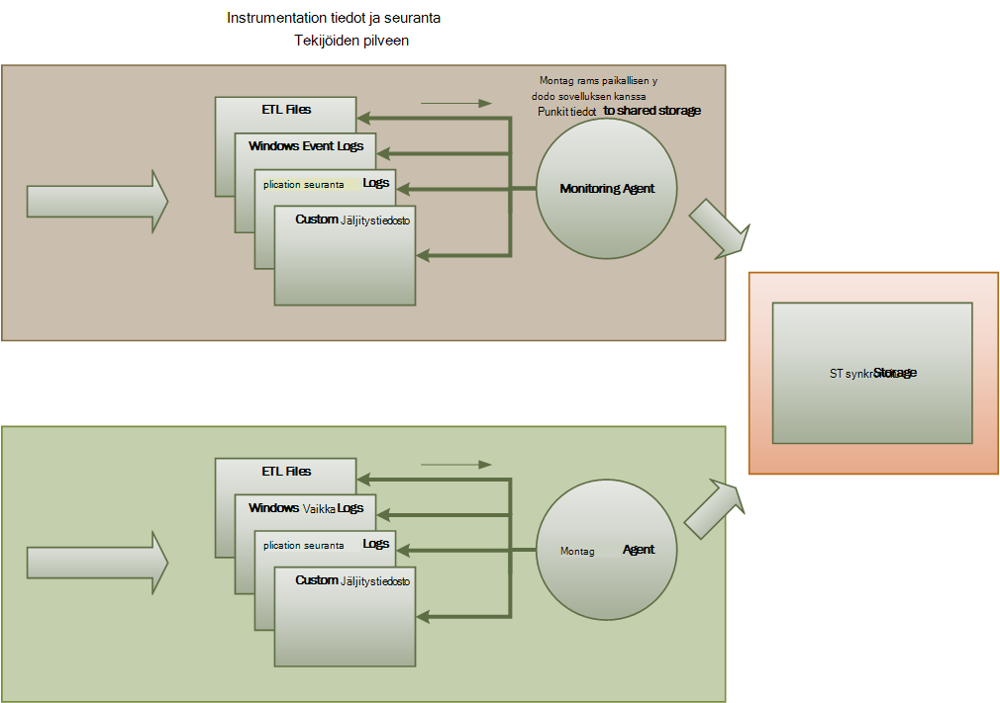

<properties
   pageTitle="Seuranta- ja diagnostiikka ohjeet | Microsoft Azure"
   description="Parhaat käytännöt seuranta välimuisti pilveen."
   services=""
   documentationCenter="na"
   authors="dragon119"
   manager="christb"
   editor=""
   tags=""/>

<tags
   ms.service="best-practice"
   ms.devlang="na"
   ms.topic="article"
   ms.tgt_pltfrm="na"
   ms.workload="na"
   ms.date="07/13/2016"
   ms.author="masashin"/>

# <a name="monitoring-and-diagnostics-guidance"></a>Seuranta- ja diagnostiikka-ohjeet

[AZURE.INCLUDE [pnp-header](../includes/guidance-pnp-header-include.md)]

## <a name="overview"></a>Yleiskatsaus
Jaetut sovellukset ja palveluita pilveen ovat monimutkaisia ohjelmiston laitteita, joka sisältää useita liikkuvat osat ovat sellaisia. Tuotantoympäristössä on tärkeää, että voit seurata tavalla, johon käyttäjät käyttämiseen järjestelmän, jäljitys resurssien käyttö ja seuranta yleensä kunto ja järjestelmän suorituskykyä. Voit tehdä näitä tietoja apuna tunnistaa ja korjaa ongelmia, ja myös Ohje paikkaan mahdollisista ongelmista ja estää ne.

## <a name="monitoring-and-diagnostics-scenarios"></a>Seuranta- ja diagnostiikka-skenaariot
Voit tehdä seuranta Hanki tietoja siitä, miten hyvin järjestelmä toimii. Seuranta on tärkeä osa ylläpito palvelun laatua kohteet. Yleisiä tilanteita, joissa kerääminen seurantatiedot ovat seuraavat:

- Varmistaa, että järjestelmä pysyy kunnossa.
- Seurannan järjestelmän ja sen osat saatavuus.
- Suorituskyvyn varmistamiseksi, että järjestelmä siirtonopeuden ei saa häiritä odottamatta kuin työn kasvaa äänenvoimakkuuden säilyttämiseksi.
- Voimassaolevan, järjestelmä vastaa palvelun tason sopimuksia (palvelutasosopimuksia) asiakkaiden kanssa.
- Suojaa yksityisyyden ja tietosuojan järjestelmän, käyttäjien ja niiden tiedot.
- Seurannan toiminnot, jotka suoritetaan valvonta tai säädösten tarkoitukseen.
- Valvonta järjestelmän ja spotting trendejä, jotka voivat aiheuttaa ongelmia, jos ne eivät ole osoitettu päivittäinen käyttö.
- Seurannan ongelmat, jotka tapahtuvat, ensimmäinen raportti mahdollisia syitä, vahvistavan, seurauksena ohjelmistopäivitykset ja käyttöönotto.
- Jäljitys toiminnot ja virheenkorjaus ohjelmiston versioista.

> [AZURE.NOTE] Tämä luettelo ei ole tarkoitus olla täydellinen. Tämän asiakirjan keskitytään tilanteista kuin yleisimmät tilanteissa tekemistä seurantaa varten. Sinun on ehkä muiden, jotka ovat harvinaisempi tai tietyn-ympäristöön.

Seuraavissa kohdissa kuvataan tarkemmin tilanteista. Kunkin skenaarion tiedot on kuvattu seuraavassa muodossa:

1. Skenaario lyhyesti
2. Tässä skenaariossa tyypillinen vaatimukset
3. Raaka instrumentation tiedot, jotka on tarvitaan, jotta skenaarion ja mahdolliset lähteen tiedot
4. Miten raaka tiedot voit analysoida ja yhdistää kuvaava vianmääritystiedot luomiseen

## <a name="health-monitoring"></a>Kunnon seuranta
Järjestelmä on kunnossa, jos se on käynnissä ja voi käsittely. Kunnon seuranta tarkoituksena on luoda tilannevedoksen järjestelmän nykyinen kunto niin, että olet varmistanut, että kaikki järjestelmän osat toimivat oikein.

### <a name="requirements-for-health-monitoring"></a>: N kunnon valvonta
Operaattori pitäisi saada ilmoituksen nopeasti (sisällä ohjeisiin ja sekunnit), jos järjestelmä osa katsotaan virheelliseksi. Operaattori pitäisi varmistaa, että järjestelmä mitkä osat toimivat yleensä ja mitä osia on ongelmia. Järjestelmän kunnon korostettavissa valo järjestelmän kautta:

- Punainen ja perusasemassa (järjestelmä lakkasi)
- Keltainen osittain kunnossa (järjestelmä toimii rajoitetun toiminnan kanssa)
- Vihreä kokonaan kunnossa

Täydellinen kunnon valvonta järjestelmän avulla voit siirtyä järjestelmän kunto-tila alijärjestelmien ja osien operaattori. Esimerkiksi jos yleinen järjestelmä on kuvattu osittain kunnossa viivalla, operaattori pitäisi lähentäminen ja selvittää, mitä toimintoja ei ole käytettävissä.

### <a name="data-sources-instrumentation-and-data-collection-requirements"></a>Tietolähteiden ja instrumentation tietojen kerääminen vaatimukset
Raaka tiedot, jotka on tarvitaan, jotta kunnon seuranta voi luoda, jotka johtuvat:

- Jäljitys pyynnöt suorittamisen. Nämä tiedot avulla voidaan määrittää, mitkä pyynnöt on onnistui, on epäonnistuneiden ja kuinka kauan sivupyynnön kestää.
- Synteettiset käyttäjän seuranta. Tämä toimenpide varmistaminen käyttäjän suorittamat vaiheet ja seuraa ennalta määritettyjä tietyt vaiheet. Kunkin vaiheen tulokset voi tallentaa.
- Lokiin kirjaaminen poikkeukset, virheet ja varoitukset. Nämä tiedot voi tallentaa tuloksena jäljitys lauseet upotettu sovelluksen-koodiksi sekä tietojen noutaminen services, joka viittaa järjestelmän tapahtumalokit.
- Kolmannen osapuolen palvelut, järjestelmä käyttää tilan seurantaan. Seuranta voi edellyttää hakeminen ja jäsennyksen kunto-tiedot, jotka palveluista antaa. Nämä tiedot voi viedä monia eri mediamuotoja.
- Päätepisteen seuranta. Se on kuvattu tarkemmin "käytettävyys seuranta-osassa.
- Kerääminen ympäröivä suorituskyvyn tiedot, kuten taustan suorittimen käyttö tai i/o (mukaan lukien verkon).

### <a name="analyzing-health-data"></a>Kuntotietojen tietojen analysoiminen
Ensisijainen kohdistus kunnon valvonta on ilmoittaa nopeasti järjestelmä toimii. Kuuma heti tietojen analysointi voivat aiheuttaa ilmoituksen, jos tärkeä osa havaitaan mahdollisimman perusasemassa. (Se ei vastata peräkkäiset numerosarjan Testaa, kuten.) Operaattori jälkeen voit tehdä tarvittavat korjaavat toimenpiteet.

Lisää järjestelmästä saattavat sisältää ennakoivan elementti, joka suorittaa kylmän analyysi uusimpia ja nykyisen työmääriä päälle. Kylmän analyysin avulla voit trendit ja selvittää, onko järjestelmä todennäköisesti pysyvän kunnossa vai onko järjestelmä on lisäresursseja. Tämä ennakoivan elementti perustuvat kriittinen suorituskyvyn mittarit, kuten:

- Jokaisen palvelun tai alijärjestelmää suunnattu pyynnöt korvaus.
- Vastauksen ajat, nämä pyynnöt.
- Äänenvoimakkuuden juoksutus sisään ja ulos kunkin palvelun tiedot.

Jos arvo on mikä tahansa arvo ylittää määritetyn raja, järjestelmä voi nostaa ilmoituksen käyttöön suorittamaan ennaltaehkäiseviä toimintoja tarpeen järjestelmän kunnon säilyttää operaattorin tai automaattisen skaalauksen poistaminen (jos saatavilla). Nämä toiminnot voivat liittyä lisääminen resurssit, uudelleenkäynnistyksen palvelut, jotka eivät läpäise tai rajoittaminen soveltaminen pienempi prioriteetti pyynnöt.

## <a name="availability-monitoring"></a>Käytettävyys seuranta
Todella kunnossa järjestelmä edellyttää, että alijärjestelmien, kirjoita järjestelmä ja osat ovat käytettävissä. Käytettävyys seuranta liittyy läheisesti kunnon valvonta. Mutta kunnon valvonta tarjoaa heti näkymän, jossa järjestelmän nykyinen kunto-käytettävyys seuranta koskee seuranta järjestelmän ja sen osat luomiseen järjestelmän käytettävyyttä tilastotietoja käytettävyyttä.

Useiden järjestelmien joitakin osia (kuten tietokannan) on määritetty sallimaan nopean automaattisesti vakavia vika tai menettäminen joilla. Ihannetapauksessa käyttäjien ei olisi otettava huomioon, että tällainen virhe on tapahtunut. Mutta seuranta perspektiivi saatavuus, on tarpeen kerätä syy ja korjaavat toimia, jotta ne eivät toistuva virheet mahdollisimman paljon tiedot.

Tiedot, jotka on tarvitse seurata käytettävyys saattaa määräytyvät alemman tason tekijöistä. Monia seikoista ehkä sovellus, järjestelmä ja ympäristössä. Tehokas valvonta järjestelmän sieppaa käytettävyystiedot, joka vastaa alatason seikoista ja kokoaa ne ja anna järjestelmän yleinen kuvaksi. Esimerkiksi e commerce-järjestelmässä business-toiminto, joka mahdollistaa asiakkaan tilaukset voi vaihtelevat Tilaustiedot tallennuspaikkaa säilöön ja maksu, joka käsittelee raha tapahtumat maksaa tilauksista varten. Käytettävyys järjestelmän tilauksen sijainti-osa on siksi saatavuudesta tietovaraston ja maksu-alirakenne, funktio.

### <a name="requirements-for-availability-monitoring"></a>Vaatimukset käytettävyys seuranta
Operaattori myös pitäisi voit tarkastella kunkin järjestelmän ja alirakenne historiallisten käytettävyyttä ja tämän toiminnon avulla voit havaita trendejä, jotka saattavat aiheuttaa vähintään yksi alijärjestelmien säännöllisesti epäonnistuu. (Älä services Käynnistä epäonnistuu tiettynä ajankohtana päivämäärän, joka vastaa piikin käsittely tuntia?)

Seurannan ratkaisu olisi Anna heti ja historiallisten näkymän saatavuudesta tai kunkin alirakenne siitä. Lisäksi olisi voi nopeasti ilmoitat operaattori, kun yksi tai useampi services epäonnistuvat tai käyttäjät eivät voi muodostaa palvelut. Tämä on tärkeää paitsi kunkin palvelun seuranta, mutta käsittelystä myös toiminnot, jotka kunkin käyttäjän suorittaa, jos nämä toimet eivät yrittäessään palvelun yhteydessä. Joissakin tapauksissa yhteys epäonnistui aste on Normaali ja voi johtua lyhytkestoisia virheitä. Mutta voi olla hyödyllistä, jotta järjestelmä nostaa ilmoituksen määritetyn alirakenne connectivity siitä tietyn ajanjakson aikana ilmenevät määrä.

### <a name="data-sources-instrumentation-and-data-collection-requirements"></a>Tietolähteiden ja instrumentation tietojen kerääminen vaatimukset
Samoin kuin kunnon seuranta, raaka tiedot, jotka on tarvitaan, jotta käytettävyys seuranta voi luoda tuloksena synteettistä käyttäjän seuranta ja kirjaamisen poikkeukset, virheet ja varoitukset saattaa kadota. Lisäksi käytettävyystiedot saadaan tekemästä päätepisteen seuranta. Sovellus voi näyttää vähintään yhden kunto päätepisteet, toiminta-alueen järjestelmässä kunkin testauksen käyttöoikeus. Valvonta järjestelmän voit ping jokaiselle päätepisteen seuraamalla määritetyn aikataulun ja kerääminen tulokset (success tai virheiden).

Kaikki aikakatkaisu, verkon connectivity virheet ja yhteyden uudelleenyritykset on tallennettava. Kaikki tiedot on oltava aikaleimalla varustettu.

<a name="analyzing-availability-data"></a>
### <a name="analyzing-availability-data"></a>Käytettävyys tietojen analysoiminen
Instrumentation tiedot on koostetaan ja tukevat seuraavia analyysin vaikutus:

- Järjestelmän ja alijärjestelmien heti käytettävyyttä.
- Järjestelmän ja alijärjestelmien käytettävyys virhe-kurssit. Ihannetapauksessa operaattori pitäisi yhdistää tiettyjen toimintojen kanssa virheet: mikä on tapahtuu, kun järjestelmä epäonnistui?
- Historiallinen näyttää virheen korvaukset järjestelmän tai minkä tahansa alijärjestelmien yli jokin määritetty käyttö ja lataa järjestelmän (pyynnöt, esimerkiksi määrä) kun virhe.
- Indeksoitava järjestelmän tai minkä tahansa alijärjestelmien syistä. Esimerkiksi syynä voi olla palvelu ei ole käynnissä-yhteys katkesi, mutta aikakatkaisun ja yhteydessä, mutta palauttaa virheiden yhteydessä.

Voit laskea palvelu prosentti käytettävyyttä ajan kuluessa käyttämällä seuraavaa kaavaa:

```
%Availability =  ((Total Time – Total Downtime) / Total Time ) * 100
```

Tästä on hyötyä SLA tarkoituksiin. ([SLA seuranta](#SLA-monitoring) on kuvattu tarkemmin jäljempänä tässä ohjeita.) Määritys on _käyttökatkot_ määräytyy palvelu. Esimerkiksi Visual Studio tiimin rakentaminen palvelut määritellään käyttökatkot kesto (yhteensä kertynyt minuutteina), jona luominen palvelu ei ole käytettävissä. Minuutti pidetään ei ole käytettävissä, jos kaikki jatkuva pyyntöjen luominen palveluun koko minuutit asiakkaan käynnistämä toimintojen suorittaminen johtaa virhekoodin tai palauta vastausta.

## <a name="performance-monitoring"></a>Suorituskyvyn seurantaa
Kun järjestelmä sijoitetaan enemmän kuormitus-(suurentamalla käyttäjien määrä)-tietojoukkoja, nämä käyttäjät voivat käyttää kasvaa koon ja vähintään yhtä osaa virhe voi ilmetä tulee Yleinen. Usein osan virheen edeltää vähentyä. Jos et pysty tunnistamaan tällaisten vähenemisen voit ryhtyä ennakoiva tilanteen korjaamiseksi.

Järjestelmän suorituskyky määräytyy useista tekijöistä. Kunkin kerroin mitataan yleensä kautta suorituskykyilmaisimia (KPI), kuten sekunnissa tietokannan tapahtumien määrä tai äänenvoimakkuuden etätietokone, jotka ovat onnistuneesti määrä määritetty aikaväli. Kaikki nämä KPI: T ole käytettävissä suorituskykyä mitoiksi, olisi muiden voi olla johdettu yhdistelmän arvot.

> [AZURE.NOTE] Määritettäessä heikko tai hyvän suorituskyvyn edellyttää ymmärtää, jolla järjestelmä on oltava käynnissä voi suorituskyvyn taso. Tämä edellyttää noudattaen järjestelmä, kun se toimii tyypillinen kuormituksen alaisena ja tallentaa tiedot kunkin KPI: n ajan kuluessa. Tämä saattaa edellyttää käynnissä Simuloitu kuormitus järjestelmän testiympäristössä ja kerääminen tarvittavat tiedot, ennen kuin otat järjestelmän tuotantoympäristössä.

> Sinun tulee myös varmistaa, että seuranta suorituskyvyn parantamiseksi ei tule olla työlästä järjestelmään. Voit ehkä säätää dynaamisesti tiedot, jotka prosessin suorituskyvyn kerää tiedot.

### <a name="requirements-for-performance-monitoring"></a>Suorituskyvyn seurantaa koskevat vaatimukset
Tutkia järjestelmän toimintaa operaattori on yleensä lisätietoja, joka sisältää:

- Vastauksen korvaukset pyynnöt.
- Samanaikaiset pyynnöt määrä.
- Äänenvoimakkuuden verkkoliikennettä.
- Mitä Business tapahtumat täytetään kurssit.
- Keskimääräinen pyyntöjen käsittelyaika.

Myös voi olla hyödyllistä lisätä Työkalut, joiden avulla paikkaan korrelaatioita, kuten operaattori:

- Pyyntö viive aikojen (kuinka kauan rekisteröijän Aloita käsittely pyynnön, kun käyttäjä on lähettänyt) ja käyttäjien määrää.
- Käyttäjien ja keskimääräinen vastaus (kuinka kauan kuluvaa aikaa suorittamaan pyyntö, kun se on aloittanut käsittely) määrää.
- Äänenvoimakkuuden pyynnöt ja käsittelyn virheiden määrä.

Tämä toimintojen tietoja, sekä operaattori pitäisi onnistua hankkiminen yksityiskohtainen näkymä kullekin osalle suorituskyvyn järjestelmässä. Nämä tiedot annetaan yleensä alatason suorituskyvyn laskureita, kuten seuraamiseen kautta:

- Muistin käyttö.
- Viestiketjuissa siirtyminen määrä.
- Suorittimen käsittely-aika.
- Pyydä jonon pituuden.
- Levyn tai verkon i/o-korvaukset ja virheet.
- Kirjoitettu tai lukea tavujen määrän.
- Middleware ilmaisimien, kuten jonon pituuden.

Kaikki visualisoinnit kannattaa antaa operaattori määrittää ajan. Näytettävien tietojen ehkä tilannevedoksen nykyisen tilanteen ja/tai historiallista näkymän suorituskykyä.

Operaattori pitäisi nostaa ilmoituksen minkä tahansa määritetyllä aikavälillä suorituskyvyn toimenpide minkä tahansa määritetyn arvon perusteella.

### <a name="data-sources-instrumentation-and-data-collection-requirements"></a>Tietolähteiden ja instrumentation tietojen kerääminen vaatimukset
Voit kerätä korkean tason suorituskykytietoja (siirtonopeuden, käyttäjien määrää, määrä business tapahtumia, virheen korvaukset ja niin edelleen) seuraamalla käyttäjien pyynnöt etenemisen saapuvat ja järjestelmän läpi. Tämä koskee saamiesi jäljitys lauseet osoitteessa sovelluksen-koodin ja ajoituksen tiedot tärkeimmistä asioista. Kaikki virheet, poikkeukset ja varoitukset voi tallentaa riittävästi tietoja hajautettuna ne, jotka aiheuttivat ne pyyntöjen kanssa. Internet Information Services (IIS)-loki on hyötyä toisesta lähteestä.

Jos mahdollista pitäisi myös siepata ulkoiset järjestelmät, jossa sovellus käyttää suorituskykytietoja. Ulkoiset järjestelmät voi säätää suorituskyvyn omia laskureita tai muita ominaisuuksia pyytää suorituskykytietoja. Jos tämä ei ole mahdollista, tietueen tiedot, kuten alkamisaika ja päättymisaika sivupyynnön tehdyt ulkoisen järjestelmän kanssa toiminnon tilan (onnistui, epäonnistuvat tai varoitus). Voit esimerkiksi käyttää ajanottokello-hallintatavan pyynnöt: ajastin pyynnön käynnistyessä ja Lopeta ajastin pyynnön päätyttyä.

Yksittäisten osien järjestelmässä alatason suorituskykytietoja ole käytettävissä ominaisuuksia ja palveluita, kuten Windowsin suorituskykylaskureita ja Azure diagnostiikka kautta.

### <a name="analyzing-performance-data"></a>Resurssitietojen analysoiminen
Paljon analysis-työstä koostuu suorituskyvyn tietojen pyyntö käyttäjätyyppi ja/tai alirakenne tai palvelu, johon sivupyynnön lähetetään. Esimerkki pyytäminen luettelokohteen lisääminen ostoskori tai suorittamiseen maksu-prosessin e commerce-järjestelmässä.

Toinen yleinen vaatimus on yhteenvetojen suorituskyvyn tietojen valitun arvona. Operaattori voi esimerkiksi määrittää vastauksen ajat pyynnöt 99 prosenttia, 95 prosenttia pyynnöt ja 70 prosenttia pyynnöt. Sinun on ehkä määritettävä SLA kohteet tai muiden tavoitteiden määrittäminen kunkin prosenttipisteen. Jatkuva tulokset tulisi ilmoittaa lähelle reaaliajassa heti virheiden havaitsemista avulla. Tulokset myös yhdistetään pitkän ajan tilastoja varten.

Viive ongelmat vaikuttavat suorituskykyyn, jos operaattori pitäisi tunnistaa nopeasti tarkastelemalla jokaisen vaiheen, joka suorittaa sivupyynnön viive pullonkaula syy. Resurssitiedot vuoksi on määritettävä tarkoittaa artikloihin jokaisen vaiheen sitominen ne tiettyyn suorituskyvyn mittarit.

Visualisoinnin-vaatimukset mukaan voi olla hyödyllistä luoda ja tallentaa tietokuutioon, joka sisältää perustietoja näkymiä. Tietoja kuution voit sallia monimutkaisia luonnoslehtiössä kyselyt ja suorituskyvyn tietojen analysoinnin.

## <a name="security-monitoring"></a>Suojauksen seuranta
Kaikki kaupallisen järjestelmät, jotka sisältävät arkaluontoisia tietoja on pantava suojaus-rakenne. Suojaus-järjestelmä monimutkaisuutta on yleensä funktiota tietojen suojaustasoa. Järjestelmä, käyttäjien on todennus-kannattaa tallentaa:

- Kaikki kirjautumisen yritykset, onko ne epäonnistua tai onnistu.
- Kaikki toiminnot maksettavan korvauksen--ja resurssien tietoja käyttää--todennetun käyttäjän.
- Kun käyttäjä lopettaa istunnon ja uloskirjautuminen.

Seurannan välttämättä voi tunnistaa kalastelu järjestelmään. Suuri määrä epäonnistui-kirjautuminen yritykset voi esimerkiksi ilmaista kannalta voimassa hyökkäyksen. Odottamattomia luonnonmullistukset, pyyntöjä voi olla eri aikajaksoille palvelun esto (www.microsoft.com-sivustoa kohtaan) hyökkäystä tulos. Sinun on valmisteltava seurannassa pyynnöt kaikille resursseille nämä pyynnöt lähteen riippumatta. Järjestelmä, joka on heikkous-kirjautuminen saattaa vahingossa paljastaa resurssien ulkopuolelta maailmalle käyttäjä voi itse asiassa kirjautua sisään tarvitsematta.

### <a name="requirements-for-security-monitoring"></a>: N suojaus seuranta
Suojauksen valvonnan kannalta ominaisuuksia Ota operaattorin nopeasti:

- Tunnista yritettiin luvatonta käyttöä Todentamattomille kohteeseen.
- Määritä yritykset yksiköt suorittavat toimintoja, jonka hän ei ole myönnetty access tiedoille.
- Onko järjestelmän tai järjestelmä-osassa hyökkäyksen sisä- tai ulkopuolelle. (Esimerkiksi haittaohjelmien todennettu käyttäjä voi yrittää järjestelmä tuo.)

Tukevat näitä vaatimuksia, operaattori lähetetään ilmoitus:

- Jos yksi tili on toistuva epäonnistui-kirjautuminen yritykset tietyn ajan kuluessa.
- Jos jokin todennettu tili toistuvasti yrittää käyttää kielletty resurssia tietyn ajan.
- Jos suuri määrä Todentamattomille tai luvattoman kauden aikana ilmenee pyynnöt.

Tietoja, jotka on annettu operaattori projektityypin sivupyynnön lähteen Host ()-isäntäosoite. Jos suojauksen virheet johtuvat säännöllisesti osoitteiden tietyn alueen, nämä isännät ehkä estetty.

Avaimen osa ylläpitämiseen järjestelmän suojaus on ei voi tunnistaa nopeasti toiminnot, jotka poiketa tavanomaista kaavaa. Tietoja, kuten epäonnistui ja/tai onnistuneen kirjautumisen pyyntöjen määrä voi näyttää visuaalisesti voit tunnistaa, onko Piikkiin toimintaa epätavallisia aikaan. (Esimerkki tässä aktiviteetti on käyttäjät voivat kirjautua sisään osoitteessa arvon 3.00 ja suorittamassa on runsaasti toimintoja, kun niiden työpäivä alkaa 9:00 AM). Nämä tiedot voidaan myös määrittää ajan perusteella automaattisen skaalauksen poistaminen. Jos operaattori tasapuolisesti, suuri määrä käyttäjiä säännöllisesti Kirjaudu tiettynä ajankohtana päivän operaattori voit järjestää Käynnistä todennus services käsittelee työn määrä ja Sammuta nämä lisäpalveluja, kun piikin läpäissyt esimerkiksi.

### <a name="data-sources-instrumentation-and-data-collection-requirements"></a>Tietolähteiden ja instrumentation tietojen kerääminen vaatimukset
Suojaus on eniten hajautettu järjestelmien kaikki osana näkökohdat. Olennaiset tiedot on todennäköisesti voidaan luoda useita pisteisiin koko järjestelmään. Ota huomioon antamista suojaustietojen ja tapahtuman Management (SIEM) hallintatavan kerää tietoturvaan liittyvät tiedot, joka aiheuttaa tapahtumien aiheutuneet sovelluksen, verkkolaitteet, palvelimet, palomuurit, virustentorjuntaohjelmisto ja tunkeutujia muita osia.

Suojauksen seuranta voit sisällyttää työkaluja, jotka eivät kuulu sovelluksen tiedot. Työkaluja voi sisältää apuohjelmia, joilla voidaan tunnistaa portin tutkimisen aktiviteetit ulkoisen virastoille tai verkon suodattimia, joita havaita yritykset Todentamattomille käyttöösi sovelluksen ja tietojen mukaan.

Kaikissa tapauksissa koottuja tietoja on otettava käyttöön järjestelmänvalvoja voi määrittää, mikä tahansa hyökkäyksen ja suorita vastatoimet.

### <a name="analyzing-security-data"></a>Suojauksen tietojen analysoiminen
Suojauksen seurannan ominaisuus on eri lähteistä, joista tiedot syntyy. Eri muodoissa ja tietojen tason usein vaativat monimutkaisia analyysi siepatun tieto sitominen se yhteen yhdeksi tietojen johdonmukaisen viestiketjun. Yksinkertaisin palvelupyyntöjen (kuten tunnistaminen epäonnistui Kirjaudu apuohjelmat tai toistuvien yritysten kriittinen resurssien luvattoman käyttämään suuri määrä), lukuun ottamatta ei ehkä voi suorittaa minkä tahansa monimutkaisia automaattinen käsittely suojaustietoja. Sen sijaan voi olla parempi kirjoittaa tiedoista aikaleimalla mutta muutoin alkuperäisessä muodossaan suojattuun säilöön asiantuntija manuaalinen analyysia varten.

<a name="SLA-monitoring"></a>

## <a name="sla-monitoring"></a>SLA seuranta
Useiden kaupallisen järjestelmien, jotka tukevat asiakkaita Tee oikeudet järjestelmän suorituskyvystä palvelutasosopimuksia lomakkeeseen. Palvelutasosopimuksia state, järjestelmä voit käsitellä määritetyn aseman tehdyn työn sovittuja aikavälillä ja menettämättä tärkeitä tietoja. Varmistetaan, että järjestelmä täyttävät mitattavissa palvelutasosopimuksia tulevan SLA seuranta.

> [AZURE.NOTE] SLA seuranta läheisesti liittyvät suorituskyvyn seurantaa. Mutta suorituskyvyn seurantaa koskee ja varmistaa, että järjestelmän funktiot _optimaalisesti_, SLA seuranta on noudatettava sopimusvelvoitteen, joka määrittää, mitä _optimaalisesti_ merkitsee.

Palvelutasosopimuksia määritetään usein seuraavien tekijöiden osalta:

- Järjestelmän yleistä käytettävyyttä. Organisaatio voi esimerkiksi takaa, että järjestelmä on käytettävissä 99,9 prosenttia. Tämä vastaa enintään 9 tuntia käyttökatkot vuodessa tai noin 10 minuuttia viikossa tehtävässä.
- Toiminnallisia siirtonopeuden. Tämä osa ilmaistaan usein vähintään yksi suuri – veden jakoviivoihin, esimerkiksi, että järjestelmä tukevat enintään 100 000 samanaikaiset pyynnöt tai käsitellä 10 000 samanaikainen business tapahtumat.
- Toiminnallisia vastausajan. Järjestelmä voi tehdä myös korko, jossa käsitellään oikeudet. Esimerkki on, että kaikki business tapahtumat 99 prosenttia loppuun 2 sekunnin ajan kuluessa ja yksittäisen tapahtumaa kestää kauemmin kuin 10 sekuntia.

> [AZURE.NOTE] Jotkin sopimuksia kaupallisen Systemsin voivat myös lisätä palvelutasosopimuksia asiakastuen. Esimerkki on, että kaikki tukipalveluun pyynnöt merkkirokotteella vastauksen 5 minuutin kuluessa ja että kaikki ongelmat 99 prosenttia täysin osoitetaan 1 työpäivän kuluessa. Tehokas [Seuranta](#issue-tracking) (jäljempänä tässä osassa kuvataan) on kokouksen palvelutasosopimuksia esimerkiksi seuraavia-näppäintä.

### <a name="requirements-for-sla-monitoring"></a>Vaatimukset SLA seuranta
Ylimmällä tasolla operaattori pitäisi onnistua näet yhdellä silmäyksellä, onko järjestelmä on kokouksen sovittuja palvelutasosopimuksia vai ei. Ja jos-operaattori olisi voi siirtyä alaspäin ja tarkastella pohjana tekijät vesiltä suorituskyvyn määrittäminen.

Tyypillinen korkean tason ilmaisimet, joista voi olla edellisessä visuaalisesti ovat seuraavat:

- Palvelun toiminta-aika prosentteina.
- Sovelluksen siirtonopeuden (mitattuna Onnistuneiden tapahtumien ja/tai toimintoja sekunnissa).
- Onnistuneiden/epäonnistumista sovelluksen pyyntöjen määrä.
- Sovelluksen ja järjestelmän virheitä, poikkeukset ja varoitukset määrä.

Kaikki nämä ilmaisimet on pystyttävä tietyn ajanjakson mukaan suodatettu.

Cloud-sovelluksen todennäköisesti muodostavat alijärjestelmien ja -osien määrä. Operaattori pitäisi valita korkean tason ilmaisin ja katsoa, miten se jakautuu pohjana elementit kunto. Esimerkiksi jos yleistä järjestelmän käytettävyyttä kelvollinen arvo, operaattori pitäisi lähentäminen ja selvittää, mitkä osat ovat osaltaan tämän virheen.

> [AZURE.NOTE] Järjestelmän käyttöaika on määritetty tarkasti. Redundancy varmistaaksesi suurin käytettävyys käyttävän järjestelmän yksittäiset esiintymät osien saattaa epäonnistua, mutta järjestelmä voi olla toiminnassa. Kun Puhujan pitämä kunnon valvonta järjestelmän käyttöaika ilmoitettava jokaisen osan kooste käytettävyyttä ja ei välttämättä onko järjestelmä on todella pysäyttää. Lisäksi virheitä saattaa olla eristetty. Jotta vaikka tietyn järjestelmän ei ole käytettävissä, järjestelmä loput voi säilyvät, vaikka pienentyä ominaisuuksien kanssa. (E commerce-järjestelmässä järjestelmässä tapahtui virhe voivat estää asiakkaan tilaukset sijoittaminen mutta asiakkaan edelleen voi selata tuoteluettelon.)

Ilmoitit tarkoituksiin järjestelmän pitäisi nostaa tapahtuman, jos jokin korkean tason ilmaisimet ole määritetty raja-arvoa. Eri tekijöistä, jotka muodostavat korkean tason ilmaisin alemman tason tietoja pitäisi olla käytettävissä suunnattujen varoitusmenetelmien järjestelmään tilannekohtaiset tietoina.

### <a name="data-sources-instrumentation-and-data-collection-requirements"></a>Tietolähteiden ja instrumentation tietojen kerääminen vaatimukset
Raaka tiedot, jotka on tarvitaan, jotta SLA seuranta muistuttaa raaka tiedot, jotka n suorituskyvyn seurantaa ja tietyiltä terveys-ja käytettävyyden seuranta. (Katso lisätietoja osat.) Voit siepata tiedoista mukaan:

- Suorittamiseen päätepisteen seuranta.
- Lokiin kirjaaminen poikkeukset, virheet ja varoitukset.
- Jäljitys pyynnöt suorittamisen.
- Valvonta, järjestelmä käyttää kolmannen osapuolen palvelut käytettävyyttä.
- Suorituskyvyn mittarit ja laskureita käyttäminen.

Kaikki tiedot on aikakatkaistu ja aikaleimalla varustettu.

### <a name="analyzing-sla-data"></a>SLA tietojen analysoiminen
Instrumentation tiedot on koottava järjestelmän suorituskykyyn kuvan luomiseen. Kootut tiedot myös tuettava alirakenteen käyttöön tutkiminen pohjana alijärjestelmien suorituskykyä. Olisi esimerkiksi, että voit:

- Laskee käyttäjäpyyntöjen kokonaismäärä ajanjaksona ja nämä pyynnöt onnistumisesta tai epäonnistumisesta koron määrittäminen.
- Voit yhdistää pyynnöt luomiseen yleisnäkymä järjestelmän vastauksen kertaa vastaus-aikoja.
- Analysoi pyynnöt poistettava vastauksen ajat pyynnön yksittäisiä työ-kohteiden tuominen pyyntö yleinen vasteaikaa etenemisen.  
- Määrittää järjestelmän yleistä käytettävyyttä käytettävyyttä prosentteina kaikki tietyn ajan.
- Analysoi prosentti käytettävyytensä yksittäisiä osia ja palveluja järjestelmässä. Tämä saattaa edellyttää jäsennyksen, joka on luotu kolmannen osapuolen palvelujen lokit.

Monta kaupallisen järjestelmiä tarvitaan raportin reaali suorituskyvyn numeroin sovittuja palvelutasosopimuksia vuosipoiston annettuna kautena, yleensä kuukausi. Nämä tiedot voidaan laskea hyvitykset tai muun takaisinmaksut asiakkaiden Jos ei täyty palvelutasosopimuksia tänä aikana. Voit laskea käytettävyys palvelun kuvattu [analysoiminen käytettävyystiedot](#analyzing-availability-data)kuvatulla tavalla.

Sisäisiin tarkoituksiin organisaatio voi myös seurata numero ja tapahtumat, jotka aiheuttivat palvelujen laatu. Näiden ongelmien nopeasti tai poistaa ne kokonaan, miten avulla vähentämiseksi käyttökatkot ja täytä palvelutasosopimuksia.

## <a name="auditing"></a>Valvonta
Sen mukaan, sovelluksen laatu voi olla lakisääteisten tai laillisten sääntöjen, jotka määrittävät käyttäjien-toimintojen tarkistaminen ja tallennuksen kaikkien tietojen käyttöä koskevat vaatimukset. Seuranta voit antaa näyttöä tietyn pyyntöihin linkkejä, että asiakkaat. Muut hylkäämistä on monta sähköisen liiketoiminnan järjestelmien avulla voidaan ylläpitää luota tärkeä tekijä on oltava asiakas-, joka on vastuussa sovelluksen tai palvelun organisaation.

### <a name="requirements-for-auditing"></a>Valvonnan vaatimukset
Henkilön on voitava muodostaa jäljittää business toiminnoista, joita käyttäjät ovat suorittamiseen niin, että voit uudistaa käyttäjien toiminnot järjestyksessä. Tämä voi olla tarpeen, riittää, että ohjeisiin ja tietueen tai lainmukaisten tutkimuksen osana.

Valvontatietoja on erittäin. Tietoja, jotka määrittävät järjestelmä-ja tehtävät, jotka ne suoritetaan käyttäjät todennäköisesti sisällytetään. Tästä syystä valvontatietoja todennäköisesti vievät raportteja, jotka ovat käytettävissä vain luotettavien analyytikot lomakkeen sijaan vuorovaikutteinen järjestelmää, joka tukee alirakenteen graafinen-toimintoa. Henkilön pitäisi voit luoda erilaisia raportteja. Raporttien voi esimerkiksi luettelon kaikkien käyttäjien toimintoja määritetyn ajanjakson aikana, Tietotyylit yksittäisen käyttäjän toiminnan aikajärjestyksen tai luettelon yhden tai useamman resurssin vastaan suoritettavien toimintojen sarjan.

### <a name="data-sources-instrumentation-and-data-collection-requirements"></a>Tietolähteiden ja instrumentation tietojen kerääminen vaatimukset
Tietoja tarkistaminen ensisijainen tietolähteiden voi olla:

- Suojauksen järjestelmä, joka hallitsee käyttöoikeuksien.
- Jäljitä, joka tallentaa käyttäjän toimintojen lokitiedot.
- Suojaus, seurata kaikkia tunnistaa ja selvittämättömissä etätietokone lokitiedot.

Valvontatietojen ja missä se on tallennettu tapaa, jolla voi perustuva lainmukaisia mukaan. Esimerkiksi ehkä ole mahdollista Puhdista minkäänlaista tiedot. (Se on tallennettava alkuperäisessä muodossaan.) Accessin säilöön, jossa se pidetään suojattava luvattoman muokkaamisen estämiseksi.

### <a name="analyzing-audit-data"></a>Valvontatietojen analysoiminen
Henkilön on oltava voivat käyttää raaka tiedot kokonaisuudessaan alkuperäisessä muodossaan. Yleisiä valvonta-raporttien luomiseen vaatimus lukuun ottamatta Työkalut tietojen analysointiin on todennäköisesti muokattava ja säilyttää ulkoiseen järjestelmään.

## <a name="usage-monitoring"></a>Käyttö seuranta
Miten ominaisuuksia ja sovelluksen osia käytetään käyttö seuranta seuraa. Operaattori käyttää koottuja tietoja, voit:

- Määrittää, mitä ominaisuuksia on raskaasti kuormitettu ja määrittää kaikki mahdolliset kohdepisteet järjestelmässä. Suuri liikenteen elementit hyötyä toimintojen jakaminen tai jopa replikoinnin levittämällä kuormituksen tasaisemmin. Operaattori käyttää myös nämä tiedot, mitä ominaisuuksia käytetään harvoin, ja se on mahdollista ehdokkaiden käytöstä poistaminen tai korvaaminen tulevien järjestelmä-versiossa.
- Hanki tavanomaisessa käytössä järjestelmän toiminnallisia tapahtumien tietoja. Esimerkiksi e commerce-sivustossa, voit tallentaa tapahtumien määrä ja asiakkaille, jotka ovat vastuussa äänenvoimakkuuden tilastotietoja. Nämä tiedot voidaan kapasiteetin suunnittelun, kun asiakkaiden määrä kasvaa.
- Tunnista (mahdollisesti epäsuorasti) tyytyväisyyttä suorituskyvyn tai järjestelmän toimintaa. Esimerkiksi jos suuri määrä asiakkaiden e commerce järjestelmän hylkää säännöllisesti niiden ostoskoreja, syynä voi olla ongelmia maksu-toiminnon.
- Luo laskutustietoja. Kaupallinen sovelluksen tai multitenant palvelun saattaa veloittaa asiakkaat, jotka käyttävät resurssien.
- Pakota kiintiön. Jos käyttäjä multitenant järjestelmässä ylittää niiden maksettu kiintiön käsittelyn aika- tai Resurssien käyttö tietyn ajanjakson aikana, niiden käyttö voidaan rajoittaa tai käsittely on rajoitettu.

### <a name="requirements-for-usage-monitoring"></a>: N käytön valvonta
Tarkistaa järjestelmässä käyttö operaattori on yleensä lisätietoja, joka sisältää:

- Pyynnöt, jotka ovat käsitelleet kunkin Alirakenne ja ohjataan kullekin resurssille määrä.
- Työmäärä, jonka kunkin käyttäjän tekemistä.
- Tietojen tallentaminen, kukin käyttäjä vie äänenvoimakkuuden.
- Resurssit, joka käyttää kullekin käyttäjälle.

Operaattori myös pitäisi kaavioiden luomiseen. Esimerkiksi kaaviona eniten resurssi-onko nälkä käyttäjät voivat näkyä tai käyttää useimmin resursseja tai järjestelmän ominaisuuksia.

### <a name="data-sources-instrumentation-and-data-collection-requirements"></a>Tietolähteiden ja instrumentation tietojen kerääminen vaatimukset
Seurannan käyttö voidaan suorittaa suhteellisen ylätasolla. Voit Huomautus jokaisen pyynnön alkamis- ja päättymisajat ja laatu pyynnön (luku, kirjoittaminen ja niin edelleen sen mukaan, kyseisen resurssin). Voit hankkia niitä:

- Käyttäjän toiminnan jäljittämisen.
- Tallentaa suorituskyvyn laskureita, joissa mitataan kullekin resurssille käyttö.
- Seuranta resurssin kulutus antamalla kullekin käyttäjälle.

Varten niin, että tarkoituksiin, myös haluat, että voit määrittää käyttäjät, jotka ovat vastuussa suorittamiseen, mitkä toiminnot ja resurssit, jotka käyttävät näitä toimintoja. Kootun tietojen on oltava riittävän tarkkoja Laskutus yksityiskohtaiset.

<a name="issue-tracking"></a>
## <a name="issue-tracking"></a>Seuranta
Asiakkaat ja muut käyttäjät voivat raportoida ongelmista, jos odottamattomia tapahtumia tai ongelma ilmenee järjestelmän. Seurantaa koskee hallinta ongelmaan, liittäminen tehokkuutta järjestelmän kaikki pohjana ongelmien ratkaisemiseen ja kertoa ratkaisuja asiakkaille.

### <a name="requirements-for-issue-tracking"></a>Seurantaa koskevat vaatimukset
Operaattorit suorittavat käyttämällä eri järjestelmä, joka sallii ne tietueeseen ja raportin tietoja ongelmien seurantaa usein käyttäjien raportti. Nämä tiedot voi sisältää tehtäviä, jotka käyttäjä yritti suorittaa, oireita ongelma, tapahtumien järjestys ja virhe tai varoitus viestejä, jotka on annettu.

### <a name="data-sources-instrumentation-and-data-collection-requirements"></a>Tietolähteiden ja instrumentation tietojen kerääminen vaatimukset
Seurantakohteiden tiedot alkuperäisen tietolähteen on raportoinut ongelman ensiksi käyttäjä. Käyttäjä voi olla voi antaa muita tietoja seuraavasti:

- Kaatumisvedosta (Jos sovellus on osa, joka suoritetaan käyttäjän työpöytä).
- Näytön tilannevedoksen.
- Päivämäärä ja kellonaika, jolloin virhe, ja muut ympäristön tiedot kuten käyttäjän sijainti.

Nämä tiedot voidaan muistin työmäärään ja käyttää tulevissa versioissa ohjelmiston keskeneräisen Ohje.

### <a name="analyzing-issue-tracking-data"></a>Seurantakohteiden tietojen analysoiminen
Eri käyttäjät voivat raportoida sama ongelma. Seurantakohteiden järjestelmä olisi Liitä yleisissä raporteissa.

Muistin työmäärään etenemisen merkitään ongelman raporttien vastaan. Kun ongelma on ratkennut, voit ilmoituksen Asiakas-ratkaisun.

Jos käyttäjä raportoi ongelmasta, joka on tunnetut ratkaista ongelman seuranta-järjestelmässä, operaattori pitäisi ilmoittaa ratkaisun käyttäjän heti.

## <a name="tracing-operations-and-debugging-software-releases"></a>Jäljitys toiminnot ja virheiden ohjelmiston versioista
Kun käyttäjä ilmoittaa ongelma, käyttäjän on usein vain tietoinen suorin vaikutus, jossa se on niiden toimintojen. Käyttäjä voi vain raportoi omia kokemus tulokset operaattori, joka vastaa ylläpidon järjestelmä. Nämä kokemukset ovat yleensä vain näkyvä Oire yksi tai useita keskeisiä ongelmia. Monissa tapauksissa henkilön on tarkastella pohjana toimintojen muodostaa ongelman pääkansion syyn aikajärjestyksen kautta. Tätä prosessia kutsutaan _pääkansion aiheuttaa analyysi_.

> [AZURE.NOTE] Pääkansio syy analyysi voi avata tehottomuudet sovelluksen rakenteessa. Näissä tilanteissa voi olla mahdollista Uudista tarvittavien elementit ja ota ne myöhemmin release osana. Tämä prosessi edellyttää varovainen ohjausobjekti ja päivitetyt osat on seurattava tarkasti.

### <a name="requirements-for-tracing-and-debugging"></a>Jäljitys- ja virheenkorjaus vaatimukset
Jäljitys odottamattomia tapahtuma- ja muita ongelmia, se on tärkeä, että tiedot on tarpeeksi tietoa käyttöön henkilön jäljittää takaisin ongelmaan alkuperän ja uudistaa on tapahtunut järjestyksen. Nämä tiedot on oltava riittävä käyttöön henkilön vianmääritys pääkansion aiheuttaa ongelmia. Kehittäjä voi Tee haluamasi muutokset, jotta ne eivät toistuva.

### <a name="data-sources-instrumentation-and-data-collection-requirements"></a>Tietolähteiden ja instrumentation tietojen kerääminen vaatimukset
Vianmääritys voi liittyä jäljitys kaikki menetelmät (ja niiden parametrit) kutsuttu korjaustoiminnon puun, joka esittää järjestelmän looginen kulku, kun asiakas tekee erityinen pyyntö laatia osana. Poikkeukset ja varoitukset, järjestelmä luo tuloksena tämä työnkulku on tallennetaan ja kirjautunut.

Järjestelmä tarjota tukemaan virheenkorjaus koukut, jotka mahdollistavat operaattori kannattaa tallentaa tiedot tärkeitä pisteisiin järjestelmässä. Tai järjestelmän voit näyttää valitun toimintojen edistymisestä yksityiskohtaisia vaiheittaisia ohjeita. Siepata tietojen tällä tasolla niiden välillä voi asettaa järjestelmä lisää kuormitus ja pitäisi olla tilapäinen prosessi. Operaattori käyttää tätä prosessia pääasiassa, kun erittäin epätavallisia sarjan tapahtumien tapahtuu ja on vaikea replikoida tai uuden version elementteihin järjestelmään edellyttää varovainen seuranta varmistaa, että osat-funktion odotetulla tavalla.

## <a name="the-monitoring-and-diagnostics-pipeline"></a>Seuranta- ja diagnostiikka-myyntijakso
Suurissa jaetun järjestelmän valvonta aiheuttaa merkittäviä hankala. Kunkin tilanteita, joissa on edellisessä osassa kuvattua ei välttämättä ole voidaan pitää yksinään. Ei todennäköisesti merkittäviä limitys valvonta ja tietoihin, jotka on tarvittavat kunkin tilanteen, vaikka tämä tieto on ehkä käsitellään ja esitetään eri tavoilla. Seuraavien syiden takia olisi otettava kokonaisvaltaiseksi näkymän seuranta-ja Diagnostiikka.

Koko seuranta- ja diagnostiikka-prosessi voi tehdään kuin putkijohto, joka sisältää kuvassa 1 vaiheita.


_Kuva 1. Seuranta- ja diagnostiikka-myyntijakso vaiheet_

Kuva 1 korostaa miten seuranta- ja diagnostiikka tiedot voivat olla peräisin useisiin tietolähteisiin. Instrumentit ja sivustokokoelman vaiheet ovat tulevan tunnistaminen lähteet-kohtaa, johon tiedot vaativat voi tallentaa, tarkistamalla, mitä tietoja haluat siepata, voit tallentaa sen ja muotoilusta tiedoista siten, että se voidaan tutkia helposti. Analyysin/vianmäärityksen vaihe kestää perustietoja ja käyttää sitä Luo merkityksellinen tietoja, operaattori avulla voit selvittää järjestelmän tilasta. Operaattori voit tämän toiminnon avulla voit tehdä päätöksiä mahdolliset toiminnot tulevat ja syötteen sitten takaisin instrumentation ja sivustokokoelman vaiheen tulokset. Jakson vaiheen visualisointi/ilmoitat näkyy järjestelmätilan kulutettavia näkymän. Se voi näyttää tiedot lähelle reaaliajassa raporttinäkymien sarja käyttämällä. Ja se voi luoda raportit, kaaviot ja kaavioita antamaan historiallisten näkymän tiedot, jotka pitkään trendien tunnistamista. Jos tiedot osoittaa, että Suorituskykyilmaisimen on todennäköisesti ylitä hyväksyttävä rajojen, tässä vaiheessa voit käynnistää ilmoituksen operaattori. Joissakin tapauksissa ilmoituksen voi käyttää myös käynnistettävän automatisoidun prosessin, joka yrittää toimintoja korjaavat, kuten automaattisen skaalauksen poistaminen.

Huomaa, että nämä vaiheet muodostavat jatkuva työnkulun prosessin missä vaiheet tapahtuu rinnakkain. Ihannetapauksessa kaikissa vaiheissa on oltava dynaamisesti määritettäviä. Jotkin pisteisiin erityisesti silloin, kun järjestelmä on otettu juuri tai ilmenee ongelmia, se täytyy mahdollisesti kerätä tietoja laajennetusta useammin välein. Joskus pitäisi olla mahdollista palata sieppaus perustaso olennaiset tiedot, voit varmistaa, että järjestelmä toimii oikein.

Lisäksi seurantaa päivitysprosessin olisi otettava huomioon live, meneillään oleviin ratkaisu, joka on tarkka määrittäminen ja parannukset tuloksena palautetta. Voit aloittaa esimerkiksi kanssa mittaaminen monet eri tekijät, voit selvittää järjestelmän kunnon. Analyysin ajan kuluessa saattaa johtaa tarkennuksen kuin hylkäät toimenpiteitä, joita ei ole merkitystä, joten voit keskittyä tarkemmin tarvitsemasi tiedot aikana pienentäminen taustaäänet.

## <a name="sources-of-monitoring-and-diagnostic-data"></a>Valvonta ja tietolähteet
Tietoja, joiden seurannan prosessi voi tulla useista lähteistä, kuten kuvassa 1. Sovelluksen tasolla tiedot tulevat Jäljityslokit sisällytetty järjestelmän koodi. Kehittäjät pitäisi seurata vakio lähestymistapa seuraamista niiden koodilla hallinnan kulun varten. Esimerkiksi merkinnän menetelmän voi lähettää jäljitys-sanoma, joka määrittää nimen, menetelmä, nykyisen kellonajan, arvon kullekin parametrille ja muut tarvittavat tiedot. Tallennuksen ja -aikoja myös todistaa hyödyllisiä.

Kirjaudu kaikki poikkeukset ja varoitukset ja varmistaa säilyttää koko jäljityksen sisäkkäisiä poikkeukset ja varoitukset. Ihannetapauksessa pitäisi myös siepata tietoja, joka määrittää käyttäjälle, joka toimii koodi-ja tehtävätiedot korrelaatio (voit seurata pyynnöt ne kulkevat järjestelmä). Ja olisi Kirjaudu yrittää käyttää kaikki resurssit, kuten viestin olevien, tiedostot, ja muut riippuvaiset palvelut. Nämä tiedot voidaan niin, että ja tarkistaminen tarkoituksiin.

Tehdä useita sovelluksia kirjastojen ja kehysten avulla suorittaa yleisiä tehtäviä, kuten käyttäminen tietosäilö tai yhteydessä verkon kautta. Nämä kehysten voi olla oman jäljitys viestejä sekä raaka vianmääritystiedot, kuten tapahtuman korvaukset ja tietojen siirto onnistuu ja virheet on määritettävä.

> [AZURE.NOTE] Monta Moderni kehysten julkaista automaattisesti suorituskyky ja Jäljitä tapahtumat. Yksinkertaisesti tietojen hakeminen ja tallentaa sen kohtaa, johon se voidaan käsitellä ja analysoida on määrittänyt nämä tiedot.

Käyttöjärjestelmä, jossa sovellus on käynnissä voi olla lähteen alatason järjestelmää tietoja, kuten suorituskyvyn laskureita, jotka osoittavat, i/o palkat, muistin käytön ja suorittimen käyttö. Käyttöjärjestelmän virheitä (kuten virheen, voit avata tiedoston oikein) myös ehkä raportoitu.

Ota huomioon myös pohjana infrastruktuuri- ja osat, järjestelmä toimii. Näennäiskoneiden, virtual verkoissa ja tallennustilaa palvelut voivat kaikki olla lähteiden tärkeitä infrastruktuurin tason suorituskyvyn laskureita ja muut diagnostiikkatiedot.

Jos sovellus käyttää muita ulkoisia palveluja, kuten verkkopalvelin tai tietokannan hallintajärjestelmän palveluista voi julkaista oman jäljitystiedot, lokit ja suorituskyvyn laskureita. Esimerkkejä SQL Serverin dynaaminen hallinta näkymät SQL Server-tietokannalle suoritetaan toimintojen seurannassa ja IIS jäljitys kirjautuu tallentaminen verkkopalvelimeen pyyntöihin.

Järjestelmän osat muokataan ja uusia versioita on otettu käyttöön, on tärkeää määrite ongelmista, tapahtumia ja mittarit jokaisessa versiossa. Nämä tiedot on sidottu takaisin release putkijohto, niin, että tietyn osan version ongelmia voi seurata nopeasti ja korjaamiseksi.

Suojauksen mainitut ongelmat voivat ilmetä milloin tahansa järjestelmässä. Esimerkiksi käyttäjä yrittää kirjautua virheellinen Käyttäjätunnus ja salasana. Todennetun käyttäjän voi yrittää saada luvattomasti resurssille. Tai käyttäjän antaa virheelliset tai vanhentuneet avainta salattuja tietoja. Onnistuneiden ja kaatuvat pyynnöt tietoturvaan liittyvät tiedot aina oltava kirjautuneena.

[Instrumenting sovelluksen](#instrumenting-an-application) osa sisältää tietoja, jotka kannattaa tallentaa lisäohjeita. Mutta erilaisia strategioita avulla voit kerätä nämä tiedot:

- **Sovelluksen/järjestelmän valvonta**. Tämä käyttää sovelluksen, sovelluksen puitteissa, käyttöjärjestelmä ja infrastruktuurin sisäinen lähteiden. Sovelluksen koodin voivat luoda omia huomattavat pisteisiin-tietojen valvominen asiakkaan pyynnön elinkaaren aikana. Sovellus voi olla jäljitys lausekkeita, jotka saattavat olla valikoivasti käytössä tai poissa käytöstä, kun tilanteissa määräävät. Myös ehkä voi lisätä diagnostiikka dynaamisesti käyttämällä diagnostiikka kehys. Nämä kehysten tarjoavat yleensä laajennukset, jotka koodisi instrumentation kohtia liittäminen ja siepata jäljitystiedot nämä pisteisiin.

    Lisäksi koodin ja/tai pohjana oleva infrastruktuuri voi käynnistää kriittinen pisteisiin tapahtumia. Agenttien vuoksi, jotka on määritetty kuunteleminen näiden tapahtumien seuranta voit kirjata tapahtumatiedot.

- **Todellinen käyttäjä seuranta**. Tätä tapaa kannattaa tallentaa käyttäjän ja sovelluksen vuorovaikutuksesta ja noudata etenemisen kunkin pyynnön ja vastauksen. Näitä tietoja voi olla kaksi taitettu tarkoitus: sitä voidaan käyttää varten niin, että käyttö kunkin käyttäjän ja sen avulla voidaan määrittää, onko käyttäjät saavat sopivan laatuun palvelu (esimerkiksi nopea vastausajat, pieni viive ja mahdollisimman vähän virheet). Siepatun tietojen avulla voit alueet huolta virheet esiintymiskohdan useimmin. Voit käyttää myös tietojen tunnistavan osat missä järjestelmän hidastaa, mahdollisesti kohdepisteet sovelluksessa tai muussa muodossa, pullonkaula vuoksi. Jos otat tämän menetelmän huolellisesti, voi olla mahdollista uudistaa käyttäjien kulkee virheenkorjaus ja testausta sovelluksen kautta.

    > [AZURE.IMPORTANT] Ota huomioon tiedot, joita seuraamalla reaali käyttäjät voivat olla erittäin, koska ne saattavat sisältää luottamuksellisia tietoja, kirjataan. Jos tallennat siepatun tiedot, tallenna se suojatusti. Jos haluat käyttää tietoja suorituskyvyn seurantaa tai vianmääritystä, poistaa kaikki henkilökohtaisia tietoja ensin.

- **Synteettiset käyttäjän seuranta**. Tämä vaihtoehto voit kirjoittaa omia testi asiakkaan varmistaminen käyttäjän ja suorittaa toimintoja määritettäviä mutta tyypillinen sarjaa. Voit seurata suorituskykyä testiasiakas voi selvittää järjestelmän tilasta. Voit käyttää myös useita kertoja testi asiakkaan osana kuormituksen testaaminen toimintoa miten järjestelmä reagoi kuormitus ja miltä seuranta tulosteen luodaan näissä tilanteissa.

    > [AZURE.NOTE] Voit ottaa käyttöön reaali- ja käyttäjän seuranta sisällyttämällä koodi jäljittää ja aikoina menetelmäkutsujen ja muita tärkeitä osia sovelluksen suorittamista.

- **Profilointi**. Sovelluksen Logging ensisijaisesti suunnattu tätä tapaa. Sen sijaan, että liiketoiminnan toimintojen tasolla reaali- ja käyttäjän seuranta, sieppaa alemman tason tiedot sovelluksen suoritetaan. Voit ottaa käyttöön profiloinnin käyttämällä säännöllisiä näytteiden suorittamisen tilan sovelluksen (tarkistamalla, mitä osan tunnus, jolla sovellus on käynnissä tiettynä ajankohtana). Voit käyttää myös instrumentation, joka lisää keräysputkien koodiksi tärkeitä junctures (kuten alkamis- ja päättymispäivät menetelmä puhelun), ja tallentaa mitä menetelmiä on kutsuttu ajankohtaa, ja kuinka kauan kunkin puhelun noudatit. Voit analysoida sitten tiedoista, voit selvittää, mitä sovelluksen osia voi aiheuttaa suorituskykyongelmia.

- **Päätepisteen seuranta**. Tätä tapaa käyttää diagnostiikan päätepisteet, sovelluksen paljastaa erityisesti, jos haluat ottaa käyttöön seuranta. Päätepisteen sisältää polun sovelluksen-koodiksi, ja se voi palauttaa tietoja järjestelmän kunnon. Eri päätepisteet voit keskittyä toimintoja eri ominaisuuksia. Voit kirjoittaa omia diagnostiikka-asiakas, joka lähettää nämä päätepisteet säännöllisiä pyynnöt ja vastaukset omaksua. Tämän menetelmän esitetään Lisää [Kunto päätepisteen seuranta kuvion](https://msdn.microsoft.com/library/dn589789.aspx) Microsoft-sivustossa.

Suurin kattavuussuunnittelua käytettävä yhdistelmä seuraavilla tavoilla.

<a name="instrumenting-an-application"></a>
## <a name="instrumenting-an-application"></a>Sovelluksen instrumenting
Instrumentation on tärkeä osa seurannan yhteydessä. Voit tehdä kuvaava päätöksiä suorituskykyä ja järjestelmän kunto vain, jos ensin siepata, joka mahdollistaa päätösten nämä tiedot. Tietoja, jotka sinulla on tarvitsemasi käyttämällä instrumentation riittää, joiden avulla voit arvioida suorituskykyä ja ilmenneet päätösten niin, ettei sinun on kirjauduttava remote tuotannon palvelimen suorittamiseen jäljitys (ja virheenkorjaus) manuaalisesti. Instrumentation tiedot sisältävät yleensä arvot ja tietoja, jotka on kirjoitettu jäljityksen lokit.

Sisällön jäljitysloki voi olla tuloksen tekstitietoja, joka on kirjoitettu sovellus tai binaaritietoja, joka on luotu Jäljitystapahtuman tuloksena (Jos sovellus käyttää tapahtuman jäljitys for Windows – tapahtumien seuranta). Ne voidaan luoda myös järjestelmän lokien, joka tallentaa tapahtumat johtuvat infrastruktuuri, kuten verkkopalvelimeen osat. Tekstimuotoinen lokin viestejä käsitellään usein on luettavassa, mutta ne myös on kirjoitettava muodossa, joka mahdollistaa järjestelmän jäsentää helposti.

Kannattaa myös luokitella lokitiedot. Älä kirjoita kaikki jäljitystiedot yhden lokin, mutta eri lokit avulla voit tallentaa jäljitystiedot-järjestelmän eri toiminnallisia ominaisuuksia. Voit sitten suodattaa nopeasti lokin viestejä luettaessa oikean lokin sen sijaan, että on käyttänyt yhteen pitkiä tiedostoon. Ei koskaan kirjoita tiedot, joka on saman lokin eri suojausvaatimukset (kuten valvontatietoja ja virheiden tiedot).

> [AZURE.NOTE] Lokiin voi toteuttaa tiedostojärjestelmässä-tiedostona tai se voi pitää jossakin muussa muodossa, kuten Blob-objektien Blob-objektien tallennustilaan. Lokitiedot voi myös pidettävä Lisää rakenteisista, kuten taulukon rivejä.

Arvot yleensä on mittayksikön tai määrä joitakin kuvasuhde tai resurssin järjestelmän tiettynä ajankohtana, liittyvistä tunnisteista tai mitat (kutsutaan joskus _malli_). Yksittäisen esiintymän mittarin ei yleensä hyödyllistä, kun yksinään. Sen sijaan arvot on voi tallentaa ajan kuluessa. Huomioon otettavat avaimen ongelma on voidaan tallentaa mitä arvot ja kuinka usein. Arvot tiedoista luodaan liian usein voivat asettaa merkittäviä muita kuormituksen järjestelmän olisi siepata arvot harvoin voivat aiheuttaa jää huomaamatta tapaukset, liidin tärkeää tapahtumaa. Seikat vaihtelevat metrijärjestelmä arvo. Esimerkiksi suorittimen käyttö palvelimessa saattavat vaihdella merkittävästi toisen toisen, mutta suuri käyttö on ongelma vain, jos se on pitkäikäiset minuuttimäärä, jonka kautta.

<a name="information-for-correlating-data"></a>
### <a name="information-for-correlating-data"></a>Lisätietoja hajautettuna tiedot
Voit helposti valvoa yksittäisiä järjestelmän tason suorituskyvyn laskureita, siepata mittaukset resurssit ja hankkia sovelluksen jäljitystiedot eri lokitiedostoista. Mutta jotkin lomakkeiden seurannan vaadi seurantaa myyntijakso voit yhdistää tiedot, jotka on haettu useista lähteistä analysointia ja diagnostiikka-vaiheessa. Näitä tietoja voi kestää useita lomakkeita perustietoja ja analyysiprosessi on annettava riittävät instrumentation tiedot voi yhdistää eri lomakkeita. Esimerkiksi sovelluksen framework tasolla tehtävän voi tunnistetaan viestiketjun on. Sovelluksesta samaan työhön voi olla liitetty käyttäjälle myönnettävät suorittaman tehtävän Käyttäjätunnus.

Myös ei todennäköisesti ole 1:1 yhdistäminen välillä viestiketjuissa siirtyminen ja pyynnöt, koska asynkronisten toimintojen voi käyttää samaa viestiketjuissa siirtyminen useamman kuin yhden käyttäjän puolesta toimintojen suorittaminen. Voit vaikeuttaen asioita tarkemmin, yksittäisen pyynnön voi käsitellä useita viestiketjun kuin suorittamisen kulkee järjestelmän kautta. Sivupyynnön liittämällä yksilöivän tehtävän ID, jolla on välitetty järjestelmän kautta osana pyynnön yhteydessä, jos se on mahdollista. (Luomisessa ja myös tehtävän tunnukset jäljitystiedot tekniikka määräytyy tekniikka, jota käytetään tietojen jäljitys.)

Kaikki tiedot on oltava aikaleimalla samalla tavalla. Yhdenmukaisuuden tallentaa kaikki päivämäärät ja kellonajat käyttämällä UTC-aika. Tämä auttaa helpommin tapahtumien seuranta sarjaa.

> [AZURE.NOTE] Aikavyöhykkeillä ja verkkojen tietokoneita ei voi synkronoida. Älä määräytyvät sen mukaan, hajautettuna instrumentation tiedot, jotka kattavat muun muassa useiden laitteiden aikaleimat yksin käytön.

### <a name="information-to-include-in-the-instrumentation-data"></a>Instrumentation-tietojen sisällytettävät tiedot
Kun mietit, mitä haluat kerätä instrumentation-tietoja, ota huomioon seuraavat seikat:

- Varmista, että Jäljitä tapahtumien kerätyistä tiedoista on tietokoneen luettavissa. Hyväksyy tämän tietoja helpottamiseksi automaattinen käsittely tietoja järjestelmiin ja antamaan yhdenmukaisuuden toiminnot ja tekniikka henkilökunnan lukeminen lokit hyvin määritettyjä malleja. Sisällytä ympäristön tiedot, kuten käyttöönotto-ympäristössä, jossa prosessi on käynnissä, prosessi ja puhelun pino tietoja tietokoneen.  
- Ota käyttöön profilointi vain silloin, kun se on tarpeen, koska se asettaa merkittäviä katseltavan järjestelmään. Käyttämällä instrumentation profilointi tietueiden tapahtuman (kuten menetelmäkutsu) aina, kun se esiintyy, olisi näyte tietueet vain valitut tapahtumat. Valinnan voi olla aikapohjaisten (kerran *n* sekunnin välein), tai taajuus-pohjainen (kun joka *n* pyytää). Jos tapahtumien hyvin usein, profilointi mukaan instrumentation saattaa aiheuttaa liikaa olla työlästä ja itse vaikuttaa suorituskykyyn. Tässä tapauksessa esimerkkejä lähestymistapa voi olla parempi. Kuitenkin tapahtumien korkojakso on pieni, kun otos, jota voi huomaamatta ne. Tässä tapauksessa instrumentation ehkä vaihtoehto.
- Riittävän asiayhteyden käyttöön kehittäjä tai Järjestelmänvalvojat voivat määrittää sivupyynnön lähde. Tämä saattavat sisältää joitakin lomakkeen tehtävän tunnus, joka määrittää pyyntö työnkulun esiintymään. Voivat myös lisätä tiedot, jotka voidaan yhdistää tässä aktiviteetti laskennallinen työn ja resurssit. Huomautus työn ehkä toimintojen prosessi- ja Kuormitusryhmä rajat. Varten niin, että, yhteydessä sisältyy myös (joko suoraan tai epäsuorasti Korreloidun kautta muita tietoja) asiakas, joka aiheuttaa pyyntö tehdään viittaus. Tässä yhteydessä on tärkeitä tietoja sovelluksen tilan suunnitellut aloittamispäivämäärät, jotka tiedot sieppaaminen.
- Tallenna kaikki pyynnöt ja sijainnit- tai alueet, josta nämä pyynnöt tehdään. Nämä tiedot voi auttaa määrittämiseen, ovatko kaikki sijaintikohtaisten kohdepisteet. Nämä tiedot myös voi olla hyödyllinen määritettäessä, uudelleenosioiminen sovelluksen tai tiedot, jotka se käyttää.
- Tallenna ja tallentaa seurantakohteeseen liittyvät tiedot poikkeusten huolellisesti. Usein kriittinen virheenkorjaustiedot menetetään huonon poikkeuksen käsittely tuloksena. Sieppaa poikkeukset, sovellus ilmoittaa, mukaan lukien sisemmän poikkeukset ja muita kontekstitietoja tarkat tiedot. Sisällytä puhelun pino Jos mahdollista.
- Olevan yhdenmukaisia tietoihin, jotka sovelluksen elementtien siepata, koska tämä auttaa hajautettuna ne on käyttäjäpyyntöjä ja analysoiminen tapahtumat. Harkitse täydellinen ja määritettävä kirjaaminen paketin avulla voit kerätä tietoja sijaan sen mukaan, kehittäjät voivat hyväksyä samoin kuin ne toteuttavat järjestelmän eri osat. Tietojen kerääminen suorituskyvyn laskureita, kuten i/o suoritetaan, verkon käytön, useita pyyntöjä, muistinkäytön ja suorittimen käyttö äänenvoimakkuuden. Jotkin infrastruktuuripalvelut antaa omia suorituskykylaskureita, kuten yhteyksien tietokannan, jolla tapahtumat suoritetaan korko ja onnistuu tai epäonnistuu tapahtumien määrä. Sovellusten myös ehkä määrittää omia suorituskykylaskureita.
- Kirjaudu ulkoisia palveluja, kuten tietokannan järjestelmien verkkopalvelut ja järjestelmän tason palvelut, joita ovat infrastruktuurin kaikki kutsuja. Tallentaa tietoja suorittaa kunkin puhelun aika ja onnistumisesta tai epäonnistumisesta puhelun. Jos mahdollista sieppaa tietoja kaikista uudelleenyritykset ja lyhytkestoisia virheistä, jotka johtuvat virheet.

### <a name="ensuring-compatibility-with-telemetry-systems"></a>Telemetriatietojen, jossa yhteensopivuuden varmistaminen
Monissa tapauksissa tiedot, jotka instrumentation tuottaa tapahtumien sarjana luodaan ja välitetään erillisessä telemetriatietojen järjestelmän käsittely ja analysointia varten. Telemetriatietojen järjestelmä on yleensä riippumatta mistään tietyn sovelluksen tai tekniikka, mutta odottaa tietoja, voit seurata tietyssä muodossa, joka määritetään yleensä rakenne. Rakenteen määrittää tehokkaasti sopimus, joka määrittää tietojen kentät ja tyypit, jotka telemetriatietojen järjestelmä voi ingest. Rakenne kannattaa generalized, jotta tiedot saapuvat ympäristöissä ja laitteiden alueelta.

Yleiset rakenteen tulee sisältää kentät, jotka löytyvät kaikki instrumentation tapahtumia, kuten tapahtuman nimi, tapahtuma-aika, lähettäjän IP-osoite ja hajautettuna kanssa (esimerkiksi Käyttäjätunnus, Laitetunnus ja tunnus) muita tapahtumia varten tarvittavat tiedot. Muista laitteissa voi käynnistää tapahtumia, niin rakennetta ei olisi määräytyvät sen laitteen tyyppiä. Lisäksi eri laitteilla voi käynnistää tapahtumia saman sovelluksen; sovellus saattaa tukea sijaitsevaa tai jokin muu lomake kaikilla laitteilla jakauman.

Rakenteen voivat myös lisätä toimialueen kenttiä, jotka liittyvät erityisesti tilanne, jossa on yleinen eri sovellusten välillä. Tämä voi johtua poikkeukset, sovellus käynnistyy ja tapahtumia, ja onnistumisen ja/tai web service API-kutsujen virheen tietoja. Kaikki sovellukset, jotka käyttävät samoja toimialueen kenttiä pitäisi lähettää tapahtumista, ottaminen käyttöön yleisiä raportteja ja analytics rakentaa samat.

Lopuksi rakenteen saattaa olla mukautetut kentät tallentaa sovelluksen kielikohtaiset tapahtumien tiedot.

### <a name="best-practices-for-instrumenting-applications"></a>Parhaat käytännöt instrumenting sovellukset
Seuraavassa luettelossa on yhteenveto parhaista käytännöistä instrumenting käynnissä pilveen jaettu sovellus.

- Jotta lokit helposti voit helposti jäsentää ja lukea. Käytä rakenne kirjaaminen mahdollisuuksien mukaan. Olla yksinkertainen ja kuvaava lokin viestejä.
- Kaikki lokien lähteen ja tarjota kontekstin ja ajoituksen tietojen kunkin tietueiden kirjoitetaan.
- Aikavyöhykkeen ja samaa muotoilua käytetään kaikkien aikaleimat. Tämän avulla voit yhdistää tapahtumat toiminnot, jotka ulottuvat laitteisto ja services, joka toimii eri maantieteellisillä alueilla.
- Luokittele-lokit ja viestien kirjoittamiseen tarvittavat lokitiedostoon.
- Luovuta järjestelmän luottamuksellisia tietoja tai käyttäjien henkilökohtaisia tietoja. Nämä tiedot scrub, ennen kuin se on kirjautunut, mutta varmista, että tiedot säilytetään. Poistaa minkä tahansa tietokannan yhteysmerkkijonot ID ja salasana, mutta lokiin kirjoittamista muut niin, että henkilön selviää, että järjestelmä on oikean tietokannan käyttäminen. Kirjaudu kaikki tärkeät poikkeukset, mutta avulla järjestelmänvalvojat voivat ottaa kirjaamisen käyttöön ja poistaminen käytöstä poikkeukset ja varoitukset alemman tasoille. Lisäksi voit kerätä ja kirjaa kaikki uudelleen logiikan tiedot. Näitä tietoja voi olla hyödyllistä lyhytkestoisia järjestelmän kunnon valvonta.
- Jäljitä prosessin soittamiseen, kuten pyynnöt ulkoisen verkkopalvelut tai tietokantoihin ulos.
- Lokin viestejä ei sekoitetaan samaan lokitiedostoon eri suojausvaatimukset. Esimerkiksi ei kirjoittaminen virheenkorjaus ja valvontatiedot saman lokiin nuolta.
- Lukuun ottamatta tapahtumien valvonnan, varmista, että kaikki kirjaaminen puhelut ovat fire ja unohdat toiminnoista, joita ei estä liiketoimintaa etenemisen. Valvonnan tapahtumat ovat poikkeuksellisia, koska ne ovat tärkeitä liiketoiminnan ja voidaan luokitella liiketoimintaa olennainen osa.
- Varmista, että kirjaaminen on extensible ja ei ole suoraa riippuvuuksia betonin kohde. Sen sijaan, että kirjoitat tietoja käyttämällä _System.Diagnostics.Trace_, Määritä abstraktit liittymää (esimerkiksi _ILogger_), joka sisältää kirjaaminen menetelmät ja joka voidaan ottaa käyttöön soveltuvia keinoja.
- Varmista, että kaikki kirjaaminen on vikasietotilaan ja käynnistää koskaan CSS virheitä. Lokiin kirjaaminen on ei palauttaa poikkeukset.
- Käsittele instrumentation iteratiivinen ajankäytön ja tarkista lokit säännöllisesti, eikä vain, kun ongelma.

## <a name="collecting-and-storing-data"></a>Kerää ja tietojen tallentaminen
Sivustokokoelman valvonta prosessin vaihe koskee, joka luo instrumentation muotoilun tämä tieto on helpompaa analyysi/vianmäärityksen vaiheen tarjoaman ja tallentamalla muunnettua havaintoaineistoa luotettava tallennustilaan tiedot noudetaan. Instrumentation tiedot, jotka sinulla on tarvitsemasi jaetun järjestelmän eri osista voit pitää eri Kohdista ja erilaisten muotojen kanssa. Esimerkiksi sovelluksen koodin ehkä luo jäljityksen lokitiedostojen ja Luo sovelluksen tapahtumaloki tietojen olisi suorituskyvyn laskureita, jotka valvoa infrastruktuuri, joka käyttää sovelluksen keskeisiä ominaisuuksia voi tallentaa muita tekniikoita kautta. Minkä tahansa kolmannen osapuolen osat ja -palvelut, että sovellus käyttää antaa instrumentation tiedot eri muodoissa, käyttämällä eri jäljitystiedostoja, blob storage tai jopa mukautettuja tietosäilö.

Tietojen kerääminen suoritetaan usein, voit suorittaa itsenäisesti sovelluksesta, joka luo instrumentation-tietojen kerääminen-palvelun kautta. Kuva 2 on kuvattu tämän arkkitehtuuri korostaminen instrumentation tietojen kerääminen alirakenne esimerkki.


_Kuva 2. Instrumentation tietojen keräämiseen_

Huomaa, että kyseessä on yksinkertaistettu näkymä. Sivustokokoelman-palvelu ei ole välttämättä yksittäisen prosessin ja voivat sisältää useita eri tietokoneissa käynnissä osat seuraavassa kuvatulla. Lisäksi jos analyysin telemetriatietojen tietoja on suoritettava nopeasti (kuuman analyysi-, jäljempänä tässä asiakirjassa [tukevat kuuma, lämpimän, ja kylmän analyysi](#supporting-hot-warm-and-cold-analysis) kohdassa kuvatulla tavalla), paikallisen osat, jotka toimivat sivustokokoelman palvelun ulkopuolella voi suorittaa tehtäviä analyysi heti. Kuva 2 esittää tilanne valitun tapahtumat. Analytical käsittelyn jälkeen tulokset voidaan lähettää suoraan visualisointi ja suunnattujen varoitusmenetelmien: n alijärjestelmää. Tiedot, jotka testataan lämpimän- tai analyysi säilytetään tallennustilan samalla, kun tapahtumienhallinnalle käsittely.

Azure sovelluksia ja palveluja Azure Diagnostiikka on yksi mahdollinen ratkaisu tallentaa tiedot. Azure diagnostiikka kerää tietoja seuraavista lähteistä Laske kunkin solmun, kokoaa se ja lataa Azuren tallennustilaan:

- IIS-lokit
- IIS epäonnistui pyytää lokit
- Windowsin tapahtumalokien
- Suorituskyvyn laskureita
- Kaatumisvedokset
- Azure diagnostiikka infrastruktuurin lokit  
- Mukautetun virhelokeja
- .NET EventSource
- Luettelo-pohjainen tapahtumien seuranta

Lisätietoja on artikkelissa [Azure: Telemetriatietojen perustiedot ja vianmääritys](http://social.technet.microsoft.com/wiki/contents/articles/18146.windows-azure-telemetry-basics-and-troubleshooting.aspx).

### <a name="strategies-for-collecting-instrumentation-data"></a>Strategioita instrumentation tietojen keräämistä varten
Ottavat joustavasti laatu pilven ja välttää tarvetta manuaalisesti telemetriatietojen tietojen noutaminen kunkin solmun järjestelmän tietojen keskitetysti siirretään Järjestä ja kootut. Useita palvelinkeskusten toiseen ulottuva järjestelmässä voi olla hyödyllistä ensin kerätä, koonti, ja tallentaa tiedot alueen alueen välein ja koostaa sitten aluekohtaiset tiedot yhden keskitetyn järjestelmään.

Optimoi kaistanleveyden käytön voi halutessaan siirto ulkopuolelta tietojen joukkojen kuin erissä. Kuitenkin tiedot on ei viivästyä jatkuvasti, etenkin silloin, kun se sisältää tietoja.

#### <a name="pulling-and-pushing-instrumentation-data"></a>_Tietojen ja instrumentation tietojen valitseminen_
Tietojen kerääminen instrumentation-alirakenne voit hakea tietoja instrumentation aktiivisesti eri lokit ja muista lähteistä, jokaiselle esiintymälle ( _erotettu model_)-sovelluksen. Tai se voi toimia passiivinen vastaanotin, joka lähetetään osat, jotka muodostavat jokaiselle esiintymälle ( _push model_)-sovelluksen tiedot odottaa.

Yksi tapa käyttöönoton salaus puretaan malli on käyttää seurantaan, joka näyttää paikallisesti esiintymissä sovelluksen tekijöiden. Seurannan agentti on erillinen prosessi säännöllisesti hakee (vedetään) telemetriatietojen tietojen kerääminen milloin paikallinen solmu ja kirjoittaa tiedot suoraan keskitetystä tallennustilan, jota kaikki esiintymät, sovelluksen jakaminen. Tämä on järjestelmä, joka Azure diagnostiikka toteuttaa. Jokaisen esiintymän Azure verkossa tai työntekijän rooli voi määrittää sieppaus diagnostiikan ja muut jäljitystiedot, jotka on tallennettu paikallisesti. Seurannan agentti, joka suoritetaan, jokaiselle esiintymälle rinnalla kopioi määritetyt tiedot Azure-tallennustilan. Artikkelissa [Ottaminen käyttöön diagnostiikka Azure Cloud Services-palveluissa ja näennäiskoneiden](./cloud-services/cloud-services-dotnet-diagnostics.md) on lisätietoja prosessia. Joitakin osia, kuten IIS-lokit, kaatumisvedokset ja mukautetun virhelokeja kirjoitetaan blob storage. Windowsin tapahtumalokiin, tapahtumien seuranta-tapahtumien ja suorituskyvyn laskureita tiedot on tallennettu tallennustilaan. Kuva 3 on kuvattu tämän järjestelmän.



_Kuva 3. Hakevat tietoja ja kirjoittaa jaettua tallennustilan seurantaa agentti avulla_

> [AZURE.NOTE] Käyttämällä seurantaa agentti sopii Ihannetapauksessa sieppaus instrumentation tiedot, jotka tulevat luonnollisesti tietolähteestä. Esimerkki on tietoja SQL Serverin dynaaminen hallinta näkymät tai Azure palvelun Bus jonon pituuden.


Se on mahdollista vain kuvattu käytössä yhdestä paikasta solmujen rajoitettu määrä pieniä sovelluksen telemetriatietojen tietojen tallentamiseen toimintatavan. Kuitenkin monimutkaisia, erittäin skaalattava, yleinen cloud-sovellus voi luoda erittäin suuri tietomäärien satoja Internetin kautta tai työntekijä roolit, tietokannan shards ja muut palvelut. Tämä virtaus tietojen helposti voit ärsyttävä liikaa täyttää i/o-kaistanleveyden käytettävissä yhdessä keskitetyssä paikassa. Tämän vuoksi telemetriatietojen ratkaisu on oltava skaalattava estää toimivien pullonkaulaksi järjestelmän laajentaa. Ratkaisu olisi Ihannetapauksessa lisääminen asteen arvojen vähentää riskeistä menettämättä tärkeitä seurantatiedot (kuten valvonta tai laskutuksen tiedot), jos järjestelmä osa epäonnistuu.

Näiden ongelmien korjaamiseen Toteuta Queuingin, kuten kuvassa 4. Tämän arkkitehtuuri, paikallisen seurantaa agent (jos se on määritetty oikein) tai mukautetun keräystoiminto service (Jos ei) viestien tiedot, jono. (Tallennus kirjoittaminen palvelun kuva 4) suoritetaan asynkronisesti erillinen prosessi vie tiedot jonossa olevien ja kirjoittaa sen jaettua tallennustilan. Viestijonon sopii tässä tilanteessa, koska se sisältää "vähintään kerran" semantiikkaan liittyvien, joka auttaa varmistamaan, että jonossa olevien tietojen ei menetetään, kun se on kirjattu. Voit ottaa käyttöön palvelun kirjoittaminen käyttämällä eri Työntekijä-roolin tallennustilan.


_Kuva 4. Puskurin instrumentation tietoihin jonon käyttäminen_

Paikallinen keräystoiminto palvelun lisätä tietojen jonon heti, kun se vastaanotetaan. Puskurin toimii jonossa ja kirjoittaminen palvelun tallennustilan voit hakea ja kirjoittaa tietoja omassa tahdissa. Oletusarvon mukaan jonon toimii ensimmäisen sisään, tarkoitettua välein. Mutta voit priorisoida viestejä nopeuttamiseksi ne jonossa kautta, jos ne sisältävät tietoja, jotka on käsiteltävä nopeammin. Lisätietoja on artikkelissa [Prioriteettijono](https://msdn.microsoft.com/library/dn589794.aspx) kuvio. Vaihtoehtoisesti voit ohjata tietojen eri kohteisiin analytical käsittely, joka on pakollinen lomakkeen mukaan eri kanavien (esimerkiksi palvelun Bus aiheet).

Skaalattavuus voit suorittaa useita kertoja kirjoittaminen palvelun tallennustilan. Jos näkyvissä on tapahtumien määrää, voit käyttää tapahtumaa-toiminnossa lähetettäväksi eri Laske resurssien käsittely- ja tiedot.

<a name="consolidating-instrumentation-data"></a>
#### <a name="consolidating-instrumentation-data"></a>_Instrumentation tietojen kokoamisesta_
Instrumentation tiedot, jotka tietojen kerääminen palvelu noutaa yksittäisen esiintymän sovelluksen antaa lokalisoitu näkymän terveyden ja kyseisen esiintymän suorituskykyä. Arvioida järjestelmän yleinen kunto on tietyiltä paikallisen näkymiä tietojen kokoamiseen. Voit tehdä sen jälkeen, kun tiedot on tallennettu, mutta joissakin tapauksissa voit myös saavuttaa sen, kun tiedot on kerätty. Sen sijaan, että kirjoittamisen suoraan jaettua tallennustilan, instrumentation tiedot voit välittää, joka yhdistää tiedot ja Suodata ja uudelleenjärjestämisen prosessin toimii eri tietojen koonti-palvelun kautta. Esimerkiksi instrumentation tietoja, jotka sisältävät saman korrelaatio tietoja, kuten Tehtävätunnus on amalgamated. (Se on mahdollista, että käyttäjä käynnistää business-toiminnon jonkin solmun ja saa siirtää toisen solmun solmun virheen sattuessa tai sen mukaan, miten kuormituksen tasaamisen on määritetty) Tämä toimenpide voit tunnistaa ja Poista kaksoiskappaleet tiedot (aina mahdollisuus Jos telemetriatietojen-palvelu käyttää viestin olevien push instrumentation tietoihin tallennustilan). Kuva 5 on kuvattu tämän rakenteen esimerkki.


_Kuva 5. Erillisen palvelun avulla instrumentation tietojen tyhjennys ja yhdistäminen_

### <a name="storing-instrumentation-data"></a>Instrumentation tietojen tallentaminen
Aiemmat keskustelut on edellisessä mieluummin simplistic näkymän tapaa, jossa instrumentation tiedot on tallennettu. Todellisuudessa se voi tehdä kannattaa tallentaa erilaisia tietoja käyttämällä tekniikoita, jotka sopivat parhaiten tapaa, joiden kullakin virhelajilla on todennäköisesti käytetään.

Esimerkiksi Azure Blob-objektien ja taulukon tallennustila on samankaltainen tavalla, johon ne on käytettävissä. Mutta heillä on rajoitukset toiminnoista, joita voit suorittaa käyttämällä ne ja rakeisuuden, että niiden tiedot on aivan eri. Jos haluat suorittaa Lisää analytical tai koko tekstin hakuominaisuuksia tietoja edellyttävät, voi olla tarkoituksenmukaisempia käyttämään tietosäilö, joka sisältää ominaisuuksia, jotka on optimoitu tietyntyyppiset kyselyjen ja tietojen käyttöä. Esimerkki:

- Laskuri-suorituskykytietoja voidaan tallentaa käyttöön analysoimista SQL-tietokantaan.
- Jäljityslokit ehkä paremmin tallennettu Azure DocumentDB.
- Suojaustietojen voidaan kirjoittaa HDFS.
- Tiedot, joka edellyttää teksti-haku voidaan tallentaa Elasticsearch (joka käyttäen monipuolisia indeksoinnin myös nopeuttavat hakuja) kautta.

Voit ottaa käyttöön Lisää palvelu, joka noutaa tiedot ajoittain jaettua tallennustilan, osiot ja suodattaa tiedot tarkoitustaan mukaan, ja kirjoittaa oikeat tiedot stores 6 kuvassa esitetyllä tavalla. Vaihtoehtoinen menetelmä on tämän toiminnon sisällyttäminen koonnin ja uudelleenjärjestämisen jälkeen ja kirjoittaa tiedot suoraan Nämä stores, kun se on haettu sijaan tallentamalla sen suhteellisen jaettu tallennustilan alue. Kunkin lähestymistapa on sen hyötyjä ja haittoja. Käyttöönoton erillinen osioinnin palvelu vähentää tutkittavien koonnin ja uudelleenjärjestämisen palvelun lataaminen ja sen avulla vähintään osioitua soluihin luotava tarvittaessa (sen mukaan, kuinka paljon tietoja säilytetään jaettua tallennustilan). Kuitenkin käyttää muita resursseja. Myös ehkä viive vastaanoton instrumentation tiedot sovelluksen esiintymien välillä tiedoista muuntaminen suoritettavia tiedot.


_Kuva 6. Tietoja analytical ja tallennustilaa jakaminen_

Samat tiedot instrumentation saatat tarvita useita tarkoitusta varten. Esimerkiksi suorituskyvyn laskureita voidaan säätää järjestelmän toimintaa ajan kuluessa historiallisten näkymän. Nämä tiedot saattaa olla yhdistetty Luo asiakkaan laskutustiedot muut käyttötiedot. Näissä tilanteissa useamman kuin yhden kohteen, kuten asiakirjan tietokantaan, joka voi toimia pitkään tallentaminen asettamisen laskutustiedot ja moniulotteisia kaupan käsittelyyn monimutkaisia suorituskyvyn analytics voi lähettää samat tiedot.

Ota huomioon myös siitä, miten kiireellisesti tiedot tarvitaan. Tietoja, joka sisältää tietoa ilmoitit on voi käyttää nopeasti, niin se olisi nopea tietojen säilyttämistä ja indeksoidaan tai optimoida kyselyitä, jotka suunnattujen varoitusmenetelmien järjestelmä suorittaa rakenne. Joskus voi olla tarpeen telemetriatietojen-palvelun, joka kokoaa tiedot kunkin solmun voit muotoilla ja tallentaa tiedot paikallisesti niin, että paikallinen suunnattujen varoitusmenetelmien järjestelmän esiintymä nopeasti voit ilmoittaa mahdolliset ongelmat. Samat tiedot on lähetettävä kirjoittaminen edellisen kaaviot näkyvät ja tallennettu keskitetysti, jos se on myös pakollinen muuhun palvelun tallennustilan.

Tietoja, joita käytetään lisätietoja pidettäviä analyysi, raportointi ja spotting historiatietojen ja suuntausten on ulkopuolelta ja voidaan tallentaa tavalla, joka tukee mahdollisista ja ad hoc-kyselyt. Lisätietoja on kohdassa [tukevat kuuman lämpimän, ja kylmän analyysi](#supporting-hot-warm-and-cold-analysis) jäljempänä tässä asiakirjassa.

#### <a name="log-rotation-and-data-retention"></a>_Log-kiertoa ja tietojen säilytys_
Instrumentation voivat aiheuttaa huomattavia tietomääristä. Nämä tiedot voidaan säilyttää eri paikasta, aloittaen raaka lokitiedostojen jäljitystiedostoja ja muita kunkin solmun kootut, milloin kerätyistä tiedoista puhdistaa ja osioitu tämän jaetun säilyttämistä tietonäkymään. Joissakin tapauksissa kun tiedot on käsitteleminen ja siirtää alkuperäisen raaka lähdetietojen poistaa kunkin solmun. Joskus voi olla tarpeen tai yksinkertaisesti kannattaa tallentaa raaka tiedot. Esimerkiksi tiedot, jotka on luotu vianmääritystä varten saattaa kannattaa jättää käytettävissä raaka muodossaan, mutta voit sitten hylätä nopeasti kun kaikki virheet on korjattu.

Käytettävissä on on pidempi usein, joten sitä voidaan käyttää spotting suorituskyvyn trendejä ja kapasiteetin suunnittelua varten. Kootut tiedot näkymän on yleensä käytettävissä online rajallinen ajan nopeasti käyttöön. Tämän jälkeen se voidaan arkistoida tai poistetaan. Tietoja kerännyt varten niin, että ja laskutuksen asiakkaiden on ehkä tallentaa jatkuvasti. Lisäksi lainmukaisia ehkä määräävät, että valvonta-ja tietoturva kerättyjä tietoja tarvitsee myös arkistoida ja tallentaa. Tämä tieto on myös luottamuksellisia ja ehkä salattu tai muulla tavoin suojattu luvattoman muokkaamisen estämiseksi. Käyttäjien salasanoja tai muita tietoja, jotka voidaan käyttää Vahvista käyttäjätietojen petoksen koskaan muistiin. Näiden tietojen pitäisi hangattu tiedoista, ennen kuin se on tallennettu.

#### <a name="down-sampling"></a>_Alas-esimerkkejä_
Kannattaa tallentaa historiatiedoissa, jotta trendit pitkällä aikavälillä. Sen sijaan, että vanha tietojen tallentaminen kokonaisuudessaan, voi olla mahdollista alas otoksen tiedot pienentää sen tarkkuutta ja säästää tallennustilaa kustannuksia. Esimerkkinä sijaan tallentaminen minuutti minuutti suorituskykyilmaisimia, voit koota tietoja, joka on yli kuukauden vanhoja tunti tunti-lomakenäkymässä.

### <a name="best-practices-for-collecting-and-storing-logging-information"></a>Parhaat käytännöt keräämistä ja tallentamista lokiin kirjaaminen
Seuraavassa luettelossa on yhteenveto sieppaus ja kirjaaminen tietojen tallennuksen parhaat käytännöt:

- Seurannan agentti tai tietojen kerääminen palvelun suoritetaan prosessi palvelu ja pitäisi olla yksinkertainen käyttöönotto.
- Kaikki tulosteen seurantaa agentti tai tietojen kerääminen palvelu tulee agnostic muoto, joka on erillinen tietokoneen, käyttöjärjestelmän tai verkkoprotokollaa. Esimerkiksi lähettää tietoja itse, joka kuvaa muodossa, kuten JSON, MessagePack, tai Protobuf sijaan ETL/tapahtumien seuranta. Vakiotiedostomuoto avulla, järjestelmä käyttää käsittely putkistot; osat, jotka lukeminen, muuntaminen ja Lähetä tiedot sovittuja-muodossa voi integroida helposti.
- Seuranta-ja tietojen kerääminen on oltava vikasietotilaan ja on aiheuta minkä tahansa CSS virhetilanteita.
- Jos lyhytkestoisia tietojen lähettäminen tietojen käsittelytoiminto, seurannan agentti tai tietojen kerääminen palvelun olisi valmisteltava edellä telemetriatietoja niin, että uusimmat tiedot lähetetään ensin. (Seurannan agent-/ keräystoiminto palvelun voi halutessaan vanhat tiedot tai tallennettava se paikallisesti ja lähettää sen myöhemmin helposti, oman harkintansa.)

## <a name="analyzing-data-and-diagnosing-issues"></a>Tietojen analysointia ja ongelmien vianmäärityksessä
Seuranta-ja diagnostiikka tärkeä osa käsittelee koottuja tietoja, voit hankkia järjestelmän yleinen hyvinvoinnin kuva. Olet on määrittänyt oman KPI: T ja suorituskyvyn mittarit ja on tärkeää ymmärtää tiedot, jotka on jo kerännyt täyttävän tietoanalyysitarpeitasi rakenne. On myös tärkeää ymmärtää, kuinka tiedot, jotka kirjataan eri arvot ja kirjaudu tiedostoissa on Korreloidun, koska nämä tiedot voidaan sarjan tapahtumien seuranta-näppäintä ja selvittää ongelmia, jotka aiheutuvat.

[Consolidating instrumentation tiedot](#consolidating-instrumentation-data)-kohdassa kuvatulla jokaisen osan järjestelmän tiedot yleensä tallennetaan paikallisesti, mutta se on yleensä voi yhdistää tietoja, luoda sivustoihin, jotka osallistuvat järjestelmä. Nämä tiedot on oltava varovainen korrelaatio varmistaa, että tiedot yhdistetään tarkasti. Toiminnon käyttötietoja voi esimerkiksi kattavat solmu, joka isännöi sivusto, johon käyttäjä muodostaa yhteyden solmu, joka käyttää erillisen palvelun suorittaa tämän toiminnon ja tietojen tallentaminen toisen solmun pidetään osana. Nämä tiedot on oltava yhdistetty yhdessä yleisnäkymä resurssi ja käsittely-käyttö antamaan toiminto. Jotkin liittymistä käsitteleminen ja tietojen suodatus saattaa ilmetä, johon kirjataan tiedot-solmun kooste ja muotoilut ovat ilmenevät keskitetyn solmun todennäköisesti.

<a name="supporting-hot-warm-and-cold-analysis"></a>
### <a name="supporting-hot-warm-and-cold-analysis"></a>Tukevat lämpimän, kuuman ja kylmän analyysi
Analysoida ja alustaminen tietojen visualisointia, raportointi ja ilmoitat tarkoituksiin voi olla monimutkainen prosessi, siinä käytetään resursseja joukon omia. Jotkin viestintätavat, seuranta on kriittinen ajan ja vaatii heti on tehokas tietojen analysointi. Tätä kutsutaan _kuuma analyysi_. Esimerkkejä tällaisista tiedostoista ovat analyysejä, joita tarvitaan ilmoitat ja joitakin ominaisuuksia suojauksen seuranta (kuten tunnistaminen hyökkäys järjestelmän). Tiedot, jotka on pakollinen näiltä on oltava nopeasti käytettävissä ja rakenteellisia tehokas käsittelyä varten. Joskus voi olla tarpeen Siirrä analyysin käsittelyn yksittäisiä solmujen kohtaa, johon tiedot säilytetään.

Muita lomakkeiden analyysin ovat vähemmän kriittinen ajan ja saattaa edellyttää joitakin laskenta- ja kooste, kun raaka tiedot on vastaanotettu. Tätä kutsutaan _lämpimän analyysi_. Suorituskyvyn analysointi kuuluu usein tähän luokkaan. Tässä tapauksessa erillään, yksittäisen suorituskyvyn tapahtuman on epätodennäköistä luotettavuusrajat. (Se voi johtua äkillinen piikin tai ongelma.) Sarjan tapahtumien tiedot pitäisi sisältää järjestelmän toimintaa luotettava kuva.

Lämpimän analyysi voidaan myös voi selvittää ongelmia. Kunto-tapahtuman käsitellään yleensä kuuma analyysi – ja voit nostaa ilmoituksen heti. Operaattori pitäisi siirtyminen kunto tapahtuman syyt tutkimalla lämpimän polku tiedot. Tietojen pitäisi sisältää ongelmat, jotka aiheuttivat kunto-tapahtuman tapahtumien tietoja.

Kaikkia Muutostyyppejä seuranta luo pitkän aikavälin tiedot. Tämä analyysi voidaan suorittaa myöhemmin, mahdollisesti ennalta määritetyn aikataulun mukaan. Joissakin tapauksissa analyysi voi on suoritettava monimutkainen suodattamisen suurista tietomääristä tallennetaan ajanjakson aikana. Tätä kutsutaan _kylmän analyysi_. Avaimen vaatimus koskee, tiedot tallennetaan turvallisesti, kun se tallennetaan. Esimerkiksi käyttö seuranta vaaditaan tarkka kuvaksi säännöllisin väliajoin järjestelmän tilasta aikaa, mutta tilatietojen ei ole käytettävissä heti, kun se kerännyt käsittelyä varten.

Operaattori käyttää myös kylmän analyysin tietoja ennakoivan kunto analyysia varten. Operaattori voit kerätä historiatiedot määrätyn ajan ja käyttää sitä yhdessä nykyinen kunto-tietojen (hakee kuuma polku), jotka saattavat aiheuttaa ongelmia pian kuvakejoukoilla. Tällaisissa tapauksissa voi olla tarpeen nostaa ilmoituksen niin, että korjaavat toimenpiteet on tehty.

### <a name="correlating-data"></a>Korreloivaa tiedot
Tiedot, jotka instrumentation sieppaa voidaan lisätä tilannevedoksen järjestelmätilan, mutta analyysi tarkoituksena on Tee tiedoista suoritettavia. Esimerkki:

- Mikä on havainnut erottuvan i / o ladataan järjestelmän tasolla tiettynä ajankohtana?
- On paljon tietokannan tulos?
- Tämä näkyvät myös tietokannan vastauksen aikojen sekunnissa tapahtumien määrä ja sovellukset aina sama jota osoitteessa ominaisuudet

Jos näin on, korjaavat toimenpiteet, voi pienentää kuormituksen voi olla shard tiedot palvelimien päälle. Lisäksi poikkeukset voit seurata minkä tahansa tason järjestelmän virheen. Yhden tason poikkeuksen usein käynnistää toisen vika yllä tasolla.

Seuraavien syiden takia haluat, että voit yhdistää erityyppisiä tietoja kullakin hierarkiatasolla tuottamaan yleisnäkymä järjestelmän ja sovelluksia, jotka ovat käytössä tilan seuranta. Voit käyttää näitä tietoja siitä, onko järjestelmä toimii acceptably vai ei päätösten ja selvittää, mitä voit tehdä parantaa järjestelmän laatua.

[Lisätietoja korreloivaa tiedot](#information-for-correlating-data)-kohdassa kuvatulla sinun on varmistettava raaka instrumentation tiedot on riittävät kontekstin ja tehtävän tunnustiedot hajautettuna tapahtumien tarvittavat koosteet tuki. Lisäksi näitä tietoja voi pitää muotoilua ja se täytyy mahdollisesti jäsentää tiedot muuntaa standardoitu muoto analysointia varten.

### <a name="troubleshooting-and-diagnosing-issues"></a>Vianmääritys ja ongelmien vianmäärityksessä
Vianmäärityksen edellyttää mahdollisuus määrittää aiheuttaa virheitä tai odottamatonta toimintaa, mukaan lukien pääkansion syy analyysien tekeminen. Tietoja, jotka on pakollinen yleensä sisältää:

- Lisätietoja tapahtumalokien ja jäljittää koko järjestelmästä tai määritetyn alirakenne määritetyn ajanjakson aikana.
- Suorita pinon jäljittää johtuvat poikkeukset- ja minkä tahansa määritetyn tason virheitä, jotka ilmenevät tietyn ajan kuluessa järjestelmän tai määritetyn alijärjestelmää.
- Kaatumisen kirjoittaa epäonnistui prosessit, missä tahansa järjestelmässä tai varten määritettyä alirakenne määritetyn ajanjakson aikana.
- Tehtävän kirjaa tallennuksen toiminnot, jotka suoritetaan kaikki käyttäjät tai valituille käyttäjille tietyn ajan.

Järjestelmän arkkitehtuuri ja eri osia, jotka muodostavat ratkaisun kattavaa tietoa vianmääritystä usein tietojen analysoiminen edellyttää. Manuaalinen toimia suurelta usein seurauksena edellyttää tulkita tiedot ja vahvistaa ongelmien syy suosittelee soveltuva strategia, voit korjata ne. Voi olla tarpeen riittää, että nämä tiedot kopion tallentamisen alkuperäisessä muodossaan ja saataville asiantuntija kylmän analyysi.

## <a name="visualizing-data-and-raising-alerts"></a>Kesäolympialaisten visualisointi tiedot ja nostaa ilmoitukset
Minkä tahansa valvonta järjestelmän tärkeitä näkökohdat on voi esittää tiedot siten, että operaattori voit havaita nopeasti kaikki suuntauksia ja ongelmia. Tärkeää on myös mahdollisuus ilmoittaa operaattori nopeasti, jos tärkeää tapahtumaa tapahtui virhe, joka saattaa edellyttää huomiota.

Tietoja esityksen voi kestää useita lomakkeita, kuten visualisointi käyttämällä raporttinäkymät-ilmoitat ja raportointia.

### <a name="visualization-by-using-dashboards"></a>Visualisoinnin Dashboard-käyttöliittymien avulla
Tietojen visualisointi yleisin tapa on koontinäytöstä, joka näyttää tiedot joukkona kaavioita, kaaviot ja jotkin kuvassa. Nämä kohteet voivat olla Parametroitu ja henkilön on oltava valita tietyn tilanteen tärkeitä parametrien (kuten aika-asteikon).

Raporttinäkymien voidaan järjestää hierarkiassa. Ylimmän tason raporttinäkymien voit antaa eri vaiheissa järjestelmän yleisnäkymä mutta käyttöön operaattori alirakenteeseen tiedot. Esimerkiksi Raporttinäkymät-ikkunan, joka esittää yleistä levyn i/o-järjestelmän kannattaa antaa voit tarkastella kunkin yksittäisen levyn varmistaa, että jokin i/o-korvaukset henkilön tai tiettyihin laitteiden tiliin kohtuutonta aseman liikenteen. Ihannetapauksessa koontinäyttö pitäisi näyttää Aiheeseen liittyvät tiedot, kuten kunkin pyynnön (käyttäjä tai tehtävä), joka on luomassa tämän i/o lähde. Nämä tiedot voidaan sitten määrittääksesi, onko (ja kuinka) levittämällä kuormituksen tasaisemmin kaikissa laitteissa, ja onko järjestelmä suorittaa paremmin, jos laitteella on lisätty.

Raporttinäkymät-ikkunan voi käyttää myös värikoodaus tai joissakin visual pinot osoittamaan arvoja, jotka näkyvät erheellisiin tai jotka ovat arvioidut alueen ulkopuolella. Edellisen esimerkin:

- Levyn i/o-arvolla, joka on lähellä koko kapasiteetti pitkään (kuuma levy) on korostettu punaisella.
- Levyn i/o-arvolla, joka suoritetaan säännöllisesti sen enimmäismäärä lyhyt pituisen (lämpimän levy) korostettavissa olevat keltainen.
- DVD-levyllä, jossa on havaitaan Normaali käyttö voidaan näyttää vihreällä.

Huomaa, että Raporttinäkymät-ikkunan järjestelmän toimimaan tehokkaasti, sen on oltava raaka tietojen käyttöä varten. Jos olet muodostamassa dashboard-järjestelmän tai raporttinäkymässä kehittämä toisen organisaation, haluat kerätä tietoja tasoilla rakeisuuden ja miten se muotoillaan tarjoaman koontinäytön instrumentation mitkä tiedot on hyvä tietää.

Hyvä Raporttinäkymät-ikkunan ei näytetä vain tiedot, sen avulla voit tuoda esiin luonnoslehtiössä kysymyksiin, jotka koskevat tiedot henkilön. Jotkin järjestelmät on hallintatyökalut, operaattori avulla voit suorittaa seuraavia tehtäviä ja tutkiminen pohjana olevia tietoja. Voit myös säilöön, jonka avulla nämä tiedot, mukaan saatat pystyä kyselyn tiedot suoraan tai tuominen työkaluilla, kuten Microsoft Excelin analysointia ja raportointia varten.

> [AZURE.NOTE] Raporttinäkymien valtuutettu henkilökunta olisi rajoittamisesta, koska nämä tiedot voivat olla kaupallisesti arkaluonteisia. Suojata myös raporttinäkymien estää käyttäjiä muuttamasta sen pohjana olevat tiedot.

### <a name="raising-alerts"></a>Nostaminen ilmoitukset
Seuranta- ja instrumentation tietojen analysointia ja luodaan ilmoituksen, jos tärkeää tapahtumaa havaitaan ilmoitat on.

Ilmoitat avulla voit varmistaa, että järjestelmä pysyy kunnossa, vastaa ja suojattu. Se on tärkeä osa järjestelmän, joka tekee suorituskykyä, käytettävyys ja tietosuoja-oikeudet käyttäjille kohtaa, johon tiedot joutua muuttamaan voidaan käsitellä heti. Operaattori on ehkä ilmoittaa hälytyksen haluamasi tapahtuma. Ilmoitat, myös voidaan järjestelmän funktioita, kuten automaattisen skaalauksen poistaminen.

Ilmoitat yleensä määräytyy instrumentation seuraavat tiedot:

- Suojaustapahtumat. Jos tapahtumalokit osoittavat, joka toistetaan todennus ja/tai määrä todennus epäonnistuu, järjestelmä ehkä hyökkäyksen ja operaattori on ilmoitettava.
- Suorituskyvyn mittarit. Järjestelmä on vastattava nopeasti, jos tietty suorituskyvyn mittarin ylittää määritetyn raja-arvon.
- Tavoitettavuustiedot. Jos virhe havaitaan, voi olla tarpeen nopeasti uudelleen vähintään yksi alijärjestelmien tai ei onnistu varmuuskopion resurssin päälle. Toistuvien virheitä alirakenne-saattaa ilmaista Lisää vakavia koskee.

Operaattorien saada ilmoituksen tietoja käyttämällä useita toimituksen kanavat, kuten sähköpostin, hakulaite-laitetta tai tekstiviestin. Miten tärkeä tilanne on maininta voivat myös lisätä ilmoituksen. Monta suunnattujen varoitusmenetelmien järjestelmät tukevat tilaajan ryhmiä ja kaikki operaattoreita, jotka ovat saman ryhmän jäsenien voi vastaanottaa ilmoituksia samat.

Suunnattujen varoitusmenetelmien järjestelmän pitäisi olla mukautettavissa ja instrumentation taustatietojen tarvittavat arvot voidaan suorittaa parametreiksi. Tämän menetelmän avulla operaattori tietojen suodattaminen ja keskittyä nämä raja-arvot tai arvot, jotka kiinnostavat yhdistelmät. Huomaa, että joissakin tapauksissa raaka instrumentation tiedot voidaan antaa suunnattujen varoitusmenetelmien järjestelmään. Muissa tilanteissa voi olla tarkoituksenmukaisempia kootut tiedot. (Esimerkiksi voi olla hälytys Jos solmu suorittimen käyttö on ylittänyt 90 prosenttia viimeisten 10 minuutin kautta). Suunnattujen varoitusmenetelmien järjestelmän annettavat tiedot kannattaa myös lisätä tarvittavat yhteenveto ja kontekstia tiedot. Nämä tiedot voit pienentää mahdollisuutta, että positiivisiin tapahtumien trip ilmoituksen.

### <a name="reporting"></a>Raportointi
Raportoinnin käytetään Luo yleinen näkymä järjestelmään. Se voi sisällyttää historiatietoja lisäksi nykyiset tiedot. Raportoinnin vaatimukset itse jakautuvat kahteen luokkaan: toiminnallisia raportointi ja suojauksen raportointi.

Yleensä toiminnallisia reporting sisältää seuraavat seikat:

- Yhdistäminen tilastotiedot, jonka avulla voit kartoittaa resurssien käytön yleistä järjestelmän tai määritetyn alijärjestelmien määritetyn ajanjakson aikana
- Resurssien käyttö yleistä järjestelmän tai määritetyn alijärjestelmien suuntausten tunnistaminen tietyn ajan
- Seuranta on järjestelmässä tapahtui tai määritetty alijärjestelmien ajanjaksona poikkeukset
- Sovelluksen käyttöön resurssien kannalta tehokkuuden mukaan ja tietoja, onko varoja (ja niihin liittyviä kustannuksia) voidaan vähentää vaikuttamatta suorituskykyyn tarpeettoman

Suojauksen raportointi on kyseisen asiakkaiden käyttöä koskevan seuranta. Voit lisätä:

- Käyttäjän toimintojen tarkistaminen. Tämä edellyttää tallennuksen yksittäisten pyyntöjen, joka suorittaa kunkin käyttäjän ja päivämäärät ja kellonajat. Tiedot on järjestettävä käyttöön järjestelmänvalvojan uudistaa nopeasti toiminnoista, joita käyttäjä suorittaa määrätyn ajan järjestystä.
- Seurannan resurssin käyttäjä käyttää. Tämä edellyttää, miten kukin pyytää käyttäjä käyttää eri resursseihin, kirjoita järjestelmä ja miten kauan tallennus. Järjestelmänvalvoja on voitava muodostaa näiden tietojen avulla voit luoda käyttö-raportin käyttäjän määrätyn ajan, mahdollisesti laskutuksen tarkoituksiin.

Monissa tapauksissa erä prosessit voivat luoda raportteja määritetyn aikataulun mukaan. (Viive ei yleensä ongelma.) Mutta ne alkukansiot ovat käytettävissä luonnoslehtiössä välein tarvittaessa luontia varten. Esimerkkinä, jos tallennat tietoja relaatiotietokannasta Azure SQL-tietokantaan, kuten voit työkalu, kuten SQL Server Reporting Services Pura ja muotoilla tietoja ja esittää sen raporttien sarjana.

## <a name="related-patterns-and-guidance"></a>Aiheeseen liittyvät kuvioiden ja ohjeita
- [Automaattisen skaalauksen poistaminen ohjeita](best-practices-auto-scaling.md) kerrotaan, miten voit pienentää hallinta yleisrasite vähentämällä operaattori jatkuvasti valvoa järjestelmän suorituskykyä ja tietoja lisäämällä tai poistamalla resurssien päätösten edellyttää.
- [Kuntotietojen päätepisteen seuranta kuvion](https://msdn.microsoft.com/library/dn589789.aspx) käsitellään Toteuta toimintojen tarkistukset sovelluksesta, ulkoiset työkalut voivat käyttää näkyviä päätepisteet säännöllisin väliajoin.
- [Prioriteetti jonon kuvion](https://msdn.microsoft.com/library/dn589794.aspx) esitetään, kuinka voit priorisoida jonossa olevien viestien siten, että kiireelliset pyyntöjä vastaanotetaan ja käsitellään ennen viestien ulkopuolelta.

## <a name="more-information"></a>Lisätietoja
- [Valvonta, diagnosointi ja vianmääritys Microsoft Azuren tallennustilaan](./storage/storage-monitoring-diagnosing-troubleshooting.md)
- [Azure: Telemetriatietojen perustiedot ja vianmääritys](http://social.technet.microsoft.com/wiki/contents/articles/18146.windows-azure-telemetry-basics-and-troubleshooting.aspx)
- [Diagnostiikan Azure Cloud Services-palveluissa ja näennäiskoneiden ottaminen käyttöön](./cloud-services/cloud-services-dotnet-diagnostics.md)
- [Azure Redis välimuistin](https://azure.microsoft.com/services/cache/), [Azure DocumentDB](https://azure.microsoft.com/services/documentdb/)ja [Hdinsightiin](https://azure.microsoft.com/services/hdinsight/)
- [Opi käyttämään palvelua Bus olevien](./service-bus-messaging/service-bus-dotnet-get-started-with-queues.md)
- [Azuren näennäiskoneiden SQL Server-liiketoimintatiedot](./virtual-machines/virtual-machines-windows-classic-ps-sql-bi.md)
- [Ilmoitusten vastaanottaminen](./monitoring-and-diagnostics/insights-receive-alert-notifications.md) ja [seuraa palvelun kuntoa](./monitoring-and-diagnostics/insights-service-health.md)
- [Hakemuksen tiedot](./application-insights/app-insights-overview.md)
