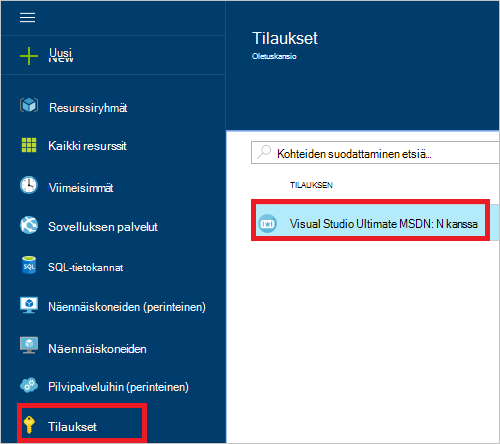
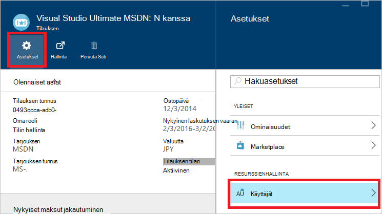
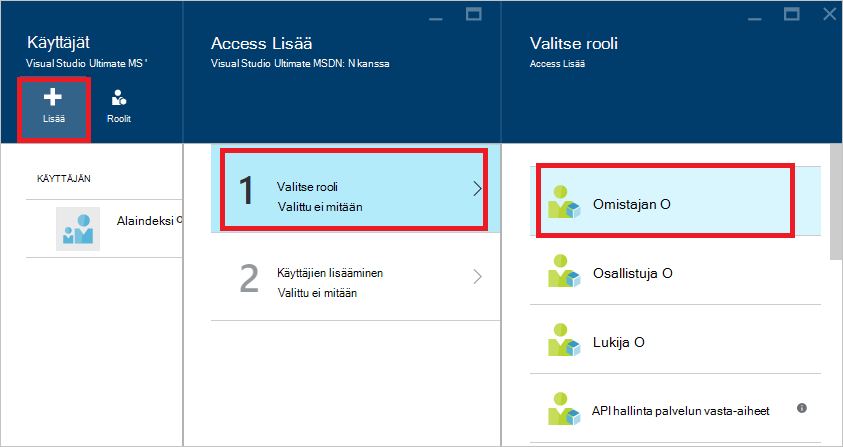
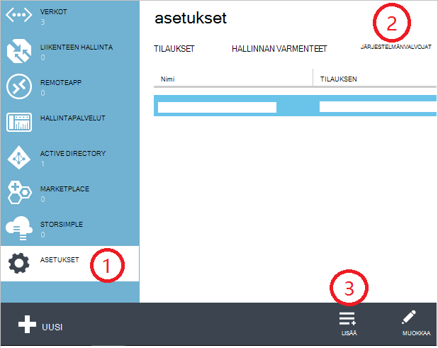
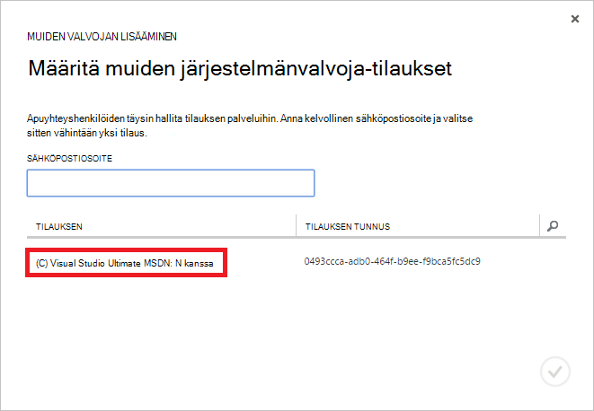
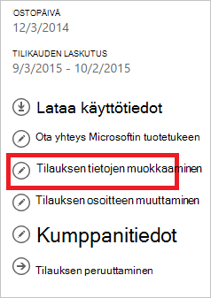
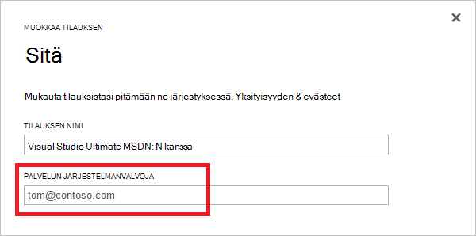

<properties
    pageTitle="Voit lisätä tai muuttaa Azure järjestelmänvalvojan roolit | Microsoft Azure"
    description="Kuvataan, miten voit lisätä tai muuttaa Azure työtovereiden järjestelmänvalvojan, palvelun järjestelmänvalvoja ja tilin järjestelmänvalvojaan"
    services=""
    documentationCenter=""
    authors="genlin"
    manager="mbaldwin"
    editor=""
    tags="billing"/>

<tags
    ms.service="billing"
    ms.workload="na"
    ms.tgt_pltfrm="na"
    ms.devlang="na"
    ms.topic="article"
    ms.date="08/17/2016"
    ms.author="genli"/>

# Voit lisätä tai muuttaa Azure järjestelmänvalvojan roolit

On kolmenlaisia Microsoft Azure järjestelmänvalvojan roolia:

| Järjestelmänvalvojan rooli   | Raja  | Kuvaus
| ------------- | ------------- |---------------|
|Järjestelmänvalvojan tilin (AA)  | 1 kohti Azure-tili  |Tämä on henkilö, joka on rekisteröitynyt ja ostanut Azure tilaukset on oikeus käyttää [Tilin Center](https://account.windowsazure.com/Home/Index) ja suorittaa erilaisia hallintatehtäviä. Näitä ovat ei voi luoda tilaukset, Peruuta tilaukset, muuttaa tilauksen laskutus ja muuttaa palvelun järjestelmänvalvoja.
| Palvelun järjestelmänvalvoja (SA) | Azure tilauskohtaisten 1  |Tämä rooli oikeutta [Azure portal](https://portal.azure.com)-palveluiden hallinta. Oletusarvoisesti uusia tilauksen tili-järjestelmänvalvoja on myös palvelun järjestelmänvalvoja.|
|[Azure perinteinen portal](https://manage.windowsazure.com) työtovereiden järjestelmänvalvoja (CA)|200 tilausta kohti| Tällä roolilla on access samat oikeudet kuin palvelun järjestelmänvalvoja, mutta ei voi muuttaa tilaukset liitos Azure kansioita. |

> [AZURE.NOTE] Azure Active Directory-Roolipohjainen käytön hallinta (RBAC) käyttäjät voi lisätä useita rooleja. Lisätietoja on artikkelissa [Azure Active Directory Roolipohjainen käyttöoikeuksien valvonta](./active-directory/role-based-access-control-configure.md).

> [AZURE.NOTE] Jos tarvitset apua milloin tahansa tämän artikkelin, ota [yhteyttä tukeen](https://portal.azure.com/?#blade/Microsoft_Azure_Support/HelpAndSupportBlade) ongelmaa saat ratkaista nopeasti.

## Voit lisätä tilauksen-järjestelmänvalvoja

**Azure portal**

1. Kirjautuminen [Azure portal](https://portal.azure.com).

2. Valitse toiminto-valikosta **tilauksen** > *Tilaus, jonka haluat järjestelmänvalvoja, jos haluat käyttää*.

    

3. Valitse tilaus-sivu **asetukset**> **käyttäjille**.

    
4. Valitse **Lisää**käyttäjiä, sivu>**Valitse rooli** > **omistaja**.

    

    **Huomautus**
    - Omistajan roolilla on sama käyttöoikeudet työtovereiden järjestelmänvalvojana. Tämä rooli ei ole [Azure tilin Center](https://account.windowsazure.com/subscriptions)käyttöoikeus.
    - Olet lisännyt palvelun [Azure portal](https://portal.azure.com) omistajat voi hallita [Azure perinteinen portal](https://manage.windowsazure.com)-palvelut.  

5. Kirjoita sähköpostiosoite, Lisää omistaja, valitse käyttäjä ja valitse sitten **Valitse**muokattava käyttäjä.

    

**Azure perinteinen portal**

1. Kirjautuminen [Azure perinteinen portal](https://manage.windowsazure.com/).

2. Valitse siirtymisruudussa **asetukset**> **Järjestelmänvalvojat**> **Lisää**.  

    

3. Kirjoita muiden järjestelmänvalvojana ja valitsemalla sitten Tilaus, jonka haluat muiden järjestelmänvalvojat voivat käyttää kutsuttavan henkilön sähköpostiosoite. 

     

Seuraavaa sähköpostiosoitetta voidaan lisätä muiden järjestelmänvalvoja:

* **Microsoft-tili** (aiemmin Windows Live ID)  
 Voit käyttää Microsoft-Account kaikki kuluttaja aloittaminen Microsoft-tuotteiden kirjautuminen ja cloud palvelut, kuten Outlook (Hotmail), Skype (MSN), OneDrive, Windows Phone-ja Xbox LIVE.
* **Organisaatiotili** 
 Organisaation tili on tili, joka on luotu Azure Active Directory-kohdassa. Organisaatiotili osoite nimi muistuttaa seuraavaa: user@ &lt;toimialueen&gt;. onmicrosoft.com

### Rajoitukset ja rajoitukset

 * Jokaisen tilauksen on liitetty Azure AD-kansio (tunnetaan myös nimellä oletusarvo-kansio). Oletus-hakemiston tilaukseen on liitetty etsimällä Siirry [Azure perinteinen portal](https://manage.windowsazure.com/), valitse **asetukset** > **tilaukset**. Tarkista Tilaustunnus etsiminen oletusarvo-kansio.

 * Jos olet kirjautunut sisään Microsoft-Account, muut Microsoft Accounts tai oletus-kansiossa käyttäjät vain voit lisätä muiden järjestelmänvalvojana.

 * Jos olet kirjautunut sisään organisaation tilille, voit lisätä muita organisaation tili organisaation muiden järjestelmänvalvojana. Esimerkiksi abby@contoso.com voit lisätä bob@contoso.com palvelun järjestelmänvalvoja tai muiden järjestelmänvalvojana, mutta ei voi lisätä john@notcontoso.com paitsi john@noncontoso.com on oletusarvoinen kansion käyttäjälle. Kirjautunut sisään organisaation tili käyttäjät voivat jatkaa Microsoft Account käyttäjien lisäämisestä palvelun järjestelmänvalvoja tai muiden järjestelmänvalvojana.

 * Nyt kun se on mahdollista Azure kirjautuminen organisaatiotilillä, seuraavanlaisia muutoksia palvelun järjestelmänvalvoja ja muiden järjestelmänvalvojan tilin vaatimukset:

    Kirjaudu sisään-menetelmällä| Lisää Microsoft-Account tai käyttäjien oletus hakemistossa CA tai SA?  |Lisää organisaation tili samassa organisaatiossa CA tai SA? |Lisätä toisen organisaation CA tai SA organisaatiotili?
    ------------- | ------------- |---------------|---------------
    Microsoft-tili |Kyllä|Ei|Ei
    Organisaatiotili|Kyllä|Kyllä|Ei

## Voit muuttaa tilauksen palvelun järjestelmänvalvoja

Vain tili-järjestelmänvalvoja voi muuttaa tilauksen palvelun järjestelmänvalvoja.

1. Kirjaudu sisään kyselyjä [Azure tilin Center](https://account.windowsazure.com/subscriptions) tilin järjestelmänvalvojaan.

2. Valitse muutettava tilaus.

3. Oikealla puolella Valitse **Muokkaa tilauksen** tiedot.  

    

4. Kirjoita **Palvelun järjestelmänvalvoja** -ruutuun sähköpostiosoite, uusi palvelu järjestelmänvalvoja.  

    

## Voit muuttaa tilin järjestelmänvalvojaan

Voit siirtää omistajuuden Azure-tili toiselle tilille on artikkelissa [Azure tilauksen siirtämiseen omistajuuden](billing-subscription-transfer.md).

## Seuraavat vaiheet

* Lisätietoja siitä, miten resurssien hallitaan Microsoft Azure on artikkelissa [tietoja resurssin Azure-tietokannassa](./active-directory/active-directory-understanding-resource-access.md)

* Lisätietoja siitä, miten Azure Active Directory liittyvät Azure-tilauksesi on artikkelissa [miten Azure tilaukset liittyvät Azure Active Directory](./active-directory/active-directory-how-subscriptions-associated-directory.md)

* Lisätietoja siitä, miten Azure Active Directory liittyvät Azure-tilauksesi on artikkelissa [järjestelmänvalvojan roolien määrittäminen Azure Active Directoryn](./active-directory/active-directory-assign-admin-roles.md)

> [AZURE.NOTE] Jos on edelleen muita kysymyksiä, ota [yhteyttä tukeen](https://portal.azure.com/?#blade/Microsoft_Azure_Support/HelpAndSupportBlade) ongelmaa saat ratkaistu nopeasti.
