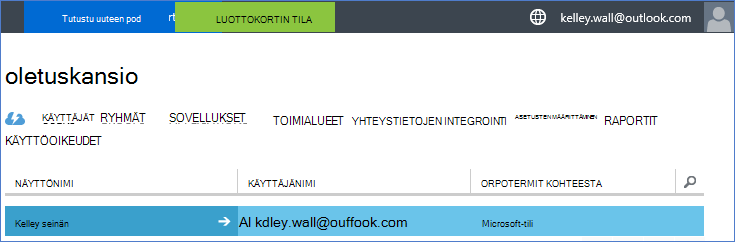
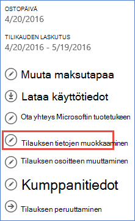

<properties
    pageTitle="Käytä Office 365-Alihallinta Azure-tilauksen | Microsoft Azure"
    description="Opi lisää Office 365-kansio (Alihallinta) suhteen tekemään Azure-tilaukseen."
    services=""
    documentationCenter=""
    authors="JiangChen79"
    manager="mbaldwin"
    editor=""
    tags="billing,top-support-issue"/>

<tags
    ms.service="billing"
    ms.workload="na"
    ms.tgt_pltfrm="ibiza"
    ms.devlang="na"
    ms.topic="article"
    ms.date="09/16/2016"
    ms.author="cjiang"/>

# Office 365-Alihallinta liittäminen Azure tilauksen
Jos hankit Azure- ja Office 365-tilauksia erikseen aiemman ja haluat nyt voi käyttää Office 365-asiakasympäristön Azure tilauksesta, on helppo tehdä. Tässä artikkelissa kerrotaan, miten.

> [AZURE.NOTE] Tässä artikkelissa ei koske Enterprise Agreement (EA)-asiakkaille.

## Pika-ohjeet
Liitettävän Azure tilauksen Office 365-asiakasympäristöön Azure tilisi avulla voit lisätä Office 365-asiakasympäristöön ja liitä sitten Azure tilauksen Office 365-alihallintaan.

## Yksityiskohtaisia ohjeita
Tässä skenaariossa Kelley seinä on käyttäjä, jolla on Azure tilauksen tilissä kelley.wall@outlook.com. Kelley on myös Office 365-tilauksen tilissä kelley.wall@contoso.onmicrosoft.com. Nyt Kelley haluaa käyttää Office 365-alihallintaan ja Azure-tilaus.

### Edellytykset
Suhteen toimii oikein tarvitaan seuraavat edellytykset:

- Tarvitset Azure-tilauksen palvelun järjestelmänvalvojan tunnistetietoja. Apuyhteyshenkilöiden ei voi suorittaa alijoukkoa ohjeiden mukaisesti.
- Tarvitset Office 365-alihallintaan yleisen järjestelmänvalvojan tunnistetietoja.
- Sähköpostiosoite, palvelun järjestelmänvalvoja on ei sisälly Office 365-alihallintaan.
- Sähköpostiosoite, palvelun järjestelmänvalvoja on vastaa mitä tahansa yleisen järjestelmänvalvojan Office 365-alihallintaan.
- Jos käytät parhaillaan sähköpostiosoite, joka on Microsoft-tiliin ja käytössä on organisaatiotili, tilapäisesti muuttaa palvelun järjestelmänvalvoja Azure-tilauksesi toiseen Microsoft-tiliä. Voit luoda uuden Microsoft-tilin [Microsoft-tilin kirjautumissivulla](https://signup.live.com/).

Jos haluat muuttaa palvelun järjestelmänvalvoja, toimi seuraavasti:

1. Kirjautuminen [tilinhallinta-portaalissa](https://account.windowsazure.com/subscriptions).
2. Valitse muutettava tilaus.
3. Valitse **Muokkaa tilauksen tiedot**.

    

4. Kirjoita **Palvelun järjestelmänvalvoja** -ruutuun sähköpostiosoite, uusi palvelu järjestelmänvalvoja.

    

### Liitä Office 365-asiakasympäristön Azure-tilauksella
Voit liittää Office 365-asiakasympäristön Azure-tilaus, toimimalla seuraavasti:

1.  Kirjaudu [tilinhallinta-portaalin](https://account.windowsazure.com/subscriptions) palvelun järjestelmänvalvojan tunnistetietoja.
2.  Valitse vasemmanpuoleisessa ruudussa **ACTIVE DIRECTORYSTA**.

    

    > [AZURE.NOTE] Raportissa pitäisi näkyä ei ole Office 365-alihallintaan. Jos näet sen, voit ohittaa seuraavaan vaiheeseen.

    

3. Lisää Office 365-asiakasympäristön Azure-tilaukseen.

    a. Valitse **Uusi** > **DIRECTORY** > **MUKAUTETUN luominen**.

    

    b. Valitse **Lisää hakemisto** -sivulla **kansion**, valitse **Käytä kansiolla**. Valitse Valitse **olen valmis kirjauduttava nyt**ja valitse **Valmis** .

    

    c-näppäinyhdistelmää. Kun olet kirjautunut, kirjaudu sisään Office 365-asiakasympäristöön yleisen järjestelmänvalvojan tunnistetiedot.

    

    d. Valitse **Jatka**.

    

    e. Valitse **Kirjaudu ulos**.

    

    f. Kirjaudu [tilinhallinta-portaalin](https://account.windowsazure.com/subscriptions) palvelun järjestelmänvalvojan tunnistetietoja.

    

    g. Raportissa pitäisi näkyä koontinäytön Office 365-asiakasympäristöön.

    

4. Vaihda kansio Azure-tilaukseen liittyvää.

    a. Valitse **asetukset**.

    

    b. Valitse Azure-tilauksesi ja valitse sitten **Muokkaa HAKEMISTO**.
    

    c-näppäinyhdistelmää. Valitse **Seuraava** .

    

    > [AZURE.WARNING] Näyttöön tulee varoitus, että kaikki apuyhteyshenkilöiden poistetaan.

    

    >[AZURE.WARNING] Lisäksi kaikki [Roolipohjainen käyttöoikeuksien valvonta (RBAC)](./active-directory/role-based-access-control-configure.md) -käyttäjät, joilla määritetyt käyttöoikeudet aiemmin resurssin ryhmien myös poistaa. Näyttöön tulee varoitus maininnat kuitenkin vain apuyhteyshenkilöiden poisto.

    

    d. Valitse **Valmis** .

5. Voit nyt lisätä organisaation Office 365-tilien Azure Active Directory-vuokraajan apuyhteyshenkilöiden nimellä.

    a. Valitse **JÄRJESTELMÄNVALVOJAT** -välilehti ja valitse sitten **Lisää**.

    

    b. Organisaation tili ja Office 365-asiakasympäristöön, Azure tilaus ja valitse sitten **Valmis** .

    

    c-näppäinyhdistelmää. Siirry **JÄRJESTELMÄNVALVOJAT** -välilehti. Raportissa pitäisi näkyä näkyviin muiden järjestelmänvalvojana organisaatiotili.

    

6. Seuraavaksi voit testata access työtovereiden järjestelmänvalvojaan.

    a. Kirjaudu ulos tilinhallinta-portaalissa.

    b. Avaa [tilinhallinta-portaalin](https://account.windowsazure.com/subscriptions) tai [Azure portal](https://portal.azure.com/).

    c-näppäinyhdistelmää. Jos Azure kirjautumissivulla on linkkiä, **Kirjaudu sisään organisaatiotiliä**, valitse linkki. Muussa tapauksessa Ohita tämä vaihe.

    

    d. Kirjoita muiden järjestelmänvalvojan tunnistetiedot ja valitse sitten **Kirjaudu sisään**.

    

## Seuraavat vaiheet
Aiheeseen liittyvät skenaariot ovat seuraavat:

- Sinulla on jo Office 365-tilauksen ja olet valmis Azure-tilauksen, mutta haluat käyttää aiemmin Office 365-käyttäjätilit Azure tilauksen.
- Olet Azure tilaaja ja haluat saada käyttäjille Office 365-tilauksen aiemmin Azure Active Directory-esiintymä.

Lisätietoja näiden tehtävien suorittamisesta on artikkelissa [käyttöä aiemmin Office 365-tili-Azure-tilauksesi tai päinvastoin](billing-use-existing-office-365-account-azure-subscription.md).
