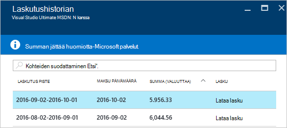

<properties
    pageTitle="Oman Azure laskutus- ja päivittäinen käyttö laskutustiedot lataamisesta | Microsoft Azure"
    description="Tässä artikkelissa käsitellään Azure laskutuksen lasku ja päivittäinen käyttötietojen lataaminen"
    services=""
    documentationCenter=""
    authors="genlin"
    manager="mbaldwin"
    editor=""
    tags="billing"
    />

<tags
    ms.service="billing"
    ms.workload="na"
    ms.tgt_pltfrm="na"
    ms.devlang="na"
    ms.topic="article"
    ms.date="10/10/2016"
    ms.author="genli"/>

# Oman Azure laskutus- ja päivittäinen käyttö laskutustiedot lataamisesta

> [AZURE.NOTE] Jos tarvitset apua milloin tahansa tämän artikkelin, ota [yhteyttä tukeen](https://portal.azure.com/?#blade/Microsoft_Azure_Support/HelpAndSupportBlade) ongelmaa saat ratkaista nopeasti.

Azure-tili-järjestelmänvalvojana voit tarkastella laskutuksen lasku ja [Azure portal](https://portal.azure.com) tai [Azure tilin Center](https://account.windowsazure.com/subscriptions)päivittäinen käyttötiedot. Näin miten:

## Azure portal

1. Kirjaudu [Azure portaaliin](https://portal.azure.com) tilille järjestelmänvalvojana.

    >[AZURE.NOTE] Vain tilin järjestelmänvalvojalla on oikeus käyttää laskutuksen tiedot. Lisätietoja siitä, kuinka voit selvittää, kuka on tilaus tilin järjestelmänvalvoja on artikkelissa [usein kysyttyjä kysymyksiä](billing-subscription-transfer.md#faq).

2. Valitse toiminto-valikosta **Laskutus**. Etsi **Laskutus** -sivu joitakin hyödyllisiä tietoja, kuten seuraava laskutuksen päivämäärä.

    
3. Valitse **tilauksen kustannukset** -osassa, jota haluat tarkastella tilaus.

    
4. Valitse **Laskutus- ja käyttö**.

    

5. Valitse **Lataa laskun** laskun kopion **Laskuhistorian** -sivu. Valitse päivittäinen käyttö tietojen laskutusjaksolla.

    

## Azure tilin Center

1. Kirjaudu sisään [Azure tilin Center](https://account.windowsazure.com/subscriptions) tilin järjestelmänvalvojana.
2. Valitse tilaus, jonka haluat tietoja laskutus- ja käyttö.
3. Valitse **LASKUHISTORIAN**.  
4. Näet viimeksi kuusi laskutuksen ajanjaksoa ja laskuttamatta tilikauden oman lauseita.   
5. Valitse **Nykyinen näkymä-lause** on arvio maksuista arvio on luotu aikaan. Nämä tiedot päivitetään vain päivittäin, ja kaikki käyttö ei välttämättä sisällä. Kuukausittainen laskun voivat poiketa tässä arvio.   
6. Valitse **Lataa lasku** Nähdäksesi edellisen laskun kopio.  
7. Valitse **Lataa käyttö** lataamaan päivittäinen käyttötietojen, CSV-tiedostona. 

> [AZURE.NOTE] Jos on edelleen muita kysymyksiä, ota [yhteyttä tukeen](https://portal.azure.com/?#blade/Microsoft_Azure_Support/HelpAndSupportBlade) ongelmaa saat ratkaistu nopeasti.
