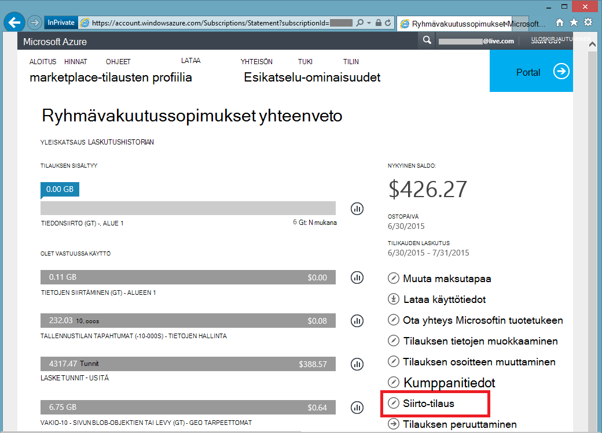

<properties
   pageTitle="Azure tilauksen omistajuuden siirtäminen | Microsoft Azure"
   description="Azure tilauksen siirtäminen toisen käyttäjän ja joitakin usein kysyttyjä kysymyksiä prosessi"
   services=""
   documentationCenter=""
   authors="genlin"
   manager="stevenpo"
   editor=""
   tags="billing,top-support-issue"/>

<tags
   ms.service="billing"
   ms.workload="na"
   ms.tgt_pltfrm="na"
   ms.devlang="na"
   ms.topic="article"
   ms.date="10/10/2016"
   ms.author="genli"/>

# Azure tilauksen omistajuuden siirtäminen

Haluatko:

- Käsi päälle omistajuuden toiselle henkilölle Azure tilauksen laskutus on?
- Haluatko muuttaa tili, jota käytetään Azure rekisteröityminen? Ehkä käyttää Microsoft-Account mutta ei pitäisi käyttää työpaikan tai oppilaitoksen tilillä sen sijaan?
- Haluatko Siirry Azure tilauksen kansiosta toiseen?
- Azure- ja Office 365: n ovat eri omistajien ja koottavat?

Voit nyt tämän voi tehdä helposti-Microsoft Azure tilin Center - ryhmävakuutussopimukset, MSDN, toiminto Pack tai BizSpark tilaukset.  Olemme lisänneet voi siirtää toiselle käyttäjälle tilauksen. Voit toisin sanoen muuttaa minkä tahansa ryhmävakuutussopimukset, MSDN, toiminto Pack tai BizSpark tilauksessa, jotka omistat, riippumatta siitä, mikä maa toimivat-tili-järjestelmänvalvoja. Sovellus tukee nyt Azure Marketplace ostot siirto myös seuraavat tilaustyypit varten.

> [AZURE.NOTE] Jos haluat muuttaa tilauksen eri tarjous, saat lisätietoja [valitsin Azure tilauksesi toiseen tarjous](billing-how-to-switch-azure-offer.md) . Jos tarvitset apua milloin tahansa tämän artikkelin, ota [yhteyttä tukeen](https://portal.azure.com/?#blade/Microsoft_Azure_Support/HelpAndSupportBlade) ongelmaa saat ratkaista nopeasti.

## Azure tilauksen omistajuuden siirtäminen

> [AZURE.VIDEO transfer-an-azure-subscription]

1.  Kirjaudu sisään osoitteessa <https://account.windowsazure.com/Subscriptions>. Sinun on tili-järjestelmänvalvojat voivat suorittaa omistus-siirto. Lisätietoja siitä, kuinka voit selvittää, kuka on tilaus tilin järjestelmänvalvoja on artikkelissa [usein kysyttyjä kysymyksiä](#faq).

2.  Valitse Siirrä tilaus.

3.  Valitse **Siirrä tilaus** -vaihtoehto.

    

4.  Määritä vastaanottajan kehotteiden mukaisesti.

    

5.  Vastaanottajan saavat automaattisesti sähköpostiviestin hyväksyminen-linkin.

    

6.  Vastaanottaja napsauttaa linkkiä, ja seuraa ohjeita, kuten kirjoittamalla niiden maksutietoja.

    

    

7. Success! Tilaus on nyt siirretty.

## Usein kysytyt kysymykset

-   **Miten tiedän, kuka on tilaus tilin järjestelmänvalvoja?**

    Voit tarkistaa, kuka on tilaus järjestelmänvalvojan tilin seuraavasti:

    1. Kirjautuminen [Azure portal](https://portal.azure.com).
    2. Valitse toiminto-valikosta **tilauksen**.
    3. Valitse tilaus, josta haluat etsiä ja valitse sitten **asetukset**.
    4. Valitse **Ominaisuudet**. **Tilin hallinta** -ruudussa näkyvät tilauksen tilin järjestelmänvalvojaan.  

-   **Mitään palvelun käyttökatkot johtaa tilauksen siirron?**

    Ei ole vaikutusta-palveluun. Tämä tehokkaasti peruuttaa tilauksen nykyisen tilissä järjestelmänvalvoja ja luo uuden istunnon vastaanottajan tilissä mutta pohjana Azure services liittää uuteen tilaukseen. Tilauksen tunnus säilyy ennallaan.

-   **Miten Vaihda kansio-tilauksen se avulla?**-   
    Azure tilauksen luodaan kansio, joka kuuluu tilin järjestelmänvalvoja. Niin jotta voit muuttaa kansion, vain siirtää tilauksen kohdekansio käyttäjän. Kun käyttäjä on valmis Hyväksy siirrettävät tilauksen siirtyy automaattisesti kohdekansion ohjeita.

-   **Jos voin ottaa toisen organisaation tilauksen laskutuksen omistajuuden päälle, ne säilyvät Omat resurssien käytön?**

    Jos tilaus on siirretty toiseen, Edellinen vuokraajan liittyvät käyttäjät menettävät käyttöoikeutensa tilaukseen. Vaikka käyttäjä ei ole palvelujen järjestelmänvalvoja tai Mää järjestelmänvalvojan enää, ne on ehkä edelleen käyttää muita suojaus-järjestelmiä project_pro_noversion. Näitä ovat:
    - Hallinta-sertifikaatteja, joita Myönnä käyttäjälle järjestelmänvalvojan oikeudet tilauksen resurssit. Lisätietoja on artikkelissa [Luo ja lataa Azure varmenteen hallinta](https://msdn.microsoft.com/library/azure/gg551722.aspx)
    -   Palvelujen pikanäppäimet, kuten tallennustilan. Lisätietoja on artikkelissa [näkymän, kopioi ja muodosta uudelleen sarjanumerot tallennustilan pikanäppäimet](storage-create-storage-account.md#view-copy-and-regenerate-storage-access-keys)
    -   Palvelut, kuten Azuren näennäiskoneiden Remote käyttöoikeudet

    Tämä ei ole täydellinen luettelo. Vastaanottajan huomioon päivittäminen-palveluun liitetyn, jos he tarvitsevat käytön rajoittaminen resursseille mitään tietoja. Suurin osa resursseista voidaan päivittää seuraavasti:

    1.   Siirry Azure-portaaliin: [ *https://portal.azure.com*](https://portal.azure.com)

    2.    Valitse Selaa kaikki -&gt; kaikki resurssit

    3.    Valitse resurssi. Resurssi-sivu avautuu.

    4.    Valitse resurssi-sivu **asetukset**. Voit tarkastella ja päivittää aiemmin luotuja tietoja.

-   **Jos siirtää valitun laskutusjakson keskellä tilauksen, koko Laskutus vastaanottajan maksu käy?**

    Lähettäjä on vastuussa maksuerän käyttö, jotka ilmoitettiin kohtaan siirto on valmis. Vastaanottaja on vastuussa käyttö raportoidusta ajasta Siirrä eteenpäin. Voi olla joitakin käytön, joka on tapahtunut ennen siirtoa, mutta ilmoitettiin jälkeenpäin. Tämä sisällytetään vastaanottajan laskun.

-   **Vastaanottaja on pääsy käyttö- ja laskutushistoriaa?**

    Tällä hetkellä vain tiedot näkyviin vastaanottaja on edellisen laskun (tai nykyinen saldo, jos tilaus on siirretty, ennen kuin ensimmäisen laskun on luotu). Käyttö- ja laskutushistoriaa loput ei siirtää tilaukseen.

-   **Muutettavissa tarjous siirron aikana?**

    Tarjous on oltava sama. Jos haluat muuttaa tarjous, sinun täytyy [tuelta](http://go.microsoft.com/fwlink/?LinkID=619338).

-   **Tilauksen siirtäminen toisessa maassa käyttäjätilille**

    Ei tällä hetkellä tätä ei tueta. Vastaanottajan käyttäjätilillä on oltava samassa maassa.

-   **Vastaanottaja käyttää eri maksu-järjestelmä?**

    Kyllä. On tähän rajoituksia: nyt Laskuhistorian tilaus on jaettu kaksi tilien välillä. Mutta etuna on se, että voit tehdä tämän tarvitsematta ottaa [yhteyden tukeen](http://go.microsoft.com/fwlink/?LinkID=619338).

-   **On maksutapa heikentyä, kun voin siirtää Azure tilauksen?**

    Jos haluat hyväksyä tilauksen siirron, luottokortilla tai samanlaisia maksutapa on annettava maksaa tilauksen. Esimerkiksi jos Teemu siirtää tilauksen Jane ja Jane hyväksyy siirron, Jane on myös määritettävä maksutapaa, joita hän käyttää maksaa tilauksen. Kun siirto on valmis, Teemu veloitetaanko enää hän siirtyy Jane tilaus.

## Seuraavat vaiheet omistajuus tilauksen hyväksymisen jälkeen

1. Voit nyt tilin järjestelmänvalvojaan. Tarkistaa ja päivittää palvelun järjestelmänvalvoja ja Apuyhteyshenkilöiden. Hallitse järjestelmänvalvojat [Azure perinteinen portal](https://manage.windowsazure.com) valitsemalla asetukset. [Lue lisää](http://go.microsoft.com/fwlink/?LinkID=533293).
2. Voit käyttää myös Roolipohjainen käyttöoikeuksien valvonta (RBAC) tilaus ja palveluja. Siirry [Azure portal](https://portal.azure.com) [Lisätietoja RBAC](http://go.microsoft.com/fwlink/?LinkID=544802)
3. Päivitä tähän tilaukseen palveluihin liittyviä tunnistetiedot. Näitä ovat:
    - Hallinta-sertifikaatteja, joita Myönnä käyttäjälle järjestelmänvalvojan oikeudet tilauksen resurssit. Lisätietoja on artikkelissa [Luo ja lataa hallinnan varmenteen Azure](https://msdn.microsoft.com/library/azure/gg551722.aspx)
    -   Palvelujen pikanäppäimet, kuten tallennustilan. Lisätietoja on artikkelissa [näkymän, kopioi ja muodosta uudelleen sarjanumerot tallennustilan pikanäppäimet](storage-create-storage-account.md#view-copy-and-regenerate-storage-access-keys)
    -   Palvelut, kuten Azuren näennäiskoneiden Remote käyttöoikeudet
4. Päivitä tämän tilaustasi [Azure tilin Center](https://account.windowsazure.com/Subscriptions)[Lisätietoja](http://go.microsoft.com/fwlink/?LinkID=533292) laskutuksen ilmoitukset  
5.  Jos työskentelet kumppani, harkitse tämän tilauksen Kumppanitunnus päivittämistä. Voit tehdä tämän [Azure tilin keskelle](https://account.windowsazure.com/Subscriptions).

> [AZURE.NOTE] Jos on edelleen muita kysymyksiä, ota [yhteyttä tukeen](https://portal.azure.com/?#blade/Microsoft_Azure_Support/HelpAndSupportBlade) ongelmaa saat ratkaistu nopeasti.
