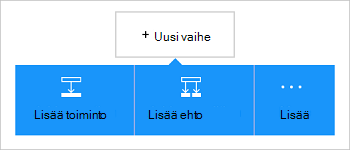

<properties
    pageTitle="Lisää Dynamics CRM Online-yhdistin logiikan sovelluksia | Microsoft Azure"
    description="Luo logiikan sovelluksia Azure-sovelluksen-palvelun kanssa. Dynamics CRM Online yhteyden toimittaja sisältää API-Liittymän kohteiden Dynamics CRM Online-käyttöä varten."
    services="logic-apps"    
    documentationCenter=""     
    authors="MandiOhlinger"    
    manager="erikre"    
    editor="" 
    tags="connectors" />

<tags
ms.service="logic-apps"
ms.devlang="na"
ms.topic="article"
ms.tgt_pltfrm="na"
ms.workload="integration"
ms.date="08/15/2016"
ms.author="mandia"/>

# Aloita Dynamics CRM Online-yhdistin
Muodosta yhteys Dynamics CRM Online-Luo uusi tietue, Päivitä kohteen ja paljon muuta. CRM Online voit:

- Muodostaa yhteyttä business työnkulku, saat CRM Online-sivuston tietojen perusteella. 
- Käytä Toiminnot, jotka poistat tietueen, pyydä yksiköt ja paljon muuta. Nämä toiminnot vastauksen saaminen ja tee tulosteen käytettävissä, jos haluat käyttää muuta vaihtoehtoa. Kohteen päivittämisestä CRM, voit lähettää sähköpostia Office 365: n avulla.

Tässä ohjeaiheessa kerrotaan, miten käyttämään Dynamics CRM Online-yhdistin logiikan-sovelluksessa ja siinä myös Käynnistimet ja toiminnot.

>[AZURE.NOTE] Tässä versiossa on artikkelissa koskee logiikan sovellusten yleiseen käyttöön (GA).

Lisätietoja logiikan sovellukset on artikkelissa [mitä logiikan sovellukset](../app-service-logic/app-service-logic-what-are-logic-apps.md) ja [logiikka sovelluksen luominen](../app-service-logic/app-service-logic-create-a-logic-app.md).

## Yhteyden muodostaminen Dynamics CRM Online-tilassa

Ennen kuin logiikan sovelluksen voit käyttää mihinkään palveluun, sinun on luotava *yhteyden* palveluun. Yhteyden sisältää logiikan-sovellus ja toisen palvelun välinen yhteys. Esimerkiksi yhteyden muodostaminen Dynamics, sinun on Dynamics CRM Online- *yhteys*. Voit luoda yhteyden, kirjoita tavallisesti avulla voit käyttää haluat muodostaa yhteyden palvelun tunnistetiedot. Niin Dynamics, anna tunnistetiedot yhteyden muodostaminen Dynamics CRM Online-tiliisi.

### Yhteyden muodostaminen

>[AZURE.INCLUDE [Steps to create a connection to Dynamics CRM Online Connection Provider](../../includes/connectors-create-api-crmonline.md)]

## Käytä käynnistin

Käynnistimen tapahtuma, jonka avulla voidaan aloittaa työnkulun määritetty logiikan-sovelluksessa. Käynnistimien "äänestyksen järjestäminen" palvelun aikaväli ja usein haluat. [Lisätietoja käynnistimien](../app-service-logic/app-service-logic-what-are-logic-apps.md#logic-app-concepts).

1. Logiikan-sovellukseen, kirjoita "dynamics", saat luettelon käytettävissä käynnistimet:  

    

2. Valitse **Dynamics CRM Online - tietuetta luotaessa**. Jos on jo yhteys, valitse organisaation ja kohteen avattavasta luettelosta.

    

    Jos sinua kehotetaan kirjautumaan, kirjoita merkki yhteyden muodostaminen tiedot. [Luo yhteys](connectors-create-api-crmonline.md#create-the-connection) sisältö on esitetty vaiheet. 

    > [AZURE.NOTE] Tässä esimerkissä logiikan sovellus suoritetaan, kun tietue on luotu. Tämä käynnistin tulokset näkyviin lisää toisen toiminnon, joka lähettää sinulle sähköpostiviestin. Lisää esimerkiksi Office 365: n *lähettää sähköpostia* toiminnon, joka sähköpostit, kun uusi tietue lisätään. 

3. Valitse **Muokkaa** -painiketta ja määritä **korkojakso** ja **aikaväli** . Esimerkiksi halutessasi lisääminen käynnistin 15 minuutin välein sitten **korkojakso** asettaminen **minuutin**ja määritä **aikaväli** - **15**. 

    

4. **Tallenna** tekemäsi muutokset (vasemmassa yläkulmassa työkalurivin). Logiikan sovelluksen on tallennettu, ja se saattaa olla käytössä automaattisesti.

## Toiminnon käyttäminen

Toiminto on määritetty logiikan-sovelluksessa työnkulun suorittamiin toiminto. [Lisätietoja toiminnot](../app-service-logic/app-service-logic-what-are-logic-apps.md#logic-app-concepts).

1. Valitse plus-merkkiä. Näet useita vaihtoehtoja: **Lisää toiminnon**, **Lisää ehto**tai jokin **Lisää** asetuksia.

    

2. Valitse **Lisää toiminnon**.

3. Kirjoita tekstiruutuun "dynamics" Saat luettelon käytettävissä olevat toiminnot.

    

4. Valitse tämän esimerkin **Dynamics CRM Online - tietueen päivitys**. Jos on jo yhteys, valitse **Organisaationimi**, **Kohteen nimi**ja muita ominaisuuksia:  

    

    Jos ohjelma pyytää yhteystiedot, kirjoita tiedot yhteyden luominen. [Luo yhteys](connectors-create-api-crmonline.md#create-the-connection) tässä ohjeaiheessa kuvataan nämä ominaisuudet. 

    > [AZURE.NOTE] Tässä esimerkissä päivitämme tietuetta CRM Online. Tulos toisen käynnistimestä avulla voit päivittää tietueen. Lisää esimerkiksi SharePointin *aiemmin luodun kohteen muokkauksen* käynnistintä. Lisää sitten CRM Online *-tietueen päivitys* -toiminto, joka käyttää SharePoint-kenttiin Päivitä CRM Online olemassa olevaan tietueeseen. 

5. **Tallenna** tekemäsi muutokset (vasemmassa yläkulmassa työkalurivin). Logiikan sovelluksen on tallennettu, ja se saattaa olla käytössä automaattisesti.

## Teknisiä tietoja

## Käynnistimien

|Käynnistin | Kuvaus|
|--- | ---|
|[Kun tietue on luotu](connectors-create-api-crmonline.md#when-a-record-is-created)|Käynnistää vuo, kun objekti on luotu CRM.|
|[Kun tietue on päivitetty](connectors-create-api-crmonline.md#when-a-record-is-updated)|Käynnistää vuo, kun objekti on muokattu CRM.|
|[Kun tietue on poistettu](connectors-create-api-crmonline.md#when-a-record-is-deleted)|Käynnistää vuo, kun objekti poistetaan CRM.|

## Toiminnot

|Toiminto|Kuvaus|
|--- | ---|
|[Luettelon tietueet](connectors-create-api-crmonline.md#list-records)|Tämä toiminto saa kohteen tietueet.|
|[Luo uusi tietue](connectors-create-api-crmonline.md#create-a-new-record)|Tämä toiminto luo uuden tietueen kohteen.|
|[Tietueen](connectors-create-api-crmonline.md#get-record)|Tämä toiminto saa määritettyä tietuetta kohteen.|
|[Tietueen poistaminen](connectors-create-api-crmonline.md#delete-a-record)|Tämä toiminto poistaa tietueen kohde-kokoelmasta.|
|[Tietueen päivitys](connectors-create-api-crmonline.md#update-a-record)|Tämä toiminto päivittää tietuetta kohteen.|

### Käynnistin ja toimintojen tiedot

Tässä osassa on tarkkoja tietoja kunkin käynnistin ja toiminnon, mukaan lukien kaikki pakolliset ja valinnaiset syötteen ominaisuudet ja yhdistimen liittyvät vastaavan tuloksen.

#### Kun tietue on luotu
Käynnistää vuo, kun objekti on luotu CRM. 

|Ominaisuuden nimi| Näyttönimi|Kuvaus|
| ---|---|---|
|tietojoukon *|Organisaationimi|Kuten Contoso CRM-organisaation nimi|
|taulukon *|Kohteen nimi|Yksikön nimi|
|$skip|Ohita määrä|Voit ohittaa merkintöjen määrä (oletus = 0)|
|$top|Suurin Get määrä|Saat kohteiden enimmäismäärä (oletus = 256)|
|$filter|Voit suodattaa kyselyn|ODATA suodatinkyselyn, joka palauttaa tietojen rajoittaminen|
|$orderby|Lajittelu|ODATA lajittelu-kyselyn argumenteille tapahtumien järjestys|

Tähtimerkkiä (*) tarkoittaa, että ominaisuus on pakollinen.

##### Tulostustiedot
ItemsList

| Ominaisuuden nimi | Tietotyyppi |
|---|---|
|arvo|matriisi|

#### Kun tietue on päivitetty
Käynnistää vuo, kun objekti on muokattu CRM. 

|Ominaisuuden nimi| Näyttönimi|Kuvaus|
| ---|---|---|
|tietojoukon *|Organisaationimi|Kuten Contoso CRM-organisaation nimi|
|taulukon *|Kohteen nimi|Yksikön nimi|
|$skip|Ohita määrä|Voit ohittaa merkintöjen määrä (oletus = 0)|
|$top|Suurin Get määrä|Saat kohteiden enimmäismäärä (oletus = 256)|
|$filter|Voit suodattaa kyselyn|ODATA suodatinkyselyn, joka palauttaa tietojen rajoittaminen|
|$orderby|Lajittelu|ODATA lajittelu-kyselyn argumenteille tapahtumien järjestys|

Tähtimerkkiä (*) tarkoittaa, että ominaisuus on pakollinen.

##### Tulostustiedot
ItemsList

| Ominaisuuden nimi | Tietotyyppi |
|---|---|
|arvo|matriisi|

#### Kun tietue on poistettu
Käynnistää vuo, kun objekti poistetaan CRM. 

|Ominaisuuden nimi| Näyttönimi|Kuvaus|
| ---|---|---|
|tietojoukon *|Organisaationimi|Kuten Contoso CRM-organisaation nimi|
|taulukon *|Kohteen nimi|Yksikön nimi|
|$skip|Ohita määrä|Voit ohittaa merkintöjen määrä (oletus = 0)|
|$top|Suurin Get määrä|Saat kohteiden enimmäismäärä (oletus = 256)|
|$filter|Voit suodattaa kyselyn|ODATA suodatinkyselyn, joka palauttaa tietojen rajoittaminen|
|$orderby|Lajittelu|ODATA lajittelu-kyselyn argumenteille tapahtumien järjestys|

Tähtimerkkiä (*) tarkoittaa, että ominaisuus on pakollinen.

##### Tulostustiedot
ItemsList

| Ominaisuuden nimi | Tietotyyppi |
|---|---|
|arvo|matriisi|

#### Luettelon tietueet
Tämä toiminto saa kohteen tietueet. 

|Ominaisuuden nimi| Näyttönimi|Kuvaus|
| ---|---|---|
|tietojoukon *|Organisaationimi|Kuten Contoso CRM-organisaation nimi|
|taulukon *|Kohteen nimi|Yksikön nimi|
|$skip|Ohita määrä|Voit ohittaa merkintöjen määrä (oletus = 0)|
|$top|Suurin Get määrä|Saat kohteiden enimmäismäärä (oletus = 256)|
|$filter|Voit suodattaa kyselyn|ODATA suodatinkyselyn, joka palauttaa tietojen rajoittaminen|
|$orderby|Lajittelu|ODATA lajittelu-kyselyn argumenteille tapahtumien järjestys|

Tähtimerkkiä (*) tarkoittaa, että ominaisuus on pakollinen.

##### Tulostustiedot
ItemsList

| Ominaisuuden nimi | Tietotyyppi |
|---|---|
|arvo|matriisi|

#### Luo uusi tietue
Tämä toiminto luo uuden tietueen kohteen. 

|Ominaisuuden nimi| Näyttönimi|Kuvaus|
| ---|---|---|
|tietojoukon *|Organisaationimi|Kuten Contoso CRM-organisaation nimi|
|taulukon *|Kohteen nimi|Yksikön nimi|

Tähtimerkkiä (*) tarkoittaa, että ominaisuus on pakollinen.

##### Tulostustiedot
Ei mitään.

#### Tietueen
Tämä toiminto saa määritettyä tietuetta kohteen. 

|Ominaisuuden nimi| Näyttönimi|Kuvaus|
| ---|---|---|
|tietojoukon *|Organisaationimi|Kuten Contoso CRM-organisaation nimi|
|taulukon *|Kohteen nimi|Yksikön nimi|
|tunnus *|Kohteen tunnus|Määritä tietueen tunnus|

Tähtimerkkiä (*) tarkoittaa, että ominaisuus on pakollinen.

##### Tulostustiedot
Ei mitään.

#### Tietueen poistaminen
Tämä toiminto poistaa tietueen kohde-kokoelmasta. 

|Ominaisuuden nimi| Näyttönimi|Kuvaus|
| ---|---|---|
|tietojoukon *|Organisaationimi|Kuten Contoso CRM-organisaation nimi|
|taulukon *|Kohteen nimi|Yksikön nimi|
|tunnus *|Kohteen tunnus|Määritä tietueen tunnus|

Tähtimerkkiä (*) tarkoittaa, että ominaisuus on pakollinen.

#### Tietueen päivitys
Tämä toiminto päivittää tietuetta kohteen. 

|Ominaisuuden nimi| Näyttönimi|Kuvaus|
| ---|---|---|
|tietojoukon *|Organisaationimi|Kuten Contoso CRM-organisaation nimi|
|taulukon *|Kohteen nimi|Yksikön nimi|
|tunnus *|Tietueen tunnus|Määritä tietueen tunnus|

Tähtimerkkiä (*) tarkoittaa, että ominaisuus on pakollinen.

##### Tulostustiedot
Ei mitään.

## HTTP-vastaukset

Käynnistimien ja toiminnot voi palauttaa yhden tai useamman HTTP tila-koodeista: 

|Nimi|Kuvaus|
|---|---|
|200|Okei|
|202|Hyväksytty|
|400|Pyyntö ei kelpaa|
|401|Luvattomia|
|403|Käyttö estetty|
|404|Ei löydy|
|500|Sisäinen palvelinvirhe. Tuntematon virhe.|
|Oletusarvo|Epäonnistui.|

## Seuraavat vaiheet

[Logiikan-sovelluksen luominen](../app-service-logic/app-service-logic-create-a-logic-app.md). Tutustu muiden käytettävissä yhdistimet logiikan sovellusten etsiminen [API-luettelosta](apis-list.md).

