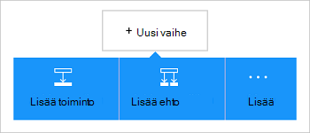
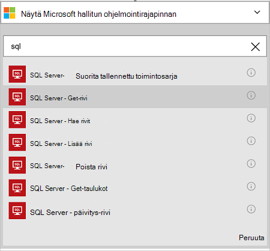
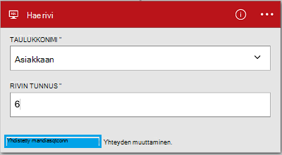

<properties
    pageTitle="Lisää Azure SQL-tietokantayhteyden logiikan-sovelluksissa | Microsoft Azure"
    description="Yleistä REST API parametreilla Azure SQL-tietokanta-yhdistin"
    services=""
    documentationCenter="" 
    authors="MandiOhlinger"
    manager="anneta"
    editor=""
    tags="connectors"/>

<tags
   ms.service="logic-apps"
   ms.devlang="na"
   ms.topic="article"
   ms.tgt_pltfrm="na"
   ms.workload="na" 
   ms.date="10/18/2016"
   ms.author="mandia"/>

# Azure SQL-tietokantayhteyden käytön aloittaminen
Azure SQL-tietokanta Connectorin avulla luoda organisaation työnkulkuja, joilla hallitaan taulukoiden tietoja. 

SQL-tietokantaan voit:

- Voit muodostaa työnkulku lisätään uusi asiakas asiakkaat-tietokantaan tai päivitetään tilaus tilaukset-tietokannassa.
- Hae tietorivin, Lisää uusi rivi ja jopa poistaa toimintojen avulla. Esimerkiksi kun tietue on luotu Dynamics CRM Online (käynnistimen), valitse Lisää rivi Azure SQL-tietokantaan (toiminto). 

Tämän artikkelin avulla voit käyttää SQL-tietokantayhteys logiikan-sovelluksessa ja siinä myös toiminnot.

>[AZURE.NOTE] Tässä versiossa on artikkelissa koskee logiikan sovellusten yleiseen käyttöön (GA). 

Lisätietoja logiikan sovellukset on artikkelissa [mitä logiikan sovellukset](../app-service-logic/app-service-logic-what-are-logic-apps.md) ja [logiikka sovelluksen luominen](../app-service-logic/app-service-logic-create-a-logic-app.md).

## Yhteyden muodostaminen Azure SQL-tietokantaan

Ennen kuin logiikan sovelluksen voit käyttää mihinkään palveluun, sinun on luotava *yhteyden* palveluun. Yhteyden sisältää logiikan-sovellus ja toisen palvelun välinen yhteys. Esimerkiksi muodostaa yhteyden SQL-tietokantaan luotava SQL-tietokannan *yhteys*. Jos haluat luoda yhteyden, voit kirjoittaa tunnistetiedot, voit tavallisesti käyttää palvelua, johon olet muodostamassa yhteyttä. Kirjoita niin, yhteyden muodostaminen SQL-tietokantaan tunnistetiedot SQL-tietokantaan. 

#### Yhteyden muodostaminen

>[AZURE.INCLUDE [Create the connection to SQL Azure](../../includes/connectors-create-api-sqlazure.md)]

## Käytä käynnistin

Tämä yhdistin ei ole Käynnistimet. Käynnistä logiikan sovellus, esimerkiksi toistuminen käynnistimen HTTP Webhook käynnistin, käynnistimien ja muut yhdysviivat käytettävissä muissa käynnistimien avulla. [Logiikan-sovelluksen luominen](../app-service-logic/app-service-logic-create-a-logic-app.md) on esimerkki.

## Toiminnon käyttäminen
    
Toiminto on määritetty logiikan-sovelluksessa työnkulun suorittamiin toiminto. [Lisätietoja toiminnot](../app-service-logic/app-service-logic-what-are-logic-apps.md#logic-app-concepts).

1. Valitse plus-merkkiä. Näet useita vaihtoehtoja: **Lisää toiminnon**, **Lisää ehto**tai jokin **Lisää** asetuksia.

    

2. Valitse **Lisää toiminnon**.

3. Kirjoita tekstiruutuun "sql-saat kaikki käytettävissä olevat toiminnot luettelon.

     

4. Valitse tämän esimerkin **SQL Server - Hae rivi**. Jos on jo yhteys, valitse **taulukkonimi** avattavasta luettelosta ja haluat palauttaa **Rivin tunnus** .

    

    Jos ohjelma pyytää yhteystiedot, kirjoita tiedot yhteyden luominen. [Luo yhteys](connectors-create-api-sqlazure.md#create-the-connection) tässä ohjeaiheessa kuvataan nämä ominaisuudet. 

    > [AZURE.NOTE] Tässä esimerkissä palautettavien rivin taulukosta. Tämän rivin tiedot näkyviin lisää toisen toiminnon, joka luo tiedoston taulukon kentät. Lisää esimerkiksi OneDrive-toiminto, joka käyttää Etunimi ja Sukunimi-kenttien uuden tiedoston luominen cloud-tallennustilan tilin. 

5. **Tallenna** tekemäsi muutokset (vasemmassa yläkulmassa työkalurivin). Logiikan sovelluksen on tallennettu, ja se saattaa olla käytössä automaattisesti.

## Teknisiä tietoja

## SQL-tietokanta-toiminnot
Toiminto on määritetty logiikan-sovelluksessa työnkulun suorittamiin toiminto. SQL-tietokantayhteys sisältää seuraavat toimet. 

|Toiminto|Kuvaus|
|--- | ---|
|[ExecuteProcedure](connectors-create-api-sqlazure.md#execute-stored-procedure)|Suorittaa tallennetun toimintosarjan SQL|
|[GetRow](connectors-create-api-sqlazure.md#get-row)|Yhden rivin hakee SQL-taulukosta|
|[GetRows](connectors-create-api-sqlazure.md#get-rows)|Hakee SQL-taulukosta rivit|
|[InsertRow](connectors-create-api-sqlazure.md#insert-row)|Lisää uuden rivin SQL-taulukoksi|
|[DeleteRow](connectors-create-api-sqlazure.md#delete-row)|Poistaa rivin SQL-taulukosta|
|[GetTables](connectors-create-api-sqlazure.md#get-tables)|Hakee taulukoita SQL-tietokanta|
|[UpdateRow](connectors-create-api-sqlazure.md#update-row)|Päivittää aiemmin määritetty SQL-taulukon rivi|

### Toiminnon tiedot

Tässä osassa on tarkkoja tietoja kunkin toiminnon, mukaan lukien kaikki pakolliset ja valinnaiset syötteen ominaisuudet ja yhdistimen liittyvät vastaavan tuloksen.

#### Suorita tallennettu toimintosarja
Suorittaa tallennetun toimintosarjan SQL.  

| Ominaisuuden nimi| Näyttönimi |Kuvaus|
| ---|---|---|
|toimintosarja * | Toimintosarjan nimi | Tallennetun toimintosarjan nimen, jonka haluat suorittaa |
|parametrien * | Syöteparametrit | Parametrit on dynaaminen ja valitset tallennetun toimintosarjan perusteella.    Jos käytät Adventure Works-mallitietokantaa, valitse *ufnGetCustomerInformation* tallennettu toimintosarja. **Asiakastunnus** syöteparametria tulee näkyviin. Kirjoita "6" tai jonkin toisen asiakkaan tunnukset. |

Tähtimerkkiä (*) tarkoittaa, että ominaisuus on pakollinen.

##### Tulostustiedot
ProcedureResult: Suorittaa tallennetun toimintosarjan suorittamisen tuloksen

| Ominaisuuden nimi | Tietotyyppi | Kuvaus |
|---|---|---|
|OutputParameters|objektin|Parametriarvot |
|Palautuskoodi|kokonaisluku|Palauttaa ohjeen koodi |
|ResultSets|objektin| Tulosjoukkoja|

#### Hae rivi 
Hakee yksirivisen SQL-taulukosta.  

| Ominaisuuden nimi| Näyttönimi |Kuvaus|
| ---|---|---|
|taulukon * | Taulukkonimi |SQL-taulukon nimi|
|tunnus * | Rivin tunnus |Yksilöllinen tunnus rivin noutaminen|

Tähtimerkkiä (*) tarkoittaa, että ominaisuus on pakollinen.

##### Tulostustiedot
Kohteen

| Ominaisuuden nimi | Tietotyyppi |
|---|---|
|ItemInternalId|merkkijono|

#### Hae rivit 
Hakee SQL-taulukon rivejä.  

|Ominaisuuden nimi| Näyttönimi|Kuvaus|
| ---|---|---|
|taulukon *|Taulukkonimi|SQL-taulukon nimi|
|$skip|Ohita määrä|Voit ohittaa merkintöjen määrä (oletus = 0)|
|$top|Suurin Get määrä|Noutaa kohteiden enimmäismäärä (oletus = 256)|
|$filter|Voit suodattaa kyselyn|ODATA suodatinkyselyn, joka rajoittaa tapahtumien määrä|
|$orderby|Lajittelu|ODATA lajittelu-kyselyn argumenteille tapahtumien järjestys|

Tähtimerkkiä (*) tarkoittaa, että ominaisuus on pakollinen.

##### Tulostustiedot
ItemsList

| Ominaisuuden nimi | Tietotyyppi |
|---|---|
|arvo|matriisi|

#### Lisää rivi 
Lisää uuden rivin SQL-taulukkoon.  

|Ominaisuuden nimi| Näyttönimi|Kuvaus|
| ---|---|---|
|taulukon *|Taulukkonimi|SQL-taulukon nimi|
|kohteen *|Rivin|Rivin SQL määritetyn taulukon lisääminen|

Tähtimerkkiä (*) tarkoittaa, että ominaisuus on pakollinen.

##### Tulostustiedot
Kohteen

| Ominaisuuden nimi | Tietotyyppi |
|---|---|
|ItemInternalId|merkkijono|

#### Poista rivi 
Poistaa rivin SQL-taulukosta.  

|Ominaisuuden nimi| Näyttönimi|Kuvaus|
| ---|---|---|
|taulukon *|Taulukkonimi|SQL-taulukon nimi|
|tunnus *|Rivin tunnus|Yksilöllinen tunnus, jos haluat poistaa rivin|

Tähtimerkkiä (*) tarkoittaa, että ominaisuus on pakollinen.

##### Tulostustiedot
Ei mitään.

#### Hae taulukot 
Hakee taulukoita SQL-tietokantaan.  

Ei ole parametreja puhelun. 

##### Tulostustiedot 
TablesList

| Ominaisuuden nimi | Tietotyyppi |
|---|---|
|arvo|matriisi|

#### Päivitä rivi 
Päivittää olemassa olevaa riviä SQL-taulukossa.  

|Ominaisuuden nimi| Näyttönimi|Kuvaus|
| ---|---|---|
|taulukon *|Taulukkonimi|SQL-taulukon nimi|
|tunnus *|Rivin tunnus|Yksilöllinen tunnus, Päivitä rivi|
|kohteen *|Rivin|Rivi, jonka päivitetyt arvot|

Tähtimerkkiä (*) tarkoittaa, että ominaisuus on pakollinen.

##### Tulostustiedot  
Kohteen

| Ominaisuuden nimi | Tietotyyppi |
|---|---|
|ItemInternalId|merkkijono|

### HTTP-vastaukset

Kun kutsut erilaisia toimintoja, näkyviin voi tulla tiettyjä vastaukset. Seuraavassa taulukossa kuvataan vastaukset ja niiden kuvaukset:  

|Nimi|Kuvaus|
|---|---|
|200|Okei|
|202|Hyväksytty|
|400|Pyyntö ei kelpaa|
|401|Luvattomia|
|403|Käyttö estetty|
|404|Ei löydy|
|500|Sisäinen palvelinvirhe. Tuntematon virhe|
|Oletusarvo|Epäonnistui.|

## Seuraavat vaiheet

[Logiikan-sovelluksen luominen](../app-service-logic/app-service-logic-create-a-logic-app.md). Tutustu muiden käytettävissä yhdistimet logiikan sovellusten etsiminen [API-luettelosta](apis-list.md).
