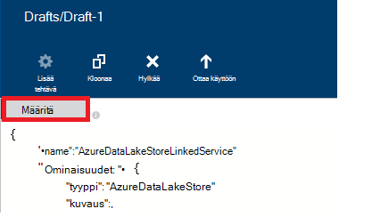

<properties
    pageTitle="Tietojen siirtäminen tai Azure järvi tietovaraston | Azure Data Factory"
    description="Lue, miten voit siirtää tietoja ja Azure Lake Tietosäilölle Azure Data Factory avulla"
    services="data-factory"
    documentationCenter=""
    authors="linda33wj"
    manager="jhubbard"
    editor="monicar"/>

<tags
    ms.service="data-factory"
    ms.workload="data-services"
    ms.tgt_pltfrm="na"
    ms.devlang="na"
    ms.topic="article"
    ms.date="09/27/2016"
    ms.author="jingwang"/>

# Tietojen siirtäminen ja sieltä pois Azure Lake Tietosäilölle Azure Data Factory käyttäminen
Tässä artikkelissa käsitellään käyttämisestä kopioi tehtävän Azure tietojen factory-siirretään tiedot / Azure järvi tietosäilö ja toisen tietosäilö. Tässä artikkelissa perustuu [tietojen siirtämistä tehtävät](data-factory-data-movement-activities.md) -artikkelista, jossa näkyy yleiskatsaus tietojen siirto kopio-toimintojen ja tuettuja kaupan yhdistelmät.

> [AZURE.NOTE]
> Luo Azure järvi tietovaraston tili ennen kuin luot putkijohto kopio-aktiviteettiin tietoja voi siirtää ja Azure tietojen järvi-kaupasta. Lisätietoja Azure järvi tietosäilö on artikkelissa [Azure järvi tietovaraston käytön aloittaminen](../data-lake-store/data-lake-store-get-started-portal.md).
>  
> Tarkista [luominen ensimmäisen myyntijakso-opetusohjelma](data-factory-build-your-first-pipeline.md) yksityiskohtaiset ohjeet tietojen factory, linkitetyn services, tietojoukkoja ja putkijohto luomiseen. Tietoja Factory editorin tai Visual Studio PowerShellin Azure JSON-katkelmat avulla voit luoda Data Factory-kohteita.

## Ohjattu tietojen kopioiminen
Helpointa luoda myyntijakso, kopioi tiedot ja Azure järvi tietosäilö on käyttämällä ohjattua Kopioi tiedot. Katso [Opetusohjelma: Luo kopio ohjatulla putkijohto](data-factory-copy-data-wizard-tutorial.md) nopeasti käyttämällä ohjattua tietojen kopioiminen putkijohto luomisesta saat. 

Seuraavissa esimerkeissä otoksen JSON määritykset, jonka avulla voit luoda putkijohto [Azure portal](data-factory-copy-activity-tutorial-using-azure-portal.md) tai [Visual Studio](data-factory-copy-activity-tutorial-using-visual-studio.md) tai [PowerShellin Azure](data-factory-copy-activity-tutorial-using-powershell.md). Ne näyttävät tietojen kopioimisesta ja sieltä pois Azure järvi tietovaraston ja Azure-Blob-objektien tallennustilaan. Tietoja voi kuitenkin kopioidun **suoraan** mistä tahansa lähteestä johonkin seuraavista poistumia määritetyllä tavalla [tähän](data-factory-data-movement-activities.md#supported-data-stores) kopio-toimintojen käyttäminen Azure Data Factory.  

## Esimerkki: Tietojen kopioiminen Azure-Blob Azure järvi tietosäilö
Seuraavassa esimerkissä:

1.  Linkitetyn palvelu [AzureStorage](#azure-storage-linked-service-properties)tyyppi.
2.  Linkitetyn palvelu [AzureDataLakeStore](#azure-data-lake-linked-service-properties)tyyppi.
3.  Syötteen [tietojoukko](data-factory-create-datasets.md) tyypin [AzureBlob](#azure-blob-dataset-type-properties).
4.  Tulosteen [tietojoukko](data-factory-create-datasets.md) tyypin [AzureDataLakeStore](#azure-data-lake-dataset-type-properties).
4.  [Myyntijakso](data-factory-create-pipelines.md) kopioi aktiviteettiin, joka käyttää [BlobSource](#azure-blob-copy-activity-type-properties) ja [AzureDataLakeStoreSink](#azure-data-lake-copy-activity-type-properties).

Otosten kopioi aikasarjalle tietojen Azure-Blob-objektien tallennustilaan Azure järvi tietovaraston tunnissa. Käyttää näitä esimerkkejä JSON-ominaisuuksia on kuvattu osia seuraavat mallit.

**Azure-tallennustilan linkitetty palvelu:**

    {
      "name": "StorageLinkedService",
      "properties": {
        "type": "AzureStorage",
        "typeProperties": {
          "connectionString": "DefaultEndpointsProtocol=https;AccountName=<accountname>;AccountKey=<accountkey>"
        }
      }
    }

**Azure tietojen järvi linkitetty palvelu:**

    {
        "name": "AzureDataLakeStoreLinkedService",
        "properties": {
            "type": "AzureDataLakeStore",
            "typeProperties": {
                "dataLakeStoreUri": "https://<accountname>.azuredatalakestore.net/webhdfs/v1",
                "sessionId": "<session ID>",
                "authorization": "<authorization URL>"
            }
        }
    }

### Voit luoda Azure järvi linkitetyn tietopalvelu tietojen Factory-editorilla
Seuraavassa kerrotaan luominen Azure Lake Tietosäilölle linkitetty-palvelu tietojen Factory-editorin.

1. Valitse komentopalkista **tallentaa uudet tiedot** ja valitse **Azure Lake Tietosäilölle**.
2. Kirjoita tiedot järvi URI **dataLakeStoreUri** -ominaisuutta, JSON-editori.
3. Valitse **Hyväksy** -painiketta, Valitse komentopalkista. Näyttöön tulee ponnahdusikkuna.

    

4. Tunnistetietojen avulla voit kirjautua sisään ja JSON **todennus** -ominaisuus määritetään arvon nyt.
5. (valinnainen) Määritä valinnaisten parametrien, kuten **accountName**, **subscriptionID**ja **resourceGroupName** arvot JSON (tai) näiden ominaisuuksien poistaminen JSON.
6. Valitse **Ota käyttöön** komentopalkista linkitetyn palvelun käyttöön.

> [AZURE.IMPORTANT] **Hyväksy** -painikkeen avulla luotu luvan koodin vanhenee kuluttua. **Reauthorize** käyttämällä **Hyväksy** painiketta milloin **tunniste vanhentuu** ja laukaisun linkitetyn palvelu. Katso [Azure tietojen järvi linkitetyn säilöpalvelun](#azure-data-lake-store-linked-service-properties) osassa. 

**Azure Blob syötteen tietojoukko:**

Tiedot on noudettu uusi blob-tunnissa (taajuus: tunti, väli: 1). Blob kansion polku ja tiedostonimi dynaamisesti arvioidaan, käsitellään sektoria alkamispäivää perusteella. Kansiopolku käyttävät vuoden, kuukauden ja päivän aloitusaika-osa ja tiedostonimi alkamisajan tunti-osa. "ulkoinen": "true" asetus ilmoittaa Data Factory-palvelu, että taulukko on ulkoiset tiedot-factory ja tietojen factory toimintaa ei tuottamat.

    {
      "name": "AzureBlobInput",
      "properties": {
        "type": "AzureBlob",
        "linkedServiceName": "StorageLinkedService",
        "typeProperties": {
          "folderPath": "mycontainer/myfolder/yearno={Year}/monthno={Month}/dayno={Day}",
          "partitionedBy": [
            {
              "name": "Year",
              "value": {
                "type": "DateTime",
                "date": "SliceStart",
                "format": "yyyy"
              }
            },
            {
              "name": "Month",
              "value": {
                "type": "DateTime",
                "date": "SliceStart",
                "format": "MM"
              }
            },
            {
              "name": "Day",
              "value": {
                "type": "DateTime",
                "date": "SliceStart",
                "format": "dd"
              }
            },
            {
              "name": "Hour",
              "value": {
                "type": "DateTime",
                "date": "SliceStart",
                "format": "HH"
              }
            }
          ]
        },
        "external": true,
        "availability": {
          "frequency": "Hour",
          "interval": 1
        },
        "policy": {
          "externalData": {
            "retryInterval": "00:01:00",
            "retryTimeout": "00:10:00",
            "maximumRetry": 3
          }
        }
      }
    }

**Azure tietojen järvi tulosteen tietojoukko:**

Otosten kopioi tiedot Azure tietojen järvi-kaupasta. Uudet tiedot ovat tietojen järvi kopioiden tallentaa tunnissa.

    {
        "name": "AzureDataLakeStoreOutput",
        "properties": {
            "type": "AzureDataLakeStore",
            "linkedServiceName": "AzureDataLakeStoreLinkedService",
            "typeProperties": {
                "folderPath": "datalake/output/"
            },
            "availability": {
                "frequency": "Hour",
                "interval": 1
            }
        }
    }

**Kopioi aktiviteettiin putkijohto:**

Putkisto sisältää kopio-toiminto, joka on määritetty käyttämään syöttö- ja tietojoukkoja ja on suunniteltu toimimaan tunnissa. Myyntijakso JSON määritelmä- **lähteen** tyyppi on määritetty **BlobSource** ja **käsittelytoiminto** tyyppi-asetukseksi on määritetty **AzureDataLakeStoreSink**.

    {  
        "name":"SamplePipeline",
        "properties":
        {  
            "start":"2014-06-01T18:00:00",
            "end":"2014-06-01T19:00:00",
            "description":"pipeline with copy activity",
            "activities":
            [  
                {
                    "name": "AzureBlobtoDataLake",
                    "description": "Copy Activity",
                    "type": "Copy",
                    "inputs": [
                    {
                        "name": "AzureBlobInput"
                    }
                    ],
                    "outputs": [
                    {
                        "name": "AzureDataLakeStoreOutput"
                    }
                    ],
                    "typeProperties": {
                        "source": {
                            "type": "BlobSource",
                            "treatEmptyAsNull": true,
                            "blobColumnSeparators": ","
                        },
                        "sink": {
                            "type": "AzureDataLakeStoreSink"
                        }
                    },
                    "scheduler": {
                        "frequency": "Hour",
                        "interval": 1
                    },
                    "policy": {
                        "concurrency": 1,
                        "executionPriorityOrder": "OldestFirst",
                        "retry": 0,
                        "timeout": "01:00:00"
                    }
                }
            ]
        }
    }

## Esimerkki: Tietojen kopioiminen Azure järvi tietovaraston Azure-Blob
Seuraavassa esimerkissä:

1.  Linkitetyn palvelu [AzureDataLakeStore](#azure-data-lake-linked-service-properties)tyyppi.
2.  Linkitetyn palvelu [AzureStorage](#azure-storage-linked-service-properties)tyyppi.
3.  Syötteen [tietojoukko](data-factory-create-datasets.md) tyypin [AzureDataLakeStore](#azure-data-lake-dataset-type-properties).
4.  Tulosteen [tietojoukko](data-factory-create-datasets.md) tyypin [AzureBlob](#azure-blob-dataset-type-properties).
5.  [Myyntijakso](data-factory-create-pipelines.md) ja kopioi-toiminto, joka käyttää [AzureDataLakeStoreSource](#azure-data-lake-copy-activity-type-properties) ja [BlobSink](#azure-blob-copy-activity-type-properties)

Otosten kopioi aikasarjalle tietojen Azure tietojen järvi-kaupasta Azure-blob tunnissa. Käyttää näitä esimerkkejä JSON-ominaisuuksia on kuvattu osia seuraavat mallit.

**Azure järvi tietovaraston linkitetty palvelu:**

    {
        "name": "AzureDataLakeStoreLinkedService",
        "properties": {
            "type": "AzureDataLakeStore",
            "typeProperties": {
                "dataLakeStoreUri": "https://<accountname>.azuredatalakestore.net/webhdfs/v1",
                "sessionId": "<session ID>",
                "authorization": "<authorization URL>"
            }
        }
    }

> [AZURE.NOTE] Katso, miten edellisen näytteen luvan URL-osoitteen.  

**Azure-tallennustilan linkitetty palvelu:**

    {
      "name": "StorageLinkedService",
      "properties": {
        "type": "AzureStorage",
        "typeProperties": {
          "connectionString": "DefaultEndpointsProtocol=https;AccountName=<accountname>;AccountKey=<accountkey>"
        }
      }
    }

**Azure tietojen järvi näytettävä tietojoukko:**

Määrittäminen **"ulkoinen": TOSI** Data Factory-palvelun ilmoittaa, että taulukko on ulkoiset tiedot-factory ja tietojen factory toimintaa ei tuottamat.

    {
        "name": "AzureDataLakeStoreInput",
        "properties":
        {
            "type": "AzureDataLakeStore",
            "linkedServiceName": "AzureDataLakeStoreLinkedService",
            "typeProperties": {
                "folderPath": "datalake/input/",
                "fileName": "SearchLog.tsv",
                "format": {
                    "type": "TextFormat",
                    "rowDelimiter": "\n",
                    "columnDelimiter": "\t"
                }
            },
            "external": true,
            "availability": {
                "frequency": "Hour",
                "interval": 1
            },
            "policy": {
                "externalData": {
                    "retryInterval": "00:01:00",
                    "retryTimeout": "00:10:00",
                    "maximumRetry": 3
                }
            }
        }
    }

**Azure-Blob tulosteen tietojoukko:**

Tietoja kirjoitetaan uusia Blob-objektien tunnissa (taajuus: tunti, väli: 1). Kansiopolun blob arvioidaan dynaamisesti sektoria, käsitellään alkamispäivää perusteella. Kansiopolku käytetään vuoden, kuukauden, päivän ja alkamisajan tuntia osat.

    {
      "name": "AzureBlobOutput",
      "properties": {
        "type": "AzureBlob",
        "linkedServiceName": "StorageLinkedService",
        "typeProperties": {
          "folderPath": "mycontainer/myfolder/yearno={Year}/monthno={Month}/dayno={Day}/hourno={Hour}",
          "partitionedBy": [
            {
              "name": "Year",
              "value": {
                "type": "DateTime",
                "date": "SliceStart",
                "format": "yyyy"
              }
            },
            {
              "name": "Month",
              "value": {
                "type": "DateTime",
                "date": "SliceStart",
                "format": "MM"
              }
            },
            {
              "name": "Day",
              "value": {
                "type": "DateTime",
                "date": "SliceStart",
                "format": "dd"
              }
            },
            {
              "name": "Hour",
              "value": {
                "type": "DateTime",
                "date": "SliceStart",
                "format": "HH"
              }
            }
          ],
          "format": {
            "type": "TextFormat",
            "columnDelimiter": "\t",
            "rowDelimiter": "\n"
          }
        },
        "availability": {
          "frequency": "Hour",
          "interval": 1
        }
      }
    }

**Putkijohto kopio-toimintoa:**

Putkisto sisältää kopio-toiminto, joka on määritetty käyttämään syöttö- ja tietojoukkoja ja on suunniteltu toimimaan tunnissa. Myyntijakso JSON määritelmä- **lähteen** tyyppi on määritetty **AzureDataLakeStoreSource** ja **käsittelytoiminto** tyyppi-asetukseksi on määritetty **BlobSink**.

    {  
        "name":"SamplePipeline",
        "properties":{  
            "start":"2014-06-01T18:00:00",
            "end":"2014-06-01T19:00:00",
            "description":"pipeline for copy activity",
            "activities":[  
                {
                    "name": "AzureDakeLaketoBlob",
                    "description": "copy activity",
                    "type": "Copy",
                    "inputs": [
                      {
                        "name": "AzureDataLakeStoreInput"
                      }
                    ],
                    "outputs": [
                      {
                        "name": "AzureBlobOutput"
                      }
                    ],
                    "typeProperties": {
                        "source": {
                            "type": "AzureDataLakeStoreSource",
                        },
                        "sink": {
                            "type": "BlobSink"
                        }
                    },
                    "scheduler": {
                        "frequency": "Hour",
                        "interval": 1
                    },
                    "policy": {
                        "concurrency": 1,
                        "executionPriorityOrder": "OldestFirst",
                        "retry": 0,
                        "timeout": "01:00:00"
                    }
                }
             ]
        }
    }

## Azure tietojen järvi linkitetyn säilöpalvelun ominaisuudet

Voit linkittää Azure-tallennustilan tilin Azure tiedot-factory, Azuren tallennustilaan linkitetty-palvelun avulla. Seuraavassa taulukossa on kuvaus JSON elementtien tietyn Azuren tallennustilaan linkitetty-palveluun.

| Ominaisuus | Kuvaus | Pakollinen |
| :-------- | :----------- | :-------- |
| tyyppi | Type-ominaisuus on määritettävä: **AzureDataLakeStore** | Kyllä |
| dataLakeStoreUri | Määritä Azure järvi tietosäilö-tilin tiedot. Se on seuraava kaava: https://<Azure Data Lake account name>.azuredatalakestore.net/webhdfs/v1 | Kyllä |
| todennus | **Tietoja Factory editorin** **Hyväksy** -painiketta ja kirjoita oman tunnistetiedon, joka määrittää tämän ominaisuuden automaattisesti luodut luvan URL-osoite.  | Kyllä |
| Istunto | OAuth istunnon tunnus oauth luvan istunnosta. Kunkin istunnon tunnus on yksilöllinen ja voi käyttää vain kerran. Tämä asetus luodaan automaattisesti, kun käytät tietojen Factory-editorin. | Kyllä |  
| accountName | Tietoja järvi tilin nimi | Ei |
| subscriptionId | Azure tilauksen tunnus. | Ei (Jos ei määritetä, tietojen factory tilauksen käytetään). |
| resourceGroupName |  Azure resurssiryhmän nimi | Ei (Jos ei määritetä, resurssiryhmä, tietojen factory käytetään). |

## Tunnuksen vanhentumisen 
**Hyväksy** -painikkeen avulla voit luoda luvan koodin vanhenee kuluttua. Seuraavassa taulukossa saat varten käyttäjätilejä erityyppisiä vanheneminen-aikoja. Näkyviin voi tulla seuraava virhe yhteydessä todennus- **tunnuksen päättyy**: "tunnistetietojen toiminto-virhe: invalid_grant - AADSTS70002: Virhe tarkistettaessa tunnistetiedot. AADSTS70008: Annettu access-myöntäminen vanhentunut tai kumottu. Jäljitä ID: d18629e8-af88-43c5-88e3-d8419eb1fca1 Korrelaatiotunnus: fac30a0c-6be6-4e02-8d69-a776d2ffefd7 aikaleima: 2015 – 12-15 21-09-31Z ".

| Käyttäjätyyppi | Vanhentuu |
| :-------- | :----------- | 
| Azure Active Directory ei hallita käyttäjätilejä (@hotmail.com, @live.com, jne.). | 12 tuntia |
| Käyttäjien tilejä, joiden hallinnassa mukaan Azure Active Directory (AAD) | 14 päivän viimeinen sektoria Suorita.   90 päivää, OAuth-pohjaisen linkitetyn palvelun perusteella sektoria käytetään vähintään 14 päivän välein. |

Jos muutat salasana ennen tunnuksen vanhentumisen tällä hetkellä, tunnuksen vanhenee välittömästi ja näet tässä osassa virheen. 

Voit välttää ja ratkaista tämän virheen, käyttämällä **Hyväksy** reauthorize painikkeen milloin **tunniste vanhentuu** ja laukaisun linkitetyn palvelu. Voit myös luoda ohjelmallisesti käyttämällä seuraavassa osassa **istunto** ja **käyttöoikeuksien** ominaisuuksien arvot:

### Voit luoda ohjelmallisesti istunto ja luvan arvot 

    if (linkedService.Properties.TypeProperties is AzureDataLakeStoreLinkedService ||
        linkedService.Properties.TypeProperties is AzureDataLakeAnalyticsLinkedService)
    {
        AuthorizationSessionGetResponse authorizationSession = this.Client.OAuth.Get(this.ResourceGroupName, this.DataFactoryName, linkedService.Properties.Type);

        WindowsFormsWebAuthenticationDialog authenticationDialog = new WindowsFormsWebAuthenticationDialog(null);
        string authorization = authenticationDialog.AuthenticateAAD(authorizationSession.AuthorizationSession.Endpoint, new Uri("urn:ietf:wg:oauth:2.0:oob"));

        AzureDataLakeStoreLinkedService azureDataLakeStoreProperties = linkedService.Properties.TypeProperties as AzureDataLakeStoreLinkedService;
        if (azureDataLakeStoreProperties != null)
        {
            azureDataLakeStoreProperties.SessionId = authorizationSession.AuthorizationSession.SessionId;
            azureDataLakeStoreProperties.Authorization = authorization;
        }

        AzureDataLakeAnalyticsLinkedService azureDataLakeAnalyticsProperties = linkedService.Properties.TypeProperties as AzureDataLakeAnalyticsLinkedService;
        if (azureDataLakeAnalyticsProperties != null)
        {
            azureDataLakeAnalyticsProperties.SessionId = authorizationSession.AuthorizationSession.SessionId;
            azureDataLakeAnalyticsProperties.Authorization = authorization;
        }
    }

Näkyviin [AzureDataLakeStoreLinkedService luokan](https://msdn.microsoft.com/library/microsoft.azure.management.datafactories.models.azuredatalakestorelinkedservice.aspx) [AzureDataLakeAnalyticsLinkedService luokan](https://msdn.microsoft.com/library/microsoft.azure.management.datafactories.models.azuredatalakeanalyticslinkedservice.aspx)ja [AuthorizationSessionGetResponse luokan](https://msdn.microsoft.com/library/microsoft.azure.management.datafactories.models.authorizationsessiongetresponse.aspx) käyttää koodissa Data Factory luokkien tietoja. Lisää **2.9.10826.1824** version **Microsoft.IdentityModel.Clients.ActiveDirectory.WindowsForms.dll** käyttää koodissa WindowsFormsWebAuthenticationDialog luokan viittaus. 
 

## Azure tietojen järvi tietojoukko ominaisuudet

Täydellinen luettelo JSON-osat ja ominaisuudet käytettävissä määrittäminen tietojoukkoja [luominen tietojoukkoja](data-factory-create-datasets.md) on artikkelissa. Osia, kuten rakenne, käytettävyys ja tietojoukko JSON käytännön muistuttavat tyypeissä tietojoukko (Azure SQL Azure-blob, Azuren taulukkojen jne.).

**TypeProperties** -kohta ei ole mistäkin tietojoukko ja tietoja sijaintia, muotoilla jne tietovaraston tiedot. Tyypin **AzureDataLakeStore** tietojoukko tietojoukko typeProperties osiossa on seuraavat ominaisuudet:

| Ominaisuus | Kuvaus | Pakollinen |
| :-------- | :----------- | :-------- |
| Kansiopolku | Säilön ja Azure tietojen järvi kansion polku Tallenna. | Kyllä |
| Tiedostonimi | Azure tietojen järvi kaupan tiedoston nimi. Tiedostonimi on valinnainen ja kirjainkoko on merkitsevä.   Jos määrität tiedostonimi, tiedoston toimii tehtävän (mukaan lukien kopio).  Kun tiedoston nimi ei ole määritetty, kopioi sisältää kaikki tiedostot kansiopolku syötteen tietojoukko varten.  Kun tulostus-tietojoukko tiedostonimi ei ole määritetty, luodun tiedoston nimi on oltava seuraavat tässä muodossa: tiedot. <Guid>.txt (esimerkiksi:: Data.0a405f8a 93ff-4c6f-b3be-f69616f1df7a.txt | Ei |
| partitionedBy | partitionedBy on valinnainen ominaisuus. Sen avulla voit määrittää dynaamisen kansiopolku ja tiedostonimi sarjan aikatietoja. Kansiopolku voit esimerkiksi Parametroitu tunnissa tietoja varten. Saat lisätietoja ja esimerkkejä kohdassa [käyttäminen partitionedBy ominaisuus](#using-partitionedby-property) . | Ei |
| Muotoile | Muotoile seuraavanlaisia tuetaan: **TekstinMuoto**, **AvroFormat**, **JsonFormat**, **OrcFormat**, **ParquetFormat**. Muotoile **tyyppi** -ominaisuuden arvoksi jokin näistä arvoista. Lue lisätietoja [Määrittäminen TekstinMuoto](#specifying-textformat), [Määrittämällä AvroFormat](#specifying-avroformat), [Määrittämällä JsonFormat](#specifying-jsonformat), [Määrittämällä OrcFormat](#specifying-orcformat)ja [Määrittämällä ParquetFormat](#specifying-parquetformat) osat. Jos haluat kopioida tiedostot muodossa-on välillä tiedostopohjaisia stores (binaarinen kopio), voit ohittaa sekä syöttö- ja tietojoukko määritelmät muoto-kohdassa.| Ei
| pakkaus | Määritä tyyppi ja tietojen pakkaus taso. Tuetut tiedostotyypit ovat: **GZip**, **Deflate**ja **BZip2** ja tuettujen tasot ovat: **Optimal** ja **nopein**. Tällä hetkellä pakkausasetuksia ei tue tietojen **AvroFormat** tai **OrcFormat**. Jos haluat lisätietoja, katso [pakkaamisen tuki](#compression-support) -osa.  | Ei |

### PartitionedBy-ominaisuuden avulla
Voit määrittää dynaamisen kansiopolku ja tiedostonimi sarjan aikatietoja **partitionedBy** -osassa, Data Factory makrot ja Järjestelmämuuttujat: SliceStart ja SliceEnd, jotka ilmaisevat, on annettu data-sektori alkamis- ja päättymisajat.

Tutustumalla [Tietojoukkoja luominen](data-factory-create-datasets.md) ja [ajoittaminen ja suorittamisen](data-factory-scheduling-and-execution.md) ymmärtää aika sarjan tietojoukkoja, järjestäminen ja sektoreiden enemmän tietoja.

#### Esimerkki 1

    "folderPath": "wikidatagateway/wikisampledataout/{Slice}",
    "partitionedBy":
    [
        { "name": "Slice", "value": { "type": "DateTime", "date": "SliceStart", "format": "yyyyMMddHH" } },
    ],

Tässä esimerkissä {sektoria} tilalla on määritetty Data Factory järjestelmämuuttujan SliceStart (YYYYMMDDHH)-muodossa arvo. SliceStart viittaa sektoria aloitusaika. Kansiopolku on erilainen jokaiselle sektoria. Esimerkki: wikidatagateway/wikisampledataout/2014100103 tai wikidatagateway/wikisampledataout/2014100104

#### Esimerkki 2

    "folderPath": "wikidatagateway/wikisampledataout/{Year}/{Month}/{Day}",
    "fileName": "{Hour}.csv",
    "partitionedBy":
     [
        { "name": "Year", "value": { "type": "DateTime", "date": "SliceStart", "format": "yyyy" } },
        { "name": "Month", "value": { "type": "DateTime", "date": "SliceStart", "format": "MM" } },
        { "name": "Day", "value": { "type": "DateTime", "date": "SliceStart", "format": "dd" } },
        { "name": "Hour", "value": { "type": "DateTime", "date": "SliceStart", "format": "hh" } }
    ],

Tässä esimerkissä vuoden, kuukauden, päivän ja ajan SliceStart puretaan tuominen eri muuttujat, joita käytetään kansiopolku ja tiedostonimi-ominaisuudet.

[AZURE.INCLUDE [data-factory-file-format](../../includes/data-factory-file-format.md)]
 

### Pakkaamisen tuki  
Suurten tietojoukkojen käsittelyn voi aiheuttaa i/o ja verkon pullonkaulojen. Vuoksi stores pakattujen tietojen Voit paitsi nopeuttaa tietojen siirto verkossa ja säästää levytilaa, mutta tuo myös merkittäviä parannuksia suuri tietojen käsittelemistä. Pakkaus on tällä hetkellä tueta tiedostopohjaisia tietojen stores esimerkiksi Azure-Blob- tai paikallisen tiedostojärjestelmässä.  

Voit määrittää tietojoukko pakkaus käyttämällä **pakkaus** -ominaisuuden tietojoukossa JSON seuraavan esimerkin mukaisesti:   

    {  
        "name": "AzureDatalakeStoreDataSet",  
        "properties": {  
            "availability": {  
                "frequency": "Day",  
                "interval": 1  
            },  
            "type": "AzureDatalakeStore",  
            "linkedServiceName": "DataLakeStoreLinkedService",  
            "typeProperties": {  
                "fileName": "pagecounts.csv.gz",  
                "folderPath": "compression/file/",  
                "compression": {  
                    "type": "GZip",  
                    "level": "Optimal"  
                }  
            }  
        }  
    }  
 
**Tiivistys** -osassa on kaksi ominaisuudet:  
  
- **Tyyppi:** pakkauksenhallintaa, joka voi olla **GZIP**, **Deflate** tai **BZIP2**.  
- **Taso:** pakkaamisen suhde, joka voi olla **Optimal** tai **nopein**. 
    - **Nopein:** Pakkaaminen toimintoa täyttävän mahdollisimman nopeasti, vaikka tiedosto ei pakata optimaalisesti. 
    - **Optimal**: pakkaaminen toimintoa kannattaa optimaalisesti pakata, vaikka toimintoa kestää kauemmin suorittamiseen. 
    
    Lisätietoja on [Pakkauksen](https://msdn.microsoft.com/library/system.io.compression.compressionlevel.aspx) aiheessa. 

Oletetaan, että malli-tietojoukko käytetään kopioi tehtävän tulos. Kopioi tehtävän pakkaa tiedot GZIP-pakkauksenhallinnan avulla paras suhde kanssa ja kirjoittaa sitten pakattujen tietojen pagecounts.csv.gz Azure tietojen järvi kaupan-tiedostoon.   

Kun määrität pakkaus-ominaisuuden syötteen tietojoukko JSON, putkijohto lukee pakattujen tietojen lähteestä. Jos määrität ominaisuuden tulostus-tietojoukko JSON, kopioi tehtävän kirjoittaa pakattujen tietojen kohteeseen. Tässä on muutama esimerkkiskenaarioita: 

- Luku GZIP pakattujen tietojen Azure tietojen järvi kaupasta, purkaa sen ja kirjoittaa tiedot Azure SQL-tietokantaan. Voit määrittää syötteen Azure järvi tietovaraston tietojoukko, pakkauksen JSON-ominaisuuden tällöin. 
- Lukea paikallisen tiedostojärjestelmän vain teksti-tiedoston tietoja, pakata GZip-muodossa ja kirjoittaa pakattujen tietojen Azure tietovaraston järvi. Voit määrittää tulosteen Azure tietojen järvi tietojoukko pakkauksen JSON-ominaisuuden tällöin.  
- Lue GZIP pakattujen tietojen Azure tietojen järvi-kaupasta, purkaa sen, pakkaa käyttämällä BZIP2 ja kirjoittaa tiedot Azure tietojen järvi-kaupasta. Määritä pakkaamisen tyypin määrittäminen GZIP ja BZIP2 syötteen ja tulosteen tietojoukkoja tarpeen mukaan.   

## Azure tietojen järvi kopioi tehtävän ominaisuudet  
Täydellinen luettelo osat ja ominaisuudet, jotka ovat käytettävissä toiminnan määrittäminen [Putkistot luomisesta](data-factory-create-pipelines.md) on artikkelissa. Ominaisuudet, kuten nimi, kuvaus sekä syöttö- ja taulukot ja käytäntö ovat käytettävissä kaikki tehtävälajit.

Tehtävän typeProperties-osassa käytettävissä olevat ominaisuudet vaihtelevat toisaalta kunkin tehtävätyyppi. Kopioi tehtävälle ne vaihtelevat sen mukaan, lähteiden ja poistumia

**AzureDataLakeStoreSource** tukee ominaisuudet **typeProperties** -osassa:

| Ominaisuus | Kuvaus | Sallittu arvo | Pakollinen |
| -------- | ----------- | -------------- | -------- |
| Rekursiiviset | Ilmaisee, onko tiedot luetaan rekursiivisesti sub-kansiot tai vain määritettyyn kansioon. | TRUE (oletusarvo), EPÄTOSI | Ei |

**AzureDataLakeStoreSink** tukee ominaisuudet **typeProperties** -osassa:

| Ominaisuus | Kuvaus | Sallittu arvo | Pakollinen |
| -------- | ----------- | -------------- | -------- |
| copyBehavior | Määrittää kopioi toiminnan. | **PreserveHierarchy:** säilyttää kohdekansio tiedoston hierarkiaa. Tietolähteen kansio lähdetiedoston suhteellinen polku on sama kuin kohde kansioon kohdetiedosto suhteellinen polku.  **FlattenHierarchy:** kaikki tiedostot lähdekansio luodaan ensimmäisen tason kohdekansio. Kohde-tiedostot luodaan automaattisesti luotu nimi.  **MergeFiles:** yhdistää yhden tiedoston kaikkien tiedostojen lähde-kansiosta. Jos tiedosto-Blob-objektien nimi on määritetty, yhdistetyt tiedostonimen olisi on määritetty nimi Muussa tapauksessa olisi automaattisesti luodut tiedostonimi. | Ei |

[AZURE.INCLUDE [data-factory-structure-for-rectangualr-datasets](../../includes/data-factory-structure-for-rectangualr-datasets.md)]

[AZURE.INCLUDE [data-factory-type-conversion-sample](../../includes/data-factory-type-conversion-sample.md)]

[AZURE.INCLUDE [data-factory-column-mapping](../../includes/data-factory-column-mapping.md)]

## Suorituskyky ja säätäminen  
Lisätietoja on artikkelissa [Kopioi tehtävän suorituskyvyn & säätäminen opas](data-factory-copy-activity-performance.md) lisätietoja tärkeimmät seikat, vaikutus suorituskykyä tietojen siirto (kopioi tehtävä) Azure Data Factory ja voidaan optimoida sen usealla tavalla.
