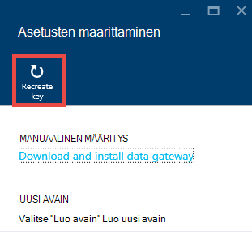
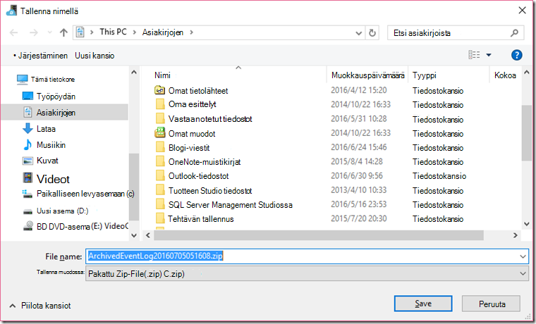

<properties 
    pageTitle="Data Management Gatewayn Data Factory | Microsoft Azure"
    description="Tietojen siirtäminen paikallisen käyttöön ja määrittää yhdyskäytävän tiedot. Azure Data Factory Data Management Gatewayn avulla voit siirtää tietoja." 
    services="data-factory" 
    documentationCenter="" 
    authors="linda33wj" 
    manager="jhubbard" 
    editor="monicar"/>

<tags 
    ms.service="data-factory" 
    ms.workload="data-services" 
    ms.tgt_pltfrm="na" 
    ms.devlang="na" 
    ms.topic="article" 
    ms.date="10/11/2016" 
    ms.author="jingwang"/>

# Data Management Gateway
Data Management Gateway on asiakas-agentti, sinun on asennettava paikallisen ympäristön kopioitavat tiedot cloud ja paikallisten tietojen stores välillä. Paikallisen tietoja tallennetuista tiedoista Data Factory tukemat on lueteltu [Tuetut tietolähteet](data-factory-data-movement-activities.md##supported-data-stores) -osassa. 

> [AZURE.NOTE] Tällä hetkellä yhdyskäytävän tukee vain kopioi tehtävän ja tallennettu toimintosarja tehtävän Data Factory. Ei ole mahdollista paikallisen tietolähteiden mukautetut aktiviteetit Gatewayn avulla. 

Tässä artikkelissa täydentää vaiheittainen kuvaus- [tietojen siirtäminen paikallisen ja pilvessä Microsoft Data](data-factory-move-data-between-onprem-and-cloud.md) artikkelissa. Vaihe vaiheelta voit luoda putkijohto, joka käyttää yhdyskäytävän tiedot Siirry Azure-blob paikallisen SQL Server-tietokantaan. Tässä artikkelissa on tarkkoja Data Management Gateway tarkempia tietoja.   

## Yleiskatsaus

### Data Management Gatewayn ominaisuudet
Data Management Gateway on seuraavia ominaisuuksia:

- Mallin paikalliset tietolähteet ja cloud tietolähteet samat tiedot factory- ja Siirrä tiedot.
- On yksittäinen laidassa lasi, valvonnan ja hallinnan kanssa näkyvyys yhdyskäytävän tila Data Factory-sivu.
- Valitse paikallisten tietolähteiden käytön hallinta suojatusti.
    - Muutoksia ei tarvitse yrityksen palomuuri. Yhdyskäytävä on vain Lähtevät HTTP-pohjaista yhteydet, Avaa internet.
    - Paikallisen tietojen-stores kanssa varmennetta tunnistetietojen salaamiseen.
- Tietojen siirtäminen tehokkaasti – tiedot siirretään rinnakkain, joustavat, ajoittaiset verkko automaattisesti uudelleen logiikan.

### Komennon kulun sekä tiedonkulun
Kun paikallisen ja cloud tietojen kopioiminen Kopioi tehtävän, tehtävä käyttää yhdyskäytävän tietojen siirtämistä cloud ja päinvastoin paikallisen tietolähteen.

Tässä ylätason tietoja työnkulku ja kopioi tiedot Gatewayn vaiheiden yhteenveto: 

1.  Tietoja kehittäjä Luo yhdyskäytävä Azure Data Factory [Azure portal](https://portal.azure.com) tai [PowerShell cmdlet-komennon](https://msdn.microsoft.com/library/dn820234.aspx)avulla. 
2.  Tietoja kehittäjä luo linkitetyn palvelun paikallisen-tietovarasto määrittämällä yhdyskäytävän. Tietoja developer käytetään osana linkitetyn palvelu on määritetty asetus tunnistetiedot-sovelluksen Määritä todennustyypit ja käyttäjätiedot.  Asetus tunnistetiedot sovellus-valintaikkunassa yhteydessä tietovaraston Testaa yhteys ja yhdyskäytävän tunnistetiedot.
3. Yhdyskäytävän salaa tunnistetiedot (tietojen developer toimittamaan,) yhdyskäytävän varmenne kanssa ennen tiedoston tallentamista tunnistetiedot pilvessä.
4. Tietojen Factory-palvelu kommunikoi Gatewayn ajoituksen & kautta, joka käyttää Azure jaettujen palveluiden bus jonon ohjausobjektin kanavan töiden hallinta. Kopioi tehtävän työ on poistettu, kun Data Factory jonot pyynnön ja tunnistetiedot. Yhdyskäytävän potkut ovat kiellettyjä käytöstä työn jälkeen kyselyt jonossa.
5.  Yhdyskäytävän purkaa tunnistetietojen salauksen samaa varmennetta ja luo sitten yhteyden paikallisen tietovaraston ERISNIMI todennustyyppi ja tunnistetiedot.
6.  Yhdyskäytävän kopioi tiedot paikallisen-kaupasta pilvitallennustilaa tai päinvastoin sen mukaan, kopioi tehtävän määrittämistavasta tietojen putkijohto. Tämän vaiheen yhdyskäytävän suoraan yhteydessä pilvipohjainen palveluihin Azure Blob Storage (HTTPS) suojatun kanavan kautta.

### Yhdyskäytävän Huomioitavaa
- Data Management Gateway yksittäisen esiintymän voi käyttää paikallisen useista tietolähteistä. Kuitenkin **yhden yhdyskäytävän esiintymää on yhdistetty vain yksi Azure tietojen factory** eikä sitä voi jakaa toisen tietojen factory.
- Käytössä voi olla **vain yksi esiintymä Data Management Gateway** yhteen tietokoneeseen on asennettu. Oletetaan, että, sinulla on kaksi tietojen tehtaan paikallisen tietolähteiden tarvitsevat, sinun täytyy asentaa yhdyskäytävien kahden paikallisen tietokoneen. Toisin sanoen yhdyskäytävä on yhdistetty tietyt tiedot factory
- **Yhdyskäytävä ei tarvitse olla tietolähteenä samaan tietokoneeseen**. Ottaa yhdyskäytävän lähemmäksi tietolähteeseen lyhentää kuitenkin muodostaa yhteyden tietolähteeseen yhdyskäytävän ajan. On suositeltavaa, että asennat yhdyskäytävän koneessa, joka ei ole sama kuin yksi, joka isännöi paikallisen tietolähteen. Kun yhdyskäytävän ja tietolähteen ovat eri tietokoneissa, yhdyskäytävän kilpailemaan resurssien tietolähteeseen.
- Voit määrittää **useita yhdyskäytäviä yhteyden samaan eri tietokoneissa paikalliseen tietolähteeseen**. Esimerkiksi voi olla kaksi tietojen tehtaan käsittelevä kahta yhdyskäytävää, mutta saman paikallisen tietolähteen tiedot-tehtaan yhteydessä rekisteröity.
- Jos sinulla on jo asennettu käsittelevä **Power BI** -skenaario yhdyskäytävän, asenna **Azure Data Factory erillisessä Gatewayn** toisessa tietokoneessa.
- Yhdyskäytävä on käytettävä myös silloin, kun käytät **ExpressRoute**.
- Käsittele tietolähteen paikallisen tietolähteeksi (joka on palomuurin takana) silloinkin, kun käytät **ExpressRoute**. Yhdyskäytävän avulla voit vahvistaa palvelu ja tietolähteen väliset yhteydet.
- Sinun täytyy **käyttää yhdyskäytävän** vaikka tietovaraston käyttöön **Azure IaaS AM**pilveen. 

## Asennus

### Edellytykset
- **Tuetut käyttöjärjestelmät** eivät Windows 7, Windows 8/8.1, Windows 10, Windows Server 2008 R2, Windows Server 2012: ssa ja Windows Server 2012 R2. Toimialueen ohjauskoneen Data Management Gateway-asennus on tällä hetkellä ei tueta.
- .NET framework 4.5.1 Edellä tarvitaan tai. Jos olet asentamassa yhdyskäytävän Windows 7-laitteeseen, asenna .NET Framework 4.5 tai uudempi. Katso lisätietoja [.NET Framework järjestelmävaatimukset](https://msdn.microsoft.com/library/8z6watww.aspx) . 
- Yhdyskäytävän tietokoneen suositellut **määritykset** on vähintään 2 GHz, 4 sydämiä, 8 Gigatavua RAM-Muistia ja 80 Gigatavun levy.
- Jos host koneen valmius-yhdyskäytävä ei vastaa tietojen pyynnöt. Määritä vuoksi sopiva **palvelupaketti power** tietokoneeseen ennen asennusta yhdyskäytävän. Jos tietokoneessa on määritetty horrostilan, Gatewayn asennus pyytää viestin.
- Sinun on oltava järjestelmänvalvoja tietokoneeseen asennetaan ja määritetään Data Management Gateway onnistuneesti. Voit lisätä muita käyttäjiä **Data Management yhdyskäytävän käyttäjät** paikalliseen Windows-ryhmään. Tämän ryhmän jäsenet voivat määrittää yhdyskäytävän Data Management Gatewayn määritysten hallinta-työkalun avulla. 

Kuin kopioi tehtävän suoritetaan tapahtua tietyn korkojakso resurssien käyttö (suorittimen ja muistin) tietokoneeseen seuraa myös samoissa huippu-ja vapaa-aikoja. Resurssien käytön vaikuttaa myös raskaasti siirretään tietojen määrää. Kun käynnissä on useita kopioi töitä, näet resurssien käyttö piikin aikoina eteenpäin. 

### Asennuksen asetukset
Data Management Gateway on asennettu seuraavilla tavoilla: 

- Lataamalla MSI-asennuksen paketin [Microsoft Download Centeristä](https://www.microsoft.com/download/details.aspx?id=39717).  MSI voidaan myös päivittää aiemmin Data Management Gateway uusimpaan versioon, kaikki säilötyt asetukset.
- Napsauttamalla **Lataa ja asenna tietojen yhdyskäytävän** linkki-kohdassa MANUAALINEN määritys tai Expressin asetukset-kohdassa **Asenna suoraan tietokoneeseen** . Artikkelissa [paikallisen ja cloud tietojen siirtäminen](data-factory-move-data-between-onprem-and-cloud.md) vaiheittaiset ohjeet käyttämisestä Expressin asetukset. Manuaalinen vaihe siirryt download Centeristä.  Lataaminen ja asentaminen yhdyskäytävän download Centeristä ohjeet ovat kohdassa seuraavaan osaan. 

### Asennuksen parhaat käytännöt:
1.  Määritä power suunnitelma yhdyskäytävän Host (isäntä)-laitteeseen, niin, että tietokoneessa ei ole horrostilan. Jos host koneen valmius-yhdyskäytävä ei vastaa tietojen pyynnöt.
2.  Varmuuskopioi yhdyskäytävän varmenne.

### Asenna yhdyskäytävän download Centeristä
1. Siirry [Microsoftin Data Management Gatewayn lataussivulle](https://www.microsoft.com/download/details.aspx?id=39717). 
2. Valitse **Lataa**, valitse haluamasi versio (**32-bittinen** ja **64-bittinen**) ja valitse **Seuraava**. 
3. Suorita **MSI** suoraan tai tallentaa sen kiintolevylle ja suorita.
4. **Aloitussivulla** Valitse **kieli** Valitse **Seuraava**.
5. **Hyväksy** käyttöoikeussopimus ja valitse **Seuraava**. 
6. Valitse **kansio** asentaa yhdyskäytävän ja valitse **Seuraava**. 
7. **Valmiina asentamaan** sivulla Valitse **Asenna**. 
8. Valitse Viimeistele asennus **Valmis** .
9. Hae avain Azure-portaalista. Katso vaiheittaiset ohjeet seuraavasta osiosta. 
10. **Data Management Gatewayn määritysten hallinta** tietokoneessa käynnissä **Rekisteröi yhdyskäytävä** -sivulla seuraavat toimet: 
    1. Liitä teksti sitten-näppäintä.
    2. Myös valitsemalla **Näytä yhdyskäytävän avaimen** avaimen teksti.
    3. Valitse **Rekisteröi**. 

### Rekisteröidä yhdyskäytävän avaimen avulla

#### Jos et ole jo luonut looginen yhdyskäytävä-portaalissa
Voit luoda yhdyskäytävän portaalin ja pyydä avain **määritys** -sivu,-ongelmatilanteita [paikallisen ja cloud tietojen siirtäminen](data-factory-move-data-between-onprem-and-cloud.md) -artikkelin ohjeiden.    

#### Jos olet jo luonut looginen yhdyskäytävä-portaalissa
1. Azure-portaalissa Siirry **Data Factory** -sivu ja valitse **Linkitetty palvelut** -ruutu.

    
2. Valitse **Linkitetty palvelut** -sivu loit portaali looginen **Yhdyskäytävä** . 

      
2. Valitse **Lataa ja asenna tietojen yhdyskäytävän** **Tietojen yhdyskäytävä** -sivu.

       
3. **Määritä** -sivu valitsemalla **Luo avain uudelleen**. Valitse Kyllä varoitusviesti lukemisen huolellisesti jälkeen.

    
4. Valitse vieressä avain kopioi-painiketta. Leikepöydälle kopioidun avain.
    
     

### Järjestelmän ilmaisinalueen kuvakkeet ja ilmoitukset
Seuraava kuva esittää joitakin ilmaisinalueen kuvakkeet, jotka näet. 

Jos kohdistin siirtyy järjestelmän ilmaisinalueen kuvaketta tai ilmoituksen siitä, näyttöön tulee ponnahdusikkuna yhdyskäytävän/päivitys-toiminto tilan tietoja.

### Portit ja palomuuri
On kaksi palomuurit, jotka kannattaa ottaa huomioon: **yrityksen palomuuri** käytössä keskitetyn reitittimeen organisaation ja **Windowsin palomuuri** määritetty daemon paikallisessa tietokoneessa, johon on asennettu yhdyskäytävä.  

Yrityksen palomuuri tasolla täytyy määrittää seuraavat toimialueet ja lähtevien portit:

| Toimialueiden nimet | Portit | Kuvaus |
| ------ | --------- | ------------ |
| *. servicebus.windows.net | 443, 80 | Kuuntelijoita-palvelun Bus välitys TCP (edellyttää 443 käytönvalvonta suojaustunnuksen saamiseksi)-protokollaa | 
| *. servicebus.windows.net | 9350-9354 5671 | Valinnainen palvelun bus välitys TCP-protokollaa | 
| *. core.windows.net | 443 | HTTPS | 
| *. clouddatahub.net | 443 | HTTPS | 
| Graph.Windows.NET | 443 | HTTPS |
| Login.Windows.NET | 443 | HTTPS | 

Windowsin palomuurin tasolla lähtevä porttien tavallisesti otetaan käyttöön. Ei, voit määrittää portit ja toimialueet vastaavasti yhdyskäytävän tietokoneeseen.

#### Tietojen kopioiminen käsittelytoiminto tietovaraston tietolähteen tietosäilö

Varmista, että palomuurisäännöt otetaan käyttöön oikein yrityksen palomuuri Windowsin palomuuri yhdyskäytävän tietokoneessa, tiedot tallennetaan itse. Sääntöjen avulla kummankin tietolähteen yhteyden ja allas onnistuneesti yhdyskäytävä. Ottaa käyttöön jokaisen tietosäilö, joka liittyy kopiointi säännöt.

Voit kopioida **paikallisen-tietovarasto Azure SQL-tietokanta-käsittelytoiminto tai Azure SQL-tietovarasto allas**, toimi seuraavasti: 

- Salli **TCP** lähtevän tietoliikenteen portin **1433** Windowsin palomuuri-ja yrityksen palomuurissa
- Määritä Azure SQL Serverin palomuuriasetukset yhdyskäytävän tietokoneen IP-osoitteen lisääminen sallittujen IP-osoitteiden luetteloon. 

### Välityspalvelimen palvelimen huomioon otettavia seikkoja
Jos yrityksen Verkkoympäristössä Internetiä käytetään välityspalvelinta, Määritä Data Management Gatewayta välityspalvelimen asetusten avulla. Voit määrittää välityspalvelimen alkuperäinen rekisteröinti vaiheen aikana. 

Yhdyskäytävä käyttää välityspalvelimen muodostaa cloud-palveluun. Valitse **Muuta** -linkki ensimmäistä kertaa määritettäessä. Näet **välityspalvelimen asetukset** -valintaikkunassa.

On kolme asetukset: 

- **Älä käytä välityspalvelinta**: yhdyskäytävä ei erikseen Käytä mitä tahansa välityspalvelimen muodostaa yhteyttä pilvipalveluihin.
- **Järjestelmän välityspalvelimen**: yhdyskäytävä käyttää välityspalvelimen asetukset on määritetty diahost.exe.config.  Jos välityspalvelinta on määritetty diahost.exe.config, yhdyskäytävä yhdistää pilvipalveluun suoraan siirtymättä välityspalvelimen kautta.
- **Mukautetun välityspalvelinta**: Määritä HTTP-välityspalvelin asettaminen yhdyskäytävän sijaan käyttömahdollisuudet diahost.exe.config käyttäminen.  Osoite ja portin tarvitaan.  Käyttäjänimi ja salasana ovat valinnaisia oman välityspalvelimen todennus koskevien mukaan.  Kaikki asetukset ovat tunnistetiedon sertifikaatin yhdyskäytävän salataan ja tallennetaan paikallisesti yhdyskäytävän host tietokoneeseen.

Data Management Gateway isäntäpalvelu käynnistyy automaattisesti, kun olet tallentanut päivitetyt välityspalvelimen asetukset. 

Kun yhdyskäytävä on onnistuneesti rekisteröity, jos haluat tarkastella tai päivittää välityspalvelimen, käyttämällä Data Management Gatewayn määritysten hallinta. 

1. Käynnistä Data Management Gatewayn määritysten hallinta.
2. Siirry **asetukset** -välilehti.
3. Valitse **Muuta** -linkki käynnistää **Määritä HTTP-välityspalvelin** -valintaikkunan kohdassa **HTTP-välityspalvelin** .  
4. Kun valitset **Seuraava** -painiketta, näyttöön tulee varoitusikkuna, jossa pyydetään lupaa Tallenna välityspalvelimen asetukset ja Käynnistä yhdyskäytävän isäntäpalvelu uudelleen.

Voit tarkastella ja päivittää HTTP-välityspalvelin määritysten hallinta-työkalun avulla. 

> [AZURE.NOTE] Jos määrität NTLM-todennuksen välityspalvelinta, yhdyskäytävän isäntäpalvelu suoritetaan toimialuetili. Jos muutat myöhemmin toimialuetilin salasanan, muista päivittää palvelun asetukset ja käynnistä se uudelleen vastaavasti. Tämä vaatimus vuoksi suosittelemme käyttämään välityspalvelinta, joka ei edellytä voit päivittää usein oma toimialuetilin avulla.

### Diahost.exe.config välityspalvelimen asetusten määrittäminen
Jos valitset **järjestelmän välityspalvelimen** HTTP-välityspalvelin asettaminen, yhdyskäytävä käyttää diahost.exe.config-välityspalvelimen.  Jos välityspalvelinta ei ole määritetty diahost.exe.config, yhdyskäytävä yhdistää pilvipalveluun suoraan siirtymättä välityspalvelimen kautta. Seuraavassa on ohjeita päivitetään määritystiedosto. 

1.  Tee C:\Program Files\Microsoft Data Management Gateway\2.0\Shared\diahost.exe.config alkuperäisen tiedoston varmuuskopioida turvallisten kopion Resurssienhallinnassa.
2.  Käynnistä Notepad.exe käynnissä järjestelmänvalvojana ja avata tekstitiedoston "C:\Program Files\Microsoft Data Management Gateway\2.0\Shared\diahost.exe.config. Oletusmerkintä etsiminen system.net, kuten seuraava koodi:

            <system.net>
                <defaultProxy useDefaultCredentials="true" />
            </system.net>   

    Voit lisätä välityspalvelimen palvelimen tiedot sitten seuraavan esimerkin mukaisesti:

            <system.net>
                  <defaultProxy enabled="true">
                        <proxy bypassonlocal="true" proxyaddress="http://proxy.domain.org:8888/" />
                  </defaultProxy>
            </system.net>

    Lisäominaisuuksien sallitaan välityspalvelimen tunnisteessa Määritä tarvittavat asetukset, kuten scriptLocation. Lisätietoja syntaksi [välityspalvelimen elementti (verkko-asetukset)](https://msdn.microsoft.com/library/sa91de1e.aspx) .

            <proxy autoDetect="true|false|unspecified" bypassonlocal="true|false|unspecified" proxyaddress="uriString" scriptLocation="uriString" usesystemdefault="true|false|unspecified "/>

3. Tallenna määritystiedosto alkuperäiseen sijaintiin ja käynnistät Data Management Gateway Host (isäntä)-palvelun, joka vastaanottaa muutokset. Voit käynnistää palvelun: käyttää palveluita sovellus Ohjauspaneelin tai **Data Management Gatewayn määritysten hallinta** > **Pysäytä palvelu** -painiketta ja valitse sitten **Käynnistä palvelu**. Jos palvelu ei käynnisty, on todennäköisesti virheellinen XML-tunniste syntaksi on lisätty sovelluksen kokoonpanon tiedostoon, joka on muokattu.     

Näiden kohtien lisäksi myös tarvitset Microsoft Azure ovat yrityksen whitelist. Kelvollinen Microsoft Azure IP-osoitteiden luettelo voi ladata [Microsoft Download Centeristä](https://www.microsoft.com/download/details.aspx?id=41653).

#### Mahdollisia ongelmia, palomuurin ja välityspalvelimen palvelimeen liittyvät ongelmat
Jos käytössä ilmenee virheitä seuraavia summakyselyn, ei-toivottuja vuoksi virheellisestä määrityksestä palomuurin tai välityspalvelimen palvelimen, joka estää Gatewayta muodostamasta yhteyttä Data Factory todennusta. Viitata edellisessä osassa, jotta palomuurin ja välityspalvelimen on määritetty oikein.

1.  Kun yrität rekisteröidä yhdyskäytävän, saat seuraavan virheilmoituksen: "ei voi rekisteröidä yhdyskäytävän avain. Ennen kuin yrität rekisteröidä yhdyskäytävän avain uudelleen, varmista, että Data Management Gateway on yhdistetty-tilaan ja tietojen hallinta-yhdyskäytävän isäntäpalvelu on käynnistetty."
2.  Kun avaat määritysten hallinta-tila näkyy "Yhteys katkaistu" tai "Yhteyden". Kun tarkastelet Windows-tapahtumalokien "Tapahtumienvalvonta" > "Sovellus-ja palvelulokit" > "Data Management Gateway", näet virhesanomista, kuten seuraava virhe:`Unable to connect to the remote server` 
    `A component of Data Management Gateway has become unresponsive and restarts automatically. Component name: Gateway.`

### Avaa tunnistetietojen salaamiseen 8050 portti 
**Määrittää käyttöoikeudet** -sovellus käyttää saapuvan portin **8050** , välitys tunnistetiedot, joita yhdyskäytävän määrittäessäsi paikallisen linkitetty palvelun Azure-portaalissa. Yhdyskäytävän asennuksen aikana oletusarvoisesti, Data Management Gatewayn asennus Avaa sen yhdyskäytävän tietokoneeseen.
 
Jos käytössäsi on kolmannen osapuolen palomuuri, voit avata portin 8050 manuaalisesti. Jos kohtaat palomuurin ongelman yhdyskäytävän asennuksen aikana, voit kokeilla seuraavaa komentoa asentaa yhdyskäytävän ilman palomuurin määrittämisestä.

    msiexec /q /i DataManagementGateway.msi NOFIREWALL=1

Jos et halua avata porttia 8050 yhdyskäytävän tietokoneeseen, käytä järjestelmiä kuin määrittäminen tietojen säilön tunnistetietojen **Asetus tunnistetiedot** -sovelluksen avulla. Voit esimerkiksi käyttää [Uutta AzureRmDataFactoryEncryptValue](https://msdn.microsoft.com/library/mt603802.aspx) PowerShell cmdlet-komennon. Katso, miten tunnistetietojen tallentaminen tietojen [määrittää käyttöoikeudet ja suojaus](#set-credentials-and-securityy) -osan voi määrittää.

## Päivitys 
Oletusarvoisesti Data Management Gateway päivittyy automaattisesti, kun yhdyskäytävän uudempi versio on käytettävissä. Yhdyskäytävän eivät päivity, kunnes kaikki ajoitetut tehtävät tehdään. Tehtäviä ei ole vielä käsitellään yhdyskäytävän ennen kuin päivitystoiminto on valmis. Jos päivitys epäonnistuu, yhdyskäytävän palautetaan takaisin vanha versio. 

Näet ajoitettu päivitys-aikaa seuraavilla tavoilla:

- Azure-portaalissa yhdyskäytävän ominaisuudet-sivu.
- Aloitus-sivulla, Data Management Gatewayn määritysten hallinta
- Järjestelmän ilmaisinalueen ilmoitussanoma. 

Aloitus-välilehdessä, Data Management Gatewayn määritysten hallinta näyttää päivityksen ajoitus ja viimeksi yhdyskäytävä on asennettu tai päivitetty. 

Voit asentaa päivityksen heti tai odota yhdyskäytävä päivitetään automaattisesti määritettynä ajankohtana. Esimerkiksi seuraava kuva esittää ilmoitusviesti näkyvät sekä Päivitä-painiketta, jota napsauttamalla voit asentaa sen heti Gatewayn määritysten hallinta. 

Ilmaisinalueen ilmoitussanoman näyttää seuraavan kuvan mukaisesti: 

Näet tilan päivitystoiminto (manuaalisesti tai automaattisesti) ilmaisinalueen. Kun käynnistät Gatewayn hallintatoiminnon seuraavan kerran, näet viestin, että yhdyskäytävä on päivitetty linkki [Uusi aihe ominaisuudet](data-factory-gateway-release-notes.md)sekä ilmoituspalkissa.

### Poista käytöstä tai ottaa sen käyttöön automaattinen päivitys-toiminto
Voit poistaa käytöstä tai ottaa sen käyttöön automaattinen päivitys-toiminto tekemällä seuraavat toimet: 

1. Käynnistä Windows PowerShell yhdyskäytävän tietokoneeseen. 
2. Siirry C:\Program Files\Microsoft Data Management Gateway\2.0\PowerShellScript-kansioon.
3. Suorita seuraava komento voit ottaa automaattisen päivityksen ominaisuus käytöstä (Poista käytöstä).   

        .\GatewayAutoUpdateToggle.ps1  -off

4. Voit ottaa sen takaisin käyttöön seuraavasti: 
    
        .\GatewayAutoUpdateToggle.ps1  -on  

## Määritysten hallinta 
Kun olet asentanut yhdyskäytävän, voit käynnistää Data Management Gatewayn määritysten hallinta jollakin seuraavista tavoista: 

- Kirjoita **Etsi** -ikkunassa voit käyttää tätä apuohjelmaa **Data Management Gateway** . 
- Suorita suoritettavan **ConfigManager.exe** kansioon: **C:\Program Files\Microsoft Data Management Gateway\2.0\Shared** 
 
### Aloitussivu
Aloitus-sivulla voit tehdä seuraavat toimet: 

- Näytä (yhteys pilvipalveluun jne.) yhdyskäytävän tila. 
- **Rekisteröi** -portaalista avaimen avulla.
- **Lopeta** ja Käynnistä **Data Management Gateway isäntäpalvelu** yhdyskäytävän tietokoneen.
- **Ajoita päivitykset** päivän tiettynä ajankohtana.
- Näytä päivämäärä, jona yhdyskäytävä on **päivitetty**. 

### Asetukset-sivulla
Asetukset-sivulla voit tehdä seuraavat toimet:

- Näytä, muuttaminen ja vie käyttämä yhdyskäytävän **varmenne** . Tämän todistuksen käytetään tietolähteiden tunnistetietojen salaamiseen.
- Muuta **HTTPS-portin** päätepisteelle. Yhdyskäytävän avautuu portin määrittäminen tietolähteen tunnistetietoja. 
- Päätepisteen **tila**
- Näytä **SSL-varmennetta** käytetään portaalin ja yhdyskäytävän väliseen viestintään SSL määrittäminen tietolähteiden tunnistetiedot.  

### Diagnostiikkasivu
Diagnostiikka-sivulla voit tehdä seuraavat toimet:

- Tarkan **kirjaamisen**ottaminen lokit tarkasteleminen Tapahtumienvalvonta ja lähettää lokit Microsoftille, jos virhe.
- **Testiyhteys** tietolähteeseen.  

### Ohje-sivu
Ohje-sivu näyttää seuraavat tiedot:  

- Yhdyskäytävän lyhyt kuvaus
- Versionumero
- Online-ohje, tietosuojatiedot ja käyttöoikeussopimus linkkejä.  

## Vianmääritys

- Voit etsiä Windowsin tapahtumalokien kirjaa yhdyskäytävän yksityiskohtaiset tiedot. Voit hakea muistiinpanoja käyttämällä Windows **Tapahtumienvalvonta** **sovellus**-ja palvelulokit > **Data Management Gateway**. Yhdyskäytävän liittyvien ongelmien vianmäärityksessä Etsi virhetapahtumia tapahtuman katseluohjelma.
- Jos yhdyskäytävän lakkaa toimimasta jälkeen voit **vaihtaa**, Käynnistä Microsoft Data Management Gatewayn määritysten hallinta-työkalulla tai palveluja Ohjauspaneelin **Data Management Gateway-palveluun** . Jos näet edelleen virheilmoituksen, saatat joutua antaa eksplisiittiset oikeudet Data Management Gateway service-käyttäjät voivat käyttää varmenteen varmenteiden hallinta (certmgr.msc).  Palvelun käyttäjän oletustilistä on: **NT Service\DIAHostService**. 
- Jos **Tunnistetietojen hallinta** -sovelluksen epäonnistuu tunnistetietojen **salaamiseen** , kun napsautat salaa painiketta tietojen Factory editorin, varmista, että käytät tätä sovellusta **yhdyskäytävän tietokoneen**. Jollei, suorita sovellus yhdyskäytävän laitteeseen ja yritä tunnistetietojen salaamisessa.  
- Jos näet tiedot tallennetaan yhteyden tai ohjaimen liittyvät virheet, toimi seuraavasti: 
    - Käynnistä yhdyskäytävän tietokoneen **Data Management Gatewayn määritysten hallinta** .
    - Siirry **Diagnostiikka** -välilehti
    - Valitse ja kirjoita haluamasi arvot kenttien **Testiyhteys paikalliseen tietolähteeseen käyttämällä tämän yhdyskäytävä** -ryhmässä
    - Valitse **Testiyhteys** ovatko voit muodostaa yhteyden paikallisen tietolähteen yhdyskäytävän tietokoneesta, yhteystiedot ja tunnistetiedot. Jos Testiyhteys epäonnistuu, kun olet asentanut ohjaimen, Käynnistä yhdyskäytävän sen Nosta viimeisin muutos.  

    

### Lähetä Microsoftille yhdyskäytävän lokit
Kun otat yhteyttä Microsoftin Support yhdyskäytävän ongelmien vianmääritykseen liittyviä ohjeita, sinulta pyydetään jakamaan yhdyskäytävän lokitiedot. Yhdyskäytävän version avulla voit helposti jakaa tarvittavat yhdyskäytävän lokit kahdella painikkeen napsautuksella Gatewayn määritysten hallinnan avulla.   

1. Siirry Gatewayn hallintatoiminnon **Diagnostiikka** -välilehti.
 
    
2. Valitse **Lähetä lokit** linkkiä, näet seuraavan valintaikkunan: 

    
3. (valinnainen) Valitse tarkistettava Tapahtumienvalvonta lokien **Näytä lokitiedot** .
4. (valinnainen) Valitse **Tietosuoja** tarkistettava Microsoft online Services-palveluiden tietosuojatiedot. 
3. Kun olet tyytyväinen olet poistamassa ladata, valitsemalla **Lähetä lokitiedostot on** todella lähettää lokit viimeisten seitsemän päivän aikana Microsoftille vianmäärityksen. Pitäisi näkyä tilan lokit lähetystoiminto seuraavassa kuvassa esitetyllä tavalla:

    
4. Kun toiminto on valmis, näyttöön tulee valintaikkuna, seuraavassa kuvassa esitetyllä tavalla:
    
    
5. Huomaa **tunnus** alaspäin ja jakaminen Microsoft Support. Raportin tunnusta käytetään Etsi yhdyskäytävän lokit ladattujen vianmääritystä varten.  Raportin tunnusta tallennetaan myös Tapahtumienvalvonta myöhempää käyttöä varten.  Voit etsiä katsomalla Tapahtumatunnus "25" ja valitse päivämäärä ja aika.
    
        

### Arkisto-yhdyskäytävän kirjautuu yhdyskäytävän host laitteeseen
Joissakin tilanteissa, joissa yhdyskäytävän ongelmia ja voi jakaa yhdyskäytävää lokit suoraan on: 

- Manuaalisesti yhdyskäytävän Asenna ja rekisteröi yhdyskäytävä;
- Yrität rekisteröidä yhdyskäytävän hallintatoiminto; regeneroitu näppäintä 
- Lähetä lokit-ohjelmiston ja yhdyskäytävän isäntäpalvelu ei voi yhdistää;

Tässä tapauksessa voit tallentaa yhdyskäytävän lokit zip-tiedostona ja jakaa sen, kun yhteyttä Microsoftin tukipalveluun myöhemmin. Esimerkiksi jos saat virheilmoituksen samalla nimellä yhdyskäytävän rekisteröiminen näkyvät seuraavassa kuvassa:   

Valitse **arkisto yhdyskäytävän** lokit Linkitä arkistointi ja lokien tallentaminen ja jakaminen zip-tiedoston sitten Microsoft-tuen. 

### Yhdyskäytävä on online rajoitetusti 
Yhdyskäytävän tila on online-tilaan **rajoitetusti** johonkin seuraavista syistä.

- Gatewayta muodostamasta yhteyttä pilvipalvelussa palvelun bus kautta.
- Pilvipalvelussa ei voi muodostaa yhdyskäytävän palvelun bus kautta.

Kun gateway on varmasti rajoitetusti, ei ehkä pysty käyttämään ohjattu Factory kopiointi luominen kopioimalla tiedot ja paikallisen tietojen tallentaa tiedot putkistot.

Tarkkuus/Vaihtoehtoinen menetelmä tälle ongelmalle (online rajoitetusti) perustuu, onko Gatewayta muodostamasta yhteyttä pilvipalveluun tai muulla tavalla. Seuraavissa osissa on nämä menetelmää. 

#### Gatewayta muodostamasta yhteyttä pilvipalvelussa palvelun bus kautta
Hae online-tilaan yhdyskäytävän seuraavasti: 

1. Ota käyttöön lähtevien portti 9350 9354 sekä Windowsin palomuuri yhdyskäytävän tietokoneen ja yrityksen palomuuri. Katso [portit ja palomuuri](#ports-and-firewall) -osan tiedot.
2. Välityspalvelimen asetusten määrittäminen yhdyskäytävän. Katso [välityspalvelimen palvelimen huomioon otettavia seikkoja](#proxy-server-considerations) -osan tiedot. 

Voit kiertää tämän ongelman editorilla tietojen Factory Azure portal (tai) Visual Studio (tai) PowerShellin Azure.

#### Virhe: Pilvipalvelussa ei voi muodostaa yhdyskäytävän palvelun bus kautta.
Hae online-tilaan yhdyskäytävän seuraavasti:
 
1. Ota käyttöön lähtevien portit 5671 ja 9350-9354 sekä Windowsin palomuuri yhdyskäytävän tietokoneen ja yrityksen palomuuri. Katso [portit ja palomuuri](#ports-and-firewall) -osan tiedot.
2. Välityspalvelimen asetusten määrittäminen yhdyskäytävän. Katso [välityspalvelimen palvelimen huomioon otettavia seikkoja](#proxy-server-considerations) -osan tiedot.
3. Poista staattinen IP-rajoitus, välityspalvelin. 

Vaihtoehtoisesti voit tietojen Factory editorin Azure portal (tai) Visual Studio (tai) PowerShellin Azure.
 
## Siirry yhdyskäytävän toiseen koneeseen
Tässä osassa on ohjeet siirtäminen yhdyskäytävän asiakkaan yhden tietokoneesta toiseen tietokoneeseen. 

2. Portaalissa **Data Factory-aloitussivu**ja sitten **Linkitetyn palvelut** -ruutu. 

     
3. Valitse käyttämäsi yhdyskäytävän **Tiedot YHDYSKÄYTÄVÄT** -osassa **Linkitetyn palvelut** -sivu.
    
    
4. Valitse **Lataa ja asenna tietojen yhdyskäytävän** **tietojen yhdyskäytävä** -sivu.
    
     
5. Valitse **määritys** -sivu **Lataa ja asenna tietojen yhdyskäytävän**ja data gateway Asenna tietokoneeseen ohjeiden. 

    
6. Pidä **Microsoft Data Management Gatewayn määritysten hallinta** auki. 
 
     
7. Valitse **määritys** -sivu-portaalissa **Luo avain uudelleen** komentopalkista ja varoitussanoma, valitse **Kyllä** . Valitse tekstin, joka kopioi Leikepöydälle avain vieressä **Kopioi-painike** . Yhdyskäytävän vanha tietokoneeseen ei enää toimi, kun pian avain uudelleen.  
    
    
     
8. Liitä **avaimen** **Rekisteröi yhdyskäytävä** -sivu käyttämääsi laitteeseen **Data Management Gatewayn määritysten hallinta** -tekstiruutuun. (valinnainen) Valitse **Näytä yhdyskäytävän avaimen** valintaruutu, jos haluat nähdä avaimen tekstin. 
 
    
9. Valitse Rekisteröi yhdyskäytävä pilvipalvelussa **Rekisteröi** .
10. Valitse **asetukset** -välilehdessä **Muuta** varmennetta, jota käytettiin vanha Gatewayn, kirjoita **salasana**ja valitse **Valmis**. 
 
    

    Voit viedä varmenteen vanha yhdyskäytävän tekemällä seuraavat toimet: Käynnistä vanha tietokoneen Data Management Gatewayn määritysten hallinta, **varmenne** -välilehteen, valitse **Vie** -painiketta ja noudata ohjeita. 
10. Yhdyskäytävän onnistuneen rekisteröinnin jälkeen näkyy **rekisteröinti** asetettu **rekisteröity** ja **tilaksi **aloittaminen** aloitussivulla Gatewayn hallintatoiminnon** . 

## Tunnistetietojen salaus 
Valitse tietojen Factory-editorin tunnistetietojen salaamisessa tekemällä seuraavat toimet:

1. Käynnistä **yhdyskäytävän tietokoneen**selaimessa, siirry [Azure portal](http://portal.azure.com). Hae tiedot-factory, tarvittaessa avointen factory- **Tietojen FACTORY** -sivu ja valitse sitten **tekijän ja ota käyttöön** käynnistää tietojen Factory-editorin.   
1. Valitse olemassa olevaa **linkitetyistä** puunäkymässä JSON-määrityksen tai luo linkitetyn palvelu, joka edellyttää Data Management Gatewayn (esimerkiksi: SQL Server tai Oracle). 
2. Kirjoita JSON-editorin **gatewayName** -ominaisuuden yhdyskäytävän nimeä. 
3. Kirjoita palvelimen nimi **Tietolähde** -ominaisuuden **connectionString**.
4. Kirjoita tietokannan nimi **Alkuperäisen luettelon** ominaisuudelle **connectionString**.    
5. Valitse komento-palkki, joka käynnistyy Valitse **Salaa** -painike – kerran **Tunnistetietojen hallinta** -sovelluksen. Pitäisi näkyä **Asetus tunnistetiedot** -valintaikkunan. 
    
6. Valitse **Asetus tunnistetiedot** -valintaikkunassa seuraavat toimet:  
    1.  Valitse **todennus** , johon haluat muodostaa yhteyden tietokantaan Data Factory-palvelu. 
    2.  Kirjoita nimi, käyttäjä, jolla on pääsy tietokantaan **käyttäjänimi** -asetukselle. 
    3.  Kirjoita salasana **salasana** -asetus käyttäjää.  
    4.  Valitse **OK** tunnistetietojen salaamiseen ja sulje valintaikkuna. 
5.  **ConnectionString** **encryptedCredential** ominaisuuden pitäisi nyt.      
        
            {
                "name": "SqlServerLinkedService",
                "properties": {
                    "type": "OnPremisesSqlServer",
                    "description": "",
                    "typeProperties": {
                        "connectionString": "data source=myserver;initial catalog=mydatabase;Integrated Security=False;EncryptedCredential=eyJDb25uZWN0aW9uU3R",
                        "gatewayName": "adftutorialgateway"
                    }
                }
            }

Varmista Jos portaalin tietokoneesta, joka eroaa yhdyskäytävän tietokoneen, että yhdyskäytävän tietokoneen muodostaa tunnistetietojen hallinta-sovelluksen. Jos sovellus eivät pääse yhdyskäytävän tietokoneen, se ei avulla voit määrittää tietolähteen tunnistetietoja ja Testaa yhteys tietolähteeseen.  

**Asetus tunnistetiedot** -sovellusta käytettäessä portaalin salaa tunnistetietojen salauksen sertifikaatin **Gatewayn hallintatoiminnon** yhdyskäytävän tietokoneen **varmenne** -välilehden. 

Jos etsit API-pohjaisen toimintatavan tunnistetietojen salaamiseen, [Uusi AzureRmDataFactoryEncryptValue](https://msdn.microsoft.com/library/mt603802.aspx) PowerShell-cmdlet-komennon avulla voit salata tunnistetiedot. Cmdlet käyttää varmenteen, että yhdyskäytävä on määritetty käyttämään tunnistetietojen salaamiseen. Salatun tunnistetietojen lisääminen **connectionString** JSON- **EncryptedCredential** -elementtiä. Voit käyttää JSON [Uusi AzureRmDataFactoryLinkedService](https://msdn.microsoft.com/library/mt603647.aspx) cmdlet-komento tai valitse tietojen Factory-editorin. 

    "connectionString": "Data Source=<servername>;Initial Catalog=<databasename>;Integrated Security=True;EncryptedCredential=<encrypted credential>",

On yksi Lisää lähestymistapa määrittämisestä tietojen Factory editorilla tunnistetiedot. Jos olet luonut linkitetty SQL Server-palvelu editorilla ja kirjoitat tunnistetiedot vain teksti-tunnistetiedot salataan sertifikaatilla, joka Data Factory-palvelun omistaa. Muuta varmennetta, että yhdyskäytävä on määritetty käyttämään. Tämän menetelmän voi olla hieman nopeammin joissakin tapauksissa, ei ole yhtä turvallinen. Tästä syystä suosittelemme noudattamalla tämän menetelmän vain tarkoituksiin kehittäminen ja testaaminen. 

## PowerShellin cmdlet-komennot 
Tässä osassa kuvataan, miten voit luoda ja rekisteröidä yhdyskäytävän Azure PowerShellin cmdlet-komennot. 

1. Käynnistä **PowerShellin Azure** järjestelmänvalvojan oikeuksia. 
2. Kirjaudu sisään Azure-tili suorittamalla seuraava komento ja Azure tunnistetietojen kirjoittamista. 

    Kirjaudu sisään AzureRmAccount
2. **Uusi AzureRmDataFactoryGateway** cmdlet-komennon avulla voit luoda loogisen yhdyskäytävän seuraavasti:

        $MyDMG = New-AzureRmDataFactoryGateway -Name <gatewayName> -DataFactoryName <dataFactoryName> -ResourceGroupName ADF –Description <desc>

    **Esimerkkikomento- ja tulos**:

        PS C:\> $MyDMG = New-AzureRmDataFactoryGateway -Name MyGateway -DataFactoryName $df -ResourceGroupName ADF –Description “gateway for walkthrough”

        Name              : MyGateway
        Description       : gateway for walkthrough
        Version           :
        Status            : NeedRegistration
        VersionStatus     : None
        CreateTime        : 9/28/2014 10:58:22
        RegisterTime      :
        LastConnectTime   :
        ExpiryTime        :
        ProvisioningState : Succeeded
        Key               : ADF#00000000-0000-4fb8-a867-947877aef6cb@fda06d87-f446-43b1-9485-78af26b8bab0@4707262b-dc25-4fe5-881c-c8a7c3c569fe@wu#nfU4aBlq/heRyYFZ2Xt/CD+7i73PEO521Sj2AFOCmiI

    
4. Siirry Azure PowerShell-kansioon: * *C:\Program Files\Microsoft Data Management Gateway\2.0\PowerShellScript\**. Suorita * *RegisterGateway.ps1* * paikallista muuttujaa liittyvän * *$Key** seuraava komento esitetyllä tavalla. Tämä komentosarja Rekisteröi asiakas-agentti looginen Gatewayn luominen aiemmin asennettu.

        PS C:\> .\RegisterGateway.ps1 $MyDMG.Key
        
        Agent registration is successful!

    Voit rekisteröidä yhdyskäytävän etätietokoneessa käyttämällä IsRegisterOnRemoteMachine-parametria. Esimerkki:
        
        .\RegisterGateway.ps1 $MyDMG.Key -IsRegisterOnRemoteMachine true

5. **Get-AzureRmDataFactoryGateway** cmdlet-komennon avulla saat yhdyskäytäväluettelossa tietojen factory. Kun **tila** näkyy **online-tilassa**, se tarkoittaa että yhdyskäytävä on valmis käytettäväksi.

        Get-AzureRmDataFactoryGateway -DataFactoryName <dataFactoryName> -ResourceGroupName ADF

Voit poistaa yhdyskäytävän **Poista AzureRmDataFactoryGateway** -cmdlet-komennolla ja Päivitä **Määrittäminen AzureRmDataFactoryGateway** cmdlet-komennot yhdyskäytävän kuvaus. Syntaksi ja muita tietoja näiden cmdlet-komennot on artikkelissa tietojen Factory Cmdlet-viittaus.  

### Luettelon yhdyskäytävien PowerShellin avulla

    Get-AzureRmDataFactoryGateway -DataFactoryName jasoncopyusingstoredprocedure -ResourceGroupName ADF_ResourceGroup

### Poista yhdyskäytävä PowerShellin avulla
    
    Remove-AzureRmDataFactoryGateway -Name JasonHDMG_byPSRemote -ResourceGroupName ADF_ResourceGroup -DataFactoryName jasoncopyusingstoredprocedure -Force 

## Seuraavat vaiheet
- Katso [tietojen siirtäminen paikallisen ja pilvessä Microsoft Data](data-factory-move-data-between-onprem-and-cloud.md) artikkelissa. Vaihe vaiheelta voit luoda putkijohto, joka käyttää yhdyskäytävän tiedot Siirry Azure-blob paikallisen SQL Server-tietokantaan.  
