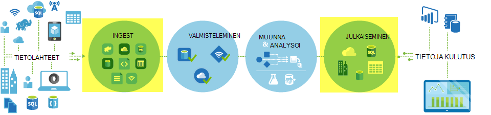
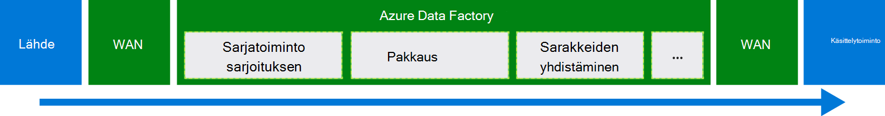
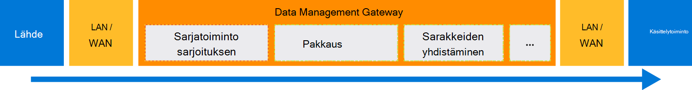

<properties
    pageTitle="Tietojen siirtäminen käyttämällä Kopioi tehtävän | Microsoft Azure"
    description="Lisätietoja tietojen siirto-tietojen Factory putkistot: tietojen siirtäminen cloud stores, sekä paikallisen säilön ja cloud kaupan välillä. Kopioi toimintojen käyttäminen"
    keywords="Kopioi tiedot, tietojen siirto, tietojen siirtäminen, Siirrä tiedot"
    services="data-factory"
    documentationCenter=""
    authors="linda33wj"
    manager="jhubbard"
    editor="monicar"/>

<tags
    ms.service="data-factory"
    ms.workload="data-services"
    ms.tgt_pltfrm="na"
    ms.devlang="na"
    ms.topic="article"
    ms.date="09/22/2016"
    ms.author="jingwang"/>

# Tietojen siirtäminen käyttämällä Kopioi tehtävä

## Yleiskatsaus
Azure Data Factory-voit kopioida tehtävän cloud Azure tietolähteitä ja kopioi erimuotoisia tietoja eri paikallisen. Kun tiedot on kopioitu, se voidaan edelleen muuntaa ja analysoida. Voit myös julkaista muunnos ja analyysitulokset liiketoimintatietojen (BI) ja sovelluksen kulutus kopioi tehtävän.

Kopioi tehtävä on tarjoaa turvallinen, luotettavia, skaalattava, ja [yleisesti saatavilla palvelu](#global). Tässä artikkelissa on tietoja liikkuvuuden Data Factory ja kopioi tehtävän tiedot.

Ensin katsotaan miten tietojen siirto tapahtuu kaksi cloud tietojen stores, sekä paikallisen-tietovarasto ja cloud tietosäilö välillä.

> [AZURE.NOTE] Lisätietoja aktiviteeteista yleensä on artikkelissa [tietoja putkistot ja toiminnot](data-factory-create-pipelines.md).

### Kopioi tiedot kaksi cloud tietojen stores välillä
Kun lähde- ja käsittelytoiminto tietojen säilöt ovat pilveen, kopioi tehtävän käy läpi seuraavat vaiheet, jos haluat kopioida tiedot lähteestä käsittelytoiminto. Palvelun, joka tehostaa kopioi tehtävän:

1. Lukee tietovaraston tietolähteen tiedot.
2. Suorittaa Sarjatoiminto/sarjoituksen, pakkaamisen/purku, sarakkeen yhdistäminen ja kirjoita muuntaminen. Se tekee nämä toiminnot syötteen tietojoukko, tuloste tietojoukko ja kopioi tehtävän perusteella.
3.  Kirjoittaa tietoja kohde tietovaraston.

Palvelun valitsee automaattisesti optimaalisen alue, jos haluat suorittaa tietojen siirto. Tällä alueella on yleensä yksi lähinnä käsittelytoiminto tietovaraston.

### Paikallisen-tietovarasto ja cloud tietosäilö tietojen kopioiminen
Siirrä tiedot suojatusti paikalliseen-tietovarasto ja cloud tietosäilö paikallisen tietokoneen Data Management Gatewayn asentaminen. Data Management Gateway on agentti, joka mahdollistaa hybrid tietojen siirto ja käsittelyä. Voit asentaa sen samaan tietokoneeseen, tiedot tallennetaan itse tai erillisen koneessa, joka on pääsy tietovaraston.

Tässä skenaariossa Data Management Gateway suorittaa Sarjatoiminto/sarjoituksen, pakkaamisen/purku, sarakkeen yhdistäminen ja kirjoita muuntaminen. Tietoja ei rivity Azure Data Factory-palvelun kautta. Sen sijaan Data Management Gateway kirjoittaa suoraan tiedot kohde-kaupasta.

Katso [tietojen siirtäminen paikallisen ja pilvessä Microsoft Data](data-factory-move-data-between-onprem-and-cloud.md) johdanto ja ongelmatilanteita varten. Katso lisätietoja Tämä agentti [Data Management Gateway](data-factory-data-management-gateway.md) .

Voit myös siirtää, joita isännöidään Azure IaaS näennäiskoneiden (VMs) käyttämällä Data Management Gateway-/, tue tietojen stores. Tässä tapauksessa voit asentaminen Data Management Gateway saman AM, tiedot tallennetaan itse, tai valitse erillinen AM, joka on pääsy tietovaraston.

## Tuetut tiedot tallennetaan ja muodot
[AZURE.INCLUDE [data-factory-supported-data-stores](../../includes/data-factory-supported-data-stores.md)]

Jos haluat siirtää ja tietoja Tallenna kopio tehtävän ei tue, käytä **Mukautetut aktiviteetit** Data Factory oman logiikan kanssa, tietojen kopioiminen tai siirtäminen. Lisätietoja luomisesta ja käyttämisestä mukautetut aktiviteetit on artikkelissa [Käytä Azure Data Factory-myyntijakso mukautettuja toimintoja](data-factory-use-custom-activities.md).

### Tuetut tiedostomuodot
Kopioi toimintojen avulla voit kopioida tiedostot muodossa-on kaksi tiedostopohjaisia tietojen stores, kuten Azure-Blob-objektien tai HDFS tiedostojärjestelmän välillä. Tällöin voit ohittaa syöttö- ja tietojoukko-määritykset, [muoto-kohdassa](data-factory-create-datasets.md) . Tiedot on kopioitu tehokkaasti ilman mitään Sarjatoiminto/sarjoituksen.

Kopioi tehtävän myös lukee ja kirjoittaa määritetyn tiedostomuodot: teksti, Avro, ORC, tilat ja JSON. Kopioi seuraavat toiminnot, voit tehdä esimerkiksi:

-   Tietojen kopioiminen Azure-Blob tekstimuodossa (CSV) ja kirjoita Azure SQL-tietokantaan.
-   Kopioi tiedostot (CSV)-muodossa tiedostojärjestelmässä paikallisen ja kirjoittaa Azure-Blob-objektien Avro-muodossa.
-   Tietojen kopioiminen Azure SQL-tietokantaan ja kirjoittaa HDFS paikallisen ORC-muodossa.

## Yleisesti saatavilla tietojen siirto
Azure Data Factory on käytettävissä vain Länsi Yhdysvaltojen Itä US ja Pohjois Europe alueet. Palvelun, joka tehostaa kopioi tehtävän on kuitenkin saatavilla yleisesti seuraavat alueet ja paikkojen. Yleisesti saatavilla topologian varmistaa tehokas tietojen siirto ei yleensä tarvitse rajat-alueen siirräntävälien. Saat tietoja Factory ja tietojen siirto alueen saatavuus [Services alueittain](https://azure.microsoft.com/regions/#services) .

### Kopioi tiedot cloud tietojen stores välillä
Kun lähde- ja käsittelytoiminto tietojen säilöt ovat pilveen, Data Factory käyttää palvelun käyttöönoton alueessa, joka on lähimpänä saman geography Siirrä tiedot käsittelytoiminto. Lisätietoja seuraavassa taulukossa yhdistämistä varten:

Kohde tietovaraston alue | Tietojen siirto käytettäviä alue
:----------------------------------- | :----------------------------
Yhdysvaltojen Itä | Yhdysvaltojen Itä
Yhdysvaltojen Itä 2 | Yhdysvaltojen Itä 2
Länsi USA | Länsi USA
Länsi US 2 | Länsi USA
Keskitetyn USA | Keskitetyn USA
Länsi keskitetyn USA | Keskitetyn USA
Pohjois-keskitetyn USA | Pohjois-keskitetyn USA
Etelä keskitetyn USA | Etelä keskitetyn USA
Pohjois-Eurooppa | Pohjois-Eurooppa
Länsi Europe | Länsi Europe
Kaakkoisaasialaiset Aasian | Kaakkoisaasialaiset Aasian
Itä-Aasian | Kaakkoisaasialaiset Aasian
Japani Itä | Japani Itä
Japani Länsi | Japani Itä
Brasilia Etelä | Brasilia Etelä
Australia Itä | Australia Itä
Australia varaaja | Australia varaaja
Keskitetyn Intia | Keskitetyn Intia
Etelä Intia | Keskitetyn Intia
Länsi Intia | Keskitetyn Intia

> [AZURE.NOTE] Jos kohde tietovaraston alue ei ole edellä olevassa luettelossa, kopioi tehtävän epäonnistuu vaihtoehtoinen alueen kautta, vaan.

### Paikallisen-tietovarasto ja cloud tietosäilö tietojen kopioiminen
Kun tiedot kopioidaan paikallisen (tai Azuren näennäiskoneiden/IaaS) ja cloud stores [Data Management Gateway](data-factory-data-management-gateway.md) suorittaa tietojen siirto paikalliseen tietokoneeseen tai virtuaalikoneen. Tietoja ei rivity pilveen-palvelun kautta, ellet käytä [vaiheistettu kopio](data-factory-copy-activity-performance.md#staged-copy) -ominaisuus. Tässä tapauksessa tietojen menee läpi väliaikaisen Azure-Blob-säiliö ennen kuin se on kirjoitettu käsittelytoiminto tietovaraston.

## Luo putkijohto kopioi aktiviteettiin
Voit luoda putkijohto ja kopioi toimintaa usealla tavalla:

### Kopioi ohjatun toiminnon avulla
Ohjattu Factory kopiointi avulla voit luoda kopion aktiviteettiin putkijohto. Voit kopioida tietoja tuettujen tietolähteiden kohteisiin *kirjoittamatta JSON* määritelmät linkitetyn services, tietojoukkoja ja putkistot tämän myyntijakso. Saat lisätietoja ohjatun toiminnon [Factory kopioi ohjattu tietojen](data-factory-copy-wizard.md) .  

### JSON-komentosarjojen avulla
Azure portal, Visual Studio tai PowerShellin Azure tietojen Factory-editori avulla voit luoda putkijohto JSON määritelmä (käyttämällä Kopioi tehtävän). Tämän jälkeen voit ottaa Luo putkijohto Data Factory. Katso [Opetusohjelma: Käytä Kopioi toimintaa Azure Data Factory-myyntijakso](data-factory-copy-data-from-azure-blob-storage-to-sql-database.md) opetusohjelmaan on vaiheittaiset ohjeet.    

JSON-ominaisuuksia (kuten nimi, kuvaus sekä syöttö- ja taulukoita ja käytännöt) ovat käytettävissä kaikki tehtävälajit. Käytettävissä olevat ominaisuudet `typeProperties` tehtävän osan vaihtele kunkin tehtävätyyppi.

Kopioi tehtävälle `typeProperties` osan vaihtelee sen mukaan, eri lähteiden ja täyttyvät. Valitse tietolähteen/käsittelytoiminto ominaisuudet, kopioi tehtävän tukee kyseistä tietovaraston lisätietoja [Tuetut tietolähteet ja poistumia](#supported-data-stores) -osassa.   

Tässä on esimerkki JSON määritys:

    {
      "name": "ADFTutorialPipeline",
      "properties": {
        "description": "Copy data from Azure blob to Azure SQL table",
        "activities": [
          {
            "name": "CopyFromBlobToSQL",
            "type": "Copy",
            "inputs": [
              {
                "name": "InputBlobTable"
              }
            ],
            "outputs": [
              {
                "name": "OutputSQLTable"
              }
            ],
            "typeProperties": {
              "source": {
                "type": "BlobSource"
              },
              "sink": {
                "type": "SqlSink",
                "writeBatchSize": 10000,
                "writeBatchTimeout": "60:00:00"
              }
            },
            "Policy": {
              "concurrency": 1,
              "executionPriorityOrder": "NewestFirst",
              "retry": 0,
              "timeout": "01:00:00"
            }
          }
        ],
        "start": "2016-07-12T00:00:00Z",
        "end": "2016-07-13T00:00:00Z"
      }
    }

Aikataulun, joka on määritetty tulostus-tietojoukko määrittää, milloin tehtävä suoritetaan (esimerkiksi: **Päivittäin**, korkojakso **päivänä**ja aikavälin, **1**). Tehtävän kopioi syötteen tietojoukko (**lähde**) tietojen tulostus-tietojoukko (**käsittelytoiminto**).

Voit määrittää useamman kuin yhden syötteen tietojoukko kopioi toimintoon. Niitä käytetään vahvistamiseksi riippuvuudet, ennen kuin tehtävä on suoritettu. Kuitenkin vain ensimmäisen tietojoukko tiedot kopioidaan kohde-tietojoukko. Lisätietoja on artikkeleissa [ajoitus ja suorittamisen](data-factory-scheduling-and-execution.md).  

## Suorituskyky ja säätäminen
On [kopio tehtävän suorituskyky ja säätäminen oppaan](data-factory-copy-activity-performance.md), jossa kuvataan avaimen tietojen siirto (kopioi tehtävä) Azure Data Factory-suorituskykyyn vaikuttavia tekijöitä. Se myös sisäinen testauksen aikana havaittujen suorituskyvyn luetellaan ja käsitellään erilaisia tapoja kopioida tehtävän suorituskyvyn.

## Ajoittamisen sekä peräkkäisiä kopio
Katso lisätietoja Data Factory ajoittaminen ja suorittamisen toiminta [ajoitus ja suorittamisen](data-factory-scheduling-and-execution.md) . On mahdollista suorittaa useita kopiointi peräkkäin peräkkäisiä/vyöhykkeen tavalla. On [Tilattu kopio](data-factory-scheduling-and-execution.md#ordered-copy) -osassa.

## Kirjoita muunnokset
Eri tietojen stores on alkuperäisen erilaisella systems. Kopioi tehtävän suorittaa Automaattinen tyypin muunnoksia lähteen tyyppiä vastaamaan allas tyypit seuraavista kaksivaiheinen lähestymistapa kanssa:

1. Muuntaa alkuperäisen tietolähteen tyypit .NET-tyyppi.
2. Muuntaa .NET-tyypin alkuperäisen käsittelytoiminto tyyppi.

Tietosäilö .NET tyypin alkuperäinen tyyppi-järjestelmästä määritys on vastaaviin tietojen store-artikkelissa. (Valitse tietyn linkin [tuettu tietojen stores](#supported-data-stores) -taulukon). Voit määrittää soveltuvia luotaessa taulukoiden niin, että kopioi tehtävän suorittaa oikean muunnokset yhdistämismääritykset.

## Seuraavat vaiheet
- Lisätietoja useamman kopion tehtävästä on artikkelissa [Azure-Blob-säiliö Azure SQL-tietokantaan tietojen kopioiminen](data-factory-copy-data-from-azure-blob-storage-to-sql-database.md).
- Lisätietoja tietojen siirtäminen cloud tietosäilö paikallisen-tietovarasto on artikkelissa [tietojen siirtäminen paikalliseen cloud tiedot tallennetaan](data-factory-move-data-between-onprem-and-cloud.md).
