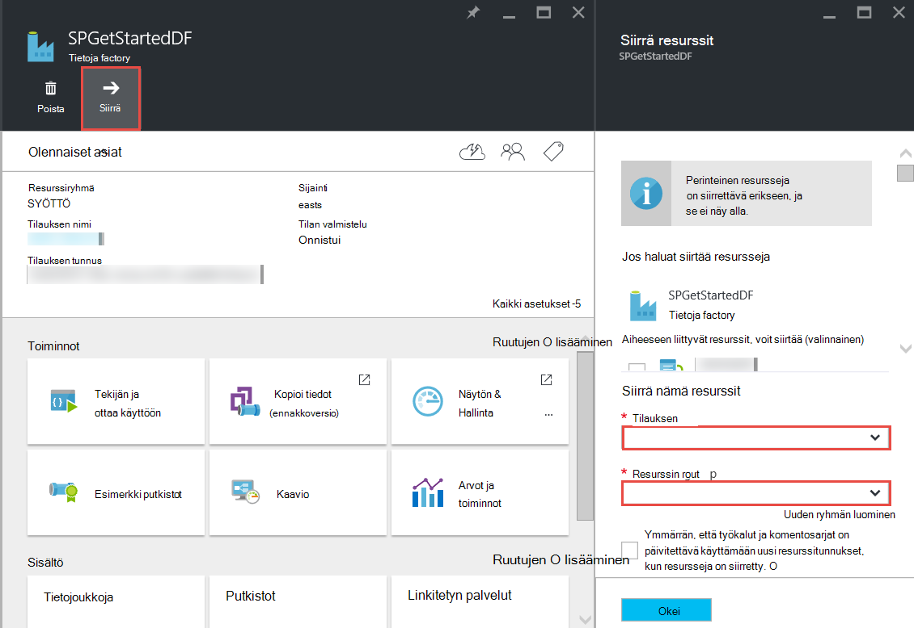

<properties 
    pageTitle="Azure tietojen Factory - usein kysytyt kysymykset" 
    description="Usein kysyttyjä kysymyksiä Azure Data Factory." 
    services="data-factory" 
    documentationCenter="" 
    authors="sharonlo101" 
    manager="jhubbard" 
    editor="monicar"/>

<tags 
    ms.service="data-factory" 
    ms.workload="data-services" 
    ms.tgt_pltfrm="na" 
    ms.devlang="na" 
    ms.topic="article" 
    ms.date="09/12/2016" 
    ms.author="shlo"/>

# Azure tietojen Factory - usein kysytyt kysymykset

## Yleisiä kysymyksiä

### Mikä on Azure Data Factory?

Tietoja Factory on pilvipohjainen tietojen integrointi palvelun kyseisen **automatisoi siirto ja tietojen muunnos**. Factory, joka suoritetaan kestää raaka ja muuntaa ne valmiiden tuotteiden laitteita, kuten Data Factory orchestrates aiemmin palvelut, joita raaka tietojen kerääminen ja muuntaa sen avulla valmis tiedot. 
 
Tietoja Factory avulla voit luoda tietojen siirtäminen sekä paikallisen ja cloud tietojen stores sekä prosessin/muunnon tiedot käyttämällä Laske-palvelut, kuten Azure Hdinsightiin ja Azure tietojen järvi Analytics tietoihin perustuvien työnkulkuja. Luotuasi putkijohto, joka suorittaa toiminnon, jotka on voit ajoittaa suorittaa säännöllisesti (hourly, päivittäin, viikoittain jne.).   

Saat lisätietoja [Yleiskatsaus ja avain käsitteitä](data-factory-introduction.md) . 

### Mistä löydän hinnoittelu Azure Data Factory tiedot?

Katso [tietoja Factory hinnat tiedot-sivulla] [ adf-pricing-details] varten Azure Data Factory hinnoittelutiedot varten.  

### Miten aloitetaan Azure Data Factory kanssa?

- Yleiskuvaus Azure Data Factory on artikkelissa [Azure Data Factory esittely](data-factory-introduction.md).
- Katso opetusohjelma siitä, miten voit **kopioida tai siirtää tiedot** käyttämällä Kopioi tehtävän, [Kopioi tiedot Azure-Blob-säiliö Azure SQL-tietokantaan](data-factory-copy-data-from-azure-blob-storage-to-sql-database.md).
- Ohjeet **tietojen** muuntamiseen opetusohjelmaan HDInsight rakenne tehtävää käytettäessä. [Prosessin](data-factory-build-your-first-pipeline.md) tiedot suorittamalla rakenteen komentosarja Hadoop-klusterissa 
  
### Mikä on Data Factory alueen käytettävyys?
Tietoja Factory on käytettävissä **Yhdysvalloissa Länsi** ja **Pohjois Europe**. Tietoja tehtaan käyttämien suorittaminen ja tallennustilaa palvelujen voi olla muilla alueilla. Katso [Tuetut alueet](data-factory-introduction.md#supported-regions). 
 
### Mitä tietoja tehtaan/putkistot/toiminnot/tietojoukkoja määrän rajoitukset?
 
Katso **Azure tietojen Factory rajoitukset** osa on artikkelissa [Azure tilaus ja palvelun rajoitukset, kiintiöiden ja rajoitukset](../azure-subscription-service-limits.md#data-factory-limits) .

### Mikä on yhtä aikaa muiden kanssa tai developer kokemus Azure Data Factory-palvelun kanssa?

Tekijä/luomista tietojen tehtaan jollakin seuraavista tavoista:

- **Azure portal**  
   Data Factory lavat Azure-portaalissa antaa, voit luoda tehtaan ad linkitetty tietopalvelujen monipuolisia käyttöliittymän. **Tietoja Factory-editori**, jossa on myös osa portaalin, avulla voit luoda helposti määrittämällä JSON määritykset seuraavia palvelutiedot linkitetyn services, taulukoita tai arvojoukon putkistot. Saat Esimerkki portal/editorin avulla voit luoda ja ottaa käyttöön tietojen factory [luominen ensimmäisen myyntijakso tietojen Azure-portaalissa](data-factory-build-your-first-pipeline-using-editor.md) .

- **Visual Studio**  
   Visual Studio avulla voit luoda Azure tietojen factory. Katso lisätietoja [luominen ensimmäisen myyntijakso tietojen Visual Studiossa](data-factory-build-your-first-pipeline-using-vs.md) . 

- **Azure PowerShell**  
   [luominen ja näytön Azure Data Factory Azure PowerShellin avulla](data-factory-build-your-first-pipeline-using-powershell.md) saat opetusohjelma/ongelmatilanteita luomisen tiedot-factory PowerShellin avulla. Katso [Factory-Cmdlet-viittaus] [ adf-powershell-reference] sisällön MSDN-kirjastossa täydellinen dokumentaation ja Data Factory cmdlet-komennot.
   
- **.NET luokkakirjasto**  
   voit luoda tietojen tehtaan ohjelmallisesti käyttämällä tietojen Factory .NET SDK. Saat [luominen, seurata, ja hallinta tietojen tehtaan käyttämällä .NET SDK](data-factory-create-data-factories-programmatically.md) luominen käyttämällä .NET SDK tiedot-factory vaiheista. Katso [Tietoja Factory luokan kirjaston ohje] [ msdn-class-library-reference] tietojen Factory .NET SDK: n täydellinen ohjeita.

- **REST API**  
   voit käyttää myös Azure Data Factory-palvelun tarjoamista REST-Ohjelmointirajapinnalla luominen ja tietojen tehtaan otetaan käyttöön. Katso [Tietoja Factory REST API-viittaus] [ msdn-rest-api-reference] täydellinen dokumentaation tietojen Factory REST API.
 
- **Azuren Resurssienhallinta mallin** 
   kohdassa [Opetusohjelma: Luo ensimmäinen factory Azure tietojen Azure Resurssienhallinta-mallin avulla](data-factory-build-your-first-pipeline-using-arm.md) fontin tiedot. 

### Tietoja factory nimeä
Ei. Muut Azure resurssit, kuten Azure tietojen factory nimeä ei voi muuttaa. 

### Voit siirtää tietoja factory Azure tilauksesta toiseen? 
Kyllä. **Siirrä** käyttäminen tietojen factory-sivu, kuten seuraavassa kaaviossa on esitetty. 

### Mitä tietojen Factory tukemat Laske-ympäristössä?
Seuraavassa taulukossa on luettelo Laske ympäristöissä Data Factory ja toiminnot, jotka voidaan suorittaa ne tue. 

| Laske ympäristössä | Toiminnot |
| ------------------- | -------- | 
| [Tarvittaessa HDInsight-klusterin](data-factory-compute-linked-services.md#azure-hdinsight-on-demand-linked-service) tai [oman HDInsight-klusterin](data-factory-compute-linked-services.md#azure-hdinsight-linked-service) | [DotNet](data-factory-use-custom-activities.md), [rakenne](data-factory-hive-activity.md), [Possu](data-factory-pig-activity.md), [MapReduce](data-factory-map-reduce.md), [Hadoop-tietovirta](data-factory-hadoop-streaming-activity.md) | 
| [Azure erä](data-factory-compute-linked-services.md#azure-batch-linked-service) | [DotNet](data-factory-use-custom-activities.md) |  
| [Azure koneen oppiminen](data-factory-compute-linked-services.md#azure-machine-learning-linked-service) | [Kuormitusryhmälle liittyviä toimintoja: eräkäsittely ja Päivitä resurssi](data-factory-azure-ml-batch-execution-activity.md) |
| [Azure tietojen järvi Analytics](data-factory-compute-linked-services.md#azure-data-lake-analytics-linked-service) | [Tietoja järvi Analytics U-SQL](data-factory-usql-activity.md)
| [Azure SQL](data-factory-compute-linked-services.md#azure-sql-linked-service)- [Azure SQL-tietovarasto](data-factory-compute-linked-services.md#azure-sql-data-warehouse-linked-service), [SQL Server](data-factory-compute-linked-services.md#sql-server-linked-service) | [Tallennettu toimintosarja](data-factory-stored-proc-activity.md)

## Tehtävät - usein kysytyt kysymykset
### Mitkä ovat erilaisia toimintoja, voit käyttää tietojen Factory putkijohto? 

- [Tietojen siirtämistä aktiviteetteja](data-factory-data-movement-activities.md) tietoja siirretään.
- [Tietojen muunnos toimintoja](data-factory-data-transformation-activities.md) prosessin/muunnon tiedot. 

### Kun tehtävän suorittaminen?
Tulosteen tiedot-taulukossa **käytettävyys** kokoonpano-asetus määrittää, kun tehtävä on suoritettu. Jos syötteen tietojoukkoja on määritetty, tehtävän tarkistaa syöttötiedot riippuvuudet täyttyvät (eli **Valmis** tila) ennen kuin se käynnistyy. 

## Kopioi toiminto – usein kysytyt kysymykset
### On paremmin myyntijakso, jossa on useita toimenpiteitä tai erillisen myyntijakso jokaiselle tehtävälle? 
Putkistot katsomaan Yhdistä Aiheeseen liittyviä toimintoja. Jos ulkopuolella putkijohto lahjoitukseen sitä, miten tietojoukkoja, joka yhdistää ne ole, voit halutessasi säilyttää toimintojen yksi putkijohto. Tällä tavalla voit ei tarvitse ketju myyntijakso aktiivinen kausien niin, että ne vastaavat toisiaan. Tietojen eheyden säilyttäminen sisäinen putkijohto taulukoiden paremmin myös säily, kun päivitetään putkijohto. Myyntijakso päivityksen olennaisesti lopettaa kaikki putkijohto aktiviteetit, poistaa ne ja luo ne uudelleen. -Levyjen perspektiivin, myös ehkä helpompi tarkastella yhdessä JSON-tiedostossa putkijohto aktiviteetit tietojen kulun.

### Mitkä ovat tuettuja stores?
[AZURE.INCLUDE [data-factory-supported-data-stores](../../includes/data-factory-supported-data-stores.md)]

### Mitkä ovat tuetut tiedostomuodot? 
[AZURE.INCLUDE [data-factory-file-format](../../includes/data-factory-file-format.md)]

### Jossa kopiointi suoritetaan? 
Lisätietoja on [yleisesti saatavilla tietojen siirto](data-factory-data-movement-activities.md#global) -osassa tiedot. Lyhyesti sanottuna kun paikallisen-tietovarasto liittyy, kopiointi suoritetaan Data Management Gateway paikallisen ympäristön. Ja, kun tietojen siirto on kaksi cloud stores välillä, kopiointi suoritetaan lähimpänä olevan samassa geography käsittelytoiminto haluamaasi kohtaan. 

## HDInsight aktiviteetti – usein kysytyt kysymykset

### Mitä alueita tukemat HDInsight?

Maantieteelliset käytettävyys-osassa seuraavassa artikkelissa: tai [HDInsight hinnat tiedot][hdinsight-supported-regions].

### Mitä alueen käytetään tarvittaessa-HDInsight-klusterin?

Tarvittaessa HDInsight-klusterin luodaan samaan alue, jossa klusterin kanssa voidaan käyttää määritit tallennustila on.    

### Voit liittää lisätallennustilaa sähköpostitilejä HDInsight-klusterin?

Jos käytössäsi on oma HDInsight-klusterin (BYOC - tuo Your oman klusterin), on seuraavissa ohjeaiheissa: 

- [Vaihtoehtoinen tallennustilan asiakkaat ja Metastores HDInsight-klusterin käyttäminen][hdinsight-alternate-storage]
- [Lisää tallennustilaa tilien käyttäminen HDInsight-rakenne][hdinsight-alternate-storage-2]

Jos käytössäsi on tarvittaessa-klusteriin, joka on luotu Data Factory-palvelu, Määritä lisätallennustilaa tilit HDInsight linkitetty palvelun siten, että Data Factory-palvelua voi rekisteröidä niitä puolestasi. Tarvittaessa linkitetyn palvelun JSON-määrityksessä **additionalLinkedServiceNames** -ominaisuuden avulla voit määrittää vaihtoehtoinen tallennustilan tilejä seuraavista JSON koodikatkelman esitetyllä tavalla:
 
    {
        "name": "MyHDInsightOnDemandLinkedService",
        "properties":
        {
            "type": "HDInsightOnDemandLinkedService",
            "typeProperties": {
                "clusterSize": 1,
                "timeToLive": "00:01:00",
                "linkedServiceName": "LinkedService-SampleData",
                "additionalLinkedServiceNames": [ "otherLinkedServiceName1", "otherLinkedServiceName2" ] 
            }
        }
    } 

Yllä olevassa esimerkissä otherLinkedServiceName1 ja otherLinkedServiceName2 edustavat linkitetyn palvelut, joiden määritykset sisältävät tunnistetiedot, jotka HDInsight-klusterin pystyttävä käyttämään vaihtoehtoinen tallennustilan tilit.

## Sektoreiden – usein kysytyt kysymykset

### Miksi ovat oman syötteen sektoreiden ei ole valmiina?  
Yleinen virhe ei ole asetusta **ulkoisen** -ominaisuuden arvoksi **true** syötteen dataset-, kun kenttään annettavat tiedot eivät ulkoiset tiedot-factory (ei tuottamat tiedot factory). 

Seuraavassa esimerkissä voit vain on määritettävä **ulkoinen** tosi- **dataset1**.  

**DataFactory1** Myyntijakso 1: dataset1 -> activity1 -> dataset2 -> activity2 -> dataset3 myyntijakso 2: dataset3 -> activity3 -> dataset4

Jos sinulla on toinen tietojen factory putkijohto, joka vie dataset4 (tuottamat myyntijakso tietojen factory 1-2) kanssa, merkitse dataset4 ulkoisen tietojoukko koska dataset tuottaa erilaisia tietoja factory (DataFactory1, ei DataFactory2).  

**DataFactory2**    
Myyntijakso 1: dataset4 -> activity4 -> dataset5

Jos ulkoiset-ominaisuudeksi on määritetty oikein, tarkistaa, onko syöttötiedot syötteen tietojoukko määrityksessä määritettyyn sijaintiin. 

### Voit suorittaa sektoria kuin keskiyöhön, kun se on yhdistämällä päivittäin myöhemmin?
**Siirtymä** -ominaisuuden avulla voit määrittää, josta haluat sektorin esitettävä aika. Katso [tietojoukko käytettävyys](data-factory-create-datasets.md#Availability) -osassa lisätietoja tätä ominaisuutta. Seuraavassa on lyhyt Esimerkki:

    "availability":
    {
        "frequency": "Day",
        "interval": 1,
        "offset": "06:00:00"
    }

Päivittäinen sektoreiden Aloittava nro **6 AM** oletusarvon keskiyön sijaan.     

### Miten sektoria uudelleen?
Voit suorittaa sektoria jollakin seuraavista tavoista: 

- Suorita tehtävä-ikkunassa tai sektoria näyttö ja hallinta-sovelluksen avulla. Saat ohjeet [Suorita valittu tehtävä windows](data-factory-monitor-manage-app.md#re-run-selected-activity-windows) .   
- Valitse **Suorita** sektoria Azure-portaalissa, **Tietojen MUOTOILU** -sivu-painikkeita.
- Suorita **Määrittäminen AzureRmDataFactorySliceStatus** cmdlet-komento määrittäminen sektoria **odottaa** -tilassa.   
    
        Set-AzureRmDataFactorySliceStatus -Status Waiting -ResourceGroupName $ResourceGroup -DataFactoryName $df -TableName $table -StartDateTime "02/26/2015 19:00:00" -EndDateTime "02/26/2015 20:00:00" 

Katso [Määrittäminen AzureRmDataFactorySliceStatus] [ set-azure-datafactory-slice-status] lisätietoja-cmdlet-komennolla. 

### Kuinka kauan kestää käsittelemään sektoria?
Tehtävän ikkunan Explorer-näyttö ja hallita sovelluksen avulla voit tietää, kuinka kauan käsittelyn tietojen sektoria kesto. [Tehtävän ikkunan Explorer](data-factory-monitor-manage-app.md#activity-window-explorer) lisätietoja. 

Voit myös tehdä Azure-portaalissa seuraavasti:  

1. Napsauta **tietojoukkoja** -ruutua, tietojen factory **DATA FACTORY** -sivu.
2. Valitse tietyn tietojoukko- **tietojoukkoja** -sivu.
3. Valitse sektori, jotka ovat kiinnostuneita **Viimeisimmät sektorit** -luettelosta **taulukko** -sivu.
4. Valitse tehtävän suorittaa **Tehtävän suoritetaan** luettelosta **Tietojen MUOTOILU** -sivu. 
5. Valitse **Ominaisuudet** -ruutu, **Tehtävän suorittaminen tiedot** -sivu. 
6. Raportissa pitäisi näkyä **kesto** -kenttä, jonka arvo. Tämä arvo on käyttänyt sektoria aika.   

### Voit pysäyttää käynnissä sektoria?
Jos haluat lopettaa putkijohto suorittaminen, voit käyttää [Keskeytys AzureRmDataFactoryPipeline](https://msdn.microsoft.com/library/mt603721.aspx) cmdlet-komento. Tällä hetkellä keskeyttämisestä putkijohto Lopeta käynnissä olevat sektoria suorituskerran. Kun käynnissä suorituskerran on valmis, ei ole ylimääräisiä sektori on noudettu.

Jos todella haluat lopettaa kaikki suorituskerran heti on ainoa tapa olisi putkijohto ja luo uudelleen. Jos haluat poistaa putkijohto, sinun ei tarvitse poistaa taulukoita ja linkitetyt palveluiden käyttämän putkijohto. 

[create-factory-using-dotnet-sdk]: data-factory-create-data-factories-programmatically.md
[msdn-class-library-reference]: https://msdn.microsoft.com/library/dn883654.aspx
[msdn-rest-api-reference]: https://msdn.microsoft.com/library/dn906738.aspx

[adf-powershell-reference]: https://msdn.microsoft.com/library/dn820234.aspx 
[azure-portal]: http://portal.azure.com
[set-azure-datafactory-slice-status]: https://msdn.microsoft.com/library/mt603522.aspx

[adf-pricing-details]: http://go.microsoft.com/fwlink/?LinkId=517777
[hdinsight-supported-regions]: http://azure.microsoft.com/pricing/details/hdinsight/
[hdinsight-alternate-storage]: http://social.technet.microsoft.com/wiki/contents/articles/23256.using-an-hdinsight-cluster-with-alternate-storage-accounts-and-metastores.aspx
[hdinsight-alternate-storage-2]: http://blogs.msdn.com/b/cindygross/archive/2014/05/05/use-additional-storage-accounts-with-hdinsight-hive.aspx
 
