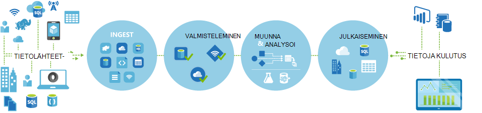
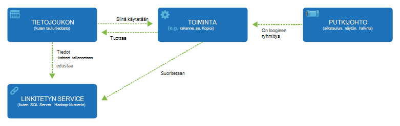

<properties 
    pageTitle="Johdatus Data Factory-integroinnin tietopalvelu | Microsoft Azure" 
    description="Lisätietoja Azure Data Factory ominaisuudet: tietojen integrointi pilvipalveluun, orchestrates ja automatisoi siirto ja tietojen muunnos." 
    keywords="tietojen integrointi, cloud tietojen integrointi azure tietojen factory ominaisuudet"
    services="data-factory" 
    documentationCenter="" 
    authors="sharonlo101" 
    manager="jhubbard" 
    editor="monicar"/>

<tags 
    ms.service="data-factory" 
    ms.workload="data-services" 
    ms.tgt_pltfrm="na" 
    ms.devlang="na" 
    ms.topic="get-started-article" 
    ms.date="09/22/2016" 
    ms.author="shlo"/>

# Johdanto Azure tietojen Factory-palveluun, tietojen integrointi palvelu pilveen

## Mikä on Azure Data Factory? 
Tietoja Factory on pilvipohjainen tietojen integrointi-palvelu, orchestrates ja automatisoi **siirto** ja **muunnos** -tiedot. Voit luoda tietojen integrointi Solutions-sivustossa Data Factory-palvelun avulla voit ingest eri tietoja tallennetuista tiedoista, muunna/prosessin tiedot ja tiedot julkaiseminen tietoja tallennetuista tiedoista. 

Tietoja Factory-palvelun avulla voit luoda, siirtää ja muuntaminen Tietoja tietojen putkistot ja suorita putkistot määritetyn aikataulun mukaisesti (hourly päivittäin, viikoittain, jne.). Se sisältää myös monipuolisia visualisointeja ja tuo näkyviin hierarkiatasolla ja tietojen putkistot väliset riippuvuudet ja seurata kaikkien oman tietojen putkistot yksittäinen yhdistetty näkymästä avulla voit paikantaa helposti ongelmista ja valvominen ilmoitusten asetukset.

**Figure1.** Ingest tietoja eri tietolähteistä, valmisteleminen, muunna- ja analysoida tietoja ja julkaista kulutus tiedot valmiina avulla.

## Putkistot ja toiminnot
Data Factory-ratkaisussa voit luoda yhden tai useamman tietojen **putkistot**. Putkijohto on looginen ryhmittely toiminnan. Niitä käytetään Ryhmätehtävät yhdeksi kokonaisuudeksi, jotka suorittavat yhdessä tehtävän. 

**Toimintojen** Määritä suoritettavat tietoihisi toiminnot. Kopioi tehtävän avulla voi esimerkiksi tietojen kopioiminen toiseen tietovaraston yhden tietosäilö. Asiakas voi käyttää rakenteen tehtävän, joissa on käytössä Azure HDInsight-klusterin transform tai tietojen analysointi kyselyn rakenne. Tietoja Factory tukee kahdentyyppisiä toiminnot: tietojen siirtämistä toimintojen ja tietojen muunnos. 
  
## Tietojen siirtämistä toiminnot 
[AZURE.INCLUDE [data-factory-supported-data-stores](../../includes/data-factory-supported-data-stores.md)]

Katso [Tietojen siirtämistä toimintoja](data-factory-data-movement-activities.md) artikkelissa lisätietoja. 

## Tietojen muunnos toiminnot
[AZURE.INCLUDE [data-factory-transformation-activities](../../includes/data-factory-transformation-activities.md)]

Katso [Tietoja muunnos toimintoja](data-factory-data-transformation-activities.md) artikkelissa lisätietoja.

Jos haluat siirtää ja tietoja tallentaa että kopioi tehtävän ei tue, tai Muunna tietoja käyttämällä omaa logiikan, **.NET mukautetut aktiviteetit**. Lisätietoja luomisesta ja käyttämisestä mukautetut aktiviteetit on artikkelissa [Käytä Azure Data Factory-myyntijakso mukautettuja toimintoja](data-factory-use-custom-activities.md).

## Linkitetyn palvelut
Linkitetyn palvelujen määrittäminen Data Factory muodostaa Ulkoiset resurssit tarvittavat tiedot (esimerkkejä: Azuren tallennustilaan paikallisen SQL Server Azure Hdinsightiin). Linkitetyn services voi käyttää tietoja Factory kaksi tarkoituksiin:

- Edustavan **tietovaraston** mukaan lukien paikallisen SQL Serveriä, Oracle-tietokantaan, muun muassa, tiedoston Jaa tai Azure-Blob-säiliö tiliä. On tuettu Microsoft Data luettelon [tietojen siirtämistä toiminnot](data-factory-data-movement-activities.md) -osassa. 
- Edustamaan **resurssin laskemiseen** , voit isännöidä tehtävän suorittaminen. Esimerkiksi HDInsightHive tehtävän suoritetaan HDInsight Hadoop-klusterin. Katso [tietoja muunnos toimintoja](data-factory-data-transformation-activities.md) osassa on luettelo tuetuista Laske ympäristöjen. 

## Tietojoukkoja 
Linkitetyn services linkki Microsoft Data Azure tietojen factory. Tietojoukkoja vastaavat tiedot rakenteiden kanssa tietoja tallennetuista tiedoista. Esimerkiksi Azuren tallennustilaan linkitetty-palvelu tarjoaa Data Factory muodostaa Azure-tallennustilan tilin yhteystiedot. Azure-Blob-objektien tietojoukkoa määrittää Azure-Blob-säiliö, josta putkijohto Lue tietoja blob-säilö ja kansio. Vastaavasti linkitetty Azure SQL-palvelu sisältää Azure SQL-tietokannan yhteystiedot ja Azure SQL-tietojoukko määrittää tiedot sisältävä taulukko.   

## Data Factory välinen suhde
Tietoja Factory on muutama avaimen kohteet, jotka toimivat yhdessä määrittäminen syötteen ja tulostaa tiedot, käsittelyn tapahtumia sekä aikataulun ja haluamasi tiedonkulun suorittamiseen tarvittavat resurssit.

**Kuva 2.** Tietojoukon, tehtävä, putkijohto ja linkitetyt palvelun väliset yhteydet

Neljä yksinkertainen käsitteitä linkitetyn services, tietojoukkoja, tehtävät ja putkistot olet valmis aloittamaan! Voit [luoda ensimmäisen myyntijakso](data-factory-build-your-first-pipeline.md). 

## Tuettujen alueiden
Tällä hetkellä voit luoda tietojen tehtaan **Länsi Yhdysvaltojen** **Itä US**ja **Pohjois Europe** alueilla. Kuitenkin tietojen factory voit käyttää Microsoft Data ja Laske palveluiden tietojen siirtyä Microsoft Data Azure muilla alueilla tai prosessin tietoja käyttämällä Laske palvelut. 

Azure Data Factory itse ei tallenna mitään tietoja. Sen avulla voit luoda tietoihin perustuvien työnkulut, orchestrate [tuettu Microsoft Data](data-factory-data-movement-activities.md#supported-data-stores) - ja [Laske palveluiden](data-factory-compute-linked-services.md) käyttäminen muilla alueilla tai paikallisen ympäristön tietojen käsittely tietojen siirto. Myös avulla voit [seurata ja hallita työnkulkujen](data-factory-monitor-manage-pipelines.md) käyttämisestä sekä ohjelmallisesti ja Käyttöliittymän menetelmät. 

Vaikka Azure Data Factory on käytettävissä vain **Länsi US**, **Itä US**ja **Pohjois Europe** alueet, ajan tietojen siirto Data Factory-palvelu on käytettävissä [yleisesti](data-factory-data-movement-activities.md#global) eri alueilla. Siltä varalta, että tietosäilö takana palomuuri sitten asennettu [Data Management Gateway](data-factory-move-data-between-onprem-and-cloud.md) on paikallisen ympäristön siirtää tiedot. 

Esimerkki oletetaan uutiskirjeistä Laske-ympäristöissä kuten Azure HDInsight-klusterin ja Azure koneen Learning loppumassa Länsi Europe alue. Voit luoda ja käyttää Azure Data Factory-esiintymää Pohjois Euroopan ja järjestää Laske-ympäristöissä Länsi Euroopan työt sen avulla. Kestää muutaman millisekuntia Data Factory käynnistettävän työn Laske-ympäristössä, mutta ajan työn tietojenkäsittely-ympäristöön eivät muutu.

On tarkoitus olla Azure Data Factory jokaisen geography tukemat Azure tulevaisuudessa.
  
## Seuraavat vaiheet
Lisätietoja luominen tietojen tehtaan tietojen putkistot kanssa, noudata vaiheittaisia ohjeita opetusohjelmassa. 

Opetusohjelma | Kuvaus
-------- | -----------
[Tietoja putkijohto, joka käsittelee tietoja käyttämällä Hadoop-klusterin luominen](data-factory-build-your-first-pipeline.md) | Tässä opetusohjelmassa voit luoda oman ensimmäisen Azure tietojen factory tietojen putkijohto ja **prosessien tietojen** suorittamalla rakenteen komentosarja Azure Hdinsightiin (Hadoop)-klusterissa. |
[Tietoja tietojen siirtyä kaksi cloud tietojen stores putkijohto luominen](data-factory-copy-data-from-azure-blob-storage-to-sql-database.md) | Tässä opetusohjelmassa luodaan tietojen factory putkijohto kanssa, **siirtää tietoja** Blob-objektien tallennustilaan SQL-tietokantaan.
[Tietoja putkijohto tietojen siirtymään paikallisen-tietovarasto ja cloud tietosäilö käyttämällä Data Management Gatewayn luominen](data-factory-move-data-between-onprem-and-cloud.md) | Tässä opetusohjelmassa luot kyseisen **siirtää tietoja** **paikallisen** SQL Server-tietokantaan Azure-blob tiedot-factory putkijohto kanssa. Osana ongelmatilanteita Asenna ja määritä Data Management Gateway käyttämääsi laitteeseen. 
