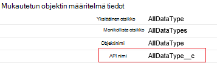
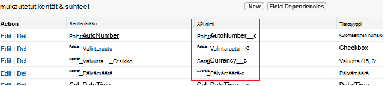

<properties
    pageTitle="Siirrä tiedot Salesforce käyttämällä Data Factory | Microsoft Azure"
    description="Voit siirtää tietoja Salesforce käyttämällä Azure Data Factory tietoja."
    services="data-factory"
    documentationCenter=""
    authors="linda33wj"
    manager="jhubbard"
    editor="monicar"/>

<tags
    ms.service="data-factory"
    ms.workload="data-services"
    ms.tgt_pltfrm="na"
    ms.devlang="na"
    ms.topic="article"
    ms.date="10/25/2016"
    ms.author="jingwang"/>

# Siirrä tiedot Salesforce Azure Data Factory avulla
Tässä artikkelissa käsitellään käyttämisestä kopioi tehtävän Azure tietojen factory-tietojen kopioiminen Salesforce minkä tahansa tietovaraston, joka näkyy kohdassa käsittelytoiminto sarake [Tuetut tietolähteet ja poistumia](data-factory-data-movement-activities.md#supported-data-stores) -taulukosta. Tässä artikkelissa perustuu [tietojen siirtämistä tehtävät](data-factory-data-movement-activities.md) -artikkelista, jossa näkyy yleiskatsaus tietojen siirto kopioi tehtävän ja tuettuja kaupan yhdistelmät.

Azure Data Factory tukee tällä hetkellä vain Salesforce siirtäminen tiedot, [tuetut käsittelytoiminto tietojen stores]((data-factory-data-movement-activities.md#supported-data-stores), mutta ei tue tietojen siirtämistä muista tallentaa Salesforce avulla.

## Edellytykset
- Sinun on käytettävä jompikumpi seuraavista Salesforce-versioissa: Developer Edition, Professional Edition, Enterprise Edition tai rajoittamaton Edition.
- API käyttöoikeus on otettava käyttöön. Katso [Miten voin antaa API access Salesforce-käyttöoikeudet määrittää?](https://www.data2crm.com/migration/faqs/enable-api-access-salesforce-permission-set/)
- Kopioi tiedot Salesforce paikallisen tietojen stores sinulla on oltava vähintään Data Management yhdyskäytävän 2.0 asennettu paikallisen ympäristön.

## Salesforce-pyynnön rajoitukset
Salesforce on API-pyyntöjen kokonaismäärä ja API samanaikaiset pyynnöt rajoitukset. Lisätietoja [Salesforce Developer rajat](http://resources.docs.salesforce.com/200/20/en-us/sfdc/pdf/salesforce_app_limits_cheatsheet.pdf) -artikkelin kohdassa "API pyytää rajoitukset". Huomautus Jos samanaikaiset pyynnöt määrä ylittää raja-rajoittimen ilmenee, ja näet satunnaisia virheet; Jos pyyntöjen kokonaismäärä sallitut, 24 tuntia, estetään Salesforce-tili näyttöön voi tulla "REQUEST_LIMIT_EXCEEDED"-Virhe myös molempia.

## Ohjattu tietojen kopioiminen
Helpoin tapa luoda myyntijakso, kopioi tiedot Salesforce johonkin seuraavista tuetuista käsittelytoiminto tietoja tallennetuista tiedoista on käyttämällä ohjattua Kopioi tiedot. Katso [Opetusohjelma: Luo kopio ohjatulla putkijohto](data-factory-copy-data-wizard-tutorial.md) putkijohto luominen käyttämällä ohjattua Kopioi tiedot nopeasti ongelmatilanteita varten.

Seuraavassa esimerkissä on esimerkki JSON määritykset, jonka avulla voit luoda putkijohto [Azure portal](data-factory-copy-activity-tutorial-using-azure-portal.md), [Visual Studio](data-factory-copy-activity-tutorial-using-visual-studio.md)tai [PowerShellin Azure](data-factory-copy-activity-tutorial-using-powershell.md). Ne näyttävät tietojen kopioiminen Azure-Blob-säiliö Salesforce. Tietoja voi kuitenkin kopioida johonkin seuraavista poistumia määritetyllä tavalla [tähän](data-factory-data-movement-activities.md#supported-data-stores) kopio-toimintojen käyttäminen Azure Data Factory.   

## Esimerkki: Tietojen kopioiminen Salesforce Azure-blob
Tässä esimerkissä kopioi tietoja Salesforce Azure-blob tunnissa. JSON-ominaisuudet, joita käytetään seuraavissa esimerkeissä on kuvattu osien esimerkkejä jälkeen. Voit kopioida tiedot suoraan mihin tahansa määrä, jotka on lueteltu on artikkelissa [tietojen siirtämistä toimintoja](data-factory-data-movement-activities.md#supported-data-stores) käyttämällä Kopioi tehtävän Azure Data Factory.

Seuraavassa on tietoja Factory palvelutiedot, jota tarvitaan toteuttamisesta skenaarion luominen. Luettelon tapoja, joilla on lisätietoja näistä vaiheista.

- Linkitetyn tyyppi [Salesforce](#salesforce-linked-service-properties) -palvelu
- Linkitetyn tyyppi [AzureStorage](data-factory-azure-blob-connector.md#azure-storage-linked-service-properties) -palvelu
- Tyypin [RelationalTable](#salesforce-dataset-properties) syötteen [tietojoukko](data-factory-create-datasets.md)
- Tyypin [AzureBlob](data-factory-azure-blob-connector.md#azure-blob-dataset-type-properties) -tulostus- [tietojoukko](data-factory-create-datasets.md)
- [Myyntijakso](data-factory-create-pipelines.md) ja kopioi-toiminto, joka käyttää [RelationalSource](#relationalsource-type-properties) ja [BlobSink](data-factory-azure-blob-connector.md#azure-blob-copy-activity-type-properties)

**Linkitetty Salesforce-palvelu**

Tässä esimerkissä käytetään linkitetty **Salesforce** -palvelun. Lisätietoja on linkitetty tämän palvelun tukemat ominaisuudet [Salesforce linkitetty service](#salesforce-linked-service-properties) -osiossa.  Saat ohjeet Palauta/get suojaustunnus [Hae suojaustunnus](https://help.salesforce.com/apex/HTViewHelpDoc?id=user_security_token.htm) .

    {
        "name": "SalesforceLinkedService",
        "properties":
        {
            "type": "Salesforce",
            "typeProperties":
            {
                "username": "<user name>",
                "password": "<password>",
                "securityToken": "<security token>"
            }
        }
    }

**Azure linkitetty tallennuspalvelu**

    {
      "name": "AzureStorageLinkedService",
      "properties": {
        "type": "AzureStorage",
        "typeProperties": {
          "connectionString": "DefaultEndpointsProtocol=https;AccountName=<accountname>;AccountKey=<accountkey>"
        }
      }
    }

**Syötteen Salesforce-tietojoukko**

    {
        "name": "SalesforceInput",
        "properties": {
            "linkedServiceName": "SalesforceLinkedService",
            "type": "RelationalTable",
            "typeProperties": {
                "tableName": "AllDataType__c"  
            },
            "availability": {
                "frequency": "Hour",
                "interval": 1
            },
            "external": true,
            "policy": {
                "externalData": {
                    "retryInterval": "00:01:00",
                    "retryTimeout": "00:10:00",
                    "maximumRetry": 3
                }
            }
        }
    }

Data Factory-palvelun määrittäminen **ulkoisten** **Tosi** ilmoittaa, että dataset on ulkoiset tiedot-factory ja tietojen factory toimintaa ei tuottamat.

> [AZURE.IMPORTANT] "__C" osa API nimestä tarvitaan mukautettu-objekti.

**Azure-blob-tulostus-tietojoukko**

Tietoja kirjoitetaan uusia Blob-objektien tunnissa (taajuus: tunti, väli: 1).

    {
        "name": "AzureBlobOutput",
        "properties":
        {
            "type": "AzureBlob",
            "linkedServiceName": "AzureStorageLinkedService",
            "typeProperties":
            {
                "folderPath": "adfgetstarted/alltypes_c"
            },
            "availability":
            {
                "frequency": "Hour",
                "interval": 1
            }
        }
    }

**Putkijohto ja kopioi tehtävä**

Putkisto sisältää kopioi tehtävän, joka on määritetty edellä syötteen ja tulosteen tietojoukkoja, ja on suunniteltu toimimaan tunnissa. Myyntijakso JSON määritelmä- **lähteen** tyyppi on määritetty **RelationalSource**ja **käsittelytoiminto** tyyppi-asetukseksi on määritetty **BlobSink**.

Katso luettelo ominaisuuksista, joita tuetaan RelationalSource [RelationalSource ominaisuudet](#relationalsource-type-properties) .

    {  
        "name":"SamplePipeline",
        "properties":{  
            "start":"2016-06-01T18:00:00",
            "end":"2016-06-01T19:00:00",
            "description":"pipeline with copy activity",
            "activities":[  
            {
                "name": "SalesforceToAzureBlob",
                "description": "Copy from Salesforce to an Azure blob",
                "type": "Copy",
                "inputs": [
                {
                    "name": "SalesforceInput"
                }
                ],
                "outputs": [
                {
                    "name": "AzureBlobOutput"
                }
                ],
                "typeProperties": {
                    "source": {
                        "type": "RelationalSource",
                        "query": "SELECT Id, Col_AutoNumber__c, Col_Checkbox__c, Col_Currency__c, Col_Date__c, Col_DateTime__c, Col_Email__c, Col_Number__c, Col_Percent__c, Col_Phone__c, Col_Picklist__c, Col_Picklist_MultiSelect__c, Col_Text__c, Col_Text_Area__c, Col_Text_AreaLong__c, Col_Text_AreaRich__c, Col_URL__c, Col_Text_Encrypt__c, Col_Lookup__c FROM AllDataType__c"             
                    },
                    "sink": {
                        "type": "BlobSink"
                    }
                },
                "scheduler": {
                    "frequency": "Hour",
                    "interval": 1
                },
                "policy": {
                    "concurrency": 1,
                    "executionPriorityOrder": "OldestFirst",
                    "retry": 0,
                    "timeout": "01:00:00"
                }
            }
            ]
        }
    }

> [AZURE.IMPORTANT] "__C" osa API nimestä tarvitaan mukautettu-objekti.

## Linkitetty Salesforce-palveluominaisuudet

Seuraavassa taulukossa kuvaillaan JSON elementtejä, jotka ovat linkitetty Salesforce-palveluun.

| Ominaisuus | Kuvaus | Pakollinen |
| -------- | ----------- | -------- |
| tyyppi | Type-ominaisuus on määritettävä: **Salesforce**. | Kyllä |
| käyttäjänimi |Määritä käyttäjänimi, käyttäjätilin. | Kyllä |
| salasana | Määrittää käyttäjätilin salasanan.  | Kyllä |
| tukiarvoa | Määritä suojaustunnus käyttäjätilin. Saat ohjeet Palauta/get suojaustunnus [Hae suojaustunnus](https://help.salesforce.com/apex/HTViewHelpDoc?id=user_security_token.htm) . Lisätietoja suojauksen tunnusten yleensä on artikkelissa [Suojaus ja Ohjelmointirajapinnan](https://developer.salesforce.com/docs/atlas.en-us.api.meta/api/sforce_api_concepts_security.htm).  | Kyllä |

## Salesforce-tietojoukko ominaisuudet

Täydellinen luettelo osia ja ominaisuuksia, jotka ovat käytettävissä määrittäminen tietojoukkoja [luominen tietojoukkoja](data-factory-create-datasets.md) on artikkelissa. Osia, kuten rakenne, käytettävyys ja tietojoukko JSON käytännön muistuttavat tyypeissä tietojoukko (Azure SQL, Azure-blob, Azuren taulukkojen ja niin edelleen).

**TypeProperties** -osassa on eri mistäkin tietojoukko, ja se antaa tietoja tietojen tietovaraston sijainti. Tyypin **RelationalTable** tietojoukko typeProperties osiossa on seuraavat ominaisuudet:

| Ominaisuus | Kuvaus | Pakollinen |
| -------- | ----------- | -------- |
| taulukon nimi | Salesforce-taulukon nimi. | Ei (Jos **RelationalSource** **kysely** ) |

> [AZURE.IMPORTANT]  "__C" osa API nimestä tarvitaan mukautettu-objekti.

## RelationalSource ominaisuudet

Täydellinen luettelo osia ja ominaisuuksia, jotka ovat käytettävissä määrittäminen toimintoja [luominen putkistot](data-factory-create-pipelines.md) on artikkelissa. Ominaisuudet, kuten nimi sekä kuvaus, syöttö- ja taulukot ja eri käytäntöjä voi käyttää kaikentyyppisissä toimintoja.

Tehtävään typeProperties-osassa käytettävissä olevat ominaisuudet vaihtelevat toisaalta, kunkin tehtävätyyppi. Kopioi tehtävälle ne vaihtelevat sen mukaan, lähteiden ja poistumia.

Kopioi toiminnossa lähteen tyyppi **RelationalSource** (joka sisältää Salesforce), on seuraavat ominaisuudet ovat käytettävissä typeProperties-osassa:

| Ominaisuus | Kuvaus | Sallittu arvo | Pakollinen |
| -------- | ----------- | -------------- | -------- |
| kyselyn | Mukautetun kyselyn avulla voit lukea tietoja. | SQL-92 kyselyn tai [Salesforce objektin Query Language (SOQL)](https://developer.salesforce.com/docs/atlas.en-us.soql_sosl.meta/soql_sosl/sforce_api_calls_soql.htm) kysely. Esimerkki: `select * from MyTable__c`. | Ei (Jos **tietojoukon** **nimi** on määritetty) |

> [AZURE.IMPORTANT] "__C" osa API nimestä tarvitaan mukautettu-objekti.

## Vihjeet

### Käyttämällä, mikäli tietojen noutaminen DateTime-sarake-lause
Kun määrität SOQL tai SQL-kysely, DateTime-muodossa ero huomiota. Esimerkki:

- **Esimerkki SOQL**: $$Text.Format ("Valitse tunnus, nimi ja BillingCity-tilin jossa Edellinen muokkauspäivämäärä > = {0:yyyy-MM-ddTHH:mm:ssZ} ja Edellinen muokkauspäivämäärä < {1:yyyy-MM-ddTHH:mm:ssZ}', WindowStart, WindowEnd)
- **SQL-malli**: $$Text.Format ("SELECT *-tilin jossa Edellinen muokkauspäivämäärä > = {{ts\'{0:yyyy-MM-dd hh}\'}} ja Edellinen muokkauspäivämäärä < {{ts\'{1:yyyy-MM-dd hh}\'}}', WindowStart, WindowEnd)".

### Tietojen noutaminen Salesforce-raportti
Voit hakea tietoja Salesforce reports määrittämällä kyselyn kuin `{call "<report name>"}`, kuten `"query": "{call \"TestReport\"}"`.

### Poistettujen tietueiden Salesforce roskakorista
Kyselyn Pehmeä poistettujen tietueiden Salesforce roskakorista, voit määrittää **"onpoistettu = 1"** kyselyssä. Esimerkiksi 

- Kyselyn poistettuja tietueita, määrittää "Valitse *MyTable__c * *missä onpoistettu = 1**"
- Kyselyn kaikki tietueet, mukaan lukien nykyisen ja poistetut, määrittää "Valitse *MyTable__c * *missä onpoistettu = 0 tai onpoistettu = 1**"

[AZURE.INCLUDE [data-factory-structure-for-rectangualr-datasets](../../includes/data-factory-structure-for-rectangualr-datasets.md)]

### Salesforce-tyypin yhdistäminen
Salesforce-tyyppi | . VERKON perustuva tyyppi
--------------- | ---------------
Automaattinen numero | Merkkijono
Valintaruutu | Totuusarvo
Valuutta | Kaksinkertainen
Päivämäärä | Päivämäärä ja aika
Päivämäärä ja aika | Päivämäärä ja aika
Sähköpostin | Merkkijono
Tunnus | Merkkijono
Haku-yhteys | Merkkijono
Monivalinta valintaluettelo | Merkkijono
Numero | Kaksinkertainen
Prosenttia | Kaksinkertainen
Puhelinnumero | Merkkijono
Valintaluettelo | Merkkijono
Teksti | Merkkijono
Tekstialue | Merkkijono
Tekstialue (Long) | Merkkijono
Tekstialue (RTF) | Merkkijono
Teksti (salattu) | Merkkijono
URL-OSOITE | Merkkijono

[AZURE.INCLUDE [data-factory-column-mapping](../../includes/data-factory-column-mapping.md)]
[AZURE.INCLUDE [data-factory-structure-for-rectangualr-datasets](../../includes/data-factory-structure-for-rectangualr-datasets.md)]

## Suorituskyky ja säätäminen  
Katso [Kopioi tehtävän suorituskyky ja säätäminen opas](data-factory-copy-activity-performance.md) lisätietoja tärkeimmät seikat, vaikutus suorituskykyä tietojen siirto (kopioi tehtävä) Azure Data Factory ja voidaan optimoida sen usealla tavalla.
