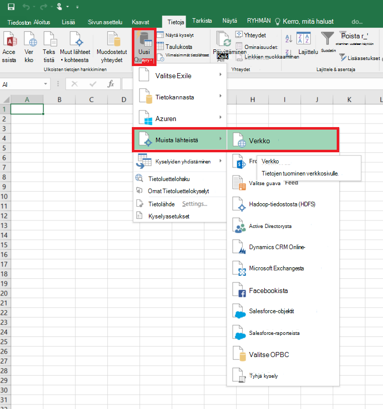
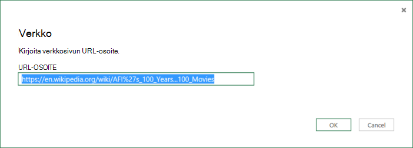
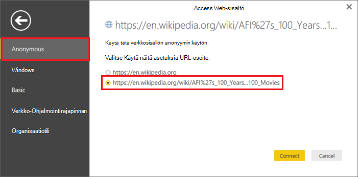
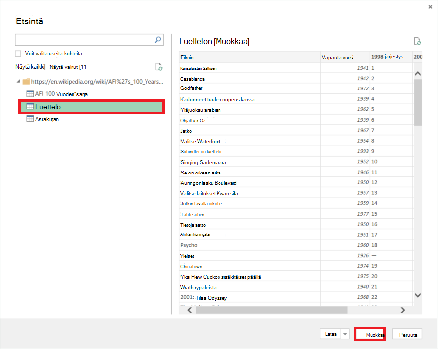
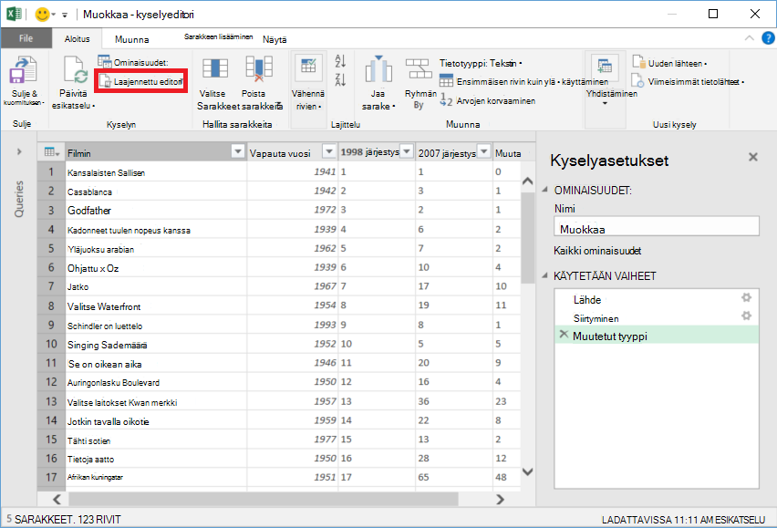
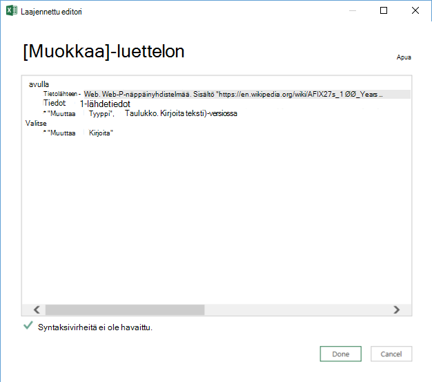

<properties 
    pageTitle="Siirrä tiedot Verkkotaulukon | Azure Data Factory" 
    description="Voit siirtää tietoja paikallisen verkkosivua Azure Data Factory taulukon tietoja." 
    services="data-factory" 
    documentationCenter="" 
    authors="linda33wj" 
    manager="jhubbard" 
    editor="monicar"/>

<tags 
    ms.service="data-factory" 
    ms.workload="data-services" 
    ms.tgt_pltfrm="na" 
    ms.devlang="na" 
    ms.topic="article" 
    ms.date="09/26/2016" 
    ms.author="jingwang"/>

# Siirrä tiedot käyttämällä Azure Data Factory Web taulukon lähde
Tässä artikkelissa käsitellään käyttämisestä kopioi tehtävän Azure tietojen factory-tietojen kopioiminen toiseen tietovaraston taulukon lisääminen verkkosivulle. Tässä artikkelissa perustuu [tietojen siirtämistä tehtävät](data-factory-data-movement-activities.md) -artikkelista, jossa näkyy yleiskatsaus tietojen siirto kopioi tehtävän ja tuettuja kaupan yhdistelmät.

Tietoja factory tukee tällä hetkellä vain verkkotaulukon siirtäminen tiedot ja muiden tietojen stores, mutta tietojen siirtämistä ei muista tallentaa Web-taulukko-kohteeseen.

> [AZURE.NOTE] Web-yhdistin tukee tällä hetkellä vain talteen taulukko-sisällön HTML-sivulta.

## Esimerkki: Tietojen kopioiminen Web taulukon Azure-Blob

Esimerkki alla on esitetty:

1.  [Web](#web-linked-service-properties)-tyypin linkitetyn palvelu.
2.  Linkitetyn palvelu [AzureStorage](data-factory-azure-blob-connector.md#azure-storage-linked-service-properties)tyyppi.
3.  Syötteen [tietojoukko](data-factory-create-datasets.md) tyypin [WebTable](#WebTable-dataset-properties).
4.  Tulosteen [tietojoukko](data-factory-create-datasets.md) tyypin [AzureBlob](data-factory-azure-blob-connector.md#azure-blob-dataset-type-properties).
4.  [Myyntijakso](data-factory-create-pipelines.md) kopioi aktiviteettiin, joka käyttää [WebSource](#websource-copy-activity-type-properties) ja [BlobSink](data-factory-azure-blob-connector.md#azure-blob-copy-activity-type-properties).

Otosten kopioi tiedot verkkotaulukon Azure-blob tunnissa. Käyttää näitä esimerkkejä JSON-ominaisuuksia on kuvattu osia seuraavat mallit. 

Seuraavassa esimerkissä esitetään, kuinka haluat kopioida tiedot verkkotaulukon Azure-blob. Tietoja voi kuitenkin kopioida suoraan mihin tahansa määrä esitetty [Tietojen siirtämistä toiminnot](data-factory-data-movement-activities.md) on artikkelissa käyttämällä Kopioi tehtävän Azure Data Factory. 

**WWW-palvelun linkitetyt** Tässä esimerkissä käytetään linkitetty verkkopalvelun Anonyymi todentaminen. Todennus, voit käyttää erilaista Katso [WWW-palvelun linkitetyt](#web-linked-service-properties) osa. 

    {
        "name": "WebLinkedService",
        "properties":
        {
            "type": "Web",
            "typeProperties":
            {
                "authenticationType": "Anonymous",
                "url" : "https://en.wikipedia.org/wiki/"
            }
        }
    }

**Azure linkitetty tallennuspalvelu**

    {
      "name": "AzureStorageLinkedService",
      "properties": {
        "type": "AzureStorage",
        "typeProperties": {
          "connectionString": "DefaultEndpointsProtocol=https;AccountName=<accountname>;AccountKey=<accountkey>"
        }
      }
    }

**WebTable näytettävä tietojoukko** Data Factory-palvelun määrittäminen **ulkoisten** **Tosi** ilmoittaa, että dataset on ulkoiset tiedot-factory ja tietojen factory toimintaa ei tuottamat.

> [AZURE.NOTE] Katso [Hae indeksi HTML-sivulle taulukon](#get-index-of-a-table-in-an-html-page) osan vaiheet on kuvattu käytön hakemiston taulukon HTML-sivulle.  

    
    {
        "name": "WebTableInput",
        "properties": {
            "type": "WebTable",
            "linkedServiceName": "WebLinkedService",
            "typeProperties": {
                "index": 1,
                "path": "AFI's_100_Years...100_Movies"
            },
            "external": true,
            "availability": {
                "frequency": "Hour",
                "interval":  1
            }
        }
    }

**Azure-Blob tulosteen tietojoukko**

Tietoja kirjoitetaan uusia Blob-objektien tunnissa (taajuus: tunti, väli: 1). 

    {
        "name": "AzureBlobOutput",
        "properties":
        {
            "type": "AzureBlob",
            "linkedServiceName": "AzureStorageLinkedService",
            "typeProperties":
            {
                "folderPath": "adfgetstarted/Movies"
            },
            "availability":
            {
                "frequency": "Hour",
                "interval": 1
            }
        }
    }

**Kopioi aktiviteettiin putkijohto**

Putkisto sisältää kopio-toiminto, joka on määritetty käyttämään yllä syötteen ja tulosteen tietojoukkoja ja on suunniteltu toimimaan tunnissa. Myyntijakso JSON määritelmä- **lähteen** tyyppi on määritetty **WebSource** ja **käsittelytoiminto** tyyppi-asetukseksi on määritetty **BlobSink**. 

Katso [WebSource ominaisuudet](#websource-copy-activity-type-properties) WebSource tukemat ominaisuudet luettelo. 
    
    {  
        "name":"SamplePipeline",
        "properties":{  
        "start":"2014-06-01T18:00:00",
        "end":"2014-06-01T19:00:00",
        "description":"pipeline with copy activity",
        "activities":[  
          {
            "name": "WebTableToAzureBlob",
            "description": "Copy from a Web table to an Azure blob",
            "type": "Copy",
            "inputs": [
              {
                "name": "WebTableInput"
              }
            ],
            "outputs": [
              {
                "name": "AzureBlobOutput"
              }
            ],
            "typeProperties": {
              "source": {
                "type": "WebSource"
              },
              "sink": {
                "type": "BlobSink"
              }
            },
           "scheduler": {
              "frequency": "Hour",
              "interval": 1
            },
            "policy": {
              "concurrency": 1,
              "executionPriorityOrder": "OldestFirst",
              "retry": 0,
              "timeout": "01:00:00"
            }
          }
          ]
       }
    }

## Web-linkitetyistä ominaisuudet

Seuraavassa taulukossa on kuvaus JSON elementtien tietyn linkitetyn verkkopalvelu.

| Ominaisuus | Kuvaus | Pakollinen |
| -------- | ----------- | -------- | 
| tyyppi | Type-ominaisuus on määritettävä: **WWW** | Kyllä | 
| URL-osoite | Web-tietolähteen URL-osoite | Kyllä |
| authenticationType | Anonyymi tai Basic. | Kyllä |
| Käyttäjänimi | Käyttäjänimi perustodentamista. | Kyllä (Perustodentamista)
| salasana | Salasana perustodentamista. | Kyllä (Perustodentamista)

### Käyttämällä Anonyymi todentaminen

    {
        "name": "web",
        "properties":
        {
            "type": "Web",
            "typeProperties":
            {
                "authenticationType": "Anonymous",
                "url" : "https://en.wikipedia.org/wiki/"
            }
        }
    }

### Käyttöoikeuksien avulla
    
    {
        "name": "web",
        "properties":
        {
            "type": "Web",
            "typeProperties":
            {
                "authenticationType": "basic",
                "url" : "http://myit.mycompany.com/",
                "userName": "Administrator",
                "password": "password"
            }
        }
    }

## WebTable tietojoukko ominaisuudet

Täydellinen luettelo osien ja ominaisuudet, jotka ovat käytettävissä määrittäminen tietojoukkoja [luominen tietojoukkoja](data-factory-create-datasets.md) on artikkelissa. Osia, kuten rakenne, käytettävyys ja tietojoukko JSON käytännön muistuttavat tyypeissä tietojoukko (Azure SQL Azure-blob, Azuren taulukkojen jne.).

**TypeProperties** -osassa on eri mistäkin tietojoukko, ja se antaa tietoja tietojen tietovaraston sijainti. Tyypin **WebTable** tietojoukko typeProperties osiossa on seuraavat ominaisuudet

Ominaisuus | Kuvaus | Pakollinen
:-------- | :----------- | :--------
tyyppi    | tietojoukon tyyppi. **WebTable** asettaminen | Kyllä
polku | Suhteellinen URL-Osoitetta, joka sisältää taulukon resurssin. | Ei. Kun polku ei ole määritetty, käytetään vain linkitetyistä määrityksessä määritetyssä URL. 
indeksi | Resurssin juuri indeksi. Katso [Hae indeksi HTML-sivulle taulukon](#get-index-of-a-table-in-an-html-page) osan vaiheet on kuvattu käytön hakemiston taulukon HTML-sivulle. | Kyllä

**Esimerkki:**

    {
        "name": "WebTableInput",
        "properties": {
            "type": "WebTable",
            "linkedServiceName": "WebLinkedService",
            "typeProperties": {
                "index": 1,
                "path": "AFI's_100_Years...100_Movies"
            },
            "external": true,
            "availability": {
                "frequency": "Hour",
                "interval":  1
            }
        }
    }

## WebSource - kopio tehtävän ominaisuudet

Täydellinen luettelo osat ja ominaisuudet, jotka ovat käytettävissä toiminnan määrittäminen [Putkistot luomisesta](data-factory-create-pipelines.md) on artikkelissa. Ominaisuudet, kuten nimi, kuvaus sekä syöttö- ja taulukot ja käytäntö ovat käytettävissä kaikki tehtävälajit. 

Tehtävän typeProperties-osassa käytettävissä olevat ominaisuudet vaihtelevat toisaalta kunkin tehtävätyyppi. Kopioi tehtävälle ne vaihtelevat sen mukaan, lähteiden ja poistumia.

Kopioi tehtävän lähde ollessa tyypin **WebSource**tuetaan tällä hetkellä ei ole muita ominaisuuksia. 

## Taulukon indeksi sitä HTML-sivu

1. Käynnistä **Excel 2016** ja **tiedot** -välilehteen.  
2. Valitse **Uusi kysely** -työkalurivin, osoita **Muista lähteistä** ja **verkosta**.
    
     
3. Kirjoita **URL-osoite** , jota käyttää linkitetyn palvelun JSON **Verkosta** -valintaikkunassa (esimerkiksi: https://en.wikipedia.org/wiki/) sekä määrittämäsi dataset polku (esimerkiksi: AFI % 27s_100_Years... 100_Movies), ja valitse **OK**. 

     

    Tässä esimerkissä käytetään URL-osoite: https://en.wikipedia.org/wiki/AFI%27s_100_Years...100_Movies 
4.  Jos näet **Access Web-sisältö** -valintaikkuna, valitse oikeanpuoleisessa **URL**- **todennus**- ja valitse **Yhdistä**. 

    
5.  Osoita **taulukossa** kohtaa puunäkymässä sisältöä taulukosta ja valitse sitten **Muokkaa** -painikkeen alareunassa.  

     

5. Valitse **Kyselyeditori** -ikkunassa työkalurivin **Laajennettu editori** -painiketta.

    

6. Laajennettu editori-valintaikkunassa "Lähde"-kohdan vieressä on hakemiston.

     

Jos käytössäsi on Excel 2013-indeksin haku [Microsoft Power Query for Excelin](https://www.microsoft.com/download/details.aspx?id=39379) avulla. Lisätietoja on artikkelissa [yhteyden muodostaminen verkkosivuun](https://support.office.com/article/Connect-to-a-web-page-Power-Query-b2725d67-c9e8-43e6-a590-c0a175bd64d8) artikkelissa. Vaiheet ovat samanlaiset, jos käytössäsi on [Microsoft Power BI Desktop](https://powerbi.microsoft.com/desktop/). 

[AZURE.INCLUDE [data-factory-column-mapping](../../includes/data-factory-column-mapping.md)]

[AZURE.INCLUDE [data-factory-structure-for-rectangualr-datasets](../../includes/data-factory-structure-for-rectangualr-datasets.md)]

## Suorituskyky ja säätäminen  
Lisätietoja on artikkelissa [Kopioi tehtävän suorituskyvyn & säätäminen opas](data-factory-copy-activity-performance.md) lisätietoja tärkeimmät seikat, vaikutus suorituskykyä tietojen siirto (kopioi tehtävä) Azure Data Factory ja voidaan optimoida sen usealla tavalla.
