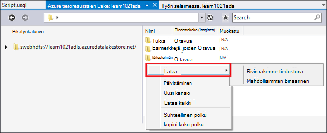
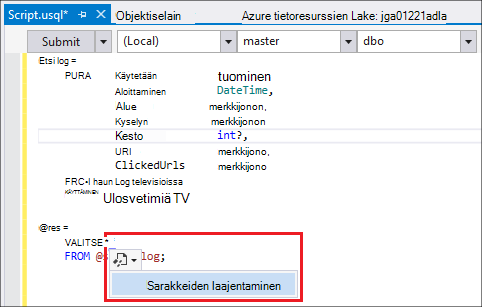
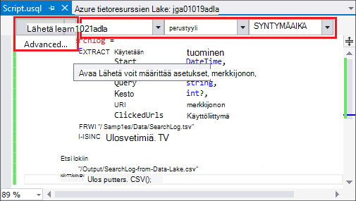
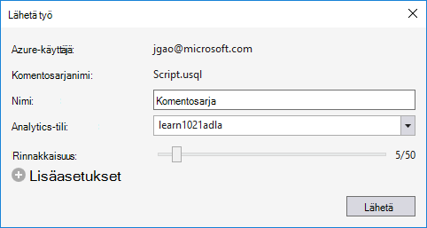
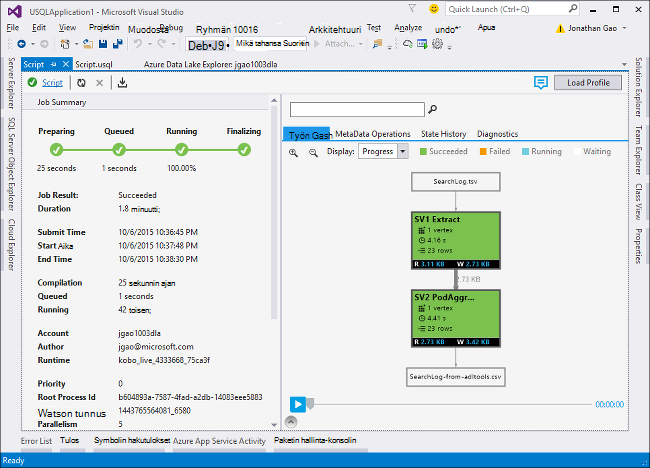
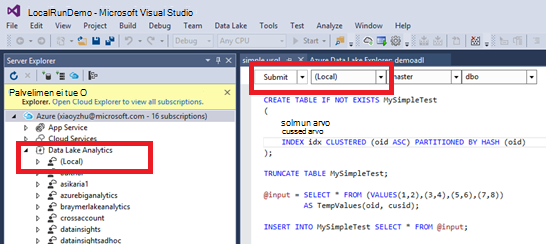
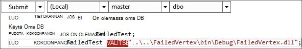

<properties
   pageTitle="U-SQL-komentosarjojen käyttämällä järvi Datatyökalut Visual Studio kehittäminen | Azure"
   description="Opi asentamaan järvi Datatyökalut Visual Studiossa, voit kehittää ja testaa U-SQL-komentosarjoja. "
   services="data-lake-analytics"
   documentationCenter=""
   authors="edmacauley"
   manager="jhubbard"
   editor="cgronlun"/>

<tags
   ms.service="data-lake-analytics"
   ms.devlang="na"
   ms.topic="get-started-article"
   ms.tgt_pltfrm="na"
   ms.workload="big-data"
   ms.date="05/16/2016"
   ms.author="edmaca"/>

# Opetusohjelma: U-SQL-komentosarjojen käyttämällä järvi Datatyökalut Visual Studio kehittäminen

[AZURE.INCLUDE [get-started-selector](../../includes/data-lake-analytics-selector-get-started.md)]

Opettele Asenna järvi Datatyökalut Visual Studio ja käytä järvi Datatyökalut Visual Studio kirjoittaa ja testata U-SQL-komentosarjoja.

U SQL on hyper-skaalattava erittäin extensible oletuskielen valmistellaan muodonmuutoksen ja analysoidaan tietoja järvi ja lisäksi kaikki tiedot. Lisätietoja on artikkelissa U-SQL-viittaus (http://go.microsoft.com/fwlink/p/?LinkId=691348).

##Edellytykset

- **Visual Studio 2015, Visual Studio 2013 Päivitä 4 tai Visual Studio 2012. Enterprise (Ultimate ja Premium), Professionalin, yhteisön versiot tueta; Express Editionin ei tueta. Visual Studio "15" ei tällä hetkellä tueta ja yritämme, valitse.**
- **Microsoft Azure SDK .NET versio 2.7.1 tai yläpuolella**.  Voit asentaa sen [Verkko-ympäristö installer](http://www.microsoft.com/web/downloads/platform.aspx)avulla.
- **[Tietoja järvi Tools for Visual Studio](http://aka.ms/adltoolsvs)**.

    Kun tietojen järvi Tools for Visual Studio on asennettu, näkyviin tulee "tietojen järvi Analytics-solmu palvelimen Explorerissa"Azure-solmu (Voit avata palvelimen explorer painamalla näppäinyhdistelmää Ctrl + Alt + S)-kohdassa.

- **Siirry [Azure tietojen järvi Analytics aloittaminen](data-lake-analytics-get-started-portal.md)käyttämällä Azure portal kaksi osaa kautta**.

    - [Luo Azure tietojen järvi Analytics-tili](data-lake-analytics-get-started-portal.md#create_adl_analytics_account).
    - [Tietosäilö järvi oletustilin ladata SearchLog.tsv](data-lake-analytics-get-started-portal.md#update-data-to-the-default-adl-storage-account).

    Ladattavana PowerShell otoksen komentosarjan luominen tietojen järvi analyyttisten palvelu ja lataamisen lähdetiedoston löytyvät [valmistelemiseksi opetusohjelman Appx-A PowerShell-malli](data-lake-analytics-data-lake-tools-get-started.md#appx-a-powershell-sample-for-preparing-the-tutorial).

    Järvi Datatyökalut ei tue luominen tietojen järvi Analytics-tilit. Näin sinun on luotava se Azure portaalissa PowerShellin Azure, .NET SDK tai Azure CLI. Tietoja järvi Analytics työn suorittamista varten sinun on tietoja. Vaikka järvi Datatyökalut tukee lataus tietoja, Lataa mallitiedot tehdä tässä opetusohjelmassa on helpompi seurata portaalin avulla.

## Yhteyden muodostaminen Azure

**Muodosta yhteys tietoihin järvi Analytics**

1. Avaa Visual Studio.
2. Valitse **Näytä** -valikossa Avaa palvelimen Explorer **Palvelimen Explorer** . Tai paina **[CTRL] + [ALT] + S**.
3. **Azure**hiiren kakkospainikkeella, valitsemalla "yhteyden, Microsoft Azure-tilaus ja noudata sitten ohjeita.
4. **Palvelimen Explorer**Laajenna **Azure**ja laajenna sitten **Tietojen järvi Analytics**. Näet on luettelon tietojen järvi Analytics-tileistä, jos niitä on. Et voi luoda tietojen järvi Analytics-tilit Visual Studio. Luo tili-kohdassa [Azure tietojen järvi Analytics aloittaminen käyttämällä Azure portal](data-lake-analytics-get-started-portal.md) tai [Azure PowerShellin Azure tietojen järvi Analytics käytön aloittaminen](data-lake-analytics-get-started-powershell.md).

## Tietolähteen tietojen tiedostojen lataaminen

Lataamasi **valmistelevat** -osan tietoja aiemmassa opetusohjelman.  

Siltä varalta, jota haluat käyttää omia tietojasi, tässä on järvi Datatyökalut tietojen lataaminen toimenpiteitä.

**Tiedostojen lataaminen riippuvaiset Azure tietojen järvi-tili**

1. **Palvelimen Explorer**Laajenna **Azure**, laajenna **Tietojen järvi Analytics**, laajenna tietojen järvi Analytics-tilisi, laajenna **Tallennustilan tilit**. Näet on järvi tietosäilö oletustilin ja linkitetyt järvi tietosäilö asiakkaat ja linkitetyt Azuren tallennustilaan tilit. Tietoja järvi oletustili on otsikko "Oletustilin tallennustilan".
2. Tietosäilö järvi oletustilin hiiren kakkospainikkeella ja valitse sitten **Resurssienhallinta**.  Se Avaa Visual Studio Resurssienhallinnan järvi Datatyökalut.  Valitse vasemmasta se näyttää puunäkymän, sisältö näkymä on oikealla.
3. Etsi kansio, johon haluat ladata tiedostoja,
4. Napsauta mitä tahansa tyhjää kohtaa hiiren kakkospainikkeella ja valitse sitten **Lataa**.

    

**Tiedostojen lataaminen liitetyn Azure-Blob-tallennustilan tilin**

1. **Palvelimen Explorer**Laajenna **Azure**, laajenna **Tietojen järvi Analytics**, laajenna tietojen järvi Analytics-tilisi, laajenna **Tallennustilan tilit**. Näet on järvi tietosäilö oletustilin ja linkitetyt järvi tietosäilö asiakkaat ja linkitetyt Azuren tallennustilaan tilit.
2. Laajenna Azure-tallennustilan tilin.
3. Säilön, johon haluat ladata tiedostoja hiiren kakkospainikkeella ja valitse sitten **Resurssienhallinta**. Jos sinulla ei ole säilön, sinun on luotava Azure portaalin, PowerShellin Azure tai muita työkaluja käyttämällä ensin.
4. Etsi kansio, johon haluat ladata tiedostoja,
5. Napsauta mitä tahansa tyhjää kohtaa hiiren kakkospainikkeella ja valitse sitten **Lataa**.

## U-SQL-komentosarjojen kehittäminen

Tietoja järvi Analytics työt kirjoitetaan U SQL-kielen. Lisätietoja U-SQL-kohdassa [U SQL-kielen käytön aloittaminen](data-lake-analytics-u-sql-get-started.md) - ja [U-SQL-kieliohje](http://go.microsoft.com/fwlink/?LinkId=691348).

**Voit luoda ja lähettää tiedot järvi Analytics-työ**

1. **Tiedosto** -valikosta **Uusi**ja valitse sitten **Projekti**.
2. Valitse **U-SQL-projektin** tyyppi.

    

3. Valitse **OK**. Visual studio Luo ratkaisun **Script.usql** -tiedoston.
4. **Script.usql**voit kirjoittaa seuraavaa komentosarjaa:

        @searchlog =
            EXTRACT UserId          int,
                    Start           DateTime,
                    Region          string,
                    Query           string,
                    Duration        int?,
                    Urls            string,
                    ClickedUrls     string
            FROM "/Samples/Data/SearchLog.tsv"
            USING Extractors.Tsv();

        @res =
            SELECT *
            FROM @searchlog;        

        OUTPUT @res   
            TO "/Output/SearchLog-from-Data-Lake.csv"
        USING Outputters.Csv();

    Tämä U-SQL-komentosarja lukee käyttämällä **Extractors.Tsv()**lähdetiedosto tiedot ja luo csv-tiedoston **Outputters.Csv()**.

    Älä muokkaa kaksi polkua, paitsi jos lähdetiedosto kopioidaan toiseen sijaintiin.  Tietojen järvi Analytics Luo tulostus-kansioon, jos se ei ole.

    On helpompaa käyttämään suhteelliset polut oletusarvon tietojen järvi tilit tallennettuja tiedostoja. Voit käyttää myös suoria polkuja.  Esimerkki

        adl://<Data LakeStorageAccountName>.azuredatalakestore.net:443/Samples/Data/SearchLog.tsv

    Sinun on käytettävä absoluuttiset polut linkitetyt tallennustilan asiakkaat tiedostoja.  Liitetyn Azure-tallennustilan tilin tallennettuja tiedostoja syntaksi on seuraava:

        wasb://<BlobContainerName>@<StorageAccountName>.blob.core.windows.net/Samples/Data/SearchLog.tsv

    >[AZURE.NOTE] Azure Blob-säilö julkisen BLOB tai julkinen säilöjen käyttöoikeudet eivät ole tuettuja.  

    Huomaa seuraavat toiminnot:

    - **IntelliSense**

        Nimen automaattinen Vastatut ja jäsenet näytetään Rivijoukko, luokat, tietokannoista, mallit ja käyttäjän määrittämät objektit (UDOs).

        Luettelon kohteiden (tietokantoja, mallit, taulukot, UDOs jne.) IntelliSense liittyy Laske-tiliisi. Voit tarkistaa nykyisen aktiivisen Laske-tilille, tietokanta ja yläreunan työkalurivi rakenne ja siirtyä niiden kautta avattavat luettelot.

    - **Laajenna* -sarakkeet**

        Valitse oikealla puolella olevaa *, näet sininen alleviivata *. Vie hiiriosoitin sinisen alleviivaus ja valitse sitten alaspäin osoittavaa nuolta.
        

        **Sarakkeiden laajentaminen**-työkalu korvaa * ja sarakkeiden nimet.

    - **Automaattinen muotoilu**

        Käyttäjät voivat muuttaa sisennystä koodin perusteella U-SQL-komentosarja-rakenne, valitse Muokkaa > Lisäasetukset:

        - Muotoile asiakirjan (Ctrl + E, D): Muotoilee koko asiakirjaan   
        - Muotoile valinta (Ctrl + K, Ctrl + F): Muotoilee valitun alueen. Jos ole tehnyt pikakuvakkeen muotoilee kohdistin on rivin.  

        Kaikki muotoilut säännöt ovat määritettävissä Työkalut -> Asetukset > tekstin editori - > SIP -> muotoilu.  
    - **Automaattinen sisennys**

        Järvi Datatyökalut Visual Studio voi sisentää lausekkeiden automaattisesti kirjoittaessasi komentosarjoja. Tämä toiminto on oletusarvoisesti pois käytöstä, käyttäjien tarvitsee käyttöön kautta tarkistuksen U-SQL -> Asetukset ja asetukset -> valitsimet -> Ota käyttöön automaattinen sisennys.

    - **Määritys, Etsi kaikki viittaukset**

        Rivijoukko/parametrin/sarakkeen/UDO jne nimeä hiiren kakkospainikkeella ja valitsemalla Siirry, määritys (F12) avulla voit siirtyä sen määritelmän. Valitsemalla Etsi kaikki viittaukset (VAIHTO + F12) näkyy kaikki viittaukset.

    - **Lisää Azure polku**

        Sen sijaan, että muistaminen Azure tiedostopolku ja kirjoita se manuaalisesti, kun kirjoitat komentosarjaa, järvi Datatyökalut Visual Studio tarjoaa helposti: editorissa hiiren kakkospainikkeella, valitse Lisää Azure polku. Siirry Azure Blob selaimessa-valintaikkunaan tiedoston. Valitse **OK**. tiedostopolku lisätään koodisi.

5. Määritä tiedot järvi Analytics-tili, tietokanta ja rakenteen. Voit valita **(paikallinen)** suorittamalla komentosarja paikallisesti testauksen tarkoitusta varten. Lisätietoja on artikkelissa [Suorita U-SQL paikallisesti](#run-u-sql-locally).

    

    Lisätietoja on artikkelissa [Käytä U-SQL-luettelon](data-lake-analytics-use-u-sql-catalog.md).

5. **Ratkaisunhallinnassa** **Script.usql**hiiren kakkospainikkeella ja valitse sitten **Luo komentosarjan**. Tarkista tulos tulostus-ruudussa.
6. **Ratkaisunhallinnassa** **Script.usql**hiiren kakkospainikkeella ja valitse sitten **Lähetä komentosarjan**. Voit vaihtoehtoisesti myös valitsemalla **Lähetä** Script.usql-ruudusta.  Katso edellisen näyttökuvan.  Napsauta alanuolta Lähetä-painike lähettää advance-asetusten avulla:
7. Määritä **Projektin nimi**, tarkista **Analytics-tili**ja valitse sitten **Lähetä**. Lähetyksen tulokset ja työn linkki ovat käytettävissä tietojen järvi Tools for Visual Studio tulokset-ikkunan, kun lähetys on valmis.

    

8. Sinun on valittava uusimman projektin tilaa ja näytön päivittäminen Päivitä-painike. Kun työ onnistuu, se näkyy, että **Työn Graph**- **Metatietojen tietojen toimintojen** **Tilan historiatiedot**, **Diagnostiikka**:

    

    * Projektin yhteenveto. Näytä nykyisen työn yhteenvetotiedot esimerkiksi: tila, edistymistä, suoritusaika, Runtime nimi, lähettäjän jne.   
    * Projektin tiedot. Työn yksityiskohtaiset tiedot annetaan, mukaan lukien komentosarja, resurssi, kärkipiste suorittamisen näkymä.
    * Työn kaavion. Projektin tietojen toimitetaan neljä kaaviota: edistymisen, tietojen luku, kirjoittaa tietoja, suoritusaika, keskimääräinen suoritusaika kohti solmu, syötteen siirtonopeuden, tulosteen siirtonopeuden.
    * Metatietojen toiminnot. Se näyttää kaikki metatietojen toiminnot.
    * Tilan historia.
    * Diagnostiikka. Tietoja järvi Tools for Visual Studio vianmäärityksen suorittaminen automaattisesti. Saat ilmoituksia, kun Jotkin virheet ja niiden töiden suorituskykyongelmia. Katso lisätietoja osa diagnostiikka (linkki TBD) työn.

**Voit tarkistaa työn tila**

1. Palvelimen Explorerista Laajenna **Azure**, laajenna **Tietojen järvi Analytics**, laajenna tietojen järvi Analytics-tilin nimi
2. Kaksoisnapsauta **töitä** projektien luettelo.
2. Valitse projektin tilan tarkasteleminen.

**Jos haluat nähdä projektin tulos**

1. **Palvelimen Explorer**Laajenna **Azure**, laajenna **Tietojen järvi Analytics**, laajenna tietojen järvi Analytics-tilisi, laajenna **Tallennustilan tilit**, järvi tietosäilö oletustilin hiiren kakkospainikkeella ja valitse **Explorer**.
2.  Kaksoisnapsauta **tulostus** -kansion avaaminen
3.  Kaksoisnapsauta **SearchLog adltools.csv**.

###Työn toisto

Työn toiston avulla voit katsella projektin suorittaminen etenemisen ja tunnistaa visuaalisesti suorituskyvyn poikkeamia ja pullonkaulojen. Tämä toiminto voidaan, ennen kuin työ on valmis (eli aikana työ aktiivisesti käynnissä aika) sekä suorittamisen jälkeen. Suorittamalla toisto työn suorituksen aikana antaa käyttäjän toistaminen edistymisen ylöspäin nykyisen kellonajan.

**Voit tarkastella projektin suorittaminen etenemisen**  

1. Valitse **Lataa profiilin** oikeassa yläkulmassa. Katso koodin edelliseen näyttöön.
2. Valitse vasemmassa alakulmassa tarkistettava projektin suorittaminen etenemisen toista-painiketta.
3. Toiston aikana Valitse **Keskeytä** lopetetaan tai vedä suoraan tilanneilmaisin tiettyyn järjestykseen.

###Lämpökartta

Tietoja järvi Tools for Visual Studio sisältää käyttäjän valittavissa olevan väri-päällekkäiset työn näkymän osoittamaan edistymistä, tiedot i/o, suoritusaika, i/o siirtonopeuden jokaisen vaiheen. Kautta, käyttäjät voivat selvittää mahdolliset ongelmat ja ominaisuudet työn jakautumisen suoraan ja intuitiivisesti. Voit valita tietolähteen Näytä avattavasta luettelosta.  

## Suorita U SQL paikallisesti

Suorita kokemus Visual Studiossa U SQL paikallisen avulla voit:

- Suorita paikallisesti, U-SQL-komentosarjat sekä C# kokoonpanot.
- Virheenkorjaus C# kokoonpanot paikallisesti.
- Luo, poista tai Näytä paikalliset tietokannat, kokoonpanot, mallit ja taulukot palvelimen Explorerissa samalla tavalla kuin Tee Azure tietojen järvi Analytics-palveluun.

Näet *paikallisen* tilin Visual Studiossa ja asennusohjelma luo *DataRoot* kansiossa sijaitseva *C:\LocalRunRoot*. DataRoot-kansion käytetään:

- Säilön metatietojen mukaan lukien taulukot, hidastustekniikkaa, TVFs jne.
- Tiettyjen komentosarja: Jos suhteellinen polku viitataan i/polut, emme näyttää ylös DataRoot (sekä komentosarjan polku, jos se on syöte)
- DataRoot-kansio ei ole valitsinta, jos yrität rekisteröidä kokoonpanon ja käyttää suhteellinen polku (Katso lisätietoja "Käytä kokoonpanot kun tekevät paikallisen Suorita" osa)

Seuraavassa videossa esitellään U-SQL paikallisen Suorita-toiminto:

>[AZURE.VIDEO usql-localrun]

### Tunnettuja ongelmia ja rajoituksia

- Voi luoda taulukon/DB jne palvelimen Explorerissa paikallisen tilin.
- Kun suhteellinen polku on viittaus:

    - Komentosarjan Input (PURA * FROM "/ polun/abc")-Komentosarjapolku ja DataRoot polku etsitään.
    - Komentosarjan tulostukseen (tulos TO "polku/abc"): DataRoot polku käytetään Tulostekansio.
    - Kokoonpanon rekisteröimiseen (Luo KOKOONPANON xyz-"/ polun/abc"): Komentosarjapolku etsitään, mutta ei DataRoot.
    - Valitse rekisteröity TVF tai tarkastellaan tai metatietojen muihin kohteisiin: DataRoot polku etsitään, mutta ei Komentosarjapolku.

    Komentosarjojen suoritettiin tietojen järvi-palveluun, tallennustilan oletustilin käytetään pääkansio ja etsitään vastaavasti.

### Testaa paikallisesti U-SQL-komentosarjat
Katso ohjeet kehittämisestä U-SQL-komentosarjat [kehittää U-SQL-komentosarjat](#develop-and-test-u-sql-scripts). Muodosta ja suorita U-SQL-komentosarjoja määritetään paikallisesti, valitse **(paikallinen)** klusterin avattavasta luettelosta ja valitse **Lähetä**. Varmista, että sinulla on oikeat tiedot Viitattu - joko lisätietoja absoluuttinen polku tai tietojen tallennussijainti DataRoot-kansiossa.

Voit myös komentosarjan hiiren kakkospainikkeella ja valitse valitsemalla pikavalikosta **Suorittaa paikallisen suunnitteleminen** tai painamalla **CTRL + F5** käynnistimen paikalliseen Suorita.

### Käyttää kokoonpanoja paikallinen suorittaminen

Suorita mukautettuja C#-tiedostoja kahdella eri tavalla:

- Kirjoita kokoonpanot tiedoston koodissa ja kokoonpanon voi automaattisesti rekisteröity ja kohteet poistetaan, kun komentosarja on valmis.
- Luo C#-kokoonpanon projektin ja rekisteröi tulosteen dll-kirjaston paikallisen tilin kautta script. Huomaa, että polku on suhteessa komentosarja DataRoot-kansion sijaan.

### Komentosarjojen ja C# laitekokonaisuuksien paikallisesti korjaaminen

Voit korjata C# kokoonpanot ilman lähettämistä ja rekisteröiminen Azure tietojen järvi Analytics-palveluun. Voit määrittää keskeytyskohdat koodissa sekä tiedoston ja viitatun C# projektissa.

**Jos haluat korjata paikallisen tiedoston koodia-koodi**
1.  Määritä tiedoston koodissa keskeytyskohdat.
2.  Painamalla **F5** paikallisesti komentosarjan korjaaminen.

Visual Studio 2015 toimii vain seuraavasti. Vanhat Visual Studiossa joudut ehkä lisätä manuaalisesti pdb-tiedostoja.

**Paikallinen koodi viitatun C# projektin korjaamisessa**
1.  C# kokoonpanon projektin luominen ja sen Luo tulosteen dll-kirjaston luominen.
2.  Rekisteröi käyttäen U-SQL-lause dll:

        CREATE ASSEMBLY assemblyname FROM @"..\..\path\to\output\.dll";
3.  Määrittää keskeytyskohdat C#-koodin.
4.  Painamalla **F5-näppäintä** ja C# dll paikallisesti viittaava komentosarjan korjaaminen.  

##Katso myös

Aloita tietojen järvi Analytics eri työkaluilla, katso:

- [Aloita tietojen järvi Analytics Azure-portaalissa](data-lake-analytics-get-started-portal.md)
- [Aloita tietojen järvi Analytics Azure PowerShellin avulla](data-lake-analytics-get-started-powershell.md)
- [Käyttämällä .NET SDK tietojen järvi Analytics käytön aloittaminen](data-lake-analytics-get-started-net-sdk.md)
- [C#-koodin, U-SQL-töiden virheenkorjaus](data-lake-analytics-debug-u-sql-jobs.md)

Jos haluat nähdä kehittäminen aiheita:

- [Web-päiväkirjoja käyttämällä tietojen järvi Analytics analysoiminen](data-lake-analytics-analyze-weblogs.md)
- [U-SQL-komentosarjojen käyttämällä järvi Datatyökalut Visual Studio kehittäminen](data-lake-analytics-data-lake-tools-get-started.md)
- [Azure tietojen järvi Analytics U-SQL-kielen käytön aloittaminen](data-lake-analytics-u-sql-get-started.md)
- [Kehittää tietojen järvi Analytics työt U SQL käyttäjän määrittämät operaattorit](data-lake-analytics-u-sql-develop-user-defined-operators.md)

##Appx A PowerShell otoksen opetusohjelman valmisteleminen

Seuraavaa PowerShell-komentosarjaa valmistellaan Azure tietojen järvi Analytics-tili ja lähdetietojen, joten voit siirtyä [kehittää U-SQL-komentosarjat](data-lake-analytics-data-lake-tools-get-started.md#develop-u-sql-scripts).

    #region - used for creating Azure service names
    $nameToken = "<Enter an alias>"
    $namePrefix = $nameToken.ToLower() + (Get-Date -Format "MMdd")
    #endregion

    #region - service names
    $resourceGroupName = $namePrefix + "rg"
    $dataLakeStoreName = $namePrefix + "adas"
    $dataLakeAnalyticsName = $namePrefix + "adla"
    $location = "East US 2"
    #endregion

    # Treat all errors as terminating
    $ErrorActionPreference = "Stop"

    #region - Connect to Azure subscription
    Write-Host "`nConnecting to your Azure subscription ..." -ForegroundColor Green
    try{Get-AzureRmContext}
    catch{Login-AzureRmAccount}
    #endregion

    #region - Create an Azure Data Lake Analytics service account
    Write-Host "Create a resource group ..." -ForegroundColor Green
    New-AzureRmResourceGroup `
        -Name  $resourceGroupName `
        -Location $location

    Write-Host "Create a Data Lake account ..."  -ForegroundColor Green
    New-AzureRmDataLakeStoreAccount `
        -ResourceGroupName $resourceGroupName `
        -Name $dataLakeStoreName `
        -Location $location

    Write-Host "Create a Data Lake Analytics account ..."  -ForegroundColor Green
    New-AzureRmDataLakeAnalyticsAccount `
        -Name $dataLakeAnalyticsName `
        -ResourceGroupName $resourceGroupName `
        -Location $location `
        -DefaultDataLake $dataLakeStoreName

    Write-Host "The newly created Data Lake Analytics account ..."  -ForegroundColor Green
    Get-AzureRmDataLakeAnalyticsAccount `
        -ResourceGroupName $resourceGroupName `
        -Name $dataLakeAnalyticsName  
    #endregion

    #region - prepare the source data
    Write-Host "Import the source data ..."  -ForegroundColor Green
    $localFolder = "C:\Tutorials\Downloads\" # A temp location for the file.
    $storageAccount = "adltutorials"  # Don't modify this value.
    $container = "adls-sample-data"  #Don't modify this value.

    # Create the temp location  
    New-Item -Path $localFolder -ItemType Directory -Force

    # Download the sample file from Azure Blob storage
    $context = New-AzureStorageContext -StorageAccountName $storageAccount -Anonymous
    $blobs = Azure\Get-AzureStorageBlob -Container $container -Context $context
    $blobs | Get-AzureStorageBlobContent -Context $context -Destination $localFolder

    # Upload the file to the default Data Lake Store account    
    Import-AzureRmDataLakeStoreItem -AccountName $dataLakeStoreName -Path $localFolder"SearchLog.tsv" -Destination "/Samples/Data/SearchLog.tsv"

    Write-Host "List the source data ..."  -ForegroundColor Green
    Get-AzureRmDataLakeStoreChildItem -Account $dataLakeStoreName -Path  "/Samples/Data/"
    #endregion
