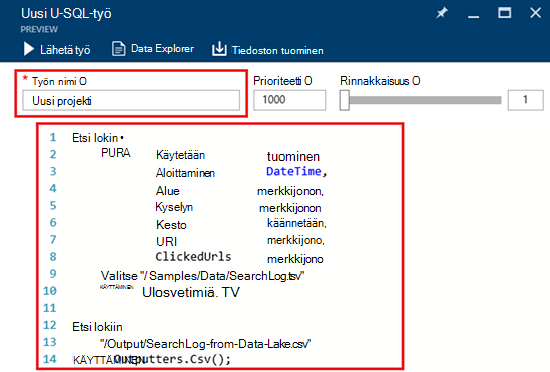
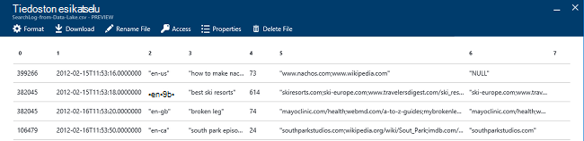

<properties 
   pageTitle="Aloita Azure tietojen järvi Analytics Azure-portaalissa | Azure" 
   description="Opettele käyttämään tietoja järvi Analytics-tilin luominen, luoda tietojen järvi Analytics työn U SQL Azure portaalin ja Lähetä työ. " 
   services="data-lake-analytics" 
   documentationCenter="" 
   authors="edmacauley" 
   manager="jhubbard" 
   editor="cgronlun"/>
 
<tags
   ms.service="data-lake-analytics"
   ms.devlang="na"
   ms.topic="hero-article"
   ms.tgt_pltfrm="na"
   ms.workload="big-data" 
   ms.date="10/06/2016"
   ms.author="edmaca"/>

# Opetusohjelma: käytön aloittaminen Azure tietojen järvi Analytics Azure-portaalissa

[AZURE.INCLUDE [get-started-selector](../../includes/data-lake-analytics-selector-get-started.md)]

Opettele Azure portaalin avulla voit luoda Azure tietojen järvi Analytics-tilit ja määrittää tietojen järvi Analytics työt [U](data-lake-analytics-u-sql-get-started.md)SQL lähettää tietoja järvi Analytics-palvelu työt. Lisätietoja tietojen järvi Analytics artikkelissa [Azure tietojen järvi Analytics yleiskatsaus](data-lake-analytics-overview.md).

Tässä opetusohjelmassa kehittää työn, joka lukee välilehti erotetut arvot (TSV)-tiedosto ja muuntaa sen Luetteloerottimella erotetut arvot (CSV)-tiedostoon. Siirry saman opetusohjelman käyttämällä muita tuetuilla työkaluilla kautta valitsemalla ylälaidassa tämän osion välilehtiä. Kun ensimmäisen työn on valmis, voit aloittaa kirjoittaa monimutkaisia tietojen muunnokset U SQL.

##Edellytykset

Ennen kuin aloitat Tässä opetusohjelmassa, sinulla on oltava seuraavat kohteet:

- **Azure-tilaus**. Katso [Hae Azure maksuttoman kokeiluversion](https://azure.microsoft.com/pricing/free-trial/).

##Tietoja järvi Analytics-tilin luominen

Sinulla on oltava tietojen järvi Analytics-tili, ennen kuin voit suorittaa töitä.

Tietoja järvi Analytics-tileille on [Azure järvi tietosäilö]() -tilin riippuvuuden.  Tämän tilin kutsutaan järvi tietovaraston oletustiliksi.  Voit luoda järvi tietovaraston tilin etukäteen, tai kun luot tietojen järvi Analytics-tilillesi. Tässä opetusohjelmassa luodaan järvi tietosäilö-tilin tiedot järvi Analytics-tilillä.

**Tietoja järvi Analytics-tilin luominen**

1. Kirjaudu [Azure portaaliin](https://portal.azure.com).
2. **Uusi**ja valitse **liiketoimintatietojen + analytics** **Tietojen järvi Analytics**.
3. Kirjoita tai valitse seuraavat arvot:

    

    - **Nimi**: tiedot järvi Analytics-tilin nimi.
    - **Tilaus**: Valitse Analytics-tilissä Azure tilaus.
    - **Resurssiryhmä**. Valitse Azure-resurssiryhmä tai luoda uuden. Azure Resurssienhallinta mahdollistaa sovelluksen ryhmänä resurssien käsitteleminen. Lisätietoja on artikkelissa [Azure Resurssienhallinta yleiskatsaus](resource-group-overview.md). 
    - **Sijainti**. Valitse Azure tietokeskuksen tietojen järvi Analytics-tilille. 
    - **Tietosäilö Lake**: kunkin tietojen järvi Analytics tilillä on riippuvainen järvi tietosäilö-tilin. Tietoja järvi Analytics-tili ja riippuvainen järvi tietosäilö on sijaittava saman Azure tietokeskuksen. Uuden järvi tietovaraston asiakkaan noudattamalla tai valitse olemassa.

8. Valitse **Luo**. Se avaa portaalin aloitusnäyttöön. Uusi ruutu lisätään StartBoard näkyy "Käyttöönotto Azure tietojen järvi Analytics" otsikko. Kestää jonkin aikaa tietojen järvi Analytics-tilin luominen. Kun tili on luotu, portaalin avautuu uusi sivu-tilin.

Kun tietojen järvi Analytics-tili on luotu, voit lisätä muita järvi tietovaraston ja Azure-tallennustilan tilit. Katso ohjeet [hallinta tietojen järvi Analytics tilin tietolähteet](data-lake-analytics-manage-use-portal.md#manage-account-data-sources).

##Tietolähteen tietojen valmisteleminen

Tässä opetusohjelmassa käsitellä joitakin haun lokitiedot.  Etsi lokin voidaan tallentaa dData Lake kaupan tai Azure-Blob-säiliö. 

Azure-portaalissa on käyttöliittymän kopioimiseen joitakin mallidatatiedostot Lake tietovaraston oletustilin, jotka sisältävät haun lokitiedostoon.

**Kopioi mallidatatiedostot**

1. Avaa [Azure portal](https://portal.azure.com)tietojen järvi Analytics-tilillesi.  Katso [hallinta tietojen järvi Analytics-tilit](data-lake-analytics-get-started-portal.md#manage-accounts) ja luoda, ja avaa asiakas-portaalissa.
3. Laajenna **Essentials** -ruutu ja valitse sitten **Selaa-komentosarjamallit**. Se avaa **Komentosarjamallit**nimeltä toinen sivu.

    

4. Valitse kopioitavat mallidatatiedostot **Otoksen puuttuvat tiedot** . Kun se on valmis, portaalin näkyy **päivitetty mallitietoja**.
7. Valitse **Tietoresurssien** tietojen järvi analytics tili-sivu valitsemalla rakennenäkymäalueen. 

    

    Se avaa kaksi lavat. **Data Explorer**on, ja toinen järvi tietovaraston oletustilin.
8. Valitse **Mallit** , laajenna kansio ja valitse sitten **tiedot** , laajenna kansio oletusarvon järvi tietovaraston tili-sivu. Näet on seuraavat tiedostot ja kansiot:

    - AmbulanceData /
    - AdsLog.tsv
    - SearchLog.tsv
    - version.txt
    - WebLog.log
    
    Tässä opetusohjelmassa käytetään SearchLog.tsv.

Harjoitus voit ohjelmien joko sovellukset voivat kirjoittaa tietoja linkitetyn tallennustilan tilien tai lataa tiedot. Lisätietoja tiedostojen lataamisesta [Lataa järvi tietovaraston tiedot](data-lake-analytics-manage-use-portal.md#upload-data-to-adls) tai [Lataa tiedot Blob-objektien tallennustilaan](data-lake-analytics-manage-use-portal.md#upload-data-to-wasb).

##Luo ja Lähetä tiedot järvi Analytics töitä

Kun olet valmistellut lähdetietojen, voit aloittaa kehittäminen U-SQL-komentosarja.  

**Voit lähettää työn**

1. Portaalissa tietojen järvi analytics tili-sivu Valitse **Uusi projekti**. 

    

    Jos et näe sivu, katso [Avaa tietojen järvi Analytics-tili-portaalista](data-lake-analytics-manage-use-portal.md#access-adla-account).
2. Kirjoita **Projektin nimi**ja seuraavaa U-SQL-komentosarjaa:

        @searchlog =
            EXTRACT UserId          int,
                    Start           DateTime,
                    Region          string,
                    Query           string,
                    Duration        int?,
                    Urls            string,
                    ClickedUrls     string
            FROM "/Samples/Data/SearchLog.tsv"
            USING Extractors.Tsv();
        
        OUTPUT @searchlog   
            TO "/Output/SearchLog-from-Data-Lake.csv"
        USING Outputters.Csv();

    

    Tämä U-SQL-komentosarja lukee käyttämällä **Extractors.Tsv()**lähdetiedosto tiedot ja luo csv-tiedoston **Outputters.Csv()**. 
    
    Älä muokkaa kaksi polkua, paitsi jos lähdetiedosto kopioiminen toiseen paikkaan.  Tietojen järvi Analytics Luo tulostus-kansion, jos sitä ei ole.  Tässä tapauksessa emme käyttävät yksinkertainen, suhteellinen polkuja.  
    
    On helpompaa suhteelliset polut käytettävät oletusarvoiset tiedot järvi tilit tallennettuja tiedostoja. Voit käyttää myös suoria polkuja.  Esimerkki 
    
        adl://<Data LakeStorageAccountName>.azuredatalakestore.net:443/Samples/Data/SearchLog.tsv
      

    Lisätietoja U-SQL-artikkelissa [Azure tietojen järvi Analytics U-SQL-kielen käytön aloittaminen](data-lake-analytics-u-sql-get-started.md) - ja [U-SQL-kieliohje](http://go.microsoft.com/fwlink/?LinkId=691348).
     
3. Valitse **Lähetä työ** yläreunassa.   
4. Odota, kunnes työn tilaksi on muutettu **onnistui**. Voit tarkastella projektin noudatit noin minuutin loppuun.
    
    Siltä varalta, että työ epäonnistui, katso [näyttö ja vianmääritys tietojen järvi Analytics työt](data-lake-analytics-monitor-and-troubleshoot-jobs-tutorial.md).

5. Sivu alareunassa **tulostus** -välilehti ja valitse sitten **SearchLog-kohteesta-tiedot-Lake.csv**. Voit esikatsella, lataa, nimeä uudelleen ja poistaa kohdetiedosto.

    

##Katso myös

- Monimutkaisen kyselyn on ohjeartikkelissa [Analysoi sivuston lokit Azure tietojen järvi Analytics avulla](data-lake-analytics-analyze-weblogs.md).
- Aloita U SQL kehityssovellusten ohjeaiheessa [kehittää U-SQL-komentosarjojen käyttäminen tietojen järvi Tools for Visual Studio](data-lake-analytics-data-lake-tools-get-started.md).
- U-SQL-kohdassa [Azure tietojen järvi Analytics U-SQL-kielen käytön aloittaminen](data-lake-analytics-u-sql-get-started.md).
- Katso hallintatehtäviä, [hallita Azure tietojen järvi Analytics käyttämällä Azure portal](data-lake-analytics-manage-use-portal.md).
- Saat yleiskatsauksen tietojen järvi Analytics-artikkelissa [Azure tietojen järvi Analytics yleiskatsaus](data-lake-analytics-overview.md).
- Saat saman opetusohjelman muiden työkaluilla valitsemalla välilehden valitsimet-sivulla.
- Diagnostiikan lokitiedot on artikkelissa [Azure tietojen järvi Analytics käytetään diagnostiikka lokit](data-lake-analytics-diagnostic-logs.md)
