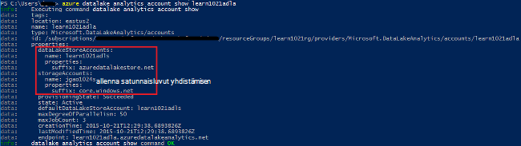
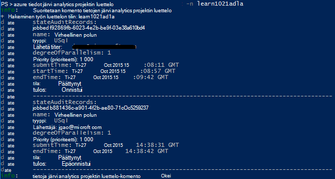
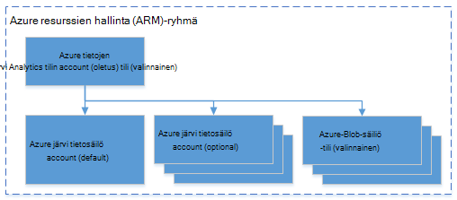

<properties 
   pageTitle="Hallitse Azure tietojen järvi Analytics Azure komentorivivalitsimet käyttöliittymässä | Azure" 
   description="Opi hallitsemaan tietoja järvi Analytics-tilit, tietolähteitä, töitä ja käyttäjät käyttävät Azure CLI" 
   services="data-lake-analytics" 
   documentationCenter="" 
   authors="edmacauley" 
   manager="jhubbard" 
   editor="cgronlun"/>
 
<tags
   ms.service="data-lake-analytics"
   ms.devlang="na"
   ms.topic="article"
   ms.tgt_pltfrm="na"
   ms.workload="big-data" 
   ms.date="05/16/2016"
   ms.author="edmaca"/>

# Hallitse Azure tietojen järvi Analytics käyttämällä Azure käyttöliittymä (CLI)

[AZURE.INCLUDE [manage-selector](../../includes/data-lake-analytics-selector-manage.md)]

Opi hallitsemaan Azure tietojen järvi Analytics-tilit, tietolähteitä, käyttäjät ja työt Azure käyttämällä. Saat hallinta aiheen käyttää muita työkaluja valitsemalla välilehti Valitse yllä.

**Edellytykset**

Ennen kuin aloitat Tässä opetusohjelmassa, sinun on oltava seuraavasti:

- **Azure-tilaus**. Katso [Hae Azure maksuttoman kokeiluversion](https://azure.microsoft.com/pricing/free-trial/).
- **Azure CLI**. Katso [asentaminen ja määrittäminen Azure CLI](../xplat-cli-install.md).
    - Lataa ja asenna **ennakkoversion** [Azure CLI Työkalut](https://github.com/MicrosoftBigData/AzureDataLake/releases) suorittaminen edellyttää tätä esittely.
- **Todennus**seuraava komento:

        azure login
    Lisätietoja todennustapa työpaikan tai oppilaitoksen tilillä on artikkelissa [etäyhteyden muodostaminen Azure tilauksen Azure-CLI](../xplat-cli-connect.md).
- **Siirry Azure Resurssienhallinta-tilassa**käyttämällä seuraava komento:

        azure config mode arm

**Luettelon järvi tietovaraston ja tietojen järvi Analytics-komennot:**

    azure datalake store
    azure datalake analytics

<!-- ################################ -->
<!-- ################################ -->
## Tilien hallinta

Ennen kuin suoritat tietojen järvi Analytics töitä, sinulla on oltava tietojen järvi Analytics-tili. Toisin kuin Azure Hdinsightiin ei maksat Analytics-tiliä, kun se ei ole käynnissä työn.  Voit maksaa vain kerran, kun se suoritetaan työn.  Lisätietoja on artikkelissa [Azure järvi Analytics yleiskatsaus](data-lake-analytics-overview.md).  

###Tilien luominen

    azure datalake analytics account create "<Data Lake Analytics Account Name>" "<Azure Location>" "<Resource Group Name>" "<Default Data Lake Account Name>"

###Päivitä tilit

Seuraava komento päivittää aiemmin luotuja tietoja järvi Analytics tilin ominaisuudet
    
    azure datalake analytics account set "<Data Lake Analytics Account Name>"

###Luettelo-tilit

Luettelon tietojen järvi Analytics-tilit 

    azure datalake analytics account list

Tietyn resurssiryhmän luettelon tietojen järvi Analytics tilit

    azure datalake analytics account list -g "<Azure Resource Group Name>"

Tiettyjen tietojen järvi Analytics-tilin näyttäminen

    azure datalake analytics account show -g "<Azure Resource Group Name>" -n "<Data Lake Analytics Account Name>"

###Poista tietojen järvi Analytics-tilit

    azure datalake analytics account delete "<Data Lake Analytics Account Name>"

<!-- ################################ -->
<!-- ################################ -->
## Tili-tietolähteiden hallinta

Tietoja järvi Analytics tukee tällä hetkellä seuraaviin tietolähteisiin:

- [Azure järvi tietosäilö](../data-lake-store/data-lake-store-overview.md)
- [Azure-tallennustilan](../storage/storage-introduction.md)

Kun luot Analytics-tilin, sinun on määritettävä Azure järvi tietosäilö tilin olevan tallennustilan oletustilin. ADL tallennustilan oletustilin käytetään työn metatietojen ja työn valvontalokien tallentamiseen. Kun olet luonut Analytics-tiliä, voit lisätä järvi tietosäilö tilejä ja/tai Azure-tallennustilan tilin. 

### Etsi ADL tallennustilan oletustilin

    azure datalake analytics account show "<Data Lake Analytics Account Name>"

Arvo on lueteltu ominaisuudet: datalakeStoreAccount:name-kohdassa.

### Lisää Azure Blob storage tilejä

    azure datalake analytics account datasource add -n "<Data Lake Analytics Account Name>" -b "<Azure Blob Storage Account Short Name>" -k "<Azure Storage Account Key>"

>[AZURE.NOTE] Vain Blob storage lyhyet nimet ovat tuettuja.  Älä käytä täydellinen toimialuenimi, esimerkiksi "myblob.blob.core.windows.net".

### Lisää tilejä järvi tietosäilö

    azure datalake analytics account datasource add -n "<Data Lake Analytics Account Name>" -l "<Data Lake Store Account Name>" [-d]

[-d] on valinnainen valitsin, joka ilmaisee, onko tiedot lisätään järvi tietojen järvi oletustilin. 

### Päivitä aiemmin luotuun tietolähteeseen

Voit määrittää aiemmin luotu järvi tietovaraston tili oletusmuokkauskieli seuraavasti:

    azure datalake analytics account datasource set -n "<Data Lake Analytics Account Name>" -l "<Azure Data Lake Store Account Name>" -d
      
Voit päivittää vanhan Blob storage tilin avaimen seuraavasti:

    azure datalake analytics account datasource set -n "<Data Lake Analytics Account Name>" -b "<Blob Storage Account Name>" -k "<New Blob Storage Account Key>"

### Luettele tietolähteet:

    azure datalake analytics account show "<Data Lake Analytics Account Name>"
    

### Tietolähteiden poistaminen:

Voit poistaa järvi tietovaraston tilin seuraavasti:

    azure datalake analytics account datasource delete "<Data Lake Analytics Account Name>" "<Azure Data Lake Store Account Name>"

Voit poistaa Blob-tallennustilan tilin seuraavasti:

    azure datalake analytics account datasource delete "<Data Lake Analytics Account Name>" "<Blob Storage Account Name>"

## Töiden hallinta

Sinulla on oltava tietojen järvi Analytics-tiliä, ennen kuin luot projektin.  Lisätietoja on artikkelissa [hallinta tietojen järvi Analytics-tilit](#manage-accounts).

### Luettelon työt

    azure datalake analytics job list -n "<Data Lake Analytics Account Name>"

### Projektin näyttäminen

    azure datalake analytics job show -n "<Data Lake Analytics Account Name>" -j "<Job ID>"
    
### Lähettää työt

> [AZURE.NOTE] Työn prioriteettitason oletusarvo on 1 000 ja rinnakkaisuus projektin oletusarvo-aste on 1.

    azure datalake analytics job create  "<Data Lake Analytics Account Name>" "<Job Name>" "<Script>"

### Peruuta työt

Luettelo-komennon avulla voit etsiä työn tunnus ja käytä Peruuta-Peruuta työ.

    azure datalake analytics job list -n "<Data Lake Analytics Account Name>"
    azure datalake analytics job cancel "<Data Lake Analytics Account Name>" "<Job ID>"

## Luettelon hallinta

U-SQL-luettelon käytetään rakenteen tietoja ja -koodia, jotta ne voidaan jakaa U-SQL-komentosarjat. Luettelon mahdollistaa tietojen Azure tietojen järvi mahdollisuuksiin suurin suorituskyvyn. Lisätietoja on artikkelissa [Käytä U-SQL-luettelon](data-lake-analytics-use-u-sql-catalog.md).
 
###Luettelon luettelokohteita

    #List databases
    azure datalake analytics catalog list -n "<Data Lake Analytics Account Name>" -t database

    #List tables
    azure datalake analytics catalog list -n "<Data Lake Analytics Account Name>" -t table
    
Tyyppejä ovat tietokannan, rakenne, kokoonpano, ulkoiseen tietolähteeseen, taulukon, taulukkoarvoisia funktion tai taulukon tilastotiedot.

###Luo luettelo salaisuus

    azure datalake analytics catalog secret create -n "<Data Lake Analytics Account Name>" <databaseName> <hostUri> <secretName>

### Muokkaa luettelon salaisuus

    azure datalake analytics catalog secret set -n "<Data Lake Analytics Account Name>" <databaseName> <hostUri> <secretName>

###Poista luettelon salaisuus

    azure datalake analytics catalog secrete delete -n "<Data Lake Analytics Account Name>" <databaseName> <hostUri> <secretName>

<!-- ################################ -->
<!-- ################################ -->
## ARM-ryhmien avulla

Sovellusten yleensä tehty useita osia, kuten verkkosovellukseen, tietokannan, tietokantapalvelimeen, tallennustilan ja 3 osapuolen palvelujen. Azure resurssien hallinta (ARM) mahdollistaa ryhmänä Azure-resurssiryhmä nimitystä sovelluksen resurssien käsitteleminen. Voit käyttöön, Päivitä, valvoa tai poistaa kaikkien resurssien sovelluksen yhteen, koordinoidun toiminnossa. Mallin käyttäminen käyttöönottoa varten ja mallin toimii eri ympäristöissä, kuten testauksen testaus- ja. Voit selventää Laskutus organisaation tarkastelemalla koko ryhmän kootut kustannuksiin. Lisätietoja on artikkelissa [Azure Resurssienhallinta yleiskatsaus](../azure-resource-manager/resource-group-overview.md). 

Tietoja järvi Analytics-palvelu voi sisältää seuraavat osat:

- Azure tietojen järvi Analytics-tili
- Pakollinen oletustilin Azure järvi tietosäilö
- Muita Azure tietojen järvi tallennustilan tilit
- Azuren tallennustilaan tilejä

Voit luoda kaikki komponentit yhden ARM-ryhmässä, jotta ne on helpompi hallita.

Tietoja järvi Analytics-tili ja riippuvainen tallennustilan tilit on asetettava saman Azure tietokeskuksen.
ARM-ryhmän kuitenkaan voi sijaita eri tietokeskuksen.  

##Katso myös 

- [Microsoft Azure tietojen järvi Analytics yleiskatsaus](data-lake-analytics-overview.md)
- [Aloita tietojen järvi Analytics Azure-portaalissa](data-lake-analytics-get-started-portal.md)
- [Hallitse Azure tietojen järvi Analytics Azure-portaalissa](data-lake-analytics-manage-use-portal.md)
- [Valvo ja Azure tietojen järvi Analytics työt Azure-portaalissa vianmääritys](data-lake-analytics-monitor-and-troubleshoot-jobs-tutorial.md)

