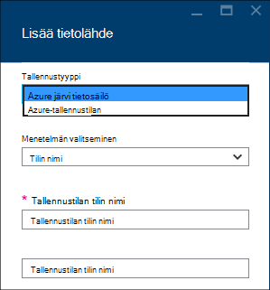
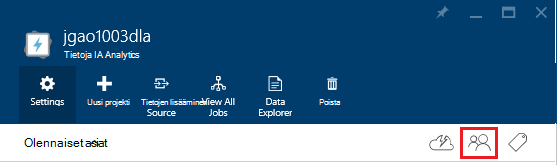
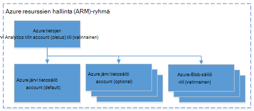

<properties 
   pageTitle="Hallitse Azure tietojen järvi Analytics Azure-portaalissa | Azure" 
   description="Opi hallitsemaan tietoja järvi Analytics kuljettamien, tietolähteitä, käyttäjät ja työt." 
   services="data-lake-analytics" 
   documentationCenter="" 
   authors="edmacauley" 
   manager="jhubbard" 
   editor="cgronlun"/>
 
<tags
   ms.service="data-lake-analytics"
   ms.devlang="na"
   ms.topic="article"
   ms.tgt_pltfrm="na"
   ms.workload="big-data" 
   ms.date="10/06/2016"
   ms.author="edmaca"/>

# Hallitse Azure tietojen järvi Analytics Azure-portaalissa

[AZURE.INCLUDE [manage-selector](../../includes/data-lake-analytics-selector-manage.md)]

Opi hallitsemaan Azure tietojen järvi Analytics-tilit, tilin tietolähteitä, käyttäjät ja töiden Azure-portaalissa. Saat hallinta aiheet muiden työkaluilla valitsemalla sivun ylälaidassa sarkainvalitsinta.

**Edellytykset**

Ennen kuin aloitat Tässä opetusohjelmassa, sinulla on oltava seuraavat kohteet:

- **Azure-tilaus**. Katso [Hae Azure maksuttoman kokeiluversion](https://azure.microsoft.com/pricing/free-trial/).

<!-- ################################ -->
<!-- ################################ -->
## Tilien hallinta

Ennen kuin suoritat tietojen järvi Analytics töitä, sinulla on oltava tietojen järvi Analytics-tili. Toisin kuin Azure Hdinsightiin maksat vain tiedot järvi Analytics-tilin kun suoritat työn.  Voit maksaa vain kerran, kun se suoritetaan työn.  Lisätietoja on artikkelissa [Azure järvi Analytics yleiskatsaus](data-lake-analytics-overview.md).  

**Tietoja järvi Analytics-tilin luominen**

1. Kirjaudu [Azure portal](https://portal.azure.com).
2. **Uusi**ja valitse **liiketoimintatietojen + analytics** **Tietojen järvi Analytics**.
3. Kirjoita tai valitse seuraavat arvot:

    

    - **Nimi**: tiedot järvi Analytics-tilin nimi.
    - **Tilaus**: Valitse Analytics-tilissä Azure tilaus.
    - **Resurssiryhmä**. Valitse Azure-resurssiryhmä tai luoda uuden. Azure Resurssienhallinta mahdollistaa sovelluksen ryhmänä resurssien käsitteleminen. Lisätietoja on artikkelissa [Azure Resurssienhallinta yleiskatsaus](resource-group-overview.md). 
    - **Sijainti**. Valitse Azure tietokeskuksen tietojen järvi Analytics-tilille. 
    - **Tietosäilö Lake**: kunkin tietojen järvi Analytics tilillä on riippuvainen järvi tietosäilö-tili. Tietoja järvi Analytics-tili ja riippuvainen järvi tietosäilö on sijaittava saman Azure tietokeskuksen. Uuden järvi tietovaraston asiakkaan noudattamalla tai valitse olemassa.

8. Valitse **Luo**. Se avaa portaalin aloitusnäytön. Uusi ruutu lisätään StartBoard näkyy "Käyttöönotto Azure tietojen järvi Analytics" otsikko. Kestää jonkin aikaa tietojen järvi Analytics-tilin luominen. Kun tili on luotu, portaalin avautuu uusi sivu-tilin.

Kun tietojen järvi Analytics-tili on luotu, voit lisätä muita järvi tietovaraston ja Azure-tallennustilan tilit. Katso ohjeet [hallinta tietojen järvi Analytics tilin tietolähteet](data-lake-analytics-manage-use-portal.md#manage-account-data-sources).

**Access ja Avaa tietojen järvi Analytics-tili**

1. Kirjaudu [Azure portal](https://portal.azure.com/).
2. Valitse **Tietojen järvi Analytics** vasemmalla olevasta valikosta.  Jos et näe sitä, valitse **Lisää palveluja**ja valitse sitten **Tiedot järvi Analytics** **Liiketoimintatieto**-ja Analytics.
3. Valitse tietojen järvi Analytics-tili, jota haluat käyttää. Ohjelma avaa tilin uusi sivu.

**Jos haluat poistaa tietoja järvi Analytics-tili**

1. Avaa tietojen järvi Analytics-tili, jonka haluat poistaa. Ohjeita on artikkelissa [Access-tietojen järvi Analytics-tilit](#access-adla-account).
2. Valitse **Poista** -painikkeen valikosta ylälaidassa sivu.
3. Kirjoita tilin nimi ja valitse sitten **Poista**.

Tietoja järvi Analytics-tilin poistaminen ei poista riippuvaiset järvi tietovaraston tilit. Katso ohjeet poistoprosessi järvi tietosäilö tilit [Poista järvi tietovaraston tili](data-lake-store-get-started-portal.md#delete-azure-data-lake-store-account).

<!-- ################################ -->
<!-- ################################ -->
## Tili-tietolähteiden hallinta

Tietoja järvi Analytics tukee tällä hetkellä seuraaviin tietolähteisiin:

- [Azure järvi tietosäilö](../data-lake-store/data-lake-store-overview.md)
- [Azure-tallennustilan](../storage/storage-introduction.md)

Kun luot tietojen järvi Analytics-tilin, sinun on määritettävä Azure järvi tietovaraston tilin olevan tallennustilan oletustilin. Tietovaraston järvi oletustilin käytetään työn metatietojen ja työn valvontalokien tallentamiseen. Sen jälkeen, kun olet luonut tietojen järvi Analytics-tili, voit lisätä järvi tietovaraston tilejä ja/tai Azure-tallennustilan tilin. 

**Voit etsiä tietoja järvi tallennustilan oletustilin**

- Avaa tietojen järvi Analytics-tili, jota haluat hallita. Ohjeita on artikkelissa [Access-tietojen järvi Analytics-tilit](#access-adla-account). Oletusarvoinen tietojen järvi kaupan näkyy **olennaiset**:

    

**Jos haluat lisätä muita tietolähteitä**

1. Avaa tietojen järvi Analytics-tili, jota haluat hallita. Ohjeita on artikkelissa [Access-tietojen järvi Analytics-tilit](#access-adla-account).
2. Valitse **asetukset** ja valitse sitten **Tietolähteet**. Näet on luettelossa järvi tietovaraston oletustilin. 
3. Valitse **Lisää tietolähde**.

    

    Azure järvi tietosäilö-tilin lisääminen tarvitset tilin nimi sekä kyselyn se voivat tilin käyttö.
    Voit lisätä Azure-Blob-säiliö, tarvitset tallennustilan tilin ja tili-näppäintä, joka löytyy tallennustilan tilin portaalissa siirtymällä.

**Tutustu tietolähteet**  

1. Avaa Analytics-tili, jota haluat hallita. Ohjeita on artikkelissa [Access-tietojen järvi Analytics-tilit](#access-adla-account).
2. Valitse **asetukset** ja valitse sitten **Hallinta**. 
 
    
    
3. Valitse järvi tietosäilö-tili, avaa tilin.

    
    
    Voit tileille järvi tietosäilö
    
    - **Uusi kansio**: Lisää uusi kansio.
    - **Lataa**: tiedostojen lataaminen tallennustilan tilin työaseman.
    - **Käyttö**: käytön määrittäminen käyttöoikeudet.
    - **Nimeä kansio uudelleen**: kansion nimeäminen uudelleen.
    - **Kansion ominaisuudet**: Näyttää tiedoston tai kansion ominaisuuksien, kuten viimeksi muokattu aika WASB polku WEBHDFS polku ja niin edelleen.
    - **Poista kansio**: Poista kansio.

**Voit ladata tiedostoja järvi tietosäilö-tilille**

1. Työkaluportaaliin ja valitse vasemmasta valikosta **Selaa** ja valitse sitten **Järvi tietosäilö**.
2. Valitse järvi tietovaraston tili, jonka haluat siirtää tietoja. Tietosäilö järvi oletustilin, katso [Tässä](#default-adl-account).
3. Valitse **Tietoresurssien** yläreunan valikosta.
4. Valitse **Uusi kansio** -Luo uusi kansio tai napsauta kansion nimeä voit muuttaa kansion.
6. Valitse yläreunan Lataa tiedosto-valikosta **Lataa** .

**Voit ladata tiedostoja Azure Blob storage-tilille**

Katso [Lataa tiedot Hadoop projekteille Hdinsightista](../hdinsight/hdinsight-upload-data.md).  Tiedot koskevat tiedot järvi Analytics.

## Käyttäjien hallinta

Tietoja järvi Analytics käyttää Roolipohjainen käyttöoikeuksien valvonta Azure Active Directory-hakemistosta. Kun luot tietojen järvi Analytics-tili, "tilauksen valvojat-roolin lisätään tili. Voit lisätä muita käyttäjiä ja suojausryhmien seuraavia rooleja:

|Rooli|Kuvaus|
|----|-----------|
|Omistaja|Voit hallita kohteiden kaikki, mukaan lukien resurssien käytön.|
|Avustaja|Portaalin; Lomaketietojen lähettäminen ja valvoa töitä. Voivat lähettää työt, osallistujan on luku- tai kirjoitusoikeudet oikeuden järvi tietovaraston tilit.|
|DataLakeAnalyticsDeveloper | Lähetä, valvoa ja Peruuta työt.  Nämä käyttäjät voi peruuttaa vain Omat työt. Hän ei voi hallita oman tilin, esimerkiksi lisätä käyttäjiä, muuttaa käyttöoikeuksia tai poistaa tilin. Voivat suorittaa töitä, he tarvitsevat luku- tai kirjoitusoikeudet järvi tietosäilö-tilit     | 
|Lukija|Avulla voit tarkastella kaikkea, mutta tee mitään muutoksia.|  
|DevTest harjoituksia käyttäjä|Voit tarkastella kaikkea ja yhteyden, Käynnistä uudelleen ja Sammuta virtual koneet.|  
|Käyttäjän Access-järjestelmänvalvoja|Voit hallita Azure resurssien käytön.|  

Lisätietoja Azure Active Directory-käyttäjät ja ryhmät luomisesta on artikkelissa [Azure Active Directory ominaisuudet](../active-directory/active-directory-whatis.md).

**Voit lisätä käyttäjät tai käyttöoikeusryhmät tietojen järvi Analytics-tiliin**

1. Avaa Analytics-tili, jota haluat hallita. Ohjeita on artikkelissa [Access-tietojen järvi Analytics-tilit](#access-adla-account).
2. Valitse **asetukset**ja valitse sitten **käyttäjät**. Voit myös napsauttaa **Access** **Essentials** otsikkorivillä seuraavista näyttökuvan esitetyllä tavalla:

    
3. Valitse **Lisää** **käyttäjä** -sivu.
4. Valitse rooli ja Lisää käyttäjä ja valitse sitten **OK**.

**Huomautus: Jos tämän käyttäjän tai käyttöoikeusryhmän haluaa lähettää työt, ne on annettava oikeudet järvi tietovaraston sekä. Lisätietoja on artikkelissa [suojatun järvi tietovaraston tallennettuja tietoja](../data-lake-store/data-lake-store-secure-data.md).**

<!-- ################################ -->
<!-- ################################ -->
## Töiden hallinta

Sinulla on oltava tietojen järvi Analytics-tili, ennen kuin suoritat U SQL töitä.  Lisätietoja on artikkelissa [hallinta tietojen järvi Analytics-tilit](#manage-data-lake-analytics-accounts).

**Luo työ**

1. Avaa Analytics-tili, jota haluat hallita. Ohjeita on artikkelissa [Access-tietojen järvi Analytics-tilit](#access-adla-account).
2. Valitse **Uusi projekti**.

    

    Uusi sivu, joka on samanlainen on artikkelissa:

    

    Kunkin projektin määrittäminen

  	|Nimi|Kuvaus|
  	|----|-----------|
  	|Työn nimi|Kirjoita projektin nimi.|
  	|Priority (prioriteetti)|Pienempi luku on suurempi prioriteetti. Jos kaksi työt ovat molemmat jonossa, sisältää pienempi prioriteetti suoritetaan ensin|
  	|Rinnakkaisuus |Laske-prosesseja, joissa voi esiintyä samanaikaisesti enimmäismäärä. Lisääntyvien määrä voi parantaa suorituskykyä, mutta voit myös lisätä kustannukset.|
  	|Komentosarja|Kirjoita U SQL-komentosarja työn.|

    Saman käyttöliittymän avulla voit myös tutkiminen linkki tietolähteitä, ja lisää muita tiedostoja linkitettyjen tietolähteiden. 
3. Valitse **Lähetä työ** , jos haluat lähettää työn.

**Voit lähettää työn**

Katso [luominen tietojen järvi Analytics työt](#create-job).

**Voit valvoa töitä**

1. Avaa Analytics-tili, jota haluat hallita. Ohjeita on artikkelissa [Access-tietojen järvi Analytics-tilit](#access-adla-account). Töiden hallinta-ruudussa näkyy basic työn tiedot:

    

3. Valitse **Töiden hallinta** edellisen näyttökuvan esitetyllä tavalla.

    

4. Valitse projekti-luetteloista. Tai valitse **suodattimen** avulla voit etsiä työt:

    

    Voit suodattaa **Aikaväli**, **Työn nimi**ja **Tekijä**työt.
5. Jos haluat lähettää työ, valitse **Lähetä uudelleen** .

**Jos haluat lähettää työn**

Katso [näytön tietojen järvi Analytics työt](#monitor-jobs).

##Näytön tilin käyttö

**Voit valvoa tilin käyttö**

1. Avaa Analytics-tili, jota haluat hallita. Ohjeita on artikkelissa [Access-tietojen järvi Analytics-tilit](#access-adla-account). Käyttö-ruudussa näkyy käyttö:

    

2. Kaksoisnapsauta tarkempia ruutu.

##Näytä U-SQL-luettelo

[U-SQL-luettelon](data-lake-analytics-use-u-sql-catalog.md) käytetään rakenteen tietoja ja -koodia, jotta ne voidaan jakaa U-SQL-komentosarjat. Luettelon mahdollistaa tietojen Azure tietojen järvi mahdollisuuksiin suurin suorituskyvyn. Azure-portaalista olet voivat tarkastella U-SQL-luettelon.

**Voit selata U-SQL-luettelo**

1. Avaa Analytics-tili, jota haluat hallita. Ohjeita on artikkelissa [Access-tietojen järvi Analytics-tilit](#access-adla-account).
2. Valitse **Tietoresurssien** yläreunan valikosta.
3. Laajentaa **luettelon**, laajenna **perusmuodon**, laajenna **taulukoita tai **tärkeät taulukkofunktiot**, tai **kokoonpanojen **. Seuraavassa näyttökuvassa näkyy yksi taulukkoarvoisia-funktio.

    

<!-- ################################ -->
<!-- ################################ -->
## Käytä Azure Resurssienhallinta-ryhmät

Sovellusten yleensä tehty useita osia, kuten verkkosovellukseen, tietokannan, tietokantapalvelimeen, tallennustilan ja kolmannen osapuolen palvelujen. Azure Resurssienhallinta mahdollistaa ryhmänä Azure-resurssiryhmä nimitystä sovelluksen resurssien käsitteleminen. Voit käyttöön, Päivitä, valvoa tai poistaa kaikkien resurssien sovelluksen yhteen, koordinoidun toiminnossa. Mallin käyttäminen käyttöönottoa varten ja mallin toimii eri ympäristöissä, kuten testaus, väliaikaisen ja tuotannon. Voit selventää Laskutus organisaation tarkastelemalla koko ryhmän kootut kustannuksiin. Lisätietoja on artikkelissa [Azure Resurssienhallinta yleiskatsaus](../azure-resource-manager/resource-group-overview.md). 

Tietoja järvi Analytics-palvelu voi sisältää seuraavat osat:

- Azure tietojen järvi Analytics-tili
- Pakollinen oletusarvon Azure järvi tietovaraston tili
- Muita Azure järvi tietovaraston tilit
- Azuren tallennustilaan tilejä

Voit luoda kaikki komponentit yhden Resurssienhallinta-ryhmässä, jotta ne on helpompi hallita.

Tietoja järvi Analytics-tili ja riippuvainen tallennustilan tilit on asetettava saman Azure tietokeskuksen.
Resurssienhallinta-ryhmässä kuitenkaan voi sijaita eri tietokeskuksen.  

##Katso myös 

- [Microsoft Azure tietojen järvi Analytics yleiskatsaus](data-lake-analytics-overview.md)
- [Aloita tietojen järvi Analytics Azure-portaalissa](data-lake-analytics-get-started-portal.md)
- [Hallitse Azure tietojen järvi Analytics Azure PowerShellin avulla](data-lake-analytics-manage-use-powershell.md)
- [Valvo ja Azure tietojen järvi Analytics työt Azure-portaalissa vianmääritys](data-lake-analytics-monitor-and-troubleshoot-jobs-tutorial.md)

