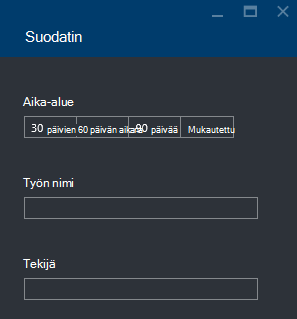

<properties 
   pageTitle="Azure tietojen järvi Analytics työt Azure-portaalissa vianmääritys | Azure" 
   description="Opettele käyttämään Azure-portaalissa vianmääritys tietojen järvi Analytics työt. " 
   services="data-lake-analytics" 
   documentationCenter="" 
   authors="edmacauley" 
   manager="jhubbard" 
   editor="cgronlun"/>
 
<tags
   ms.service="data-lake-analytics"
   ms.devlang="na"
   ms.topic="article"
   ms.tgt_pltfrm="na"
   ms.workload="big-data" 
   ms.date="05/16/2016"
   ms.author="edmaca"/>

# Azure tietojen järvi Analytics työt Azure-portaalissa vianmääritys

Opettele käyttämään Azure-portaalissa vianmääritys tietojen järvi Analytics työt.

Tässä opetusohjelmassa määritys puuttuu lähde-tiedoston ongelma ja Azure-portaalin käyttäminen vianmäärityksen.

**Edellytykset**

Ennen kuin aloitat Tässä opetusohjelmassa, sinun on oltava seuraavasti:

- **Tietoja järvi Analytics basic tuntemus projektin prosessi**. Katso [Azure tietojen järvi Analytics Azure-portaalissa käytön aloittaminen](data-lake-analytics-get-started-portal.md).
- **A tietojen järvi Analytics-tili**. Katso [Azure tietojen järvi Analytics Azure-portaalissa käytön aloittaminen](data-lake-analytics-get-started-portal.md#create-adl-analytics-account).
- **Kopioi esimerkkitiedot, järvi tietovaraston oletustilin**.  Katso [Valmistele lähdetiedot](data-lake-analytics-get-started-portal.md#prepare-source-data)

##Lähetä tiedot järvi Analytics-työ

Luo nyt U-SQL-työ virheelliset lähde nimellä.  

**Voit lähettää työ**

1. Napsauta **Microsoft Azure** Azure-portaalista vasemmassa yläkulmassa.
2. Napsauta nimesi tilin tiedot järvi Analytics-ruutua.  Se on kiinnitetty tätä, kun tili on luotu.
Jos tiliä ei ole kiinnitetty siellä, katso [Avaa Analytics-tili-portaalista](data-lake-analytics-manage-use-portal.md#access-adla-account).
3. Valitse yläreunan valikosta **Uusi projekti** .
4. Kirjoita projektin nimi ja seuraavaa U-SQL-komentosarjaa:

        @searchlog =
            EXTRACT UserId          int,
                    Start           DateTime,
                    Region          string,
                    Query           string,
                    Duration        int?,
                    Urls            string,
                    ClickedUrls     string
            FROM "/Samples/Data/SearchLog.tsv1"
            USING Extractors.Tsv();
        
        OUTPUT @searchlog   
            TO "/output/SearchLog-from-adls.csv"
        USING Outputters.Csv();

    Komentosarjan määritelty lähdetiedosto on **/Samples/Data/SearchLog.tsv1**on ilmoitettava **/Samples/Data/SearchLog.tsv**.
     
5. Valitse **Lähetä työ** yläreunassa. Uuden projektin tiedot-ruutu tulee näkyviin. Otsikkorivillä se näkyy projektin tila. Kestää muutaman minuutin kuluttua päättymään. Voit valita uusimmat tilan **päivittäminen** .
6. Odota, kunnes työn tilaksi on muutettu **epäonnistui**.  Jos projektin **onnistui**, se on, sillä et poistaa /Samples-kansio. **Valmistelevat** kohdassa opetusohjelman alussa.

Saatat miettiä - miksi kestää niin kauan pieni projektille.  Muista tietojen järvi Analytics on suunniteltu käsittelemään big datasta.  Se shines suuria määriä tietoja käyttämällä sen hajautettu järjestelmä käsiteltäessä.

Oletetaan, että oletetaan, että olet lähettänyt työn, ja sulje portaalin.  Seuraavassa osassa kerrotaan vianmääritys työn.

## Työn vianmääritys

Viimeisessä osassa olet lähettänyt työn ja työ epäonnistui.  

**Jos haluat nähdä kaikki työt**

1. Azure-portaalista Napsauta **Microsoft Azure** vasemmassa yläkulmassa.
2. Napsauta nimesi tilin tiedot järvi Analytics-ruutua.  Projektin yhteenveto näkyy **Töiden hallinta** -ruutu.

    
    
    Projektin hallinta antaa silmäyksellä työn tila. Huomaa on epäonnistunut työ.
   
3. Napsauta näet projektit **Töiden hallinta** -ruutua. Töiden luokitellaan **käynnissä**, **jonossa**ja **päättynyt**. Näet on epäonnistunut työtäsi **päättynyt** -osassa. Sen on oltava ensimmäisenä luettelossa. Kun sinulla on paljon töitä, voit valita **suodattimen** avulla voit paikantaa työt.

    

4. Valitse epäonnistunut työ Työn tiedot avaaminen uusi sivu-luettelosta:

    
    
    Huomaa, **Lähetä** -painiketta. Voit korjata ongelman, kun olet tiedot työn.

5. Valitse korostettu osan Edellinen näyttökuvan Avaa virheen yksityiskohtaiset tiedot.  Näet on esimerkiksi:

    

    Se kertoo lähde-kansiota ei löydy.
    
6. Valitse **komentosarja monista**.
7. **FROM** -polun päivittäminen seuraavankaltaiselta:

    "/ Samples/Data/SearchLog.tsv"

8. Valitse **Lähetä työn**.

##Katso myös

- [Azure tietojen järvi Analytics yleiskatsaus](data-lake-analytics-overview.md)
- [Azure PowerShellin Azure tietojen järvi Analytics käytön aloittaminen](data-lake-analytics-get-started-powershell.md)
- [Azure tietojen järvi Analytics- ja U-SQL-Visual Studiossa käytön aloittaminen](data-lake-analytics-u-sql-get-started.md)
- [Hallitse Azure tietojen järvi Analytics Azure-portaalissa](data-lake-analytics-manage-use-portal.md)

