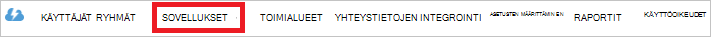

<properties
   pageTitle="Todentamismenetelmä järvi tietovaraston Active Directoryn avulla | Microsoft Azure"
   description="Lue, miten todentamismenetelmä järvi tietovaraston Active Directoryn avulla"
   services="data-lake-store"
   documentationCenter=""
   authors="nitinme"
   manager="jhubbard"
   editor="cgronlun"/>

<tags
   ms.service="data-lake-store"
   ms.devlang="na"
   ms.topic="article"
   ms.tgt_pltfrm="na"
   ms.workload="big-data"
   ms.date="10/17/2016"
   ms.author="nitinme"/>

# Palvelun palvelua todentaminen järvi tietovaraston Azure Active Directoryn avulla

> [AZURE.SELECTOR]
- [Palvelun todennus](data-lake-store-authenticate-using-active-directory.md)
- [Käyttäjän todentaminen](data-lake-store-end-user-authenticate-using-active-directory.md)

Azure järvi-tietovarasto käyttää Azure Active Directory todennusta varten. Ennen authoring sovellus, joka toimii Azure järvi tietovaraston ja Azure tietojen järvi Analytics täytyy ensin päättää, miten haluat todentaa sovelluksesi Azure Active Directory (Azure AD). Tärkeimmät käytettävissä olevat vaihtoehdot ovat:

* Käyttäjän todennusta ja 
* Palvelun todennus. 

Molemmat vaihtoehdot johtaa sovelluksesi annetut OAuth 2.0-tunnuksen, joka saa liitetty sivupyynnön Azure tietovaraston järvi tai Azure tietojen järvi Analytics tehdyt kanssa.

Tässä artikkelissa käytön käyttämisestä luominen Azure AD-verkkosovelluksen palvelun todennusta varten. Saat ohjeita Azure AD-sovelluksen määritys käyttäjän todennusta varten [Käyttäjän todentaminen järvi tietovaraston Azure Active Directoryn avulla](data-lake-store-end-user-authenticate-using-active-directory.md).

## Edellytykset

* Azure tilaus. Katso [Hae Azure maksuttoman kokeiluversion](https://azure.microsoft.com/pricing/free-trial/).
* Tilauksen käyttämällä. Voit hakea ne Azure-portaalista. Esimerkiksi on käytettävissä järvi tietovaraston tili-sivu.

    

* Azure AD-toimialuenimesi. Voit noutaa sen oikeassa yläkulmassa Azure-portaalin hiiren osoitin siirretään. Seuraavassa näyttökuvassa toimialuenimi on **contoso.microsoft.com**ja sulkeiden sisällä GUID-tunnus on vuokraajan ID-tunnuksellasi. 

    

## Palvelun todennus

Tämä on suositellaan, jos haluat, että sovelluksesi automaattisesti todentamismenetelmä Azure AD-ilman, että käyttäjä niiden tunnistetietoja varten. Sovelluksen voivat todennusta varten niin kauan kuin sen tunnistetiedot ovat oikein, joka voi mukauttaa on vuotta järjestyksessä.

### Mitä tarvitsen tätä tapaa kannattaa käyttää?

* Azure AD-toimialuenimi. Tämä näkyy jo edellytyksenä on tämän artikkelin.

* Azure AD- **web-sovelluksen**.

* Ostajantunnus Azure AD-web-sovelluksen.

* Asiakkaan salainen Azure AD-web-sovelluksen.

* Suojaustunnuksen päätepiste Azure AD-web-sovelluksen.

* Azure AD-web-sovelluksen käytön käyttöön ottaminen käyttöön järvi tietovaraston tiedosto tai kansio tai tietojen järvi Analytics-tili, jota haluat käyttää.

Lisätietoja Azure AD-web-sovelluksen luominen ja määrittäminen luettelossa vaatimukset on kohdassa [Active Directory-sovelluksen luominen](#create-an-active-directory-application) mukaisesti.

>[AZURE.NOTE] Oletusarvoisesti Azure AD-sovellus on määritetty käyttämään asiakkaan salainen, jolloin voit hakea Azure AD-sovelluksesta. Jos haluat Azure AD-sovelluksen käyttämään varmennetta, sinun on luotava Azure PowerShellin Azure AD-web-sovelluksen [Luo pääasiallista sertifikaatilla palvelu](../resource-group-authenticate-service-principal.md#create-service-principal-with-certificate)-palvelussa kuvatulla.

## Active Directory-sovelluksen luominen

Tässä osassa on tietoja siitä, miten voit luoda ja määrittää Azure AD-verkkosovelluksen palvelun todennuksessa Azure tietojen järvi kaupan Azure Active Directoryn avulla. 

### Vaihe 1: Azure Active Directory-sovelluksen luominen

>[AZURE.NOTE] Azure-portaalin käyttäminen seuraavia ohjeita. Voit myös luoda [PowerShellin Azure](../resource-group-authenticate-service-principal.md) tai [Azure CLI](../resource-group-authenticate-service-principal-cli.md)Azure AD-sovellus.

1. Kirjaudu sisään – [perinteinen portal](https://manage.windowsazure.com/)Azure-tiliisi.

2. Valitse vasemmanpuoleisessa ruudussa **Active Directorysta** .

     
     
3. Valitse Active Directory, jota haluat käyttää uuden sovelluksen luomiseen. Jos sinulla on useampi kuin yksi Active Directory-haluat yleensä sovelluksen luoda hakemiston tilauksen sijainti. Voit antaa resurssien käytön vain tilauksen samassa kansiossa sovellukset-tilaukseesi.  

     
    
    
3. Tarkastelemaan sovellukset-kansiossa, valitse **sovellukset**.

     

4. Jos et ole luonut sovelluksen kansiossa ennen pitäisi näkyä muu vastaava seuraavan kuvan. Valitse **SOVELLUKSEN lisääminen**

     

     Tai valitse **Lisää** ala-ruudussa.

     

6. Sovelluksen nimi ja valitse sitten luotavan sovelluksen tyypin. Tässä opetusohjelmassa Luo **WEB APPLICATION ja/tai verkko-Ohjelmointirajapinnan** ja napsauta Seuraava-painiketta.

     

7. Täytä sovelluksen ominaisuuksia. **KIRJAUDU edelleen URL-osoite**on sivustoon, joka kuvaa sovelluksen URI. Web-sivuston olemassaolo ei ole vahvistettu. Säätää, joka määrittää sovelluksen URI **Sovelluksen tunnus URI**.

     

    Napsauta Suorita ohjattu ja Luo sovelluksen valintamerkkiä.

### Vaihe 2: Hankkia Asiakastunnus, asiakkaan salaisuus ja suojaustunnuksen päätepiste

Kun ohjelmallisesti kirjautumisesta, tarvitset tunnuksen sovelluksen. Jos sovellus suoritetaan oma tunnistetietoja, sinun on myös todennus-näppäintä.

1. Valitse **Määritä** -välilehdessä voit määrittää sovelluksen salasana.

     

2. Kopioi **Asiakastunnus**.
  
     

3. Jos sovellus suoritetaan oma tunnistetietoja, siirry **näppäimet** -osioon ja valitse kuinka kauan haluat salasana on voimassa.

     

4. Valitse Luo key-tuotetunnuksen **Tallenna** .

    

    Tallennetun avaimen tulee näkyviin, ja voit kopioida sen. Sinulla voi hakea avain myöhemmin, joten on kopioitava se nyt.

    

5. Voit hakea suojaustunnuksen päätepiste valitsemalla näytön alareunassa **Näytä päätepisteet** ja **OAuth 2.0 suojaustunnuksen päätepisteen** kentälle arvon hakeminen alla kuvatulla tavalla.  

    

### Vaihe 3: Määritä Azure AD-sovelluksen Azure järvi tietovaraston tilin tiedoston tai kansion (vain palvelun todennusta varten)

1. Uuden [Azure Portal](https://portal.azure.com) kirjautua ja avaa Azure järvi tietovaraston tili, jonka haluat liittää aiemmin luomasi Azure Active Directory-sovelluksen kanssa.

1. Valitse **Tietoresurssien**järvi tietosäilö-tilin sivu.

    ![Luo hakemistoja järvi tietovaraston tili] (./media/data-lake-store-authenticate-using-active-directory/adl.start.data.explorer.png "Tietojen järvi tilin kansioiden luominen")

2. Valitse **Hallinta** -sivu napsauttamalla tiedostoa tai kansiota, jolle haluat antaa Azure AD-sovelluksen käyttöä ja valitse sitten **Access**. Voit määrittää access-tiedostoon, sinun on valittava **Access** - **Tiedoston esikatselu** -sivu.

    ![Määritä käyttöoikeusluettelot tietojen järvi tiedostojärjestelmässä] (./media/data-lake-store-authenticate-using-active-directory/adl.acl.1.png "Määritä käyttöoikeusluettelot tietojen järvi tiedostojärjestelmässä")

3. **Access** -sivu on lueteltu vakio access ja mukautetun access pääkansio on jo määritetty. Valitse **Lisää** -kuvaketta, jos haluat lisätä käyttöoikeusluettelot Mukautettu taso.

    ![Luettelon vakio- ja mukautettuja access] (./media/data-lake-store-authenticate-using-active-directory/adl.acl.2.png "Luettelon vakio- ja mukautettuja access")

4. Valitse **Lisää** -kuvaketta, voit avata **Lisää mukautettu Access** -sivu. Valitse tämä sivu **valitsemalla käyttäjän tai ryhmän**ja sitten **Valitse käyttäjä tai ryhmä** -sivu, näkyykö käyttöoikeusryhmän, jonka loit aiemmin Azure Active Directory. Jos sinulla on useita ryhmiä haku tehdään, käytä tekstiruudun yläosassa suodatettavan ryhmänimi. Valitse Lisää ja valitse sitten **Valitse**ryhmä.

    ![Lisää ryhmä] (./media/data-lake-store-authenticate-using-active-directory/adl.acl.3.png "Lisää ryhmä")

5. **Valitse käyttöoikeudet**, valitse käyttöoikeudet, ja kysytään, haluatko käyttöoikeuksien oletukseksi Käyttöoikeusluettelon käyttää Käyttöoikeusluettelon tai molemmat. Valitse **OK**.

    ![Käyttöoikeuksien ryhmään] (./media/data-lake-store-authenticate-using-active-directory/adl.acl.4.png "Käyttöoikeuksien ryhmään")

    Saat lisätietoja järvi tietovaraston ja oletuskäyttöoikeudet ja käyttöoikeusluettelot käyttöoikeuksia [Käytönvalvonta järvi säilössä](data-lake-store-access-control.md).

6. **Lisää mukautettu Access** -sivu valitsemalla **OK**. Lisätyn-ryhmässä ja niihin kuuluvat oikeudet näkyvät nyt **Access** -sivu.

    ![Käyttöoikeuksien ryhmään] (./media/data-lake-store-authenticate-using-active-directory/adl.acl.5.png "Käyttöoikeuksien ryhmään") 

## Seuraavat vaiheet

Tässä artikkelissa luotu Azure AD-web-sovelluksen ja kerätä tietoja, joita asiakkaan sovellusten luominen käyttämällä .NET SDK, Java SDK jne. Voit nyt jatkaa seuraavat artikkeleihin, joissa on tietoja siitä, miten ensin todentamismenetelmä järvi tietovaraston ja suorita sitten muut kaupan Azure AD-web-sovelluksen avulla.

- [Azure Lake Tietosäilölle käyttämällä .NET SDK: N käytön aloittaminen](data-lake-store-get-started-net-sdk.md)
- [Azure Lake Tietosäilölle käyttämällä Java SDK käytön aloittaminen](data-lake-store-get-started-java-sdk.md)
