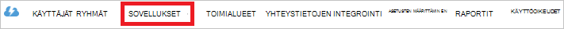

<properties
   pageTitle="Todentamismenetelmä järvi tietovaraston Active Directoryn avulla | Microsoft Azure"
   description="Lue, miten todentamismenetelmä järvi tietovaraston Active Directoryn avulla"
   services="data-lake-store"
   documentationCenter=""
   authors="nitinme"
   manager="jhubbard"
   editor="cgronlun"/>

<tags
   ms.service="data-lake-store"
   ms.devlang="na"
   ms.topic="article"
   ms.tgt_pltfrm="na"
   ms.workload="big-data"
   ms.date="10/17/2016"
   ms.author="nitinme"/>

# Käyttäjän todentaminen järvi tietovaraston Azure Active Directoryn avulla

> [AZURE.SELECTOR]
- [Palvelun todennus](data-lake-store-authenticate-using-active-directory.md)
- [Käyttäjän todentaminen](data-lake-store-end-user-authenticate-using-active-directory.md)

Azure järvi-tietovarasto käyttää Azure Active Directory todennusta varten. Ennen authoring sovellus, joka toimii Azure järvi tietovaraston ja Azure tietojen järvi Analytics täytyy ensin päättää, miten haluat todennetaan sovelluksesi Azure Active Directory (Azure AD). Tärkeimmät käytettävissä olevat vaihtoehdot ovat:

* Käyttäjän todennusta ja 
* Palvelun todennus. 

Molemmat vaihtoehdot johtaa sovelluksesi annetut OAuth 2.0-tunnuksen, joka saa liitetty sivupyynnön Azure tietovaraston järvi tai Azure tietojen järvi Analytics tehdyt kanssa.

Tässä artikkelissa käytön käyttämisestä luominen Azure AD-verkkosovelluksen käyttäjän todennusta varten. Azure AD-sovelluksen määritysten palvelun todennuksessa ohjeita artikkelissa [Azure Active Directoryn avulla järvi tietovaraston palvelun todentaminen](data-lake-store-authenticate-using-active-directory.md).

## Edellytykset

* Azure tilaus. Katso [Hae Azure maksuttoman kokeiluversion](https://azure.microsoft.com/pricing/free-trial/).
* Tilauksen käyttämällä. Voit hakea ne Azure-portaalista. Esimerkiksi on käytettävissä järvi tietovaraston tili-sivu.

    

* Azure AD-toimialuenimesi. Voit noutaa sen oikeassa yläkulmassa Azure-portaalin hiiren osoitin siirretään. Seuraavassa näyttökuvassa toimialuenimi on **contoso.microsoft.com**ja sulkeiden sisällä GUID-tunnus on vuokraajan ID-tunnuksellasi. 

    

## Käyttäjän todentaminen

Tämä on suositellaan, jos haluat, että käyttäjä kautta Azure AD-sovellukseen kirjautuneena. Sovelluksen voi käyttää Accessin samalla tasolla kuin käyttäjä, joka on kirjautunut sisään Azure resursseilla. Käyttäjälle on annettava käyttöoikeutensa tietyin väliajoin, jotta sovelluksesi access säilyttää.

Tulos on loppukäyttäjien, kirjaudu sisään on, että sovelluksesi annetaan access-tunnuksen ja Päivitä-tunnuksen. Access-tunnuksen saa liitetty sivupyynnön järvi tietosäilö tai tietojen järvi Analytics tehdyt ja se on voimassa tunnin oletusarvoisesti. Päivitä-tunnuksen avulla voidaan saada uuden käyttöoikeustietue ja se on voimassa kaksi viikkoa oletusarvoisesti, jos säännöllisesti. Voit käyttää kahdella eri tavalla loppukäyttäjien sisäänkirjautumista varten.

### Käyttämällä OAuth 2.0-ponnahdusikkuna

Sovelluksen voit käynnistää OAuth 2.0 luvan ponnahdusikkuna, jossa käyttäjä voi syöttää tunnistetietoja. Tämä ponnahdusikkuna toimii myös Azure AD kaksiosainen todentamismenetelmä (2FA)-prosessin mukaisesti tarvittaessa. 

>[AZURE.NOTE] Tämä menetelmä ei tue Python tai Java-Azure AD todennus kirjaston (ADAL) vielä.

### Suoraan kulkeva käyttäjän tunnistetietoja

Sovelluksen suoraan tarjota Azure AD käyttäjän tunnistetietoja. Tämä menetelmä toimii vain organisaation tunnus käyttäjätilit; ei ole yhteensopiva kanssa henkilökohtainen / loppuosaksi "live ID-käyttäjätilejä, mukaan lukien @outlook.com tai @live.com. Lisäksi tätä menetelmää ei ole yhteensopiva käyttäjätilit, jotka edellyttävät Azure AD kaksiosainen todentamismenetelmä (2FA).

### Mitä tarvitsen tätä tapaa kannattaa käyttää?

* Azure AD-toimialuenimi. Tämä näkyy jo edellytyksenä on tämän artikkelin.

* Azure AD- **verkkosovellus**

* Azure AD-verkkosovelluksen Ostajantunnus

* Vastaa URI Azure AD-web-sovelluksen

* Käyttöoikeuksien määrittäminen valtuutetun

Lisätietoja Azure AD-web-sovelluksen luominen ja määrittäminen luettelossa vaatimukset on kohdassa [Active Directory-sovelluksen luominen](#create-an-active-directory-application) mukaisesti. 

## Active Directory-sovelluksen luominen

Tässä osassa on lisätietoja Luo ja Määritä Azure AD-verkkosovelluksen käyttäjän todennusta varten ja Azure järvi tietovaraston Azure Active Directoryn avulla.

### Vaihe 1: Azure Active Directory-sovelluksen luominen

>[AZURE.NOTE] Azure-portaalin käyttäminen seuraavia ohjeita. Voit myös luoda [PowerShellin Azure](../resource-group-authenticate-service-principal.md) tai [Azure CLI](../resource-group-authenticate-service-principal-cli.md)Azure AD-sovellus.

1. Kirjaudu sisään – [perinteinen portal](https://manage.windowsazure.com/)Azure-tiliisi.

2. Valitse vasemmanpuoleisessa ruudussa **Active Directorysta** .

     
     
3. Valitse Active Directory, jota haluat käyttää uuden sovelluksen luomiseen. Jos sinulla on useampi kuin yksi Active Directory-haluat yleensä sovelluksen luoda hakemiston tilauksen sijainti. Voit antaa resurssien käytön vain tilauksen samassa kansiossa sovellukset-tilaukseesi.  

     
    
    
3. Tarkastelemaan sovellukset-kansiossa, valitse **sovellukset**.

     

4. Jos et ole luonut sovelluksen kansiossa ennen pitäisi näkyä muu vastaava seuraavan kuvan. Valitse **SOVELLUKSEN lisääminen**

     

     Tai valitse **Lisää** ala-ruudussa.

     

6. Sovelluksen nimi ja valitse sitten luotavan sovelluksen tyypin. Tässä opetusohjelmassa Luo **WEB APPLICATION ja/tai verkko-Ohjelmointirajapinnan** ja napsauta Seuraava-painiketta.

     

7. Täytä sovelluksen ominaisuuksia. **KIRJAUDU edelleen URL-osoite**on sivustoon, joka kuvaa sovelluksen URI. Web-sivuston olemassaolo ei ole vahvistettu. Säätää, joka määrittää sovelluksen URI **Sovelluksen tunnus URI**.

     

    Napsauta Suorita ohjattu ja Luo sovelluksen valintamerkkiä.

### Vaihe 2: Hae Asiakastunnus, vastaa URI ja valtuutetun käyttöoikeuksien määrittäminen

1. Valitse **Määritä** -välilehdessä voit määrittää sovelluksen salasana.

     

2. Kopioi **Asiakastunnus**.
  
     

3. **Kertakirjautumisen** -osassa kopioi **Vastaa URI**.

    

4. **Muiden sovellusten käyttöoikeudet**-kohdasta **Lisää sovellus**

    

5. Ohjatun **muiden sovellusten käyttöoikeudet** Valitse **Azure tietojen järvi** ja **Windows** **Azure Service Management API**ja valitse valintamerkki.

6. Oletusarvoisesti lisätyn services **Valtuutetun käyttöoikeudet** on määritetty nolla. **Valtuutetun käyttöoikeudet** avattavasta Azure tietojen järvi ja Windows Azure hallintapalvelun ja valitse valintaruudut käytettävissä vain, jos arvot arvoksi 1. Tulos pitäisi näyttää tältä.

     

7. Valitse **Tallenna**.

## Seuraavat vaiheet

Tässä artikkelissa luotu Azure AD-web-sovelluksen ja kerätä tietoja, joita asiakkaan sovellusten luominen käyttämällä .NET SDK, Java SDK jne. Voit nyt jatkaa seuraavat artikkeleihin, joissa on tietoja siitä, miten ensin todentamismenetelmä järvi tietovaraston ja suorita sitten muut kaupan Azure AD-web-sovelluksen avulla.

- [Azure Lake Tietosäilölle käyttämällä .NET SDK: N käytön aloittaminen](data-lake-store-get-started-net-sdk.md)
- [Azure Lake Tietosäilölle käyttämällä Java SDK käytön aloittaminen](data-lake-store-get-started-java-sdk.md)
