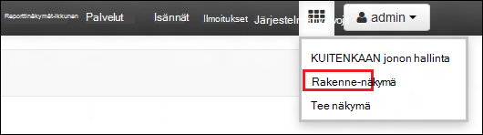
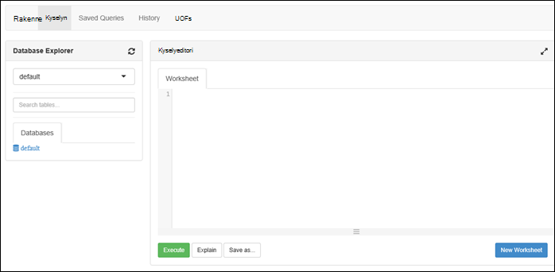

<properties
   pageTitle="Luo HDInsight klustereiden Azure Lake Tietosäilölle portaalissa | Azure"
   description="Luominen ja käyttäminen HDInsight klustereiden Azure tietojen järvi kaupan Azure-portaalin käyttäminen"
   services="data-lake-store,hdinsight" 
   documentationCenter=""
   authors="nitinme"
   manager="jhubbard"
   editor="cgronlun"/>

<tags
   ms.service="data-lake-store"
   ms.devlang="na"
   ms.topic="article"
   ms.tgt_pltfrm="na"
   ms.workload="big-data"
   ms.date="10/21/2016"
   ms.author="nitinme"/>

# Luo HDInsight-klusterin järvi tietovaraston Azure-portaalissa

> [AZURE.SELECTOR]
- [Portaalissa](data-lake-store-hdinsight-hadoop-use-portal.md)
- [PowerShellin avulla](data-lake-store-hdinsight-hadoop-use-powershell.md)
- [Resurssien hallinnan avulla](data-lake-store-hdinsight-hadoop-use-resource-manager-template.md)

Opettele Azure-portaalin avulla voit luoda HDInsight-klusterin (Hadoop, HBase, ohjattu tai myrsky) Azure Lake Tietosäilölle käyttöönsä. Tässä versiossa joitakin tärkeitä asioita:

* **Saat ohjattu varausyksiköt (Linux) ja Hadoop varausyksiköt (Windows ja Linux)**, järvi tietovaraston vain voidaan lisätallennustilaa-tilinä. Näiden klustereiden tallennustilan oletustili on Azure tallennustilan BLOB-objektit (WASB).

* **Saat myrsky varausyksiköt (Windows ja Linux)**, järvi tietovaraston voidaan kirjoittaa tietoja myrsky topologian. Tietosäilö järvi voidaan käyttää myös tallentamiseen viitata tietoihin, jotka voivat lukea myrsky topologian. Lisätietoja on artikkelissa [Käyttäminen tietojen järvi säilössä myrsky topologian](#use-data-lake-store-in-a-storm-topology).

* **Saat HBase varausyksiköt (Windows ja Linux)**, järvi tietovaraston voidaan käyttää oletusarvoinen tallennustilan sekä lisätallennustilaa. Lisätietoja on artikkelissa [Käyttäminen tietojen järvi Storeen HBase klustereiden](#use-data-lake-store-with-hbase-clusters).

> [AZURE.NOTE] Joitakin tärkeitä seikkoja huomautuksen. 
> 
> * Voit luoda HDInsight klustereiden Lake Tietosäilölle käyttöönsä on käytettävissä vain HDInsight-versioiden 3.2 ja 3.4 (for Hadoop, HBase ja myrsky klustereiden Windows sekä Linux). Ohjattu klustereiden Linux-asetus on käytettävissä vain HDInsight 3.4 klustereiden käyttöön.
>
> * Edellä mainittua järvi tietosäilö on käytettävissä oletusarvon tallennustila klusterin Jotkin tiedostotyypit (HBase) ja lisää tallennustilaa klusterin muuntyyppisten (Hadoop, ohjattu myrsky). Käyttämällä järvi tietovaraston lisätallennustilaa tiliksi ei vaikuta suorituskykyyn tai luku ja kirjoita tallennustilan klusterista mahdollisuus. Tilanteessa, jossa järvi tietovaraston käytetään tallennustilaa klusterin liittyvät tiedostot (kuten lokit, jne.) on kirjoitettu oletusarvon storage (Azure-BLOB), kun järvi tietovaraston tili voidaan tallentaa tiedot, joita haluat käsitellä.

## Edellytykset

Ennen kuin aloitat Tässä opetusohjelmassa, sinun on oltava seuraavasti:

- **Azure-tilaus**. Katso [Hae Azure maksuttoman kokeiluversion](https://azure.microsoft.com/pricing/free-trial/).

- **Azure järvi tietovaraston tili**. Ohjeiden etsiminen [Azure Lake Tietosäilölle Azure-portaalissa käytön aloittaminen](data-lake-store-get-started-portal.md). 

- **Lataa mallitietoja Azure järvi tietosäilö-tiliisi**. Kun olet luonut tilin, suorita seuraavat toimet voit ladata mallitietoja. Tarvitset näitä tietoja myöhemmin-opetusohjelman suorittamaan töitä HDInsight-klusterin, jotka käyttävät järvi tietovaraston tietoja.

    * [Luo kansion järvi tietosäilö](data-lake-store-get-started-portal.md#createfolder).
    * [Lataa järvi tietovaraston tiedoston](data-lake-store-get-started-portal.md#uploaddata). Jos etsit joitakin mallitietoja lataaminen, saat **Ambulanssi Data** -kansion [Azure tietojen Lake Git säilöön](https://github.com/Azure/usql/tree/master/Examples/Samples/Data/AmbulanceData).

- **Azure Active Directory-palvelun lyhennys**. Tämän opetusohjelman vaiheita on ohjeet luomisesta Azure AD-palvelun lyhennyksen. On kuitenkin olla Azure AD-järjestelmänvalvoja voi luoda palvelun lyhennyksen. Jos olet Azure AD-järjestelmänvalvoja, voit ohittaa tämän edellytyksenä ja jatka opetusohjelman.
    
    **Jos et ole Azure AD-järjestelmänvalvoja**, osaat ei tarvitse luoda palvelun lyhennys toimien. Siinä tapauksessa Azure AD-järjestelmänvalvojan on luotava palvelun lyhennys ennen kuin voit luoda HDInsight-klusterin järvi tietosäilö. Lisäksi palvelun lyhennys on luotava sertifikaatilla, kuvatulla tavalla, [Luo pääasiallista sertifikaatilla palvelu](../resource-group-authenticate-service-principal.md#create-service-principal-with-certificate).

## Opit nopeasti videoiden?

Katso seuraavilta videoilta osaavat HDInsight klustereiden järvi tietovaraston käytön valmistelu.

* [Luo HDInsight-klusterin Lake Tietosäilölle käyttöönsä](https://mix.office.com/watch/l93xri2yhtp2)
* Kun klusterin on määritetty, [Access-tietojen järvi tietovaraston rakenne ja Possu komentosarjojen avulla](https://mix.office.com/watch/1n9g5w0fiqv1q)

## Azure Lake Tietosäilölle käyttöönsä HDInsight-klusterin luominen

Tässä osassa voit luoda HDInsight Hadoop-klusterin, joka käyttää järvi tietovaraston Lisää tallennustilaa. Tässä versiossa Hadoop-klusterin järvi tietovaraston voi käyttää vain Lisää tallennustilaa klusterin. Oletus-tallennustila on tallennustilan Azure-BLOB-objektit (WASB). On ensin Luo tallennustilan tilin ja tallennustilan säiliöiden klusterin vaaditaan.

1. Kirjaudu uudessa [Azure-portaalissa](https://portal.azure.com).

2. Aloita valmistelu HDInsight-klusterin [luominen Hadoop varausyksiköt HDInsight](../hdinsight/hdinsight-provision-clusters.md#create-using-the-preview-portal) noudattamalla.

3. Valitse **Tietolähteen** **Vaihtoehtoinen määritys** -sivu. **Tietolähde** -sivu-tallennustilan tilin ja tallennustilan säiliön tietoja Määritä Määritä **sijainti** kuin **Yhdysvaltojen Itä 2**ja valitse sitten **Klusterin AAD tunnistetiedot**.

    ![Lisää palvelu pääasiallisen HDInsight-klusteriin] (./media/data-lake-store-hdinsight-hadoop-use-portal/hdi.adl.1.png "Lisää palvelu pääasiallisen HDInsight-klusteriin")

4. **Klusterin AAD Identity** -sivu, voit valita olemassa olevan Service-lyhennys tai luoda uuden.

    * **Luo uusi palvelu lyhennyksen.**

        * Valitse **Klusterin AAD Identity** -sivu valitsemalla **Luo uusi**, **Palvelun lyhennys**ja anna arvoja, voit luoda uuden palvelun lyhennys **luominen palvelun lyhennys** -sivu. Osana, sertifikaatin ja Azure Active Directory-sovelluksen luodaan. Valitse **Luo**.

            ![Lisää palvelu pääasiallisen HDInsight-klusteriin] (./media/data-lake-store-hdinsight-hadoop-use-portal/hdi.adl.2.png "Lisää palvelu pääasiallisen HDInsight-klusteriin")

        * Valitse **Hallitse ADLS Access** **Klusterin AAD Identity** -sivu. Ruudussa näkyy tilaukseen liittyvää järvi tietovaraston tilit. Voit kuitenkin määrittää käyttöoikeuksia vain luomasi tilin. Valitse luku ja kirjoita/EXECUTE-käyttöoikeudet, tilin käyttäminen HDInsight-klusterin ja valitse sitten **Tallenna käyttöoikeudet**.

            ![Lisää palvelu pääasiallisen HDInsight-klusteriin] (./media/data-lake-store-hdinsight-hadoop-use-portal/hdi.adl.3.png "Lisää palvelu pääasiallisen HDInsight-klusteriin")

        * Valitse **Lataa varmenteen** Lataa pääasiallista luomasi-palveluun liitetyn **Klusterin AAD Identity** -sivu. Tämä on kätevä, jos haluat käyttää samaa palvelun lyhennys myöhemmin, Lisää HDInsight klustereiden luomisen aikana. Valitse **Valitse**.

            ![Lisää palvelu pääasiallisen HDInsight-klusteriin] (./media/data-lake-store-hdinsight-hadoop-use-portal/hdi.adl.4.png "Lisää palvelu pääasiallisen HDInsight-klusteriin")

    * **Valitse aiemmin luodun palvelun lyhennyksen.**

        * Valitse **Klusterin AAD Identity** -sivu valitsemalla **Käytä aiemmin**, **Palvelun lyhennys**ja valitse **Valitse palvelu-lyhennys** , sivu etsiä aiemmin service-lyhennyksen. Palvelun pääasiallista nimi ja valitse sitten **Valitse**.

            ![Lisää palvelu pääasiallisen HDInsight-klusteriin] (./media/data-lake-store-hdinsight-hadoop-use-portal/hdi.adl.5.png "Lisää palvelu pääasiallisen HDInsight-klusteriin")

        * **Klusterin AAD Identity** -sivu valitsemalla Lataa varmenne (.pfx) valitun palvelun lyhennys ja anna sertifikaatin salasana.

5. Valitse **Hallitse ADLS käyttö** ja valitse sitten **tiedoston käyttöoikeudet**. 

    ![Lisää palvelu pääasiallisen HDInsight-klusteriin] (./media/data-lake-store-hdinsight-hadoop-use-portal/hdi.adl.5.existing.save.png "Lisää palvelu pääasiallisen HDInsight-klusteriin")

6. Valitse **tiedoston käyttöoikeudet** -sivu- **tilin** avattavasta luettelosta, järvi tietosäilö-tili, jonka haluat liittyvän HDInsight-klusterin. Sivu näyttää tiedostot ja kansiot, jotka ovat käytettävissä järvi tietovaraston valittu tili. 
 
    ![Provide pääsy järvi tietosäilö] (./media/data-lake-store-hdinsight-hadoop-use-portal/hdi-adl-permission-1.png "Provide pääsy järvi tietosäilö")

    Tämän jälkeen toimitettavat käyttöoikeudet määritetään valitut tiedostot ja kansiot. Kansiot Määritä myös, onko käyttöoikeudet koskevat kansioon vain tai kansio ja kaikki kansion alatason kohteet. Voit tehdä tämän valinnan valitsemalla sopiva arvo **Käytä** avattavan luettelon. Jos haluat poistaa käyttöoikeuden, valitse **Poista** -kuvake

    ![Provide pääsy järvi tietosäilö] (./media/data-lake-store-hdinsight-hadoop-use-portal/hdi-adl-permission-2.png "Provide pääsy järvi tietosäilö")

    Toista nämä vaiheet liittyvien tiedostojen ja kansioiden muista järvi tietosäilö-tileistä. Kun olet suorittanut oikeuksien määrittäminen, valitse sivu alareunassa **Valitse** .

7. **Määritä valitut käyttöoikeudet** -sivu-, jonka ilmoitit käyttöoikeuksia ja valitse sitten **Suorita** Myönnä käyttöoikeudet.

    ![Provide pääsy järvi tietosäilö] (./media/data-lake-store-hdinsight-hadoop-use-portal/hdi-adl-permission-3.png "Provide pääsy järvi tietosäilö")

    Tilasarake näyttää edistymisen. Kun kaikki osoitetaan onnistuneesti, valitse **Valmis**. 

6. **Valitse** Valitse **Klusterin AAD käyttäjätieto** - ja **Tietolähteen** näiden ja jatka sitten klusterin luonnin [luominen Hadoop varausyksiköt HDInsight](../hdinsight/hdinsight-hadoop-create-linux-clusters-portal.md)-palvelussa kuvatulla.

7. Kun klusterin on valmisteltu, voit varmistaa, että palvelun lyhennys liittyy HDInsight-klusterin. Klusterin-sivu-kiellä valitsemalla Nähdäksesi liittyvän palvelun lyhennys **Klusterin AAD tunnistetiedot** .

    ![Lisää palvelu pääasiallisen HDInsight-klusteriin] (./media/data-lake-store-hdinsight-hadoop-use-portal/hdi.adl.6.png "Lisää palvelu pääasiallisen HDInsight-klusteriin")

## Suorita testi työt HDInsight-klusterin käyttämään järvi Azure tietosäilö

Kun olet määrittänyt HDInsight-klusterin, voit suorittaa testin työt klusterin Testaa, että HDInsight-klusterin voi käyttää tietoja Azure järvi tietosäilö. Voit tehdä on suorittaa jotkin rakenne-kyselyt, joiden kohteena järvi tietovaraston.

### Linux-klusterin

1. Avaa klusterin, vain valmisteltu klusterin-sivu ja valitse sitten **raporttinäkymät-ikkunan**. Tämä avaa Ambari Linux-klusterin. Ambari käytettäessä voit pyydetään tarkistamiseen sivustoon. Järjestelmänvalvoja (oletus järjestelmänvalvoja), kirjoita tilin nimi ja salasanalla, joita käytit luodessasi klusterin.

    ![Käynnistä klusterin Raporttinäkymät-ikkunan] (./media/data-lake-store-hdinsight-hadoop-use-portal/hdiadlcluster1.png "Käynnistä klusterin Raporttinäkymät-ikkunan")

    Voit myös siirtyä suoraan Ambari siirtymällä https://CLUSTERNAME.azurehdinsight.net selaimessa (jossa **CLUSTERNAME** on HDInsight-klusterin nimen).

2. Avaa rakenne. Valitse neliöt joukko sivun vieressä olevasta valikosta ( **järjestelmänvalvojan** linkki ja painiketta sivun oikeassa reunassa) käytettävissä olevat näkymät. Valitse **rakenne** -näkymä.

    

3. Näyttöön tulee sivu, joka on seuraavankaltaiselta:

    

4. Liitä seuraava HiveQL-lause laskentataulukkoon sivun **Kyselyeditori** -osassa:

        CREATE EXTERNAL TABLE vehicles (str string) LOCATION 'adl://mydatalakestore.azuredatalakestore.net:443/mynewfolder'

5. Napsauta **Kyselyeditori** , jos haluat aloittaa kyselyn alareunassa **Suorita** -painiketta. **Prosessin kyselytulokset** osan olisi näkyvät alapuolella **Kyselyeditori** ja tuoda tietoja työstä.

6. Kun kysely on valmis, **Prosessi kyselytulokset** -kohta näkyy toiminnon tulokset. **Tulokset** -välilehden pitäisi olla seuraavat tiedot:

7. Suorittaa seuraavan kyselyn, varmista, että taulukossa on luotu.

        SHOW TABLES;

    **Tulokset** -välilehden pitäisi näkyä seuraavat:

        hivesampletable
        vehicles

    **ajoneuvot** on aiemmin luomasi taulukko. **hivesampletable** on käytettävissä kaikissa HDInsight klustereissa oletusarvoisesti mallitaulukko.

8. Voit suorittaa kyselyn **ajoneuvot** -taulukon tietojen hakemiseen.

        SELECT * FROM vehicles LIMIT 5;

### Windows-klusterin

1. Avaa klusterin, vain valmisteltu klusterin-sivu ja valitse sitten **raporttinäkymät-ikkunan**.

    ![Käynnistä klusterin Raporttinäkymät-ikkunan] (./media/data-lake-store-hdinsight-hadoop-use-portal/hdiadlcluster1.png "Käynnistä klusterin Raporttinäkymät-ikkunan")

    Kirjoita pyydettäessä klusterin järjestelmänvalvojan tunnistetietoja.

2. Microsoft Azure Hdinsightiin kyselyn Console avautuu. Valitse **rakenne-editorin**.

    ![Avaa rakenne-editori] (./media/data-lake-store-hdinsight-hadoop-use-portal/hdiadlcluster2.png "Avaa rakenne-editori")

3. Rakenne-editorissa Kirjoita seuraava kysely ja valitse sitten **Lähetä**.

        CREATE EXTERNAL TABLE vehicles (str string) LOCATION 'adl://mydatalakestore.azuredatalakestore.net:443/mynewfolder'

    Rakenteen tässä kyselyssä on luoda taulukon käyttämällä järvi tietovaraston tallennettuja tietoja `adl://mydatalakestore.azuredatalakestore.net:443/mynewfolder`. Tämä sijainti on mallitiedosto, joka olisi olet ladannut aiemmassa versiossa.

    Alaosassa **Työn istunnon** -taulukossa on **käynnissä**, **Valmis** **alustaminen onnistuu**vaihdetaan työn tilan. Voit myös napsauttaa **Tarkasteleminen** valmiin työn enemmän tietoja.

    ![Luo taulukko] (./media/data-lake-store-hdinsight-hadoop-use-portal/hdiadlcluster3.png "Luo taulukko")

4. Suorittaa seuraavan kyselyn, varmista, että taulukossa on luotu.

        SHOW TABLES;

    Valitse **Näytä tiedot** vastaavat tämä kysely ja tulos näytetään seuraavasti:

        hivesampletable
        vehicles

    **ajoneuvot** on aiemmin luomasi taulukko. **hivesampletable** on käytettävissä kaikissa HDInsight klustereissa oletusarvoisesti mallitaulukko.

5. Voit suorittaa kyselyn **ajoneuvot** -taulukon tietojen hakemiseen.

        SELECT * FROM vehicles LIMIT 5;

## Accessin Lake Tietosäilölle HDFS-komentojen käyttäminen

Kun olet määrittänyt käyttämään järvi tietovaraston HDInsight-klusterin, voit HDFS shell-komennot käyttämään kauppa.

### Linux-klusterin

Tässä osassa sinun tulee SSH klusterin kyselyjä ja suorita HDFS-komennot. Windows ei tarjoa valmiin SSH asiakas. On suositeltavaa käyttää **painovärit, muste**, joka voi ladata [http://www.chiark.greenend.org.uk/~sgtatham/putty/download.html](http://www.chiark.greenend.org.uk/~sgtatham/putty/download.html).

Lisätietoja painovärit, muste on artikkelissa [Käyttäminen SSH kanssa Linux-pohjaiset Hadoop-HDInsight Windows](../hdinsight/hdinsight-hadoop-linux-use-ssh-windows.md).

Kun yhteys on muodostettu, järvi tietovaraston tiedostojen HDFS tiedostojärjestelmän-komennon avulla.

    hdfs dfs -ls adl://<Data Lake Store account name>.azuredatalakestore.net:443/

Tiedosto, jonka voit ladata aiemmin järvi tietovaraston näyttöön tulevat.

    15/09/17 21:41:15 INFO web.CaboWebHdfsFileSystem: Replacing original urlConnectionFactory with org.apache.hadoop.hdfs.web.URLConnectionFactory@21a728d6
    Found 1 items
    -rwxrwxrwx   0 NotSupportYet NotSupportYet     671388 2015-09-16 22:16 adl://mydatalakestore.azuredatalakestore.net:443/mynewfolder

Voit käyttää myös `hdfs dfs -put` joidenkin tiedostojen lataaminen järvi tietovaraston ja käytä sitten komento `hdfs dfs -ls` voit tarkistaa, onko tiedostojen lataaminen onnistui.

### Windows-klusterin

1. Kirjaudu uudessa [Azure-portaalissa](https://portal.azure.com).

2. Valitsemalla **Selaa**ja valitse **HDInsight klustereiden**, jonka loit HDInsight-klusterin.

3. Klusterin-sivu- **Etätyöpöytä**ja valitse sitten **Yhdistä** **Etätyöpöytä** -sivu.

    ![Remote HDI klusterin tuominen] (./media/data-lake-store-hdinsight-hadoop-use-portal/ADL.HDI.PS.Remote.Desktop.png "Azure resurssi-ryhmän luominen")

    Kirjoita pyydettäessä antamasi remote työpöydän käyttäjän tunnistetiedot.

4. Käynnistä Windows PowerShell Etäistunto ja HDFS tiedostojärjestelmän komentojen avulla voit näyttää järvi Azure tietovaraston tiedostot.

        hdfs dfs -ls adl://<Data Lake Store account name>.azuredatalakestore.net:443/

    Tiedosto, jonka voit ladata aiemmin järvi tietovaraston näyttöön tulevat.

        15/09/17 21:41:15 INFO web.CaboWebHdfsFileSystem: Replacing original urlConnectionFactory with org.apache.hadoop.hdfs.web.URLConnectionFactory@21a728d6
        Found 1 items
        -rwxrwxrwx   0 NotSupportYet NotSupportYet     671388 2015-09-16 22:16 adl://mydatalakestore.azuredatalakestore.net:443/mynewfolder

    Voit käyttää myös `hdfs dfs -put` joidenkin tiedostojen lataaminen järvi tietovaraston ja käytä sitten komento `hdfs dfs -ls` voit tarkistaa, onko tiedostojen lataaminen onnistui.

## Käytä tietojen järvi Storeen Ohjattu klusterin

Tässä osassa käyttämällä Jupyter muistikirjan käytettävissä HDInsight ohjattu klustereiden, joka lukee tietoja järvi tietosäilö-tililtä, ohjattu HDInsight-klusterin, sen sijaan, että Azure Blob-objektien tallennustilaan oletustilin liittyvän työn suorittamiseen.

1. Kopioi tallennustilan oletustilin (WASB) Ohjattu klusterin klusterin liittyvät Azure tietojen järvi kaupan tiliin liittyvät mallitietoja päälle. [ADLCopy-työkalun](http://aka.ms/downloadadlcopy) avulla voit tehdä. Lataa ja asenna työkalu linkkiä.

2. Avaa komentokehote ja siirry kansioon, johon AdlCopy on asennettu, yleensä `%HOMEPATH%\Documents\adlcopy`.

3. Suorita seuraava komento tietyn Blob-objektien kopioiminen järvi tietovaraston tietolähteen säilö:

        AdlCopy /source https://<source_account>.blob.core.windows.net/<source_container>/<blob name> /dest swebhdfs://<dest_adls_account>.azuredatalakestore.net/<dest_folder>/ /sourcekey <storage_account_key_for_storage_container>

    Tässä opetusohjelmassa kopioida **HVAC.csv** mallitiedosto osoitteessa **/HdiSamples/HdiSamples/SensorSampleData/LVI/** Azure järvi tietosäilö-tilille. Koodikatkelman pitäisi näyttää samalta kuin:

        AdlCopy /Source https://mydatastore.blob.core.windows.net/mysparkcluster/HdiSamples/HdiSamples/SensorSampleData/hvac/HVAC.csv /dest swebhdfs://mydatalakestore.azuredatalakestore.net/hvac/ /sourcekey uJUfvD6cEvhfLoBae2yyQf8t9/BpbWZ4XoYj4kAS5Jf40pZaMNf0q6a8yqTxktwVgRED4vPHeh/50iS9atS5LQ==

    >[AZURE.WARNING] Varmista, että tiedoston ja polku-nimet ovat erisnimen kirjoitusmuotoon.

4. Voit pyydetään kirjoittamaan tunnistetiedot vallitessa käytössä järvi tietovaraston tilisi Azure-tilaus. Seuraavankaltaiselta tulos tulee näkyviin:

        Initializing Copy.
        Copy Started.
        100% data copied.
        Copy Completed. 1 file copied.

    Datatiedostoa (**HVAC.csv**) kopioidaan kansioon **/hvac** Lake tietovaraston tili-kohdassa.

4. [Azure-portaaliin](https://portal.azure.com/)ja valitse startboard Napsauta Ohjattu klusterin ruutua (jos se kiinnitettyinä startboard). Voit myös siirtyä yhteyttä klusterin-kohdassa **Selaa kaikki** > **HDInsight klustereiden**.   

2. Ohjattu klusterin-sivu valitsemalla **Pikalinkit**, ja valitse sitten **Jupyter muistikirjan**- **Klusterin Dashboard** -sivu. Kirjoita pyydettäessä klusterin järjestelmänvalvojan tunnistetietoja.

    > [AZURE.NOTE] Voi myös saavuttaa Jupyter muistikirjan yhteyttä klusterin avaamalla seuraava URL-osoite selaimen. Korvaa __CLUSTERNAME__ yhteyttä klusterin nimen:
    >
    > `https://CLUSTERNAME.azurehdinsight.net/jupyter`

2. Luo uusi muistikirja. Valitse **Uusi**ja valitse sitten **PySpark**.

    ![Luo uusi muistikirja Jupyter] (./media/data-lake-store-hdinsight-hadoop-use-portal/hdispark.note.jupyter.createnotebook.png "Luo uusi muistikirja Jupyter")

3. Uusi muistikirja luodaan ja avataan nimellä **Untitled.pynb**. 

4. Koska olet luonut muistikirjan PySpark ydin, sinun ei tarvitse luoda minkä tahansa kontekstit erikseen. Ohjattu ja rakenne-kontekstit luodaan automaattisesti, kun suoritat koodin ensimmäiseen soluun. Voit aloittaa tuomalla, joita tarvitaan Tämä skenaario. Voit tehdä seuraavat koodikatkelman Liitä solun ja painamalla **VAIHTO + ENTER**.

        from pyspark.sql.types import *
        
    Aina, kun suoritat työn Jupyter, sitten web selaimen ikkunan otsikko näkyy **(varattu)** -tila sekä muistion otsikko. Näet myös yhtenäinen ympyrä oikeassa yläkulmassa **PySpark** tekstin viereen. Kun työ on valmis, tämä muuttaa tyhjä ympyrä.

     ![Jupyter muistikirjan työn tila] (./media/data-lake-store-hdinsight-hadoop-use-portal/hdispark.jupyter.job.status.png "Jupyter muistikirjan työn tila")

4. Lataa mallitiedot tilapäinen taulukkoa, jossa on kopioitu järvi tietovaraston tilille **HVAC.csv** -tiedosto. Voit käyttää tietojen järvi tietovaraston tili käyttämällä seuraavaa kaavaa URL-osoite.

        adl://<data_lake_store_name>.azuredatalakestore.net/<path_to_file>

    Liitä Seuraava koodiesimerkki tyhjään soluun, korvaa **MYDATALAKESTORE** Lake tietovaraston tilin nimen ja painamalla **VAIHTO + ENTER**. Koodin tässä esimerkissä Rekisteröi tiedot **LVI**tilapäinen taulukkoon.

        # Load the data
        hvacText = sc.textFile("adl://MYDATALAKESTORE.azuredatalakestore.net/hvac/HVAC.csv")
        
        # Create the schema
        hvacSchema = StructType([StructField("date", StringType(), False),StructField("time", StringType(), False),StructField("targettemp", IntegerType(), False),StructField("actualtemp", IntegerType(), False),StructField("buildingID", StringType(), False)])
        
        # Parse the data in hvacText
        hvac = hvacText.map(lambda s: s.split(",")).filter(lambda s: s[0] != "Date").map(lambda s:(str(s[0]), str(s[1]), int(s[2]), int(s[3]), str(s[6]) ))
        
        # Create a data frame
        hvacdf = sqlContext.createDataFrame(hvac,hvacSchema)
        
        # Register the data fram as a table to run queries against
        hvacdf.registerTempTable("hvac")

5. Kun käytät PySpark ydin, voit nyt suoraan suorittaa SQL-kyselyn väliaikaisen taulukossa **LVI** juuri luomasi avulla `%%sql` tärkeä. Jos haluat lisätietoja `%%sql` tärkeä sekä muita käytettävissä PySpark, ydin magics Katso [ytimet Jupyter muistikirjojen ohjattu HDInsight klustereiden käytettävissä](hdinsight-apache-spark-jupyter-notebook-kernels.md#why-should-i-use-the-new-kernels).
        
        %%sql
        SELECT buildingID, (targettemp - actualtemp) AS temp_diff, date FROM hvac WHERE date = \"6/1/13\"

5. Kun työ on suoritettu onnistuneesti, seuraava taulukkomuotoinen tulos näkyy oletusarvoisesti.

    ![Taulukon tulosteen kyselyn tulos] (./media/data-lake-store-hdinsight-hadoop-use-portal/tabular.output.png "Taulukon tulosteen kyselyn tulos")

    Voit myös tarkastella muiden visualisointien tuloksia. Esimerkiksi alue-kaaviota, saat saman tuloksen näyttäisi samanlaiselta kuin seuraavassa.

    ![Kyselyn tulos kaavion pinta] (./media/data-lake-store-hdinsight-hadoop-use-portal/area.output.png "Kyselyn tulos kaavion pinta")

6. Kun olet sovelluksen käytössä, kannattaa Sammuta muistikirjan vapauttamista resurssit. Muistikirjan **Tiedosto** -valikon kiellä valitsemalla **Sulje ja Pysäytä**. Tämä on sulkeminen ja Sulje muistikirja.

## Käytä tietojen järvi säilössä myrsky topologian

Voit kirjoittaa tiedot myrsky topologian järvi tietovaraston. Katso ohjeet artikkelista saavuttamiseksi, [Käytä Azure tietojen järvi kaupan Apache myrsky HDInsight kanssa](../hdinsight/hdinsight-storm-write-data-lake-store.md).

## Käytä tietojen järvi Storeen HBase klustereiden

HBase klustereiden, jossa voit käyttää järvi tietosäilö oletusarvoinen tallennustilan sekä lisätallennustilaa. Toimi seuraavasti:

1.  Valitse **Tietolähde** -sivu **HBase tietojen sijainti** **Järvi tietosäilö** .
2.  Valitse järvi tietovarasto, jota haluat käyttää nimeä tai luoda uuden.
3.  Määritä lopuksi **HBase pääkansio** järvi tietovaraston. Jos järvi tietosäilö-tilillä ei ole pääkansion, Luo uusi tunnus.

    ![Tietoja järvi kaupan HBase] (./media/data-lake-store-hdinsight-hadoop-use-portal/hbase-data-lake-store.png "Azure resurssi-ryhmän luominen")

### Huomioon otettavia seikkoja käytettäessä oletusarvon tallennustilan järvi tietovaraston HBase klustereiden varten

* Voit käyttää järvi tietovaraston saman tilin useita HBase-klusterin. **HBase pääkansio** , jonka olet klusterin (vaihe 4, valitse näyttökuvan yllä) on oltava yksilöllinen. **Eivät saa** käytettävä samaa pääkansio yli kaksi eri HBase klustereiden.
* Vaikka järvi tietovaraston tilin käytetään oletusarvon tallennustilan HBase klusteria lokitiedostot ovat tallennettuina-Azure tallennustilan BLOB-objektit (WASB) klusterin liittyvät. Tämä on korostettuna sininen-ruutuun näyttökuvan.

## Katso myös

* [PowerShellin: Luo HDInsight-klusterin käyttämään järvi tietosäilö](data-lake-store-hdinsight-hadoop-use-powershell.md)

[makecert]: https://msdn.microsoft.com/library/windows/desktop/ff548309(v=vs.85).aspx
[pvk2pfx]: https://msdn.microsoft.com/library/windows/desktop/ff550672(v=vs.85).aspx
