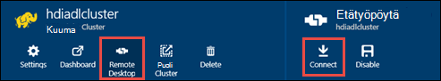

<properties
   pageTitle="Luo HDInsight klustereiden Azure Lake Tietosäilölle Resurssienhallinta mallien avulla | Microsoft Azure"
   description="Luominen ja käyttäminen HDInsight klustereiden Azure tietojen järvi kaupan Azure Resurssienhallinta mallien avulla"
   services="data-lake-store,hdinsight"
   documentationCenter=""
   authors="nitinme"
   manager="jhubbard"
   editor="cgronlun"/>

<tags
   ms.service="data-lake-store"
   ms.devlang="na"
   ms.topic="article"
   ms.tgt_pltfrm="na"
   ms.workload="big-data"
   ms.date="10/21/2016"
   ms.author="nitinme"/>

# <a name="create-an-hdinsight-cluster-with-data-lake-store-using-azure-resource-manager-template"></a>Luo HDInsight-klusterin järvi tietovaraston Azure Resurssienhallinta-mallin avulla

> [AZURE.SELECTOR] - [Portaalissa](data-lake-store-hdinsight-hadoop-use-portal.md) - [PowerShellillä](data-lake-store-hdinsight-hadoop-use-powershell.md) - [resurssien hallinnan avulla](data-lake-store-hdinsight-hadoop-use-resource-manager-template.md)

Opettele Azure Resurssienhallinta-mallin avulla voit määrittää HDInsight-klusterin Azure Lake Tietosäilölle käyttöönsä. Tässä versiossa joitakin tärkeitä asioita:

-   **Saat ohjattu varausyksiköt (Linux) ja Hadoop/myrsky varausyksiköt (Windows ja Linux)**, järvi tietovaraston vain voidaan lisätallennustilaa-tilinä. Näiden klustereiden tallennustilan oletustili on Azure tallennustilan BLOB-objektit (WASB).

-   **Saat HBase varausyksiköt (Windows ja Linux)**, järvi tietovaraston voidaan oletusarvon tallennustilan tai lisätallennustilaa.

> [AZURE.NOTE] Joitakin tärkeitä seikkoja huomautuksen.
>
> - Voit luoda HDInsight klustereiden Lake Tietosäilölle käyttöönsä on käytettävissä vain HDInsight-versioiden 3.2 ja 3.4 (for Hadoop, HBase ja myrsky klustereiden Windows sekä Linux). Ohjattu klustereiden Linux-asetus on käytettävissä vain HDInsight 3.4 klustereiden käyttöön.
>
> - Edellä mainittua järvi tietosäilö on käytettävissä oletusarvon tallennustila klusterin Jotkin tiedostotyypit (HBase) ja lisää tallennustilaa klusterin muuntyyppisten (Hadoop, ohjattu myrsky). Käyttämällä järvi tietovaraston lisätallennustilaa tiliksi ei vaikuta suorituskykyyn tai luku ja kirjoita tallennustilan klusterista mahdollisuus. Tilanteessa, jossa järvi tietovaraston käytetään tallennustilaa klusterin liittyvät tiedostot (kuten lokit, jne.) on kirjoitettu oletusarvon storage (Azure-BLOB), kun järvi tietovaraston tili voidaan tallentaa tiedot, joita haluat käsitellä.
>

Tässä artikkelissa on valmistella Hadoop-klusterin tietojen järvi kaupan kuin lisätallennustilaa.

## <a name="prerequisites"></a>Edellytykset

Ennen kuin aloitat Tässä opetusohjelmassa, sinun on oltava seuraavasti:

-   **Azure-tilaus**. Katso [Hae Azure maksuttoman kokeiluversion](https://azure.microsoft.com/pricing/free-trial/).

-   **Azure PowerShell 1.0 tai suurempi**. Katso, [miten voit asentaa ja määrittää PowerShellin Azure](../powershell-install-configure.md).

- **Azure Active Directory-palvelun lyhennys**. Tämän opetusohjelman vaiheita on ohjeet luomisesta Azure AD-palvelun lyhennyksen. On kuitenkin olla Azure AD-järjestelmänvalvoja voi luoda palvelun lyhennyksen. Jos olet Azure AD-järjestelmänvalvoja, voit ohittaa tämän edellytyksenä ja jatka opetusohjelman.
    
    **Jos et ole Azure AD-järjestelmänvalvoja**, osaat ei tarvitse luoda palvelun lyhennys toimien. Siinä tapauksessa Azure AD-järjestelmänvalvojan on luotava palvelun lyhennys ennen kuin voit luoda HDInsight-klusterin järvi tietosäilö. Lisäksi palvelun lyhennys on luotava sertifikaatilla, kuvatulla tavalla, [Luo sertifikaatti pääasiallista palvelu](../resource-group-authenticate-service-principal.md#create-service-principal-with-certificate).

## <a name="create-an-hdinsight-cluster-with-azure-data-lake-store"></a>Luo HDInsight-klusterin Azure järvi tietosäilö

Resurssienhallinta-mallien ja mallia edellytyksistä ovat käytettävissä osoitteessa [käyttöönotto HDInsight Linux-klusterin uudet tiedot järvi kaupan](https://github.com/Azure/azure-quickstart-templates/tree/master/201-hdinsight-datalake-store-azure-storage)GitHub. Noudata HDInsight-klusterin luominen Azure tietojen järvi kaupan Lisää tallennustilaa kuin linkistä annettuja ohjeita.

Ohjeita edellä mainituista linkki edellyttävät PowerShell. Ennen kuin aloitat näiden ohjeiden avulla, varmista, että kirjaudut Azure-tili. Avaa uuden ikkunan PowerShellin Azure työpöydän ja syötä seuraavat katkelmat. Kirjaudu sisään pyydettäessä Varmista, että kirjaudut yhtenä tilauksen admininistrators/omistaja:

```
# Log in to your Azure account
Login-AzureRmAccount

# List all the subscriptions associated to your account
Get-AzureRmSubscription

# Select a subscription
Set-AzureRmContext -SubscriptionId <subscription ID>
```

## <a name="upload-sample-data-to-the-azure-data-lake-store"></a>Tietojen lataaminen järvi Azure tietosäilö

Resurssienhallinta-mallin Luo uuden järvi tietovaraston tilin ja liittää sen HDInsight-klusterin. Mallitietojen on nyt lataaminen järvi tietovaraston. Tarvitset näitä tietoja myöhemmin-opetusohjelman suorittamaan töitä HDInsight-klusterin, jotka käyttävät järvi tietovaraston tietoja. Ohjeita siitä, miten voit ladata tiedostoja on artikkelissa [tiedoston järvi tietovaraston lataaminen](data-lake-store-get-started-portal.md#uploaddata). Jos etsit joitakin mallitietoja lataaminen, saat **Ambulanssi Data** -kansion [Azure tietojen Lake Git säilöön](https://github.com/Azure/usql/tree/master/Examples/Samples/Data/AmbulanceData).

## <a name="set-relevant-acls-on-the-sample-data"></a>Määritä haluamasi käyttöoikeusluettelot esimerkkitiedot

Varmista, että lataat mallitiedot on käytettävissä olevat HDInsight-klusterin, sinun on varmistettava, Azure AD-sovellus, jota käytetään muodostaa tunnistetietojen HDInsight-klusterin ja järvi tietovaraston välillä on tiedosto tai kansio, jota yrität käyttää käyttöoikeus. Voit tehdä tämän toimimalla seuraavasti.

1.  Etsi Azure AD-sovellus, joka on liitetty HDInsight-klusterin ja järvi tietovaraston nimi. Avaa HDInsight-klusterin sivu, jonka loit Resurssienhallinta-mallin avulla, valitse **Klusterin AAD käyttäjätiedot** -välilehti ja Etsi **Palvelun lyhennys näyttönimi**arvo on yksi tapa Etsi nimi.

2.  Anna nyt tiedosto tai kansio, jota haluat käyttää HDInsight-klusterin access Azure AD-sovellukselle. Määritä oikea käyttöoikeusluettelot tiedosto tai kansio järvi säilössä, on kohdassa [Securing tietojen järvi tietosäilö](data-lake-store-secure-data.md#assign-users-or-security-group-as-acls-to-the-azure-data-lake-store-file-system).

## <a name="run-test-jobs-on-the-hdinsight-cluster-to-use-the-data-lake-store"></a>Suorita testi työt HDInsight-klusterin käyttämään järvi tietosäilö

Kun olet määrittänyt HDInsight-klusterin, voit suorittaa testin työt klusterin Testaa, että HDInsight-klusterin käyttää järvi tietosäilö. Voit tehdä olemme suoritetaan otoksen rakenteen työn, joka luo taulukon, voit ladata aiemmin järvi tietovaraston mallitietoja käyttämällä.

### <a name="for-a-linux-cluster"></a>Linux-klusterin

Tässä osassa on SSH klusterin ja suorita rakenne esimerkkikyselyn. Windows ei tarjoa valmiin SSH asiakas. On suositeltavaa käyttää **painovärit, muste**, joka voi ladata [http://www.chiark.greenend.org.uk/~sgtatham/putty/download.html](http://www.chiark.greenend.org.uk/~sgtatham/putty/download.html).

Lisätietoja painovärit, muste on artikkelissa [Käyttäminen SSH kanssa Linux-pohjaiset Hadoop-HDInsight Windows ](../hdinsight/hdinsight-hadoop-linux-use-ssh-windows.md).

1.  Kun yhteys on muodostettu, Käynnistä rakenne-CLI käyttämällä seuraava komento:

    ```
    hive
    ```

2.  Käytä CLI, kirjoita seuraavista väittämistä mallitietojen avulla järvi tietovaraston **ajoneuvot** uuden taulukon luominen:

    ```
    DROP TABLE vehicles;
    CREATE EXTERNAL TABLE vehicles (str string) LOCATION 'adl://<mydatalakestore>.azuredatalakestore.net:443/';
    SELECT * FROM vehicles LIMIT 10;
    ```

    Näyttöön tulee tulos seuraavankaltaiselta:

    ```
    1,1,2014-09-14 00:00:03,46.81006,-92.08174,51,S,1
    1,2,2014-09-14 00:00:06,46.81006,-92.08174,13,NE,1
    1,3,2014-09-14 00:00:09,46.81006,-92.08174,48,NE,1
    1,4,2014-09-14 00:00:12,46.81006,-92.08174,30,W,1
    1,5,2014-09-14 00:00:15,46.81006,-92.08174,47,S,1
    1,6,2014-09-14 00:00:18,46.81006,-92.08174,9,S,1
    1,7,2014-09-14 00:00:21,46.81006,-92.08174,53,N,1
    1,8,2014-09-14 00:00:24,46.81006,-92.08174,63,SW,1
    1,9,2014-09-14 00:00:27,46.81006,-92.08174,4,NE,1
    1,10,2014-09-14 00:00:30,46.81006,-92.08174,31,N,1
    ```

### <a name="for-a-windows-cluster"></a>Windows-klusterin

Seuraavat cmdlet-komennot avulla voit suorittaa kyselyn rakenne. Kyselyn luominen taulukon tiedoista järvi tietovaraston ja suorita valintakysely luodun taulukon.

```
$queryString = "DROP TABLE vehicles;" + "CREATE EXTERNAL TABLE vehicles (str string) LOCATION 'adl://$dataLakeStoreName.azuredatalakestore.net:443/';" + "SELECT * FROM vehicles LIMIT 10;"

$hiveJobDefinition = New-AzureRmHDInsightHiveJobDefinition -Query $queryString

$hiveJob = Start-AzureRmHDInsightJob -ResourceGroupName $resourceGroupName -ClusterName $clusterName -JobDefinition $hiveJobDefinition -ClusterCredential $httpCredentials

Wait-AzureRmHDInsightJob -ResourceGroupName $resourceGroupName -ClusterName $clusterName -JobId $hiveJob.JobId -ClusterCredential $httpCredentials
```

Tämä on seuraava tulos. **ExitValue** 0 tulosteesta ehdottaa työn onnistui.

```
Cluster         : hdiadlcluster.
HttpEndpoint    : hdiadlcluster.azurehdinsight.net
State           : SUCCEEDED
JobId           : job_1445386885331_0012
ParentId        :
PercentComplete :
ExitValue       : 0
User            : admin
Callback        :
Completed       : done
```

Noutaa tulosteen työn seuraavat cmdlet-komennolla:

```
Get-AzureRmHDInsightJobOutput -ClusterName $clusterName -JobId $hiveJob.JobId -DefaultContainer $containerName -DefaultStorageAccountName $storageAccountName -DefaultStorageAccountKey $storageAccountKey -ClusterCredential $httpCredentials
```

Työn tulos näyttää jotakuinkin seuraavasti:

```
1,1,2014-09-14 00:00:03,46.81006,-92.08174,51,S,1
1,2,2014-09-14 00:00:06,46.81006,-92.08174,13,NE,1
1,3,2014-09-14 00:00:09,46.81006,-92.08174,48,NE,1
1,4,2014-09-14 00:00:12,46.81006,-92.08174,30,W,1
1,5,2014-09-14 00:00:15,46.81006,-92.08174,47,S,1
1,6,2014-09-14 00:00:18,46.81006,-92.08174,9,S,1
1,7,2014-09-14 00:00:21,46.81006,-92.08174,53,N,1
1,8,2014-09-14 00:00:24,46.81006,-92.08174,63,SW,1
1,9,2014-09-14 00:00:27,46.81006,-92.08174,4,NE,1
1,10,2014-09-14 00:00:30,46.81006,-92.08174,31,N,1
```

## <a name="access-data-lake-store-using-hdfs-commands"></a>Accessin Lake Tietosäilölle HDFS-komentojen käyttäminen

Kun olet määrittänyt käyttämään järvi tietovaraston HDInsight-klusterin, voit HDFS shell-komennot käyttämään kauppa.

### <a name="for-a-linux-cluster"></a>Linux-klusterin

Tässä osassa sinun tulee SSH klusterin kyselyjä ja suorita HDFS-komennot. Windows ei tarjoa valmiin SSH asiakas. On suositeltavaa käyttää **painovärit, muste**, joka voi ladata [http://www.chiark.greenend.org.uk/~sgtatham/putty/download.html](http://www.chiark.greenend.org.uk/~sgtatham/putty/download.html).

Lisätietoja painovärit, muste on artikkelissa [Käyttäminen SSH kanssa Linux-pohjaiset Hadoop-HDInsight Windows ](../hdinsight/hdinsight-hadoop-linux-use-ssh-windows.md).

Kun yhteys on muodostettu, järvi tietovaraston tiedostojen HDFS tiedostojärjestelmän-komennon avulla.

```
hdfs dfs -ls adl://<Data Lake Store account name>.azuredatalakestore.net:443/
```

Tiedosto, jonka voit ladata aiemmin järvi tietovaraston näyttöön tulevat.

```
15/09/17 21:41:15 INFO web.CaboWebHdfsFileSystem: Replacing original urlConnectionFactory with org.apache.hadoop.hdfs.web.URLConnectionFactory@21a728d6
Found 1 items
-rwxrwxrwx   0 NotSupportYet NotSupportYet     671388 2015-09-16 22:16 adl://mydatalakestore.azuredatalakestore.net:443/mynewfolder
```

Voit käyttää myös `hdfs dfs -put` joidenkin tiedostojen lataaminen järvi tietovaraston ja käytä sitten komento `hdfs dfs -ls` voit tarkistaa, onko tiedostojen lataaminen onnistui.

### <a name="for-a-windows-cluster"></a>Windows-klusterin

1.  Kirjaudu uudessa [Azure-portaalissa](https://portal.azure.com).

2.  Valitsemalla **Selaa**ja valitse **HDInsight klustereiden**, jonka loit HDInsight-klusterin.

3.  Klusterin-sivu- **Etätyöpöytä**ja valitse sitten **Yhdistä** **Etätyöpöytä** -sivu.

    

    Kirjoita pyydettäessä antamasi remote työpöydän käyttäjän tunnistetiedot.

4.  Käynnistä Windows PowerShell Etäistunto ja HDFS tiedostojärjestelmän komentojen avulla voit näyttää järvi Azure tietovaraston tiedostot.

    ```
    hdfs dfs -ls adl://<Data Lake Store account name>.azuredatalakestore.net:443/
    ```

    Tiedosto, jonka voit ladata aiemmin järvi tietovaraston näyttöön tulevat.

    ```
    15/09/17 21:41:15 INFO web.CaboWebHdfsFileSystem: Replacing original urlConnectionFactory with org.apache.hadoop.hdfs.web.URLConnectionFactory@21a728d6
    Found 1 items
    -rwxrwxrwx   0 NotSupportYet NotSupportYet     671388 2015-09-16 22:16 adl://mydatalakestore.azuredatalakestore.net:443/vehicle1_09142014.csv
    ```

    Voit käyttää myös `hdfs dfs -put` joidenkin tiedostojen lataaminen järvi tietovaraston ja käytä sitten komento `hdfs dfs -ls` voit tarkistaa, onko tiedostojen lataaminen onnistui.

## <a name="next-steps"></a>Seuraavat vaiheet

-   [Tietojen kopioiminen Azure-tallennustilan BLOB järvi tietosäilö](data-lake-store-copy-data-wasb-distcp.md)
