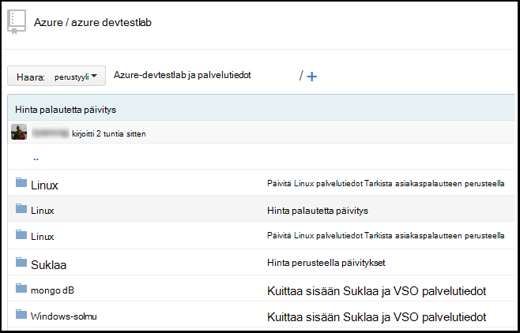
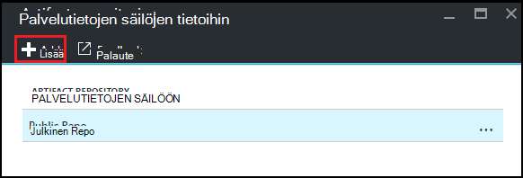
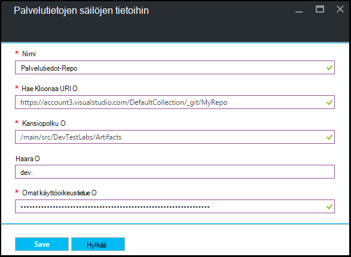

<properties
    pageTitle="Säilön Git Palvelutietojen lisääminen Azure DevTest harjoituksia-kurssin | Microsoft Azure"
    description="Lisää mukautettu palvelutiedot lähde GitHub tai Visual Studio Team Services Git säilö Azure DevTest harjoituksia"
    services="devtest-lab,virtual-machines,visual-studio-online"
    documentationCenter="na"
    authors="tomarcher"
    manager="douge"
    editor=""/>

<tags
    ms.service="devtest-lab"
    ms.workload="na"
    ms.tgt_pltfrm="na"
    ms.devlang="na"
    ms.topic="article"
    ms.date="09/06/2016"
    ms.author="tarcher"/>

# Säilön Git Palvelutietojen lisääminen Azure DevTest harjoituksia-testiympäristössä

> [AZURE.VIDEO how-to-add-your-private-artifacts-repository-in-a-devtest-lab]

Azure DevTest harjoituksia palvelutiedot ovat *Toiminnot* - esimerkiksi ohjelmiston tai käynnissä komentosarjojen ja komennot – asentaminen AM luomisen yhteydessä. Oletusarvon mukaan kurssin sisältää palvelutiedot virallinen Azure DevTest harjoituksia Palvelutietojen säilöstä. Voit lisätä oman kurssin sisältämään palvelutiedot ryhmäsi luomaa Git Palvelutietojen säilö. Säilön voidaan ylläpitää [GitHub](https://github.com) tai [Visual Studio ryhmän Services (VSTS)](https://visualstudio.com).

- Lisätietoja GitHub säilön luomisesta on artikkelissa [GitHub Bootcamp](https://help.github.com/categories/bootcamp/).
- Lisätietoja Team Services projektin luominen Git säilön kanssa on artikkelissa [etäyhteyden muodostaminen Visual Studio Team Services](https://www.visualstudio.com/get-started/setup/connect-to-visual-studio-online).

Seuraavassa näyttökuvassa näkyy esimerkki siitä, miten voi tallentaa, joka sisältää palvelutiedot voi näyttää GitHub:  

## Hanki säilö tiedot ja tunnistetiedot

Voit lisätä oman kurssin Palvelutietojen säilöön, sinun täytyy saada tiettyjä tietoja oman säilöstä. Seuraavissa osissa opastaa käytön Palvelutietojen säilöjen tietoihin isännöimät GitHub ja Visual Studio Team Services tiedot.

### Hanki GitHub säilöön Kloonaa URL-osoite ja henkilökohtainen access suojaustunnuksen

Jos haluat saada GitHub säilöön Kloonaa URL-osoite ja henkilökohtainen käyttöoikeustietue, toimi seuraavasti:

1. Siirry GitHub säilö, joka sisältää Palvelutietojen aloitussivulle.

1. Valitse **Kloonaa tai Lataa**.

1. Valitse Kopioi Leikepöydälle **HTTPS Kloonaa URL-osoite** -painike ja Tallenna URL-Osoitteen myöhempää käyttöä varten.

1. Valitse profiili-kuva GitHub oikeassa yläkulmassa ja sitten **asetukset**.

1. Valitse vasemman reunan **Omat asetukset** -valikosta **Omat access tunnusten**.

1. Valitse **Luo uusi tunnus**.

1. **Uusi henkilökohtainen käyttöoikeustietue** sivulla **tunnuksen kuvaus**, Hyväksy oletusarvon kohteita, **Valitse käyttöalueen**ja valitse sitten **Luo tunnuksen**.

1. Tallenna luotu tunnuksen, kun tarvitset sitä myöhemmin.

1. Voit sulkea GitHub nyt.   

1. Siirry [Yhdistä oman kurssin Palvelutietojen säilöön](#connect-your-lab-to-the-artifact-repository) -osioon.

### Hanki Visual Studio Team Services säilöön Kloonaa URL-osoite ja henkilökohtainen access tunnus

Jos haluat saada Visual Studio Team Services säilöön Kloonaa URL-osoite ja henkilökohtainen käyttöoikeustietue, toimi seuraavasti:

1. Ryhmän sivustokokoelman kotisivulle (esimerkiksi `https://contoso-web-team.visualstudio.com`), ja valitse sitten Palvelutietojen projekti.

1. Valitse projekti-aloitussivulla **koodi**.

1. Voit tarkastella **projektin koodisivu** Kloonaa URL-Osoitteen, valitse **Kloonaa**.

1. Tallentavat URL-osoite on jäljempänä tässä opetusohjelmassa olevassa.

1. Voit luoda omat Access-tunnuksen, valitse **Oma profiili** käyttäjän tilin avattavasta valikosta.

1. Valitse profiilin tiedot-sivulla **Suojaus**.

1. Valitse **Suojaus** -välilehdessä **Lisää**.

1. **Luo henkilökohtainen käyttöoikeustietue** -sivulla:

    - Kirjoita **kuvaus** tunnuksen.
    - Valitse **180 päivää** **Vanhenee-** luettelosta.
    - Valitse **kaikkien käytettävissä tilien** **tilit** -luettelosta.
    - Valitse **Kaikki alueet** -vaihtoehto.
    - Valitse **Luo tunnuksen**.

1. Kun olet valmis, uusi tunnus näkyy **Omat Access tunnusten** -luettelossa. Valitse **Kopioi vahvistustunnuksen**ja Tallenna vahvistustunnuksen arvo myöhempää käyttöä varten.

1. Siirry [Yhdistä oman kurssin Palvelutietojen säilöön](#connect-your-lab-to-the-artifact-repository) -osioon.

##Muodostaa yhteyttä kurssin Palvelutietojen säilöön

1. Kirjautuminen [Azure portal](http://go.microsoft.com/fwlink/p/?LinkID=525040).

1. Valitse **Lisää palveluja**ja valitse sitten luettelosta **DevTest harjoituksia** .

1. Valitse haluamasi testiympäristössä harjoituksia-luettelosta.   

1. Valitse sivu kurssin **määritys**.

1. Valitse **Palvelutiedot säilöjen tietoihin**kurssin **määritys** -sivu.

1. Valitse **+ Lisää** **Palvelutiedot säilöjen tietoihin** -sivu.

    
 
1. Määritä toisen **Palvelutiedot säilöjen tietoihin** -sivu seuraavasti:

    - **Nimi** - säilö nimi.
    - **Git Kloonaa URL-osoite** - kenttään Git HTTPS Kloonaa URL-osoite, jonka kopioit aiemmin GitHub tai Visual Studio Team Services. 
    - **Kansiopolku** - kansion polku suhteessa Kloonaa URL-osoite, joka sisältää Palvelutietojen määritykset.
    - **Haara** - Anna haaran noutamaan Palvelutietojen määrityksiä.
    - **Omat Access suojaustunnuksen** - Kirjoita omat käyttöoikeustietue, olet hankkinut aiemmin GitHub tai Visual Studio Team Services. 
     
    

1. Valitse **Tallenna**.

[AZURE.INCLUDE [devtest-lab-try-it-out](../../includes/devtest-lab-try-it-out.md)]

## Aiheeseen liittyvät blogimerkintöjen
- [Vianmääritys kaatuvat AzureDevTestLabs palvelutiedot](http://www.visualstudiogeeks.com/blog/DevOps/How-to-troubleshoot-failing-artifacts-in-AzureDevTestLabs)
- [Liitos AM aiemmin AD-toimialueen Azure keskihajonta testi kurssin ARM-mallin avulla](http://www.visualstudiogeeks.com/blog/DevOps/Join-a-VM-to-existing-AD-domain-using-ARM-template-AzureDevTestLabs)