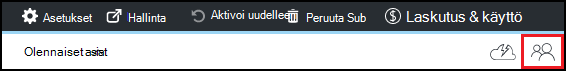

<properties
    pageTitle="Omistajat ja käyttäjien lisääminen Azure DevTest harjoituksia | Microsoft Azure"
    description="Omistajat ja käyttäjien lisääminen Azure DevTest harjoituksia Azure portal tai PowerShellin avulla"
    services="devtest-lab,virtual-machines"
    documentationCenter="na"
    authors="tomarcher"
    manager="douge"
    editor=""/>

<tags
    ms.service="devtest-lab"
    ms.workload="na"
    ms.tgt_pltfrm="na"
    ms.devlang="na"
    ms.topic="article"
    ms.date="09/12/2016"
    ms.author="tarcher"/>

# Azure DevTest harjoituksia omistajat ja käyttäjien lisääminen

> [AZURE.VIDEO how-to-set-security-in-your-devtest-lab]

Access-Azure DevTest harjoituksia ohjataan [Azure Role-Based Access ohjausobjektin (RBAC)](../active-directory/role-based-access-control-what-is.md). Käytä RBAC, voit voit eroteltava tehtäviä ryhmän *roolit* , jossa myönnät käyttäjille Päivittäisten tehtävien suorittamiseen tarvittavat access määrä. Kolme RBAC rooli on *omistaja*, *DevTest harjoituksia käyttäjän*ja *avustaja*. Tässä artikkelissa kerrotaan, mitä toimintoja voidaan suorittaa kunkin kolme tärkeimmät RBAC roolia. Sieltä kerrotaan käyttäjien lisäämisestä kurssin - portaalin kautta ja PowerShell-komentosarjojen kautta ja käyttäjien lisäämisestä tilauksen tasolla.

## Toiminnot, jotka voivat tehdä kussakin roolissa

Sisältää kolme käyttäjälle voi määrittää tärkeimmät roolia:

- Omistaja
- DevTest harjoituksia käyttäjä
- Avustaja

Seuraavassa taulukossa on kuvattu toiminnot, jotka voivat tehdä kussakin rooli käyttäjät:

| **Tämän roolin toiminnot käyttäjät voivat suorittaa** | **DevTest harjoituksia käyttäjä**            | **Omistaja** | **Avustaja** |
|---|---|---|---|
| **Kurssin tehtävät**                          |                              |       |             |
| Käyttäjien lisääminen testiympäristössä                     | Ei                           | Kyllä   | Ei          |
| Kustannukset-asetusten päivittäminen                   | Ei                           | Kyllä   | Kyllä         |
| **AM perus tehtävät**                      |                              |       |             |
| Voit lisätä ja poistaa mukautettuja kuvia           | Ei                           | Kyllä   | Kyllä         |
| Lisätä, päivittää ja poistaa kaavat       | Kyllä                          | Kyllä   | Kyllä         |
| Whitelist Azure Marketplace-kuvat     | Ei                           | Kyllä   | Kyllä         |
| **AM tehtävät**                           |                              |       |             |
| Luo VMs                             | Kyllä                          | Kyllä   | Kyllä         |
| Aloittaa tai lopettaa VMs poistaminen            | Vain käyttäjän luoma VMs | Kyllä   | Kyllä         |
| Päivitä AM käytännöt                     | Ei                           | Kyllä   | Kyllä         |
| Lisää tai poista tietojen levyjä, koska VMs      | Vain käyttäjän luoma VMs | Kyllä   | Kyllä         |
| **Palvelutietojen tehtävät**                     |                              |       |             |
| Voit lisätä ja poistaa Palvelutietojen säilöjen tietoihin   | Ei                           | Kyllä   | Kyllä         |
| Käytä palvelutiedot                        | Kyllä                          | Kyllä   | Kyllä         |

> [AZURE.NOTE] Kun käyttäjä luo AM, kyseisen käyttäjän määritetään automaattisesti luotu AM **omistajan** rooli.

## Omistaja tai käyttäjä lisää kurssin tasolla

Omistajat ja käyttäjät voidaan lisätä kurssin tasolla Azure portaalin kautta. Tämä sisältää Ulkoiset käyttäjät, joilla on kelvollinen [Microsoft-tiliä (MSA)](devtest-lab-faq.md#what-is-a-microsoft-account).
Seuraavat vaiheet opastaa omistaja tai käyttäjä lisätään kurssin Azure DevTest harjoituksia-prosessi:

1. Kirjautuminen [Azure portal](http://go.microsoft.com/fwlink/p/?LinkID=525040).

1. Valitse **Lisää palveluja**ja valitse sitten luettelosta **DevTest harjoituksia** .

1. Valitse haluamasi testiympäristössä harjoituksia-luettelosta.

1. Valitse sivu kurssin **määritys**. 

1. Valitse **käyttäjät** **määritys** -sivu.

1. Valitse **käyttäjät** -sivu **+ Lisää**.

    

1. **Valitse rooli** , sivu, valitse haluamasi rooli. [Toiminnot, jotka voivat tehdä kussakin roolissa](#actions-that-can-be-performed-in-each-role) -osassa on luettelo eri toiminnoista, jotka voivat tehdä käyttäjien omistaja, DevTest käyttäjän ja avustaja roolit.

1. Kirjoita sähköpostiosoite tai määritetty rooli lisättävän käyttäjän nimi **Lisää käyttäjiä** -sivu. Jos käyttäjä ei löydy, näyttöön virhesanoman kerrotaan ongelman. Jos käyttäjä löydy, käyttäjän on luettelossa ja valittuna. 

1. Valitse **Valitse**.

1. Valitse **OK** ja sulje **Lisää access** -sivu.

1. Kun palaat **käyttäjät** -sivu, käyttäjän on lisätty.  

## Ulkoisten käyttäjien lisääminen testiympäristössä, PowerShellin avulla

Lisäksi käyttäjien lisäämistä Azure-portaalissa, voit lisätä oman kurssin käyttämällä PowerShell-komentosarjaa ulkoiselle käyttäjälle. Seuraavassa esimerkissä Muokkaa **arvoja, voit muuttaa** kommentin alapuolella olevasta parametriarvot.
Voit noutaa `subscriptionId`, `labResourceGroup`, ja `labName` arvot Azure-portaalissa kurssin-sivu.

> [AZURE.NOTE]
> Komentosarjan oletetaan, että määritetty käyttäjä on lisätty vieraana Active Directory- ja epäonnistuu, jos se ei ole kirjainkokoa. Kunkin käyttäjän lisäämiseen ei Active Directoryssa kurssin Azure portaalin avulla määrittää käyttäjälle roolin, kuten-kohdassa [Lisää omistaja tai käyttäjä kurssin tasolla](#add-an-owner-or-user-at-the-lab-level).   

    # Add an external user in DevTest Labs user role to a lab
    # Ensure that guest users can be added to the Azure Active directory:
    # https://azure.microsoft.com/en-us/documentation/articles/active-directory-create-users/#set-guest-user-access-policies

    # Values to change
    $subscriptionId = "<Enter Azure subscription ID here>"
    $labResourceGroup = "<Enter lab's resource name here>"
    $labName = "<Enter lab name here>"
    $userDisplayName = "<Enter user's display name here>"

    # Log into your Azure account
    Login-AzureRmAccount
    
    # Select the Azure subscription that contains the lab. 
    # This step is optional if you have only one subscription.
    Select-AzureRmSubscription -SubscriptionId $subscriptionId
    
    # Retrieve the user object
    $adObject = Get-AzureRmADUser -SearchString $userDisplayName
    
    # Create the role assignment. 
    $labId = ('subscriptions/' + $subscriptionId + '/resourceGroups/' + $labResourceGroup + '/providers/Microsoft.DevTestLab/labs/' + $labName)
    New-AzureRmRoleAssignment -ObjectId $adObject.Id -RoleDefinitionName 'DevTest Labs User' -Scope $labId

## Omistaja tai käyttäjä lisää tilauksen tasolla

Azure käyttöoikeudet välittyvät ylätason käyttöalueen lapsen laajuus Azure-tietokannassa. Siksi omistajat Azure-tilaukseen, joka sisältää harjoituksia ovat automaattisesti omistajat näiden harjoituksia. Ne myös omia VMs ja muita resursseja kurssin käyttäjät ja Azure DevTest harjoituksia palvelun luomia. 

Voit lisätä muita omistajat kurssin [Azure portal](http://go.microsoft.com/fwlink/p/?LinkID=525040)-sivu kurssin kautta. Lisätty omistaja laajuus hallinta on kuitenkin kapea enemmän kuin tilauksen omistaja-aluetta. Esimerkiksi lisätty omistajat ei ole kaikkia resursseja, jotka on luotu tilaus DevTest harjoituksia-palvelun täydet oikeudet. 

Jos haluat lisätä Azure tilauksen omistaja, toimi seuraavasti:

1. Kirjautuminen [Azure portal](http://go.microsoft.com/fwlink/p/?LinkID=525040).

1. Valitse **Lisää palveluja**ja valitse sitten **tilaukset** -luettelosta.

1. Valitse haluamasi tilaus.

1. Valitse **Access** -kuvaketta. 

    

1. Valitse **Lisää** **käyttäjiä** -sivu.

    

1. Valitse **Valitse rooli** , sivu **omistaja**.

1. Kirjoita sähköpostiosoite tai johon haluat lisätä omistajaksi käyttäjän nimi **Lisää käyttäjiä** -sivu. Jos käyttäjä ei löydy, saat virhesanoman, kerrotaan ongelman. Jos käyttäjä löydy, kyseisen käyttäjän näkyy kohdassa **käyttäjä** -tekstiruutuun.

1. Valitse sijainti käyttäjänimi.

1. Valitse **Valitse**.

1. Valitse **OK** ja sulje **Lisää access** -sivu.

1. Kun palaat **käyttäjät** -sivu, käyttäjän on lisätty omistaja. Käyttäjän on nyt kaikki harjoituksia luotuihin tämän tilauksen omistaja ja siten, että voit omistajan tehtäviä. 

[AZURE.INCLUDE [devtest-lab-try-it-out](../../includes/devtest-lab-try-it-out.md)]
