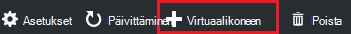
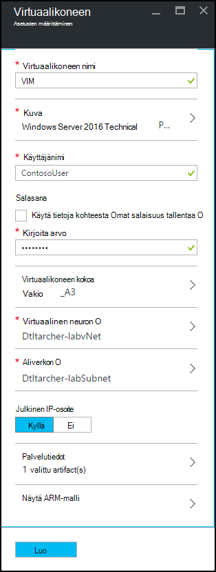
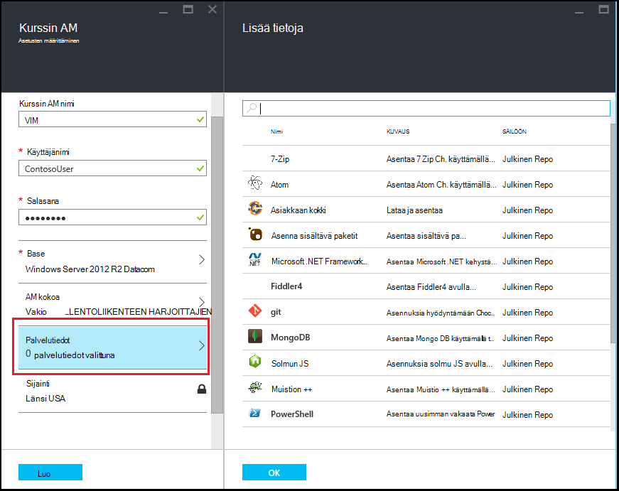
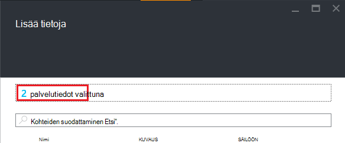

<properties
    pageTitle="Lisää AM ja palvelutiedot Azure DevTest harjoituksia-kurssin | Microsoft Azure"
    description="Opettele lisäämään ja palvelutiedot AM Azure DevTest harjoituksia"
    services="devtest-lab,virtual-machines"
    documentationCenter="na"
    authors="tomarcher"
    manager="douge"
    editor=""/>

<tags
    ms.service="devtest-lab"
    ms.workload="na"
    ms.tgt_pltfrm="na"
    ms.devlang="na"
    ms.topic="article"
    ms.date="08/30/2016"
    ms.author="tarcher"/>

# Kurssin Azure DevTest harjoituksia-ja palvelutiedot AM lisääminen

> [AZURE.VIDEO how-to-create-vms-with-artifacts-in-a-devtest-lab]

Voit luoda AM testiympäristössä *kantaluku* , joka on [Mukautettu kuva](./devtest-lab-create-template.md), [kaavaa](./devtest-lab-manage-formulas.md)tai [Marketplace kuva](./devtest-lab-configure-marketplace-images.md)kohteesta.

DevTest harjoituksia *palvelutiedot* avulla voit määrittää *toimintoja* , jotka suoritetaan, kun AM luodaan. 

Palvelutietojen toiminnot voi suorittaa menettelyt, kuten käynnissä Windows PowerShell-komentosarjojen: Bash komentojen ja ohjelmistojen. 

Palvelutietojen *parametrien* avulla voit mukauttaa tietyn skenaarion Palvelutietojen.

Tässä artikkelissa kerrotaan luomisesta AM oman testiympäristössä palvelutiedot kanssa.

## Lisää AM palvelutiedot kanssa

1. Kirjautuminen [Azure portal](http://go.microsoft.com/fwlink/p/?LinkID=525040).

1. Valitse **Lisää palveluja**ja valitse sitten luettelosta **DevTest harjoituksia** .

1. Harjoituksia luettelosta testiympäristössä, johon haluat luoda AM.  

1. Valitse **+ virtuaalikoneen**kurssin **Yhteenveto** -sivu.  
    

1. Valitse **Valitse on kanta** -sivu on kanta AM.

1. Kirjoita nimi uuden virtuaalikoneen **virtuaalikoneen** -sivu **virtuaalikoneen nimi** -tekstiruutuun.

    

1. Kirjoita **Käyttäjänimi** , jotka myönnetään virtuaalikoneen järjestelmänvalvojan oikeudet.  

1. Jos haluat *salainen säilöön*tallennettuja salasanalla, valitse **Käytä tietoja salainen-kaupasta**ja määritä avainarvon, joka vastaa omaa salaisuus (salasana). Muussa tapauksessa yksinkertaisesti salasanalla, jossa **arvo**tekstikenttään.
 
1. Valitse **virtuaalikoneen koko** ja valitse jokin ennalta määritetyt kohteet, jotka määrittävät suoritin sydämiä, RAM-Muistia koko ja luo AM kiintolevylle kokoa.

1. Valitse **Virtual verkko** ja valitse haluamasi virtual verkon.

1. Valitse **aliverkon** ja aliverkon.

1. Jos testiympäristössä käytäntö on määritetty sallimaan valitun aliverkon julkiseen IP-osoitteet, määrittää, haluatko IP-osoite on julkinen valitsemalla **Kyllä** tai **ei**. Muussa tapauksessa tämä asetus on poistettu käytöstä ja **ei**valittu. 

1. Valitse **tiedot** - ja palvelutiedot - luettelosta ja määritä palvelutiedot, johon haluat lisätä kuvan. 
**Huomautus:** Jos ole ennen käyttänyt DevTest harjoituksia tai määrittäminen palvelutiedot, siirry [Lisää aiemmin luodun Palvelutietojen, AM](#add-an-existing-artifact-to-a-vm) -osaan ja palaa sitten tähän, kun olet valmis.

1. Jos haluat tarkastella tai kopioida Azure Resurssienhallinta-malli, siirry [Azure-Resurssienhallinta Tallenna malli](#save-arm-template) -osassa ja palaa tähän, kun olet valmis.

1. Valitse **Luo** määritetyn AM lisääminen testiympäristössä.

1. Kurssin-sivu näyttää tilan AM-luominen; ensin kuin **luominen**, valitse kuin AM kun **käytössä** on käynnistetty.

1. Siirry kohtaan [Seuraavat vaiheet](#next-steps) . 

## Lisää aiemmin Palvelutietojen AM

Voit lisätä aiemmin palvelutiedot luotaessa AM. Kunkin kurssin sisältää palvelutiedot-julkinen DevTest harjoituksia Palvelutietojen säilöön sekä palvelutiedot, jotka olet luonut ja lisätä omia Palvelutietojen säilöön.
Saat tietää, miten voit luoda palvelutiedot, lue artikkeli [Opettele tekijän oman palvelutiedot DevTest harjoituksia käytettäväksi](devtest-lab-artifact-author.md).

1. Valitse **palvelutiedot** **virtuaalikoneen** -sivu. 

1. Valitse haluamasi Palvelutietojen **lisääminen palvelutiedot** -sivu.  

    

1. Kirjoita tarvittavat parametriarvot ja valinnaisten parametrien, jotka on.  

1. Valitse **Lisää** Palvelutietojen lisääminen ja palaa **Lisää tietoja** -sivu.

1. Jatka palvelutiedot lisäämistä, että AM tarvittaessa.

1. Kun olet lisännyt oman palvelutiedot, voit [muuttaa järjestystä, jossa palvelutiedot suoritetaan](#change-the-order-in-which-artifacts-are-run). Voit myös siirtyä takaisin voit [tarkastella tai muokata Palvelutietojen](#view-or-modify-an-artifact).

## Muuta järjestystä, jossa palvelutiedot määrittäminen

Oletusarvon mukaan palvelutiedot toiminnot suoritetaan siinä järjestyksessä, jossa ne on lisätty AM. Seuraavat vaiheet osoittavat voit muuttaa järjestystä, jossa palvelutiedot suoritetaan.

1. **Lisää tietoja** -sivu yläosassa olevaa linkkiä, joka kertoo, jotka on lisätty AM palvelutiedot valitseminen

    

1. Voit määrittää siinä järjestyksessä, jossa palvelutiedot suoritetaan, vedä ja pudota palvelutiedot haluamaasi järjestykseen. **Huomautus:** Jos sinulla on ongelmia vetämällä Palvelutietojen, varmista, että vedät Palvelutietojen vasemmasta reunasta. 

1. Valitse **OK** , kun olet valmis.  

## Voit tarkastella tai muokata Palvelutietojen

Seuraavat vaiheet kuvaavat siitä, miten voit tarkastella tai muokata Palvelutietojen parametrit:

1. **Lisää tietoja** -sivu yläosassa olevaa linkkiä, joka kertoo, jotka on lisätty AM palvelutiedot valitseminen

    

1. Valitse **Valitut tiedot** -sivu, jota haluat tarkastella tai muokata Palvelutietojen.  

1. Valitse **Palvelutietojen lisääminen** -sivu Tee tarvittavat muutokset ja valitse **OK** ja sulje **Palvelutietojen lisääminen** -sivu.

1. Valitse **OK** ja sulje **Valitut tiedot** -sivu.

## Azure Resurssienhallinta mallin tallentaminen

Azure Resurssienhallinta-malli sisältää sääntöpohjaisesti määrittämään toistettavien käyttöönotto. Seuraavassa kerrotaan, kuinka Azure Resurssienhallinta-mallin tallennus luomisen AM varten.
Kun tallennettu, voit ottaa [käyttöön uuden VMs Azure PowerShellin](../azure-resource-manager/resource-group-overview.md#template-deployment)Azure Resurssienhallinta-malli.

1. Valitse **Näytä KÄDESSÄ malli** **virtuaalikoneen** -sivu.

1. Valitse **Näytä Azure Resurssienhallinta malli sivu**mallia teksti.

1. Kopioi valitun tekstin Leikepöydälle.

1. Valitse **OK** ja sulje **Näytä Azure Resurssienhallinta malli-sivu**.

1. Avaa tekstieditorissa.

1. Liitä Leikepöydän mallin oleva teksti.

1. Tallenna tiedosto myöhempää käyttöä varten.

[AZURE.INCLUDE [devtest-lab-try-it-out](../../includes/devtest-lab-try-it-out.md)]

## Seuraavat vaiheet

- Kun AM on luotu, voit muodostaa yhteyden AM valitsemalla **Yhdistä** AM sivu.
- Lue, miten voit [luoda mukautetun palvelutiedot DevTest harjoituksia-AM varten](devtest-lab-artifact-author.md).
- Tutustu [DevTest harjoituksia KÄDESSÄ pikaopas mallit-osa](https://github.com/Azure/azure-devtestlab/tree/master/ARMTemplates)