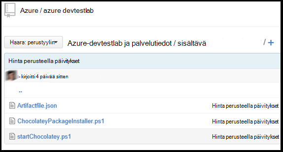

<properties 
    pageTitle="Luo mukautettu palvelutiedot DevTest harjoituksia-AM | Microsoft Azure"
    description="Opettele tekijän oman palvelutiedot DevTest harjoituksia käytettäväksi"
    services="devtest-lab,virtual-machines"
    documentationCenter="na"
    authors="tomarcher"
    manager="douge"
    editor=""/>

<tags
    ms.service="devtest-lab"
    ms.workload="na"
    ms.tgt_pltfrm="na"
    ms.devlang="na"
    ms.topic="article"
    ms.date="08/25/2016"
    ms.author="tarcher"/>

#Luo mukautettu palvelutiedot DevTest harjoituksia-AM

> [AZURE.VIDEO how-to-author-custom-artifacts] 

## Yleiskatsaus
**Palvelutiedot** käytetään käyttöönotto ja määrittäminen sovelluksen jälkeen AM on valmistelun yhteydessä. Palvelutietojen koostuu Palvelutietojen-määritystiedosto ja muut kansion git säilöön tallennettuja komentosarjatiedostoja. Palvelutietojen määritystiedostot koostuvat JSON ja lausekkeita, jotka voit määrittää, mitä haluat asentaa AM. Voit esimerkiksi määrittää Palvelutietojen ja Suorita-komennon parametrit, jotka ovat saatavilla, kun komento suoritetaan nimi. Voit viitata Palvelutietojen määritystiedoston komentosarjan muihin tiedostoihin nimen mukaan.

##Palvelutietojen määritelmä-tiedostomuoto
Seuraavassa esimerkissä esitetään osat, jotka muodostavat määritystiedosto perusrakenteen.

    {
      "$schema": "https://raw.githubusercontent.com/Azure/azure-devtestlab/master/schemas/2015-01-01/dtlArtifacts.json",
      "title": "",
      "description": "",
      "iconUri": "",
      "targetOsType": "",
      "parameters": {
        "<parameterName>": {
          "type": "",
          "displayName": "",
          "description": ""
        }
      },
      "runCommand": {
        "commandToExecute": ""
      }
    }

| Rakenteen nimeä | Pakollinen? | Kuvaus
| ------------ | --------- | -----------
| $schema      | Ei        | JSON-rakennetiedoston, joka auttaa testauksessa määritystiedoston kelpoisuus sijainti.
| otsikko        | Kyllä       | Näyttää testiympäristössä Palvelutietojen nimi.
| kuvaus  | Kyllä       | Näyttää testiympäristössä Palvelutietojen kuvaus.
| iconUri      | Ei        | Testiympäristössä kuvake URI.
| targetOsType | Kyllä       | Mihin Palvelutietojen asennetaan AM käyttöjärjestelmä. Tuetut vaihtoehtoja: Windows- ja Linux.
| Parametrit   | Ei        | Arvot, jotka tarjotaan, kun Palvelutietojen asennuskomento suoritetaan tietokoneessa. Näin mukauttamisessa oman Palvelutietojen.
| SuoritaKomento   | Kyllä       | Palvelutietojen Asenna komento, joka suoritetaan AM.

###Palvelutietojen parametrit

Määritä käyttäjä voi syöttää Palvelutietojen asennettaessa arvot määritystiedostoa parametrit-osassa. Voit viitata nämä arvot Palvelutietojen Asenna-komennolla.

Voit määrittää parametrit on seuraava rakenne.

    "parameters": {
        "<parameterName>": {
          "type": "<type-of-parameter-value>",
          "displayName": "<display-name-of-parameter>",
          "description": "<description-of-parameter>"
        }
      }

| Rakenteen nimeä | Pakollinen? | Kuvaus
| ------------ | --------- | -----------
| tyyppi         | Kyllä       | Parametrin arvon tyyppi. Saat näkyviin luettelon alapuolella sallittu tiedostotyypeille:
| Kyllä, jos näyttönimi       | Parametrin, joka näkyy testiympäristössä käyttäjän nimi.
| kuvaus  | Kyllä       | Parametri, joka näkyy testiympäristössä kuvaus.

Sallitut tyypit ovat:

- merkkijono – mikä tahansa kelvollinen JSON-merkkijono
- INT – mikä tahansa kelvollinen JSON kokonaisluku
- bool – mikä tahansa kelvollinen JSON-totuusarvo
- matriisi – mikä tahansa kelvollinen JSON

##Palvelutietojen lausekkeista ja funktioista

Voit käyttää lauseketta ja funktiot Palvelutietojen muodostaa Asenna komento.
Lausekkeiden ympärillä on hakasulkeet ([ja]), ja arvioidaan Palvelutietojen on asennettu. Lausekkeiden voit näkyvät JSON merkkijonoarvo ja palauttaa aina toiseen JSON-arvon. Jos haluat käyttää täsmällisen merkkijonon, joka alkaa hakasulje [, sinun on käytettävä hakasulkeiden [[.
Yleensä käyttämällä lausekkeissa funktioita muodostaa arvon. Aivan kuten JavaScript--funktiokutsut muotoillut functionName(arg1,arg2,arg3)

Seuraavassa on lueteltu Yleiset toiminnot.

- parameters(parameterName) - palauttaa parametriarvo, joka on annettu, kun Palvelutietojen-komento suoritetaan.
- ketjutettu (arg1, arg2, arg3,...) - yhdistää useita merkkijonoarvoa. Tämä funktio voi kestää jokin muu luku argumenttien.

Seuraavassa esimerkissä lausekkeen ja funktioiden käyttäminen muodostaa arvon.

    runCommand": {
         "commandToExecute": "[concat('powershell.exe -File startChocolatey.ps1'
    , ' -RawPackagesList ', parameters('packages')
    , ' -Username ', parameters('installUsername')
    , ' -Password ', parameters('installPassword'))]"
    }

##Luo mukautettu Palvelutietojen

Luo mukautettu Palvelutietojen seuraavien vaiheiden mukaan:

1. JSON-Editorin asentaminen – tarvitset JSON-editorin Palvelutietojen määritelmä tiedostoista. On suositeltavaa käyttää [Visual Studio koodi](https://code.visualstudio.com/), joka ei ole saatavilla Windows, Linux ja OS X.

1. Hae otoksen artifactfile.json - Azure DevTest harjoituksia ryhmä meidän [GitHub säilöön](https://github.com/Azure/azure-devtestlab) kohtaa, johon on luonut palvelutiedot, joka auttaa sinua monipuolisia valikoiman luoma palvelutiedot uloskuittaus Luo omat tiedot. Lataa Palvelutietojen-määritystiedosto ja muokata luoda omia palvelutiedot.

1. Käyttävät IntelliSense - suorituskykykertoimen IntelliSense Nähdäksesi kelvollinen elementtejä, jotka voidaan käyttää Palvelutietojen-määritystiedostoa. Näet myös osan arvoja eri vaihtoehtoja. Esimerkiksi IntelliSense kerrotaan Windows-tai Linux kahteen **targetOsType** osan muokattaessa.

1. Säilön Palvelutietojen git säilöön
    1. Luo kullekin kansionimi on sama kuin Palvelutietojen Palvelutietojen eri kansion.
    1. Tallentaa luomasi kansion Palvelutietojen määritystiedosto (artifactfile.json).
    1. Tallentaa komentosarjat, joihin viitataan Palvelutietojen Asenna-komennolla.

    Tässä on esimerkki siitä, miten Palvelutietojen kansion voi näyttää:

    

1. Lisää palvelutiedot säilöön - testiympäristössä, lue artikkeli, [Lisää Git Palvelutietojen säilö, johon kurssin](devtest-lab-add-artifact-repo.md).

[AZURE.INCLUDE [devtest-lab-try-it-out](../../includes/devtest-lab-try-it-out.md)]

## Aiheeseen liittyvät blogimerkintöjen
- [Vianmääritys kaatuvat AzureDevTestLabs palvelutiedot](http://www.visualstudiogeeks.com/blog/DevOps/How-to-troubleshoot-failing-artifacts-in-AzureDevTestLabs)
- [Liitos AM aiemmin AD-toimialueen Azure keskihajonta testi kurssin ARM-mallin avulla](http://www.visualstudiogeeks.com/blog/DevOps/Join-a-VM-to-existing-AD-domain-using-ARM-template-AzureDevTestLabs)

## Seuraavat vaiheet

- Lue, miten voit [lisätä Git Palvelutietojen säilö, johon kurssin](devtest-lab-add-artifact-repo.md).
