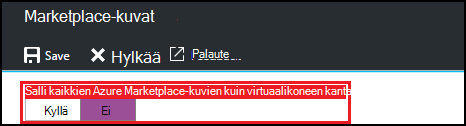
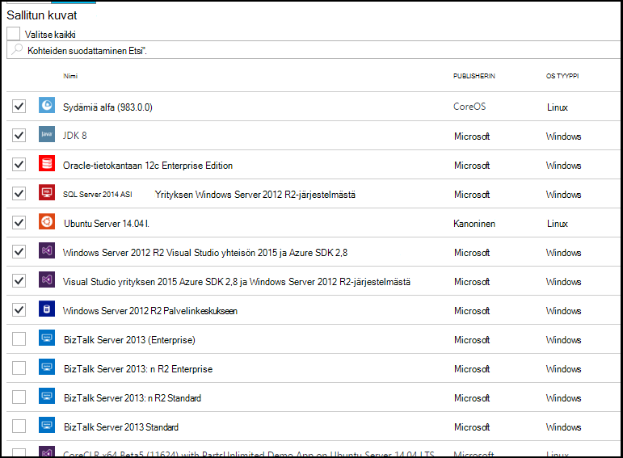

<properties
    pageTitle="Azure Marketplace-kuva-asetusten määrittäminen Azure DevTest harjoituksia | Microsoft Azure"
    description="Määritä, mitkä Azure Marketplace-kuvia voidaan käyttää luotaessa AM Azure DevTest harjoituksia"
    services="devtest-lab,virtual-machines"
    documentationCenter="na"
    authors="tomarcher"
    manager="douge"
    editor=""/>

<tags
    ms.service="devtest-lab"
    ms.workload="na"
    ms.tgt_pltfrm="na"
    ms.devlang="na"
    ms.topic="article"
    ms.date="09/06/2016"
    ms.author="tarcher"/>

# Azure DevTest harjoituksia Azure Marketplacesta kuva-asetusten määrittäminen

DevTest harjoituksia tukee käytettävän oman testiympäristössä luominen-VMs Azure Marketplacesta kuvat sen mukaan, miten olet määrittänyt Azure Marketplacesta kuvia perusteella. Tässä artikkelissa kerrotaan, miten voit määrittää, mitä mahdollisesti Azure Marketplacesta kuvia voidaan käyttää luotaessa VMs testiympäristössä.

## Valitse mitkä Azure Marketplace-kuvat sallittu AM luotaessa

1. Kirjautuminen [Azure portal](http://go.microsoft.com/fwlink/p/?LinkID=525040).

1. Valitse **Lisää palveluja**ja valitse sitten luettelosta **DevTest harjoituksia** .

1. Valitse haluamasi testiympäristössä harjoituksia-luettelosta. 

1. Valitse sivu kurssin **määritys**.
    
1. Valitse kurssin 's **määritys** -sivu, **Marketplace-kuvat**

1. Määrittää, haluatko kaikki hyväksytyt Azure Marketplacesta kuvat ovat käytettävissä, uusi AM pohjana käytettäväksi. Jos valitset **Kyllä**, kaikki Azure Marketplace-kuvia, jotka täyttävät seuraavat ehdot sallitaan testiympäristössä:

    - Kuva Luo yksittäinen AM **ja**
    - Kuvaa käytetään Azure Resurssienhallinta VMs **ja** valmistelu
    - Kuva ei edellytä ylimääräisiä käyttöoikeuksien myöntämistä palvelupaketin ostaminen
    
    Jos haluat sallittavat ole kuvia, tai haluat määrittää, mitkä kuvat voidaan käyttää, valitse **ei**.
 
    
 
1. Jos valitset **ei** edellisessä vaiheessa, **Sallittujen kuvat ja valitse kaikki** -valintaruutu on käytössä. Etsi-ruutuun ja tämä asetus käyttää nopeasti valitseminen tai valinnan poistaminen luettelossa näkyvät kaikki kohteet.
Voit myös valita haluat sallia AM luontia varten yksitellen valitsemalla kunkin kuvan vastaavan valintaruudun Azure Marketplace-kuvat.
Valitse ei mitään-luettelosta, jos et halua sallia Azure Marketplacesta kuvia, jota käytetään testiympäristössä.

    

[AZURE.INCLUDE [devtest-lab-try-it-out](../../includes/devtest-lab-try-it-out.md)]

## Seuraavat vaiheet

Kun olet määrittänyt, miten Azure Marketplacesta kuvia sallittu luotaessa AM, seuraava vaihe on lisättävä [AM, että kurssin](./devtest-lab-add-vm-with-artifacts.md).