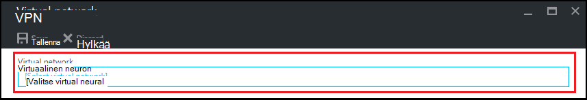

<properties
    pageTitle="Määrittää virtual verkon Azure DevTest harjoituksia | Microsoft Azure"
    description="Lue, miten voit määrittää olemassa olevan verkoston virtual ja aliverkon ja käytä niitä AM Azure DevTest harjoituksia kanssa"
    services="devtest-lab,virtual-machines"
    documentationCenter="na"
    authors="tomarcher"
    manager="douge"
    editor=""/>

<tags
    ms.service="devtest-lab"
    ms.workload="na"
    ms.tgt_pltfrm="na"
    ms.devlang="na"
    ms.topic="article"
    ms.date="09/06/2016"
    ms.author="tarcher"/>

# Azure DevTest harjoituksia virtual verkon määrittäminen

Kuvatulla on artikkelissa, [Lisää AM palvelutiedot kurssin kanssa](devtest-lab-add-vm-with-artifacts.md), kun luot AM testiympäristössä, voit määrittää määritetty virtual verkkoon. Yksi skenaario tekoa on, jos haluat käyttää corpnet resurssien oman VMs virtual verkon, joka on määritetty ExpressRoute tai sivuston sivuston VPN. Seuraavissa osissa osoittavat lisäämisestä aiemmin virtual verkossa kurssin VPN-asetukset niin, että se on käytettävissä, valitse VMs luodessasi.

## Kurssin, Azure-portaalissa virtual verkon määrittäminen
Seuraavat vaiheet opastusta lisääminen kurssin olemassa olevan verkoston virtual (ja aliverkon), niin, että sitä voidaan käyttää luotaessa AM saman testiympäristössä. 

1. Kirjautuminen [Azure portal](http://go.microsoft.com/fwlink/p/?LinkID=525040).

1. Valitse **Lisää palveluja**ja valitse sitten luettelosta **DevTest harjoituksia** .

1. Valitse haluamasi testiympäristössä harjoituksia-luettelosta. 

1. Valitse sivu kurssin **määritys**.

1. Valitse **Virtual verkot**kurssin **määritys** -sivu.

1. Näet määritetty nykyisen testiympäristössä sekä virtual verkko, joka on luotu oman kurssin virtual verkkojen luettelon **Virtual verkot** -sivu. 

1. Valitse **+ Lisää**.

    
    
1. Valitse **Virtual verkko** -sivu **[Valitse VPN]**.

    
    
1. Valitse haluamasi virtual verkon **Valitse virtual verkko** -sivu. Sivu näyttää kaikki saman alueen-testiympäristössä tilauksen alla olevat virtual verkot.  

1. Kun olet valinnut virtual verkkoon, näkyviin tulee **Virtual verkko** -sivu ja useita kenttiä otetaan käyttöön.  

    

1. Kuvaus virtual verkon / kurssin yhdistelmä.

1. Jos aliverkon, jota käytetään testiympäristössä AM luonti, valitse **Käytä IN VIRTUAALIKONEEN LUOMISTA**.

1. Jos julkisten IP-osoitteiden aliverkon, valitse **Salli julkiseen IP**.

1. Määritä **Suurin NÄENNÄISKONEIDEN käyttäjää KOHDEN** , kentän suurin VMs kunkin aliverkon käyttäjää kohden. Jos haluat VMs rajoittamaton määrä, jätä tämä kenttä tyhjäksi.

1. Valitse **Tallenna**.

1. Nyt kun virtual verkko on määritetty, se voidaan valita AM luotaessa. Nähdäksesi luomisesta AM ja määrittää virtual verkon viitata on artikkelissa, [Lisää AM palvelutiedot kurssin kanssa](devtest-lab-add-vm-with-artifacts.md). 

[AZURE.INCLUDE [devtest-lab-try-it-out](../../includes/devtest-lab-try-it-out.md)]

## Seuraavat vaiheet

Kun olet lisännyt haluamasi virtual verkon oman testiympäristössä, seuraava vaihe on lisättävä [AM, että kurssin](devtest-lab-add-vm-with-artifacts.md).